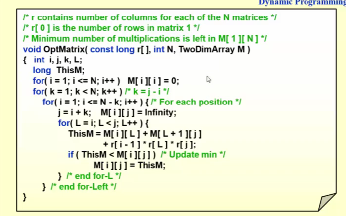

# 高级数据结构与算法

!!! note "ADS学习笔记"
	专业学到现在最难的课程，没有之一，即便是平时有做笔记，考前也有比较充足的时间复习，成绩依旧算不上理想，前半学期的内容比较简单，后半学期的内容每个例子都需要深入理解流程和证明，才可能获得较高的绩点。我Ads是陈老师班的，平时的体验还是很好的，有发言加分，发个两三次平时分就很好满，pre的时候陈老师也很宽容，但凡能管住自己不抄编程题的，强烈建议选陈越老师。

## 课程概况

评分：

* homework 5 + quiz 5（每次上课开始10分钟，pta有个quiz，主要看你课听了没有）
* discussion 10（两人一组，选择上台分享，但一定需要交一个开放性的答案）
* proj + pre review 30 （一学期有8个课题，2人一组，选两个，上台两次，report不限制可以bonus，每次peer review要看两个报告）
* 期中 10
* 期末 40 可覆盖期中，100分卷面，40斩杀

关于陈越老师班所多次强调的Pre要求

1. 需要做PPT，字体要大，不可小于24号字，尽量不要截图代码和严禁太小的数字截图
2. 算法的正确性必须测试
3. 测试数据的生成有必要说明

## 1. Balanced tree

tree的优势在于处理动态的信息

### 1.1 AVL tree

speed up searching, insertion and deletion

树T是平衡的条件是

* TL 和 TR 是平衡的
* |hL - hR| <= 1

空树高度为 -1

BF(node) = hL - hR

**发现问题**

插入的过程之后会从下往上更新BF，通过BF来发现问题，找到第一个被破坏的node

**解决问题**

解决完之后树高不变，因此局部问题不扩散，就是说例如插入之前这段子树高为 2，插入旋转完高为 2

只针对touble finder三个节点

RR rotation 是左旋

LL rotation 是右旋

LR和RL 是双旋

删除有概率需要旋转多个节点

### 1.2 splay tree

AVL的变种，M次连续的删除或插入操作，总时间复杂度O（MlogN）

amortized time is Ologn

这也要求了任意一个操作，都要改变树

每一次访问一个node就 用双旋将其转换到root，向上看两层

X(访问的结点) P G

**deletion**

* find x 会推到root先
* remove x 生成两棵树
* findMax(TL) 此时这个max就会被推到 root of left tree 此时就可以把右子树拼接起来

### 1.3 摊还分析

* 任意连续足够多个操作
* 取最大

定义势函数 -> 存款余额  一定区间内的（存款-花费）

worst-case bound >= amortized bound >= average-case bound

对于amortized 的分析有很多方法

aggregate analysis

accounting method

potential method

### 1.4 red-black tree

**红黑树的性质说明**

red-black tree is a balanced binary search tree

红黑树的结点包括

* parent指针
* left，right指针
* value
* color

红黑树有以下性质

* 每个节点是red or black
* 根节点是 black
* 叶子节点是black （此处的叶子节点与一般的有所差别，红黑树将任意一个NULL pointer视作一个black的叶子节点）
* 若一个节点是red，则它的孩子都是black
* 对于任意节点，所有到达其后代叶子节点的简单路径包含**相同数量**的black nodes

internal node 是指红黑树上真正的结点  
external node s是指那些被视为叶子节点的空指针

black-height 是指对于一个节点而言，其到叶子节点的路径上所有的黑色节点数量（该节点本身不被计算在内）

bh(tree) = bh(root) 可以证明有N个节点的红黑树 其树高 <= 2ln(N+1)

**红黑树的效率证明**

直观来看，红黑树确保了从任意节点到叶子节点的路径长度L，满足（Lmax <= 2 * Lmin）

**insertion**

红黑树的核心在于维持黑高，因此我们事先把新的节点设置为 red

存在一些不同的情形

1. 在黑色节点的孩子处插入红色节点，没有问题
2. 在红色节点的孩子处插入红色节点，这里会有多种情况，我们设置插入节点为N（这里要注意的是，N未必是插入节点，也有可能是因为子树中插入节点后调整导致N变为红色的情形），父亲结点为P，祖父节点为G，父亲结点的兄弟为U  
    已知N is red, P is red, G is black 这三个初始条件是确定的

    1. U is red 我们直接将G变为red，然后将P和U都设置成black，这样黑高就被维持了，但由于G变为了red，需要向上递归操作
    2. U is black 并且 N 是 P 的右孩子  对P进行左旋，转换成case3
    3. U is black 并且 N 是 P 的左孩子  对G进行右旋，并且P，G交换颜色，性质恢复
3. 在上述的2.1情况下，若P是根节点，要将其重新设置为黑色，此时全树的黑高+1

​​

‍

自顶向下的插入

**deletion**

对于AVL-tree而言，deletion并不一定能保持局部性，存在递归向上rotation的可能，而red-black tree最多需要三次rotation来完成

对于删除操作而言，我们只需考虑要删除的那个node是black的情形，只有这种情况影响黑高

首先我们可以确定的是，要删除的node我们设其为D

1. D 有左孩子，无右孩子，此时D必定为black node其左孩子必定为red node（否则黑高不平衡），做法就是交换D和左孩子，并且交换完剩下的结点为黑色（原本这块地方的黑高就是1）
2. D 有右孩子，无左孩子，与上述情况一致，交换，最后留下黑色节点
3. D 同时有左孩子和右孩子 ，将D与前驱（后继）节点做值的交换（不交换颜色），最后情况可以转换为1,2和4
4. D 为常规意义上的叶子节点，此时定义D的兄弟节点为S，其兄弟的左孩子记为SL，右孩子记为SR，DS的父节点记作P，假设D为的P左孩子，S为右孩子，

    1. 若D为red，直接删除
    2. 若D为black，P为black，S为red，则SL和SR必定都存在且为black，做法：把P设置红，将S设置黑，对P做左旋，未解决
    3. 若D为black，P为red，S，SL，SR是black，做法：把P设置为黑，S设置为红，解决，删除原始D
    4. 若D为black，P为black，S，SL，SR均为black，做法：把S设置为红，并且将D向上递归，未解决
    5. 若D为black，P为未知颜色，S为black，SL为red，SR不存在，做法：S设置为红，SL设置为black，对S做右旋，未解决
    6. 若D为black，P为未知颜色，S为black，SR为red，无视SL，做法：P，SR设置为black，S设置为red，对P做左旋，解决，删除原始D

​​

**AVL-tree VS RB-tree**

红黑树旋转的次数更少，但是记得所有操作对于红黑和AVL都是O（logn）

AVL 和 红黑树的插入操作都是<=2次旋转

但是AVL的deletion是O(logN)次旋转，红黑树则是<=3次旋转

在查询的表现上，AVL树稍微优于红黑树

### 1.5 B+ tree

B树常见于块状存储，例如文件管理系统和数据库管理系统

与上述的balanced tree不同的是，B+tree并非是二叉树，它可以是M阶的tree

* 根节点是叶子，或者有2到M个孩子
* 非根非叶节点，有M/2的上取整 到 M 个孩子
* 叶子节点 M/2的上取整 到 M 个 values
* 所有叶子都在同一深度
* 左孩子小于key，右孩子大于等于key

对于K阶B+树，每个非叶子节点可以有K-1个数值，衍生出至多K个children，叶子节点至多K个values

B+ tree的构建是自底向上

**构建**

其他树的构建就是从0开始的插入，但是B+ tree的构建是不同的？

**insert**

当叶子节点的内部的value过多的时候，就把叶子节点分裂，把中间数据移交给父节点

tips 叶子节点的移交是单纯加到父节点上；非叶子节点的移交是删掉自己的，交给父节点

上述做法是直接的，但是如果需要树的结构更加紧凑的话，最好在叶子节点移交value之前，先check一下有无不满的兄弟节点，在兄弟节点内部做一些操作，使树更加满

**deletion**

类似与insert，与兄弟合并，多了就再拆分

**效率分析**

对每个节点做操作，也就是对M的数组做操作，O（M）

​​

M is 3, 4 是一般情况下的优选

find是ologn

O(MlogM<sup>n</sup> )      跳表处理非叶子节点（数组不适合插入，链表不适合二分查找）

## inverted file

倒排索引产生早于搜索引擎，正排索引就是根据文本  对应 关键词

上述的所有平衡树的最终目的都在于建立一个良好的搜索系统

本章来讨论如何建立这样一个良好的系统

Term-document incidence matrix

建立一个二维数组，一维是文本的编号，一维是各种词，这样我输入一个词，很容易能找到所有与其有关的文本

也可以轻松地查询组合的文本

​​

问题在于，一旦词的范围变大，这个矩阵毫无疑问会浪费巨大的空间，同时稀疏的矩阵也会严重降低查询的效率

这个问题我们在图的存储中也遇到过，有了经验我们很自然会想到用链表来存储

### inverted file index

首先来定义index，index是一个机制定位文本中的一个事物

inverted file 存储这一个list的指针，对于在文本中所有出现的事物，同上文的词一样，所有的词都对其存在的文本存有一个指针

​​

我们除了存储指向文本的指针以外，最好还能存储其在该文本中的位置

term dictionary -> posting list

之所以我们除了文本指针和位置以外还要存储该term出现的次数，是因为如果要多个term一起查询（sentence查询）的话，最好是从最少出现的term地方开始检索

### index generator

对于上述的index，我们设计一个generator

​​

上述代码看似很简单，实际存在很多难点

难点一在于`read a term T in D`​之中，因为这个term难以界定，例如中文之中，张三这个词，究竟是以“张三”被收录还是1以“张”，“三”被收录？即便在英文之中，也有artificial intelligenece这种连贯的词组

难点二在于`Find(Dictionary, T)`​上，这意味着我们需要建立有效的索引机制

上述难点使得search enigne产生了许多的modules

**token analyzer plus the stop filter**

当我们在读入term的时候，我们有以下工作要做

* word  stemming  也就是让单词变成原型 said -> say
* stop words  对于过分的常见词‘a' 'it'等我们在第一次遇到它们时就在全文本中消除它们，但我们仍然会记录它们，但是不是说任何网页中  ‘a’都是stop words 比如字典网站里面解释'a'的用法

**accessing the terms**

对于索引而言，解决方法有很多

第一种是search tree 一般俩说就是B tree家族，以及Tries tree（是一个很好的处理英文单词的树

第二种是hash，良好的hash函数使得我们可以在常数时间内做索引

相比于B树家族，hash更加擅长索引single word，但是在范围索引上表现不佳，hash table没法做顺序扫描

例如我们输入了错误的词语，如果用B树的话，与其相近的term在物理位置上就在附近，因此我们很容易就能给出那些“可能是你需要的内容”

**memory management**

对于搜索引擎而言，还有隐藏的困难在于memory的管理，因为大量的文本是无法都存在内存里的

​​

problem？

### some topics

**distributed index**

主要针对与数据量过于庞大，导致其需要存储在多个机器上的情形

我们需要一个cluster的machine去处理他，每个machine是cluster上的一个node，很直接地，我们会考虑让每一个node存储collection的一个子集合

* term-partitioned index    只建立部分的词的所有索引
* document-partitioned index  只建立所有的词对于部分文本的索引

在实际的应用中，这两种情形往往组合起来使用

**dynamic indexing**

我们建立一个main index和一个auxiliary index，先把新的documents放到auxiliary index中，再在必要的时候将其合并到main index中

**存在一些问题 如何删除，什么时候re-index**

**compress**

* delete stop words
* 同时可以把结果编码为两数之差，避免过大的index存储

**thresholding 阈值**

对于document而言，我们只检索前x个documents，这些docs按照权重排序，这个x是一个thresholding

但这会有一些问题，例如

* 对于 boolean 查询会产生问题，例如同时查询 'computer' & 'science'
* 会错过一些相关docs

对于query而言，当我们有大量term的时候，我们会对terms进行一个排序，对于其出现的频率进行升序排序（因此会先检索出现频率少的term），只检索一定程度以上的terms

### measures for search engine

这部分主要是讲述了评价搜索引擎的一系列指标

* index 的速度
* search 的速度
* expressiveness of query language   能够应对复杂的索引需求

user happiness

​​

**relevance measurement**

* a benchmark document collection
* a benchmark suite of queries
* a binary assessment of either relevant and irrelevant for each query-doc pair

precision 搜出来的东西里面百分之多少是需要的

recall 想要的正确答案有多少被搜索出来了

## Leftist heap

### basic features

heap是一个很好的结构，leftist heap对于其合并操作做了优化，也就是说要合并两个heap

普通的heap有以下性质（以小顶堆为例）

* 是一颗完全二叉树
* 节点小于自身的子节点

对于一个数组将其构建为一个heap的时间复杂度为O(N) 也就是正常情况下合并两个堆的效率

而在leftist heap中，我们采用指针的形式构建二叉树，虽然指针在单次操作中效率远不如数组好，但是在leftist heap我们得以打破O（N)的复杂度，在性质上，leftist heap

* 节点仍然小于自身子节点
* 是二叉树，但不平衡

在leftist heap中我们定义 null path length (NPL) 指的是node X到没有两个孩子的node的最短路径，特别的 NPL(NULL) = -1

我们自底向上记录NPL NPL(x) = min{NPL(c) + 1 其中c是x的所有children}

leftist heap的特殊性质在于，

* 左孩子的NPL >= 右孩子的NPL

该性质是的leftist heap 存在一些特性，例如

* 其right path为r nodes的情况下，leftist tree至少有2<sup>r</sup> - 1个nodes
* how long is the right path of a leftist heap of N nodes -> O(logN)

right path的短小决定了我们在right path开展的工作都是非常迅速的

对于leftist heap而言，插入是合并的特殊情况

### merge

对于merge操作我们讲述了两种版本，一种是递归的，一种是循环的 （以下叙述均以小根堆为例

**递归**

合并两个树，选择根节点更小的那个，将其右子树和另一颗树结合（此处结合发生递归）在这个过程中我们同时需要通过交换左右子树来维护性质

**删除**

对于左倾堆的删除（deleteMin），我们只需删除掉root，然后merge产生的两个子树即可

### skew heap

就像splay tree和AVL tree的区别一样，skew heap是一种在行为上更简单的heap

对于skew heap来说，它无条件地交换左右子树，无需care NPL

每一次都找到两颗树中小root的那个，交换其左右子树，将其左子树和另一颗树进行merge，形成递归

类似于lefist heap一样完成插入，但是不做交换，最后完成插入之后再从底部递归地调换上来

### amortized analysis of skew heap

将所有违反左倾要求的node记为heavy node，分析merge前后两者的区别

## Binomial queue

Binomial queue的重心也是merge的效率

binomial queue不是一个heap，而是一些heap-ordered trees的集合，每一个heap-orddered tree都是一个binomial tree

**binomial tree的定义**

* 单个节点的tree被称为height 0 的 binomial tree
* 对于一个binomial tree Bk，其必须是一个binomial tree Bk-1 连接到另一个Bk-1的root上

​​

衍生出了一系列的features，例如在深度d上的node数量是

binomial queue和二进制可以形成对应关系

**binomial queue的操作**

* **FindMin**  遍历序列，最小的一定是root，时间复杂度是root的数量，对于有n个node的binomial queue来说，是logN

  我们也可以采取用一个variable去表示最小值，并且实时更新它，使其转换成O1，但是意义不大，因为delete之后还得重新找，还是logN
* **merge** 合并两个queue，想象两个二进制数的加法  
  ​  

  其操作复杂度是O(logN)  是把H2merge到H1，以H1为最后的结果
* **insert** 是merge的特殊情况，注意合并和进位，insert的平均时间是constant的
* **deleteMin** 需要做拆分先find min找到具体那颗树，并且将这课数移除原本的H1，后来我们把分离出来的树deletemin得到一个森林H2，然后我们做合并，总的时间复杂度是OlogN

**operation的implementation**

对于deleteMin 总的queue使用first-child next-sibling representation的方式来组织这些subtree

对于Merge，需要让queue按照decrease size的方式组织的subtrees

​​

单个bin tree的合并是简单，但是整个queue的merge是复杂的

```js
int * p = nullptr;
!!p is 0
int * p = & n;
!!p is 1
```

这是一种判断p是否为空指针的方法

**analysis**

关于插入，最坏时间复杂度是OlogN，但是摊还时间复杂度是O1，任意N个元素的插入的时间复杂度是ON

最大优势在于摊还的建堆操作是ON

binary heap建堆也是ON （自底向上） 一个个插入是ONlogN

## Backtracking

回溯还是枚举，但是不是所有问题都可枚举，比如实数存在

还有一种和回溯联系紧密的方法叫做分支限界，是宽度优先的剪枝，而回溯是深度优先的剪枝

回溯难以分析时间复杂度

A sure-fire way to find the answer to a problem is to make a list of all candidate answers

回溯常用于广搜和深搜，本质在于走回头路

回溯可以帮助我们消除那些显然的错误的测试情形，也就是剪枝pruning，我们通过一些例子来学习回溯算法

### Eight Queens

> 找到一些站位，在8x8的棋盘上，放置八个皇后棋子，使其不会相互处于攻击范围

将棋盘视为一个二维数组，然后

* Q_i 是 queen在第i个row行，因为8x8的棋盘放8个，必然每个row放一个queen
* x_i 是 Q_i 在的 column index 列数

一个解就是一个数列 x_1 - x_8

我们以一个4皇后问题为例，构建出一颗树表示其所有情况

​​

然后对这颗树做深度优先搜索

但是要注意的是，在实际的程序中，这颗树是并不会被实际构造出来的，否则就相当于浪费了回溯的意义

### The Turnpike Reconstruction Problem

> 在一条直线的公路上，有N个收费站从近到远（x1-xN），现在给出任意两个收费站之间的距离的可重复集合（N(N-1)/2）个元素，求收费站的位置，x1 = 0

首先通过这个distance集合里的最大值我们可以确定xN的位置，然后通过次大值我们有对x2和xN-1有两种猜测，每次都考虑下一个最大的值

​​

### tic-tac-toe game

min level递减或者max level递增的时候，就可以剪枝了

## Divide and conquer

分治问题往往和递归结合紧密，

* divide就是把问题分成一个个子问题
* conquer就是递归的解决这些子问题
* Combine就是把子问题的解合并成原问题的解

### Closet Points Problem

给出N个点，找到里面距离最近的一对点

我们采用暴力的方法就是遍历N(N-1) / 2种可能，但是采用分治，将问题转换成，左边，右边和跨过中间分割线三个中的最小，可以降低复杂度

首先，我们先求左右两边各自的最短距离，假设min(left, right) = $\delta$ , 在求跨中间线的最小值的时候，我们可以做优化

​​

只需求绿色线以内的点即可，并且不仅仅是再横向的，我们在纵向范围内，也可以用$\delta$去规范，对于左侧的一个点，可以画出一个$\delta \times 2\delta$的方框，但是注意到左侧和右侧各自的点之间的距离都是要大于$\delta$的，因此这个框能圈住的右侧点是有限的。

### Three method for solving recurrences

对于一个常规的分治法，我们有

$$
T\left (  N\right ) = a \ T\left ( N/b \right ) + f\left ( N \right )
$$

我们往往并不care N/b 是整数还是小数，即便其不能够整除，再多次的divide之后，最后要处理的一个结果也是一个很小的N，对于小规模的数据，我们不介意使用暴力法解决。

#### Substitution method

其本质是guess然后归纳证明，归纳的证明无需从0开始，可以从任意大的常数开始

#### Recursion-tree method

上一种方法的问题在于，如何获得那种优秀的guess，递推的证明反而是比较简单的，该方法就是为了帮助我们获得good guess，对于这样一个式子

$$
T\left (  N\right ) = 3 \ T\left ( N/4 \right ) + \Theta\left ( N^{2} \right )
$$

对于$\Theta(N^{2})$我们可以简单将其化成 $cN^{2}$其中c是常数，我们建立一颗递归树，其实本质就是把这个公式展开，得出尾数是多少

​​

### Master method

$$
8T(N/3) + O(N^{2}logN)
$$

用来判断Combine和Conquer到底哪个对于复杂度占主导作用，关键在于$f(N)$

​​

其公式化形式如上图，可见其并未覆盖所有情况，例如$a = b = 2 , f(N) = NlogN$的情况下，就不满足1，2，3三种情况

可以通过构建递归树对其进行证明

上述结论还有另外两种形式

​​

下面这种形式是一种特殊情况

​​

### 朋辈

* 全部化出来用高中数学公式
* 主定理不适用的情形

  * $T(N) = T(N/3)+T(2N/3)+\log N$ 转换成 $2T(N/2)$
  * $T(n)=2T(\sqrt n)+\log n$  将$n$换元成$2^m$, 上述直接推就行了，如果要应用主定理？
* 分治的应用

  * 归并排序
  * 快速幂
  * 选择问题

    * 两个排好序的数列 $a_1 ...a_n$ 和 $b_1...b_n$
    * 在 $A\cup B$ 中找到第k个元素，使用一般的归并，就是On
    * 我们可以确定这个元素一定在 a1到ak和b1到bk中
    * 然后我们计算$a_{k/2}$和$b_{k/2}$，如果后者大于前者，那么可以将区域减少一半，只存在于$a_{k/2}...a_k$ 和 $b_1...b_{k/2}$，再进行一定的操作
    * 转换成Ologn

## Dynamic programming

DP的目标在于，对于某个子问题，仅解决一次；并且把数据结果存在表中。也即用空间换时间的思想。我们用几个例子来讲解DP

* 分治不成立，dp肯定不成立
* dp必须是在有重复子问题被重复计算的情况下，否则就直接递归了

ps. 递归也可能是dp，记忆化

### Fibonacci Numbers

$$
F(N) = F(N-1)+F(N-2)
$$

我们熟悉的斐波那契数列，其递归方式的解决是异常慢的，我们可以画出其递归树，直观感受其是一个指数级别的复杂度，并且另一个直观感受是其用到了很多次重复的运算

​​

实际将递归版本转化成循环版本就是我们的DP思路了，消耗两个int的空间来存储元素，就可以降低时间复杂度为$O(N)$

​​

### Matrix Multiplication

矩阵的乘法正如我们在线性代数课上学习的那样，我们给出几个连续的矩阵乘法，我们如何做乘法的排序，使得其期间进行的操作最少呢

我们设 $b_{n}$ 是不同方式计算的数量，因为矩阵乘法存在一定限制，不能随意交换顺序，因此$b_{n}$本质是一个加括号问题

首先我们定义一个子问题$M_{ij}$是指计算第i个到第j个矩阵的积的问题，因此我们的问题转化成了$M_{1n} = M_{1i}*M_{in}$的问题，根据这个公式加上$i$的选择问题，我们可以轻易得出以下公式

$$
b_{n} = \sum_{i=1}^{n-1} b_{i}b_{n-i} \ , \ \ \  b_{n} = O(\frac{4^{n}}{n\sqrt{n}})
$$

$b_{n}$的数量级代表着这穷举，纯递归，该算法所需要的基本数量级，显然是指数级别的

如果我们需要做n个矩阵的乘法$M_{1}* ...\ *M_{n}$，根据线性代数的知识，我们很容易能够推出其中的一个$M_{i}$是一个$r_{i-1} * r_{i}$的矩阵，我们假设$m_{ij}$是计算第i个到第j个矩阵的最优解，其有以下递推公式

$$
\begin{equation}
m_{ij} = \left\{\begin{aligned}
 0 && if \ i=j\\
 \min_{i\leqslant  l < j}\{m_{il}+m_{l+1j}+r_{i-1}r_{l}r_{j}  \} && if\ j>i 
\end{aligned}\right.
\end{equation}
$$

​​

上面是我们的代码实现，我们使用了一个二维数组TwoDimArray M 来存储当前遍历到的对应的最优解 $m_{ij}$ 最终时间复杂度为$O(N^{3})$  

### optimal binary search tree

构建一颗平衡的二叉搜索树，给出N个words，它们之间存在顺序，但同时它们之间还存在访问频率上的差距，用$p_{i}$来表示访问频率

我们可以给出一个效率的表达式，其中$d_{i}$表示其所在的深度

$$
T(N) = \sum_{i=1}^{N}p_{i}*(1+d_{i})
$$

一个很简单的想法，我们按照出现频率的逆序去插入元素，出现频率高的元素一般会在靠近root的地方，这时对于普通树和AVL树会有两个不同的结果

​​

So，还是老样子，我们要找出我们这个问题的子问题来解决。我们假设$T_{ij}$是构建词语集合的一个子集$w_{i} ... w_{j}$的最优搜索树，$c_{ij}$是花费的cost，$r_{ij}$是root，$w_{ij}$是$T_{ij}$的weight，也即这里面所有word的频率的和，我们可以构建出一颗树，我们选择k作为root

​​

$$
c_{ij} = p_{k} +cost(L) +weight(L)+cost(R)+weight(R)
$$

加上weight的原因是L和R加到$w_{k}$下时所有元素的深度都加一了，因此相当于$1*weight(L)$ 上式换个表述就是

$$
c_{ij} = w_{ij} + c_{i,k-1}+c_{k+1,j}
$$

实际上就是$c_{ij} = min\{w_{ij} + c_{i,k-1}+c_{k+1,j}\}$，从以上公式，我们得以一步步推导整个过程

​​

我们剩下的工作就是把这颗树重构出来，以上图为例，我们找到了char作为根节点，左子树应该是break-case右子树应该是do-void，分别在上图把这两颗子树的根找出来。以此递归，找到根节点，找子树。

最终其时间复杂度为$T(N) = O(N^{3})$但是实际上有方法可以化成2次方

​​

### All-Pairs Shortest Path

对于图中的每一对点$v_{i}$和$v_{j}$，找到它们之间的最短路

直接的想法是我们对每组$v_{i}$和$v_{j}$都做一次Dijkstra，但显然其中做了重复的计算，因此我们有定义

$$
D^{k}[i][j]=\min\{length\ of\ path\ i\rightarrow \{l\leq k\}\rightarrow j \}
$$

特别地当k等于-1的时候，我们定义为i, j之间的距离，显然，我们需要找到的就是$D^{N-1}[i][j]$

于是我们选择从$D^{-1}$开始，一步步生成并存储$D^{0},D^{1}...D^{N-1}$，每次都有以下两种可能，并且我们保证需要使用到的$D^{k-1}[i][k],D^{k-1}[k][j]$都是已经生成且存储好的

​​

代码实现如下，需要自行查看书，学习如何存储路径，为什么时间复杂度相同，它在dense graph（稠密图）比全用Dijkstra要快*

```java
if dist[i][j] > dist[i][k] + dist[k][j]:
    dist[i][j] = dist[i][k] + dist[k][j]
    next[i][j] = next[i][k]
```

存储路径的方法，我们可以创建一个矩阵，矩阵中元素m[i][j]有两种可能

* i到j没有路径 -1
* i到j有路径，那么记录这条路径中i的后继

​​

### Product Assembly

我们有两条路把东西运输到指定地方，每条路上有几个固定的stage，stage到stage之间有花费，同时，两条路的stage之间可以相互跳转

​​

需要求出最小消耗

如果我们穷举的话，时间复杂度为$O(2^{n})$空间复杂度为$O(N)$，因为我们要把所有的可行解都求出来

我们很容易能够知道，对于一个最优解来说，其起点到其中任意一个stage的路线都是最优解，所以其实我们只需维护起点到每个点最优解即可（一个最优解包含着一个子问题的最优解

对于每个stage的最优解，我们只需知道其两面两个stage的最优解即可

​​

但是上述只是找到了最短路径的数值，未实际给出最短路，因此我们最好再实际维护两条序列，记录各自的最优解的上一级是从哪里来的

### DP summary

总结一下DP的策略

* 描述一下最优策略
* 递归的定义最优情况
* 将一系列的情况，按照某种顺序计算并且存储下来
* 重构整个解决策略

### DP 朋辈

回溯，DP，分治等等设计算法的思路

问题：输入 和 映射关系

**背包问题**

背包问题的暴力（每个物件都有要和不要两种可能$2^{n}$）

背包问题的回溯（当重量超了之后就剪枝）

背包问题的DP（基于现有解来做规划，无需重复计算）

我们有1-n个物件，c的容量，对于c和i（第i个物品）进行规划

$$
\begin{equation}
p_{i}(c) = \left\{\begin{aligned}
 p_{i-1}(c) && if \ w_{i}>c\\
 \max\{p_{i-1}(c)+p_{i-1}(c-w_{i}) + p_{i} \} && if\ w_{i}<=c 
\end{aligned}\right.
\end{equation}
$$

从递归获取前置数据转换到数组获取前置数据中

**2020 final**

给出两个有顺序的序列，我们删除掉两个序列里面的一部分东西，剩下的东西按原有顺序相乘，得出结果最高

我们的目标是A(m, n)，写出状态转移方程 A(i, j) -> A(i, j+1) 或者 A(i+1, j) 我们决定i+1和j+1是否需要抛弃，通过下面式子可以发现每次状态转移要花费i个时间

$$
A(i,j) = \max\{A(i, j-1), \max_{k}\{A(k-1, j-1)+x_{k-1}*y_{j}\} \}
$$

DP的复杂度分析就是有多少个状态（格子）以及每次状态转移所花费的时间相乘即可

上述题目如果有三个序列相乘，状态数量就变成了$n^{3}$  

## Greedy

在FDS课程中我们已经学习了一些贪心的算法，例如dijikstra和Kruskal, 其本质都是用来解决优化问题，何为优化问题：给出一系列的限制constraints，和一个optimization function, 满足constraints的解是feasible solutions, 其中optimization function能有最大的value的解是optimal solution, 也就是最优解

贪心就是追求局部最优解，在某些情况下，贪心法也就是最优解。但这并不能得到保证，即便如此，贪心往往能够找到一个接近最优解的解决。  

### Activity Selection

我们有一系列的活动$S=\{a_1,a_2...a_n\}$，这些活动需要使用一些资源，比如教师，其每个活动表示一个占用时间，$a_i=[s_i,f_i)$ 是指起始时间和结束时间，如果我们说**$a_i$**和$a_j$是compatible，是指它们是不冲突的，也就是它们的其中一个的起始时间大于等于另一个的结束时间。

我们需要选择一个互不冲突的活动的最大子集合。

​​

我们一般会选择$f_i$是增序的。

**我们首先考虑DP的解决**

我们还是处理成子问题，将$S_{ij}$定义为$a_i-a_j$中的最优解

​​

**greedy part**

我们采取一些greedy rule，来看看能不能获得最优解决

* 选择最早开始的活动（但要求不重叠）-> 显然不行
* 选择最短时长的活动 -> 也不行
* 选择最短重叠度的活动 -> 不行
* 选择最早结束的活动 -> 可行 -> 对称的想法，选择最后开始的事件

‍

我们要如何证明第四个做法是正确的，

### Huffman code

对于一个text，我们假设其是一个1000长度的string，包含a, u, x and z这四个字母，其需要多少bit去存储1000个byte的string

实际上一个byte对应8个bit，但是由于我们只有这四个字母，因此其实只需要两个bit来存储对应的char，这是固定长度的信息存储的模式

但是如果我们选择非固定长度的信息存储形式，并且辅助以字符的频率分析，可以获得更加优秀的结果。

​​

该种方式就是huffman code，其生成方法是构建huffman tree，这棵树

* 每个node都是一个char
* 左孩子指针表示 '0'
* 右孩子指针表示 '1'
* 需要每个char的深度乘以频率之和最小 $\min\{\sum depth_i\times frequency_i\}$
* 并且每个char的路径，都不能有相同前缀（No code is a prefix of another）在树上表现为，每个char都是一个full tree（一个node要么是叶子，要么有两个孩子）的叶子

​​

huffman tree生成的具体算法如下图，我们将会bottom-up建树，我们使用greedy的基础想法是，将使用频率最低的字母放右边

​​

我们将其放到一个min-heap里面，每次把频率最小的拿出来结合，然后把频率加起来，插回heap里面，如此循环

时间复杂度为 O(ClogC)

**证明该种做法是**

### 朋辈

问题的表示

* E是一个基本元素集合
* 解问题F是E的幂集的子集
* $\phi \in F$
* 若 $X \in F, Y\subseteq X$, 则 $Y\in F$
* 若 $X\in F$ 称X为独立集合
* 反之x为相关集合
* 极大独立集合  极大不是最大，仅需无法再装入其他物品，将其称为基
* 极小相关集合，将其称为圈
* 秩 rank $r(F)=max\{|x|:x\subseteq F, x\in F\}$
* 下秩 $\rho (F) =min\{|Y|:Y是F的基\}$
* $min\frac{\rho(F)}{r(F)}$ 如果该值为1，那么可贪心；如果该值为k，那么其获得的是最优解的k近似，起码不会比最优结果坏k倍以上
* 秩商估计式

问题例子

* 二部图，找到一个一对一的解集的最大，最多能有几条边

《Combinatorial optimization》 Papadimitirion

《Combinatorial optimization》 Bernhard Korte

## 问题和NP

什么是困难的问题，是指那些不能在多项式时间内解决的问题。

* 最简单的问题，只需要输入就完成
* 最困难的问题，不可判定问题，比如哥德尔找到不可判断问题

**什么是NP**

首先我们需要知道何为图灵机，其内部是一维的infinite memory和一个scanner

其次我们需要知道何为确定图灵机和非确定图灵机

NP即是 Nondetermministic Polynomial-time 在非确定图灵机上多项式时间解决的问题

并且关于问题的NP还有一个性质，如果我们能在多项式时间（确定图灵机）内确定任意一个解是否为该问题正确的解，那么其一定是NP

在确定图灵机内多项式验证 = 在非确定图灵机内多项式解决

**是否存在为NP但不为P的问题** **$P = NP  or P\neq NP$**  

**NPC问题**

是指那些，所有的NP问题都能规约到其的问题

### HCP to TSP

一个证明：假设我们已经知道Hamiltonian cycle问题是NPC问题，那么我们应该可以证明traveling salesman problem 是NPC问题

Hamiltonian cycle的判定版本是，给一个图G，存在一个simple cycle经过所有的vertices

TSP（旅行商问题）的判定版本是，给一个complete graph G，以及其edge costs和一个K，我们能不能找到一个经过所有vertices的simple cycle的total cost<=K，原始版本是找到最小的total cost

证明

* 证明TSP is NP，很显然，关于其判定版本，给出一个answer，我们能用线性时间判断这个answer是否为正确的
* 然后我们要证明多项式规约，我们可以很简单地把其从多项式时间把一个图从正常图转换成完全图，通过下图我们就可以把Hamilton cycle问题规约到TSP问题1
* ​​

**the first NPC problem**

是Satisfiability problem(Circuit-SAT)，其内容是：给出一个boolean expression，询问是否有一个变量assignment，使得表达式的结果为1

其被证明为NPC，能通过非确定图灵机在多项式时间内完成

### Formal language*

Abstract Problem

一个抽象问题Q，是指一个binary relation on set I of problem instances and a set S of problem solutions

​​

我们将其转换成 decision problem，能不能找到一个路径小于K

​​

concrete problem

我们需要把输入set I 转换成binary string {0 1}，将抽象问题转成concrete problem的过程称为encoding

**Formal-language Theory**

* alphabet $\sum$  是一个finite set of symbols 标记 比如{0, 1}
* language L 是指 alphabet能生成的set of strings
* $\sum*$ 是一种类似闭包的概念，language of all strings
* ​​
* L* 也是一个closure，所有L的并集合

​​

是一种形式语言去定义P，NP这些概念

$$
P=\{L\subseteq\{0,1\}^*:there\ exists\ an\ algorithm\ A\ that\ decides\ L\ in\ polytime\}
$$

NP问题的定义就涉及到一个验证算法

验证算法是一个双参数算法A，其中一个参数是一个普通的输入字符串x，另一个是一个称为证书（其实就是这个问题的解）的二进制字符串y

如果存在一个证书y，对于某个输入字符串x，使A(x, y) = 1，那么就说验证算法A可以验证这个算法。

### CP to VCP

我们已知clique problem is NPC，来证明 vertex cover problem 也是 NPC，这次我们使用formal language来证明

* **clique problem:**  给一个undirected graphG，和一个整数K，问G中是否存在一个complete subgraph of K vertices
* ​​
* 上述的instances 是回答yes的instance的表述
* **vertex cover problem:**  给一个undirected graph G, 和一个整数K，问是否G contain 一个点集的子集V' ，子集的点数小于等于K并且，图中所有的edge都至少有一个点在V'上
* ​​

要证明其是NPC

* 首先证明是NP，关键在于找到certificate y
* ​​
* 时间复杂度就是边的数量，最坏是点的数量的2次方，并且要检查edge的点是都在V'里面，所有时间复杂度是O(N^3)
* 其次需要证明 CLIQUE能规约到VERTEX-COVER
* 我们想要证明​
* $\overline{G}$ 是指与G相关的graph，它们有和G一样的vertices，但是edge是G的补集，就是完全图的边减去G有的边
* ​​

### 朋辈

背包的动态规划

* 问题的规模是输入的二进制表示，比如整数n，规模就是logn，如果有多个输入，就全部加起来，有序列的输入也全部加起来
* 多项式时间算法就是指在问题规模的多项式时间里面解决该问题 mlogn 与 m+logn相同
* 伪多项式，是指一进制表示问题规模条件下，整数n规模就是n，的多项式时间算法

  * 但是对于非数字问题，也就是输入就不是个数，一进制和二进制就不存在区别
* 子问题是指，A问题的输入是B问题输入的特殊情形

经典问题

* 背包问题，有一个背包，多个东西，不同重量和价值，在有限范围内装更多的价值，可证明NP完全

  * subset-sum
* 装箱问题，有多个箱子，所有东西都要装下，用最少的箱子

算法

* 只认有穷性（趋近于100%概率停下 输入考虑最差，随机考虑平均
* 图灵机

  * 状态+读写头+读写头指向内容 - > 瞬间像
  * 根据瞬间像
* 非确定性图灵机

  * 单带单头和图灵机都一样
  * 状态转移方式不一样，遇到分支结构（抽象的分支的结构，指可以被画成树的结构，并不一定是if-else）的时候，可以并行计算两种状态，其时间长度为最长的一条分支
* P问题，是指在多项式时间里，在图灵机上做完，例如最小生成树，最短路迪可达斯，我们用 $\pi \in P$ 表示$\pi$是一个问题
* NP问题：非确定性图灵机 可以多项式解决的问题 $P\subseteq NP$ P问题也可以在非确定图灵机上解决
* NPC问题 NP完全问题，是NP问题，同时可以把所有NP问题规约于其本身，所有NP问题可以规约于在SAT，这个规约是多项式，如果能证明SAT是多项式，那么NP = P

  * 规约（reduction）对于判定性问题，结果yes或no 问题1，问题2，如果能找到一个映射，把问题1的实例映射到问题2（需要是判定问题，并且yes对应yes），那么就说明问题1<问题2 （原来是yes，映射过去也得是yes）如果规约映射是多项式时间可以完成，说明问题2在多项式可解决->问题1在多项式可解 记为$A\leqslant_{p} B $

    * mapping reduction

  * 例如SAT问题或旅行商问题（TSP）$NP\leqslant_{p} NPC$
  * $if SAT\leqslant_{p} \pi \rightarrow \pi \ is \ NPC$
  * NPC的问题可以互相规约到对方
  * 旅行商问题：给一张带权完全图（每个点之间都相连），找出一条哈密尔顿圈（遍历所有点的回路，无重复边）权重最小，能解出判定版本一定可以解出优化版本
  * partition问题：我们有一个set $S$ ，我们分割出一个子集合，使其大小是S集合的一半大小
  * certificate 找出判定版本 如果要证明$\pi \in NP$，对于我们已知的每个yes的instance我们可以在确定图灵机的P的时间复杂度内解决
  * 平行纸带的问题，找到partition到其的线性映射，对于c就是$1/2*\sum_{i\in S} a_{i}$ 就建立起了有和没有的区别
* T  T  F  F  T
* a->B b->A c->BCD d->

## 近似算法 Approximation

用于解决那些相对困难的问题，是处理NP-hard，NP-completeness的问题

对于NPC问题，我们会考虑一些情况

* 问题规模不大，好解决
* 一些special cases，可以在多项式时间内解决
* 找到一个near-optimal solutions，在多项式时间内能解决的

  * approximation algorithm
  * heuristic algorithms，比如greedy算法，这种算法也是为了达到一个近似最优解，但是区别在于我们往往不知道这个近似的程度是多少

**Approximation Ratio**

我们说一个$\rho(n)$-approximation algorithm，是指对于任意一个input size n, 假设C*是最优化，有可能是最小，也有可能是最大什么的

$$
\max(C/C^*,C^*/C)\leq\rho(n)
$$

**approximation scheme**

polynomial-time approximation scheme(PTAS)

​​

### approximate bin packing

给出N个items，它们各自的size是$S_1,S_2...S_N\ 0<S_i\leq1$ ，每个bin都是1 size大小，问需要最少几个bin去装这些items，下面是个例子

​​

其判定版本是NPC

**next fit**

这个算法很简单，顺序使用我们的bin序列，如果当前能放下，就放；如果当前放不下，就新开一个bin，放

​​

这是其伪代码，很显然时间复杂度是O（N）的并且我们直到对于M是最优解的情形，使用next fit的bins的数量不会超过2M-1，并且存在序列可以取到2M-1

是2-Approximation

证明也挺简单，把next fit的结果序列定义成B1,B2...

存在$S(B_i)+S(B_{i+1}) > 1$，可证

**first fit**

就是next fit的进阶版，每次就遍历整个序列，找不到，再开新bin

​​

结果是其最坏情况会到17M/10的优化情形

**best fit**

BF 策略总是选择能够容纳当前 item 且剩余空间最小的 bin（即 tightest），若所有 bin 都无法容纳当前 item，则新开一个 bin。

其时间复杂度和优化最坏情况，与First Fit相同

**on-line algorithms**

处理的顺序总是固定的并且我们没法撤销之前的操作，上述三个算法都是属于on-line，所有on-line算法只能达到5/3 的优化

**off-line algorithms**

再生成答案之前，我们先view一遍整个item list，首先sort items变成non-increasing size的形式，然后执行 first fit / best fit

​​

### knapsack problem

背包问题有简单和困难两种版本

有一个容量为M的背包，有N个items，第i个item的重量是$w_i$，其利润是$p_i$，在不超过容量的情况下，使得利润最大化

对于item的可分性，可以分为两个版本

* fraction version item 可以拿一部分 我们只要拿maximum profit density p/w即可
* 0-1 version NPC问题 NP-hard 问题

**0-1 version**

首先来看个例子

​​

接下来我们考虑如何greedy

* 可以考虑根据profit贪心，那个p最大拿哪个
* 也可以根据 profit density 贪心，就是根据p/w贪心，这样我们第一步会选择 i = 5

对于这两种greedy形式，Approximation ratio is 2

证明

​​

其中$p_{max}$是所有item里的最大利润，这里比较难理解的是最优解小于等于贪心解+最大利润，但是我们知道

​​

01版本最优解是小于fraction 版本最优解的，因此只需要证明frac < greedy + max， 因为frac 和 greedy 都是可以按照 profit density 去解决，因此容易证明

​​

我们来考虑DP的解法

DP对于背包问题的解法并不唯一

首先我们假设$W_{i,p}$ 是指minimum weight of a collection from {1....i} with total profit being exactly p

每一步有三种情况

​​

其形成的表达式如下

​​

## Local Search

也是一种近似的做法，获取local optimum。对于local search而言存在两个关键词

* local 需要我们定义neighborhood这个概念，并且在local范围内可以获得最优解决

local search 和 greedy 的区别

​​

### vertex cover

给一个无向图$G=(V,E)$和一个整数$K$，问$G$是否存在一个顶点的子集$V'$，其中$V'$的size小于等于$K$，使得$G$中每一条边，至少有一个顶点在$V'$

上述是其判定版本，其实本质是就是需要找出一个满足条件的最小点集合$V'$

我们定义这样一个集合$S$其存储所有的vertex cover也就是所有满足解的集合

* 定义cost函数 $cost(S) = |S|$ 就是解的size
* 定义步长：$S\rightarrow S'$ 说明$S $能通过删除或增加一个node到达$S'$
* 定义start 很显然，V的全集就是S中的一个解

如果我们单纯采用随机顺序删除然后检查是否有效的方法，很多情况下是无法构建出最优解的。

**The Metropolis Algorithm**

具体的做法就是用一个概率去模拟范围搜索的力度

### Hopfield Neural Networks

有一个图$G=(V,E)$其中的边都是有权重的，并且权重为整数，可正可负

如果两点之间的权重小于0，那么设定该两点想要在同一state中；反之，则设定两点不想在同一state中，权重的绝对值，表示了这种要求的强度

这个问题的解自然是一种划分，这个划分只需要把点分为黑点白点即可，只要两点相连且颜色相同，即为同一state，但是如何判定一个划分是足够好的呢，我们做出了如下判定

​​

这是对于一条边的判定，对于一个点来说如果把与其相关的所有边之和加起来仍为负数，那么这个解就是satisfied。对于整个图来说，如果把所有点都是satisfied，这个解是stable

具体的local search算法如下

​​

我们通过一个简单的例子就会发现，一些node经常反复变换颜色，那么就衍生出一个疑问，这算法真的一定终止吗？

答案是会终止的，其迭代的次数最大是所有边权重的绝对值之和。我们每次把node变色之后，其所有good edge都变bad，所有bad edge都变good，其余edge维持相同。

当我们变动node的时候，node的good edge的权重一定少于bad edge的权重。有因为权重必定是整数，所以每一次变色

$$
\phi(S')\ge \phi(S)+1
$$

所以其势必会终止，因为$\phi(S)$是有上界的

**is it a polynomial time algorithm**

我们设W是最优解的权重值，其肯定是一个确定值，那么一次最少增长1，那么时间复杂度为$O(W)$，但由于输入是W的bit数，因此其并非一个线性算法，是否能够找到一个logW的算法，目前还没有定论

### Maximum Cut

问题描述：一个无向图$G=(V,E)$，边的权重都是正整数，把node划分成A组和B组（find a node partition），需要穿过A和B的边权重之和最大

​​

还是来看三要素

* 问题：maximize w(A,B)
* feasible solution set：任意一个node partition
* $S \rightarrow S'$ 将一个node从A移动到B，或者从B移动到A

是hopfield neural network的特例，因此我们也可以定义出IsStable()

**quality of local optimum**

对于上述三要素构成的简单算法，我们有如下结论

​​

​​

实际上我们存在一些更好的算法，但是在此不做详细介绍

**降低时间复杂度**

我们可以采用Big-improvement-flip，设置一个值，当一次flip的优化小于这个值的时候，就停止算法。

​​

## Randomized Algorithm

什么是随机

* the world behaves randomly 输入的随机，主要是做一般情况分析
* the algorithm behaves randomly 算法的随机，存在随机决策

* Pr[A] 是A发生概率
* E[X] 是变量X的期望值，其存在下图等式

​​

### hiring problem

假设有一家公司要招人，一共招N个候选人，每个候选人面试之后会得到一个分数，我们存在一个约束是我们必须在面试结束后马上确定要不要雇佣他，面试的花费是$C_i$雇佣的花费是$C_h$，面试的花费远小于雇佣，一共要雇佣M个人

​​

​​

上述这个算法就是维护一个最优质量，如果新的面试者优于最优质量，就招募并且更新最优质量

这个算法的优势是保证我们可以获取到最优质量的面试者，但是缺陷在于如果面试者的质量递增地来，会造成较大的花费开销$O(NC_h)$

**随机算法**

假设面试者随机地来，但我们无法降低面试的次数，X是我们雇佣的人数，其期望可以写成

$$
E[X]=\sum_{j=1}^{N}j*Pr[X=j]
$$

可以把期望问题转换成概率问题，我们可以做如下设计

​​

​​

我们通过一系列转换，将E[X]的计算转换成了E[Xi]的计算，我们需要提供该面试者被雇佣的条件，在这里我们设计为如果他是前i个人中最优的，那么就雇佣他，并且假设前i个candidates有相同的可能性成为这i个人中最优质量的candidate，E[xi] = 1/i 

但是仅凭这些信息依旧无法计算，我们需要做出假设，前i个candidates有相同的可能性成为最优质量的candidate

所以，我们的$Pr[X_i=1]=1/i$ ，并且也有$E[X_i]=1/i$ ，总得$E[X]=\sum_{i=1}^{N}E[X_i]=\sum1/i=lnN+O(1)$  

由此可以推出，总得消耗是$O(C_h*lnN+NC_i)$  

​​

**随机置换算法**

如何实践这个随机，每个人随机拿个值，然后排序

​​

**online hiring algorithm**

这个算法关键在于我们确保只雇佣一次，先找出前k个candidates中的最优质量，然后在k-N里面找到第一个优于这个最优质量的，并且雇佣它

​​

对于上述算法，我们有两个问题

* 给定k，我们找到的那个candidate是最优candidate的概率是多少
* k的值为多少的时候最优

我们记录$S_i$是指雇佣到第i个candidate，并且其是最好的，那么我们雇佣到$S_i$的概率需要两个事件相乘，第i个是最好的(A)和从k+1到i-1无人被雇佣(B)

$$
Pr[S_i]=Pr[A]*Pr[B]
$$

我们假设，每个人的优秀概率是相同的，那么Pr[A]很显然就是1/N

对于Pr[B]而言，我们首先发现1~i-1之间，每个candidate是最优的概率是1/(i-1)，并且事件发生(i-1-k-1+1)次，因此B失败的概率是两者相乘，反正B成功的概率就是1-失败概率k/(i-1)，中间所有项数都可以消掉，变成 k / （i-1）同时也表示着这i - 1里面，最优的在前k个，所以为k / i-1

$$
Pr[S_i] = 1/N *k/(i-1)=\frac{k}{N*(i-1)}
$$

​​

由上述式子，我们就可以解决两个问题，顺便还能找到其找到最优candidate的最低概率，k = N/e  最佳，1 / e 最佳概率

​​

### quick sort

我们在FDS课上学习过了deterministic quicksort，其最坏时间复杂度是N^2，平均时间复杂度是NlogN

而影响quick sort效率的关键就是pivot，我们定义一个central splitter，其表示pivot的分割的两部分至少占总元素的n/4，在此种条件之下我们可以保证NlogN的时间复杂度，

我们进行分析，我们找到一个central splitter的所需迭代是最多两次

如果我们随便选pivot，很显然有50%的概率能选到central splitter

​​

显然我们期望的每次找central splitters的次数是两次

在每次都找到central splitter的情况下，我们来进行分析

​​

‍

## parallel algorithm

PPT改过了，pta上是新的

对于并行我们有两个方向

* machine parallelism，包括Processos parallelism, pipelining等等
* parallel algorithms 是这一节课的主题

我们需要根据一些模型来描述并行算法

* PRAM parallel random access machine
* WD Work-Depth

这两种模型本质是等价的，但是提供了不同的视角

### **PRAM model**

我们有多个处理器和一个共享的内存，并且是unit time access，对于内存的读和写是一个单位，对于一个单位同时有多个读没问题，但是有多个写可能就会冲突了。要解决冲突也需要制定一系列的策略。

* EREW 最多只有一个处理器可以读/写
* CREW 多读单一的写
* CRCW 允许多读多写，对于CRCW有几个规则可以选择

  * Arbitary rule 随机选一个
  * Priority rule 选最小number
  * Common rule 只当写同一个value的时候才允许同时写

**summation problem**

把A1加到An，先全取出来，求和，显然是一个线性的算法，但是我们可以做一些优化

​​

第一步我们有8个Processers，将这些数据存到8个固定位置B(0, i) ，第一个数字仅表示轮数，不影响具体位置；随后我们会有4个Processer，做两两相加，循环的公式是

$$
B(h,i)=B(h-1,2i-1)+B(h-1,2i)
$$

下面是伪代码

​​

$T(n) = \log n+2$ 下图是关于该算法的一张分析图，可以看到随着时间进行，单位时间内在做事的线程越来越少了。

​​

标准的PRAM有一些缺点

* 我们无法判断processor的数量对于算法效率的影响
* Fully specifying the allocation of instructions to processors requires a levle of detail which might be unnecessary 我们需要对进程提供一些不太必要的细节

### WD model

这是一段伪代码，同样是解决sum问题，用的WD的视角

​​

其相应的算法描述如下，pardo表示当前只有满足前置条件的线程需要运行

​​

不论使用哪种model，算法还是那个算法，时间复杂度是不会变的

### measuring the performance

对于并行计算而言，我们有两个需要考虑的东西

* Work load，总得操作数 W(n)
* Worst-case running time T(n)

​​

asymptotically equivalent

​​

对比线性算法，我们会发现W(n)是一样的 n读 + n-1算 +1写

WD表示说明，任何算法在WD mode 可以被P(n)个processor实现，在$O(W(n)/P(n)+T(n))$  

### Prefix-Sums

问题很简单，输入n个数，输出前1个，前两个，前3个。。。前n个的和

我们使用balanced binary trees，通过一次建树以及一次逆向计算，获取所有的前缀和

​​

​​

伪代码和分析为

​​

### Merge

合并两个非降序列表，合并成一个大的非降序列表

我们将一个合并问题转换成一个rank问题，rank的定义如下

​​

这里我们先做出一些假设，m=n

如果我们知道RANK的结果，我们可以用并行算法，O1的时间和O(n+m)的工作量来完成合并任务

​​

那么我们如何获得RANK的结果，对于有序列表，我们首先想到的是二分搜索，时间复杂度是logn，对于每个元素做一遍Wn = nlogn，Wn更大了

​​

但最好我们还是能有一种算法，在logn的时间复杂度内，并且workload不要超过n

首先假设 n = m 并且在A的n+1和B的n+1位置都放一个正无穷的值，便于比较计算

我们必须有p = n/logn个processors

先做一个partition，分割的目的是为了更好地并行，我们将其分成p个子问题，我们先做一个选择，将这些选择到的元素作为子问题的开头，选出n/logn个元素

把这些元素的RANK做好，这里是该元素对整个数列的RANK，做好RANK之后就得到一个个箭头，其实就表示着他们的RANK，select的时间复杂度是Ologn，开销是Oplogn = On

​​

我们的partition就是把这个问题切割成了一个个的子问题，在这里就是每两个箭头之间，都是一个子问题，belike

​​

不论箭头的指向，其RANK都不会小于左侧箭头或者大于右侧箭头，于是就成功划分了几个子问题，那么我们接下来看子问题

子问题每个的size都不会超过logn，分块之后串行地算，时间复杂度为Ologn 开销是Oplogn = On

### Maximum Finding

找出一堆数字里面的最大值

其实可以和求和用一模一样的算法做，其结果是Tn = Ologn , Wn = On

这里有一个新的 O1算法，但是W比较大，就是让每个数字和剩下n-1个比较，如果有比他大，就在一个地方记录下1，整个On^2并行完之后，还没有被打上标记的，就是最大值

​​

看似有写冲突，但是由于写入的数字都是1，其实没关系，CRCW

T(n) = O(1) W(n) = O(n^2)

**Double-logarithmic Paradigm**

是希望降低上述算法的Workload

做一些假设

* h = loglogn 是一个整数，对n有要求
* 切割成$\sqrt{n}$ 个子问题，每个问题的规模也是$\sqrt{n}$

切割方式如下，切割完之后的T和W都将n替换成$\sqrt{n}$  

​​

M1是指第一个子问题的最大值，对于$M_1$到$M_{\sqrt{n}}$的求最大值，我们采用上述的O1但是大开销算法

子问题的求解，子问题和子问题之间都是并行的，其时间复杂度是我们根据不等式求解可得，对于子问题我们同样使用相同的方法将其切割成更小的子问题，于是我们有下面的不等式

​​

上述做法是按照$\sqrt{n}$ 分，但同时我们还可以根据loglogn来分，由于子问题规模很小，我们就不做递归，而是采用线性算法，Oh时间复杂度和 Oh workload h = loglogn

难点来到了找到这个子问题解集合求最大值的情况，有n/(loglogn) 个元素，此时我们选择是调用上面提到的那个算法，用$\sqrt{n}$ 分割

​​

**random sampling** 

## External Sort

IO是最大的瓶颈

我们一般会使用merge sort在外部排序中，首先我们来看一个例子，假设memory最多只能存3个records，具体的流程如下

​​

初始的排序就是任意的一个排序算法，比如quicksort

总得run数，run是指原数列被内存M做分割，就是N/M 

总得pass数 = 1+3 = $1+\lceil\log_2(N/M)\rceil$

对于一个外部排序而言，有以下内容是我们需要考虑的

​​

接下来我们依次考虑这些目标

### Reduce Pass

我们可以做k-way merge，用一个ksize的最小堆来维护

​​

但是相应的缺陷在于，我们用了更多的tapes，对于k-way merge，我们需要2k tapes

从时间复杂度而言，提高k不影响时间复杂度 T(N)=kT(N/k)+cNlogk

O(N) = $N\log_kN*\log k$  

接下来考虑降低tapes数量的情形，我们可以采用split unevenly的做法来降低对tapes的需求，但同时会提高pass的数量

对于仅有3tapes，的2-way merge，我们起初有34个runs，我们需要花费1+6passes和5copies用常规做法；split unevenly 需要花费1+7 passes

split unevenly的分割数量是有规律的，一般是斐波那契数列，可以讲到k+1 tapes

​​

如果一开始的数值不是斐波那契数，就将他向上补齐成斐波那契数，这个合并算法叫做Polyphase merge，主要是为了降低tape的数量

### buffer handling

我们一般会把内存分为input buffers和output buffer

对于2-way merge，我们一开始考虑的都是两个input block，一个output block，如果我们可以有四个input buffer，两个output buffer，就可以实现更好的并行

对于k-way的，我们需要2k个input buffer和两个output buffer，因为内存被切得比较小，因此IO会比较大，反而效率会降下来

### Run generation and merge

让每个run都变得更长，排序会更有效，我们可以使用堆排序，当新加入的数据大于刚删除的数据的时候，让其加入当前run，反之就停止接受新的数据进入该run（最开始的几个永远算是该run的）

理想状态能变成L = 2M，但最理想可以到n

how to minimize the merge time

对于一系列不同length的run，我们最好采用huffman tree的形式去合并他

​​

​​

选A

‍
