# 期中复习

## 平衡搜索树

* 空树的深度是 -1
* 结论：对于AVL树而言，假设空树深度为-1，则AVL树树高和最小节点数量的关系和斐波那契数列成线性关系
* $$
  N_{h} = F_{h+3}-1
  $$

* 其中F是斐波那契数列的项$F_1=1,F_2=1$
* AVL树的插入

  * **操作复杂度**：插入，删除，访问都是logN
  * **特殊属性：** BF $BF(node) = h_L-h_R$
  * **操作**

    * 插入，插入之后，向上更新BF，如果找到不对的，就在此进行旋转
    * 删除，没有多的说明
    * 访问，正常BST
  * 关于旋转，旋转是根据Trouble maker 和 Trouble finder的相对位置决定的
  * ​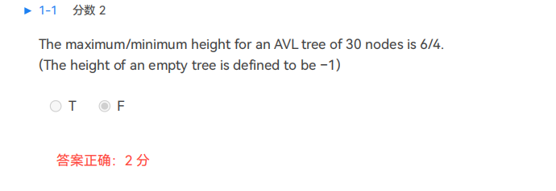​
* splay树

  * **操作复杂度：** 摊还时间复杂度都是logN
  * 特殊属性 无
  * 操作

    * 插入 先插入，再转到root节点
    * 删除，先找到，转到root节点，再删除，可以找左边最大，移动到根节点，再合并，也可以找右边最小，移动到根节点，再合并  
      ​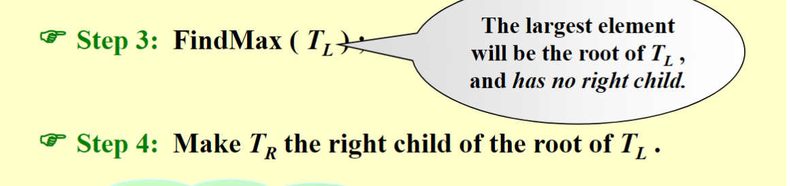​
    * 访问，先找到，再转到root节点
* splay树的插入和访问
* 摊还分析*******
* 红黑树任一操作的旋转是常数时间
* 红黑树的高度和内部节点的问题
* 红黑树的黑高从多少开始数，该点到NIL的路程上的所有black node的数量，NIL要算，本身不算
* **In a Red-Black tree, the path from the root to the farthest leaf is no more than twice as long as the path from the root to the nearest leaf.**    T
* ​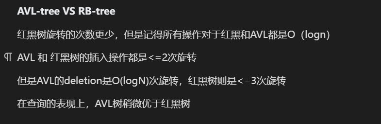​
* B+树 root和leaves的数量，对于order m的树，root最多有m个子树
* ​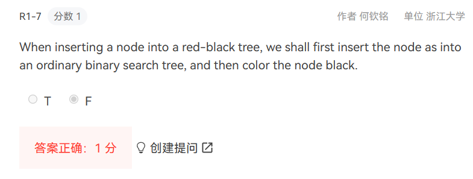​
* 对于B+ tree的定义问题

  * M阶b+树，B+ tree of order M = 2-3-4-...-M tree（实际应该从M/2的上界开始）
  * 如果不是只有一个根节点的情况下， 根节点有$2-M$个children，反之，根节点和叶子采取一套规则
  * 非根非叶子节点有 $\left \lceil M/2\right \rceil - M$ 个**children**
  * 叶子节点有$\left \lceil M/2\right \rceil - M$个**元素**
  * keys仅仅指叶子节点的元素
  * 删除过少和插入过多的具体解决方案

    * 插入的元素过多的情况下，要把元素移交给上一层，叶子节点自身还保留这个元素，非叶子节点自身不保留这个元素
* 红黑树的插入
* 红黑树的删除

## 倒排索引

* Inverted file contains a list of pointers to all occurrences of a term in the text.   T
* 概念辨析

  * word stemming  单词变原型
  * stop words 常见词
*  

  * term-partitioned index    在一台机器上只建立部分的词的所有索引
  * document-partitioned index  在一台机器上只建立所有的词对于部分文本的索引
  * ​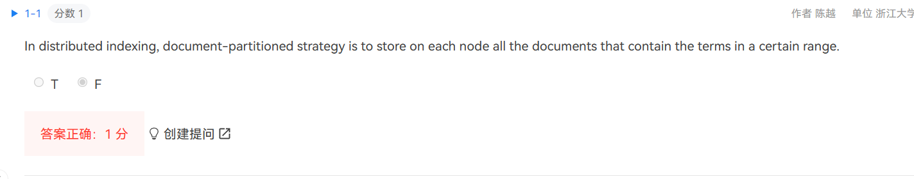​
  * ​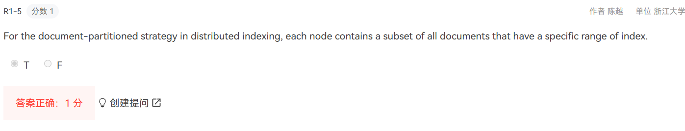​
  * precision 搜出来的东西里面百分之多少是需要的   Precision measures the quality of all the retrieved documents.
  * recall 想要的正确答案有多少被搜索出来了  上述这两个元素都是可以计算的
  * ​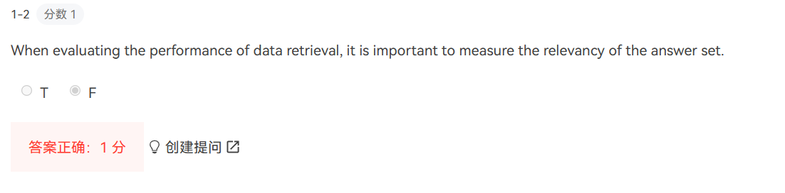​
  * Term dictionary 和 post list
  *  

    * ​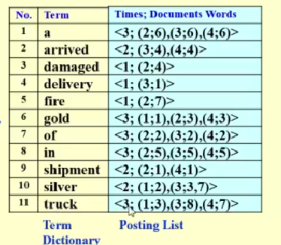​
    * posting list越短的词越重要
  * **thresholding**

## 左倾堆和斜堆

* 左倾堆需要维护NPL，左孩子NPL一直大于等于右孩子
* 左倾堆 leftist heap

  * 以队列的方式build heap时间复杂度为O(N)
  * **操作的复杂度：** Merge, insert deleteMin 都是$O(logN)$
  * **特殊属性：** NPL，当左右孩子有一个为空时，NPL为1，否则其为$min\{npl(left\_child),npl(right\_child)\}+1$​  NPL和内部节点数量的关系 $N\geq 2 ^{r+1} -1$ 其中r是NPL
  * **特殊要求：** 左孩子的NPL大于等于右孩子
  * **具体操作：**

    * Merge：合并两个树，选择根节点更小的那个，将其右子树和另一颗树结合（此处结合发生递归）在这个过程中我们同时需要通过交换左右子树来维护性质
    * insert：合并的特殊情况
    * deleteMin：左子树和右子树合并
    * 特定点删除*
  * **具体代码看一遍***
  * ​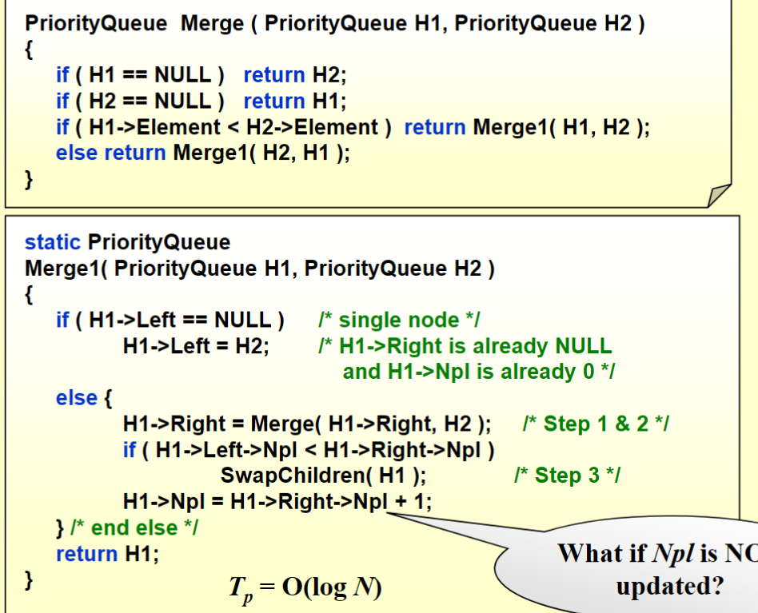​
* 斜堆 skew heap

  * **操作复杂度：** Merge, insert, deleteMin 最坏时间复杂度都是$O(N)$ 但是摊还时间复杂度都是$O(logN)$
  * **特殊属性：** 存在一种 light node*
  * The number of light nodes along the right path of a skew heap is O(logN).
  * **具体操作：**

    * Merge：每一次都找到两颗树中小root的那个，交换其左右子树，交换之后将其左子树和另一颗树进行merge，形成递归，递归到底，如果是空树和一个树合并，那就直接接过来。与空树合并
    * insert：特殊合并
    * deleteMin：左子树和右子树合并
  * **摊还分析***
  * **具体代码看一遍***
* 二叉堆的时间复杂度

  * Merge是$O(N)$，insert和deleteMin都是$O(logN)$
* 其right path为r nodes的情况下，leftist tree至少有2r - 1个nodes
* ​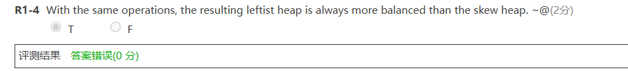​
* quiz4 1-3 斜堆的摊还分析 2-2
* hw4  1-1 结论  
  ​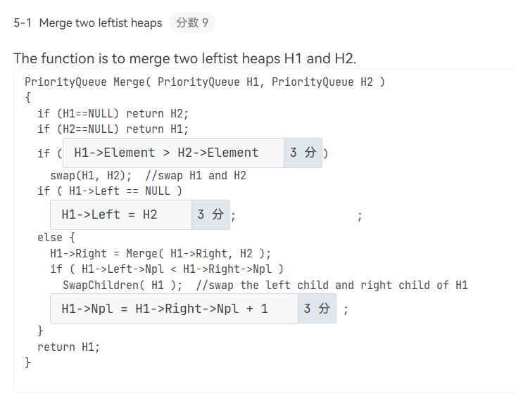​

‍

## Binomial Queue

*  

  * **操作的复杂度：** Merge, FindMin, insert, deleteMin 都是$O(logN)$ 如果维护一个额外的指针，FindMin是$O(1)$，插入最坏情况是$O(logN)$ 平均下来是$O(1)$，并且空队列插入N个的复杂度为$O(N)$
  * **特殊属性：** 多叉树，且有多个，按照size降序排列，就像二进制数一样 1101 最左边的是最高位
  * **具体结构：** 有sibling link和left child link构建的多叉树
  * **具体操作：**

    * Merge：从最小的size开始合并，如果既有进位又有溢出，那位保留进位的那个
    * insert：合并的特殊情况
    * deleteMin：拆分出两组树进行合并
    * 特定点删除*
  * **具体代码看一遍***   
    ​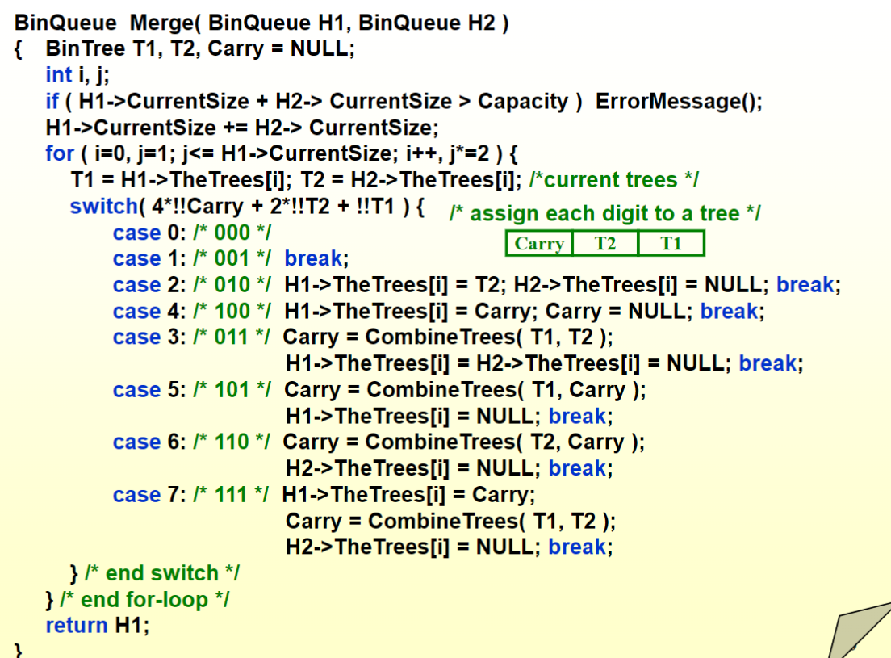​
  * **摊还分析**
* hw5 注意区分binomial trees和binomial queue，其中$B_0$是指1个元素的binomial tree
* quiz5 1-5 insert有时不与size大小有关，和会发生的进位数量有关  
  ​​

## backtracing

* 回溯问题的复杂度难以分析
* 穷举并不是在有限时间内都能解决所有问题
* 八皇后问题

  * 实际解作为一个数组，以四皇后问题为例 $(2,4,1,3)$，表示第一列第二排有棋子，第二列第四排有棋子。。。
* 最短车站问题
* ​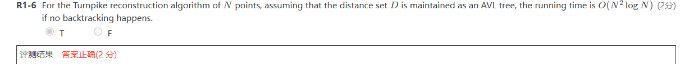​
* $\alpha-\beta$ 剪枝  tic-tac-toe game

  * **tic-tac-toe game ？？？***

    * goodness function $f(P) = W_{AI} - W_{human}$ W只需要计算当前状态下赢得可能性
  * min level递减或者max level递增的时候，就可以剪枝了，两个节点选max还是min根据上一层的属性来判断
  * $\alpha\  prun$ 发生在min层递减，并且兄弟比其更小的时候，例如这道题，当$x\geq9$ 的时候，发生剪枝  
    ​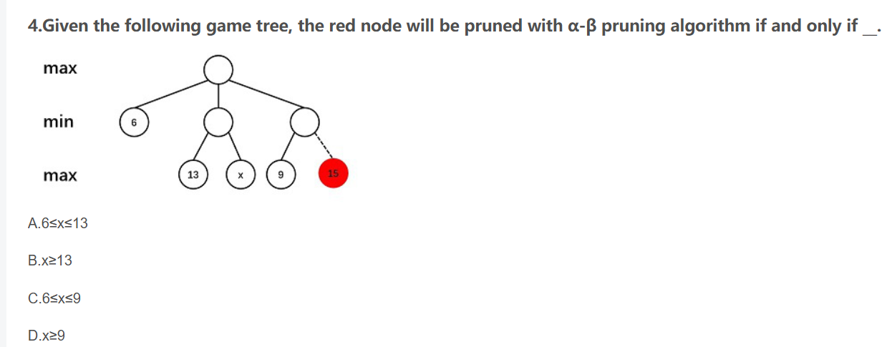​
  * **$\beta\  prun$**发生在max层递增，且兄弟比起更大的时候，例如这道题，当$a> 68$的时候，max层递增，并且需要$a > b$  
    ​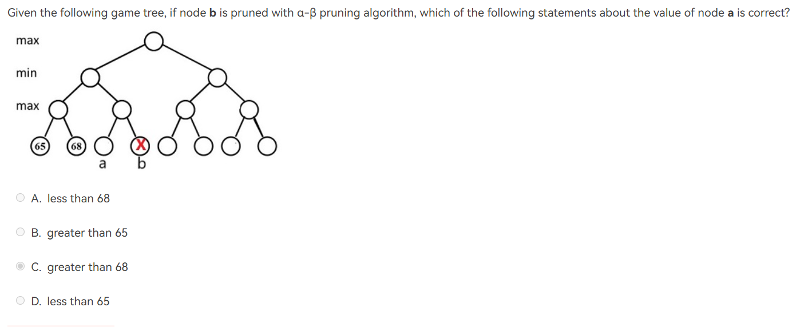​
  * $\alpha-\beta$ 剪枝的顺序还是按照这棵树的前序遍历顺序来，就和正常的穷举树那样

## Conquer

主要就是背那三个方程

* 多路归并排序，只要这个路还是个常数，就是$O(nlogn)$

* ​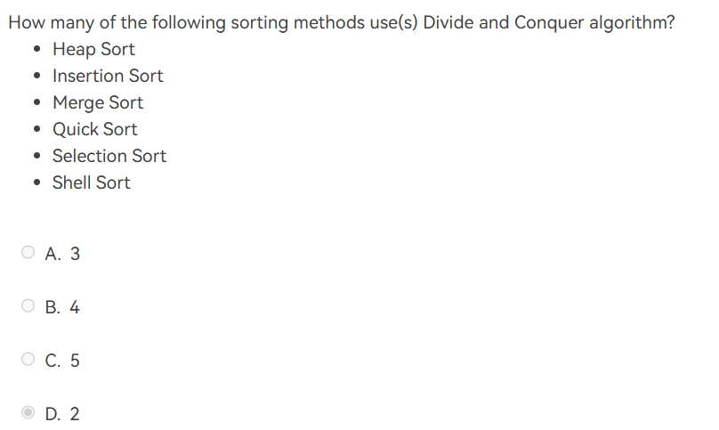​

## DP

## 总结

* 有代码都需要看一遍
* 摊还分析
* 分治的复杂度分析公式
* splay树还需要看一看，具体的旋转
* B+ 树的key仅仅对于叶子节点
* tic-tac game  最终胜利的可能性数量，也即画出一条线，线上只需要没有对方的棋子即可，一般是‘X ’-‘O’  
  ​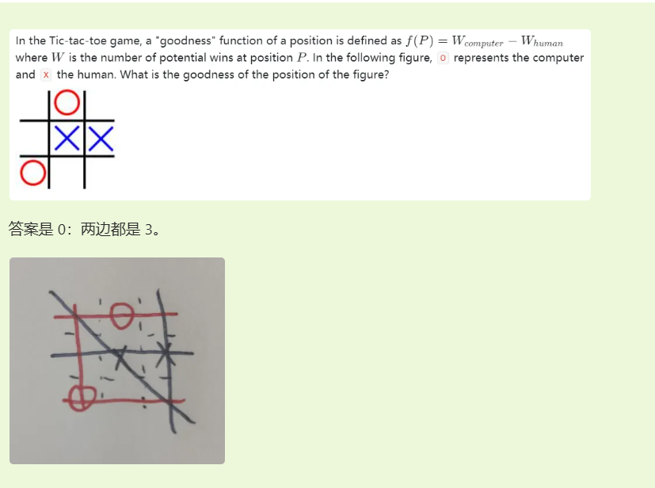​
* 旋转
* 空树的height是-1

### 摊还分析

摊还分析的重心在于势能法

对于一个操作$P$，其第$i$步的消耗记为$a(i)$，那么对于一个n步的操作，我们的消耗是$\sum_1^na(i)$

我们有一个势能函数$\phi(S_i)$ $S_i$ 表示第i步之后我们对于整个局面的状态的描述

​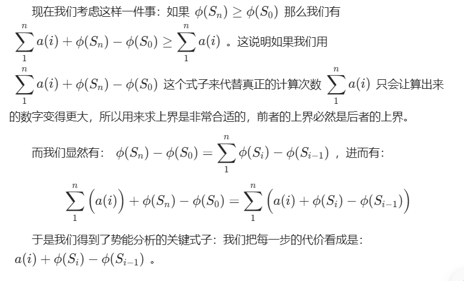​

我们每一步的代价，其实是由两部分组成

* 一部分是其本身操作的代价
* 一部分是导致系统的状态变高的代价

我们想象一下之前那个栈的例子，一个普通的push操作自身代价很小，但是其为未来的大规模pop埋下了隐患；而未来的大规模pop虽然自身操作代价很高，但是其大大降低系统自身的状态。只要能找到一个描述这个状态的函数，使得二者相加结果为我们目标的时间复杂度即可。

但是上述的例子是比较简单的，我们思考一下splay树，对于这样较为复杂的结构，如何找到一个比较合适的描述其状态的函数

$$
\phi(T)=\sum_{des\in T}log\ Size(des)
$$

上述式子有点难懂，但是其实就是指，所有以T的后代为根的孩子树的大小，取对数，再求和

​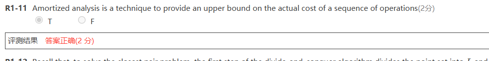​

**聚合分析 aggregate analysis**

**accounting method**

**potential method**

​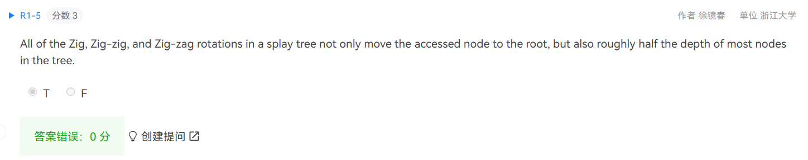​

* 是路径上的node不是most nodes
