# 离散数学及应用

!!! note "离散补天"
      1. 纯粹的补天笔记，基本没有什么阅读的价值，放上来凑数的bushi
      2. 离散这门课确实有相当的难度，无论是英文授课还是庞大的复习范围，建议日常不要放松学习
      3. 虽然这门课教的东西很多并且我最后获得的成绩还不错，但是没有学到很多东西的实感，感觉以后应该还需要回过来学习，若是有新的笔记的话应该会把这篇替换掉

## Unit5 Induction and Recursion(no 5.5)

### 5.1 Mathematical Induction 331 264

#### 1) introduction to mathematical induction

propose: prove P(n) is true for all positive integer n  
basis step: prove P(1) is true  
inductive step: to prove P(k)->P(k+1) is true

we need to assume P(k) is true, This step is called inductive hypothesis

#### 2) examples using mathematical induction

read it in the book(important)

### 5.2 Strong Induction and Well-Ordering 354 281

#### 1) introduction to strong induction

propose: prove P(n) is true for all positive integer n  
basis step: prove P(1) is true  
inductive step: to prove (P(1)andP(2)andP(3)...andP(k))->P(k+1) is true

#### 2) some examples about strong induction

If n is an integer >=1, then n can be written as the product of primes

and others can read in the book 

#### 3) using strong induction in computational geometry

A simple polygon with n sides, where n is an integer with n ≥ 3, can be triangulated into n − 2 triangles.

Every simple polygon with at least four sides has an interior diagonal(内部对角线).

we can read the proof in book

#### 3) well-ordering property

Every nonempty set of nonnegative integers has a least element.

examples of application of well-ordering property can find at book

like 可以证明整除算法的结果是唯一且存在的

### 5.3 Recursive Definitions and Structural Induction 365 291

#### 1) recursively defined functions

basis step: specify f(0)  
recursive step: using smaller integer to find the value of f(n)  
such as: f(n+1)=f(n)+1

a recursively defined functions is **well defined** if and only if, for every positive integer, the value of function at that integer is determined.

LAME theorem: 设a>=b且a b均为正整数，用欧几里得算法算出gcd（a，b）所用除法的次数小于等于b的十进制位数的5倍

#### 2) recursivey defined sets and structures

there are many examples and we can read it in the book

还要了解结构归纳法和广义归纳法的含义

bite string 

### 5.4 Recursively Algorthims 381 305

#### 1) the introduction to recursively algorthims

it solves a problem by reducing it to an instance of the same problem with small input.

for example:

procedure factorial(n: nonnegative integer)

if n = 0 then return 1

else return n ⋅ factorial(n − 1)

{output is n!}

procedure gcd(a, b: nonnegative integers with a < b)

if a = 0 then return b

else return gcd(b mod a, a)

{output is gcd(a, b)}

#### 2) proving correct

we can use mathematical induction to prove a recurrence algorthim is correct.

for example

​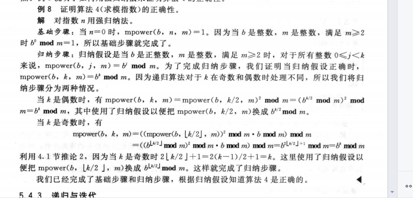

#### 3) recursion and iteration(迭代)

迭代就是通过计算较小数值点的函数值来最终求出较大数值点的函数值，例如斐波那契数列，通过递归公式求值与通过直接的表达式求值运算难度是不同的

procedure iterative fifibonacci(n: nonnegative integer)

if n = 0 then return 0

else

x := 0

y := 1

for i := 1 to n − 1

z := x + y

x := y

y := z

return y

{output is the nth Fibonacci number}

#### 4) the merge sort(归并排序)

将一列数对半分，如果无法对半分则左子树多一个，直到全部分到叶子节点时，再反推回去，反推回去时进行比较排序

the algorithms:

归并  
procedure mergesort(L=a1 a2 a3 ... an)  
ifn>1then  
  	m:=n/2向下取整  
        l1=a1 a2 a3... am  
        l2=am+1  am+2 .....an  
        l=merge(l1,l2)

排序

procedure merge(L1, L2 : sorted lists)

L := empty list

while L1 and L2 are both nonempty

remove smaller of fifirst elements of L1 and L2 from its list; put it at the right end of L  （比较两个数列的第一个数，然后把小的那个插入）

if this removal makes one list empty then remove all elements from the other list and append them to L

return L{L is the merged list with elements in increasing order}

使用不超过m+n-1次比较，可以把m个元素和n个元素两个有序表合并成一个有序表

对于一个n个元素的表进行归并排序所需的比较次数为O(nlogn)

## Unit6 Counting(no 6.6)

### 6.1 The Basics of Counting

#### 1) two basic counting principles

the product rule(乘法法则) and the sum rule(加法法则)

here are some examples 

​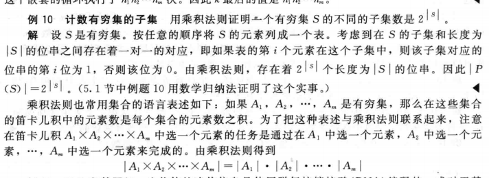

#### 2) more complex counting problems

#### 3) the subtraction rule(inclusion-exclusion for two set)

容斥原理

#### 4) the division rule

​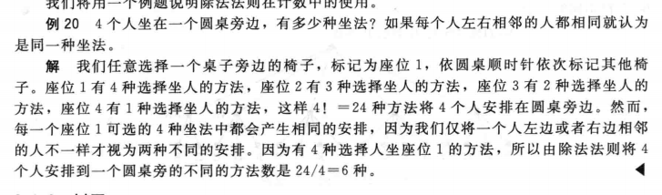​

### 6.2 The Pigeonhole Principle 420 338

#### 1) introduction to pigeonhole principle

如果鸽子数量比鸽子巢数量要多，那么一定有一个鸽子巢里面有至少两只鸽子

we also called it as Dirichlet drawer principle.

here are some corollary(推论) like  
A function from set with k+1 or more elements to a set with k elements is not one-to-one.

#### 2) the generalized pigeonhole principle

If N objects are placed into k boxes, then there is at least one box containing at least ⌈N/k⌉ objects. 

here is some examples

​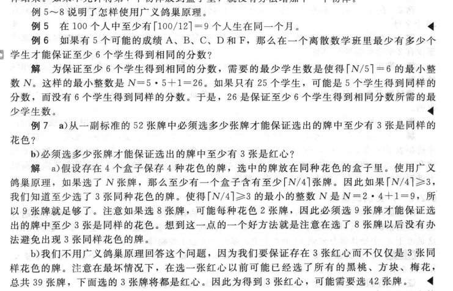

#### 3) some applications of the pigeonhole principle

Among any n+1 positive integers not exceeding 2*n there must be an integer that divides one of the other integers.

Every sequence of n**2+1 distinct real numbers contains a subsequence of length n+1 that is either strictly increasing or strictly decreasing.

​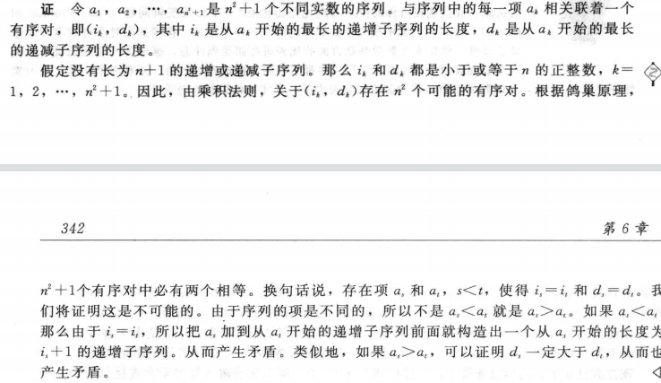

Ramsey theory, Ramsey number R(m,n) m>=2 n>=2  
Minimum number of people at a party such that there are either m mutual friends or n mutual enemies. They are friends or enemies.

### 6.3 Permutations and Combinations(排列组合) 428 345

#### 1) permutations

r-permutation is a permutation that find r elements of a set and permute them

If n is a positive integer and r is an integer with 1 ≤ r ≤ n, then there are

      P(n, r) = n(n − 1)(n − 2) ⋯ (n − r + 1)

r-permutations of a set with n distinct elements.

if r could be 0

       P(n,r)=n! / (n-r)!

#### 2) Combinations

The number of r-combinations of a set with n elements, where n is a nonnegative integer and

r is an integer with 0 ≤ r ≤ n, equals

C(n, r) = n! / r!*(n-r)!

we also called C(n,r) as binomal coefiicient

C(n, r) = C(n, n − r)

‍

### 6.4 Binomial Coefficients and Identities(恒等式)437 351

#### 1) the Binomial Theorem

​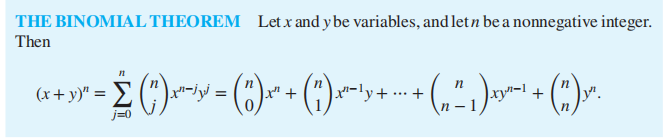

the sum of C(n,k) from k=0 to k=n is 2**n  
the sum of C(n,k)* *(-1)**k from k =0 to k=n is 0*

#### 2) Pascal's Identity and Triangle

C(n+1, k)=C(n, k-1)+C(n, k)

#### 3) other indentities involving binomial coefficiens

C(2n, n)=∑C(n,k)**2

​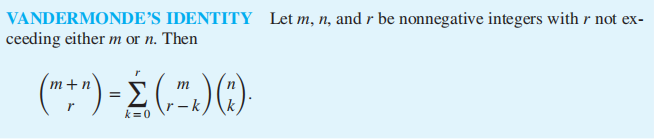​

​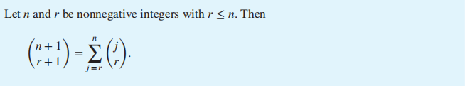​

‍

### 6.5 Generalized Permutations and Combinations 445 358

#### 1) Permutations with repetition

The number of r-permutations of a set of n objects with repetition allowed is n**r 

#### 2) Combinations with repetition

将物体和挡板同时排列组合

the ans is C(n+r-1, r)

#### 3) Permutations with indistinguishabele objects

就是物品中存在不可区分的东西

设类型1有相同的的n1个 类型2有相同的n2个。。。。  
这个一共n个物体的排列数即为 n! / (n1! * n2! * n3!....)

#### 4) Distributing Objects into Boxes

we have four different situations

distinguishable objects and distinguishable boxes  
将n个不同物体放到k个箱子，且每个箱子所要的物体数为ni  
排列组合数为 n! / (n1! * n2! * n3!....)

indistinguishable objects and distinguishable boxes  
C(n + r − 1, n − 1)

distinguishable objects and indistinguishable boxes

see the book

indistinguishable objects and indistinguishable boxes

p(n,k)

## Unit 8 Advanced Counting Techniques(no 8.3)

### 8.1 Applications of Recurrence Relations

#### 1) recurrence relation

**recurrence relation** is a rule for determining subequent terms from those precede one.

we can define models with recurrence relation, like Fibonacci(斐波那契) or Hanoi Puzzle(汉诺塔)

#### 2)Algorithms and Recurrence Relations

dynamic programming(动态规划). It recursively breaks down a problem into simpler overlapping subproblems.

Example of schedule of lectures.P536

### 8.2 Solving Linear Recurrence Relations

#### 1)introduction to inear homogeneous recurrence relation

$an = c1an−1 + c2an−2 + ⋯ + ckan−k$  

where c1, c2, … , ck are real numbers, and ck ≠ 0. and they are no depend on n.

#### 2)solving linear homogeneous recurrence relations

using the  characteristic equation(特征方程) and characteristic roots.

$rk − c1rk−1 − c2rk−2 − ⋯ − ck−1r − ck = 0.$  

there are several roots r1 r2 r3

an = 𝛼1r1 n + 𝛼2r2n+a3r3n

if there is one characteristic root of multiplicity. We can find the method foremore is not applied.

the characteristic equation with multiplicly roots

​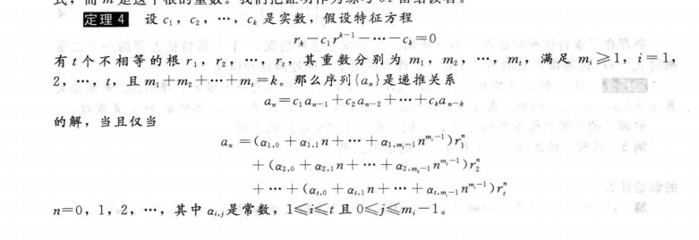​

each coefficients(系数) will depend on its mulitplies.

#### 3)linear nonhomogeneous recurrence relations with constant coefficient

a recurrence equation like 

$an = c1an−1 + c2an−2 + ⋯ + ckan−k + F(n),$  

is called linear nonhomogeneous recurrence relations.

and it will have a equation like

$an = c1an−1 + c2an−2 + ⋯ + ckan−k$  

is its **associated homogeneous recurrence relation(相伴关系)**

The answer of this recurrence equation will be X+Y

X is the answer its associated homogeneous recurrence relation.

Y is a special answer of this relation with constant coefficient.

Then we will introdcue **how to find the special answer.**

it depends on F(n), if F(n) is like:

$F(n) = (btnt + bt−1nt−1 + ⋯ + b1n + b0)sn,$  

and it will special answer like when s isn't the root

$( ptnt + pt−1nt−1 + ⋯ + p1n + p0)sn.$  

if s is root and its multiplicity is m

$nm(ptnt + pt−1nt−1 + ⋯ + p1n + p0)sn$  

### 8.4 Generating Functions

#### 1) The introduction to generating function

​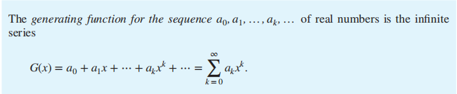

#### 2) The application of generating function.

generating function is closely connected with formal power series(幂级数)

**extended binomial coefficient**(广义二项系数):  
​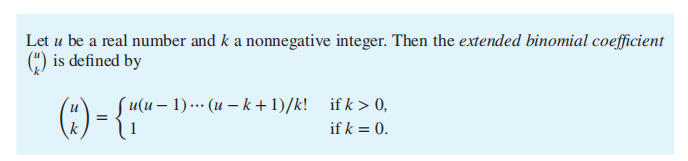

and we have extended binomial theorem. We can use it to find some generating function. We can use this theorem when (1+x)^u u is real numbers and |x|<1

We can find some Generating Function in page 568.

generating function can be used to **solve some counting problem**. Such as  
​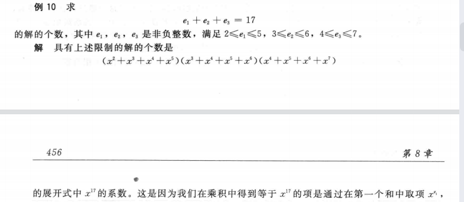

this power series of x is the generating function of this problem.

We can use generating function to solve recurrence relation

using this recurrence {an} to the coefficient of the generating function, such as :

‍

​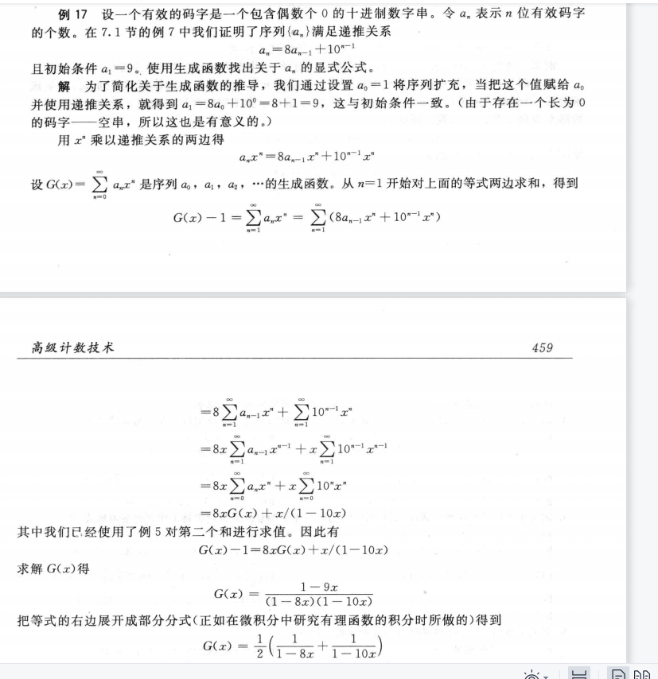​

​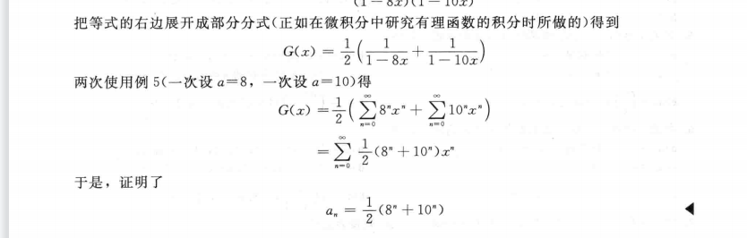​

We can use generating function to solve Identities(恒等式)

​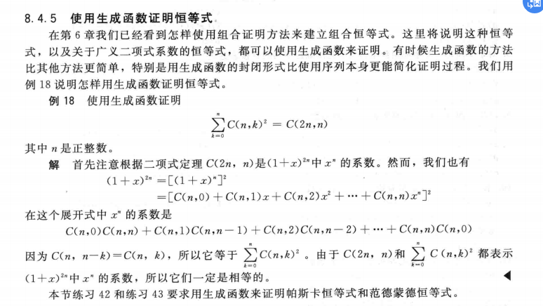​

‍

‍

‍

‍

‍

‍

### 8.5 Inclusion-Exclusion(容斥) 464

#### 1) the principle of Inclusion-Exclusion

it is a way to count the number of element in a set.

​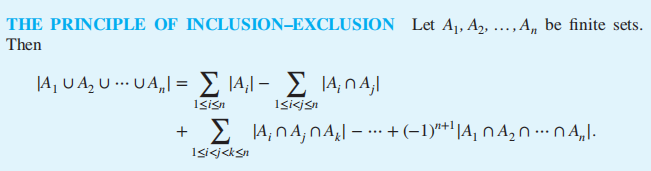​

‍

### 8.6 Applications of Inclusion-Exclusion 469

#### 1) Application in counting 

几个元素到几个元素的映射

容斥原理的一大应用就是转化为N(P1P2P3...Pn) 具有某种性质的元素个数  
和不具有某种性质的元素个数

例如：将九个球放到九个盒子里，要求只放四个盒子

（4 ^ 9 -C(4,1)* 3 ^ 9+ C(4,2)* 2  ^ 9 -C(4,3)）*C(9,4)

4^9 的情况减去仅有三个盒子被放的情况，加上只有两个盒子被放的情况，减去只有一个盒子被放的情况

‍

## Unit 9 Relations(no 9.2)

### 9.1 Relations and Their Properties(性质)

#### 1).Binary relation

A and B are sets. A **binary relation** from A to B is a **subset** of AxB.  
Binary relation from A to B is a set R of **ordered pairs(有序对). ​**(a, b) ∈ R is express a ∈ A and b ∈ B. It is denoted as aRb.

Function as relation. A function from A to B is a relation.

**Relation on a set**: A relation from a set A is a relation from A to A.

For Example:

R1 = {(a, b) ∣ a ≤ b},

R2 = {(a, b) ∣ a > b},

#### 2).Properties of Relations

**reflexive**(自反): A relation R on a set A is called reflflexive if (a, a) ∈ R for every element a ∈ A.

           we all assume it is a relation R on a set A and a,b,c ∈ A.

**symmetric**(对称):If (b, a) ∈ R, then(a, b) ∈ R.

**antisymmetric**(反对称): if (a, b) ∈ R and (b, a) ∈ R, then a = b.

**transitive**(传递): if whenever (a, b) ∈ R and (b, c) ∈ R, then (a, c) ∈ R.

‍

#### 3).Combining Relations

**Basic Combining**: R1 ∪ R2, R1 ∩ R2, R1 ⊕ R2, R1 − R2, and R2 − R1. We can all refer to set theory.

**Composite of R and S**: R and S are two relations.R is a relation from A to B,and S is a relation from B to C. A new relation N = S ◦ R. N is a relation from A to C. (a,c)∈N if and only if (a,b)∈A and (b,c)∈B.

Let R be a relation on the set A. The powers Rn, n = 1, 2, 3, … , are defifined recursively by

R1 = R and Rn+1 = Rn ◦ R.

The relation R on a set A is **transitive** if and only if Rn ⊆ R for n = 1, 2, 3, … .

### 9.3 Representing Relations 621 495 

#### 1).Matrices(矩阵) representing

We can use a zero-one matrix to represent the relation. Now we assume a relation from A to B. We can create a matrix M = [mij].

​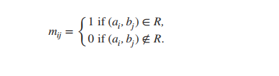

**Properties** of Matrices:

​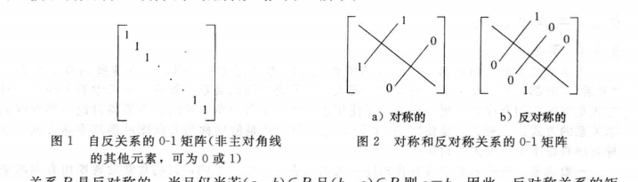

**Combining** of Matrices

#### 2).Graphs representing

A directed graph, or we called it digraph. It consists of set of V(顶点的集合) and ordered pairs of elements of V like (a,b) we called this pairs as edges. We take edge (a,b) as an example, a is initial vertex(始点), and b is terminal tervex(终点).  
specially, we called edge like (a, a) as loop.

if a relation is symmetric, we can use an undirected graph to represent it.

‍

### 9.4 Closures of Relations 628 500

#### 1) introduction to closure

R是集合A上的关系，但是R没有性质P，对于一个集合A上的关系S，R是S的子集而且并且S有性质P，则称S是R关于性质P的闭包

there many types of closures, the type is about porperty.

#### 2) paths in directed graphs

path in graph 是由一条边或多条边，边与边必须是相连的，组成的序列，特别地，我们将起始点和终点为同一个顶点的path叫做circuit or cycle

theorem: R is a relation on a set A, there is a path of length n, and the path is from a to b, if and only if (a, b)属于 R^n

#### 3) transitive closure

definition: R is a relation on a set A, the **connectively relation** R* consists of pairs like (a, b), such that there is path of length at least one from a to b in R.

R* 是从R的一次方到无穷次方的并集，也可以通过矩阵刻画

R 的传递闭包等于R *

引理：A是一个有n个元素的集合，如果有一条a到b的路径，则这个路径不超过n，当a不等于b是 这个路径不超过n-1

#### 4) Warshall's Alogrithm

一种算法，只需要2*n^3次位运算即可求出传递闭包

先对路径上的内部顶点（interior vertices）进行定义，即为一条路径去开起点和终点的其余顶点，如果起点同时在内部也出现，也把它当做内部顶点

首先需要构造一系列0 1矩阵 W0为原初关系形成的矩阵 Wk的元素wk（i，j）有如下判断  
如果存在一条路径从顶点vi到vj，其所有内部节点均在v1到vk之中的，则为1  
反之则为0

w0为全部直连的路径  
w1为全部直连和内部顶点为a的路径  
w2为全部直连和内部定点为a，b或a或b的路径

到Wn即结束，n为集合中的元素数量

procedure Warshall (MR : n × n zero–one matrix)

W := MR

for k := 1 to n

for i := 1 to n

for j := 1 to n

wij := wij ∨ (wik ∧ wkj)

return W{W = [wij] is MR∗ }

### 9.5 Equivalence Relations

#### 1) introduction to equivalence relation 

A relation on a set A is called an equivalence relation if it is reflexive, symmetic and transitive. 自反 对称 传递

特别地 如果两个元素由等价关系联系，则他们为等价的，记为a~b

#### 2) equivalence classes

R is an equivalence relation on a set A. a is an element in A, and we call all the elements relate with a by relation R. 将这个集合称为a的等价类 notation [a]R, a 关于等价关系R的等价类，如果不考虑其他关系了，也可以把R去掉

representative of an equivalence class. 等价类的代表元，指等价类里面随便一个元素

#### 3) equivalence classes and partitions

一个集合上的等价关系所构成的等价类就是对于这个集合的一个划分

同样的一个集合的划分也可以构造一个等价关系

### 9.6 Partial Orderings 650 518 

#### 1) introduction to partial orderings

a relation R on a set of S, if it is relexive antisymmetric and transitive, the relation is partial ordering（自反，反对称，传递的）  
this set S and R we call them partial ordering set or poset(偏序集) denote by (S, R)  
S 中的元素时偏序集的元素

#### 2) some porperties of poset

1.如果relation中包括了a和b的关系，则称a和b是可比的comparable

2.如果一个poset每对元素都是可比的，则称这种poset为totally ordered or linearly ordered set. and the relation is total or linear order. this poset also called chain(全序集也叫链)

3.一个全序集，其所有的子集都有最小元素，我们称其为良序集合well-ordered set

THE PRINCIPLE OF WELL-ORDERED INDUCTION

Suppose that S is a well-ordered set. Then P(x) is true for all x ∈ S, if

INDUCTIVE STEP:

For every y ∈ S, if P(x) is true for all x ∈ S with x ≺ y, then P(y) is

true.

#### 3) lexicograhic order(字典顺序)

在两个偏序集的笛卡尔积上构造一个偏序，先比较a1和a2 再比较b1和b2（比较方式依照各自的偏序）

#### 4) Hasse Diagrams

这是一种专门针对偏序关系构造的图，去掉原本的图上所有的环以及可以通过传递性关系得到的边，且让所有箭头向上，最后删除箭头

#### 5) Maximal and Minimal elements

极小元和极大元，指不存在一个元可以比他们更小或者更大，就是说可能会存在不止一个，它们在Hasse Diagram中的顶端和底端

greatest and least elements 这些元素是最大元和最小元，它们会大于和小于所有其他元素，只存在一个

upper bound and lower bound 上界和下界,对于一个子集而言，全集中的一个元素可以做到大于等于其中全部元素，则称其为上界  
least upper bound and greatest lower bound 如果有一个上界小于其所有其他的上界，就叫做最小上界

#### 6) Lattices

lattice 格 一个有最大下界和最小上界的偏序集为格

topological sorting拓扑排序见书本 660 526

## Unit 10 Graph

### 10.2 Graph Terminology and Special Types of Graphs

#### Basic Terminology of undirected graphs

1.vertices u and v are endpoints of an edge they are called adjacent(邻点)

2.G=(V,E) G is graph; V is a set of all edges; E is a set of all vertices

3.For a vertice v ,N(v) is a set of v and all of its adjacent and N(A) is  N(v)

java mysql cmake htm

x86 asm riscv asm verilog python qt

### 10.5 Euler and Hamilton Paths

#### introduction of Euler circuit and path

Euler circuit is simple circuit contianing all edges of G.

Euler path is simple path containing all edges of G.

A connected multigraph with at least two vertices has Euler circuit if and only if each of vertices have even degree.

A connected multigraph has an Euler path but not an Euler circuit if and only if it has exactly two vertices of odd degree.

#### the solution of Euler circuit and path

At first we find a circuit ,and then we delete all edges the circuit has and the vertices that become isolate. Then we find another circuit and continue until there isn't any vertices. Finally we splice the new circuits to the first one.(找到回路，删掉边和点，再找回路，连接直到无点)

If  there is Euler path we must begin at one of the odd vertices

##### ALG of Euler Circuit

procedure Euler(G: connected multigraph with all vertices of

even degree)

circuit := a circuit in G beginning at an arbitrarily chosen

vertex with edges successively added to form a path that

returns to this vertex

H := G with the edges of this circuit removed

while H has edges

subcircuit := a circuit in H beginning at a vertex in H that

also is an endpoint of an edge of circuit

H := H with edges of subcircuit and all isolated vertices

removed

circuit := circuit with subcircuit inserted at the appropriate

vertex

return circuit {circuit is an Euler circuit}

#### the introduction of Hamilton path and circuit

a simple path passes through every vertex only once of G is called Hamilton path

a simple circuit passes through every vertex only once of G is called Hamilton circuit

#### the judge of Hamilton path and circuit

if there is a vertex degree one, there isn't Hamilton circuit

Hamilton circuit doesn't consist smaller circuit

if G is a simple graph and n>=3 and degree of each vertex >=n/2, then G has Hamilton circuit

if G is a simple graph and n>=3 and choose u and v we can find deg(u)+deg(v)>=n, then G has Hamilton circuit

### 10.6 Shortest-Path Problems

#### Weighted Graphs

A graph that has a number assigned to each edges called **weighted graphs.**

**the length of a path** is the sum of weights of edges in this path(if it isn't a weighted graphs, the length of path may is the sum of edges)

‍

#### A Shortest-Path Algorithm

Dijkstra's Algorithm  
  

procedure Dijkstra(G: weighted connected simple graph, with

all weights positive)

{G has vertices a = v0, v1,… , vn = z and lengths w(vi , v

j )

where w(vi , v

j ) = ∞ if {vi , v

j } is not an edge in G}

for i := 1 to n

L(vi ) := ∞

L(a) := 0

S := ∅

{the labels are now initialized so that the label of a is 0 and all

other labels are ∞, and S is the empty set}

while z ∉ S

u := a vertex not in S with L(u) minimal

S := S ∪ {u}

for all vertices v not in S

if L(u) + w(u, v) < L(v) then L(v) := L(u) + w(u, v)

{this adds a vertex to S with minimal label and updates the

labels of vertices not in S}

return L(z) {L(z) = length of a shortest path from a to z}

**中文描述**：abcdef为顶点  
如果要从a到f  进行如下操作  
集合{a}，现要加入一个顶点，使其到a的距离最小，假设加入b  
集合{a，b}，再加入一个顶点，使其到a的距离最小，这里可以是a直接到该顶点，也可以是a通过a b 再到这个顶点，如此往复达到f，**每一次要找出最靠近a的新顶点**，可以在每个加入的顶点上标记他们到a的最短距离方便后续计算

Dijkstra's algorithm can find the length of a shortest path between two vertices in a **connected simple undirected weighted graph**.(联通简单无向加权图)And its operations are O(n^2)

#### The Traveling Salesperson Problem

### 10.7 Planar Graphs

#### 1).The introduction of Planar graph

A graph is called planar if it can be drawn in the plane without any crossing.（省流 画在平面无交点）

#### 2).Euler's Formula

G is a graph and G has e edges and v vertices . r is planar representation(平面) of  G. Then **r=e-v+2**

Proof of Euler's Formula:  

**corollary**:(these corollary can be used to prove a gragh isn't planar)  
1.G is a graph and G has e edges and v vertices. if v>=3 then e<=3*v-6*

2.If G is a connected planar simple graph, then G has a vertex of degree not exceeding 5  
3.If G is a connected planar simple graph, and v>=3 and no circuits of length 3, then **e&lt;=2*v-4**

**degree of region** is the number of boundary of this region.(面的度就是围成这个面的边的数量)

#### 3).Kuratowski's Theorem

**Elementary subdivision**(初等细分) : remove an edge {u,v} and adding a new vertex w and edges {u,w} and {w,v}. This action is called Elementary subdivision.  
If a graph is planar, then it is also planar after Elementary subdivision.

​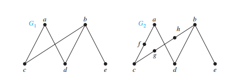

If G2 is comes from G1 elementary subdivision, we call G1 and G2 is **homeomorphic(同胚)**. (just like this picture)

**Theorem**: A graph is nonplanar if and only if it contains a subgraph homeomorphic to K3,3 or K5.

usually used to judge it isn't planar.

### 10.8 Graph Coloring

#### 1).Introduction to The Four Color Theorem

**the dual graph(对偶图): ​**it is a way to represent real map using mathematic method.  
each region of map is a vertex and if two regions have common border(相接壤) then there is an edge between two vertices.

**The coloring of a simple graph** is the assignment of a color to a vertex so that no two adjacent vertices are assigned the same color.

**The chromatic number of a graph** is the least number of color to coloring it. It is noted as X(G)

**The Four Color Theorem**: X(G)<=4 if G is a planar graph.

## Unit11 Tree

### 11.1 Introduction to Trees

#### 1) what is tree

Tree is a particluar type of graph.

There is two ways to judge whether it is a tree.  
A tree is a connected undirected graph with no **simple circuits.**  
An undirected graph is a tree if and only if there is unique simple path between two vertices.

**forest**  
it is a graph with no simple circuits and it isn't connected.This graph is called forest. And each of their connected compoents(分支) is a tree.

#### 2) rooted tree

A rooted tree is a special tree which one vertex is designed as a root and every edge is directed away from the root.(此处已经被设计为一个有向图，所有的边的方向都是远离root)

we have several termnologies:  
parent  
child  
sibling(have same parent)  
leaf(no child)  
descendant(子代)  
ancestor(祖先)  descendant and ancestor is contray

the vertices of tree can be divided into root, , internal vertices(有孩子的结点包括root) and leaf.

subtree

**m-ary tree** is a tree the number of the children of a vertex is less than m.  
**full m-ary tree** is a tree the number of the children of a vertex is exactly m.  
When m is 2, we called this m-ary tree binary tree.

**ordered rooted tree**  
It is a rooted tree when the children of each internal vertex is ordered.  
Specially, we have a ordered binary tree. We called the first child as left child and the second child as right child. The tree rooted at left child is left subtree.

#### 3) properties of trees

A tree with n vertices has n-1 edges. (we can use recurrence to prove it)

A full m-ary tree with i internal vertices contains n=m*i+1 vertices.

The relation between vertices, internal vertices and leaves to full m-ary tree.

(i ) n vertices has i = (n − 1)∕m internal vertices and l = [(m − 1)n + 1]∕m leaves,

(ii ) i internal vertices has n = mi + 1 vertices and l = (m − 1)i + 1 leaves,

(iii ) l leaves has n = (ml − 1)∕(m − 1) vertices and i = (l − 1)∕(m − 1) internal vertices.

Balanced m-ary trees

to explain the balanced m-ary tree, we need some concepts. The level of a vertex is the length from root to it. The level of root is 0. The height of a tree is the maximum of the vertex in the tree.

A rooted m-ary tree of height  h is balanced if all leaves are at levels h or h-1.

There are at most m**h leaves in an m-ary tree of height h.

一个高度为h的m叉树有l个树叶，h ≥ ⌈logm l⌉. 取等号的时候是满二叉树和平衡的

### 11.2 Application of Trees

#### 1) Binary search trees

design a tree, if the new point is less than a vertex it will be its left child, else it will be its right child

the algorithm of binary search tree is on the page 795.

#### 2) Decision trees

each of internal vertex is correspond to a decision.  
each of possible solution is a path from root to a leaf.

for example, we can create a decision tree to the order the list of [a,b,c]

​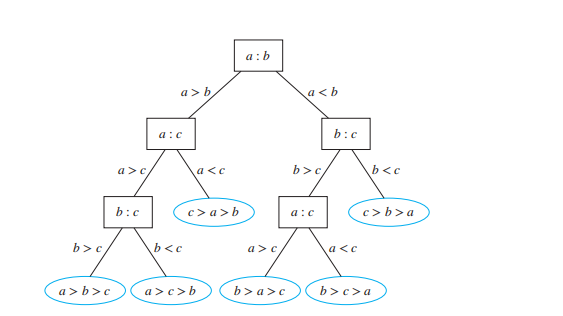​

we have some theorems

‍

哈夫曼树见中文书本 648

### 11.3 Tree Traversal 808 656

#### 1) universal address systems

一个通用的地址系统

#### 2) ways to traversal a tree

we have three useful ways to traversal a tree

**preorder traversal**

先遍历根节点，然后访问左子树到底，无法向下时再回溯，访问另一边，原则在于如果一个节点被访问了，根到这个节点的路径上所有节点，也即它的父亲和祖先节点都已被访问

**inoredered traversal**

先访问最左侧的叶子节点，然后向上访问一个节点，在看它有无右子树，先访问一个儿子节点在访问父亲结点，再访问其他儿子节点的做法

**postordered traversal**

先访问做左侧的叶子节点，然后回溯，原则在于一个父亲结点要被访问，必须其所有儿子节点已经被访问。

### 11.4 Spanning Trees(生成树)

#### 1) introduction to spanning tree

Let G be a simple graph. A spanning tree of G is a subgraph of G that is a tree containing every vertex of G.

for G with a spanning tree as its subgraph if and only if it must be connected.

#### 2) Depth-First search

任意选一个顶点， 找和它相邻的一个新的顶点（因为最终都会回溯到的），加入进来，然后有的所有顶点，按这个思路不断向前，直到无法往前。

如果所有已经遍历，则成功。

若没有完全遍历，则走到头的顶点回退（已经联系上的边和点不删除），看看还有没有新的顶点可以走，如果没有再回退。

​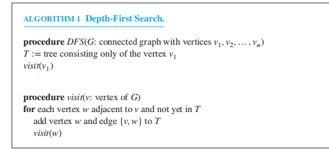​

visit 是一个递归函数 如果没有结点可以纳入 就会回退

#### 3) Breadth-First search

任意选一个顶点做根，把相邻的边都走一遍（深度是找一条，广度找全部），这些找到的顶点是level 1。

然后把新纳入的顶点，再度把它们相邻的所有新顶点连上并纳入，重复此过程

​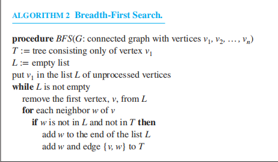​

#### 4) Backtracking Application

回溯算法在树中很多地方都有应用

比如决策树，什么时候应该顺着决策树向下走，什么时候要回溯上去，通过向下和回退来找到最优解

比如图着色问题（graph coloring）让其用几种颜色来给一张图加上颜色，然后形成一个树，向下走，如果走到后面发现颜色不够了，那就回溯去查看其他可能

比如n皇后问题 在一个nxn的棋盘里放最多几个皇后，她们不会互相吃

​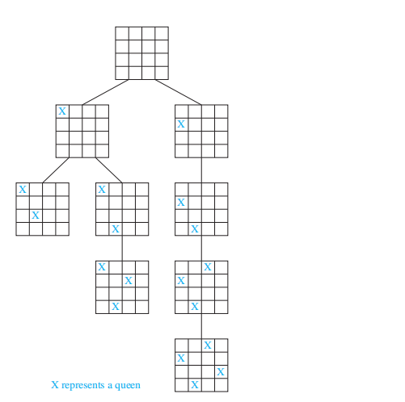

实际情况会更多

#### 5) Depth-First search in directed graph

we can use the same way to search this graph, however it may not become a spanning tree.

### 11.5 Minimum Spanning Trees

#### 1) introduction to spanning tree

If the graph is a weighted graph and one of the spanning trees has the least weight, we called it minimum tree.

#### 2) Algorithms for minimum spanning tree

存在两种不同的算法

prim algorithm

算法一：从最小的一边开始，不断往外扩，每次都扩最小的边，如果最小的不止一条就随便找一条。

算法二：从最小的一条边开始，不断地找整张图中最小的边加入进来，只要求不能形成回路，只要不形成回路就不断加进来。直到连上所有点（需要n-1条边）

‍

‍

‍
