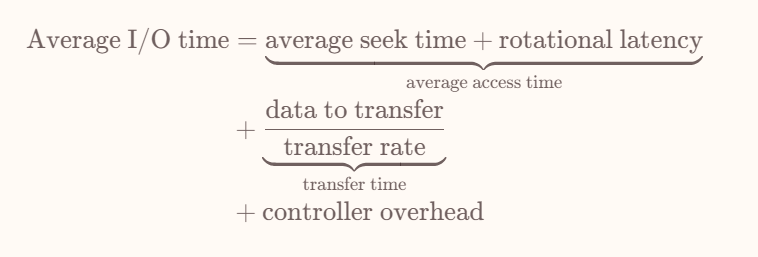

# IO + 磁盘

* 磁盘中的OS启动的过程
* 磁盘中文件系统的启动过程
* IO

  * DMA 等方式的详细过程

## 4. IO

### 4.1 IO方式

IO的方式包括

* 轮询 polling 通过不断查询设备对应的 IO controller 中的寄存器状态查看是否能够读写
* 中断 通过在 interrupt-request line 上发出信号来通知CPU响应设备的IO事件

但是对于需要大量传输的设备，上面两种操作都是会过多地占用CPU资源，因此又有了

* DMA Direct Memory Access 有一个专门的DMA controller，让DMA直接读写memory

  * DVMA DMA读写的是虚拟地址

## 5. 磁盘

### 5.1 硬盘

**基础概念**

hard disk 是常见的二级存储，其结构从小到大分别是

* 扇区 sector
* 磁道 track
* 柱面 cylinder

一个完整的盘面被称为 platter

侧面的 disk arm 会以整体移动上面所有的读写磁头（r/w heads）

从磁盘上读写内容的过程

* 将磁头移动到指定柱面
* 将磁头移动到指定磁道
* 磁盘旋转扇区到磁头下方
* 读写扇区内容

其读写的时间构成有以下内容你那个

* 定位时间 positioning time / random access time

  * seek time 将磁头移动到柱面
  * rotational latency 目标扇区旋转到磁头下方，磁盘转速一般为 round per minute 为单位，rotational latency = $\frac{1}{2}*\frac{1}{rpm}*60\ s$
* 传输时间 transfer time

  * 数据在 disk 和 memory 之间传输的时间

​​

**调度**

对于调度而言，我们需要提高 disk bandwidth = 传输数据量 / 请求开始到传输完成的时间间隔

就是说降低寻址之类的时间，提高实际传输的比例

* 当IO请求较为稀疏的时候，其实就不需要调度，来一个处理一个
* 当IO请求较为密集的时候，我们需要用一个queue来维护等待中的请求，并且用disk scheduling 来调整这些请求被处理的顺序

如今的 disk driver 给OS暴露的不是 tracks 和 sectors 之类的，而是提供与物理地址相关的 logical block address (LBA)，其中 logical block 是数据传输的最小单位

**FCFS**

就是先进先出queue的处理，其实没有优化，就是规定了一个顺序

**SSTF**

shortest seek time first ，总是选择距离当前磁头最近的那个请求去处理

好处

* 低平均响应时间
* 高吞吐量

坏处

* 响应时间方差较大
* 有饥饿问题
* 计算 seek time 有额外开销

**SCAN &amp; LOOK**

该算法要求磁头在碰到 LBA 边界之前只会单向移动，碰到之后反向移动，而在移动的过程中处理能够处理的请求

好处

* 高吞吐量
* 响应时间方差低
* 低平均响应时间

坏处

* 由于是单向移动，如果请求在磁头刚刚经过的地方，那么会等待较长时间

如果是走到靠近边界的请求对应的LBA就提前掉头，那么就是LOOK算法，SCAN要走到边界，可以减少一些不必要的SCAN

**C-SCAN &amp; C-LOOK**

C-SCAN 就是碰到边界之后直接返回到起点，没有反向移动处理请求的过程，永远是单向

比起 SCAN 有更均匀的等待时间

**调度算法的选择**

一般来说，SSTF是比较常见的默认选择，在IO频繁的时候，使用LOOK和C-LOOK

* SSD 会使用先来先服务

### 5.2 非易失性内存

这里只讨论 NVM

NVM本身读写效率较高，吞吐率会收到标准总线接口（standard bus interface）的传输速率上，所以NVM往往会直接连到系统总线 system bus 上

* 支持以 page 的粒度进行读写，但是不支持数据覆盖，需要先擦除数据再写入数据，有一些多的开销
* NVM有多个die组成，可以并行读写提高吞吐量
* NAND semiconductor 在进行一定量擦除操作之后就不再能存储数据，因此存在使用寿命

### 5.3 存储介质管理 *

新的存储设备在被使用之前需要经过低级格式化 （low-level formatting or physical formatting) ，这个过程

* 将其分为控制器可以读写的扇区
* 创建逻辑块的映射
* 创建闪存转换层 flash translation layer (FTL)

并且会为 sectors 或 pages 维护一些数据结构信息，将数据包装为 header + data + tail 的形式，并且在header 和 tailer 里存储一些元数据，例如编号，和校验码，纠错码等等

在完成了低级的格式化之后，为了能让OS使用，还会在设备上记录一些OS所需的数据结构，这个过程大致分为三步

* Partition：将设备的存储空间做一个划分，每一个都被视为一个单独的存储空间（logical disk）。分区信息以固定格式写入存储设备的固定位置
* volume creating & management：卷是包含一个文件系统的存储空间，这一步是划定文件系统所覆盖的范围
* logical formatting：在卷上创建和初始化文件系统

### 5.4 RAID * 

‍
