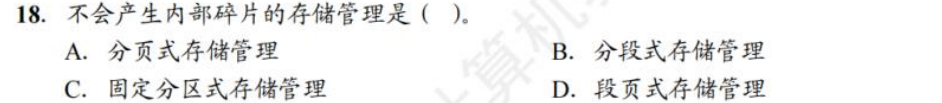

# 内存管理

* OS一般在地址的？高 / 低  高地址
* 虚拟内存机制下的页表关系 非虚拟地址下的页表关系
* 连续分配的其他算法
* 驻留集和工作集
  * 驻留应该大于工作
* swap space
* memory mapping file 将文件处理转换成了读写内存
* TLB 一次访存
* 一级页表 两次访存
* page fault + 一级页表 两次访存 后 再执行一次 此时的内存是否在TLB中？

### 3.1 内存保护

在内存的基础设计中，给每个Process在内存中分配一块连续空间，其只需要检查该Process的访存是否在这个连续空间即可

​​

这里引入了 base 和 limit 两个特殊的寄存器，内存的保护通过内存管理单元 MMU 实现，MMU会在Process每次访问内存的时候，通过 base 和 limit 进行一下检查

​​

### 3.2 程序的链接和加载

**地址绑定**

​​

静态代码程序变为动态的进程，大概需要以上几步

**加载技术**

而在 load time 的时候，程序的load存在三种方式

* absolute load 就直接使用绝对地址
* relocatable load 存在两种形式

  * static 在装入内存的时候确定地址，根据装入时的位置进行偏移
  * dynamic 在运行的过程中才确定地址，会在运行中换入换出

由于多道技术的存在，操作系统内部往往存在多个进程。动态装载机制使得我们灵活地使用内存资源。

如果一个程序还没被调用，它以 relocatable load format 存储在磁盘上，当其被调用的时候可以被动态地加载到内存中。对于那些大量但是不经常访问的代码片段，可以节省很多内存空间，例如错误处理代码。

该项技术应该由开发者开发，其不是OS的内置功能

**link技术**

* 静态链接 直接把程序和库函数链接成一个完整的模块，需要修改相对地址，并且变换外部调用符号为相对地址
* 装入时动态链接，在装入内存的时候，边装入边链接，便于修改和更新
* 运行时动态链接，在运行到对应模块的时候，才进行链接，可节省内存空间

这项技术主要指的是动态链接库 dynamic linked libraries. 这类库可以被多个进程共享，也被称为共享库。

该项技术需要OS的支持

‍

### 3.3 连续分配*

* Fixed Partition: 在笔记中的这部分就是将内存划分为相等大小的块，然后分配给process使用

  * 缺点在于有Internal Fragmentation，还有进程太大放不进来的问题
  * 在王道中Fixed partition还可以划分成不同大小的block，但是这些大小都是初始固定的
* Variable Partition 如下图

  * 缺点在于有 External Fragmentation

​​

并且基于该分配方法，我们还有 Dynamic Storage-Allocation Problem

* First Fit 分配首个足够大的hole

  * 容易在中低地址产生大量碎片
* Best Fit 分配足够大的最小hole

  * 需要遍历，同样有碎片
* Worst Fit 分配最大的hole

  * 需要遍历，在中小进程较多的情况下性能较好（相对碎片少）

**基于索引分配算法**

上述的分配算法都是顺序的分配算法，可能会比较低效

> 这部分来自于王道

### 3.4 分页管理

分页技术的目标是减轻进程"必须使用连续内存”这个限制，所谓连续内存是一种逻辑上的连续，也就是虚拟地址的连续即可。

> 但这不意味着物理地址的连续没有意义，大量不连续的物理地址会导致很低的访问效率

我们设计一个折中的方案，将物理内存划分为固定大小的块，称为 **帧 frames** 每个帧对应虚拟地址中等大的 **页 pages**

**页 &amp; 虚拟地址**

对于一个虚拟地址来说，可以划分为如下状态

一般来说我们取 4Kb Page Size，那么 page offset 是 $\log_2 4096=12$

```c
┌───────────────┬──────────────┐
│page number    │page offset   │
└───────────────┴──────────────┘
 p: m-n bits     d: n bits
```

**映射过程**

虚拟地址到物理地址的映射，可以通过下图描述

​​

在 Page table 中往往会有一些bit来实现保护机制，因为有一些page还未实现映射

而在page table中，其实只存储了块号，而不存储页号，页号是隐含在连续排列的顺序中

对于 page size 的选择而言

* page size 越大，页表项少，页更容易被浪费，但对于磁盘而言，单次大量的传输效率更高
* page size 越小，页表项多，需要更多内存和时间处理页表

**硬件支持**

页表是 per-process data structures 作为一个进程的元数据被维护。但是页表本身所占的空间较大，因此其被放在内存里，我们通过寄存器维护一个指向页表的指针来维护页表。

这个寄存器称为 **页表基址寄存器（page-table base register PTBR）**

当该进程不处于running的时候，PTBR被存储在PCB中

**TLB机制**

内存访问对于现代CPU来说还是太慢了，由于页表本身在内存中，支持虚拟地址直接让我们的内存访问次数翻倍了，因此我们需要采取一些措施

我们引入 **TLB 页表缓存 translation look-aside buffer**, 作为MMU的一部分，页号和帧好以key-value对的形式存储在TLB中，不仅访问速度快，并且允许并行的查询所有key-value对

但是TLB本身一般较小，往往只有 32 - 1024 个表项。作为一个缓存，会存在miss，我们也需要一定的缓存替换机制，例如（LRU，round-robin to random等）

TLB允许特定的表项被 wired down，这些表项不允许被替换

> TLB并不是 per-process data structures

在context switch的时候，我们需要清空TLB，进行flush操作，否则会产生错误。

或者我们在TLB的表项中增加一个**地址空间标识符（address-space identifers ASID),**  在查询页号的时候也比较ASID，只有ASID一致才算匹配成功

​​

**定量分析 TLB**

​​

**共享页**

虚拟地址和物理地址页的映射并非总是一对一，多个页可以对应一个frame，这就是共享 shared page

例如多个进程可能使用同一个库，那么这个库所在的pages就可以做共享，以减少内存开销

分页可以允许进程间共享代码，例如同一程序的多个进程可以使用同一份代码，只要这份代码是 **reentrant code** （or **non-self-modifying code** : never changes between execution）

例如我们在进程通信中提到过**共享内存实现进程间通信**，这个机制就可以通过共享页实现

**页表设计改进 ***

首先我们考虑页表现在的存在方式，页表占据的是一块连续的物理内存（其本身是虚拟地址的基础，因此其本身不是虚拟地址）

并且每个映射我们都需要存储，我们来看看一个32位的虚拟地址，12位的offset，就有20位的页号，也就有$2^{20}$ 个表项，假设一个表项 4 bytes，就有 4 Mb 的物理内存，实在太大了

那么我们可以采用一些机制来解决这个问题

* 分层页表

  * 我们可以将页表设计成分层的机制，如果上层页表节点下的表项都没有映射，可以直接设置invalid，一定程度上，可以节省维护页表所需的内存空间
  * 其有一个隐含的要求是根页表的大小不能超过一个page *
* 哈希页表

  * 我们要支持 random access 就要维护一个连续的页表，这个连续是虚拟地址上的连续，其实很多页表项都是invalid的，但是因为要维护random access的性质，就需要让其连续
  * 但是另一种random access的就是维护hash map，以页号的hash为索引，维护一个链表
  * hash page table 的访存分析 *
* 反式页表

  * 我们不维护虚拟地址到物理地址的映射，而是维护物理地址到虚拟地址的映射
  * 不需要一个进程一个页表，整个OS共用一个页表
  * 不支持共享页并且每次虚拟地址查询要遍历整个页表，相当于失去了random access的性质
* 其他 段式设计等等

### 3.5 分段存储和段页存储 *

分段管理的设计考虑的是用户和程序员，以满足方便变成，信息保护与共享，动态增长和动态链接等多方面需要

进程的地址空间是二维的，有一个段号，有一个段内偏移量，每个段都从0开始编址

分段管理是二维的，而分页管理是一维的

**段页式管理**

一个进程一个段表，一个段一个页表

### 3.6 虚拟内存基础概念

address space 的大小是由寻址的位数确定的

虚拟内存技术扩展了内存的概念，引入了page fault，使得内存的管理更加灵活

page fault有三种情况，这三种情况均为异常

1. 当前的进程的页表中并没有这个虚拟地址对应的 page；
2. 权限不符，例如试图运行某个权限位是 `RW-`​ 的 page 中的代码，或者试图写入某个权限位是 `R-X`​ 或 `R--`​ 的 page 中的某个内存单元；
3. 当前虚拟地址是合法的，但是对应的 page 被 swapped out 了。

前两种是报错，最后一种，OS会把进程阻塞并且完成swap

**page fault 处理机制**

* 检查PCB的内部表（VMA），确认这是一个需要加载的page还是一个错误访问
* 从可用帧列表中拿出frame用来写入

  * 若没有可用帧，则执行替换策略
* 从后备存储读取内容，并且写入frame
* 完成读写之后，更新内部表和页表映射
* 重新执行引起 page fault 的 instruction

> page fault的正常处理是非常慢的，因此我们需要尽可能减少page fault的产生

### 3.7 用户地址和内核地址

### 3.8 Demand Paging

demand paging 指的是只把被需要的页载入内存

* pure demand paging 在被需求之前，任何page都不会被载入内存
* pre-paginng 上述机制在程序开始之前会产生大量的page fault，我们可以再一开始将需要的页一起存入内存

引入交换技术之前，我们的访问地址如果是invalid，就说明程序出错了，访问了不该访问的地址；而引入交换技术之后，即便访问的地址是invalid，我们应该生成一个异常 page fault，借此来检查应该进行页交换还是报错

* major/hard page fault 缺少的页不存在于内存中
* minor/soft page fault 缺少的页存在于内存中，但是未建立映射

  * 可能是需要共享其他进程的page
  * 进程可能引用一个之前被释放的page，但是那个page还未被flush机制驱逐

**可用帧列表**

在 demand paging 系统中，页是动态映射到帧中的，我们需要维护一个可用帧列表（free-frame list）用来记录当前哪些帧是空闲的

​​

在系统启动后，将所有可用的帧都加入free-frame list，当有用户需要物理内存的，取出一页将其擦除，再给用户

这个擦除行为，称为 zero-fill-on-deman

**free-frame buffer pool**

如果我们总是等待 free-frame list 为空的时候再进行替换策略，不可避免地会阻塞当前进程，对此我们可以采取一些方法在防止阻塞

* 引入一个抽象的buffer，保证 free-frame list 总是有一定数量的空闲帧，少于这个帧数的时候就独立地运行一个替换进程
* 或者我们是用一个负反馈控制，维护一个上界和下界，当free-frame数量小于下界的时候，一类叫做 reapers 的内核例程就开始执行替换策略，直到free-frame数量触碰上界
* 如果free-frame非常少，达到了一个非常低的界，就出现了OOM（out-of-memory），此时一个叫 OOM killer 的进程就会杀死一个进程，腾出内存空间

  * Linux中，每个进程有一个OOM score，score与进程使用内存的百分比有关，谁内存用的最多就最有可能被杀死

### 3.9 page replacement algorithms

置换策略的基本流程如下

* 使用置换算法 replacement algorithm 决定哪个frame是victim frame
* 如果有必要，例如page为脏page，则需要将 victim frame 写入 后备存储
* 更新相关元信息
* 返回这个 victim frame 作为 free-frame

为了检查该page是否被写过，我们需要设置一个修改位（dirty bit 或者 modified bit）来记录页是否被修改过，若有写行为，则把dirty bit写为1

随后我们来探讨一些置换算法

**OPT**

理论上最优的做法，就是能有最低的 page fault rate，就是将现在能替换的页中，未来最久时间不会访问的页作为 victim frame 进行替换

但是这种做法仅作为理论最优进行建模，因为实际很难预测一个frame下一次使用在什么时候

**FIFO**

先进先出策略，选择正在使用的，最早进入内存的frame作为 victim frame，我们在内存中维护一个FIFO队列就可以解决这个问题

* 优点是实现简单
* 缺点是，最早载入的frame也可能是频繁使用的frame，这个建模与OPT并不相近

**LRU**

Least recently used，就是最近很久没被用过的page替换出去，LRU常常被认为是和OPT较为相近的建模，是常用的replacement algorithm

那么我们来看看如何实现LRU

我们一般把下面两种算法称为 stack algorithms

* 计数器，使用一个计数器来标记一个帧多久没被使用过

  * 当一个frame被使用的时候将计数器归零
  * 每个计数器都要定期更新
  * 需要考虑计数器溢出
  * 需要找到LRU的那个frame的时候，需要遍历，或者我们使用一个数据结构去维护frame序列
* 链表序列，用一个双向链表来维护一个有序序列，frame在序列中的位置来表示它们最近被使用的时间顺序

  * 当一个frame被使用的时候，如果其在链表中，则将其移动到链表头部
  * 若其不再链表中，则将其加入到链表头部
  * 此时LRU的frame总在序列末尾

缺点在于

* 维护每个frame的clock显然是耗费资源和时间的
* 每次内存访问都需要维护，开销很大
* 链表序列中，找到对应的frame也很麻烦

**LRU Approximation**

完整地执行LRU算法是美好的，但是存在较大的开销，因此我们往往会采用LRU的近似算法

### 3.10 Allocatin of Frames

首先，对于单个进程而言，存在一个较严格的上下界

* 分配一个process的frames数量不能大于free-frame的总量

  * the maximum number of frames per process is defined by the amount of available physical memory
* 分配一个process的frames数量不能小于“执行每一条指令所需要涉及的frames”

  * the minimum number of frames per process is defined by architecture

​​

我们可以采取两种方式

* global replacement 从全局的frame list中获取
* local replacement 提前规定好哪些frame给哪个进程，从中去分配

分配算法 frame-allocation  algorithm 按照分配的帧大小来份，主要有那么几种

​​

分配各每个进程的frame数量都是会动态变化的

在多核设计下，有一种设计叫做NUMA，在这种设计中，不同的CPU都有自己更快访问的内存

### 3.11 一些独立的知识点

​​

​​

​​

* 所有的替换策略都有可能Thrashing

### 习题

**王道**

​​

* 分段存储不会产生内部碎片

​​

* C

​​

* B

​​

* A A

​​

* B

​​

* A

​​

* B

​​

* A

​​

* C 页式存储不可静态重定位

​​

* BC

​​

* BB

​​

* CB

​​

* DC

* 虚拟存储器的最大容量有计算机的地质结构决定

​​

* C

​​

* D B 原因都是内存不够

​​

* B

​​

**jjm**

* 当磁盘

​​

​​

​​

* 虚拟内存 都是执行期间内存绑定

​​

* 几个定位机制要去看看

​​

​​

​​

​​

​​
