# 同步和死锁

* 每一种同步方法 对于 CS 满足条件的证明
* 同步分析和银行家算法可能考大题
* 哲学家进餐问题
* 要看清银行家算法表格上的标题

### 2.1 同步工具

#### 2.1.1 竞态条件

虽然在编程语言中对于变量的修改往往表现为一个语句，但是其实不是一步到位的，其总是需要

* 将内存读取到寄存器
* 更新寄存器
* 将寄存器更新的值写入内存

如果有两个进程同时对内存中的一个变量修改，就会发生竞争 Race Condition

​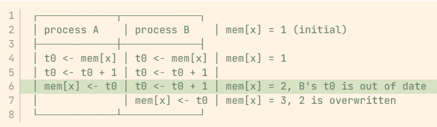​

​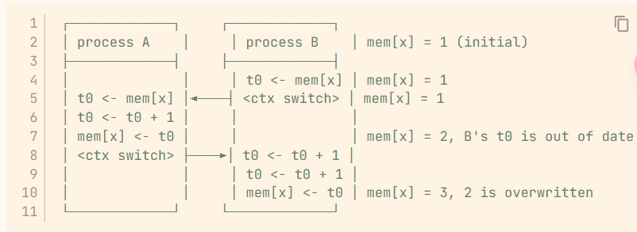​

从上述两张图我们可以看出，不论是并发还是多道程序，Race condition 都会出现问题，对于Race Condition我们的目的是避免该问题的出现

我们将这种会影响其他进程或者被其他进程影响的进程称为 **Cooperating Process**

#### 2.1.2 The Critical-Section Problem

我们定义临界资源Critical resource，是指那种只能由一个用户拥有的资源，例如`mem[x]`​

程序中访问临界资源的代码，称为 Critical Section，简称CS

```r
┌─────────────────────┐
│  Entry Section      │ <-- ask for & wait for permission to enter CS
├─────────────────────┤
│  Critical Section   │ <-- codes manipulating critical resources
├─────────────────────┤
│  Exit Section       │ <-- release the critical resources
├─────────────────────┤
│  Remainder Section  │ <-- other codes
└─────────────────────┘
```

​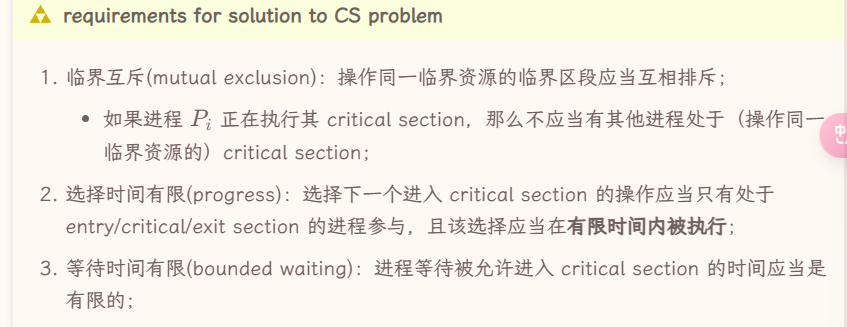​

**For kernel code * 这一部分有待完善**

在内核代码中解决Critical Section Problem

* 对于单处理器，我们可以禁止中断，保证只有一个进程运行kernel mode
* 对于多处理器，我们要实现抢占内核或者非抢占内核

**Peterson's Algorithm**

该算法只针对两个进程的Race condition

```c
// `i` is 0 or 1, indicating current pid, while `j` is another pid.
process(i) {
    j = 1 - i;

    READY[i] = true;                    // ┐
    TURN = j;                           // │
    while (READY[j] && TURN == j) {}    // ├ entry section
        // i.e. wait until:             // │
        //  (1) j exits,                // │
        //  (2) j is slower, so it      // │
        //      should run now.         // ┘

    /* operate critical resources */    // - critical section

    READY[i] = false;                   // - exit section

    /* other things */                  // - remainder section
}
```

我们这里有两个共享变量

* ​`READY`​ 数组，表示意愿，表达了两个进程想要进入Critical Section的意愿
* ​`TURN`​ 变量，表示速度，谁写`TURN`​变量快谁有更优先进入权限

但是该算法在现代计算机系统内并不解决问题，原因在于现代计算机系统的编译优化（在编译器的视角中，我们独占CPU和内存），有可能导致`READY`​和`TURN`​变量的操作顺序并不如我们所预料的那样，这样就会导致上述算法并不能完成互斥

但我们也有办法解决上述问题，就是通过**memory barriers**, 该barrier保证其之前的 S/L 指令必须在其之后的 S/L 之前完成，也就不会出现问题

```c
    READY[i] = true;                    // ┐
    memory_barrier();                   // │
    TURN = j;                           // │
```

> **Memory Model**
>
> 不同的计算机架构有不同的memory model，其表现为以下两种形式
>
> * Strongly ordered 进程对内存的修改立刻对其他处理器可见
> * Weakly ordered 修改不立即可见
>
> Cache的机制就可以导致Weakly ordered

#### 2.1.3 Hardware Instructions

更好地解决CS问题的方法，应该是在硬件上引入atomic操作

> 王道将“关中断”放置于该部分，并且说明了
>
> 1. 不适用与用户程序
> 2. 不适用于多CPU
> 3. 系统效率会下降

**test and set**

这是第一类原子指令，意义在于维护一个原子的 0 / 1 变量

```c
<atomic> test_and_set(bool * target) {
    bool ret = *target;
    *target = true;
    return ret;
}
```

我们将其设置为 true 并且获取其之前的值，一旦有一个进程成功将该变量设置为 true，其他进程都需要等待该进程将其设置为 false，否则test只会获得 true

```c
process(i) {
    while ( test_and_set(&LOCK) ) {}    // - entry section

    /* operate critical resources */    // - critical section

    LOCK = false;                       // - exit section

    /* other things */                  // - remainder section
}
```

上述代码似乎可以很简单地解决 CS 问题，但是在多进程的条件下，是可能出现饥饿的情况的，可以P1和P2不断轮流获得LOCK，而P3此时就永远等待下去了（上述算法中哪个进程进入CS段完全靠运行速度）。也就是说其不满足 bound waiting

比较好的解决方法是我们可以手动规划锁的管理，而不是基于进程的运行速度

```c
// `i` is process id in [0, n), where `n` is the count of related process. 
process(i) {
    WAITING[i] = true;                                  // ┐
    while ( WAITING[i] && test_and_set(&LOCK) ) {}      // ├ entry sec.
                                                        // │
    WAITING[i] = false;                                 // ┘

    /* operate critical resources */                    // - critical sec.

    // i.e. find next waiting process j                 // ┐
    j = (i + 1) % n;                                    // │
    while (i != j && !WAITING[j]) {                     // ├ exit sec.
        j = (j + 1) % n;                                // │
    }                                                   // │
    // release j's LOCK or release whole LOCK           // │
    if (i == j)     LOCK = false;                       // │
    else            WAITING[j] = false;                 // ┘

    /* other things */                                  // - remainder sec.
}

```

**compare and swap**

该类原子指令的表述如下，当目标变量的旧值满足期望的时候，将其更新为新值

```c
<atomic> compare_and_swap(int * target, int expected, int new_val) {
    int ret = *target;

    // *target = (*target == expected) ? new_val : *target;
    if (*target == expected) {
        *target = new_val;
    }

    return ret;
}
```

实际上上一个 `test_and_set(target)`​ 就相当于 `compare_and_swap(target, false, true`​

**atomic variable**

```c
void increment(atomic_int *v) {
    int temp;
    do {
        temp = *v;
    } while (temp != compare_and_swap(v, temp, temp+1));
}
```

我们可以依靠上述原子指令，来实现原子变量，其以来原子的操作来维持自身的状态

**mutex**

```c
while (true) {
    acquire();
    /* critical section */
    release();
    /* remainder section */
}

/* ------- */
void acquire() {
    while (!available)
        ; /* busy waiting */
    avaliable = false;
}

void release() {
    avaliable = true;
}
```

上述是互斥锁（mutex）的描述算法，同时，我们可以用上述原子指令，为我们实现互斥锁

```c
void acquire() {
    while (compare_and_swap(&available, 1, 0) != 1)
        ; /* busy waiting */
}

void release() {
    available = true;
}
```

但是在上述实现中，该互斥锁实现的是忙等待，这类互斥锁又称为 spinlock

我们可以采取如下实现来解决忙等待问题

```c
void acquire() {
    while (compare_and_swap(&avaliable, 1, 0) != 1)
        yield(); 
}

void release() {
    avaliable = true;
}
```

**信号量**

```c
void wait(S) {
    while (S <= 0)
        ;   /* busy waiting */
    S--;
}

void signal(S) {
    S++;
}
```

* counting semaphore
* binary semaphore

在王道中，还将忙等的信号量和非忙等的信号量做了区分，下面是非忙等的信号量，用了一个等待队列

```c
typedef struct {
    int value;
    struct list_head * waiting_queue;
} semaphore; 

wait(semaphore *S) {
    S->value--;
    if (S->value < 0) {
        add this process to S->list;
        block();
    }
}
signal(semaphore *S) {
    S->value++;
    if (S->value <= 0) {
        remove a process P from S->list;
        wakeup(P);
    }
}
```

* 错误地使用信号量会导致死锁
* 信号量还可以实现前驱关系

**Priority inversion ***  

​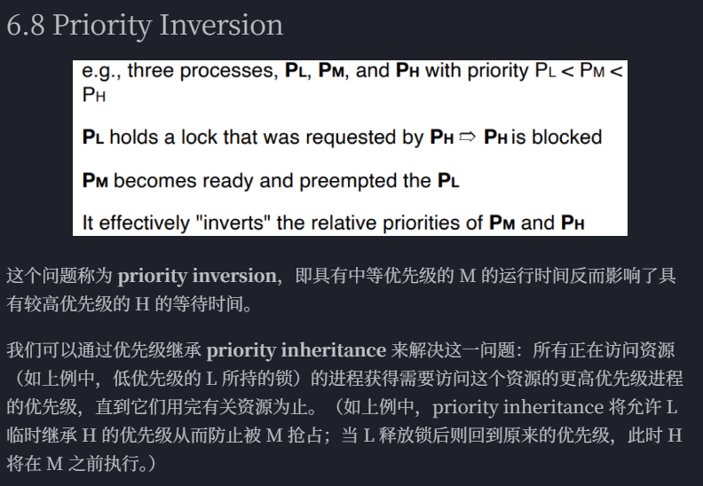​

### 2.2 同步问题例子

我们一般采用信号量机制来解决这些问题，信号量直接描述资源的数量

* wait 等待有资源，并且取走一个
* signal 释放一个资源

**The Bound-Buffer Problem ***

这个问题又称 Producer-Consumer Problem. Producer 会产生item放到buffer中，而Consumer 会buffer中抽取item

* 当 buffer 为空时，Consumer需要等待
* 当 buffer 为满时，Producer需要等待

有多种解决方案 [7 经典同步问题 - 咸鱼暄的代码空间](https://xuan-insr.github.io/%E6%A0%B8%E5%BF%83%E7%9F%A5%E8%AF%86/os/III_process_sync/7_sync_examples/)

```c
semaphore lock = 1;
semaphore eslot = BUFFER_SIZE;
semaphore fslot = 0;

producer() {
    while (true) {
        wait(eslot);    // if buffer is full, i.e. eslot == 0, wait
                        // else, eslot--
        wait(lock);
        add_to_buffer(next_produced);
        signal(lock);
        signal(fslot);  // fslot++
    }
}

consumer() {
    while (true) {
        wait(fslot);    // if buffer is empty, i.e. fslot == 0, wait
                        // else, fslot--
        wait(lock);
        next_consumed = take_from_buffer();
        signal(lock);
        signal(eslot);  // eslot++
    }
}
```

**The Readers-Writers Problem ***  

数据库方面的问题，数据库的Write也需要读，改，写。因此

* reader 和 writer 的冲突
* writer 和 writer 的冲突

**Dining-Philosophers Problem ***

```c
vector<semaphore> chopstick(5, 1);  // initialize semaphores to all 1
semaphore lock = 1;

philosopher(int index) {
    while (true) {
        wait(lock);
        wait(chopstick[i]);
        wait(chopstick[(i + 1) % 5]);
        signal(lock);

        eat();

        signal(chopstick[i]);
        signal(chopstick[(i + 1) % 5]);
        think();
    }
}
```

**Linux 同步 和 POSIX 同步**

### 2.3 死锁 Deadlock

按照资源使用的角度来看，我们将系统的行为视为三个部分

* 申请资源
* 使用资源
* 释放资源

存在一些资源是有限且互斥的，当我们需要申请这些资源的时候会陷入等待，若恰好等待的程序本身也拥有一些资源，别的进程又在等待它，就会死锁

**资源分配图**

* 资源
* 进程 / 线程
* 资源指向进程 / 线程 表示该资源分配给该进程 / 线程  Assignment Edge
* 进程 / 线程 指向资源，表示该进程 / 线程在等待该资源 Request Edge

​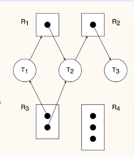​

对于这样的图，我们有

* 不存在环 -> 不死锁
* 死锁 -> 存在环

但是存在环不一定导致死锁，如果说同类资源只有一个，那么死锁和有环就是充分必要条件

**安全状态和不安全状态**

safe state 是一个比较强的状态，是指系统按照 safe sequence 的顺序执行进程/线程和分配资源。但是相对应的 unsafe state 并不是指一定会发生死锁

* 何为safe sequence，这个序列里的进程所需的资源都可以通过现有资源和之前进程执行完毕释放的资源来满足

**死锁的条件**

产生死锁需要满足以下四个条件

* mutual exclusion  死锁对应的资源必须是非共享的，非共享才需要等待
* hold & wait 死锁对应的进程必须在持有资源的情况下陷入等待
* no preemption 死锁对应的进程和线程只能在使用完资源之后主动释放，而不能被其他进程抢占资源
* circular wait 死锁的进程存在环状的等待关系

**死锁的处理**

处理死锁问题有以下几个思路

* 不做处理，依靠编程者保证逻辑上不死锁（其实这个是最常使用）
* deadlock prevention 通过一些协议和规范保证死锁不会出现
* deadlock avoidance 禁止可能产生死锁的行为执行

  * 一个是出于规范的行为都不会产生死锁，一个是会检查该行为是不是产生死锁，并且不予以执行
* deadlock detection 和 deadlock recovery 允许死锁的出现，但是可以检测到它，并且解除死锁问题

**死锁预防**

就是避免死锁的四个必要条件其中之一即可

* 破坏 mutual exclusion 这几乎是某些资源的天然属性，基本无法避免
* 破坏 hold & wait 我们让其不能等待并且被等待，让其在申请资源的时候完成所有资源的申请，如果没法**一次性获取申请资源**就放弃资源
* 破坏 no preemption 运行进程或线程强行抢占另外一个进程或线程的资源，可以破坏被动的等待关系（但是允许抢占可能会导致饥饿问题）
* 破坏 circular wait 就是所谓的safe sequence 就是说给资源编号，规定进程只能按照特定顺序来申请资源，就不会循环等待（难以设计）

**死锁避免 ***

有几种常见算法来检查死锁

* 资源分配图算法 只适用于“每个资源类别都只有一个实例的情况”
* 银行家算法 包含安全算法和资源请求算法

  * 用 Available 去消耗掉一个 Need 然后获得其释放的资源，再去消耗掉下一个，看看能否消耗完

**死锁检测**

利用资源分配图，一步步处理掉各个进程，看看能否化简完成

* 实现一个等待图 wait-for graph 这是资源分配图的一个简化态，同样有每个资源类型只有一个实例的假设，完成等待图之后定期检查是否有环即可

​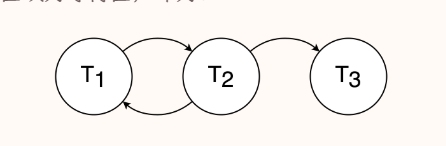​

​​

**死锁解除**

* 杀死所有陷入死锁的进程
* 按照特定顺序杀死进程，直到检测出来无死锁
* 回滚部分进程，并且强行抢占占有的资源

### 2.4 习题收录

**王道**

* 信号量一般分为 互斥量 和 资源量 ，互斥量的初始值一般为1，可能对应PPT中的 binary 和 counting
* 当资源量小于0的时候，资源量的绝对值表示其在等待的进程数量
* 临界区 Critical-Section 是一段代码而不是资源
* 由PV操作实现进程同步时，信号量的初始值由用户确定
* 若系统有n个进程，ready queue 里最多有 n - 1 个而 waiting queue 里最多可以有 n 个
* Peterson 算法中 turn 变量的作用是表示轮到哪个线程进入临界区
* 生产者 消费者问题用于解决同步和互斥的问题
* 进程数P，每个进程需要C个资源，总资源数为N，满足 $P(C-1)< N$，就一定不会发生死锁

​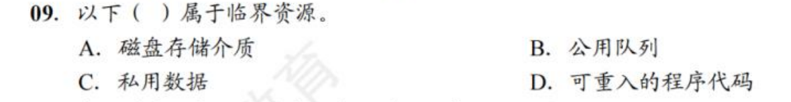​

* 答案是B，磁盘并非临界资源

​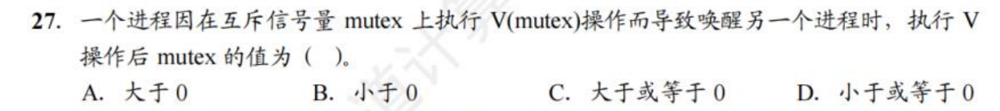​

* 答案是D，但是我感觉它在胡言乱语，mutex还小于0的情况下为什么会唤醒进程

​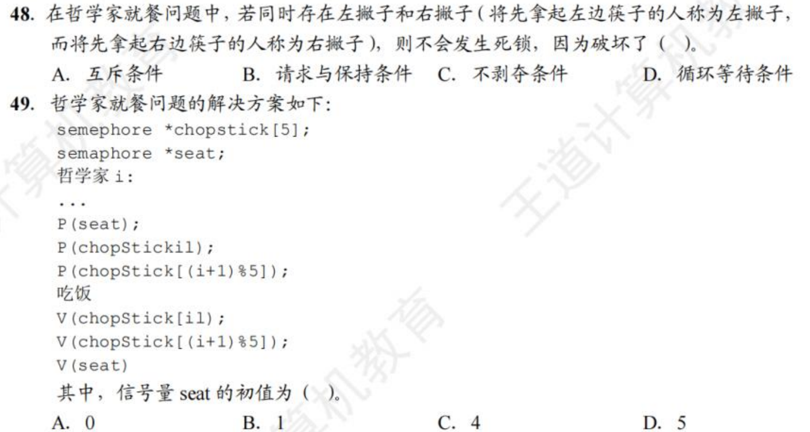​

​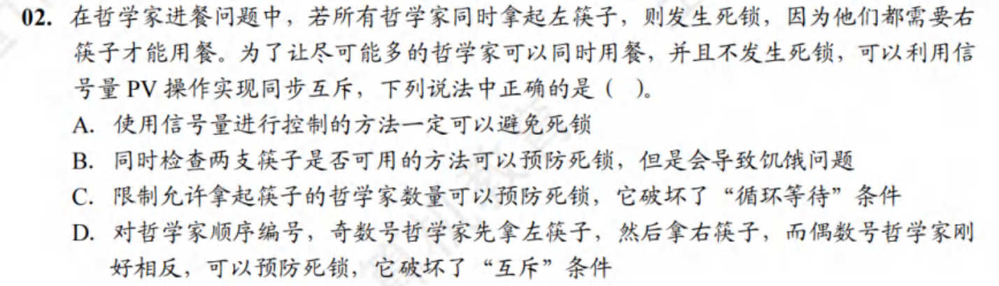​

* C

​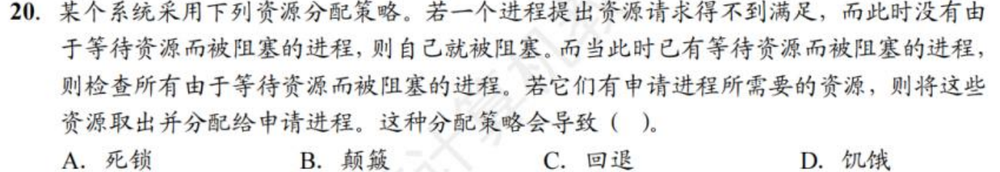​

* D

​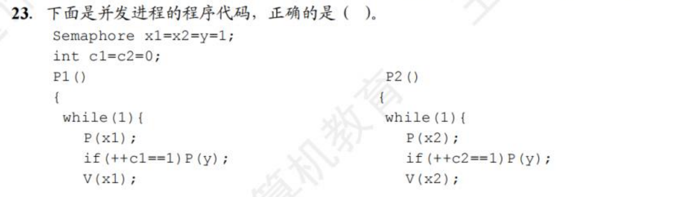​

​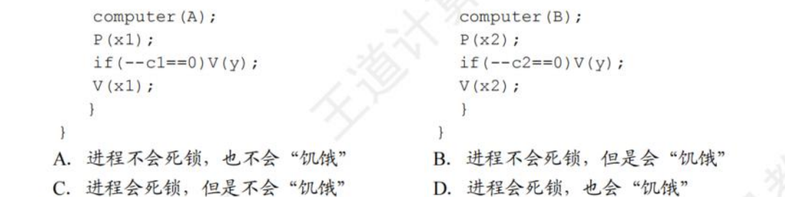​

* B

​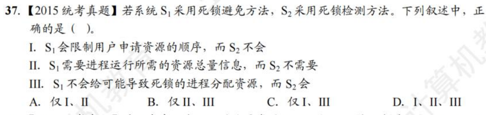​

* B 限制用户申请资源的顺序 是死锁预防的说法

​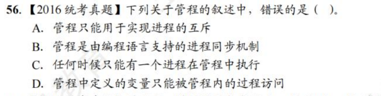​

* A

​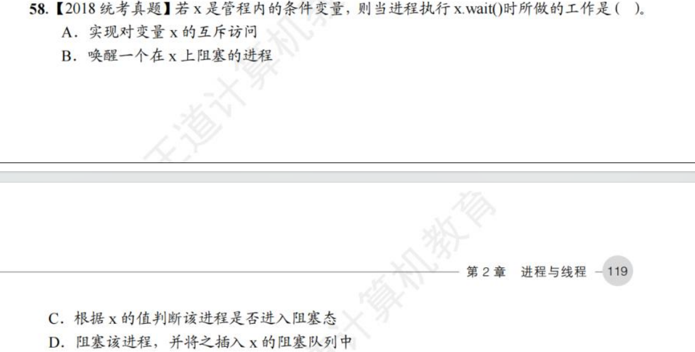​

* D

**jjm作业题**

​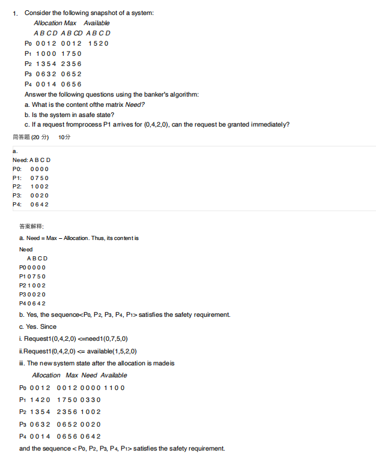​

* 这题的第三题着重看一下

​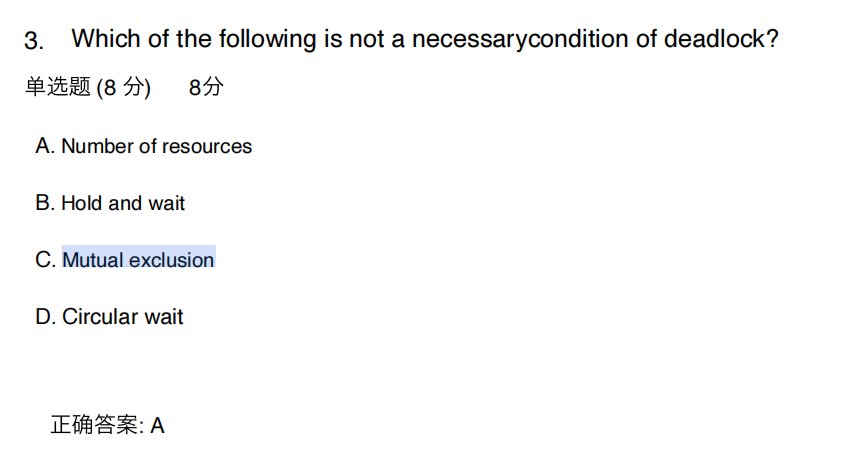​

​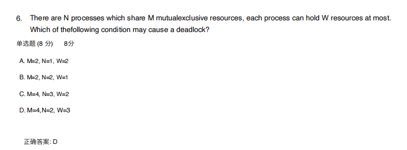​

​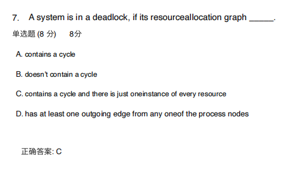​

​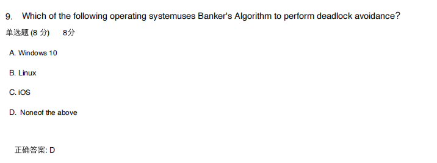​

​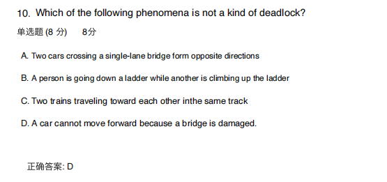​
