# 文件系统

* 文件系统的引导区，和操作系统整体的启动过程

### 6.1 文件

文件是存储在 **二级介质**（磁盘）中，具名的一系列相关信息集合。不论是用户还是程序都需要通过**文件**来和二级介质进行信息交换

从用户角度而言，文件是逻辑外存的最小单元，我们只有通过文件才能读写外存

文件有不同的类型，例如数据文件、可执行文件等。数据文件又可能是 numeric, alphabetic, alphanumeric, binary 的。

**文件属性**

不同的文件系统，会给文件设置不同的属性，也就是文件的meta data，但是通常有以下几个

* name：唯一的以 human - readable 形式保存的信息 文件名
* identifier：让文件系统标志一个文件
* type：有些文件系统有不同类型的文件，用此区分
* location：标记文件在哪个设备，哪个位置
* size：文件的大小，有时也表示其最大size
* protection：文件的访问控制信息，读/写/执行 权限
* timestamp：时间戳，保存了创建时间，上次修改时间，上次使用时间，可以做一些安全保护和监控
* user indentification：用户记录，保存了创建者，上次修改者，上次访问者，可以做一些安全保护和监控

文件系统通过 FCB 来存放控制文件所需要的各种信息的数据结构，FCB都存储在磁盘中，当文件被打开的时候，会从磁盘拷贝到内存中进行使用

**文件操作**

OS可以通过系统调用，来完成基本的文件操作

* create：首先在文件系统为文件分配一块空间；然后在目录创建对应的条目
* open / close：打开文件获取文件句柄 handle ，随后对于文件的操作都需要通过这个handle完成

  * 一般来说，文件打开之后由用户负责关闭
  * 打开后的文件会被加入到一个打开文件表 open-file table 保存所有打开文件的信息，包括文件的 句柄，位置，访问权限等等
  * 文件往往会被多个 用户 / 进程 / 线程 打开，当所有用户都关闭文件之后才应当在open file table 中释放掉这个条目，我们会有一个 count 来维护当前文件的打开状态，有点类似智能指针
* read / write 维护一个 current-file-position pointer 进行读写，就像图灵机那样
* repositioning within a file ，就是C语言中的seek操作，重定位 current-file-position pointer 到给定的位置（例如文件开头和结尾）
* delete 在 directory 中找到对应的条目并删除该条目，如果当时对应的文件没有其他的硬链接，就释放器空间，就像智能指针
* turncate 清空文件内容，但保留文件属性
* locking 由文件系统提供锁服务，例如 shared lock 和 exclusive lock。由此还衍生出两种机制

  * Windows 使用 mandatory lock 一旦进程获取了独占锁，那么操作系统禁止其他进程访问对应文件
  * UNIX 使用 advistory lock 进程可以得知锁的状态来自行决定要不要访问

对于文件操作而言，只有打开一个文件需要用到“文件名”，而后续所有的操作（此时文件已经在打开目录表）都只需要文件描述符（UNIX）或者叫文件句柄（Windows）

> 文件名，不应该是open file list的一部分

而文件打开这个过程，OS往往会使用两级表，

* 整个系统的 list
* 单个进程的 list

当所有进程都关闭该文件时才真正关闭该文件

**权限保护**

理想状态中，我们应该维护一个访问控制列表（access control list）ACL，描述每个用户对文件所具有的权限。

但是维护ACL是一个性价比很低的行为，会导致原本固定长度的表项变得不定长，因为用户数量是不确定的

因此 Unix 系统中使用了访问权限位（access permission bits）来实现权限控制

​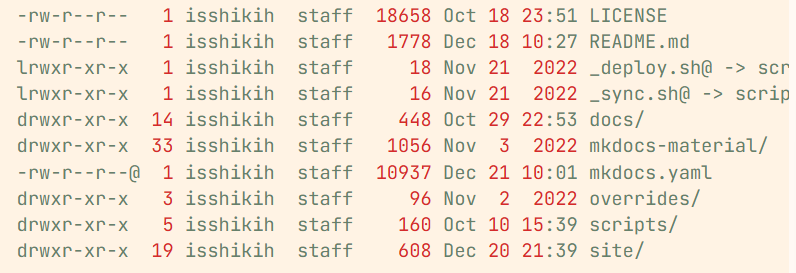​

第一列就是我们的 access permission bits

第一个字符表示文件类型，后9个字符才是权限控制，分别表示，文件的所有者（owner），文件所属组（group），其他人（other）的读写执行（rwx）权限

​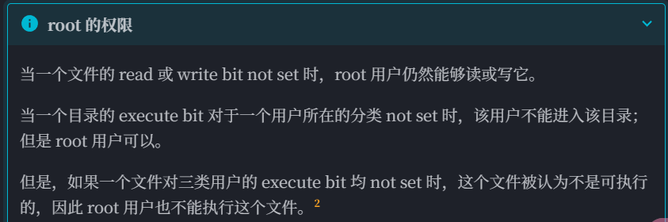​

**文件类型**

* 对于OS来说，文件主要分为 data 和 program
* 对于用户来说，我们会认为后缀名标记了文件类型，其实后缀名只是帮助系统选择合适的方式打开文件，与类型无关
* unix系统会在文件开头，使用一串 magic number 标记文件类型，例如图片文件的开头通常是 `0xFFD8`​，脚本文本文件开头会以类似 `#!bash`​ 的形式来指定由谁来执行（例如这个是用 `bash`​ 执行）。但并非所有文件都支持 magic number 的标记

**文件结构 * 有空可以再整理一下**

是指文件存储数据的结构

* 无结构：流式存储所有的 words / bytes
* 简单记录结构（simple record structure)：将文件以定长/不定长的 record 存储，就比如数据库结构
* complex structures 例如 Word 文档

> 这部分王道里写的很详细，还有索引文件，索引顺序文件等等内容 王道P257

### 6.2 访问方式

> 这部分还不够详细

有以下几种存取方式

* 顺序访问 sequential access
* 直接访问 / 相对访问 / 随机访问 支持以相同的时间访问任意位置
* 索引顺序访问 indexed sequential-access 可能还提供了索引，可以借此访问

### 6.3 目录结构

文件目录的本质就是文件控制块（FCB）的有序集合。

但是在UNIX系统中，采取了目录和文件描述分离的方法，将FCB拆成一个独立的Inode，而目录仅保存文件名和Inode号，可以有效降低目录的大小以及提高搜索效率（磁盘读取的次数少了）

在Linux中，目录本质上是一个特殊的文件，目录下的文件的元数据存储在目录上。目录的结构就表示了目录下文件的组织方式。

目录实现了 filename 到 FCB 的映射

**单级目录 single-level directory**

所有的文件被平铺在根目录下

​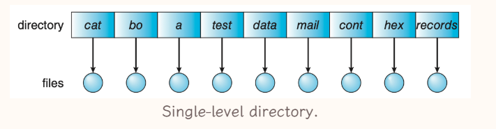​

有以下缺点

* 为了实现索引，文件名字必须是唯一
* 文件数量增大之后这个设计会变得不合理，不支持分组

**二级目录 Two-level directory**

按照用户为依据，形成二级目录，**主文件目录（master file directory, MFD）** 下为每个用户分配一个**用户文件目录（user file directory，UFD）**

​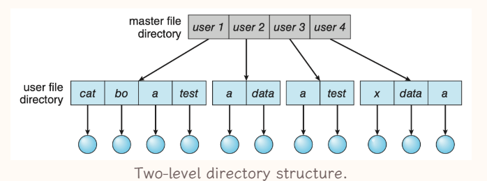​

由于出现了分层结构，对文件的索引从**文件名**变成了**文件路径**

**树形目录 tree-structured directories**

将目录本身视为一个特殊文件，使其通用化，使得用户可以自由创建目录进行分组

​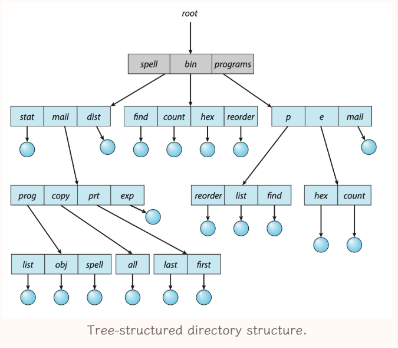​

有以下特性

* 非目录节点都是叶子节点
* 目录节点都是非叶子节点（不考虑空目录）

在这个结构中进行文件索引，需要提供文件的路径，有绝对和相对两种，每个进程都有一个current directory，使用当前目录就是相对路径

* absolute path
* relative path

此时才解决了自由分组的问题，使得文件系统的结构化管理能力大大增强

删除目录时，有两种设计

* 不允许删除非空目录
* 删除目录下所有文件

**无环图目录 acyclic-graph directories**

在树形的结构的基础上，允许目录之间存在链接关系，这种关系支持共享

​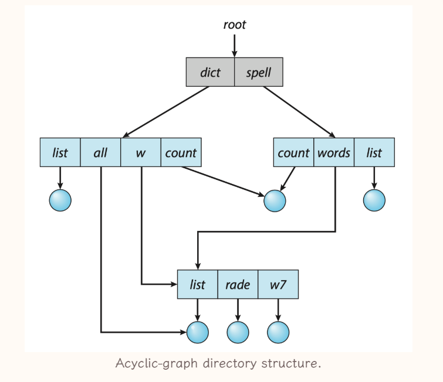​

链接关系存在两种

* soft link，又称为 symbolic link 是一个指向文件的指针，类似与快捷方式。删除文件的时候不会顺带处理 soft link，但是其已经失效了，当用户试图访问的时候会表示出文件已经删除，就相当于一个**轻量的特殊文件**
* hard link，复制链接文件目录项的所有元数据，存储到目标目录中，此时文件平等地属于两个目录，是真正的指针拷贝，hard link 是**目录表项**

  * 当文件元信息更新的时候，需要保证其各个hard link也同步更新
  * 当该文件有硬链接存在的时候，其被删除时不会真正被删除，而是删除了对应指针+同步更新元数据，直到其 reference number 变为了0，文件才会被删除

UNIX同时支持上述两种链接

这种类型的目录结构存在以下特点

* 为了保证无环，我们只允许创建关于文件这种叶子节点的硬链接，而不允许创建目录的硬链接，但是其会创建对 `.`​ 和 `..`​ 的硬链接
* 硬链接本质是表项，其与文件系统相关，所以硬链接只能在同一文件系统下创建，不能跨过 file-system boundary

**通用图目录**

本质上和无环图目录相同，区别在于其避免死循环的机制不同，允许目录存在环，但在操作时通过算法来避免出现问题，例如图处理算法和垃圾回收机制等等

通过类似于 garbage collection 的算法可以确定哪些文件可以删除，但是会比较费时

​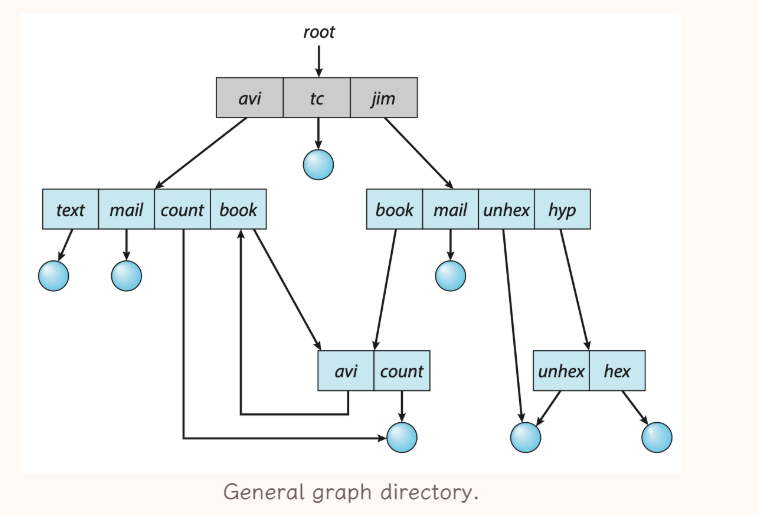​

### 6.4 文件系统

文件系统 file system 存储在二级存储上，为OS提供快速，便捷的对磁盘数据的操作。

文件系统是OS中，以文件的方式管理计算机软件资源的软件，以及被管理的文件和数据结构的集合

现在的OS都支持多种文件系统

* Unix 使用 Unix FS (UFS)，它基于 BFFS (Berkeley Fast FS)；
* Windows 支持 File Allocation Table(FAT), FAT32 和 Windows NT File System (NTFS)；
* Linux 的标准文件系统是 extended file system，最常见的是 ext3 和 ext4。不过 Linux 支持 40+ 种 FS。

**挂载 mount**

挂载是指将一个文件系统的**根目录**挂载到另一个文件系统的某个目录中（该目录称为mount point）。这使得该目录下的文件可以访问到被挂在的文件系统中的文件。

只有被挂载了，一个文件系统才能被访问

​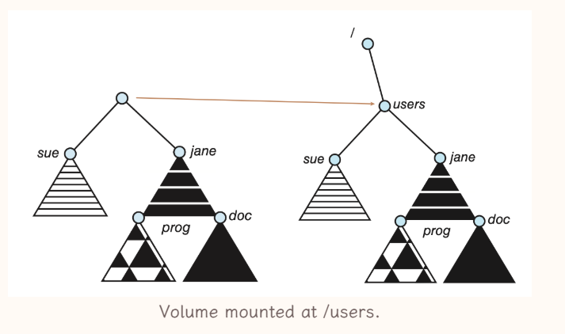​

**文件系统分层设计**

文件系统被分为多层的模块，向上与 Application Programs 请求交互，向下与 device 交互

​​

* I/O control

  * 向下控制 IO devices 向上为文件系统提供对其的IO功能
  * 包含 device drivers 和 interrupt handler 与具体的device进行交互，同时向上层屏蔽相应的特征

    * device drivers为上层提供了一套统一的接口，往往是一系列异步中断处理方案
* Basic file system

  * 向下发出抽象的操作指令，例如读和写
  * 与IO调度相关
  * 管理 memory buffer 和 caches

    * buffer 的作用在于优化外部排序
    * cache 会用来存储一些频繁用到的文件系统元数据，以提高文件系统性能，管理file system, directory 和 data block的缓存
* File-organization module

  * 以 basic file system 的功能为基础
  * 实现了 file 的 logical block 到 physical address 的映射
  * 包括了 free-space manager 

    * 维护了那些没被分配的blocks，并在file-organization module 请求的时候提供这些blocks
* Logical file system

  * 存储文件系统的结构信息，不包括实际的文件内容信息，管理所有的metadata，其实就是管理目录和FCB
  * 其会维护 directory 的信息，为file organization module 提供一些信息，例如符号文件名
  * FCB（file control block） 会维护被打开的文件的一些具体信息
  * 将读写 “文件名” 的指令转换成 读写 “logical block”
* Application program: 发出 read / write / open 某个 file path 的指令，传递给下一层

分层的设计可以降低文件系统本身的复杂性和冗余性，但是可能一定程度上影响性能

### 6.5 文件系统的实现 *

为了实现文件系统，我们需要在硬盘和内存中维护一些数据结构

**硬盘数据结构 on-disk structures**

* Boot control block

  * per volume 每个卷有一个这样的结构，前提是这个 volume 是 boot parition
  * 操作系统被保存在引导控制块 Boot control block 中，是操作系统所在Volume的第一个block
  * 这里存储 引导 OS 需要的信息
  * 在 UFS 中，boot control block 也被称为 boot block；在 NTFS 中，也被称为 partition boot sector。
* Volume control block

  * per volume
  * 卷控制块 Volume control block 维护了volume中的具体信息，例如其中的blocks数量，空闲block数量和指针，空闲PCB数量和指针
  * 在 UFS volume control block 也被称为 superblock；在 NTFS 中，也被称为 master file table
* Directory structure

  * per FS 每个文件系统有一个
  * 目录结构 Directory structure 用来组织files，同时维护files的元信息
  * 在 UFS 中，它维护了文件以及对应的 inode numbers；在 NTFS 中，它在 master file table 中被维护。
* File control block

  * 文件控制块（file control block FCB) 维护了被打开的文件的具体信息，PCB一般有一个唯一的标识符与目录项相关联
  * 一般包含 文件权限，文件操作日期，size，位置等等
  * 在 UFS 中，FCB 指的就是一个 inode；在 NTFS 中，PCB 通常在 master file table 中被维护，其维护形式类似于关系形数据库。
  * ​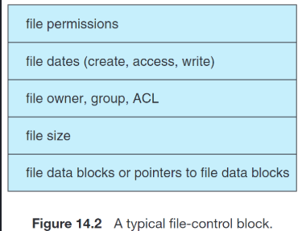​

**内存数据结构 In-memory structures**

* Mount table

  * 被挂在的volume会被记录在mount table中
* Directory cache

  * 为了提高文件系统的性能，一些最近被访问的目录信息会被缓存到内存里，这些目录信息就是 Directory cache
* System-wide open-file table

  * 记录这个系统中所有进程打开的文件
* Per-process open-file table

  * 记录每个进程打开的文件，其entry指向 system-wide open-file table 里的entry
* Buffers

  * 在内存中，用于缓存 disk block 的内容
  * 当读disk block的时候，其内容会被放到buffer中，当要写disk block的时候，会先写入buffer中
  * 通过上述方式，buffer可以实现统一CPU和IO设备之间的速度差异

**文件操作的实现**

* file creation

  * 当应用程序需要创建的文件的时候，会调用 logical file system，并给出文件名，以此更新 Directory
  * 创建文件的时候，一个对应的FCB会被创建，对应的 Parent Directory会被载入内存进行更新
* file open

  * 当我们需要打开文件的时候，首先会在 system-wide open-file table 查找这个文件，若是找到了则说明其正在被其他文件使用，可以直接进行下一步。
  * 若没有找到，则需要在Directory structure中查找这个文件，找到之后将其FCB复制进入 system-wide open-file table 表示该文件被打开
  * 随后在该进程的 per-process open-file table 创建一个entry，指向 system-wide open-file table 中的entry，表示该进程打开了这个文件，并使得其entry += 1
  * 随后对于文件的操作都依赖于 system-wide open-file table 中的entry指针，UNIX中成为 file descriptor，Windows中称为 file handle
* file close

  * 先删除per-process open-file table中的entry
  * 将 system-wide open-file table 中的 entry 的 reference counter -= 1，若此时RC为0，则删除该entry 并且更新 Directory structure 中的信息

**Virtual FS**

VFS将操作和实现分开，将接口定义为了几个操作 open read write close 等等，需要我们去对应位置找到函数指针。

这种设计使得我们可以支持多种不同类型的文件系统

**目录的实现**

​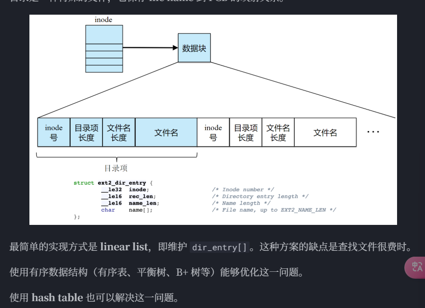​

* linear list based

  * 通过线性表（数组 or 链表）来存储目录信息，每个目录项包括 file name 和 指向 FCB / Inode 的指针
  * 优点：实现简单
  * 缺点：检索效率较低
  * 使用有序数据结构，例如平衡树，B+ 树等等，可以改善缺点
* hash table based

  * 通过hash table 来存储目录信息，每个目录项包含了 file name 和 指向 FCB / Inode的指针，可以直接通过hash function完成查找工作
  * 优点：检索效率高
  * 缺点：可能会有冲突问题，但可以解决，对容纳内容大小有假设

**块分配和块组织 disk block allocation**

这一部分描述了文件如何使用 disk space

* continuous allocation

每个文件占据一段连续的block，具体的分配方案也可以 first fit, best fit 等等

​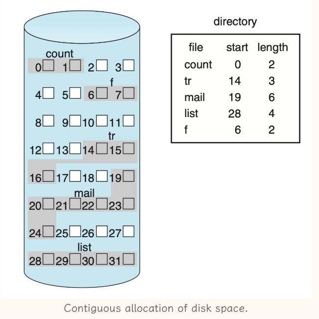​

* 优点：

  * 实现简单，只需要存储 start block 和 length
  * 文件访问效率高，有效降低 seek time
  * 支持 random access ?
* 缺点：

  * 分配时难以找到合适的空间，需要遍历
  * 文件动态变化，变小会产生外部碎片，变大可能没有连续空间（可以通过 compaction 和 defrag 等操作解决外部碎片）

    * 文件动态变大的问题，可以通过extent来解决，也就是再维护一个链表，不够大的时候再分配一块连续空间

​​

* linked allocation

每个文件都是block组成的链表，FCB中记录头和尾，block中存储了next address pointer

​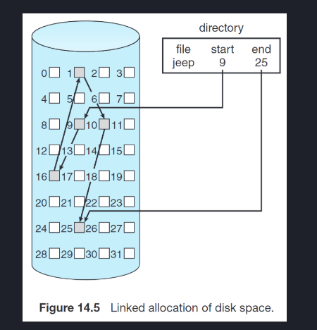​

* 优点

  * 无外部碎片
* 缺点

  * 读一个文件需要较多的 IO 和 disk seek （多个块组成cluster 但是会有内部碎片）
  * 每个块中有几个字节作为 pointer 的overhead
  * pointer 损坏会出现问题 （使用更多冗余信息）

FAT使用的就是 linked allocation

* indexed allocation

给每个文件首先分配一个block，该block里存储了这个文件的第i个块在磁盘的哪里，就维护一个数组，FCB里存储这个indexed block放在哪里即可

​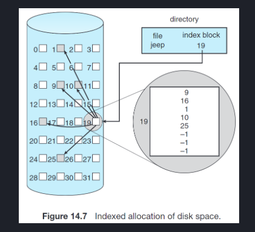​

* 优点

  * 支持 random access
  * 无外部碎片
* 缺点

  * 索引块本身是开销
* 索引块设计问题，一边是希望overhead不要太大，一边要支持大文件的索引，有以下实现思路

  ​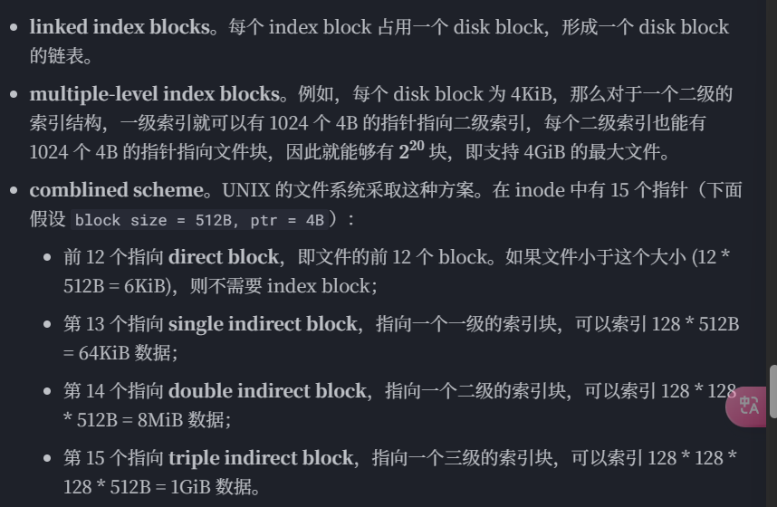​

**Free-Space Management**

> 这个在王道有更详细的描述 P295

### 6.6 典型文件系统

### 习题收录

**王道**

* 打开文件的操作的主要工作是：将指定文件的目录项复制到内存对应区域（并非找到文件）
* FAT32 的文件目录项不包括：文件控制块的物理位置（只会有文件的物理位置）

  * 什么是文件目录项：文件目录项是 “file name 和 FCB” 的对

​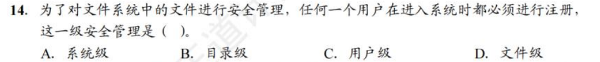​

* 答案是 A

​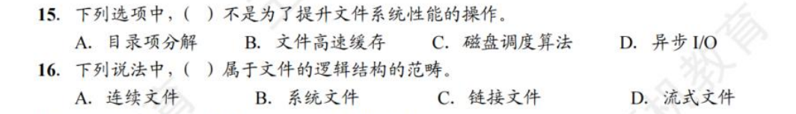​

* 答案是 D D

​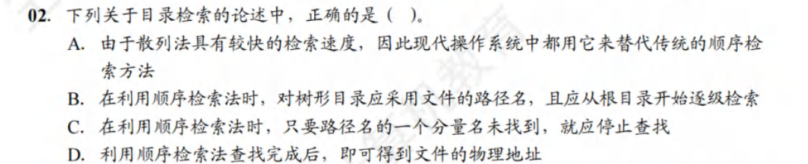​

* 答案是 C 但是似乎不在考试范围内

​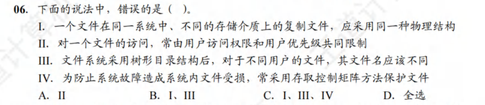​

* 答案是D，其中第二个说法错误，常由用户访问权限和文件属性共同限制

​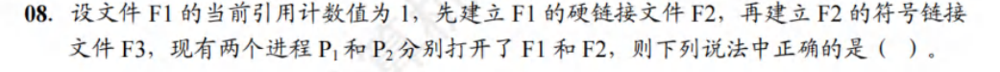​

​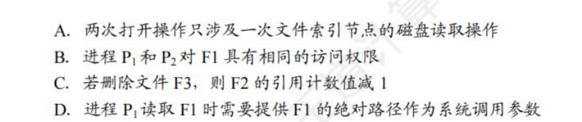​

* 答案是A

​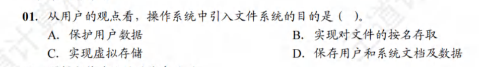​

* 答案是B，奇奇怪怪的理解题

​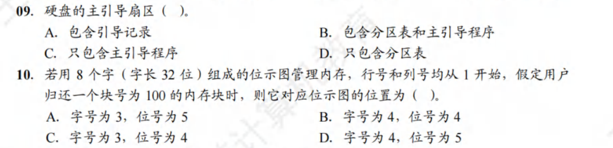​

* 两个答案都是B

**jjm hw**

​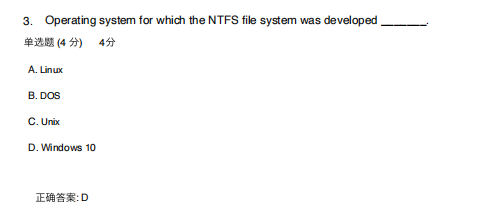​

* a4里有 但是感觉不是很全

​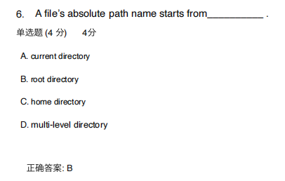​

​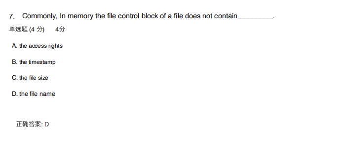​

​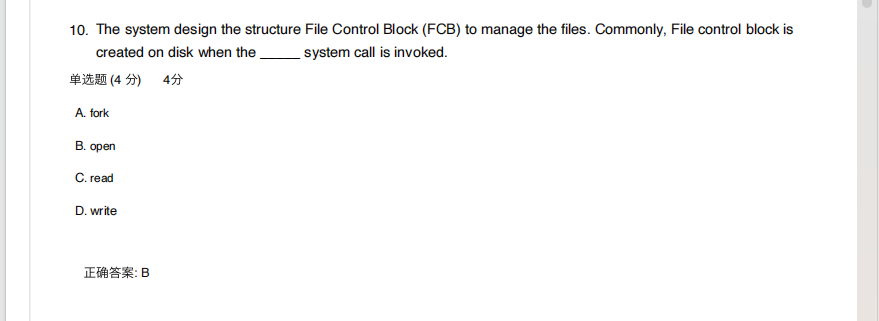​

* FCB是在open的时候被创建的？

​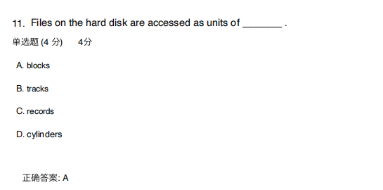​

​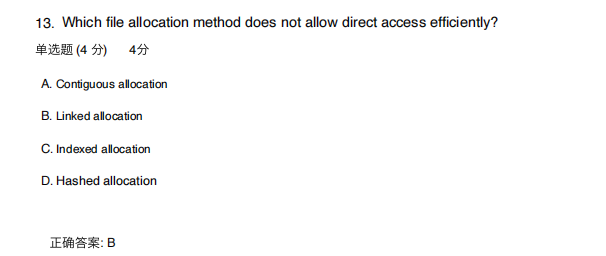​

​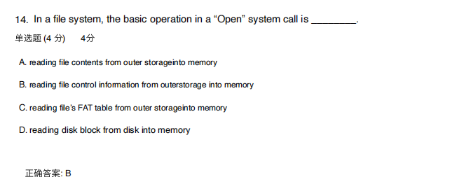​

​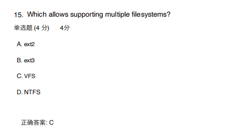​

​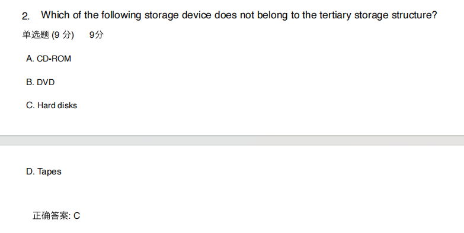​

* 磁盘那边的Homework还要再看一遍
