# 进程管理

* copy on write √
* fork机制的实现，以及fork机制会产生的进程图 作业题已经有了
* 什么是甘特图 √
* 进程终止
* Multilevel Feedback Queue Scheduling 需要看一道例题

  * WIndows XP scheduling
* 一些常见的中断和异常

### 1.1 进程的内容

进程的内容包括

* 用来运行的代码 （可共享）
* 运行的过程中被更新的数据
* 用来维护和控制进程的控制信息

分别存储在虚拟地址空间的**用户部分和内核部分**

* 用户部分如下

​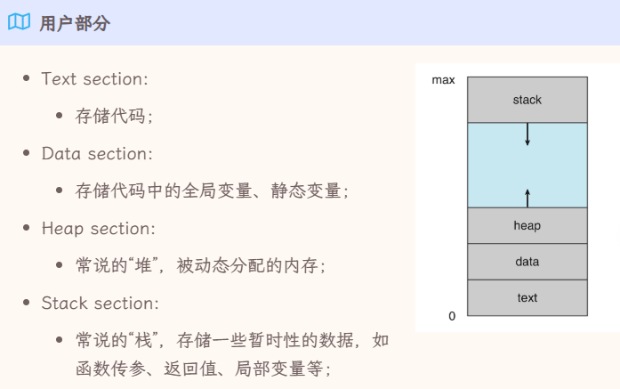​

* 内核部分如下

​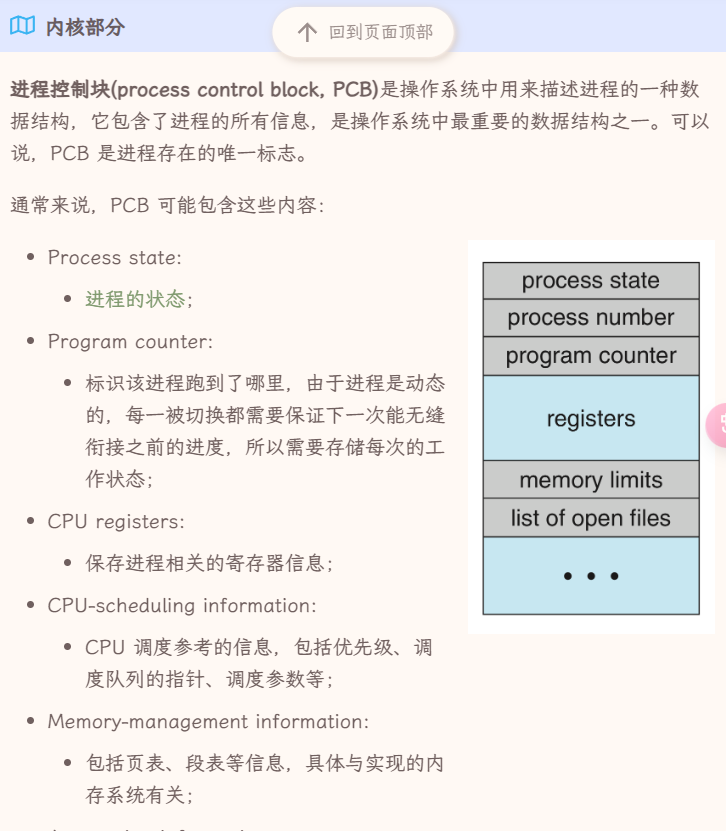​

​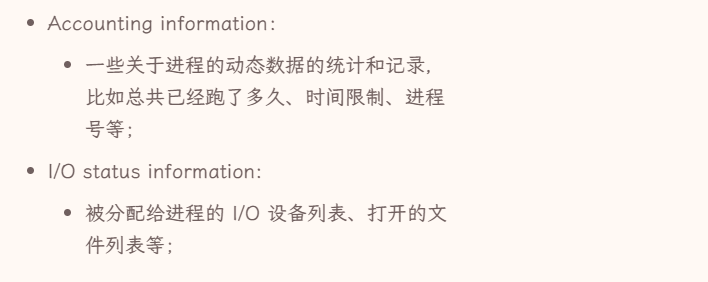​

### 1.2 进程的状态

进程的状态包括

​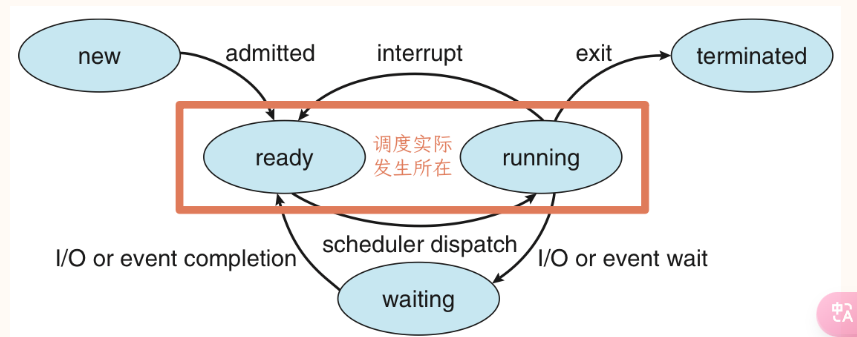​

* new 创建和分配资源的过程
* runninng 正在运行，能running的最大数量和CPU的核数相同
* ready 已经准备好了，只等待CPU资源，如果有ready，肯定有running的占用，CPU调度就是ready和running之间切换
* waiting 进程是等待某事情的发生，比如IO，虽然可能有CPU空闲，也无法running

  * running -> waiting 多数是主动的
  * waiting -> ready 是被动的
* terminated 终止，结束运行释放资源

我们在进程管理中会维护 ready queue 和 wait queue，一个是在等待CPU资源，一个是在等待IO资源

### 1.3 进程的创建

linux中的进程是树状创建的

* pid 进程的id
* ppid 父进程的id

在linux中，最初始的进程被称为`systemd`​，其pid为1，ppid为0

使用`fork`​创建进程，该进程只有进程号和parent不同

创建新进程之后，首先会复制parent的代码数据，随后如果调用exec，那么我们会载入新的程序。

学习`fork`​相关程序

父进程通过`fork`​来创建一个子进程，然后双方从fork下一条指令开始执行，区别在于子进程那边fork的返回值为0，而父进程那边返回值为子进程的pid，然后父进程可以通过`wait(NULL)`​ 来等待子进程执行完成。

**创建的流程**

* 分配一个 pid 并且 分配一个空白的 PCB
* 为进程分配运行所需资源，若资源不足，则在 new 状态等待
* 初始化PCB
* 尝试将其插入 wait queue

**Copy on Write**

因为拷贝父进程的内容会带来比较大的开销，我们可以考虑只有当需要发生内容修改的时候，才真正复制父进程的内容。在这种情况下，只读界面在父子进程之间共享，比较方便

### 1.4 进程的终止

进程调用`exit`​的时候，进程将被终止。

* 进程终止
* 资源释放
* 返回状态值

其状态值将被parent进程的wait接受，如果parent不wait接受它的话，会有一部分资源一直占用在那边进行等待它。UNIX 的解决办法是，让所有孤儿进程都成为 `init`​/`systemd`​ 的 child 进程，由 `init`​/`systemd`​ 来 `wait()`​ 它们。

* 已经终止但是仍然占有资源的进程成为僵尸进程（zombie）
* parent不wait它的进程称为孤儿进程（orphan）

进程间通信

协作进程（cooperation process）需要进程间通信（inter-process communication IPC)

* semaphores
* shared memory  比较快，例如进程间的线程自然共享memory
* message passing 适用于分布式
* pipe  管道本质上也是一种文件，子进程会继承父进程的管道，管道有固定的大小，并且读写会阻塞对方

### 1.5 进程调度

进程调度其实就是围绕着 ready 和 running 两个状态展开

**调度的层次**

* 高级调度 将进程调度进入内存，每个进程只会被这样调度一次
* 中级调度 将进程调度进入内存，看起来干的事情是一样的，但是会发生多次，会将暂时不运行的进程丢到磁盘上**挂起**
* 低级调度 CPU调度

**调度的过程**

CPU scheduler 选择一个 ready 进程执行，由 dispatcher 来完成具体的切换工作

1. 在两个进程之间进行上下文切换（CPU寄存器里的值，进程状态，内存的管理信息等等）
2. 切换到用户态
3. 跳转到用户程序中合适的位置并且继续执行进程

从 dispatcher 停止上一个进程到运行下一个进程之间的延迟被称为 dispatch latency

> 若进程切换时，系统内没有 ready process 那么就会调度 idle process 其 PID 为0，不需要除了CPU以外的任何资源

**不能进行调度的情况**

* 处理中断的情况
* 需要屏蔽中断的原子操作

**调度算法的评价指标**

* CPU utilization CPU使用率
* throughput 吞吐量 单位时间完成的进程数
* turnaround time 周转时间，从进程开始建立到进程完成的时间
* waiting time 进程在ready queue里等待时间的总和
* response time 进程从发出请求到第一次响应的时间 ？展示及时性

**一些常见的进程调度算法**

* FCFS 先进先服务，非抢占的调度方法，最大优点是实现就简单，有利于CPU繁忙，不利于IO繁忙，相对后面的算法而言：有利于长任务，不利于短任务
* SJF，当多个进程处于就绪态的时候，选择需要运行时间最短的进程进行运行，最大优点在于，可以保证平均等待时间最小，但是缺点在于会导致运行时间较长的进程“饥饿”，非抢占，当有更新的更少时间进程进入，也得等现在这个进程执行完
* SRTF，与SJF基本完全一样，其会在更新更少时间进程进入时，抢占CPU，也会“饥饿”
* RR 时间片轮转，属于抢占式调度，每个进程执行一个时间片，完成之后插入到FIFO队列
* Priority Scheduling，优先级调度，基本等于SRTF里的“更少时间”改为“优先级更高”，实际上SRTF是优先级调度的特例，属于抢占式调度，会导致“饥饿”

  * 可以设置静态优先级和动态优先级
  * IO进程大于非IO进程，系统进程大于用户进程，交互性进程大于非交互性进程
* Multilevel Queue Scheduling：设置不同的队列，每个队列可以采取各自的调度算法，同时队列和队列之间也可以设计调度算法，往往是优先级调度
* Multilevel Feedback Queue Scheduling：看看PPT和王道的定义 似乎有不同*

### 1.6 线程

引入线程之后，线程是CPU分配的单位，而进程则是CPU以外系统资源的分配单位

**线程的实现方式**

线程本身的实现方式分为两种，用户级线程 User-level Thread ULT 和 内核级线程 Kernel-Level Thread KLT

* ULT 线程管理：创建，切换和撤销都在用户态完成，用户程序通过调用线程库来完成这个工作

  * 优点：线程切换更快，可以自行实现专门的调度算法，实现是平台无关的
  * 缺点：一个线程的阻塞使得整个进程内的线程都被阻塞，不能发挥多核CPU的优势（一个进程只会被分配到一个CPU）
* KLT 线程管理的工作都在内核态完成

  * 优点：能发挥多CPU优势，一个线程被阻塞不影响其他线程
  * 缺点：同一进程的线程调度仍然要进行内核态用户态切换，开销较大
* 组合方式：既可以创建ULT也可以创建KLT

**线程库**

线程库可能是创建了用户线程，也可以是对系统调用创建内核线程的一个封装，现代常用的线程库有

* POSIX Pthreads: 类UNIX系统
* Windows API: Windows系统
* Java：JVM自动调用宿主系统自身的线程库

**多线程模型**

* Many-to-one，其实就是只支持ULT
* one-to-one，其实就是指支持KLT
* Many-to-Many，其实就是组合模式，n个用户级线程映射到m个内核级线程，要求 $n\geq m$

### 1.7 习题收录

**王道**

* 并发进程的运行结果有不可再现性
* 单处理器中，任何时刻都只有一个进程处于运行态 × 死锁时可能全部处于阻塞态
* 单处理器中，若同时存在10个进程，最多只有9个处于就绪态
* 进程之间可能是无关的，也可能是相关的
* PCB中不应该包含 信号量
* 键盘输入，不是多线程系统的特长，因为输入很慢
* 当进程用运行态变为就绪态，必然引起进程切换
* 信号量的 wait 导致进入 waiting 而不是 ready
* 不管系统是否支持线程，进程都是资源分配的基本单位 √
* 作业是指用户的任务，而进程是由操作系统管理的，二者视角不同

​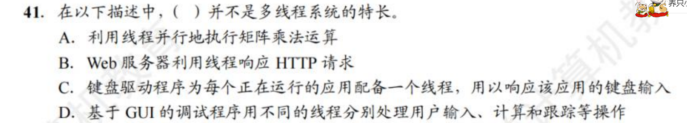​

* 答案是C

​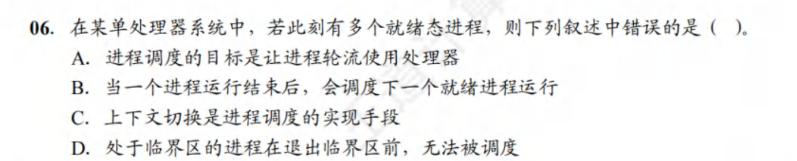​

* 答案是D，但是我感觉它在胡言乱语

**jjm 作业题**

​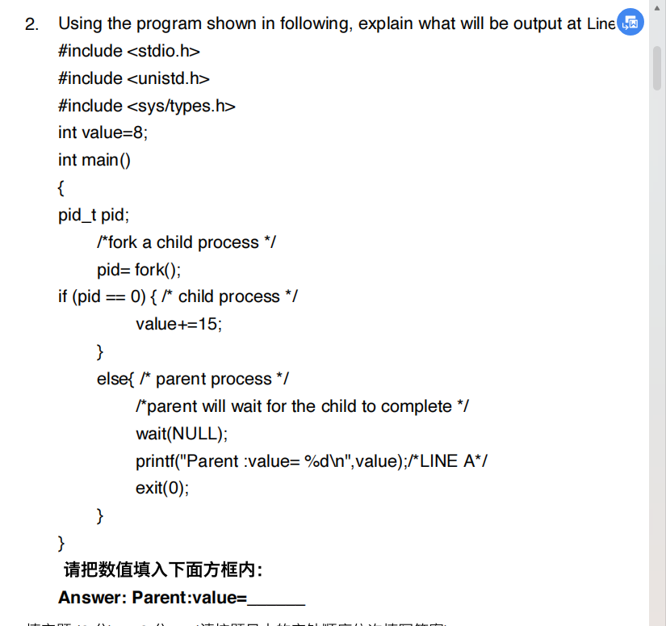​

* 答案是8 子进程的修改不影响父进程

​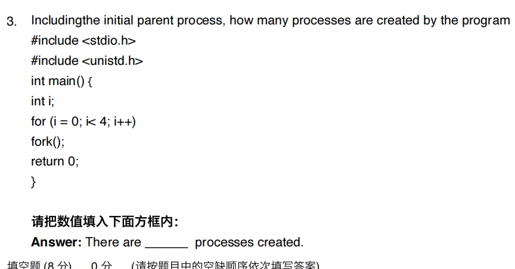​

* 答案是 16 注意大标题说了 including the initial parent process

​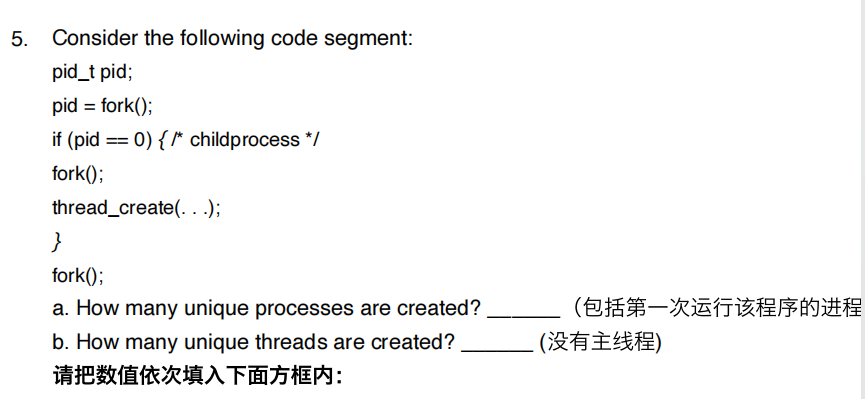​

* 6 2

​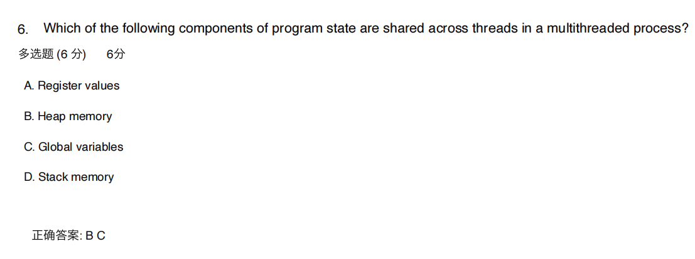​

子进程即便创造了线程，也无法影响父进程

​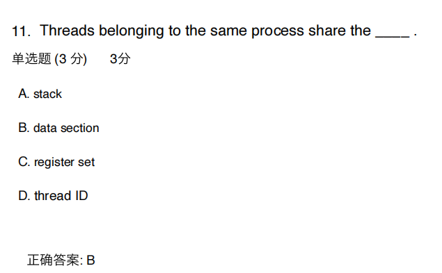​

​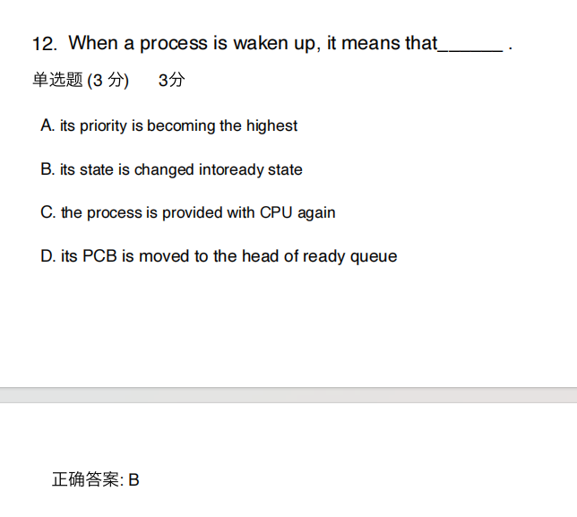​

​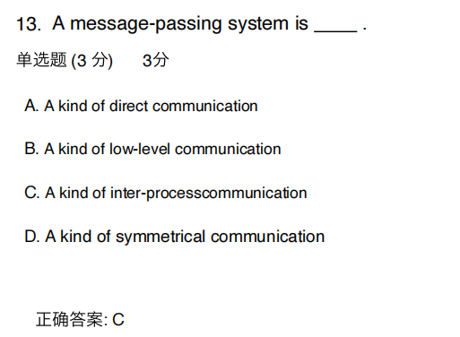​

* inter-process

​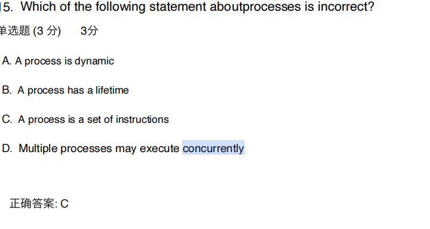​

​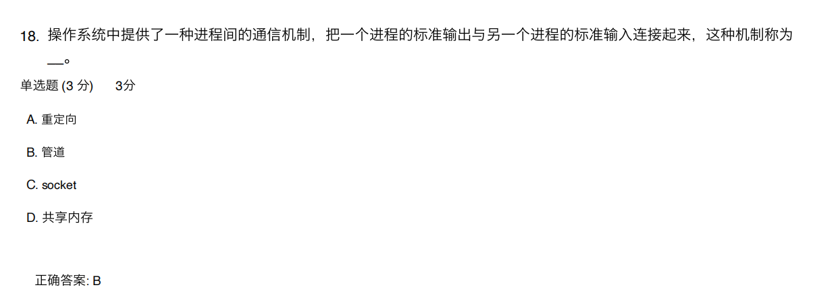​

​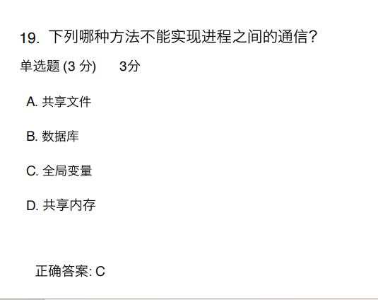​

​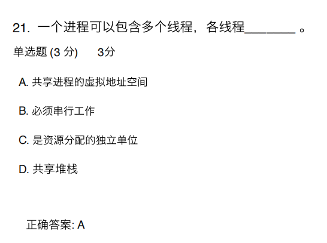​

​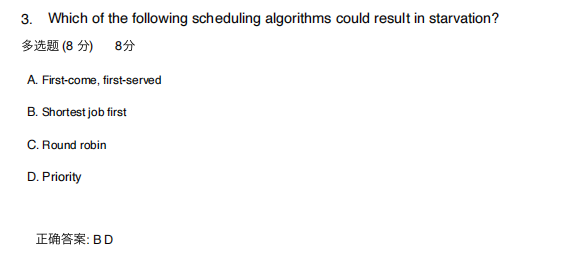​

​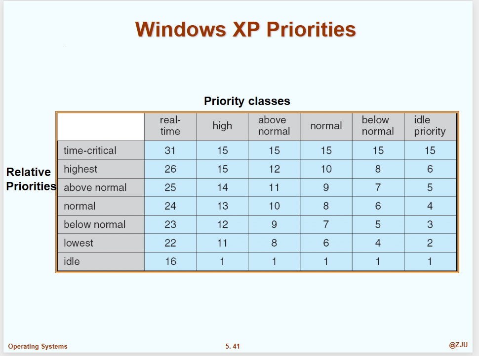​

​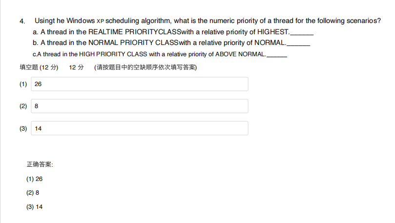​

​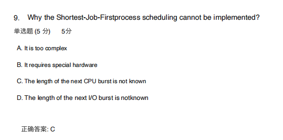​

​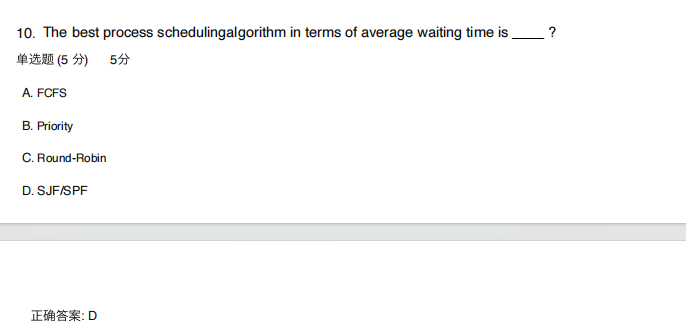​

​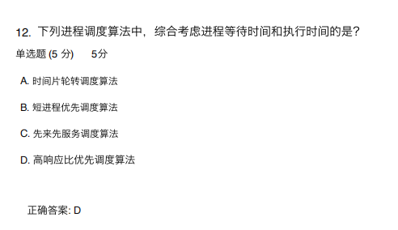​

​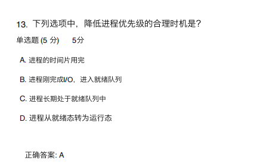​

​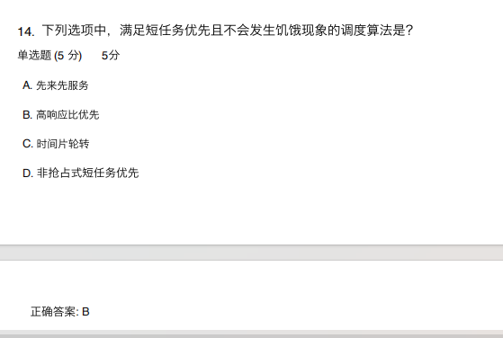​
