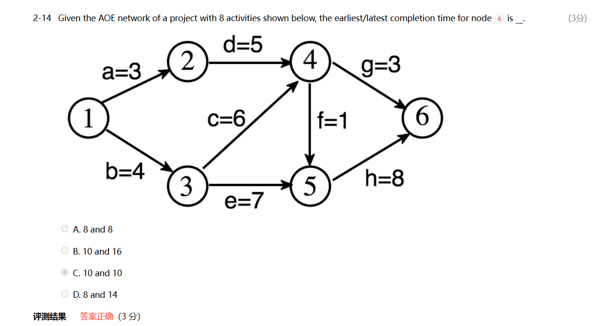

# 数据结构基础

!!! note "数据结构基础"
	本篇笔记和cs61b有很多的重复之处，相对来说我会对61b做的更加详细一点
	除了图论的部分，请参照这篇笔记。末尾有我期末复习时记录的一些错题，但并未很详细

## bonus

bonus problem1 queque using two stacks.

## never test your code in PTA, be careful to submit in PTA

some tips of C IO

If we want use scanf and getchar together, and we should pay attention that scanf will leave a '\n\' and will be received by next getchar()

read是阅读的，不必提交  
PR是用来提交的

注意文件属性里面不要写到自己名字，屏蔽文件属性的姓名显示

### part1 algorithm analysis

### time complexity

We usual express the time complexity of an algorithm by T(n), in which n is the parameter the algorithm needs.

An important example, how to calculate the time complexity of recursive function like Fibonacci

### compare the algorithms by an example of MaxSubsequenceSum

Given integers array A1 to An, find the maximum value of sum of subarray from Ai to Aj

1. The most obvious thought is to use three loops and check every possible subarray. It is O(n).

2. But we can make some changes, it is easy to find we only need two loops

```cpp
int MaxSubsequendceSum(const A[],int N){
	int ThisSum,MaxSum,i,j,k;
	MaxSum=0;
	for(int i=0;i<N;i++){
		ThisSum=0;
		for(j=i;j<N;j++){
			ThisSum+=A[j];
			if(ThisSum>MaxSum){...}
		}
	}
	return MaxSum;
}
```

Besides, when we have O(n^2) complexity, we can refer to O(nlog(n));

3. In the question, we can use divide and conquer(分治法). Devide and conquer are recurive mostly, the expression  
    is T(N)=2*T(N/2) + cN, T(1)=O(1);           T(N)=2^kO(1)+ckN    2这个系数是在本题的情形下，但系数不影响我们的时间复杂度
4. On-line algorithms. Awesome, we can use an algorithm make complexity by O(n).  
    If the former part of subsequence, they must be deleted.

```cpp
int MaxSubsequendceSum(const A[],int N){
	int ThisSum,MaxSum,i,j,k;
	MaxSum=0;
	for(int i=0;i<N;i++){
		ThisSum+=A[i];
		if(ThisSum>MaxSum){
			MaxSum=ThisSum;
		}else if(ThisSum<0){
			ThisSum=0;
		}
	}
	return MaxSum;
}

```

‍

### logarithms in the running time

Logarithms is about the logn in the time complexity. For example, the binary search is a good representation of logarithms  

Binary search can use loop or recursion. We cna write a recursive expression.

Tips: binary search need the array is already sorted, which also need the array to be static. If we always add and delete data, it will take a lot of time to maintian the sorted array

### check the analysis

If T(N)=O(N)  check if T(2N)/T(N) = 2;  
                N^2                                 4

T(N)=O(f(N)), check If T(N)/f(N) is contant.

N need to be large enough.

## part2 lists, stacks, quences

### abstract data type (ADT

data type={object}+{operations}.

The abstract data type is separated from its implementation.

### the list ADT

objects: item0, item1, ... itemN-1

operations: refer to book, insert, delete and find are most important.

### list examples

1. polynimial

不要用指数作为下标，会导致空间浪费，建议是struct array or struct linked list.

2. mutilists

40000 students and 2000 courses, we want to know each student's courses, and use course to know  
who choose this course

We cam use array[40000][2000] but it wastes a lot of space.  
So, we can use mutilists 

### stack

前缀表达式和后缀表达式

### queue

circular queue

front and rear

what is empty and what is full?

‍

## tree

#### the basic features of tree

The choice of root is important of the features of the tree.

* Tree is composed of the N **nodes** and N-1 **edges.**

* The roots are the nodes without parents  
  The leaves are the nodes without children
* The number of node in the tree can be empty.
* The subtrees of a node can't be connected, there is no loop in the tree.
* **the degree of the node ** the number of subtrees of the node
* **the degree of the tree ** the max degree of the node max{degree(node)}
* parent is the node has subtrees  
  children are the nodes have parent  
  siblings are children have the same parent
* the path from one node to another is unique, the length of the path is the number of edges between.
* the depth of node is the length of path between it and root, the depth of root is 0.
* the height of node is the longest length of the path between it and the leaves
* the height of tree is the height of root   对于单根节点的树，height为0
* ancestors of a node are the nodes between it and the root  
  descendants of a node are the nodes in its subtrees.

#### some special trees

* binary trees: the degree of the node is the less than 2  
  The pointer of the binary tree is the 2*n but the not-null pointers is n-1, it is waste.  
  如果是左指针为null，则放置为中序的前一个节点，若右指针为null，则放置中序的后一个节点。对于中序的最后一个节点和第一个节点  
  可能需要一个空头节点来作为他们指针指向的对象  
  二叉树中，叶子结点的个数为度为2的节点个数加一

#### the implementation of the tree

The most direct way to implement the tree is the linked list, however the number of pointers is uncertain  
But we can make some modified, each point have the two pointers, to the FirstChild and the NextSibling. It can finish but the implementation of the same tree may be different in this way.

The implementation of FirstChild-NextSibling can turn all trees to binary tree.

**create the expression tree**

we can use the postfix expression to create the expression treep

#### the traversal of the tree

To visit each node exactly once,

preorder root is the first

```cpp
void preorder(tree_ptr tree){
	if(tree){
		visit(tree);
		for(each child of tree){
			preorder(child);
		}
	}
}
```

postorder root is the last

```cpp
void postorder(tree_ptr tree){
	if(tree){
		for(each child of tree){
			preorder(child);
		}
		visit(tree);
	}
}
```

levelorder 

```cpp
void levelorder(tree_ptr tree){
	enqueue(tree);
	while(queue is not empty){
		visit(T=dequeue());
		for(each child of T){
			enqueue(child);
		}
	}
}
```

inorder 只针对二叉树版本

```cpp
void inorder(tree_ptr tree){
	if(tree){
		inorder(tree->left);
		visit(tree->element);
		inorder(tree->right);
	}
}
```

对于一些递归代码，我们可以通过自己创造栈去用循环实现递归

thread tree

#### binary tree

properties of binary tree

n0 n1 n2  
n2=n0+1

n=n0+n1+n2  
n0+n1+n2-1=E=2*n2+n1

skewed binary tree.

complete binary tree

BST

**find**

## priority queues (heaps)

The **min tree** is the tree that its children always smaller than its parent. And the **min heap** is the completed min tree.

delete the element with the highest/lowest priority

Insert and delete min

insertion is random and the deletion is always the lowest

**binary heap**

1. structure property: it is a complete binary tree, which is a sequential set of perfect binary tree. (完美二叉树从上到下，从左到右编号，完全二叉树是其中连续的子集)
2. 插入需要构建一个完全二叉树，以最小堆为例，保证子节点大于父节点

**insert**

以最小堆为例

先假设要插入的元素出现在完全二叉树的最后一格，然后向上寻找，如果上面有比他大的，就换下来，如果父节点比它小，就结束

```cpp
void insert(ElementType X, Heap H){
	int i;
	if(isFull(H)){
		printf("error the heap is full");
	}
	for(int i=++(H->size);H->Elements[i/2]>X;i=i/2){
		H->Elements[i]=H->Elements[i/2];
	}
	H->Elements[i]=X;
}
```

**delete min**

还是以最小堆为例

```cpp
ElementType delete_min(Heap h){
	if(isEmpty(h)){
		printf("ERROR delete empty heap\n");
		return h->Elements[0];
	}
	ElementType ans=h->Elements[1];
	ElementType LastElement = h->Elements[h->Size--]; //取了最后一个，并且把size--
	int child;
	for(int i=1;i*2<h->Size;i=child){
		child=i*2;
		if(child!=h->Size && h->Elements[child+1]<h->ELements[child]){
			child++;
		}
		if(LastElement > h->Elements[child]){
			h->Elements[i]=h->Elements[child];
		}else{
			break;
		}
	}
	H->Elements[i]=LastElement;
	return ans;
}
```

**decrease key  对于一个key的value，降低它的值，也就是提高它的优先级**

**increase key  做相反的操作**

**delete key 删除key对应的结点   先decrease key使其变为根节点 然后delete min**

**build heap  先不管顺序直接建立堆 从最大非叶子节点开始到根节点，各做一次percolateDown O(N)**

## disjoint set

**the definition of equivalence relation**

The equivalence relation over S if and only if it is symmetric, reflexive and transitive over S.

symmetric 对称性

reflexive 自反性

transitive 传递性

equivalence class is the subclass of a set and all of elements in it has equivalence.

(2,4) = (1,(2,3))=(1,(1,(2,2)))=(1,(1,(1,(1,2))))

**find**

```cpp
find(ElementType X,DisJoint S){
	if(S[x]<=0) return X;
	else return S[x]=find(S[x],S);
}
//返回根节点
int find(int m,int set_joint[]){
    int root,temp,lead;
    for(root=m;set_joint[root]>0;root=set_joint[root]);
    for(temp=m;temp!=root;temp=lead){
        lead=set_joint[temp];
        set_joint[temp]=root;
    }
    return root;
}
```

**setunion**

```cpp
setunion(find(1),find(2));
//链接两个节点是对其根节点进行操作
void make_union(int m,int n,int set_joint[]){
    int m_root=find(m,set_joint);
    int n_root=find(n,set_joint);
    if(set_joint[m_root]<set_joint[n_root]){
        int temp=set_joint[n_root];
        set_joint[n_root]=m_root;
        set_joint[m_root]+=temp;
    }else{
        int temp=set_joint[m_root];
        set_joint[m_root]=n_root;
        set_joint[n_root]+=temp;
    }
}
```

## graph

**definition**

V(G): the set of vertices, which is nonempty  
E(G): the set of edges, can be empty

In undirected graph (v1, v2)=(v2, v1); they are same edge

In directed graph(digraph) <v1, v2> != <v2, v1>

In the lesson FDS, we add some limitation to the graph

1. we don't have self loop
2. we don't have multiedges between two vertices

**some conceptions**

1. v1 and v2 are adjacent which means there is an edge between them  
    In directed graph, we called v1 is adjacent to v2 and v2 is adjacent from v1. the edge is incident on v1 and v2
2. subgraph V(G1) is subset of V(G)&& E(G1) is the subset of E(G)
3. path from v1 to v2  v1, v11, v12 .... v1n, v2  
    the length of path
4. simple path there is no repeat vertices in the path, and the only v1 and v2 can be same
5. cycle v1==v2
6. the graph is connected all of pair of vertices is connected
7. the maximal connected subgraph 联通子图中有最多节点的那个
8. e is the sum of degree /2

**some special graphs**

1. complete graph: has the maximum number of edges  C(n, 2)
2. tree is connected and acyclic graph
3. DAG is a directed and acyclic graph  有向无环图
4. strongly connected directed graph  all of pairs of v1 and v2 we can find path from v1 to v2 and v2 to v1.  
    If it is connected when we overlook the directed feature of edges, we call it weakly connected graph.
5. strongly connected component is the maximal subgrah that is strongly connected ( a single vertice can be a strongly connected subgraph)
6. the number of edges incident to v and for directed graph we have in-degree and out-degree

### representation of the graph

 ** we can use the adjacency matric**

```cpp
0 1 0
1 0 0
0 0 0
```

a[0][1] is 1 which expresses there is an edge between 0 and 1

如果是无向图的话 只需要存下三角就行 因为是轴对称的

degree 如果是有向图的话要加两遍矩阵再/2

**the adjacency lists**

每个节点都设计一个链表，把其边都表示出来

对于有向图 每个节点设计两个链表，一个表示出的边，一个表示入的边  
也可以通过multilist

设计边的结构，并且将其连起来

### algorithms

#### topological sort

**例子 修课顺序**

i is a predecessor of j, which means there a path from i to j.

i is a precedes of j, which means there is <i, j>

partial order, it is transitive and irreflexive(there is no i->i or circle)

topological order is not single.

We just need to find one in this algorithms

This graph must be a DAG

**solution**

Always find the vertices which in-degree is 0. (If there is no such vertices, it must be circle in this graph)

```cpp
V=FindNewVertexOfDegreeZero();
```

We loop at first and find all of VertexOfDegreeZero then we add the VertexOfDegreeZero to the set during the algorithms 

O(V+E)

#### shortest path problem

This problem is no solution in the there is a loop in negative number

**unweighted shortest problem**

每条路的权重相同

从起点开始，找一步能到的；再从一步能到的点为起点，找一步能到的，如此循环

It is also called breadth-first search

可以用队列设计

**dijkstra's algorithms**

对于带权重的有向图，该算法指针对非负权重的图

分为三个集合，一个集合是已经找到最短路径的点，一个集合是通过上一个集合直接走到的点，最后一个是无法通过第一个集合直接走到的点  

有着三个集合之后，计算第一集合到第二集合的点的各条路径的长度，其中最短的那条必然是其对应的点的最短路径（因为其他必须经过更长路径）将其加入第一集合

**negative edges graph**

对于存在负边的图，dijkstra算法就不适用了，

```cpp
Q=createque;
while(!Q.empty()){
	V=deque(Q);
	for(each W adajcent to V){
		if(T[V].dist+CV<T[W].dist){
			进行处理
		}
	}
}
只要不存在负环，程序就能终止
```

**acyclic graph**

T=O(E+V)

可以计算最小的路径，并且需要完全前序所有内容

可以单纯计算最小路径

All-pairs shortest path problem

#### network flow problems

边的设计在于一个点的出量和进量

找任意路径（最好是最大容量路径，删边（减去这条路径上的最小值，或者是反向加边）

其终止条件是边长为rational number 有理数

#### minimum spanning tree

the spanning tree is a tree which consists of V(G) and the subset of E(G)

只有连通图才有生成树，并且连通图一定有生成树

what is minimum 该生成树的边权重之和最小（边的数目必为V(G)-1

* 使用图中边
* 不重复找点
* 不形成环
* 找小权重的边

kruskal-----maintain a forest  ElogE

* 不断地找最短边  小根堆
* 如果两个点已经在同一颗树里了就跳过  并查集

#### depth first search

like the preorder the search, 但是需要加上一个visited判断防止重复判断（树里面之所以没有因为树的方向是一致的，从父亲到孩子

对于联通图，可以用DFS遍历，如果需要处理非连通图

```cpp
void DFS_all(Graph g){
	for(each v in g){
		if(!visited[v}){
			DFS(v);
		}
	}
}
```

**biconnectivity**

articulation point关节点 除去这个点后会造成至少两个连通图

graph is biconnected graph if there is no articulation point in this graph(this graph should be connected at first

biconnected -> 拿掉一个顶点还是联通的 （至少有两个节点）

k-connected -> 拿掉k-1个顶点还是联通的

a biconnected component is a maximal biconnected subgraph（相对于自己来说最大

一个图拆分出的component之间不会有重合的边

**how to find the biconnected components of a connected undirected G**

1. use the DFS to obtain the spanning tree
2. we will have a tree and a back edges(除了生成树的边以外的边，必然会链接祖先后代，不会是同深度)
3. 对于这棵树和back edges 对于root 如果有两个以上孩子，一定是关节点；对于叶节点不可能是关节点；对于其他节点而言，向下走能通过back edges 走到其祖先（自己不算），那么就不是关节点

Low(number)= min(num(number), min(low(child)), min(num(back)))

算出low number，条件化为

1. u is a root and has at least 2 children
2. u is not the root and has at least 1 child and Low(child)>=num(u)

‍

#### 欧拉回路

1. the graph has euler circuit is possible only if all vertex has a even degree
2. the graph has the euler tour is possible only if all vertex has a even degrees and there are two vertices have odd degree

implementation

1. DFS,不断找环，然后拼起来

hamilton cycle 的定义

## sort

```cpp
void X_sort( A[], int N)
```

#### insertion sort

the lower bound for simple sorting algorithms

做排序的本质是消除逆序，一次相邻交换最多删除一个逆序，平均而言一个数组会有n(n-1)/4 个逆序inversions

#### shell sort

For example

* make 5-sort 间隔4个元素，做一个插入排序（还是在原来的那几个位置上，例如1 6 11，也只交换这三位元素），做多次直到每个元素都被计算到
* make 3-sort 同理
* the end make 1-sort 对整个数组做插入排序

前置的5-sort and 3-sort已经消除了大部分的逆序对，导致了插入排序的效率提高

define an increment sequence

* questions: 前置的处理是否会使得逆序对增加？首先，我们只会交换逆序数，分三种情况  
  两交换数内部数字，在a和b中间，有收益  
  两交换数外部数字，(>a || <b)，逆序数+1 -1 对于该数而言至少没有负受益

tips: hk-1-sort 不会破坏 hk-sort，数或许改变了，但是顺序的正确性未改变

**how to define the incremnet sequence**

上述例子中我们比较随意地选择了 1 3 5 的排序方式

但实际上我们一般会选择  ht = 向下取整(N/2)  hk = 向下取整(hk+1 / 2）（shell's increments)

```cpp
for(increment = N/2 ; increment > 0 ; increment /= 2){
	for(int i= increment ; i<N ; i++) //插入排序
```

**时间复杂度分析**

the worst case is O(N^2) follow shell's increments (每个子序列都是排好序的，但本身是乱序，退化成插入排序

increment seqence is important for the efficiency in the shell sort, it will be better the sequence is all relatively prime（互质）

* if hk = 2^k - 1  ^the worst case become O(N^3/2)
* if hk = 9x4^i^ - 9 x 2^i^ +1 the worst case become O(N^5/4)

**排序算法的分析**

* in-place  不需要额外开缓存（至少需要重新开一个地方存数组   shell和插入都是
* stable      不改变相同量的数据的原先顺序(例如给学生年龄排名，a和b同龄，本来a在b前，排序后a也在b前)，插入排序是stable，shell排序不是

#### heap sort

选择排序的优化，选择排序需要每次遍历来找出最小的值，放在首位。heap可以加快找最小值的过程

```cpp
heap_sort{
	build_heap(H);
	for(int i=0;i<N;i++)
			tmpH[i]=deleteMin(H);
	for(int i=0;i<N;i++){
			H[i]=tmpH[i];
}
```

O(N*logN)

但是其中使用了tmpH数组，使其不是in-place，可以进行优化，把deletemin的删除元素再放回堆的最后，但这样最好从小到大排时，使用大根堆

```cpp
void heapsort(A[],int N){
	for(int i=(N-1)/2 ; i>=0 ; i--){
		pecDown(A, i, N);
	}
	for(int i=N-1; i>0; i--){
		swap(&A[0],&A[i]);
		percDown(A,0,i);
	}
}
```

**构建堆（常考，注意在heapsort里没有哨兵，0位是要用的，左孩子变成2*i+1 右孩子是2*i+2**

in-place but not stable

额外空间是O1

#### merge sort

merge two sorted list

新开一个数组，开始比较两边的最小数，放进新的数组 O(N)

```cpp
void Msort(A[],temp[],left,right){
	if(left < right){
		center=(left + right) / 2;
		Msort(A,temp,left,center);
		Msort(A,temp,center+1,right);
		merge(A,temp,left,center+1,right);  //merge 会copy temp的结果到A数组
	}
}
//上面的算法是核心，下面是给用户的接口
void mergeSort(A[],int N){
		new a temp;
		if(temp!=NULL){
			Msort(A,temp,0,N-1);
			free temp;
		}
}
	

```

O(N+NlogN)  见PPT推导  每层N 一共logN层

tips 链表形式的merge sort，例如heapsort等需要随机访问的，就不能使用linked list

#### quick sort

fastest known in practice.

做partion, 选择一个元素，把比他小的放一块，比他大的放另一块，再对这两块都递归

1. 元素怎么选
2. partion如何实现

选择元素  随机，median(left, center, right)

partion 不开缓存，先把选择元素给放到最后一个元素int i = 0; int j = length-2;

如果有重复数据与选择的数据相同怎么办

混合策略采用sort，quick sort在较小的时候会比insertion慢，所以会采用递归，在较小时使用insertion

时间分析

T(N) = T(i) + T(N-i-1) + cN

worst case T(N) = T(N-1) + cN;  o(N^2)

best case T(N) = 2T(N / 2) + cN; o(N logN)

average case o(NlogN)s

选择第k大元素 -> 看回放

#### sorting large stuctures

交换其在内存上的占用很麻烦

让其数组变成一个类hash索引数组，改变索引数组

list[table[i]]

每个move会移动多次

#### gengeral lower bound for sorting

基于比较的算法，最坏情况的下界是NlogN

决策树有N!个叶节点，高度是NlogN

#### bucket sort and radix sort

bucket sort

例如10000个学生的分数，分数为0到100，那么我们有101个bucket，将10000个数据插入bucket，插入是个常数时间，所以为O(N)

radix sort

例如给10个数，范围是0到1000，根据位数进行桶排序

## hash

simple table, a set of name-attribute pairs, where the names are unique

have m **buckets**, and each buckets has some **slots**

hash function should be easy to calculate and the result should be discrete

只用数组完成一个hash table

给hash function 准备一个增量序列 f(i)

例如f(i) = i  当其发生collision时，直接去用f(i)找其他空位

**quadratic probing  **

f(i) = i^2   不一定能充分利用hash表的空间

table size 是质数，一半是空的，一定能插入

table size 是质数，并且为4*i+3的形式，f(i) = 正负i^2 一定能探测所有位置

lazy delete

**double hashing**

f(i) = i * hash2(x)

hash2 = R - (x%R)

* hash2(X) !=0 不恒等于0
* 大多数区域要能被探测到

**rehashing**

* 重建一个新表，size扩大两倍左右，保持素数size
* 重新插入所有元素
* 用新的hash function

T(N) = O(N)  有N个元素需要插入

rehash的选择，在什么情况下选择rehash

* 半空
* 冲突时
* 设定一个上限

## 期中习题整理

1. the major task of algorithms analysis is time complexity and space complexity
2. 记得确认循环的真正实现次数
3. fibonacci number sequence's time complexity and space complexity  
    the space complexity is O(N)  
    the time complexity is O(N^2)
4. consecutive
5. to merge two singly linked ascending list both N node into one linked ascending list, the minimum possible number of comparsions is N
6. enqueue 入队列  dequeue 出队列 1->2->3 enqueued 4     1->2->3->4
7. HW4
8. In a binary search tree which contains several integer keys including 4, 5, and 6, if 4 and 6 are on the same level, then 5 must be their parent.      F
9. HW5 2-3 2-5
10. delete the tree  2个节点 就找到右边最小的

## 期末习题整理

* 叶子节点不止最后一层！
* If the inorder and the postorder traversal sequences of a binary tree have exactly the same order, then none of the nodes in the tree has a right subtree.   T
* The minimum spanning tree of a connected weighted graph with vertex set V={ A, B, C, D, E } and weight set W={ 1, 3, 2, 5, 1, 7, 9, 8, 4} must be unique.   T
* The sum of the degrees of all the vertices in a connected graph must be an even number.  T
* Given an undirected graph, and the edge set of a DFS from V0 as: {(V0,V1) , (V0,V4) , (V1,V2) , (V1,V3) , (V4,V5) , (V5,V6)} . Which one the following **cannot** be the sequence of another DFS?

  (3分)

  [ ] A.

  V0, V4, V5, V6, V1, V2, V3

  [ ] B.

  V0, V2, V1, V3, V4, V5, V6

  [ ] C.

  V0, V6, V4, V5, V1, V2, V3

  [X] D.

  V0, V1, V5, V4, V6, V2, V3
* symmetric 对称性

  reflexive 自反性

  transitive 传递性
* If the hash values of **n** keys are all the same, and linear probing is used to resolve collisions, then the minimum total number of probings must be __ to insert these **n** keys .

  (3分)

  [ ] A.

  **n**(**n**−**1**) **/** 2

  [ ] B.

  **2**n **+** 1

  [ ] C.

  **2**(**n**+**1**)

  [X] D.

  **n**(**n**+**1**) **/** 2   初始也算一次probe
* 单个顶点是一个联通分量  最多的联通分量——所有边都在一个完全图里面     最少的联通分量——所有边展开
* During finding all articulation points in a connected graph, if v1 is the parent of v2 in the depth-first tree, Num(v1) must be less than Num(v2).     T
* 在找联通分量和割点的算法中 nun(u)是这个点被DFS找到的顺序，从0开始编号，low(u)是这个点所能达到的最低点编号  有一个child 并且low(child) >= num(u) u是割断点，还有root是特殊的
* ​​
* 注意前面的必须全部完成
* ### **1. n0 =**  **n2 + 1**

  总结点数 =n0 + n1 + n2 (度为0、1、2的结点数之和)

  总结点数 = n1 + 2n2 + 1 （度为1、2的结点的分支+根节点）

  相减得：n0 = n2 + 1   二叉树的性质
