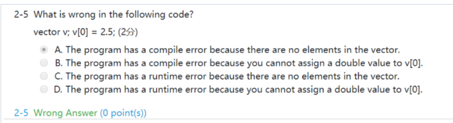
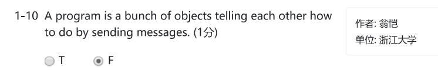
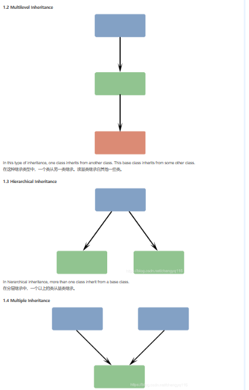
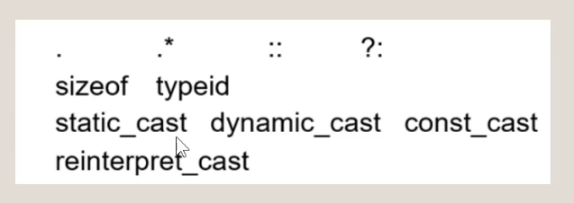

# oop 期末复习

## 错题

!!! note "oop期末补天"
	记录了oop期末复习的时候遇到的一系列问题，可能存在一些的错误请谨慎阅读。主干的C++知识请参照技术积累中的C++note.

* If you are not interested in the contents of an exception object, the catch block parameter may be omitted.（T）  
  如果您对异常对象的内容不感兴趣，可以省略catch block参数。
* Manipulators are objects to be inserted or extracted into/from streams （T)
* ​​
* const member has to be initialized and can not be modified
* 先去寻找对应的函数，再找可以类型转换的，再找模板
* ```cpp
  int main()
  {
      char ch[10]="hi";
      char *p=ch;
      int x=100;
      int *p1=&x;
      cout<<p1<<endl;   //输出p1所代表的地址
      cout<<p<<endl;    //输出hi
  }
  ```
* explicit关键词，当期作用于构造函数的时候，说明这个构造函数不允许被隐式调用  
  在C++的初始化状态下，C y=1 等同于 C y(1) 但是这种做法被视作是隐式调用，如果不存在第二个构造函数的话，第二条语句就会报错

  ```cpp
  class C{
  public:
      explicit C(int i){cout<<"A"<<endl;}
      C(double i){cout<<"B"<<endl;}
  };
  int main(){
  	C x(1);   输出A
      C y=1;    输出B
  }
  ```

* const 的重载

  先去找是否完全符合的，再找有无模板，再找类型转换，

  ```cpp
  template<class T>
  void f(T& t){cout<<"1"<<endl;}
  //template<>   这个表示一种特化，对于上述这个模板来说，特化了其中一种函数形式，特别定义了当T为const int的情况
  void f(const int& i){cout<<"2"<<endl;}
  int main(){
      const int i=0;
  	int k=0;
  	f(i);    //2
  	f(k);	 //1
  }
  ```
* static_cast 等
* destructor 写成virtual是为了让其指向子类的时候也能做正确地析构
* 对于operator = 应该在做完赋值之后，返回*this
* 虚函数表的指向选择，其会选择完全相同的子类虚函数，如果返回值不同会直接报错，如果参数表不同就无法达成多态  

  ```cpp
  class A{
  public:
      virtual void F(int i){cout<<"A"<<endl;}
  };
  class B:public A{
  public:
      virtual void F(double i){cout<<"B"<<endl;}
      virtual void F(int i){cout<<"C"<<endl; return 1;}//函数三
  };

  int main(){
      A *a=new B();
      a->F(1);      都会输出C，但当函数三被注释掉的时候，就都调用父类自己的函数
      (*a).F(1);
  }
  ```

* 对象数组  

  ```cpp
  A *p=new A[2];
  delete p;  只会调用A[0]的析构函数
  ```

* function prototype(函数原型，也就是函数声明式展示的那些东西）
* 在析构函数没有多态（非virtual）的情况下，会导致delete的时候只触发基类的析构函数  

  ```cpp
  class A
  {
  public:
      A() { cout << "A( )" << endl; }
      ~A() { cout << "~A()" << endl; }
  };
  class B : public A
  {
  public:
      B() { cout << "B( )" << endl; }
      ~B() { cout << "~B()" << endl; }
  };
  int main()
  {
      A *ap = new B[2];
      delete []ap;
  }
  输出A( )
  B( )
  A( )
  B( )
  ~A()
  ~A()
  ```

* 当继承时子类的virtual函数访问到子类才有的成员时，用父类的指针去指向子类，仍然可以触发子类的虚函数
* 只要有一个纯虚函数，就是abstract class,抽象类不能构造对象，会直接报错
* ​​
* 不论一个虚函数是否为纯虚函数，其虚函数表都会存在，虚函数表的大小为一个指针大小，但是在计算类的大小的时候要注意内存对齐规则  

  ```cpp
  class A{
  public:
      int x;
      virtual void func()=0;
  };

  一般来说设 int 是 4，指针大小 为 8
  sizeof(int) 的结果是16
  ```
* 4. Which of the following sentences is not correct				       (~ A ~)D

  a. Derived class object can be assigned to Base class object.

  b. Base class object can be assigned to Derived class object.

  c. Derived class object point can be assigned to Base class object point.

  d. Base class object point can be assigned to Derived class object point.
* delete p, 可能会发生重载，也可能不发生
* ```cpp
  int a=10;
      int b=20;
      int & k=a;
      k=30;
      k=b;
      k=40;
      cout<<a<<endl;  输出40，对类也是如此
  ```
* 上述代码,k=b看似是让k指向b，其实只是把b赋值给k，也就是a，k一直指向a
* 多重继承  

  ```cpp
  class A: public B,public C{}
  ```
* 接口类  是abstract class 全是纯虚函数，除了析构函数是空的虚函数，没有static和继承
* 虚继承，无需考虑菱形继承的路径问题？

  ```cpp
  class B:virtual public A{}
  ```

## 程序填空

```cpp
class String{
private:
    char *m_ptr;
public:
    String(char *a){
        m_ptr=new char[strlen(m_ptr)+1];
        strcpy(m_ptr,a);
    }
    ~String(){
        delete [] m_ptr;
    }
  
};
```

## 编程题

* 写一个循环队列模板，用数组去模拟，参见我的proj1

## 一些容易忘记的东西

* ```cpp
  #ifndef
  #define
  #endif
  ```

‍

* ```cpp
  class A{
  	A(){cout<<"A"<<endl;}
  	A(int i){cout<<"Aint"<<endl;}
  	A(const A& a){cout<<"ctor"<<endl;}
  	A& operator=(const A& a){A c; cout<<"="<<endl;  return c;)
  }
  int main(){
  	A a;
  	A b=a;   还是会调用拷贝构造
  	A c(a);
  	A d;
  	d=a;
  	A j=1;   等同于j(1)
  }
  ```

* 格式化输入输出
* new double[100] () 和 new double[100] {}会将动态分配的数组初始化为0，如果不加的会可能会有随机值
* 另外***函数模板和普通函数区别结论：*** 1.两者允许并存 2.函数模板不允许自动类型转化 3.普通函数能够进行自动类型转换.
* 虚函数的参数表必须完全相同，才能构成多态，返回值也需相同，如果参数表相同返回值不同会报错
* const的对象不能传给非const的指针和引用，但是非const的对象可以传给const的指针和引用
* A& operator=(const A& x)  注意返回值是A&
* 如何new一串有参构造函数的对象
* 空间分配问题  
  static 的东西 放在global data space
* arbitary 任意的  derived 派生的
* 拷贝的时候  

  ```cpp
  void func(char *a){
  	char* x=new char[strlen(a)+1];
  	strcpy(x,a);
  ```

* namespace 后面不用分号
* ```cpp
  namespace aaa{
  	void func(){}
  }
  int main(){
  	using namespace aaa;
  	using aaa::func();
  	using a = aaa;
  	a::func();
  }
  ```

* 如果没定义=和拷贝构造，会去调用内部成员的拷贝构造和=
* visibility and accessibility  
  overload and overriding  
  static and dynamic polymoriphism
* 不能用友元重载的= () [] ->，和不能用所有方式重载的
* cv-qualifier list  
  const volatile
* try语句里的东西什么时候析构，触发catch的时候析构  
  catch可以发生upcast，但是无法触发隐藏式类型转换  
  当发生throw的时候，需要向上抛直到找到catch时，发生一次catch之后，后续的catch都不被执行，该try块里面，可视作全展开的代码块，throw后的东西不执行，后面全部的顺序执行  
  如果throw的东西到最后也无法被接受，程序会在此终止，并给出报错信息

  try 内部语句顺序执行，当遇到throw时终止，开始寻找合适的catch  
  跳到可以catch的那个try里面，那个try里面throw后面的东西全部不执行，程序跳到catch内部，处理结束后这段try-catch语句被视为正常的语句执行结束，开始执行后面的语句
* try内部发生throw并找到对应的catch时，其内部对象全部被析构，先catch，再析构  
  但其throw的那部分对象生命周期会被带到catch内部，并在catch结束后被析构，不论catch的是... 引用，还是单纯的函数传值(会触发拷贝构造，最后会多析构一个)
* ```cpp
  void funcA(){
      throw 1;
      cout<<"hello funcA"<<endl;
  }
  void funcB(){
      try{
          funcA();
          cout<<"hello funcB"<<endl;
      }catch(int i){
          cout<<"funcB catch"<<endl;
      }
      cout<<"end of funcB"<<endl;
  }

  int main()
  {
      try{
          funcB();
          cout<<"hello"<<endl;
      }catch(int i){
          cout<<"main catch"<<endl;
      }
      cout<<"end of main"<<endl;
  }
  ```

* 参数是静态绑定的，函数内容是动态绑定的
* 父类指针本身只能访问自己有的东西，即便其指向子类对象也不能访问子类的成员  
  但当父类利用多态访问子类的函数时，就直接考虑子类本身调用这个函数，除了默认参数有一定trick以外  
  有同名变量的时候，父类指针只能访问自己变量，父类调用子类的函数时只能调用子类的变量
* 重载输入输出流  

  ```cpp
  //the extractor overloading
  ostream& operator<<(ostream& s,fraction_num& num){
      //usually it is used to print the num
      if(num.nume==0||num.deno==1){
          s<<num.nume;  
          return s;
      }
      s<<num.nume<<"/"<<num.deno;
      return s;
  }
  //the inserter overloading
  istream& operator>>(istream& s,fraction_num& num){
      s>>num.nume>>num.deno;
      num.simplication();
      return s;
  }

  并且将其作为友元函数
  ```
* 非静态的函数时可以访问静态的成员变量的，反之静态的函数不可访问非静态的成员变量
* ```cpp
  typedef int my_int;
  using my_int = int;
  ```

* 重载类型转换  

  ```cpp
  operator double(){
          return this->castdouble();
      };
  ```

* 多参数对象数组构造  

  ```cpp
  class A{
  private:
      int x;
  public:
    A(int x,int y):x(x){}
  };
  int main()
  {
     A a[2] = {{2,3},{4,5}};
  }
  ```

​​

* 文件输入输出流
* global variable 放在全局变量区  
  static local/global variable   也放在全局变量区，但不在文件之间共享  
  local variable   存储在栈区  
  allocated variable 动态分配的变量  放在堆区
* 引用的对象不能是表达式
* ```cpp
  char *p="hello"
  其实是
  const char* p = "hello"
  ```

* 构造函数的初始化顺序与初始化列表无关，一定是按照先父类，再按定义的顺序来  

  ```cpp
  class B:public A{
  private:
      A a2;
      A a1;
  public:
      B():a1(1),A(){}
  };

  先是父类的A 再是a2 再是a1无论初始化列表写成何种形式
  ```

* 函数重载会被默认参数影响
* ```cpp
  void func(int x=10){}
  void func(){}
  int main()
  {
      func();
  }会报错
  ```

* ```cpp
  class Integer{
  public:
  	const Integer& operator++();//prefix ++a
  	const Integer operator++(int);//postfix a++这里的int没有实际意义
  //只是为了让编译器去区分前置和后置的++
  //因为两个式子都是会改变传入对象的，所以没有最后的const
  private:
  	int i;
  }
  //实际实现
  const Integer& Integer::operator++(){
  	(*this)+=1;
  	return *this;
  }
  const Integer Integer::operator++(int){
  	Integer old(*this);
  	++(*this);
  	return old;
  }
  //实际使用
  ++x//x.operator++();
  x++//x.operator++(0);
  ```

* 如果没有虚函数，当基类指针指向子类时，调用函数，其中使用的是子类中的父类函数
* 函数重载

  1. 先找完全匹配普通函数
  2. 再找完全相同的模板函数
  3. 再找需要隐式转换的函数
* func(1.0) 这个1.0是看做float的
* 不能被重载的运算符
* simple成员函数是什么
* Properties of an object: properties, identity, attributes
* copy assignment function   operator=  
  copy construct function     A(const A& a)
* ```cpp
  class A{
  public:
     A(){cout<<"aa"<<endl;}
     A(int x){cout<<"hello"<<endl;}
     A& operator=(const A& a){cout<<"operator = "<<endl; return *this;}
     ~A(){
         cout<<"bb"<<endl;
     }
  };

  int main()
  {
      A a;
      a=A(1); 构造一个临时变量，然后operator= 然后析构临时变量
  }

  输出
  aa
  hello
  operator = 
  bb
  bb
  ```

* const的成员变量一定需要显式的初始化
* 派生类的友元函数，可以访问基类的非私有成员，但不能访问私有成员

  基类的友元函数，不能访问派生类的成员
* 1. 单级继承(single inheritance)：派生类只有一个基类；派生类必须实现所有的抽象方法  
      Single level inheritance supports runtime inheritance  
      分层继承(hierarchical inheritance)：一个以上的类从基类继承  
      多继承(multiple inheritance)：派生类可以有两个或多个基类  
      多级继承(multi-level inheritance)：子子孙孙无穷尽也(bushi)，但一个类只继承自一个类
  2. ||, +=, && 不能重载(+=好奇怪，但搜出来说不能)
* 在写构造函数的时候，记得check传入数据是不是NULL  
  在写operator=的时候，记得check  

  ```cpp

  if(this != &other){
    
  ```

* ```cpp
  p->func();
  (*p).func();
  没有任何区别
  ```

* 插入和析取  Insertion and extraction
* 命名空间可以只声明函数，让定义放在外面
* typedef int aaa;  
  using aaa = int;

* a.不能建立引用的引用。  
  b.不能建立引用数组，也不能建立数组的引用。  
  c.可以建立指针的引用，但不能创建指向引用的指针。
* ```cpp
  int *&p = a;  正确 p是a这个指针的引用
  int &*p = a;  错误 p不能是引用的指针

  const char * p;
  char const * p;  上述两种都是指针指向的对象不能被修改，但是指针指向谁可以变换
  char * const p;  指针不能被修改，指针指向的对象可以被修改
  ```

* 引用不构成overload
* ​​
* 除了const的方法，const的对象还能调用static的方法
