# 信息安全原理

!!! note "信息安全原理"
	关于信息安全的入门课程，主要偏理论部分，coding的部分较弱。期末考试准备的还算充分，但是最后精准考到了没详细准备的部分，就寄了(悲)。

## 信安原期末复习

* KERBEROS
* SPAM
* SSL/TLS

## Information Security

### Learn From History

* **太公兵法 中国第一个cipher**  
  用不同长度的符来表示不同的信息，把要发的文书分成三份，让三个人去发，三个人相互不知道，也无法了解完整的信息。
* **豪密 党的第一个密码**  
  由周恩来总理开发
* **Phaistos 圆盘形的密码**
* **Caesar cipher** 最早的Substition cipher（一共25种 可能得secret key）
* **Scytale Cipher** 棍棒做密码
* 什么是

Information Hiding / Steganography 隐写术

* 就是类似于把头发剃掉然后在上面写东西，等头发长出来
* 还有一些其他的例子例如

  * Egg Writing
  * Microdot
  * Bacon'c cipher

### 密码学的历史性时刻

总得来说，密码学（cryptography）是keep secret，上述的方法是人类历史上的精华，但是密码学的scientization要从Kerckhoff原则开始，除此以外还有一些比较历史性的时刻

​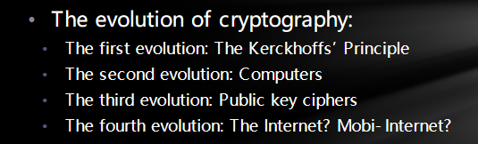​

**Kerckhoof's Principle**

> A cryptosysyem should be secure even if everything about the systen, except the key, is public knowledge.

该原则有很多影响

* 让密码学从Prehistoric到了classic时期，从Experience到了Science
* 并且让大规模生成cipher machine成为可能
* 加强了安全性：Anything invariable will be disclosed (所有不变的东西都是会被泄露的)
* 从经验变成了科学

**Electronic computer**

* 计算机诞生的原因是在二战中解密 ENIGMA
* computer accelerate both encryption and decryption
* Shannon's information Theory 香农信息理论的出现，使得密码的理论体系++
* 现代加密cipher（DES）的出现
* 从机器变成了电子

**Public Key Ciphers**

* 无需分享secret key的情况下，让两者之间共享大量加密信息，改变了密码学研究的方向
* 最广泛使用的公钥加密算法 RSA的出现

**Mobile Internet or AI**

* 扩大了密码学的内涵（connotation）和应用范围（Extension）

### Connotation of computer security

**Significance of computer security**

举了一堆不安全产生的例子

**distinctness of computer security**

都是相对于纸质文件而言

* 无法区分original原件和copy件的区别
* 修改可以不留下任何痕迹
* 容易彻底删除 easy to delete
* 数字签名只依赖于二进制信息

**Characteristics of computer security**

* Comprehensiveness 系统安全程度取决于其最薄弱的安全环节
* Procedural 程序性 安全模型是一个螺旋上升的模型，不会突变 constant back-and-forth rising
* Dynamic 动态性 安全模型是不断进步的 progressing
* Hierarchy 层次性 有multi-level 的技术来保障
* Relativity 相对性 都是相对的，没有绝对安全的系统

### Concepts of computer security

3 Elements of computer security

* Confidentiality  保密性 别人是否能看到我们的data
* Integrity            完整性 我们的数据能否被非法篡改（要区分用户和非法用户，银行数据篡改）
* Availability        可用性 我们的资源是否可用，安全是否影响了我正常使用某个功能

还有第四个性质 Authenticity / Non-repudiation 认证性或者说是不可否认性，我们不能否认发/收了信息

**Concepts of computer security**

* Asset 资产 我们要保护的东西
* Threat 威胁 要对抗的东西
* Vulnerability 漏洞 保护工作/安全系统中的弱点
* Risk 风险 = Asset + Threat + Vulnerability  
  R = A + T + V
* control

**type of security threat**

按照method分和按照有意无意分

​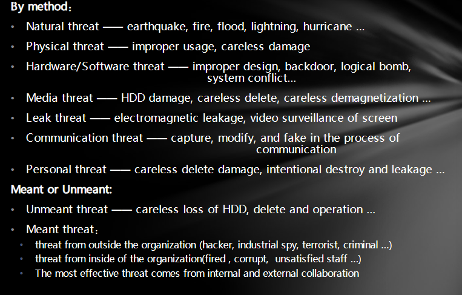​

**type of security attack**

例子见PPT，第二个是被动攻击（预防比检测更有效），其他是主动攻击（易于检测难于预防，可以从损坏中修复）

* Interruption  容易detect 让系统中的资产（asset）被破坏或者无法使用 -> availablility
* Interception  难detect，不能完全避免  以非法身份访问asset 不能被完全避免 -> Confidentiality
* Modification 可以被prevent（用数字水印）以非法方式修改 tamper asset -> Integrity
* Fabrication  未经授权把仿造对象插入系统，并且假装是授权方发送的 -> Authenticity
* ​​

**Replay attack**

验证身份的工作中，冒充者直接使用窃听到的上一次验证信息进行验证，如果能够验证成功，就说明重放攻击成功了

​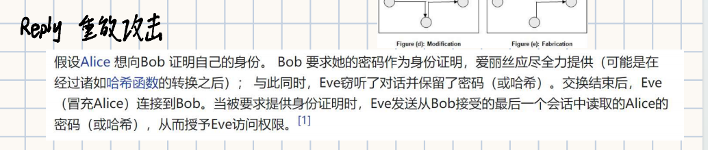​

**Against Security Threats 的目标**

* Prevent
* Detection
* Recovery  
  Basic：系统可以很快恢复或者功能  
  Advanced被攻击的情况也能正常运作

​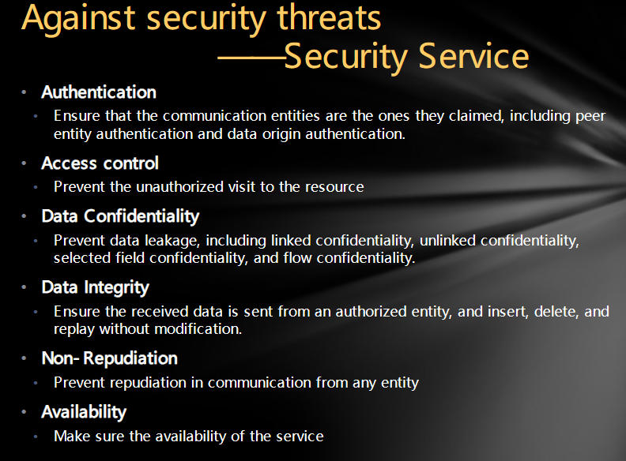​

## Concepts & History of cryptography

### Concept of cryptography

​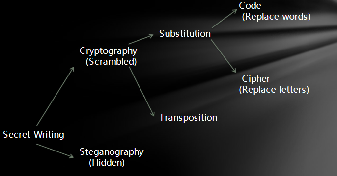​

基础的概念 Plaintext(P)/Cleartext(一般不用这个)，Ciphertext(C)，Encryption(E())，Decryption(D())，Key(K)

$C =E_{K}(P)$  $P = D_{K}(C)$  

常见的Encryption算法

* Substitution 置换，就是建立一个映射，像是hash Caesar密码属于这种
* Transpostion 位移，对原文移动几位

Cryptanalysis 密码分析上的一些概念

* **Amount of information available to the attacker**

  * Ciphertext-only 只展示密文
  * Known-plaintext 知道几组明文-密文对应
  * Chosen-plaintext 可以在一定范围内选择几组明文-密文对应
  * Adaptive chosen-plaintext 可以自适应选择明文让其加密
  * Related-key attack 让其再不同密钥条件下解密，且两个密钥关系已知
* **Result of Attack / Analysis**

  * total break 知道密钥
  * global deduction 虽然不知道密钥，但是构建出了一套等效的算法进行加密和解密
  * instance deduction 可以获取以前未知的明文密文对
  * information deduction 从以前未知的密文上获取信息
  * Distinguishing algorithm 可以区分密码和随机序列

### History of cryptography

密码加密的发展大概有着这三个阶段

​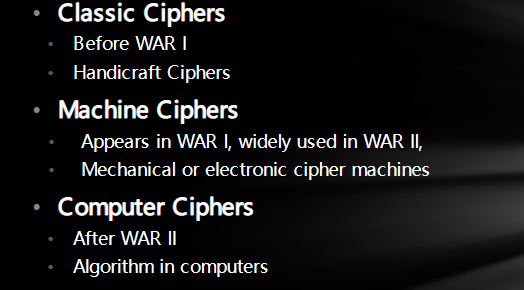​

**第一阶段**

一些古典的密码，举了一些例子，例如Caesar cipher

* Belt/Stick cipher 把条带绑在棍子上，特定的棍子粗细可以得出正确的结果
* Ancient Greek Cipher 列表将字母转换成数字 例如A就是"11"  
  ​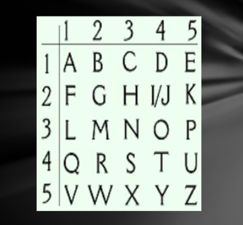​
* Caesar 密码
* Queen Mary's Cipher 23个字母符号和35个单词符号，其中有四个NULL ？

对于上述early ciphers 都可以采取Frequency Analysis来进行分析解决

但是也有些方法会使得Frequency Analysis变得困难

* Vigenere 将Caesar密码的key变成一个单词，例如这样  
  ​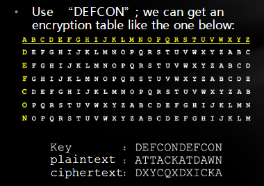  
  破解的时候需要根据重复序列的长度，来确定key的长度，再转换成常规的Caesar密码来
* Kryptos Sculpture
* Book Cipher 给一本书的所有单词编号，密文由编号数字组成，明文就是找到编号对应单词的首字母

**第二阶段**

Machine cipher，这一阶段的最高成就是德军里的ENIGMA机器

1个rotor（转子）定义了周期为26的字母替换密码(polyalphabetic substition cipher)，Basic Version有3个rotors，定义了$26^{3}$加上本身3个rotor有$A_{3}^{3}$的排列，总共有17576*6的替换密码，Extended版本可以更多rotor，可以对抗Frequency Analysis

Plug board定义了一个交换机，交换6对（也就是12个）字母，其余14个不交换

​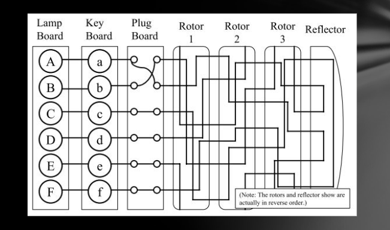​

Enigma Principle，对于plug board我们存在一些数据

​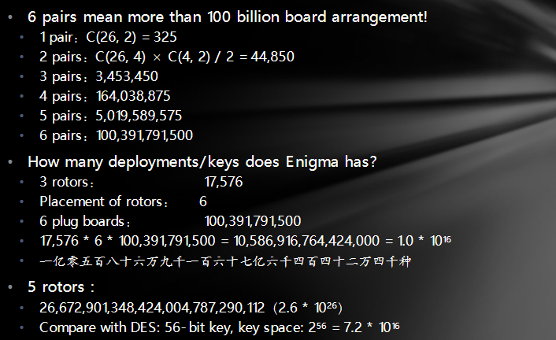​

用Kerckhoff原则来分析Enigma，其是符合Kerckhoff原则的

* Algorithm为整个机器的物理构成，三个rotor （是invariable or hard to change）
* Key为rotor的初始状态（initial position and sequence）和plug board configuration （是variable or easy to change）

**crack Engima**

* 阶段一 Espionage（侦查） 获取Engima机器本身，并且侦测到德军的Enigma使用方法，有Day key 和 Message key，Day key加密Message key; Message key加密Message
* 阶段二 Misuse 诱使德军错误使用Engima，将Message Key放在密文的开头重复加密并发送，使得他人获取了规律？pattern
* 阶段三 Mathematics(数学上的解决) 证明了检查表中的连接长度取决于rotor而不是plug，本质也是暴力检查

最后还有几页

## Symmetric secret key cryprography and Asymmetric

### Symmetric cryptography

对称密钥加密算法，也叫做Shared key ciphers, 和 Secure key ciphers，是密码学中的一种加密算法，complies with the Kerckhoff's principle

**block cipher**

将输入的bit切成n-bit的section，对每个section单独加密，每一块之间没有dependency，history等联系

​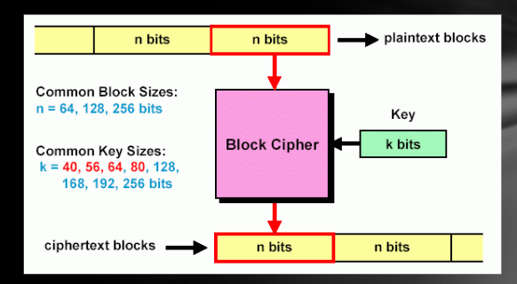​

In a good block cipher, each output bit is a function of all n input bits and all k key bits.

**feistel cipher structure**

几乎所有现代的对称加密算法都基于这个结构，还是在block ciphers

* Diffusion 使得密文的统计特性和明文间的关系尽可能复杂

  * iteratively 交换左右两半
* Confusion 使得密文的统计特性和密钥之间关系尽可能复杂

  * Larger Block size,常见为64 bit or128 bit
  * Larger key length，常见为128 bit
  * Number of rounds, 常见为16
  * Sub-key generation algorithms：更复杂的生成算法
  * Round Function：更复杂的 F 复杂度

​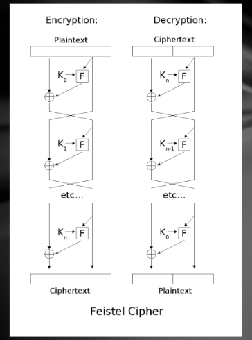​

**DES Algorithm——progress**

Data Encryption Standard，是用64-bit blocks，和56-bit的key，有一些特征

* Strong avalanche effect 雪崩效应，微小输入的改变，输出改变巨大
* 强大的anti-crack能力，只能被暴力
* 在如今56-bit key是不够保险的

**crack DES**

虽然对于DES还是只能枚举，但是56-bit key的计算量，在1999的超级计算机上只需要花费22小时

**Triple DES**

$$
C=E_{k3}[D_{k2}[E_{k1}[P]]]
$$

使用了三个不一样的key，加密解密再加密，key的size到达了56*3 = 168，PGP等工具就使用了这个算法，同时如果设置其中几个key相同，就可以完成与以前密码系统的向后兼容性（provide backward compatibility）

**一些其他的对称加密算法**

​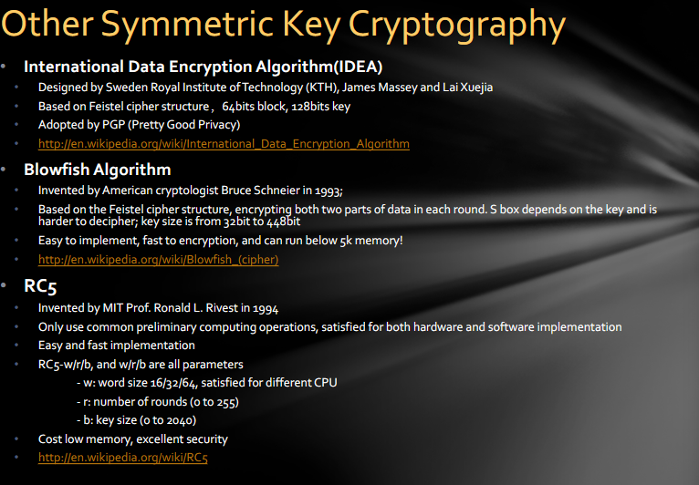​

**New international Encryption Standard——AES**

AES advanced encryption standard 2001 产生，替代了DES和3DES等，因为3DES虽然可用，但是操作起来比较慢，并且block size只有64 bit，而AES有以下特点

* block size 为 128 bit
* key size 为 128/192/256 bits
* immune to all known attacks
* 执行起来很快且代码紧凑
* 设计简单

**mode of operation**

之前的block cipher都是对于一个固定长度的bit块将进行加密，mode of operation 是告诉我们如何重复地把加密操作应用于任意长度的信息块上

有一系列的方法比如

* ECB ，见PPT 20
* ​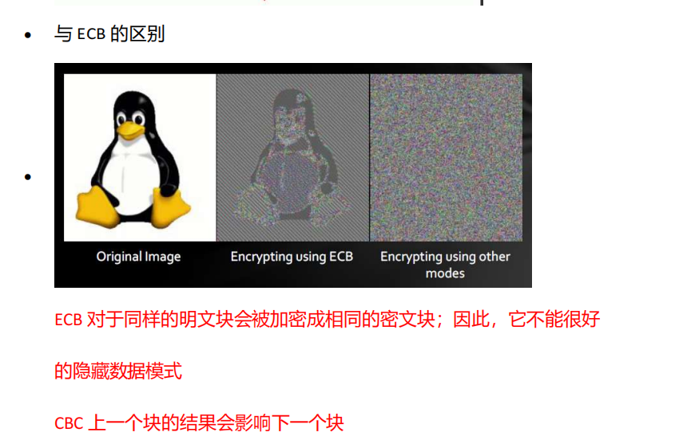​

除了block cipher以外，还有stream cipher

**The key distribution problem**

KDC key distribution center

### Public key cryptography

secret key cryptography 所存在的问题

* 密钥分发问题
* Alice无法证明自己到底有没有发信息，有plagiarizes的嫌疑 剽窃

公钥系统的一些元素

* public key KU
* private key KR

成就一个成功的公钥系统的关键是找到一个one-way function就是正向容易反向（inverse）难的问题

**Requirement of public key cryptography**

* key generation is easy
* Encryption is acceptable in time
* Decryption is acceptable in time
* 攻击者的信息无法获取到明文和私钥

**DH 算法 diffie-hellman algorithm**

我们有一个prime number p 和 一个 Integer g

* g is a primitive root of p
* 对于任意一个整数A（$0\leq A\leq p-1$），我们能唯一找到一个exponent a是的  
  ​$A = g^amod\ p$ 其中 $0\leq a \leq p-1$
* 我们称a是A的discrete logarithm 离散对数 base g and mod p
* p 和 g是固定的，a推出A是容易的，但是A推出a是不容易的
* 并且我们有  
  $g^{ab} mod\ p = (g^amod \ p)^b mod \ p = (g^bmod \ p)^a mod \ p$

通过以上这些理论基础，我们就可以建立出一个公钥系统，Principle of Diffie-Hellman

​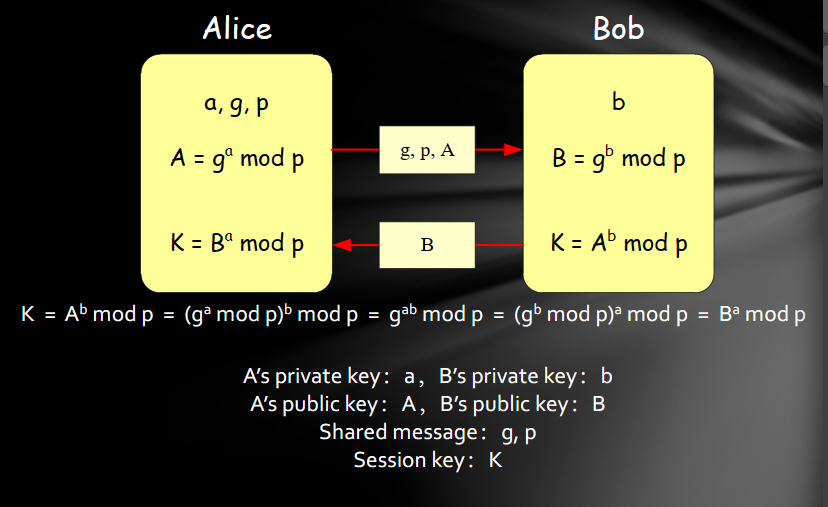​

**Example of Diffie-Hellman**

DH算法的中间人攻击 man-in-the-middle attack, 实际上Alice和Bob都是与Carol交换了Session key

​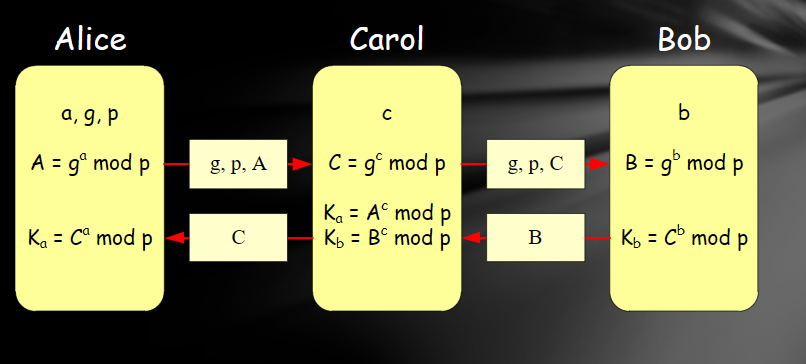​

**RSA algorithm**

其单向函数one way function是 大质数乘法，反之就是大合数的分解，我们定义$\phi(n)$是小于n并且与n互质的正整数的个数(其被称为Euler's totient function)

* 如果n为质数，显然 $\phi(n) = n-1$
* 如果n为合数，我们存在一个数学定理来计算 $\phi(n)$ 对n做质因数分解，记录其中各不相同的质数，记为 $p_i$ 我们有
* $$
  \phi(n) = n(1 - \frac{1}{p_1})(1-\frac{1}{p_2})...(1-\frac{1}{p_k})
  $$
* 对于都为指数的p，q，我们有$\phi(pq) = \phi(p)\phi(q)$

我们有Euler's theorem

* 如果n和a都是正质数，有$a^{\phi(n)} \equiv 1(mod \ n)$  证明？

有了以上理论基础，我们开始思考RSA的过程

* 我们选择两个指数p，q（很大的指数，至少是100位），并且设 $n=p*q$
* 找到两个数e，d，满足

  * e和$(p-1)(q-1)$互质，并且$1<e,d<(p-1)(q-1)$
  * $e*d\equiv 1(mod(p-1)(q-1))$
* 其中e，n是公钥，d是私钥
* 加密：我们有明文m，找到Bob的公钥，加密为$c = m^e mod\ n$，把c发送给Bob
* 解密：我们有密文c，$m = c^d mod\ n$

​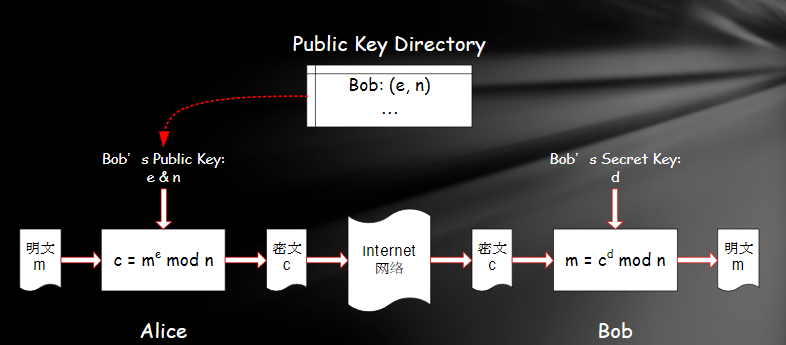​

根据上面的理论部分，我们可以证明RSA的正确性和安全性

见PPT 48左右内容

## Security service

### digital signature

密码学的加密解密系统无法解决一个问题，比如Bob捏造一个信息，说是Alice发的；Alice发了一个信息，但事后其否认了这一点。

我们日常生活中会使用Signature，也就是签名来解决这个问题

对于手写的Signature，有以下feature

​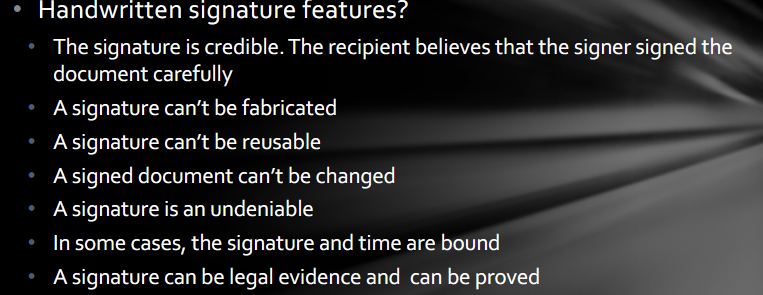​

对于digital signature, 有以下要求

* 可以与相应的文件绑定 bound with signed document，防止签署的文件被修改
* 收件人可以验证，任何人不能伪造
* 发件人不可否认这个签名 需要使用发件人unique的信息
* 第三方可以检查和确认这个签名
* 可以验证前面的作者，日期，时间，内容等

使用公钥加密系统，可以支持digital signature

* 发送者用其私钥对文件进行签名
* 接受者用发送者的公钥进行认证
* 发送者用接受者的公钥进行加密
* 接受者用自己的私钥进行解密
* ​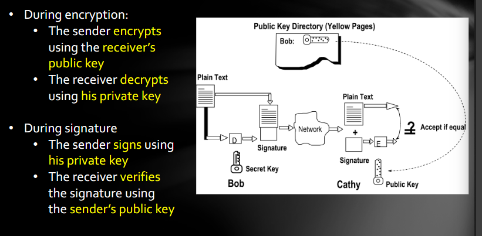​

以RSA系统为例 * 看11页

### one-way hash algorithm

当我们需要签名的文本很长的时候，我们往往会选择对其hash-value进行签名，也就是我们需要一个单项hash函数

单向hash函数的一个特点就是其输出的长度是固定的，比如MD5是128位；SHA-1是160位

一个好的单向hash函数有以下特点

* 正向容易计算
* 反向难计算，固定给一个hash值h，我们无法找到一个m，使得$H(m) = h$
* 难以发生冲突，也就是说难以找到两个m，使他们拥有相同的hash_value

一些常见的单向hash函数

​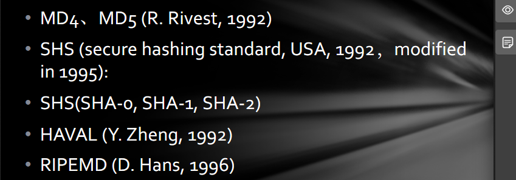​

以MD5为例

MD5的处理分成两部分，padding和hashing*

* padding将整个字符串切割成一系列512-bit的小块
* 每个小块转换成16个32-bit的整数 见P16

针对单向Hash函数的攻击一般有两种

* Preimage attack 对于特定的hash value，试图找到一个Message

  * Preimage resistance 给定hash value 找不到message
  * Second-preimage resistance 给定一个message，找不到另一个message与其有相同的hash value
* Collsion attack 试图找到两个不同的输入，拥有相同的hash value

对于长明文的签名流程 P21

### MAC

MAC，也即Message Authentication Code，也被成为 keyed hash function，是用于检测消息是否被篡改，也即消息的完整性的。

我们介绍其中几个

**HMAC**

是Hash based message authentication code，使用不同的单向hash函数来构建HMAC，相比于单向hash函数，HMAC更难以发生collision，例如HMAC-MD5, HMAC-SHA1，虽然其本身对应的单向hash函数已经是不安全的了，但是对应的HMAC仍然是有效的

​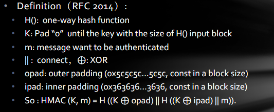​

**CBC-MAC**

cipher block chaining message authentication code.  wjgg在这里写的很清楚

​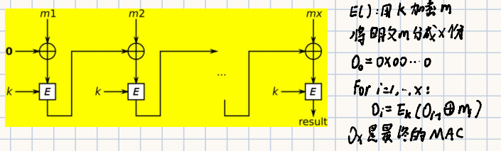​

**difference of MAC and digital signature**

MAC

* 接受者和发送者需要共享一个密钥
* 只能被特殊的接受者认证
* 不提供，不可否认性
* 但是MAC更快，并且不可否认性不是所有时候都需要的

Digital Signature

* 可以被所有的接受者认证，只需要发送者的公钥
* 提供不可否认性

### PGP

PGP 是 Pretty good privacy，是一个广泛使用的邮件和文件存储的安全应用，有以下服务，数字签名，完整性检查，信息加密，数据压缩，等等 见PPT29

### Authentication

* 你是谁
* 你如何向他人或电脑系统证明你是你所宣称的存在
* 需要控制访问的系统都需要处理这个问题

有很多东西可以帮助我们做认证

​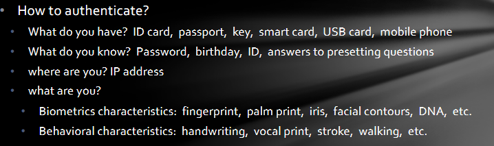​

**password-based authentication**

系统存储认证用户的密码，用其来检查

* 在密码传输过程中不太安全
* 密码的存储不太安全
* 用户可能会偏向于容易记忆的密码，容易被破解

现代的系统也对密码认证做了一系列的保护，比如限制尝试密码的次数，严格化修改密码的流程等等

​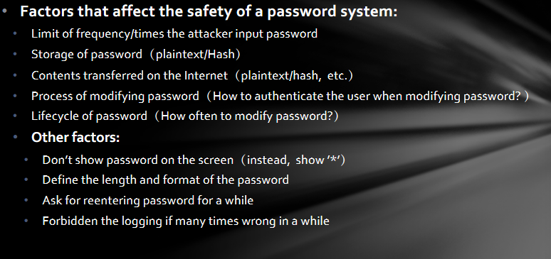​

早期密码存储的一些实现

* 只存储密码的hash value

早期的Unix密码

**Traditional dictionary attack**

* unix 的password file 是world readable
* 很多密码来自于很小的dictionary，对字典中的词进行hash，并比较hash值，如果匹配成功了就破解了该密码

  * 攻击者甚至可以实现计算完所有的dictionary的hash值，进行匹配

对抗攻击的机制

* salting 计算hash value时，会将salt加入密码后再做hash，salt是初次设定密码时产生的随机数，使得攻击者在针对一个password的时候，需要对每一个dictionary word做一次计算，使得字典攻击变得困难，但是仍然可能
* Shadow password, 将password的hash value存在一个仅有系统管理员root可读的文件中，并且添加密码的expiration dates 到期日期

密码使用的一些常见错误以及需要注意的点 PPT 13

PPT13

​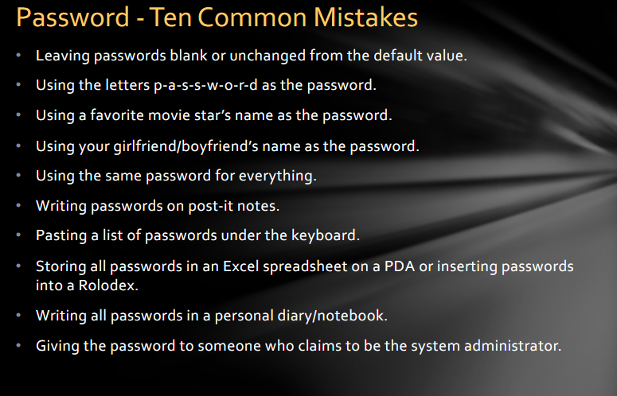​

​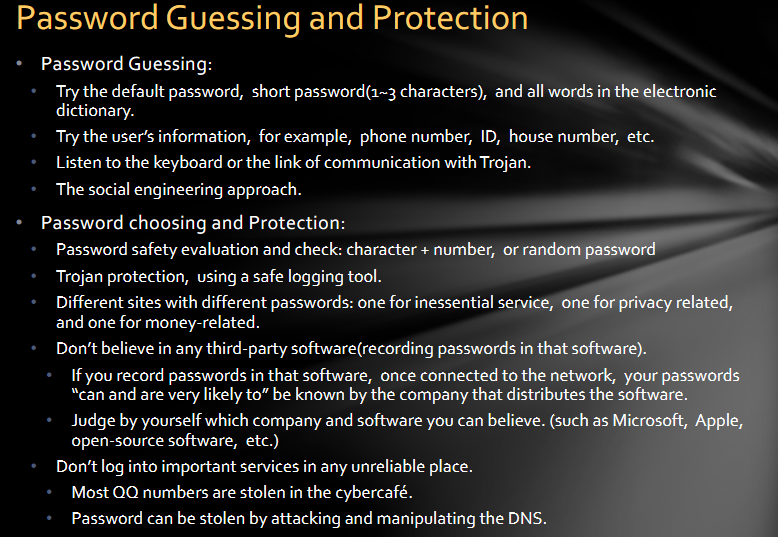​

**biometric/behaviometric authentication**

包括指纹，笔迹等

* 优点在于不太容易被偷窃，损失和遗忘
* 缺点在于 检测装备比较昂贵，比较算法的精确性存在问题，并且隐私问题比较严重

**生物认证的错误率**

* false accept rate
* false reject rate
* 如果上述两个概率相同，称为 equal error rate
* Increasing the threshold value of accept will increase the false accept rate and reduce the false reject rate.

**对于一个生物认证系统需要考虑的内容**

​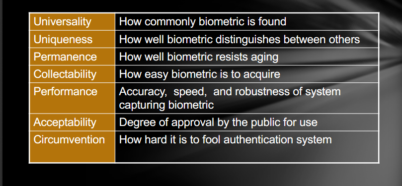​

讨论问题 密码会消失吗

**NetWork Authentication**

互联网两端的用户如何做认证，有一些方法和

私钥系统和公钥系统都可以解决这个问题，一般都是使用公钥系统，可以对抗重放攻击

下图中v5使用的是私钥系统，v6使用的事公钥系统

​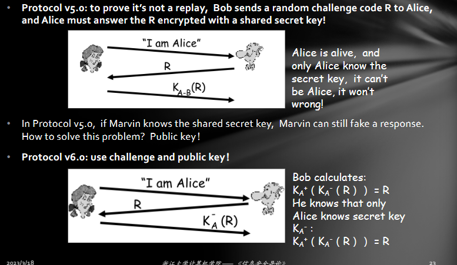​

**Kerberos**

在分布式的情况下，服务器限制授权用户的访问，区分每类用户需要的服务

有一系列的目标

* Safety
* Reliablity
* Transparency
* Scalability

具体的操作和概念细节 见PPT26

基于ticket进行认证

缺陷

* 依赖系统时间的同步
* guessing attack 如果密码很弱容易被猜到的话是有问题的
* key storage 是个问题

### Authorization

authorization基本等同于访问控制，有一些概念

* Subject 一个能够访问东西的实体，包括user和应用进程等等
* Object 被访问的东西 file，program，data等
* Privilege Subject对于Object的某种权限，包括read, write, delete等等

Secure Access Control

* 三个主要功能 Authorization, Revoke, Checker
* 两个阶段 Make Policy, Execute Policy

安全访问控制有三种Model

* DAC Discretionary Access Control 自主访问控制
* MAC Mandatory Access Control 强制访问控制
* RBAC Role-Based Access Control

**DAC**

根据访问主体（Subject）的身份和权限来做出决定，存在一些特权的主体可以把权限授予他人

缺点是访问权限控制不严格

**Access control matrix**

有两部分组成，分别是横纵的关系

* Access control list: 每一个Object都关联着a list of Subject permitted to access it.
* Capability list: 对于每个Subject，都关联着a list of Object it can access

​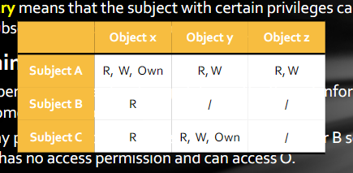​

例子

Unix OS 使用 accessing control list 来管理文件

* 将user区分成三类：文件的Owner（u），和file owner分在同一组的(g)，其他用户(o)
* 将permission分为三种: Read r, Write w, Execute x
* 用9个bit来indicate文件的access control list, 1-3是owner的权限， 4-6是group member的权限，7-9 是other的权限

**MAC**

给Subject和Object以不同的安全等级，通过安全等级来判断是否有权限

Bell-LaPadula Model 用来ensure confidentiality 确保机密性

* No Read Up 不能阅读高level的file
* No Write Down 不能写低level的file

Biba Model 用来Ensure integrity 确保完整性

* No Read Down
* No Write Up 与上述相反

Secure Label 可以防止 Trojan Horse 见PPT 39 40

**Covert Channel 隐蔽通道**

其使用系统资源但是不通知Subject，这是一种computer security attack，在进程之间传输信息

利用系统资源进行通信的通道，通过一些系统资源的变化来获取高密文档在做什么

这种攻击无法被 eliminated, 可以有一些应对措施，比如限制共享资源（让他们仅在同一个密级共享，那么就无法被其他process获取），和限制带宽（bandwidth）例如加入噪音干扰等

Orange Book 是 美国的MAC标准（TCSEC），中国也有GB17859-1999

**RBAC**

DAC的安全太弱，MAC的安全太强，并且manage的workload都很大

RBAC是modern business 对于信息安全的要求的结果，需要减轻安全管理员的工作负担

起源于一部分操作系统，RBAC给每个user以a set of roles,

一些基础的概念

​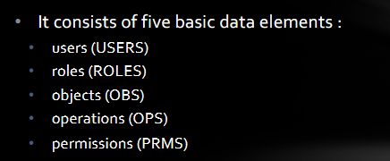​

* Role 每个role表示一组user被关联到一组权限，属于这个role的user可以执行相关的操作

  * group是一组users
  * role 一组user + 一组 permission 是个多对多的模型
* Relationship 多对多，user被对应到roles，roles被对应到确定的permission
* Session User到active role的映射

Hierarchical RBAC Model

角色结构化继承是一种很自然的方式去反映组织的认证和责任

例如r1继承了r2，r2的权限也变成了r1的权限，继承关系满足离散中的partial order, 有这三种性质Reflexive, Transitivity, Antisymmetry

Constraint RBAC Model

* SSD 用户，角色分配的约束关系，一个用户不能同时分配两个SSD角色
* DSD，不同时间不同权限

RBAC的优势

​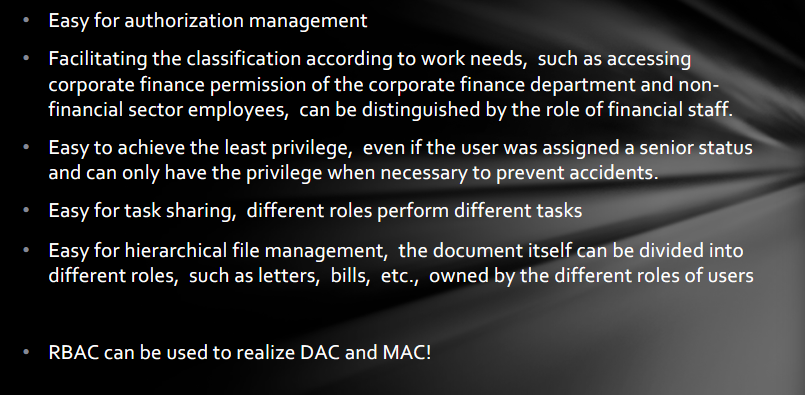​

**The Principle of Security Access Control**

* Authorization management——决定谁有权去修改 Allowed Access

  * MAC Allow Access由Subject和Object的Security level决定

    * System security administrator 确认Subject的Security level
    * Object的Security Level由创建它的user/process确定
  * DAC 有多种管理方法

    * Centrialized management
    * Hierarchical management
    * Ownership management
    * Collaborative management
    * Distributed management
  * RBAC
* Minimize Rights 权限最小化，由root用户分配给三类特权用户

  * System administrator
  * Security administrator
  * Audit administrator
* P54
* ​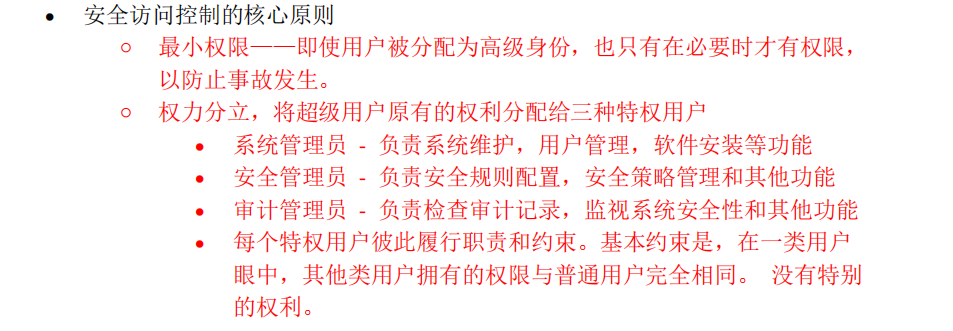​

## Internet and Security

#### Thompson's Compiler

1. 修改了编译器，使得其compile login程序的时候，可以使用一个固定的密码登录所有账号
2. 再次修改compiler，使得编译器在编译的时候自动加一段代码，使得这段编译器在编译正常编译器，变成一个恶意编译执行文件
3. recompile the compiler
4. delete the source containing

The point：源代码级别(source-level)的认证和检查是无法彻底保护安全性的

having source code helps but does not ensure you're safe

#### Trojan concealing —— rootkit

rootkit是一个二进制可执行文件，使得恶意用户可以进行管理员级别的控制，rootkit就是不让管理员检测到木马等存在

有一系列的例子

**detect and remove**

* 手动remove rootkit对于正常用户来说是有困难的，所以有些tools被提供用来保护

  * 但是一些安全软件，无法cope with the rootkit
  * 最好能够access the raw file system to find and kill the Trojan

#### Computer virus

木马一般是作为独立进程存在，而virus一般依附于某个exe文件存在

* the insertion phase 把自己插入file
* the execution phase 表现出某种行为

举了一些例子，早期的病毒以及病毒的一系列种类

* Boot Sector Infectors 感染操作系统启动的引导区，磁盘扇区，当系统第一次看到这个disk的时候执行
* Executable Infectors，其会在一个可执行文件里插入一个virus code  
  ​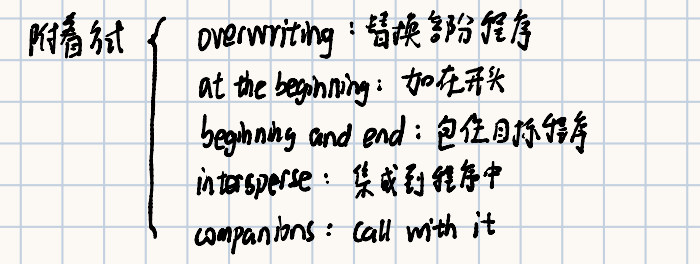​
* Multipartitle Viruses 上述两种的集合
* TSR viruses 应用程序结束之后仍然在内存中保持活跃状态 terminate and stay resident
* Stealth viruses 隐藏文件感染的病毒
* Encrypted Viruses 对病毒进行加密，防止被安全软件识别出来，现在通过签名检测病毒是困难的  
  在有限时间内检测任意病毒的加密，是不可能的
* Polymorphic Viruses，每次复制都会改变形式的病毒

病毒是如何感染的，以及如何加密

#### Worm

​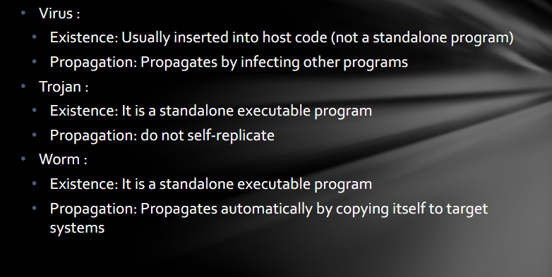​

通过自动拷贝自身到目标系统来传播

先是对virus, trojan 和 worm做了一个比较，从Existance和Propagation

Robert Morris release a worm 第一个蠕虫

**Code Red 1**

使用Web的漏洞

**Nimda**

是用Email

还存在一些其他的恶意代码，比如用于耗尽系统资源的一些程序

#### Theory of virus detection

**theory of virus detection**

没有算法完美检测所有virus和malicious code

**virus analysis**

* 人力分析病毒
* 自动分析病毒 immune system  
  ​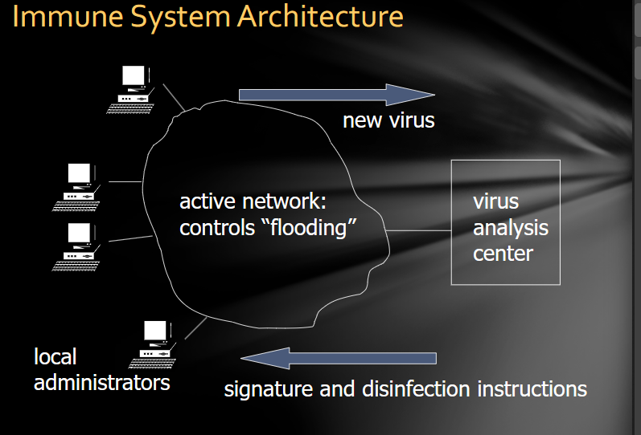​

SandBox / virtual machine

有些语言运行在一些被保护的area，例如Java运行在JVM

js这种语言是运行在SandBox，浏览器的沙盒，无法访问浏览器限制以外的内容

限制一个程序的可访问的对象

botnets 僵尸网络 一组机器通过网络完成一件事情，其在网络上的检测是不太可能得。

DDOS distributed denial of service

**defenses Means**

* distinguish between data, instruction

  * 病毒必须要写入程序，只允许写入data，不允许执行data，执行需要审查
* limit object accessible to processes

  * 控制用户之间的信息流，比如在浏览器，虚拟机，SandBox中运行
  * 仅给一个进程以最低权限，使其只能执行自己的功能，不能做多余的事情
* Inhibit sharing

  * 禁止共享，使用多层的安全机制
* detect altering of files

  * 计算一个文件的MDC，每次保存的时候都check一遍MDC的值是否相同
* detect actions beyond specification

  * 检测超出规范的操作，多版本编程验证正确性
* Analyze statistical characteristics

  * 分析统计特征

‍

**SPAM**

垃圾邮件太多

#### Botnets DDOS and SPAM

**botnets**

network of autonomous programs capable of acting on instructions

通常是大型的远程控制的僵尸系统，用IRC等方式控制和更新

僵尸网络是很多攻击的平台

* DDOS
* SPAM
* 新漏洞和蠕虫的启动板

​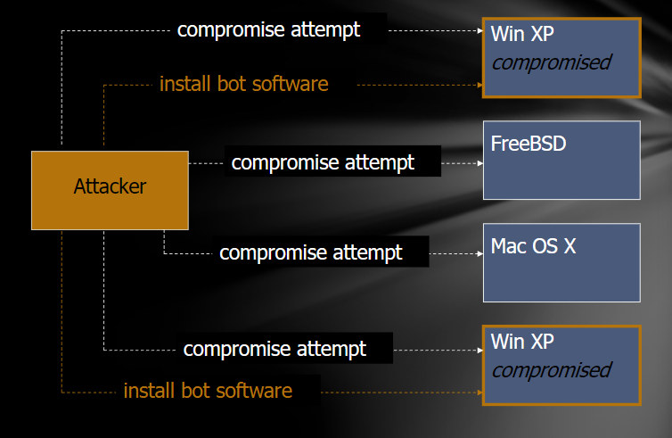​

* 检查用户系统的漏洞（buffer overflows, email等），并且进入执行shellcode
* shellcode下载actual bot
* bot 禁用防火墙和杀毒软件
* bot 定位IRC server，连接并且加入channel

  * 用DNS找到server
  * 认证码在bot的二进制代码中
* bot master 发出Authenticated command

**僵尸网络的传播**

* 每个bot自己就可以扫描IP空间进行传播
* 主动僵尸网络管理

**DOS**

**Email Spoofing**

SMTP没有内置的认证，

## IP security

### TCP/IP Protocol Stack

* 使用TCP/IP协议栈来route和connect
* 使用BGP来router discovery
* 使用DNS来找到通过域名找到IP address

​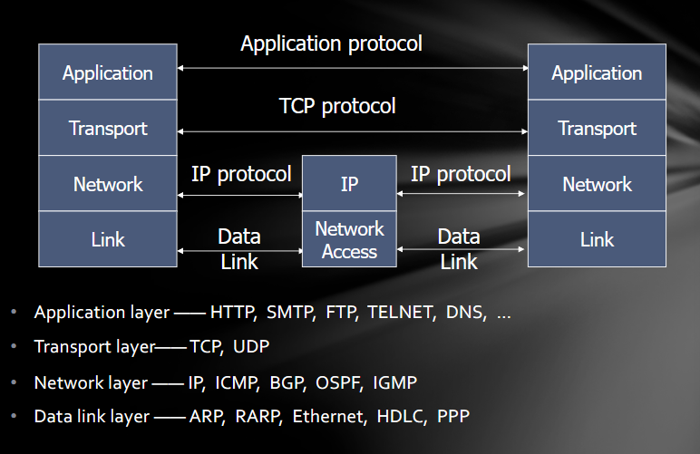​

​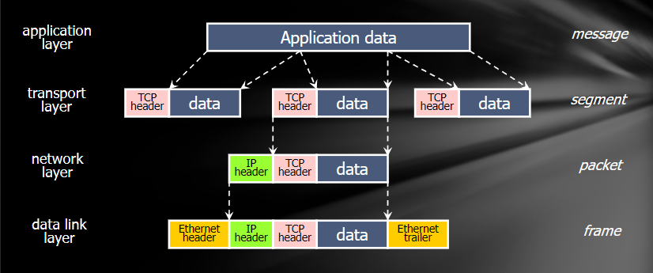​

**IP Internet Protocol**

TCP/IP中的网络层协议，用numeric address 数字化的地址来routing

**ICMP Control Message Protocol**

对于 network operation 提供feedback

**IP &amp; TCP/UDP**

IP负责传送

TCP是传输层，对于reliability and flow control 负责

* sliding windows
* sequncing numbers and acknowledgements
* synchronization

IP包中有一个Protocol field来明确这段是TCP还是UDP

**User Datagram Protocol**

IP 提供 routing

UDP 按照端口分隔流量

Minimal guarantees

TCP中包含

* Sender：break data into segments

  * sequence number 附在每个包上
* Receiver: 将Segments按照正确的order重新装配 reassemble

  * 丢失数据重新发送
  * 确认收到 acknowledge receipt

​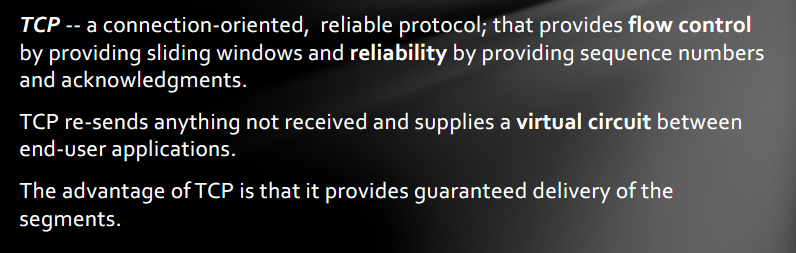​

**三次握手**

两端需要通过各自的initial TCP sequence number去建立联系

Sequence number 是用来track packets' order保证没有packets被遗漏

​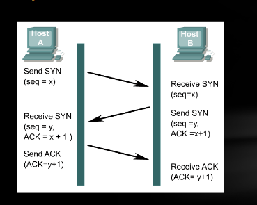​

**port number**

**DNS**

将domain name map到numberic IP addresses

### Security issues of TCP / IP

**sniffing**

许多传输的数据不是被加密的，比如使用HTTP协议的，通过一些抓包工具，比如WireShark，来截取信息

**promiscuous mode** network interface card can read all data混杂模式网络接口可以获取所有信息

**ARP spoofing**

ARP是将IP转到MAC的过程，OS通过ARP cache来实现ARP，不同的机器有不同的实现方式，有一些OS只接受第一个response package

通过伪造一个ICMP数据包，让某个机器发起ARP请求，再发送假ARP的相应，使得ARP缓存被破坏

​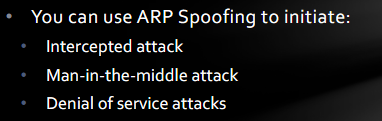​

**IP spoofing**

将一台机器的IP地址，替换成其他机器的IP地址，隐藏发送方或者冒充另一个计算机身份

**TCP SYN Flooding**

攻击者在伪造IP地址的同时，发送大量请求，被攻击的主机会需要分配资源，一旦资源被耗尽，客户端就无法正常连接了

这是最经典的DOS攻击 发起者不消耗资源，接收方必须为每个请求创造线程，非对称的攻击

阻止的方法

* 当资源用完之后，随机删除一些线程，random delete, 容易实现
* SYN cookies 服务器至少收到2条信息才存储状态

  * 服务器把socket information 存在cookie中，再把cookie发回去
  * 客户端必须把这个cookie再发回去一次，服务器重新计算之后再发送给客户端
  * ​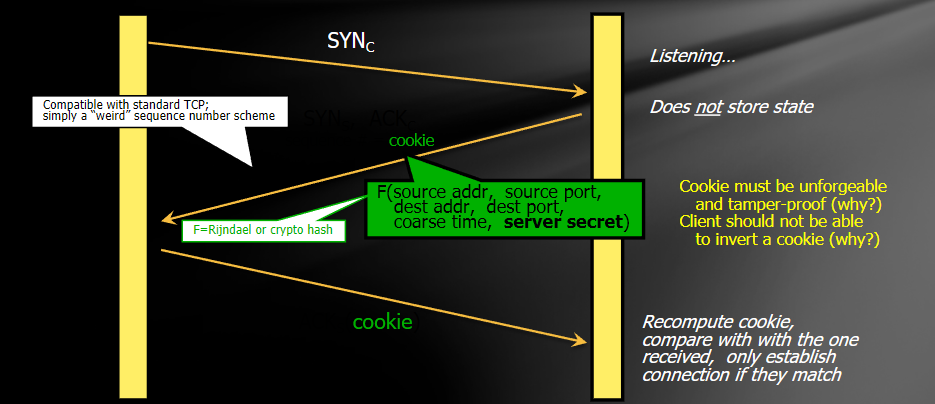​

**TCP SYN Prediction Attack**

TCP的每个包里有序列号SYN，接收方将排序与根据SYN重组数据包，如果TCP协议中的序列号被攻击者预测，那么其就能伪造包发送给接收方，以达成自己的目的

该种攻击是很多其他攻击的来源

* TCP spoofing
* TCP connection hijacking
* TCP reset

主要的对抗预测攻击的方法是，随机生成SYN让prediction变得不可能

$$
ISN = M+F(本地IP，端口，远程IP，端口，保密密钥)
$$

其中M是为微秒定时器，F为伪随机函数，使用单向hash函数实现

**TCP congestion control**

当发生丢包的时候，说明network is congested，此时TCP协议要求sender

* 通信速度持续减半，直到没有丢包或者速度降为0
* 如果不再丢包了，传输速度会缓慢增加

但是如果在有恶意用户不遵守协议，在他人和自己同时丢包的时候反而增速，那么就会限制他人的速度。

解决方法

* Add ack nonces，在ack的时候返回一个nonce，来证明其不是一个欺骗

**DNS spoofing**

修改DNS服务器或者本地DNS服务，一般就是修改DNS缓存数据库，将页面重定向到错误的IP，也即将信息发送到另一台机器，一般是攻击者的机器

解决方法：DNSSEC

* 其产生攻击的原因是DNS的响应和请求是没有认证（authenticated）的，但是DNSSEC使得每一次响应都需要认证
* 其本身不提供加密服务，也不会用在对抗DOS攻击上

### IPSEC

IPSec是支持所有在IP层的加密encryption和认证服务authentication，其有三个核心组件

* Authentication Header AH 验证头
* Encapsulating Security Payloads ESP 载荷安全性封装
* Security Association SA 安全关联

**AH**

提供数据完整性和认证服务，可以有选择地提供anti-replay 反重放攻击 *

具体的细节内容见PPT 37

**ESP**

提供安全，保密和认证（optional）的服务

**SA**

用于集成安全服务 integrate security services，其中定义了一系列的算法和常数（包括密钥），对一个发送接受流进行加密和认证，如果需要双向的安全通信，那么需要两个SA

有三个参数在SA中唯一确定

* SPI security parameter index
* IP destination address
* Securiry protocol identifier  安全协议标志，确定AH or ESP

总之，SA是一组逻辑安全参数，能与另一个实体共享信息

**Mode of operation**

* transport mode

  * 该模式下仅保护IP packet content部分，不保护IP头，由于IP头没有被修改，路由过程不会被影响，传输层和应用层数据都受到保护，常用于 peer-to-peer 通信
* tunnel mode

  * 该模式会加密和认证整个IP packet，原始的IP packet将会被隐藏到新的IP packet，并且将附加新的IP头，常用于受保护的VPN，host-to-network, peer-to-peer 通信中

**IPsec的优势**

* 其可以用于增强和实现防火墙/路由器

  * 所有通过边界的数据包的安全性都增强了 security-enhanced
  * 收防火墙保护的主机无需处理安全问题
* 对于最终用户是透明的

  * 构建IPsec网络上应用程序无需做多余的事情
  * 自动保证保密性和完整性 confidentiality and integrity

### SSL/TLS

TLS 就是传输层安全，它的前身是SSL，旨在为了TCP建立可靠的end-to-end安全服务，包括confidentiality, integrity and authentication

* SSL connection

  * 连接是提供适当类型服务的传输
  * 是一个point-to-point的关系，连接是临时的，每个连接都和一个session相关联
* SSL session

  * SSL会话是客户端和服务器之间的关联，会话由握手协议创建，会定义一组连接共享的密码安全参数
  * 避免提供密码安全参数的昂贵谈判价格

SSL/TLS protocol stack

其本身是在传输层和应用层之间的，自身被分为两层

* handshake layer

  * 相互验证，协商加密算法，定义了三个子协议
  * 使得服务器和客户端相互验证
  * 协商加密算法，MAC算法，和加密密钥
  * 在应用程序数据传输之前执行握手协议
  * ​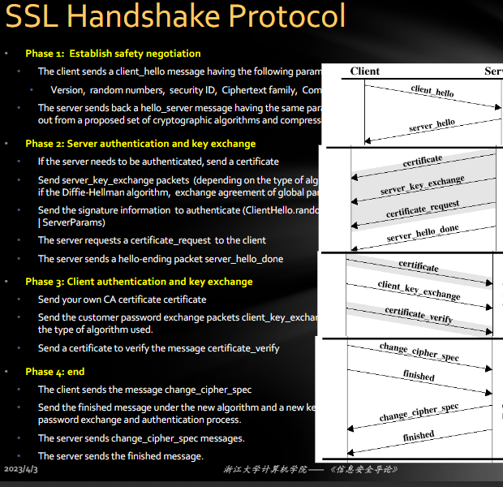​
* record layer

  * 接受并加密应用层的信息，并且发送给传输层
  * ​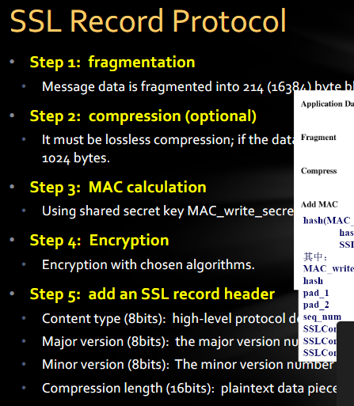​

## Malicious code

所有违反站点安全策略的指令集合

### Trojans, Viruses and worms

**Trojan horse**

有着公开目标 overt purpose, 和非公开目标 covert purpose 的程序

replicating trojan horse是指那些trojan horse can make copies of itself, 木马的复制是难以检测的

例如 Thompson's compiler，就通过修改编译器的拉个

trojan horst concealing——rootkit

rootkit 是一组木马程序的二进制可执行代码 主要特点是 stealth

如何检测和移除 rootkit

* 基于行为，签名，完整性等进行检测
* 使用一些安全软件的服务，使用一个干净的文件系统来杀木马，重装系统

**virus**

一个程序，将自身插入其他的文件中，使其有其他不同的actions

* the insertion phase 这个阶段是必须有的
* the execution phase 有可能不进行任何操作，这个阶段不一定有

有各种不同的virus，这里介绍了其中几种

### defense of Malicious code

虽然不存在完美的算法，但是还是存在一系列means去处理

​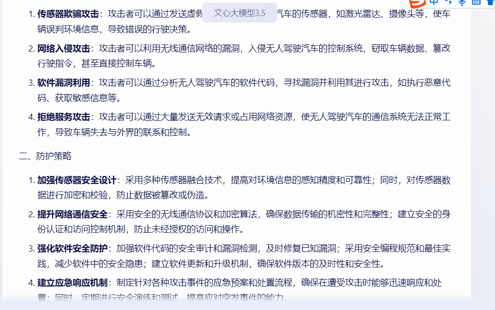​

​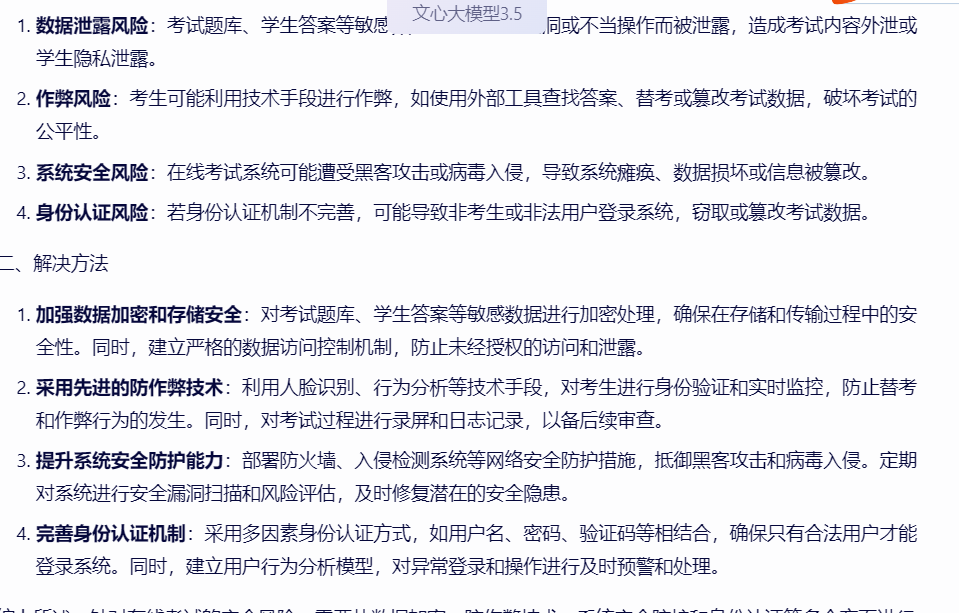​

### 僵尸网络 DDOS SPAM

## 期末复习

* 计算机安全

  * 密钥是经常变的
  * elements 安全  分析系统的安全性，根据这几个element来分析
  * concept  讨论安全的方面
  * 不同的攻击方式，被分为passive和active
* 密码

  * 密码学的概念
  * 公钥密码学
  * 私钥和公钥的区别
  * 数字签名
* 认证和授权访问控制

  * 概念
* 网络

  * 常见的攻击
  * IPSEC
  * TLS/SSL connection和session 连接和对话
  * Malicious Code

可以回答英文单词

应用：分析某个东西，会有哪些安全问题

### 对称密钥的问题

* 其问题在于人们必须要安全地共享一对密钥，而这个共享工作本身也是需要加密的
* 并且存在对称密钥的话，接收方也可以伪造数据，发送方无法证明自己没有发送给接收方，因为接收方自己也可以通过该密钥创造信息

‍

‍
