# 数据库系统期末复习

!!! note "数据库学习笔记"
	大二下平时花费时间最长的课，4个练习Project加上图书管理系统和MiniSQL，但这其实还好，因为实验其实设计的质量还可以，MiniSQL也很有挑战性。99%恶心点还是在期末考试，今年突然变成19道多选，尤其是期末历年卷答案极其离谱，各家老师PPT侧重还各不相同，复习效果不佳不说，浪费了大量时间。我是苗老师班的学生，苗老师上课并不是太出彩，并且小测较多，但是这学期的助教老师小测都批的很宽，验收也比较宽松，还是建议选的。

## 3. 范式

好的relational design

normalization的目标

* 分解一定是无损
* 但是最好保持依赖

​​

满足后面的一定满足前面的

* 1NF the domains of all attributes of R are atomic
* 2NF
* 3NF

  * 条件，BCNF的条件，再加上一条 $a\rightarrow b$ 如果 b-a(如果a不在b中，那么b-a=b) 被包含在candidate key中
* BCNF

  * 条件
  * 如何拆分，不一定需要从正则覆盖开始，不断地从原集合中拆出去，但是原集合依旧适用于以前所有的依赖
* 4NF

  * ​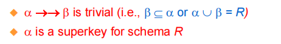​
  * 满足4NF一定满足BCNF

​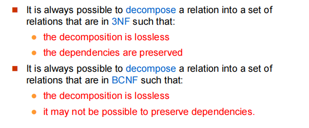​

无损分解，两种判定方式

​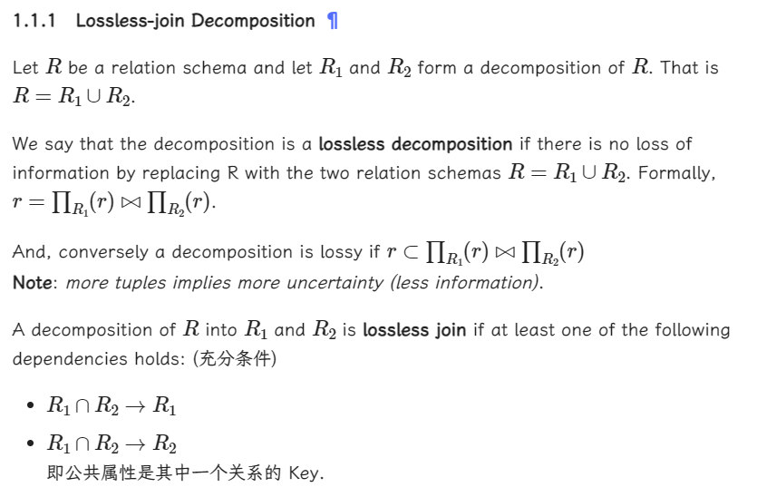​

### 函数闭包

### 正则覆盖

正则覆盖未必是唯一的

### 无损分解

### 依赖保持

### BCNF

### 3NF

涉及正则覆盖

算candidate key

## 4. 数据存储和查询

### 4.1 replacer * MRU

**clock replacer**

​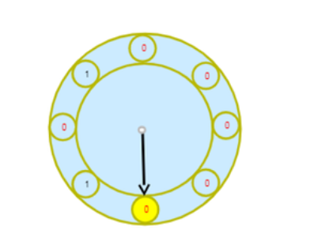​

对于上面的每个点都维护两个属性pin count和reference bit，如果某个点被访问，则将reference bit置为1，每次要替换的时候，指针旋转，如果reference bit为0就替换出来，如果不为0，就将reference bit置为0，旋转到下一个

空间局部性

时间局部性

要计算一个table里面的占了多少个block，首先把block size / record size，并且向下取整，然后在把record个数/上述结果，然后向上取整

**MRU**

system must pin the block currently being processed. After the final tuple of that block has been processed, the block is unpinned, and it becomes the most recently used block.

将最近使用的作为替换块

**toss-immediate strategy**

frees the space occupied by a block as soon as the final tuple of that block has been processed 用完之后马上free

### 4.2 物理的存储

**存储层次**

* volatile易失存储 cache, main memory
* non-volatile不易失存储 flash memory, disk...
* 三级存储

**磁盘存储**

磁盘有多个盘片(platter)，磁片上面有一个读写头(read-write head)，在使用过程中，磁盘以恒定的速度旋转，让读写头来读写。

盘片的表面分为一个个磁道（track），磁道又分为扇区（sector）。一般来说一个磁盘有1-5个盘片，一个盘片有50000-100000个磁道，每个磁道有500-1000的扇区，每个扇区一般都是512字节

当一个磁盘头在第i个磁道的时候，所有的磁盘头都在第i个磁道，所有盘片的第i个磁道构成了第i个柱面

**磁盘控制器disk controller**

磁盘给计算机的接口也有多种

* SATA
* SCSI
* SAS

**磁盘性能的度量**

我们有多个指标来衡量磁盘的性能

* access time = seek time(寻道时间) + rotational latency time(旋转到扇区时间) +数据量/数据传输率(data-transfer rate)
* Mean Time to Failure(MTTF)平均故障时间，现代磁盘一般在500 000 - 1200 000小时内

**磁盘块访问优化**

操作系统向磁盘数据的获取一般是以块block为单位的，一个块大概在512字节到几KB之间。同时还被分为随机访问和顺序访问两种

为了提高访问块的速度，产生了许多技术

* buffering

**optimization of disk block access**

* non-volatile wrtie buffer，例如battery backed up RAM 或者 flash memory 或者NVM
* log disk 专门一个磁盘来写日志，都是顺序写的，

  * write is fast and no seeks are required
  * no need for special hardware

**flash storage**

* NAND flash，比NOR flash更便宜

  * require page-at-a-time read（）not much difference between sequential and random read
  * page can only be written once
* SSD

  * block-oriented disk interfaces 但是用的是闪存存数据，也就是说用磁盘的接口，但是用闪存存储

​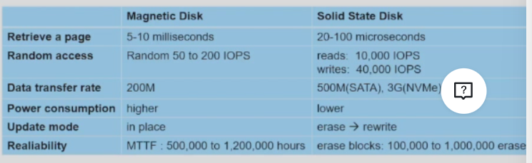​

其缺陷在于需要先擦除，再写 erase->rewrite

* 优化目标是少erase，使得各个块磨损的平均一点，比如数据有逻辑标志和物理标志，使得其逻辑存在和物理地址可以分离，比如说建立remapping机制
* wear leveling 磨损均衡- evenly distributed erase operators across physical blocks
* ​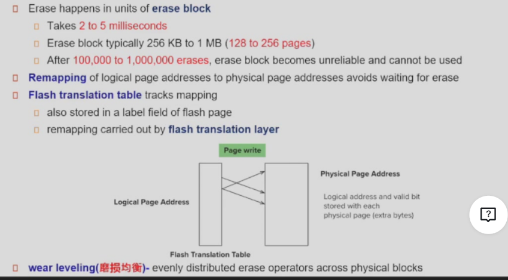​

各种介质的比较

​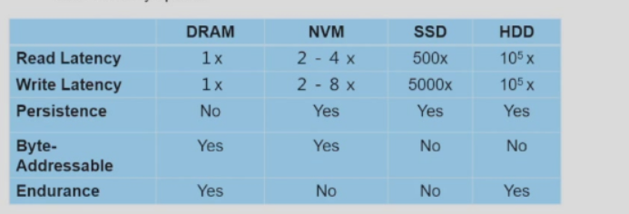​

byte-address - block-addresss

endurance 是耐久值

### 4.3 文件结构

一个数据库内部有多个文件，每个文件是a sequence of records, 一个record是 a sequence of fields。更准确的说法是每个文件被分为定长的存储单元 也就是block，对于block里面如何存储record，有一些做法，比如

#### Fixed-Length Records

我们可以把每个记录紧密地排列，每个块存储能存储的最大数量的records，但存在一些问题，当我们删除一条记录的时候，是否要把后面的所有记录都挪一上来一格，这么做显然是相当麻烦的。

可以考虑这种做法，在block的开头放一些数据作为元数据，可以存储空列表的开头位置，然后将空闲的地方都作为链表串起来，这样就可以不影响插入效率的情况下，最大化利用空间

#### variable-Length Records

我们需要变长记录的原因有

一般的变长record，开头也会有一些定长属性，一般就是offset+length，offset表示该记录中该属性的数据开始的位置，length表示长度。如下图，前三对属性就是对于三个变长属性的描述

​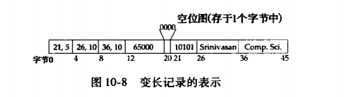​

通常这里还会有空位图的使用null-value bitmap，该图表示那些属性是空的

上述讲述了变长record内部的结构，那么record本身在block中是如何存储的呢，一般是采用slotted-page structure，在该结构的表头，存储着

* block中的record数量
* 空闲空间的末尾
* 一个由记录位置+大小的记录条目构成的数组

​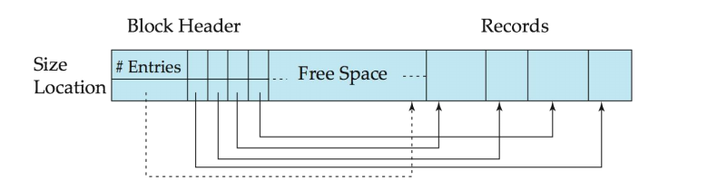​

实际的记录要从block的尾部开始连续排列，空闲空间是连续的，record之间也是连续的，当record被删除了，record前面的记录要后移，给FreeSpace提供空间

record pointer不应该直接指向记录，应该指向header里的entry

#### 文件中记录的组织

* heap
* sequential
* hashing file organization
* multitable clustering file

**heap file organization**

record可能被丢在文件任何空闲的地方，关键在于Free-space map，用于快速找到空闲位置

free space map

​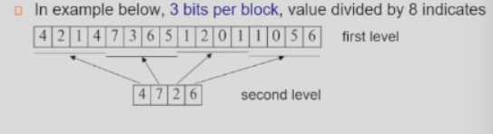​

上述的每个小方块里面放3个bit，表示0-7，用来表示对应的block，有n/8的空闲，但是如果文件的块很多，就可以多生成几层，比如上图，first level的四块对应second level的一块，second level里面就存四块里面最大的空闲

我这个文件里有很多block，我要用free space map去描述他们空闲状态

**sequential**

顺序文件是为了高效处理按某个搜索码的顺序排序的记录而设计的，我们用指针把记录按照这个码的顺序链接起来

deletion:把空闲的串起来

insertion:

* 如果有free space就插
* 没有free space 就插到 overflow block
* 都要更新pointer chain

need to reorganize the file from time to time

同样的插入和删除，也需要按照链表的做法去做

**multitable clustering File Organization**

把多个表存在同一个file中的做法，在大型数据库中，使用将一个文件分为block的做法是有性能上的好处的，每个block还是会存储一个表，这样的好处是不依赖操作系统自己的文件系统，数据库系统自己管理这个文件

store several relations in one file

同时这种文件组织，还支持在一个block存储两个或多个relation的相关records，可以更高效的处理join相关的查询，但是相对的其他类型的查询会变慢。

为了有逻辑的存储，我们还需要将同一个表的记录用链表串起来

​​

**table partitioning**

records in relation can be partitioned into smaller relations that are stored separately

* 按水平partition

  * 比如按照学生的所属学院分
* 按垂直partition

  * 比如将一些属性放在一个relation

**data dictionary storage**

这部分又称为system catalog，也就是关系的元数据存储，同时还会存储一些用户的信息

​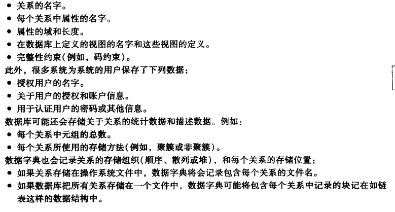​

​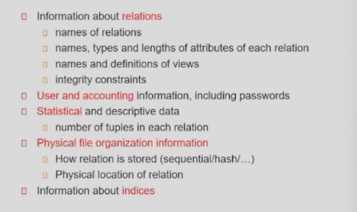​

### 4.4 buffer Manager

Block是磁盘读写的最小单位，buffer manager存在的目的是最小化读写次数

**LRU** 

​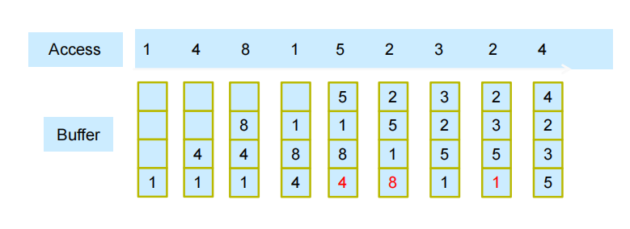​

**buffer manager**

数据库系统发出block请求

* 已经在buffer里面了，直接给主存里的地址
* 还不在buffer 里面

  * buffer 里面有空位就直接读一个进来
  * buffer里面没空位就用替换策略替代一个，如果是脏页，表述为(it was modified since the most recent time that it was written to/fetch from disk) 要写回磁盘

一些特性

* pinning block 是指不允许被写回磁盘的memory block，读写之前需要pin，读写完成后需要unpin，需要维护一个pin count，当其为0的时候才能evict
* shared and exclusive locks on buffer

  * 需要防止并发的move/reorganize操作，以及在move/reorganize操作期间的读
  * reader需要shared lock, update 需要 exclusive lock
  * ​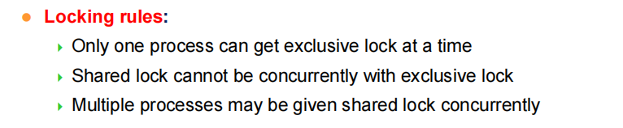​
* ‍

**替换策略**

LRU是一个常用的替换策略，在一个well-defined access pattern 比如顺序扫描中表现良好，在一些特定的存在repeated scans 的 access pattern，可能表现不好

* Toss-immediate strategy
* MRU strategy
* Clock 对LRU的一种模拟

**Column-Oriented Storage**

* 优势
* 劣势

**buffer tree**

### 4.5 按列存储

Store each attribute of a relation separately

​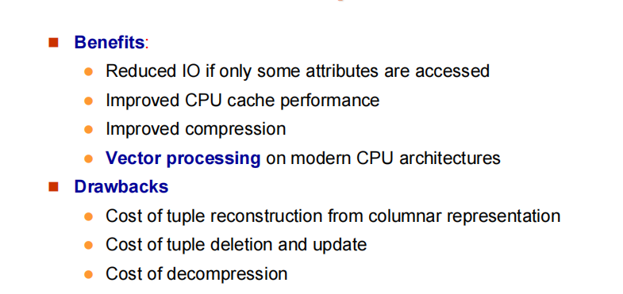​

简单来说就是利于部分属性的查询，cache和compression，缺陷在于deletion, update and reconstruction

* 列存储更利于 decision support
* 行存储更利于 transaction process

Some databases support both representations Called hybrid row/column stores

​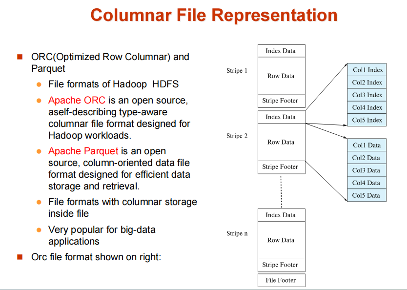​

## 5. indexing

### 5.1 **一些基础的概念**

indexing mechanism used to speed up access to desired data

* search key 用于查找记录的属性集
* index file 存储着一系列形如search key - pointer 的记录，其一般都远小于原文件
* 一般有两种索引形式

  * ordered indices是指search key以sorted order被存储
  * Hash indices是指search key使用hash function均匀存在bucket里
* 有一系列的评价指标
* ​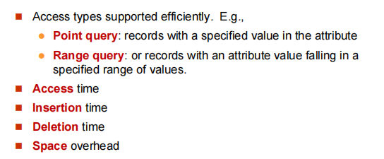​

### 5.2 Ordered Indices

顺序索引按照某种标准可以分为两类

* primary index 又叫clustering index，是指被索引的记录本身就按照某个search key顺序存储，虽说叫primary key，但是实际上并不一定按照primary key，用任意一个key均可，一般是primary key
* secondary key 又叫nonclustering index，与上述概念相对，本身不按照该key排序

index-sequential file是指存在primary key的文件

​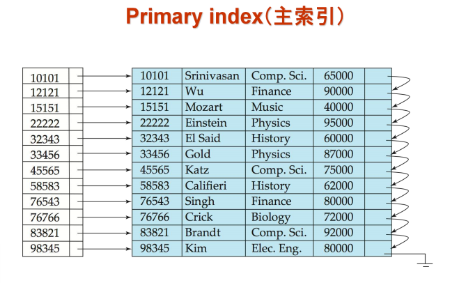​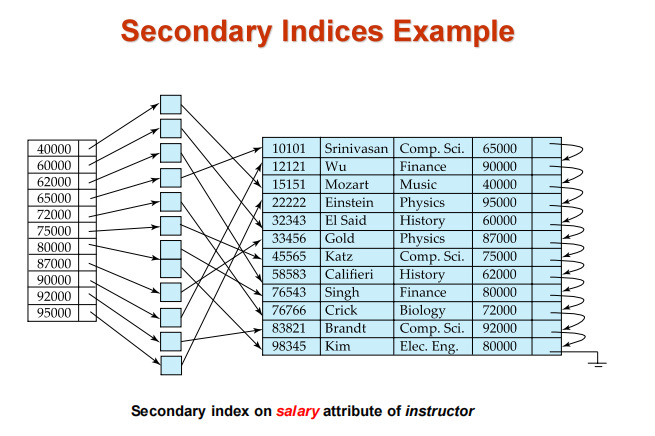​

‍

index entry 或者叫 index record，是指一个search key - pointer 对

* Dense index file 文件中的每一个search key都有一个对应的index entry，唯一的例外是当这个文件是index-sequential file/clustering index的时候，可以让index entry指向相同的search keys的第一个
* Sparse index 只为搜索码的某些值建立索引，此时必须是clustering index，顺着这个索引找，可以确定一定范围内的数据，稀疏索引+排序的加速

稀疏索引的space和maintenance开销更小，但是查找更慢

Good tradeoff: sparse index with an index entry for every block in file,corresponding to least search-key value in the block.

**multilevel index**

我们提出要建立primary index，但是随着table的变大，我们的primary index也会随之变大，直到不能再放到内存里，这样primary index的使用就变得麻烦了，一个很好的解决方法就是给primary index分段建立sparse index

​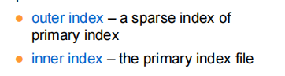​

当outer index也过大的时候，就再在其上建立一层index，于是我们有了多层索引

‍

### 5.3 **B+ tree index**

B+树索引文件是对indexed-sequential files的一种优化，虽然相对稍微提高了一些insertion和deletion的开销，但是bp树索引的优点更大，因此被广泛使用

bp树是一种多级索引，其有以下特性

N个指针，N-1个key

* All paths from root to leaf has same length
* 非根非叶的内部节点，有$\lceil n/2\rceil -n$ 个children
* 叶子节点，有$\lceil(n-1)/2\rceil - (n-1)$个values
* root 节点

  * 不是叶子，最少两个children
  * 是叶子，0 - (n-1) 个values

​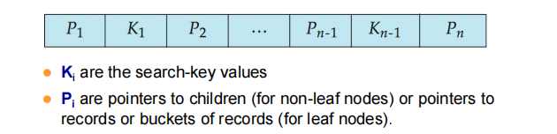​

叶子节点

​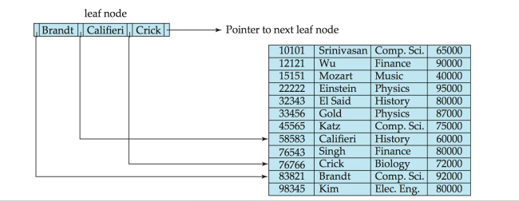​

bp树索引的一些特性

* ​​
* ​​
* insertion，如果能正常插入则插入，反之便要分裂

  * 分裂的方法，将第$0-\lceil n/2\rceil$ 个元素放在原始的node，剩余的元素放到新的node，并且将最小的key和自身的地址p发送到父节点
* deletion 可能需要调整结构

  * Merge：如果兄弟节点的元素数之和可以容纳在一个node里面，就合并，一般是向右边找兄弟节点先，然后将右边的兄弟合并到左边，删除右边节点
  * Redistribute：如果不能容纳，就调整其和兄弟节点之间的元素数，并且在父亲结点里调整指针
  * deletion may cascade upwards
  * 如果root node被删除到了只有一个pointer，那么其将被删除，并且其唯一的child将成为新的root
* ​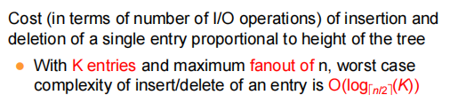​
* 而在实际情况下IO会更少，因为node可能在buffer中，并且分裂和合并是少的

non-unique search key

如果search-key存在重复现象，我们需要一些额外的处理手段，比如

* 创建composite key 将该key和一些其他的key放在一块作为search key，达到unique的效果，一般和primary key呢，可以形成一种range search的效果
* ​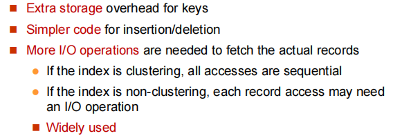​

* **估计bp树的size**

​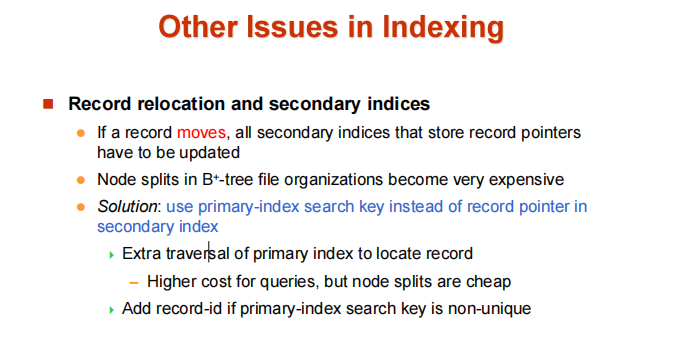​

### 5.4 other issues in indexing

**record relocation and secondary indices**

如果一个表有多个属性，并且这些属性上面都建立了bp树，如果删除record就需要更新很多，解决方法是可以让secondary index的叶子节点存primary key的值

**indexing strings**

是指那些search key是可变长度的，比如string中的varchar，因为如果都取最大值的时候，会导致bp树分支变少，从而导致效率下降，因此我们会在这里使用prefix compression

* use space utilization as criterion for splitting 将空间利用率作为分裂的标准
* 动态的fanout, fanout就是N

类似于huffman tree，只要能做区分的最少bit

**bulk loading and bottom-up build**

大量数据插入的优化

bulk loading 批量插入

* insert in sorted order
* bottom-up B+ tree construction

  * 每个叶子节点都插满，最后两个需要调节一下，做到半满即可
  * ​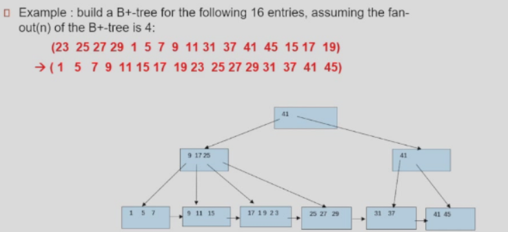​
  * 首先排序
  * 构建
  * the built B+ tree is written to disk using sequential IO operations(提高后续访问的效率) 叶子page都顺序放在与一起
  * 对于上述例子，1seek+9 block transfers 就完成了生成
* 上述的情况是B+树生成的结果，如果是已经有B+树，同时要插入大量数据呢

  * 新建一个B+ tree 合并，形似把叶子节点归排序
  * 2seeks + 19 block transfers
  * ​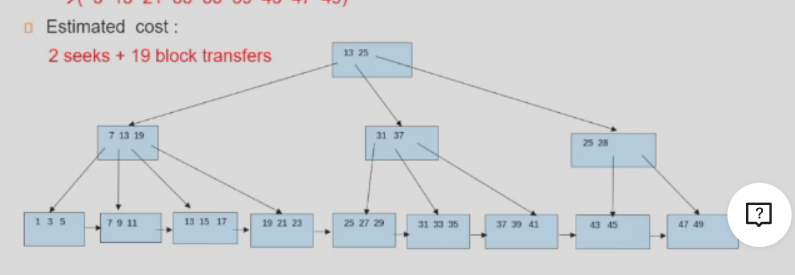​

**multiple-key access**

有两个元素的筛选

* A B都无索引，扫描
* A 有 B 无，取A，扫描B
* A B都有 取并集合

或者是建立 composite search key (a,b) (a,b)

**indexing in main memory**

B+ tree with small nodes that fit in cache line are preferable to reduce cache misses，这种做法称为 cache conscious

​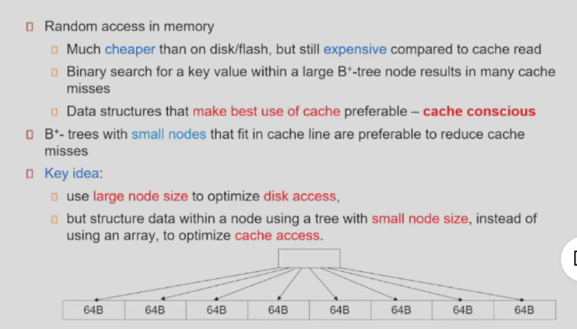​

### 5.5 Write Optimized

​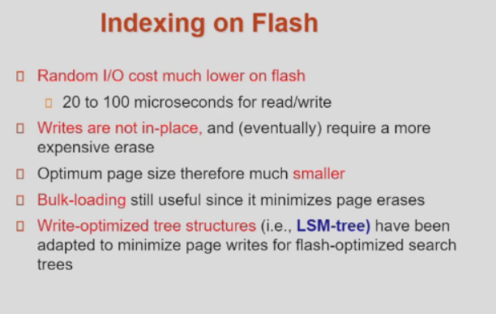​

flash上的索引最好能用Write-optimized tree structures，对于写频繁的disk也适用，这里介绍两种

* LSM tree
* buffer tree

**log structured merge tree LSM**

​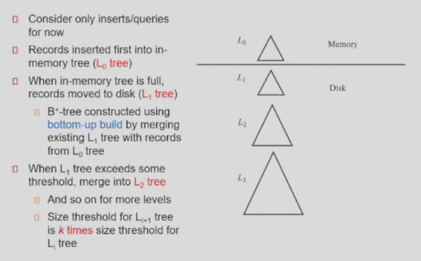​

现在内存里建立索引结构，设定一个上限，达到上限后写入磁盘，变为1级B+ tree，自底向上，不断地加入1级，然后merge

显然各级的B+ tree都有一个上限，超出上限之后就merge到下一层

一般Li+1会比Li大k倍

更优化一点，对每层都安排多个B+ tree，直接把每层的merge都写入下一层

​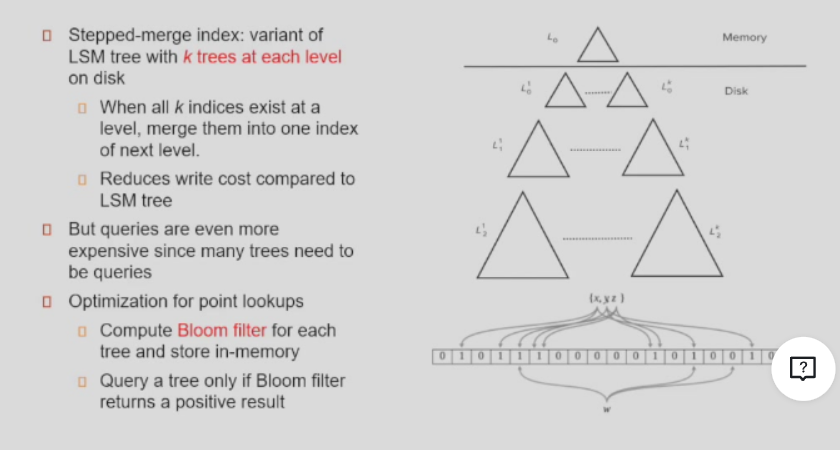​

如果要查找，要对所有的B+ tree都search，对于lookup也有优化，Bloom filter

通过一个Bloom filter，可以快速判断一个值是否在这个B+tree上，虽然判断成功也不一定在，bloom filter是一个bit数组，有一个 hash 函数，hash函数的输出位数和bit数组的位数一样，将B+tree的search key范围内的数字全做一遍hash，将其中为1的位数，相应的bloom filter的位数也置1，已经为1就不改了

此时来了一个search key，如果其hash之后的值有一个1落在了0上，必然就不在这个B+树上

如果要删除，那么一般就是打上delete entries，在merge的时候实际伤处

**buffer Tree**

我对于中间节点做一个优化，每个中间节点会分配一点空间用来做buffer

​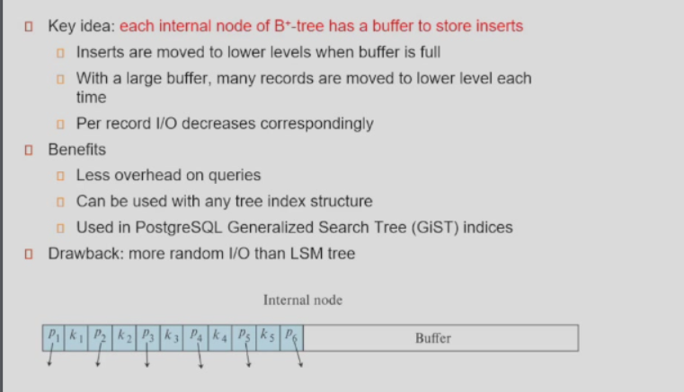​

插入的时候先姑且插在内部节点的这个buffer里面，当buffer满的时候再向下面插，如果下面的buffer有空就插在下面，直到丢到leaf里面

因为内部节点在buffer里的概率更大，这么做有利于减少IO，写优化

**缺陷**

fanout少了，树的结构变得不太优了

### 5.6 bitmap index*

bitmap indices are a special type of index designed fro efficient querying on multuple keys

适用于那些取值存在离散的有限范围的属性，比如性别，国家等等

他会对取值的范围建立一个bit数组

​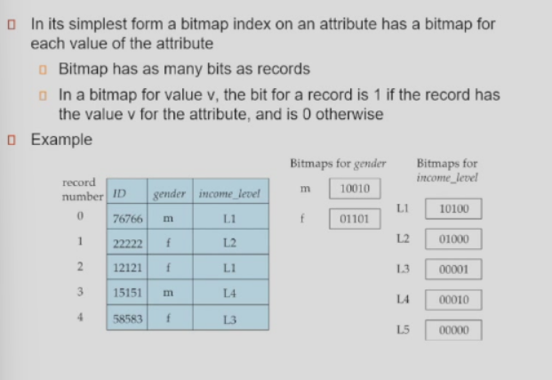​

100w个bits如何统计有多少个1,100w个bit，可以考虑分成一堆bytes，然后建立bytes值和1数量的映射，进行循环统计

​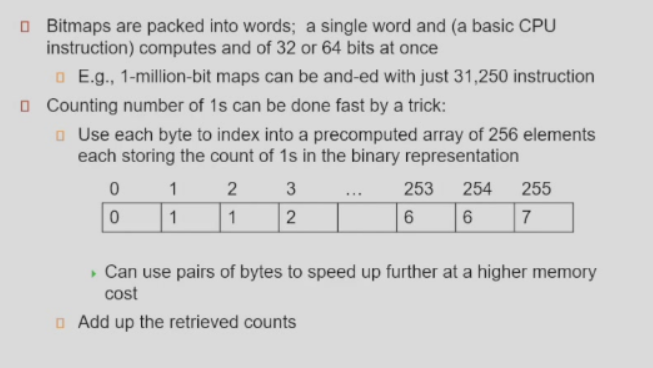​

## 6. Query Processing

### 6.1 basic steps

* Parsing and translation 语法分析和翻译
* optimization
* evaluation

An evaluation plan defines exactly what algorithm is used for each operation, and how the execution of the operations is coordinated.

对于Query而言，最常见的衡量方法是，更关注response time

* the number of block transfers from disk 传输的时间
* the number of seeks 搜索的时间，只有不连续的时候需要用到

由于buffer的使用只有运行时才能衡量，所以我们一般就使用worst case estimates

### 6.2 Selection

10种

**scan**

* File Scan
* Index Scan

**selection**

### 6.3 Sort* 

外排序

M表示内存的大小，br表示关系r中的block的数量，对于N-way merge，是指一次归并N个block

* 如果N<M 一次完成

  * 用N个block作为input，用一个block作为输出，不断做归并排序，当输出block满了就写入磁盘
* 如果N>=M

  * 每个pass放M-1个

对于一次归并排序而言

* 每次需要2br个数据传输
* 每次使得需要归并的段数降为1/(M-1)所以总得归并次数为$\lceil\log_{M-1}(b_r/M)\rceil$
* 最后一趟只需要一个br的数据传输，因为结果可以不写回磁盘，总得数据传输次数为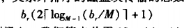​

* 磁盘搜索次数为，其中$b_b$为缓冲块数  
  ​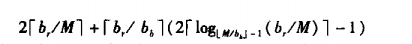​

PPT上给了一个复杂版本和简单版本 P25

### 6.4 Join* hash join A4

5种join算法

* Nested-Loop Join:

  * ​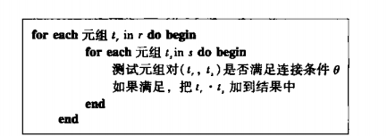​
  * 其中r是外部关系，s是内部关系，nr是r内部的元组数，我们需要对每个r中元组读取一次s中所有的block，可以推出block transfer
  * block transfer: $n_r*b_s+b_r$
  * seeks：$n_r+b_r$
  * 如果其中一个关系能完全放入磁盘中，那么将其作为内层关系，我们可以推出只需要br+bsblock transfer和2个seeks
* Block Nested-Loop Join

  * block transfer $b_r*b_s +b_r$
  * seeks $2b_r$
  * ​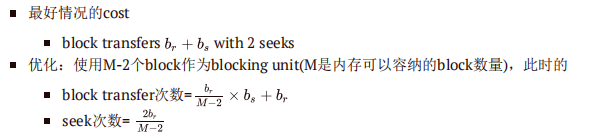​
* indexed nested-Loop Join

  * cost = $b_r(t_r+t_s)+n_r*c$ c是通过连接条件对s进行单次select的代价
  * 如果r和s上都有索引，那么需要把元组较少的关系作为外层
* Merge join

  * 磁盘传输次数 bs+br
  * 磁盘寻址次数 $\lceil br/bb\rceil+\lceil bs/bb\rceil$ 最坏情况就是br+bs
  * 和merge sort 很像，有一个比较特殊的地方是，如果两边同一个值都有多个，比如A处有两个，B处有三个，则需要做6个链接，在这种时候需要一个小循环
* Hash Join

  * 仅仅用作等值连接和自然连接（其实就是特殊等值连接）
  * hash函数的参数就是等值的属性
  * 把hash值相同的放在一起
  * hash索引的key就是连接的等值条件 hash function h is used to partition tuples of both relations with common JoinAttrs
  * ​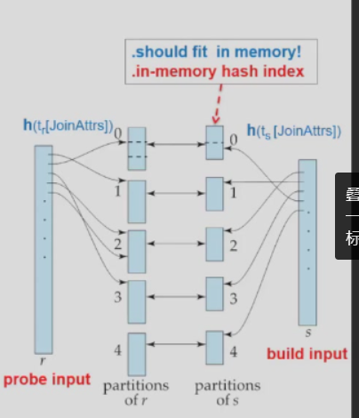​
  * hash值不同的，一定链接不上，如果hash相同，也未必链接得上，我们还是得在内部做两重循环
  * 要求是hash的块，至少小的那个能放到内存里，n是hash值的个数，M是缓冲块的个数  
    ​​
* hash join的过程，先partition，再join，注意partition并非同时发生的
* ​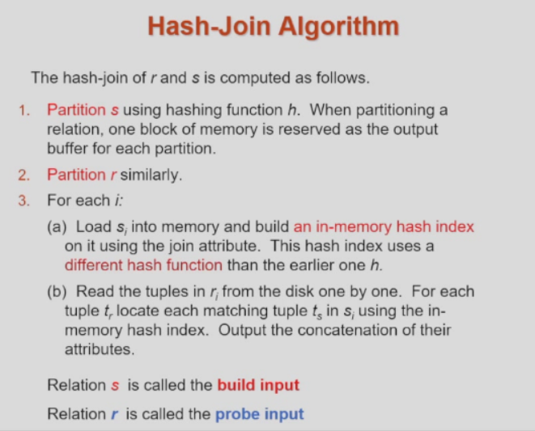​
* 具体链接的时候，对于s要建立in-memory hash index, 这个hash函数和之前那个不同，
* build input 能放到内存里
* probe input
* recursive partition required if number of partition n is greater than number of page M of memory

  * 之前说起码要有一块能放在内存里，万一就是放不下，那么我们需要对那些过大的block再进行一个hash partition
  * ​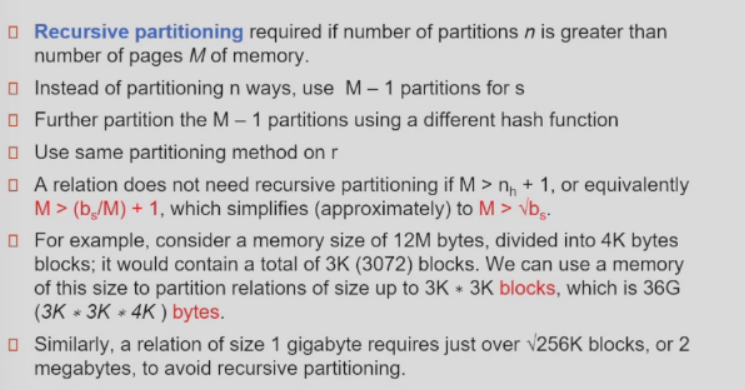​
  * recursive partition的界限
  * ​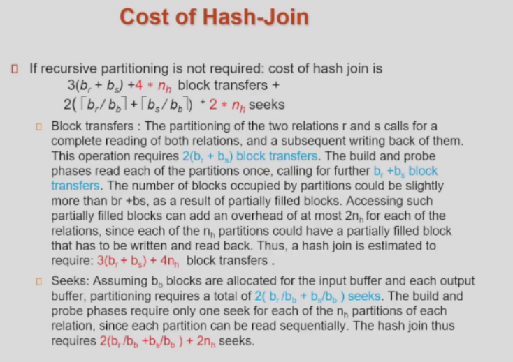​
  * ‍

‍

## 7. Query Opimization

### generating equivalent expression

一系列等价原则

​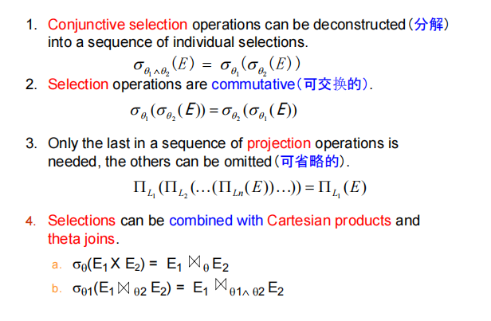​

在数据库中连接操作是最关键的，如果连接能同时做筛选最好一起做了

* $\prod_{A}(\prod_{AB}(r))=\prod_{A}(r)$ 成立
* $\prod_{A}(\prod_{B}(r))=\prod_{A}(r)$ 不成立，总之B要包含A

​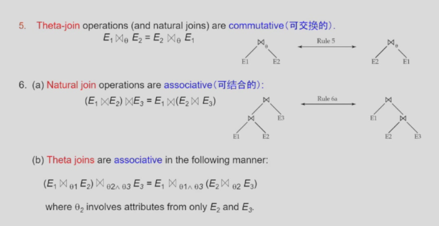​

Theta-join可以交换，说明natural join是可以交换，natural join也是可以结合的

后面还有很多详细见PPT

union and intersection

### statistics for cost estimation* 直方图

* space requirements reduced by sharing common sub-expressions
* time requirements are reduced by not generating all expressions

下面是与cost estimation相关的一些元素

​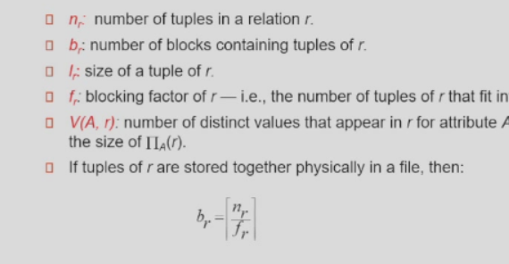​

接下来是我们通过一些额外的信息来评估查询的结果

**Histograms**

直方图

​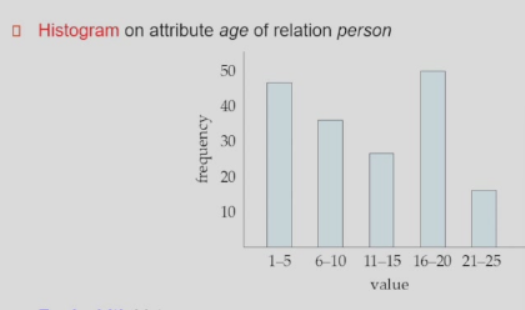​

可以进行一些简单的估算，见朋辈*

**根据最大最小值select估计**

* 如果是key 则结果size为1，等于查询
* ​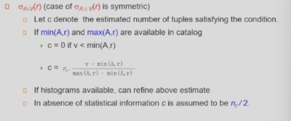​
* 如果对于复合的查询，conjunction disjunction等
* ​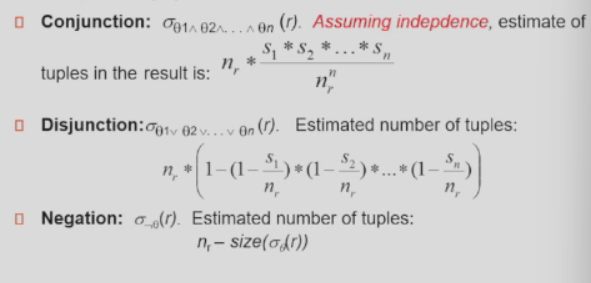​

‍

### estimation of the size of join

* 若为简单的笛卡尔积 rxs 结果就是两个元组数相乘 nr * ns
* 若为$R\cap S=\varnothing$，则 $r \Join s = r \times s$
* 若$R \cap S$ is a key for R, $r \Join s \le n_s$
* 若$R\cap S$ is a foreign key in S referencing R，$r\Join s = n_s$ 也有一个前提是foreign key不为空，实际上即使存在foreign key 约束也可以为null
* 如果不存在key约束，那么一般结果为 $\min\{ \frac{n_r*n_s}{V(A,s)},\frac{n_r*n_s}{V(A,r)} \}$

### estimation of number of distinct value

我们在之前用到了很多次 V(A,r) ，我们也需要能够估计中间结果的V(A, r)，以便能够后续处理。

**select的V(A,r)估计** **$\sigma_{\theta}(r)$** 求 $V(A,\sigma_{\theta}(r))$  

* 若 $\theta$ 的筛选是一个特定的值，那么V = 1
* 如果筛选是一系列特定的值，那么就加起来
* 如果筛选是一个范围 V = V(A, r) * s s是selectivity of the selection
* ​​

**join 的估计**

​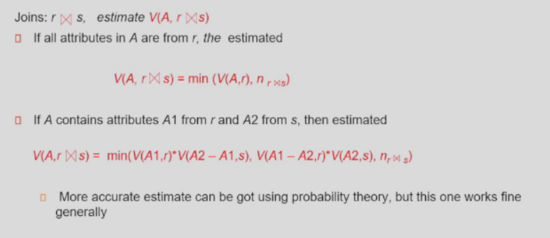​

### 其他的size估计

​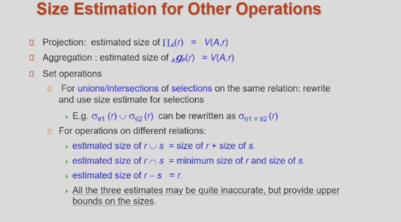​

### choice of evaluation plan

**cost-based join-order selection**

如果有r1-rn个关系做natural join

​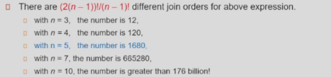​

实际的做法是采用动态规划去优化，以下是一个例子，我们先找到了1-3的最优解，那么接下来只要把1-3看做一个整体，和4,5，又是3个关系的排序，12+12

​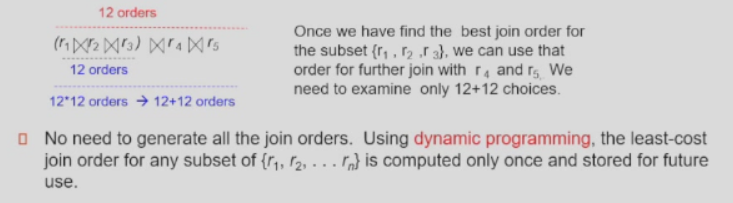​

先分解成两个小的集合 $𝑆_1,𝑆−𝑆_1.$递归地细分。递归到最底层就变为了对单个表的选择方法。

时间复杂度分析，但实际可能会采用left-deep join tree，找到的未必是最优，但是能降低时间复杂度

​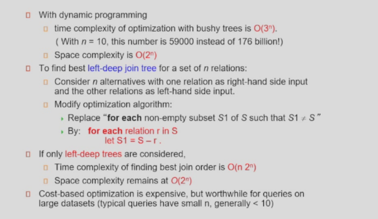​

**heuristic optimization 启发式优化**

cost-based optimization 即便是使用了 dp也依旧非常expensive，system有时会采用启发式的方法reduce the number of choices that must be made in a cost-based fashion

​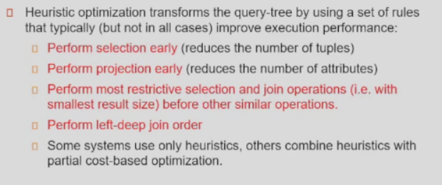​

### additional optimization technique

**optimizing nested subquery**

​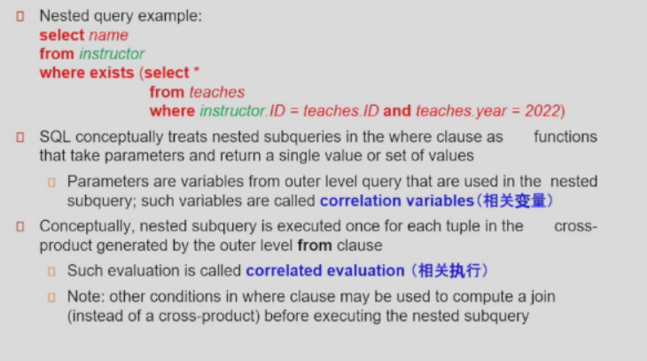​

一个简单的想法是将其转换成join操作，因为循环着每次做一次子查询，开销会非常大

​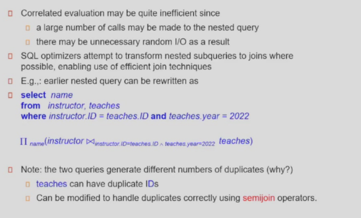​

可以使用semijoin操作来替代exists等运算

### 成本估计

中间结果要少

cost-based query optimization

* generate logically equivalent expression 先筛选
* Annotate resultant expression in alternative ways to get alternative query plan
* choose cheapest plan based on estimated cost

可以使用explain <query>让数据库引擎来解释query plan

评估执行计划的cost

越小越精确

估计distinct values

**选择成本**

* A=v等价选择，若取值是均匀分布的，如有一个直方图，可以用n/V，n为该区域内元组个数，V是该区域内值的个数
* A<=v ​

对于复杂的选择

​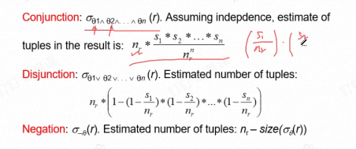​

s1就是指满足$\theta1$的记录个数

**连接成本**

​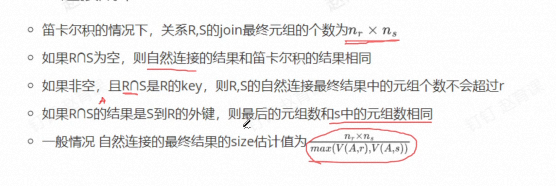​

V(A, r) 表示关系r的A属性上多少种不同的A

### 优化的启发性思路Heuristic

选择优先等等

选择算子的排序

## 8. transaction

ACID

### 事务隔离性

就是要让事务表现得像是串行的一样

* 可串行化

  * 冲突可串行化 若一个调度和一个串行调度冲突等价，则说明其是冲突可串行化的
  * 冲突，是指指向一个元素的两个的操作，其中至少一个是写
  * 冲突等价 conflict equivalent，是指我们可以通过交换一系列非冲突指令来转换两个调度，则称两个调度冲突等价
  * 优先图 precedence graph $T_i\rightarrow T_j$ 是指Ti在Tj之前
  * 在优先图中，serializability order 可以通过topological sorting获得
  * view serializability

**事务隔离性+原子性**

可恢复调度 recoverable schedule，来看这么一个调度

​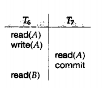​

若T7提交之后，T6发生了故障，显然保持原子性，writeA需要被回滚，因此此时T7的read结果就是一个错误结果，但是此时T6已经提交了，不能被级联回滚，因此此时，这个调度是一个不可恢复调度

**无级联调度**

首先无级联调度本身是一个可恢复调度，并且由于事务发生故障导致的很多事务发生回滚，该现象成为cascading rollback 级联回滚

能够避免cascading rollback的调度是cascadeless schedule

**四种SQL标准的隔离级别**

统计信息的时候不一定需要精确

* Serializable 最高隔离
* Repeatable read，能找到一些records，但无法找到其他的记录。非Serializable
* read committed
* read uncommitted 最低隔离

## 9. concurrency control

维护隔离性和一致性？

两阶段锁并非是一个必要条件，而只是充分条件

### 9.1 基于锁的协议

事务锁的请求的饿死(starved)，是指有一堆的事务向数据加共享锁，以至于排他锁的请求一直等待不到

​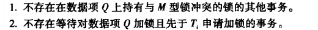​

我们通过设计先后条件，使其不被其后的加锁请求阻塞

**两阶段封锁协议**

只要根据lock-point排序，两阶段封锁协议可以确保Serializablility

证明

* 反证
* 正向：通过交换操作，可以把lock point早的操作全部交换到最早

区分增长阶段和缩减阶段

* strict two-phase locking protocol 事务的排他锁在事务提交之后才能释放，可以避免级联回滚
* rigorous two-phase locking protocol 事务在提交之前不可释放任何锁

如何判断这个调度是否由两阶段协议产生，是根据事务加锁的状态来的

​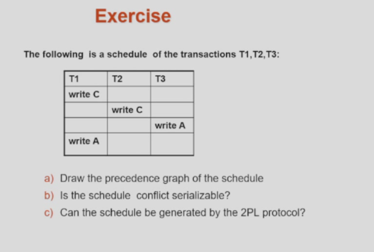​

如上图是一个可串行化的，非两阶段的调度

**非两阶段协议**

* 图的协议

**死锁处理**

* 死锁预防
* 死锁检测+恢复 画图，检测，选择一个牺牲的事务，恢复

  * total rollback
  * partial rollback

**锁协议的缺陷**

死锁

​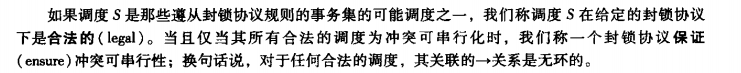​

**lock conversion**

* lock-upgrade
* lock-downgrade

**lock table**

集中管理锁的manager，需要一个hash table，将一个数据唯一标识映射到一个地方

​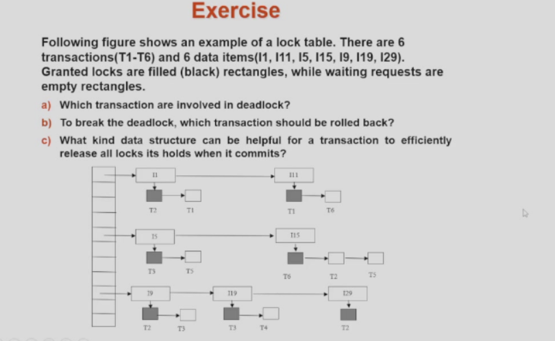​

### 9.2 Graph-based Protocol

如果我们对数据的结构没有了解，那么两阶段协议是合适的，如果我们对数据存在一定的了解，那么可以根据其结构，使用更高级的协议，比如如果数据满足偏序关系

​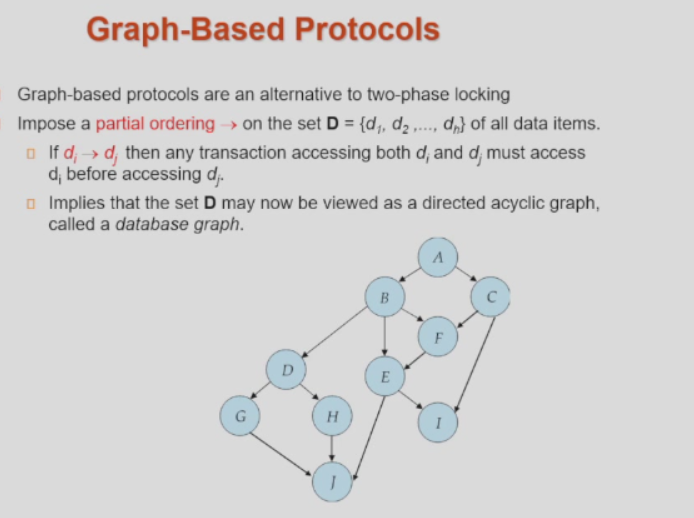​

比如我们需要访问B，必须要访问A

在这里我们讲解最简单的tree protocol算是图协议的一种特化

​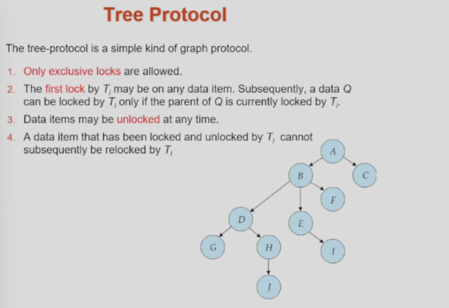​

* 只有排他锁
* 第一个锁可以加载任何地方，不需要从root开始；后续的锁，必须要争父节点锁上
* 可以在任何时候解锁
* 每个数据对一个事物仅能锁一次

优点

* 可以一定程度上提高并发度，因为可以随时释放
* 保证串行，避免死锁

缺陷

* 也有一些缺陷，比如我想访问G，J，我就必须锁上它们的公共祖先D，虽然我们可能并不需要访问D和H
* 不保证可恢复性，可恢复性的关键在于不读脏数据

### 9.3 **granularity***

### 9.4 insert and deletion

前面都把数据库的操作简化成了读和写，那么我们现在来考虑实际的insert和delete操作

如果使用两阶段锁

* 数据delete之前都得给他加上X锁
* 数据insert之后要给他加上X锁

确保以下两点

​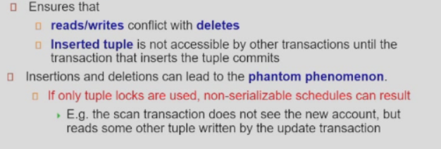​

同时会导致幽灵问题，比如一个事物的两次读表中间，存在一个事物的插入和提交，会导致这个事务两次读不一致

避免的方法是整个表加个锁，可以避免死锁，但是效率会下降

index locking protocol to prevent phantoms

谓词加锁机制可以通过index locking protocol来实现，比如我插入了一条年龄为18的student数据，我对于所有的关于age包括18的查询都需要冲突掉，这就是所谓的谓词加锁

在这个协议上，就在index的叶子上加锁，比如在18岁所在的叶子上加锁

​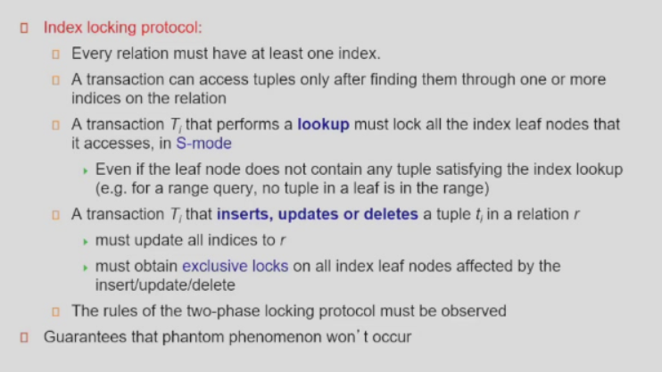​

还有另一个协议

​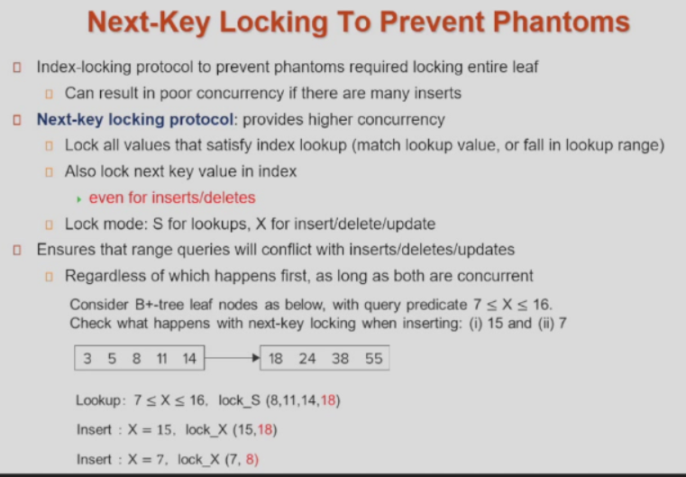​

### 9.5 multiversion locking

对于数据产生一系列新的版本

事务要声明只读还是读写

​​

* update

  * ​​
* read-only

  * ​​

​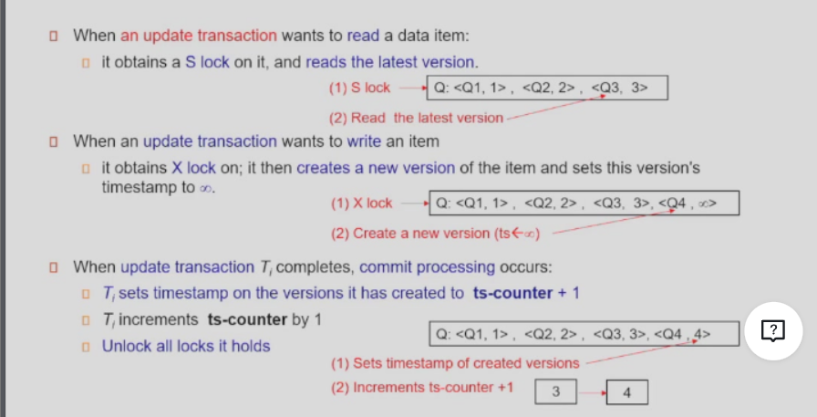​

read-only 事务也需要时间戳，但是不需要任何锁

‍

## 10. recovery

恢复本身是要保持这两个性质

1. **Durability**: 事务一旦完成，我们永远不会丢失事务的结果
2. **Atomicity**: 事务永远不会处于中间态，要么完成，要么完成不做

故障发生的原因

1. transaction failure: 例如非法输入，非法更新，死锁等，logical error/system error
2. system crash: power failure hardware/software failure
3. disk failure：head crash

对于Database recovery我们要采用strict two-phase locking ensure no dirty read

并且要保证idempotent

### 10.1 stable storage*

我们这里提出一种新的storage，比nonvolatile storage更高一层的stable storage，视为一种可以抵御任何failure的理想介质

* a mythical form of storage that survives all failures

书本上简单介绍了这种介质的实现，有以下三个性质

* Maintain multiple copies of each block on separate disks
* Failure during data transfer can still result in inconsistent copies，存在三种情况

  * successful completion
  * partial failure
  * total failure
* Protecting storage media from failure during data transfer

  * 执行output operation 要维护两个block

    1. 写到第一个physical block
    2. 第一个写成功了，将相同信息写到第二个
    3. 第二个写入成功之后才会输出

‍

### 10.2 log record

为了保持log的有效性，我们必须把log写入stable storage，我们也可以采取一些手段来减少这个写的开销

log的基本形式

​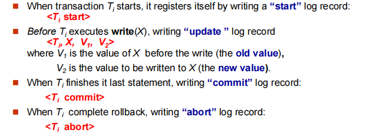​

遵循write-ahead logging WAL 日志先写原则：当数据从主存output到磁盘上之前，要先把log record写到stable storage中

**deferred-modification and immediate-modification**

* deferred 事务在提交之前都不修改数据：需要建立修改数据项的本地备份，commit之后靠log写，crash之后，之有commit的需要按照commit的顺序依次redo
* immediate 事务活跃的时候就会修改数据

**concurrency control and recovery**

需要事务使用严格两阶段锁

### 10.3 checkpoint

redo/undo 所有的事务会是非常慢的，因此我们需要checkpoint

streamline recovery procedure by periodicalluy perfromaing checkpointing

* Output all log records currently residing in main memory onto stable storage.
* Output all modified buffer blocks to the disk
* Write a log record < checkpoint L> onto stable storage where L is a list of all transactions active at the time of checkpoint.
* 在做checkpoint期间停止所有的updates

我们根据checkpoint里的所有事务+checkpoint之后log里的事务，视作一个集合T，如果T中的事务A已经commit/abort 就执行redo，反之就只想undo

**fuzzy checkpoint**

To avoid long interruption of normal processing during checkpointing, allow updates to happen during checkpointing

checkpoint先把脏page给记录下来，随后慢慢地把脏page写入磁盘，直到最后一个脏page写入磁盘，设置该checkpoint是成功的

**redo and undo**

正常的事务回滚中只做undo，从后往前，每次重做写一个只读的日志CLR(compensation log record) 找到了start就写一个abort

* redo

  * 遇到正常日志和CLR（也是redo-only日志）就重做
  * 遇到T start 加到undo-list中
  * 遇到T abort/commit 就从undo list里面去掉
* undo

  * undo list里面做正常事务回滚

一个例子

​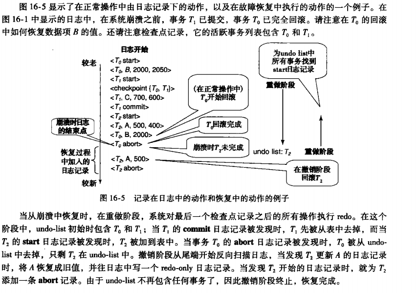​

### 10.4 log record buffer

在之前我们都假设log record生成就写到stable storage中，但这实际上比较低效的，于是我们有了log record buffering

group commit: 将一个block的log一次性写入stable storage，降低IO开销

为了维护原子性，要满足一些性质

* Log records are output to stable storage in the order in which they are created.
* Transaction Ti enters the commit state only when the log record <Ti commit> has been output to stable storage.
* Before a block of data in main memory is output to the database, all log records pertaining to data in that block must have been output to stable storage. 这一块就是WAL原则

**Database buffer**

* force 提交时强制把所有相关page output到disk
* no-force 相反

* no-steal 活跃事务的相关block都不能写到disk
* steal 反之

当我们要写一个block回到磁盘的时候，需要对这个block加上latch，并且将与之相关的log写入磁盘，再把block写入磁盘，释放锁

### 10.5 Failure with loss of nonvolatile storage

上述讨论的都是内存里故障的情形，如果连磁盘里存的数据都出问题了呢

Periodically dump the entire content of the database to stable storage

dump过程要求类似于严格的checkpoint

​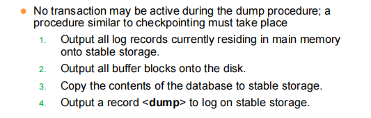​

### 10.6 recovery with early lock release and logical undo operations*

我们因为要提高并发度，特别是对bp树操作的情形，可能会采用非两阶段的形式，也就是说有可能提前释放锁

对于这种情况下，我们要恢复是删除该元素

Recovery based on “repeating history”, whereby recovery executes exactly the same actions as normal processing

但是对于bp树而言，我们不能用physical undo，也即重新存储old value；而是需要执行logical undo，就是insertion通过deletion撤销

### 10.7 Aries*

ARIES is a state of the art recovery method

* 使用LSN log sequence number to identify log records，将会把LSN存到page上
* Physiological redo 受影响的page是物理标志的，但内部可能是逻辑的
* Dirty page table
* Fuzzy checkpointing

​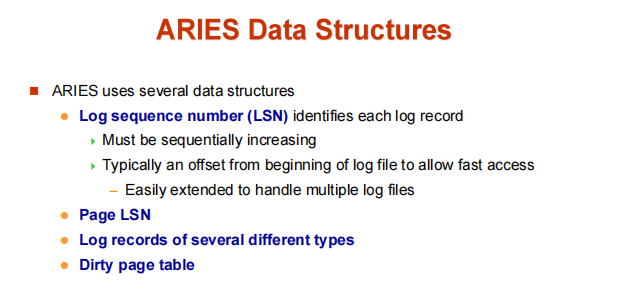​

Special redo-only log record called compensation log record (CLR) used to log actions taken during recovery that never need to be undone.

​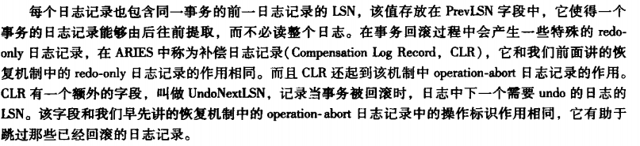​

check point log record 包括

* Dirty Page Table 包括 PagLSN 和 RecLSN
* Active Transation，LastLSN the LSN of the last log record

ARIES流程

* Analysis pass 不需要数据库block的传输

  * 从最后的完整checkpoint开始

    * 读Dirty Page Table，将RedoLSN设置为min{RecLSN of all pages}，如果没有脏page，那么RedoLSN就是checkpoint的LSN
    * set undo-list = list of transactions in checkpoint log record
  * 从checkpoint开始scan日志

    * 如果有个事务不存在于undo-list，将其加入到undo-list
    * 如果有事务终止了，那么将该事务从undo-list里删除
    * Keeps track of last log record for each transaction in undo-list
    * 如果发现有page的更新记录，那么需要更新的dirty page table上，

      如果该页不在脏页表中，分析阶段就将它加进脏页表。并设量该页的RecLSN为该日志记录的LSN。
* Redo pass

  * 从RedoLSN开始扫描log，只关心update操作
  * 对于这个日志对应的page，如果该page不在脏页表，或者更新日志LSN小于脏页表，跳过该日志
  * 反之，就从磁盘调出该page，如果更新日志LSN大于pageLSN，就重做
* Undo pass

  * 对日志进行反向扫描，对undo-list里面所有事物进行撤销
  * 每当找到一个需要撤销的日志，就执行一个undo，生成一个CLR，并且把CLR的undoNextLSN设置为该更新日志记录的PrevLSN
  * 如果反向扫描的时候遇到CLR，直接转到undoNextLSN的位置

$$
\prod_{A}(\prod_{AB}(r))=\prod_{A}(r)
$$

‍

‍
