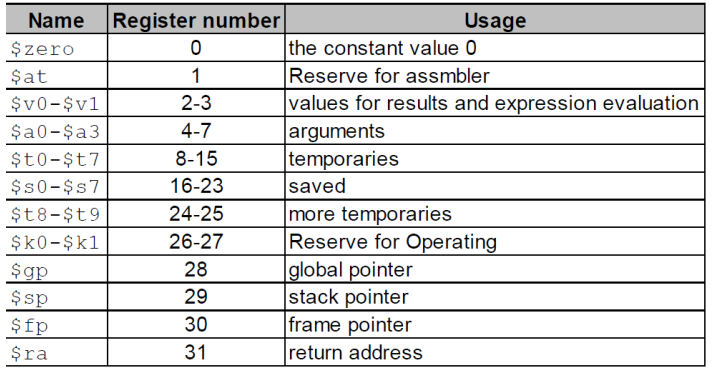
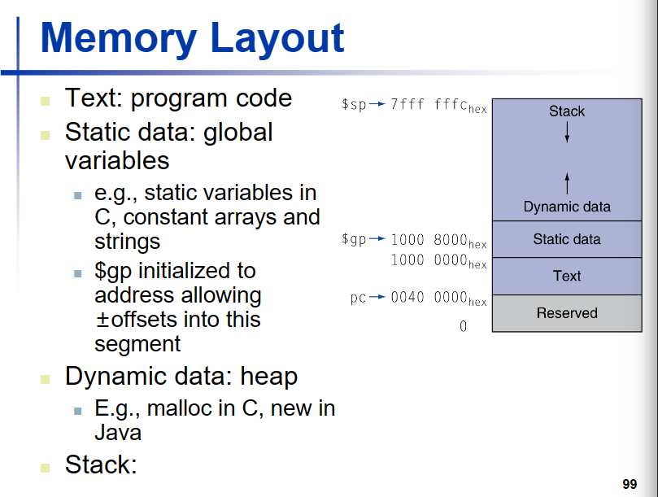
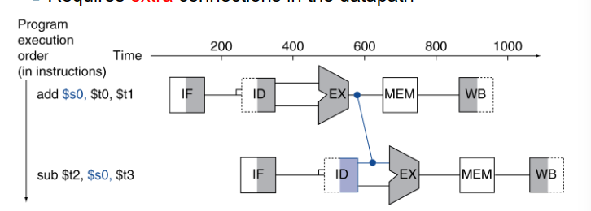
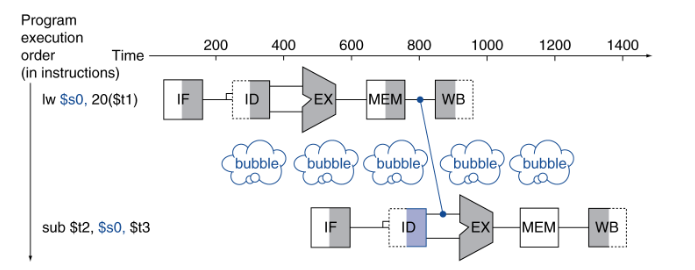
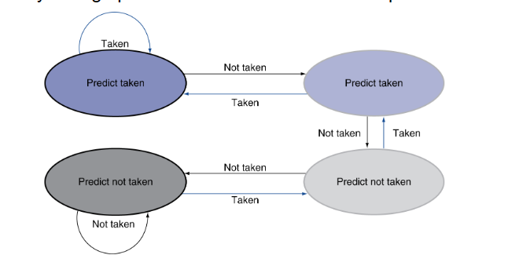
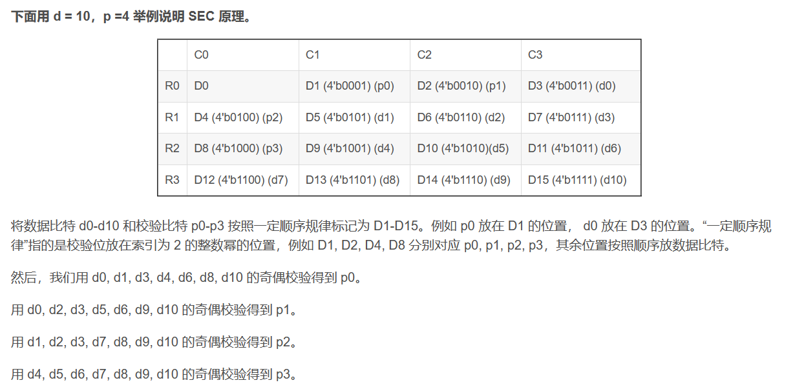
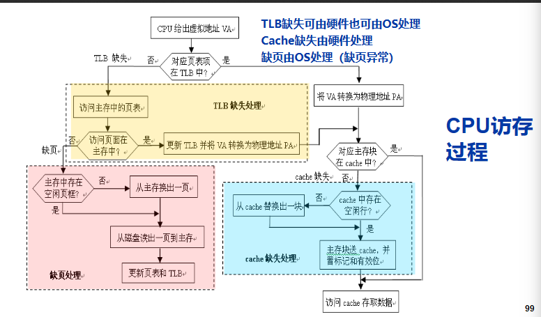
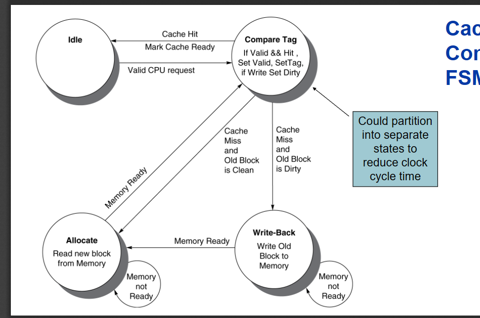

# 计算机系统原理

!!! note "计算机系统原理笔记"
	软工的系统课，使用MIPS架构，在基础部分和计概基本类似，但深入部分讲解了流水线，cache和虚拟内存等概念我自认为期末复习和笔记整理的比较到位，但是最后分数并不理想还被卡绩了QAQ。林老师的出题风格和楼sir大相径庭，因此在期末复习的时候需要先确认那位老师出卷，如果林老师出题请务必细看作业题和PPT，楼老师出卷请参照前人经验。

作业40 大程20 期末40（手写A4

第六版教材

## chapter1 computer abstraction and technology, introduction and CPU analysis

IO including

* user interface devices
* storage part
* network part

CPU including

* data path
* control
* cache memory (usually use the small fast SRAM

defining the CPU performance

* response time : how long it takes to do a task
* throughput : total work done per unit time

### **measuring execution time **

> define the **performance = 1/Execution time**

* example: x is n time faster than Y  
  performance ex / performance ey = n = execution time y / execution time x

**Elapsed time：** total response time, including processing, IO, os, idle time. It determines the system performance

**CPU time: ** it is the part of elapse time. It is the processing time.

To calculate the cpu time

* **cpu clock** we know that the operation of hardware is governed by a constant-rate clock.  
  **clock period ** is the duration of a clock cycle. like250ps=0.25ns=250x10^-12s.  
  **clock frequency ** is the number of cycles per second. like 4.0GHz=4000MHz
* **cpu time ** = cpu clock cycles x clock cycle time = cpu clock cycles / clock rate

**instruction count and CPI**

**instruction count : ** is the number of instruction, judged by program ISA and compiler

**CPI : ** is the average cycles per instruction, judged by the instruction type and the cpu hardware

* clock cycles = instruction count * CPI
* cpu time = instruction count * CPI * clock cycle time(clock period)

**calculate the CPI**

CPI = clock cycles / instruction count(IC) PPT 48

好的并发和流水线，使得CPI可能可以小于1

**power Trend 能耗**

**multiprocessors**

**SPEC**: a way to test CPU  
can test the number of instructions and power using.

perfomance means the number of instruction the CPU excuting each second.

A good standard to judge CPU is to find how many instructions can be done in each watt(瓦特)单位能耗的执行数

**Amdahl Law**

T_improved = T_affected/improve factor + T_unaffected.  
A way to calcuate what the actual improve is, it will divide the affected part and unaffected part.

**MIPS**

MIPS: million of instructions per second  
MIPS=instruction count/(excution time*10^6)

## chapter2 MIPS instruction

CPU will decide and provide a interface.  
Different computer have different instruction set.

In this book, we will use MIPS version of CPU to learning.

32-bit data called a "word"

### register

It also a way to judge CPU, but it overlook the CPI, so it isn't so accurate.

1. v0 to v1 are used as the return of function.
2. a0 to a3 are used as the parameters of function.
3. t0 to t7 are temporary variables, we should make sure each part of program don't need to protect the temporpary variables  
    can use it directly
4. s0 to s7 are variable should be saved?
5. k0 k1 are for operation system

一条指令占四个字节，指令跳转会自动乘以4，但是内存分配需要你自己乘4

In MIPS, there are 32 registers, which has 32bits. There is a table to show the usage of each register.  
The data in register can be used in the fastest way. We can access to register in one clock time.

Because we have 32 registers, so we use 5bits to name these registers.

​​ 

The s0 to s7, should be saved, and the t0 to t7 are usually temporaries.

gp是全局指针，指向静态数据static data

Computer will use the registers for variables as much as possible, which is called register optimization.

### **instruction set**

the function of instruction can be mainly divided into

* calculate
* data transfer like lw sw
* logical calculate
* branch
* jump

In MIPS, through the format of machine code, we can divide the instruction set into

* R type instruction: opcode + rs + rt + rd + shamt + func  (like rd = rs + rt
* I type instruction : opcode + rs + rt + immediate (rt = rs + imme
* J type instruction : opcode + address

   For example, `f=(g+h)-(i+j)`​we turned it to MIPS code `add t0,g,h add t1,i,j   sub f,t0,t1`​

   In MIPS, we need to write the one instruction in one line only.  
   And if we want to write our annotation we use the "#".

循环语句跳转参看PPT

Here are several types of instruction in the MIPS

#### **R-type instruction**

1. the first 6-bit is the operation code, they are all 000000 in R-type instruction
2. the next 15-bit to express three register. The first two registers are operating register and the third one is target.
3. the next 5-bit is used to express the shamt in sll, srl instruction
4. the last 6-bit is the func code, which differ these R-type, for example the func code for add is 32 or 10000.

The shift operation refer to PPT 57

shift right is fill the begin with 0, it is used for unsigned nunber

sll t1,s3,2   // s3乘以4放到t1  一般是在数组的时候，下标乘以单位元素所占字节

and or not are all r-type

nor t0,t1,zero 对t1按位取反

JR（根据寄存器的地址进行跳转）是r型指令

#### **I-type instruction**

立即数为16位，在逻辑运算的时候将其高位按0扩展，在做其他加法之类的运算时做符号拓展

immediate is from -2^15 to 2 ^ 15 -1

including calculate with immediate, load and store and conditional branches.

Most of instructions is I-type, the instruction excepts opcode is 000000,00001x, and 0100xx are used for I-type

1. the first 6-bit is operation code
2. the next 5-bit is register
3. the next 5-bit is propose register
4. the next 16-bit is constant or address

**conditional branches**

BEQ(相等跳转) BNE(不相等跳转)

beq rs,rt,l1 若rs等于rt，则进行跳转 PC=PC+4+(l1<<2)  //+4是因为PC已经到下一条指令，指令本身占4个字节，L1<<2也是让其扩大四位  
也就是说L1的内容等于要跳到几条指令（一个指令占四位）但是相对寻址时有范围的，L1是一个label，也就是一个助记符内部是有符号数

bne与beq同理，就只有条件不同

**组合指令（伪指令 pseudo instruction**

```cpp
slt sltu slti sltiu
```

SLT(根据比较的结果，设定目标寄存器的值)

SLT rd,r1,r2 ====== if(r1<r2) rd=1 else rd=0

slti rd,rs,const======if(rs<const) rd=1 else rd=0  
然后用bne beq将rd与zero比较 来进行跳转.

MIPS 中实际上只用bne beq 但是通过指令的集合可以实现blt等比较跳转指令

slti 寄存器数和立即数的比较

sltui 寄存器数和立即数比较 无符号版本

汇编中可以转换成 Blt s1,s2,label 伪指令  
Slt t0,s1,s2  
Bne t0,zero,label

slt为r指令，slti为i指令

**其他的伪指令**

move s2,s1  实际上是 add s2,s1,zero

Beqz s1,L1 实际上是 Beq r1,zero,L1

blt t0,t1,L 实际上是 slt at,t0,t1  
				bne at,zero,L

伪指令可能在我们注意不到的时候使用了寄存器，而CPU给伪指令提供了寄存器$at  
我们一般写程序时候不用它，专门给编译器使用

**32-bit constant**

如何创建一个32位的数

```cpp
lui s0,61                //上16位
ori s0,s0,2304           //下16位
```

#### **J-type instruction**

6位操作码加26位立即数

包括无条件跳转

unconditional branch

J L1

JAL（调用子程序）

Jal L1 ($ra=PC+4(用于存储返回的地址),go to L1)

lui rt,constant   把立即数放到rt的高位，其他位全部为0

J Label实际的操作是把PC的前4位拿出来和26位立即数（扩大四倍）拼成32位 PC  
PC = ((PC+4) & 0xF000_0000) | (label << 2)

### **procedure calling**

to make a procedure calling

1. place the parameters in registers 有专门的的寄存器，但数量有限a0-a3
2. transfer the control to procedure "jal"
3. acquire storage for procedure 到了子程序，需要为其申请栈空间
4. perform operation in procefure
5. place the result in register for caller 也有专门两个寄存器v0 v1
6. return the place of call (register $ra)

JAL 指令，用的是立即数，需要在26位，会先把下一条指令放在ra，用来作为返回的地址，在子程序里可能会重写ra，因此需要把它存起来  
甚至有可能我们写的这个程序本身也是子程序，因此我们在使用JAL之前需要将ra存起来

在设计上，子程序的调用者和被调用者本身有各自的义务

**caller  调用者**

要保存a0-a3， ra，t0-t9（意味着你允许调用的子程序使用a0-a3，以及t0-t9

**callee 被调用者**

要保存s0-s7  local variables

**递归程序实例 P97 in PPT**

```cpp
```

#### **memory layout**

​​

stack               子程序会在栈里面占空间，并且需要我们手动释放，上端用fp下端用sp 来界定一个程序的栈空间，因为sp在变化，用fp寻址方便一点

**dynamic linking**

静态链接是编译时

动态链接是执行时

### memory address *

Each address identifies an 8-bit byte

Address must be an multiple of 4

**Endian-ness**

MIPS is Big Endian

For example, here  is a 4-bit memory from 100 to 104 to express an integer.  
In Big Endian, the larger in memory is the lower bit in the integer.

|100|101|102|103||
|1|0|1|0||
| -----| -----| -----| -----| -----------------------------|

so the integer is "1010", which is "12"

**memory operand**

For example

```cpp
A[12] = h + A[8];
///////////////////
lw t0, 32(s3)
add t0,s2,t0
sw t0, 48(s3)
```

**J label**

we have 26-bit immediate and it will upper 2 bit

target address = PC(31 to 28) + label + 00

**jr r1**

we have a register, and we use its content as the address

### the representation of number

**unsigned binary integer**

We use the 32-bit binary integer to express integer

We usual use "0x 23" to express "23" in hexadecimal 16进制

for float number in binary we can miss the 0s at the begin and the end(after the decimal point),  
And we should learn the conversion of numbers, in which decimal to binary is important.

Finite decimal number can be infinite binary number. But we can't express the infinite number in computer.

tips.

当较大的十进制数转为二进制时，有必要进行拆分 比如1230.25中拆出1024等数字，方便计算

**complement number**

补码的计算（p36 in PPT）

The key of complement number is modular.

计算机中的运算器是模运算系统，最高位进位将被忽略；

**原码和补码**

原码是指第一位表示符号，后面几位表示数的绝对值。补码对原码进行的改变，更加利于计算  
补码可以实现加减的统一，减掉一个数，等于加上这个数的负数，都用补码就可以直接计算  
-2^n-1^ to +2^n-1^-1  10000...000 to 011111....11111

计算机不用补码表示小数，小数会去采用浮点

不是所有的最高位进位都代表溢出，比如-1+（-2）也会进位，但不代表溢出

**移码**

给每个数值加上一个偏置常数，移码在浮点数中用到了，每个数加上2^n-1^

1.01x2^-1^

二进制的科学计数法

**边界检查的小技巧**

数组的越界，需要0<=x<size，仅需要一条指令

```cpp
Sltu t0,s1,s2               t0=0 if s1>=s2or s1<0
```

进行无符号比较的时候，若s1是小于0的，那么其在无符号数情况下是很大的，会大于size

**large constant and instruction jump**

一共有五种寻址方式

immediate instruction can only provide the 16-bit constant

beq s0,s1, L1 -> bne s0,s1,L2;    j L1

lui instuction

jump can use 26-bit constant and the upper 4-bit use the PC, and all jump instruction will *4 so it has the 32-bit

jr

### byte / halfword operation

In MIPS, there are some instruction to operate the byte and halfword

```cpp
lb  lh
lbu lhu
sb  sh
```

### load a program

p121 in ppt

## 计算机的算术运算

原码，反码，补码，移码

除了反码以外之前都已经介绍过来，然后反码就是整数不变，负数除了符号位以外取反

### 加法器

**全加器**

* 输入为加数，被加数，低位进位(cin)
* 输出为和(F)，进位(cout)

对于一个全加器  生成结果的过程是两个异或操作，延迟为6个门延迟  
			生成进位的过程是一次并行的与门和一个或门，延迟为2个门延迟

**串行进位加法器**

* 假设异或门是3个门延迟

每一个全加器需要等待上一级的进位，因此到第n位会有2*n+1

**先行进位加法器***

先行进位加法器，把然一个加法器接受所有与之有关的数据，串行因为自己只接受两个数和一个进位，所以需要等待进位，但是先行同时接受自身和自身后面的所有数据，所以可以通过递推直接在内部算出结果

产生所有和数的时间为1（进位生成函数）+2（进位传递函数，前一位已经并行）+3（异或门，前3个已经被并行）

**局部先行加法器**

由多个先行进位加法器组合成的多位加法器

例如32位加法器由4个8位先行进位加法器组成

门延迟为3+2+2+5

**n位带标志加法器**

* OF 溢出标志  SF 符号标志  ZF 0标志（全为0） CF 借位标志（cin xor cout）

**减法器**

加一个取反和多路选择器，使得B的补码变成-B的补码

**溢出处理**

MIPS中无符号数一般不判断溢出，有符号数会进行异常处理 P15

‍

### 乘法器

可以用加法器和移位来实现无符号乘法

**最简单的乘法器**

通过64位加法器和左移，迭代32次，和简单的控制单元完成乘法计算

**简单的优化**

将移位和add进行并行，乘数寄存器右移，判断add是否发生 P20

**快速乘法器-流水线方式**

直接使用组合电路进行拼接加法器，形成乘法器，不在需要control unit

**MIPS汇编的乘法**

mips里面有两个寄存器来存储乘法运算的结果，HI表示高位32-bit，LO表示低位32-bit

```cpp
mult rs,rt ;   multu rs,rt;  //只计算，写入HI，LO
mfhi rd 读HI到rd
mflo rd 读LO到rd
mul rd,rs,rt 计算，并且把低32-bit放到rd
```

### 除法器

P27

### 浮点数

+/- 1.xxxxx * 2^yyyy^

float是8位exponent，double是11位exponent

exponent 最小0000 0001 表示1-127    = -126  全为0表示0  
		最大1111 1110 表示254-127 = +127 全为1表示无穷大

在浮点数中 全为0的exponent和全为1的exponent为保留数

浮点数是不精确的，本质上来说还是2^32种不同结果，但是覆盖了更大的范围，也就说明其更加不精确。

**the converting between decimal and fp**

fraction

浮点数运算的顺序影响最后结果，不满足结合律

int 的有效位数为32位  
float的有效位为24位

```c
int x;
x==(int)(float)x;
```

**浮点数的加法**

* 首先需要转换成浮点数进行计算
* 将exponent扩大到相同
* 加法计算
* 转换成1.xxx的形式，计算出新的exponent
* round and renormalize if necessary

fp addition hardware P48

**浮点数的乘法**

指数相加，再加上127或1023

具体数据相乘1.0011*1.1100

规范为一点几，截断最后，舍入

确定符号

**有专门的浮点数寄存器**

要表示double就两个一起用 $f0 /$f1

**浮点数 的 指令**

lwc1 swc1

lwc1 f8, 32($sp)

add.s,  sub.s,  mul.s,  div.s		add.s f0, f1, f6  
add.d,  sub.d,  mul.d,  div.d		mul.d f4, f4, f6

**浮点数的比较**

c.xx.s / c.xx.d

xx can be "eq, neq, lt, le, gt, ge"

下一条指令用bc1t  / bc1f + label

bc1t targetLable

### 乘法和除法

有符号除法，除数和被除数的符号相反时，商为负，非零余数的符号与被除数相同

## chapter4 processor

The CPU performance factor is consists of instruction count and CPI and cycle time

* instruction count is determined by ISA and compiler
* CPI and Cycle time are determined by CPU hardware

register only updates on clock edge when write control input is 1

主要介绍部分指令 lw sw add sub and or slt beq j

### execution

1.PC-> instruction memory->fetch instruction

2.register numbers-> register file 寄存器堆 -> read register

3.depends on instruction class

1. use ALU
2. access memory

4.PC change

线的选择->多路选择器 Mux   每个多进一的地方都要用mux

### control unit

control center 会根据指令的类型进行译码，选择控制信号，控制是否能写能读（寄存器只有写的信号，主存有读和写的信号）和多路选择器 以及ALU operation (ALU 选择哪个功能)

第一张较为完整的data path 在 22

**ALU control**

lw指令 -> add

branch -> subtract

r-type instruction depends on the funct field can see the 23 24 in PPT

**控制信号表**

RegDst 寄存器目标选择

RegWrite 是否写寄存器

ALUSrc 第二个计算数选择

PCSrc  PC是计算结果还是直接加四（Branch

MemRead

MemWrite

MemToReg  写入寄存器的数据是来自内存还是ALU，若为1是来自内存

ALUop ALU的选择

Jump  PC是选择Branch的结果还是jump的结果

### pipelining analogy

单周期的问题在于longest delay determines clock period

pipeline 将一条指令划分成五个阶段

IF读指令 ID译码(同时可以读寄存器) EX执行 MEM访问内存 WB写回寄存器

jump指令在EX阶段计算出要跳转的PC的值

**pipeline performance**

speedup=原时间/优化后的时间

流水线的开始和结尾存在空置时间，因此无法做到完全的优化为speedup=阶段数

理论上speedup 是5，但因为指令与指令之间执行的时间不同（尤其是memory access是在缓存还是内存，硬盘

对于单周期而言，时钟周期设计为所有指令中执行时间最长的一条  
流水线中 每个阶段的时间都要参照最长的阶段时间设置，时钟周期是指令阶段中耗时最长阶段的时间

理想化条件下  time between instructions = time of nopipeline / number of stages

speedup due to increased throughput

缓存分为指令cache和数据cache，在MIPS指令中最容易使得流水线空转的是内存访问指令

**hazards**

structure hazards, data hazarads, control hazards

For structure hazards, load and store can not pipeline ??

data hazards 这一步要用的数据需要等待前几步的结果

可以选择bubble来空转，但更好的做法是用forward

​​

但如果需要的数据来自于前一条的mem阶段，则需要bubble一次在forward

​​

branch hazards

需要等待branch的结果去获得指令

ID阶段已经计算了branch指令的值！

pipeline register, it needs registers between stages to hold the information produced in previcous cycle

the control line group不同阶段的信号分配

EX阶段 regeDst ALUOp ALUSrc， Memory access阶段 branch memread memwrite,

write back 阶段 memToreg RegWrite

如何去detect the need to forward

P75 **impoortant!!!!**

stalls reduce perfomance. Compiler can arrange the code to avoid hazards and stalls

**branch delay** : 由branch hazard带来的延迟

解决方法

1. compute the target address early
2. evaluate the branch decision(harder

One solution, we can design a unit in ID stage to judge whether equal. But if there is data hazards for two number to compare, we still need to stall.

有forward帮助的情况下

当前仅当正好beq的操作数为前面那条计算指令的结果时，需要一个stall cycle  
若前一条指令为lw指令，则需要两个stall cycle

**dynamic branch prediction：** in deeper and superscalar pipelines, branch penalty is more significant.

* 延迟分支：把前面与分支无关的指令放到分支指令后面执行？
* branch prediction buffer用来存储相关数据，作为预测依据（branch history table
* indexed by recent branch instruction address
* store the result
* to execute a branch

  * check the table, expect the same outcome
  * start fetching
  * if wrong, flush pipeline and flip prediction

example:

1-bit predictor: follow the last result.

* inner loop branch mispredicted twice, in the last iteration and 下一次循环的the first iteration

2-bit predictor: only change the prediction on two successive mispredictions

​​

**branch target buffer：** 用来记录以前曾经跳转过的目标地址

* cache of target addresses
* indexed by PC when instruction fetched

### logic design

one wire per bit

总线连接和分散连接

数据通路是操作部件和存储部件以总线或者分散形式连接起来的存储，处理，传送的路径

**combinational elements**

一系列组合元件

**sequential elements**

clock signal to determine when to update the stored value

update when CLK changes from 0 to 1

前后有保持时间和建立时间

when the write signal is 1, it will update

cycle time = latch prop + longest delay path + setup + clock skew

**data path**

‍

### pipelining analogy

### hazards

Hazards can be divided into structure hazards, data hazard and control hazard.

#### structural hazard

pipelined datapath require separate instruction/data memories.  让取指令和访问内存可以并行

would cause a pipeline "bubble" 当流水线出现问题时

#### data hazard

```cpp
add s0,t0,t1
sub t2,s0,t3
```

对于上述指令而言，sub的s0需要等待上一条指令的结果，因此要在流水线中加bubble，直到下一条指令的读寄存器阶段要在上一条指令的写入寄存器阶段之前，但是由于WB阶段的写入寄存器在流水线阶段的前半部分，ID的读寄存器在流水线阶段的后半部分，因此可以放在一块

**forward （bypassing)**

对于上述的数据冒险程序，我们可以通过forward解决，通过把EX执行阶段完之后的结果直接交给流水线的下一条指令

但forward不能解决所有data hazard 比如有些指令用到的数据，得等到内存访问阶段之后才存在

‍

‍

### pipeline control

流水线寄存器不需要给出写信号，写入是固定的

#### detecting the need to forward

检查

ID/EX.registerRs=EX/MEM.registerRd   //IDEX 阶段要用的寄存器与EXMEM阶段要写的寄存器是否一样

ID/EX.registerRt=EX/MEM.registerRd

MEM/EB.registerRd=ID/EX.registerRs  //IDEX 阶段要用的寄存器是否与MEMWB阶段要写的寄存器一样

MEM/EB.registerRd=ID/EX.registerRt

只有写寄存器的指令才会触发forward, 并且 rd 需要合法，例如要写入$zero 实际到最后是写不进去的，但是可能当下一条指令也用$zero 时，会触发旁路 这些也是电路设计考虑的事情

同时触发上述两种forward时，选择最新的一个（EX/MEM优先

We have a forwarding unit to control it

对于load-use指令产生的data hazard，有的时候forward是不能解决的，因为时间来不及

**如何去停顿流水线**

* control ID/EX register to 0. EX, MEM, WB do nop
* prevent upate of PC and IF/ID register

除了通过硬件的控制信号来处理数据冒险，也可以通过软件编译的方式处理

### exception and interruption

unexpected event requires change in flow of control

* Exception like undefined opcode, overflow, syscall.
* Interruption like IO

In MIPS, exceptions managed by a System control coprocessor(CP0)

* Save the PC in exception program counter(EPC
* Save the indication of the problem in the cause register
* transfer to relevant handler  8000 0180
* judge whether continue

Alternate vectored interrpt(将不同的错误映射到不同的地址)

example

* undefined opcode 8000 0000
* overflow                 8000 0180
* and so on

exception is one kind of control hazard

**handler action:**

* read cause and transfer to relevant handler
* determine action required
* 判断是否restartable 如果可以，就用EPC回到程序
* 否则就终止程序，或者用EPC报错

发生异常后，先完成前面的那些指令，清空该指令的五个阶段的后面几个（包括流水线中的其他指令

Flush信号，清空当时CPU所有阶段，准备读入异常处理程序，例如EX阶段发生异常，该指令和后面两个指令

**multiple exception**

先处理第一个，看能否继续，若能继续则再进行处理

**imprecise exception**

### instruction-level parallelism

static scheduling--------编译器

dynamic scheduling-----硬件

如何提高流水线性能

* deeper pipeline
* multiple issue
  CPI and IPC(每个时钟周期多少个指令)  
  static multiple issue : 编译器

speculation 预测

two-issue 一次执行两条指令（一条是ALU/branch 一条是内存，并且不能有相关性）

**loop unrolling**

编译器展开循环，例如要做32次循环，现在一次做4个循环，4个循环中包含更多的指令，我们就能实现更多的并行

循环展开的时候，我们还会进行register rename 对于那些假相关的指令，分配到其他寄存器里面

**dynamic multiple issue **

一次多发送几条指令

## 存储器

**principle of locality:**

* temporal locality 最近访问过的数据可能很快要被再次访问
* spatial locality     被访问过的数据的周边的数据可能很快将被访问

memory hierarchy levels

* hit : we can find the memory staisfied in upper level
* miss: we can't find the memory staisfied, we need to do the block copies.  
  and the time will be taken( miss penalty

* SRAM 静态 0.5ns-2.5ns
* DRAM 动态 主存  50ns-70ns
* Magnetic disk  磁盘  5ms-20ms
* ideal memory   SRAM的访问速度，disk的容量和价格

### 各种storage介质的特点

**DRAM main memory**

* data stored as a charge in a capacitor
* must be periodically be refreshed

main memory 的主要指标

* 容量
* 存取时间
* 存储周期 连续两次访存所需的最小时间间隔，会大于存取时间是因为存取一次后电路有一段稳定恢复时间
* **row buffer** 允许several words be read and refreshed in parallel
* **synchronous DRAM ** 允许连续访问，不必发送每个地址 可以一次获取一块内存can improve bandwidth
* DRAM banking  允许同时访问多个内存，can improve bandwith

**flash storage**

* 快于disk，容量介于内存和disk之间
* 分为NOR flash 和 NAND flash
* 特点是flash bits wear out after 100 000 of accesses, 所以其在长时间使用后容量会缩小
* nonvolatile  不易失

**disk storage**

* nonvolatile 不易失
* rotating magentic storage
* 磁盘表面被分成很多同心圆，每个同心圆都是一个track，每个磁道都被分成若干个扇区sector 现在一般是4096bits一个扇区

cylinder : 

**access to sector involves**

queuing delay  (电梯，按照访问的磁道进行排序，都是顺的先给出访问，就像电梯先解决沿途所有向上的需求

#### example

512B sector, 15000rpm(一分钟多少转) 4ms average seek time(平均寻道时间，从最外圈到最内圈的时间/2）100MB/s的transfer rate  0.2ms的controller overhead. Assume the idle disk ()

ans:= 4ms + 1/2/(15000/60) + 512 / 100 + 0.2 = 6.2ms

ans:= 平均寻道时间 + 平均找到sector的时间（转半圈的时间）+ 传输时间(传输容量 / 传输效率) + controller delay

#### DMA

磁盘控制器连接在IO总线上，IO总线与其他总线之间用桥接器连接

采用dma的方式（直接存储器存取）进行数据的输入输出，有一个专门的控制器来控制，有专门DMA接口来控制外设和主存之间直接数据交换

**disk performance issues P19**

### cache memory

cache hierarchy closest to CPU，基本一个时钟周期就够了，寄存器的话半个就够了

容量大概在几个k到几个m之间，划分为几个block，每个block大概是几个word的容量

每一次读内存，都会把它及其周边内容放到cache里

* How can I check whether it is in cache

* Where we can find it

#### **direct map cache**

用实际地址的低地址去编号cache，比如0001的内存放到01的cache里，1001也放在01的cache里

01这个index是根据缓存的位置产生的，并不存在实际的数据存储

* block address modulo blocks in cache

tags and valid bits

我们用tags，来存储实际地址的高位，来判断这个对应cache是否就是我们所需地址的数据

valid bits 用来说明这个cache里是否确实有数据，如果没有，或者不是我们需要的数据，就替换

缓存放4k的内存，但是实际占的空间会更多一点

* example

the cache size is 2 ^ n blocks, n bits are used for the index.

the block size is 2 ^ m words（mips中一个word是32bits）, m bits are used for word in block, and two bits are used for the byte part of the address.

tag 标记字段的大小为32-n-m-2  一般m是0  末尾端是00，所以那两位不用加  
如果一个block占多个数据，例如2 ^ m 个 我们可以少记录m位

offset 为 m+2 bit

index 为 n bits

直接映射cache的总位数是 2^n^​ *(32**2^m^ + 32-m-n-2 +1)

* example larger block size

64blocks and 16bytes a block, the address is 1200(bytes) 1200/16=75 75modulo64=11

tag is 22bits 32 - 6 -2 -2

larger block can reduce the misssing rate, but will cause more competition(在缓存大小一定的情况下，block大说明block数量少，容易被后来者删掉，反而导致提高了missing rate，并且每次更新缓存的损耗会提高

#### **cache miss**

* install the pipeline
* fetch the block from the next level of hierarchy
* instruction cache missing, restart the instruction fetch
* data cache missing, complete the data access

cache miss 的penalty  P59

#### cache write

**wirte through**

为了保存cache和内存的一致性，写回的时候一种方法就是同时写缓存和内存，但是效率低，因为内存的写入比较慢

解决方法是有一个write buffer，先把要写的数据存在那里，CPU继续执行，buffer自己去写入内存。只有当buffer满了之后就停顿流水线来完成写入。

**write back**

暂时只写缓存，当这块被写过的数据被替换的时候，更新主存。因此缓存还需要一个dirty bit位，来判断这个数据是否被写过

同样的在更新内存的时候也需要等待，因为要与主存交流，这时我们也可以采用上述的write buffer的做法

**write allocation**

上述两种情况是指写的东西在缓存中的情况，但是写的东西不一定存在于缓存中，这就衍生了两种做法，是否要把要写的东西放到缓存中。

write allocation 就是暂时不把内容写入内存，先写入缓存，在flush的方式写入内存

对于write through的话两种做法都有，write back的话一般都会进行write allocate

#### cache performance

**measuring cache perfromance**

P40

memory stall cycles = memory accesses / programs x miss rate x miss penalty(缺失代价)

平均内存访问次数 x 缺失率 x 缺失代价

average memroy access time = hit time + missing rate * miss penalty

#### associative cache

block的大小的考量，如果一个block对应一个data，就很容易被相同hash的顶替掉，如果对应太多，则电路太复杂，标记位数和额外的开销也会更大

有两种模式 fully associative 和 n-way set associative

**fully associative**

* 采用的是不固定的映射方式，对于直接映射来说，某个地址的内存只能固定映射到某块cache中，但是全相连可以让一块内存映射到任意一块cache中，需要替换的时候遍历cache中所有块
* 其核心是这个替换算法
* 提高了命中率，但是降低了时间效率

**n-way set associative**

* 是全相连和直接映射的折中。将内存和cache都分组，组之间采用直接映射，组内采用全相连
* 每组中有2,4,8,16 记作 2-way set associative ...

**replace policy**

直接映射，没有选择的余地

一个block对应多个data的时候，需要确定替换时哪个会被替换掉

一般会用LRU least-recently used

比如对于两路的，每次访问缓存的时候设置一个bit，0表示第0个被访问，1表示第1个被访问，每次来替换的时候，替换另一个，比如为0就替换

**example: size of tag of set associativity**

4096 blocks, 4-word block size, 32-bit address

* 直接映射  （32-2-2-12）* 4096
* 2-way set associativity （32-2-2-11) x 2 x 2048
* 4-way set associativity   (32-2-2-10) x 4 x 1024
* 全相连     (32-2-2)*4096

**multilevel caches**

多级的cache一般会越来越大

### dependability

P67

ECC hamming code 原理分析，hamming code需要额外的bit，这些bit要可以表示没问题和在x位上有问题

一共有d位信息，p位额外bit

2^p > p + d +1

这样算出来的p，如果需要DED，还需要加一

我们需要把p位bit和d位信息重新排列。

​​

多加的一位有D1-D15的奇偶校验构成

### virtual machine

**VMM virtual machine monitor**

* map the virtual resources to physical resource
* guest code runs on native machine in usr mode
* gutst OS may be different from host OS
* VMM handles real IO devices

### virtual memory

the main idea of the VM is use the main memory as a cache for disk.

* programs share main memory
* CPU and OS translate virtual addresses to physical addresses

**page fault**

意味着需要访问disk 会花费数百万clock cycles 由OS code处理

* 会使用LRU(least recently used) 减少page fault rate

**page table**

* store placement information, including array of page table entries  
  page table register in CPU points to page table
* if page is present in memory, page translation entry(PTE) stores the physical page number
* if page is not present, PTE can refer to location in swap space on disk

page table放在内存里

size of page table

* 32-bit virtual address, 4kb pages, 4 bytes per page table entry  
  4kb = 2 ^ 12 b  
  2 ^ (32 - 12) entries * 4 bytes

**we need to reduce the memory for page table**

* use the multiple levels of page table
* use the inverted page table, apply a hashing function to the virtual address

PTE: page translation entry

**fast translation using a TLB:**

* 为页表开一个cache，we called translation look-aside buffer(TLB
* 常见状态 16-512 PTEs，0.5-1 cycle for hit, 10-100 cycles for miss, 0.01% - 1% miss rate
* if page is in memory, load the PTE from memory and retry, could be handled in hardware / software
* if page is not in memory, (page fault), OS handles fetch the page and updating the page table, and then restart
* TLB miss 会造成一个exception，停顿该指令，handler copies PTE from memory to TLB，restart the instruction

handler 的做法

* using faulting virtual address to find PTE
* locate page on disk
* choose page to replace(if dirty, write to disk first)
* read page into memory and update the page table
* make process runnable

常规访问内存  virtual address - > TLB - > physical address - > cache

TLB 和 cache用硬件处理 缺页用OS处理

​​

对于TLB，page table，cache

* hit hit hit
* hit hit miss, miss hit hit 访存一次
* miss hit miss 访存至少两次
* miss miss miss 访问磁盘一次，访存至少两次

不可能TLBhit的情况下miss page table. 也不可能在page table miss的情况下hit cache

virtual memory 都是采用write back的方式，所以有dirty bit，还有valid，Ref(最近是否访问过)

**memory protection:**

* different tasks can share parts of their virtual address spaces  
  我可能可以允许其他进程，读写我的page

**hardware support:**

* privileged supervisor mode (kernel mode
* privileged instruction
* page table and other state information only accessible in kernel mode
* syscall

### program performance

**thrashing:**

a program continuously swaps page between memory and disk, called thrashing (造成程序很慢，一般通过增加内存可以缓解)

**working set:**

this set of popular pages is called working set 那些程序中常用的page

**TLB missing：**

* TLB 一般掌握32-64个page entries
* 一个page entry一般是4kb
* MIPS 也支持16kb 64kb ... 256mb  把page扩大，可以减少TLB missing防止thrashing

### memory hierarchy

based on the notion of caching

* block placement
* find the block
* replacement on a miss
* write policy

**block placement**

* direct mapped 直接映射
* n-way set associative
* fully associative 全相连（内存页用的是全相连，缺失率最低

**find the block**

**replacement **

* LRU least recently used (最近没用过的，但是并不是严格按照
* random

对于virtual memory 用Refer位来实现LRU

**write policy**

* write through  同时写cache和内存（upper and lower level)，会有一个buffer
* write back        只写upper level，update when block is replaced

virtual memory 只用write back

**source of misses**

* compulsory misses( cold start miss)  第一次访问这个数据的时候，很有可能会miss      (增加block的大小，可以让临近的数据进入
* capacity misses 因为cache空间有限导致的，a replaced block is later accessed again  （增加cache大小
* conflict misses   因为不是全相连导致的，两个内存都映射到同一个cache，导致虽然cache有空位，但还是会miss  （增加associativity

cache大小和associativity增加会降低速度，block的增大，会提高miss penalty，block是cache读写的基本单元

一级cache主要提高访问速度，二级cache主要提高命中率

**cache control**

P114

write allocate  要写的东西cache中没有，是否要在cache中分配

16kb = 16*1024bytes

valid bit and dirty bit(write back 的时候会用)

blocking cache  缺失的时候是否等待流水线

有限状态机

组合逻辑没有内部状态

​​

Idle是指空闲

**cache coherence problem**

当有多CPU的时候，会变得复杂，一个memory多个cache，可能会存在各个cache中保存不同数据版本，一致性的缺失  
P119

coherence : we should read return most recently written value.

cache coherence protocols:

* snooping protocols  对each cache monitors bus read / write
* directory-based protocols

例如 invalidating snooping protocols, 当一个CPU写的时候，把其他CPUcache中的内容作废

‍

‍

### RAID 冗余磁盘阵列

用冗余的来进行错误检测

**RAID 0**

无冗余，容量和速度要求高的非关键数据存储，有较快的IO相应能力

**RAID 1**

镜像 一对一冗余，数据可靠性高，读只要读其中一个，写同时写两个，数据恢复容易

**RAID 5**

奇偶校验块分布在各个磁盘中，所有磁盘地位等价，提高容错性

## IO

**外设的发展与分类**

* 从交互方式来看，分为人机交互和机器交互
* 从

keyboard, mouse, line printer, laser printer, graphics display

network-LAN, floppy disk, optical disk, magnetic disk

外部设备通过电缆线，传输控制信号，状态信号，数据信号

控制逻辑控制信息控制设备党的操作，并检测设备状态；缓冲器用于保存交换的信息；变换器转换不同的信号

**键盘**

键盘和主机的链接，5芯接口电缆  
键盘输入字符，使用ASCII，128个元素，其中并不都是可打印字符，一般是7位后跟一个奇偶校验  
ASCII 要背吗

* 键盘输入信息: 行扫描法，线反转法
* 一般分为编码键盘（传输ASCII）和非编码键盘（传输位置）

**IO总线，IO控制器和IO设备**

有CPU总线，存储总线，IO总线（disk在IO总线上）

系统总线一般由，数据线（data bus），控制线，地址线(address bus)组成

有些总线中地址线和数据线是合用的，数据/地址复用

**总线的性能指标**

* 总线宽度，数据线条数
* 总线工作频率，时钟频率，一般慢于系统，有的时候一个周期可以传送2次或四次数据，因此可以是时钟周期的2倍或四倍
* 总线传送方式，非突发传送（每一次传送）和突发传送（成块传送）

**IO设备的寻址**

IO端口必须被编号

* 统一编址方式，将主存空间分出一部分地址给IO端口进行编号，映射到主存区域，也叫存储器映射方式，可以用原有的memory访问指令操作
* 独立编址方式，不和主存单元一起编号，单独编号，形成一个单独的IO地址空间，需要专门的IO指令

**IO设备和主机进行数据交换**

* 程序直接控制，一般是指轮询（polling）,IO设备会有一个状态寄存器，OS定期去查询一下（简单但耗时）
* IO interrupt 方式 IO设备发出中断请求给CPU，CPU中断当前程序执行，调出OS的中断处理程序，处理完之后返回当前程序（可以并行）
* DMA（direct memory access）磁盘等高速外存成批直接与主存进行数据交换，需要有专门的DMA控制器，外设准备好数据，DMA发出控制信号，CPU让出总线，直接访问memory(这种方式不需要CPU介入

**处理器中的异常/中断处理机制**

一般来说异常是内部，中断是外部

* 禁止中断，让中断允许（触发器）标志为0（禁止在中断中再发生中断
* 保护断点和程序状态，PC->EPC
* 识别异常事件并转到具体异常处理程序  
  软件识别，设置异常状态寄存器(cause)，记录异常原因，操作系统调用统一的异常处理程序  
  硬件识别（向量中断）

多重中断，中断处理过程中，又有新的中断发生，且优先级更高，应该再终止现在的中断处理服务，去处理新的中断

会有堆栈来存储信息

* 中断响应优先级
* 中断处理优先级

**DMA**

中断不适合高速设备和主机的数据传输

* 高速设备和外存
* 成块数据传输
* DMA的请求优先级比CPU高，如果不处理，高速设备会发生数据丢失
* DMA在寻道旋转操作结束后，用中断告诉CPU，CPU可以执行其他程序，不能使用总线

DMA与CPU

* CPU停止法
* 周期挪用法
* 交替分时访问

## 期末复习

1. sign and magnitude  求符号和大小
2. 指令翻译成二进制，寄存器的对应关系
3. CF 进位 OF 最高位
4. callee 被调用者  caller 调用者
5. routine 例程
6. biased notation 移码表示法
7. 什么是write through  对于不同的处理方法要有名称的记录
8. 不同的存储材料及其特性
9. 流水线的问题
10. 存储器部分的各种cache
11. 汇编代码的书写
12. 二进制的各种码和浮点数的设计
13. 多周期CPU
14. bus的主要缺点  bus 总线 对于单总线而言

     * 优点：结构简单，允许 I/O 设备之间或 I/O 设备与主存之间直接交换信息，I/O设备与主存交换信息时，原则上不影响CPU的工作，只须 CPU分配总线使用权，不需要 CPU 干预信息的交换，CPU工作效率有所提高。
     * 缺点：由于全部系统部件都连接在一组总线上，各部件都要同时占用时，会发生冲突，总线的负载很重，可能使其吞吐量达到饱和甚至不能胜任的程度，所以需要设置总线判优逻辑，按照优先级高低来占用总线，影响整机工作速度。故大多为小型机和微型机采用。
15. decoder 用逻辑门怎么实现  简单的硬件的逻辑门实现
16. overflow 和 carry out是什么
17. 移码的表示   补码的最高位取反
18. 控制信号的具体控制
19. cache SRAM 不需要刷新  
     memory DRAM 需要刷新
20. 16KiB  = 4096 words = 16 x 1024 byte = 4 x 1024 x 4bytes = 4096 word
21. 组相连，一个地址被映射到唯一的组上，这个组上所有的位置都可以使用，每个块有n个位置可放成为n-way组相连  
     组相连往往选择最远被使用的块被顶替  
     以四路组相连为例，其一组里的四个word，每个都需要tag和valid bit
22. page table没有tag，是全相连，一个page对应一个valid bit，一旦valid bit为0，则缺失  
     除了page table 以外，我们会有一个数据结构去记录每一个虚拟page对应的disk address，因为virtual memory 往往大于实际的memory  
     例如虚拟地址为32位 页的大小为4KiB = 2 ^ 12bytes  
     页的项数就是  2 ^ (32-12)  
     页的每项都是  32bits = 4bytes   ?此处有疑问，page的每项应该是可以不到32bit，因为映射的也是page，实际应该是内存地址的宽度减去12  
     总得大小就是 2 ^ 20 * 4 = 4 MiB
23. page table 都是用write back，每个page会有一个dirty bit  如果被写过，就变成dirty page，其与disk的交换都是以整个page为单位的
24. 对于page table 我们访问内存两次，一次获得物理地址，一次获得数据，后一次我们已经有cache进行处理，前一次我们用TLB进行处理
25. cache 最后算出来要 除以8 变成byte
26. 一个byte = 8bit  
     一个word = 4byte 因为byte寻址 所以最后两位为0
27. 不用额外的寄存器交换内容
28. 判断数组越界的标准做法
29. 保护位，舍入位，粘贴位 的英文
30. 所有指令的寻址模式
31. 流水线不考？多发射，动态调度要考
