# 计算机系统概论

!!! note "计算机系统概论学习笔记"
	本篇笔记并不完整，因为我没有选上计概所以是去旁听了这门课，也并不是每次课都去听，多数情况下还是在看书自学和做lab，这篇笔记基本上可以等于计概课本的读书笔记。书名就是这篇笔记的标题，这本书非常推荐阅读，写的非常清晰。

## chapter1 welcome aboard

### why we learn it

abstract 抽象是一种重要的能力，其效果在于隐去细节，可以让我们更轻松的使用和生活  
但是它也有两个缺点，如果不具备了解细节的能力，那么只能期望于底层的事务永不出错，第二点，如果我们并不了解底层实现，那么就很难去很好地使用它提供的接口

### level of transformation


the instruction set architecture ISA  
ISA的功能在于，在描述和执行之间建立映射关系

**what is ISA**

isa是 已经编写的程序与必须执行这些程序工作的底层计算机硬件之间接口的完整规范  
称为指令集体系结构

isa 帮我们制定操作码数量(the number of opcodes)，数据类型(data types)，寻址模式(addressing modes)等等，不同的ISA这些规定也各不相同  
isa是一种规范，而真正的实现需要以来微体系结构，每一种ISA由多种微体系结构实现

## chapter2 bits,data types, and operations

bits are binary digits

### data types

we have many types including  
unsigned integers  
signed integers  
logical variable  
float  
ASCII

**补码(complement number)：**为了方便计算机内的运算，一般用补码表示数值  
补码的计算：正数的补码就是原码，负数除了符号位取反加一

**浮点数：**以32位浮点数为例，第一位为sign表示符号  
后面八位 为exponent表示指数  
最后面23位表示fraction 小数点后实际的数值  
浮点数中无需使用补码  
在exponent中会加上127，再把指数转为二进制

​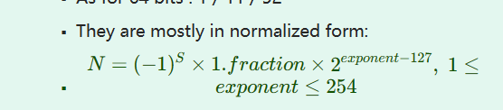​

### operations on Bits

**addition and subtraction**

**SEXT**  
在补码原则下，符号位向高位扩展，是不会影响实际的数值的

**overflow**  
最高位的存在，当进位之后超过了最高位就会直接把那一位直接丢弃掉  
在数学含义上，等同于取模  
比如对于二进制四位数的unsigned integer 相当于对16取模

## chapter3 digital logic structures

微处理器的构成是MOS晶体管  
我们有N型晶体管和P型晶体管  两者工作模式相反  
N型是在0伏电时表现为断路（开路）P型在0伏电时表现为闭路

晶体管的第一步是组成逻辑门  
NOT 由两个晶体管组成 一个P型 一个N型

NOR and OR

​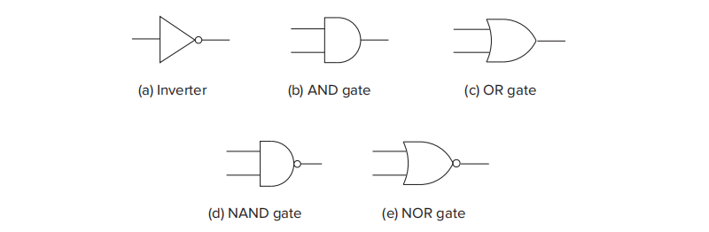​

第二步是组合逻辑电路

逻辑结构可以分为两种，一种包含信息存储，一种不包含信息存储

首先来研究不存储信息的逻辑电路，我们记为组合逻辑电路  
常见有三种，解码器，多路复用器，一位加法器

### 组合逻辑电路

**解码器 decoder**

​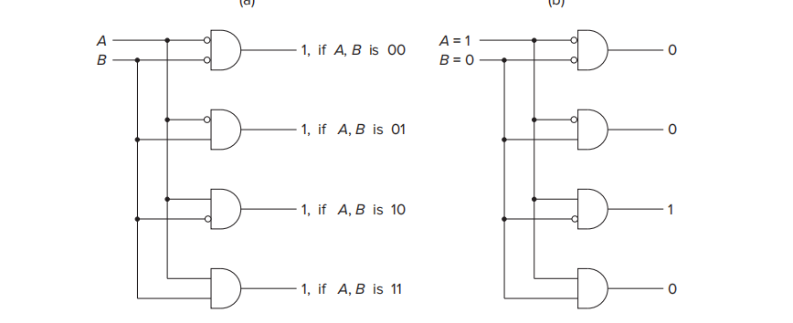​

一个双输入解码器的结构如上  
它会把A B的所有组合进行输出A&B 非A&B A&非B 非A&非B  
显然它会有n个输入和2^n个输出，且这些输出中仅有一个为真

解码器可以用于确定如何解释位模式

**多路复用器 mux**

​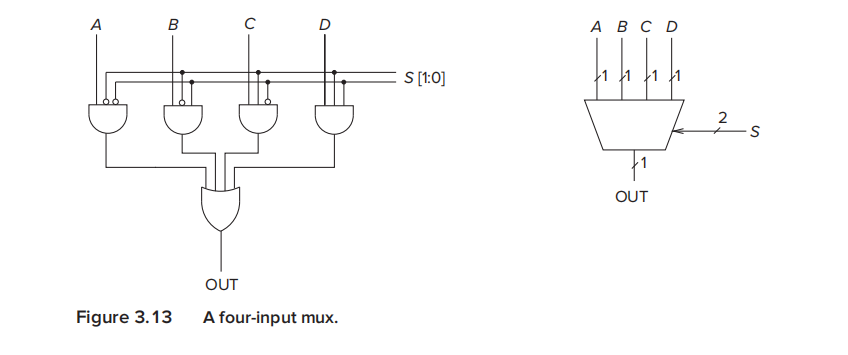​

多路复用器的作用是当有多个输入的时候，用过s这个输入来控制最后到底取哪个输入  
作为输出 我们将s称为选择信号（select signal）  
s的输入个数决定了它可以控制的输入个数

**一位加法器（全加器）Full Adder**

​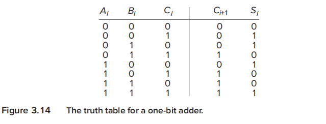​

​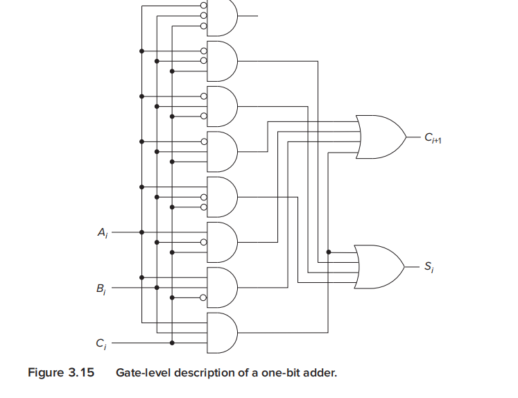​

有两个操作数，A和B， C是来自上一位的进位

‍

### 基本存储元件

**the R-S latch**

一次可以存储一位信息 即0或1，其本身有多种实现方式

​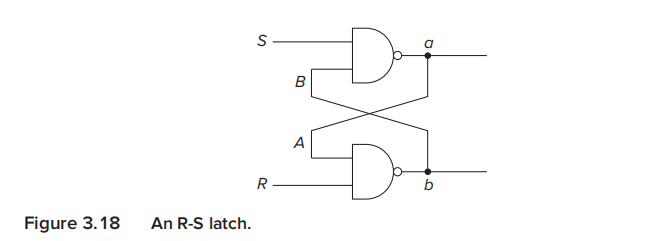​

**the gated D latch**

​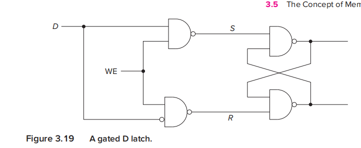​

‍

### concept of memory

我们将唯一可识别的位置的总数，称为内存的地址控制安

比如我们有2GB的内存，即我们的每个地址都是可以根据31位去寻址的，也即我们有2^31的地址空间  
大多数计算机而言，每个地址空间的位置包含一个八字节的存储

addressability 可寻址性  
the number of bits stored in each memory location is the memory's addressability

一个2GB内存的电脑有2^31个位置，每个位置包含8个bits

A 2**2-by-3-Bit Memory

这是一个例子帮我们理解2^2 的内存 和 3 的可寻址性的存储器，来帮我们理解上述概念  
有2x2个地址，其每个地址需要2bits去specify它的地址，然后有3的addressability，所以  
每个地址有3bits的空间

​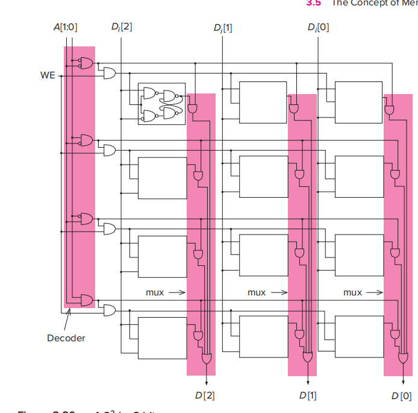​

what's the meaning of "bottom word line is asserted"

### sequential logic circuits

这是一种特殊逻辑电路，组合了前面两种基本的元件  
使其既可以处理信息，又可以存储信息，不止基于当前输入，还基于历史输入

​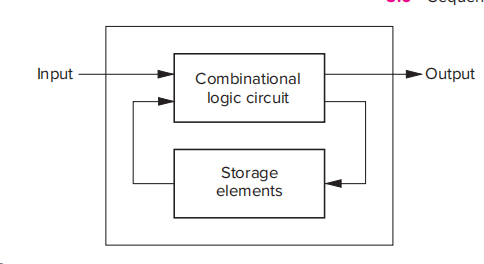​

抽象的思路如上

sequential logic circuits用于实现一种重要的结构，called finite state machines有限状态机

the concept of state状态的概念

用一个例子来说明，假设有一个锁，需要A B C 四个动作顺序完成才能打开  
那么这个锁就有几种状态，  
无动作 做了A动作 做了A B动作 做了A B C动作（锁开）

the set of states 表示了里面所有可能的状态的快照

​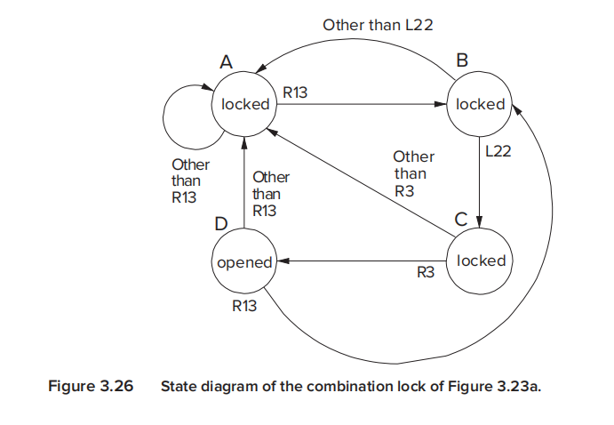​

synchronous and asynchronous 同步和异步

上述讨论的简单例子是异步的  
而计算机是同步的

对于上述例子而言，状态和状态之间的切换不存在固定的时间，也就是说连续的状态切换之间的时间是不固定的，这称为异步

而计算机内部存在一个时钟电路,也即clock circuit，使得其每一次状态切换的时间的确定的

我们也举一个例子进行讲述

## chapter4 the von neumann model

von neumann model consists of five parts: memory,  a processing unit, input, output, a control unit

### introduction to these parts in von model

**memory**

类似于前面所提到的2^2^ by 3bits 的内存模式  
现在的计算机的内存基本都是2^34^ by 8 bits 的模式  
也即我们要找到那个内存需要一个34位的地址 然后每个内存地址上有着一个8bits  
的空间，我们通常又把8bits称为一字节  
寻址能力是8  地址空间是34  

LC-3的2^16^ by 16bits

访问内存的第一步是读写操作  
读： 先将要访问的内存单元的地址数据放到MAR（内存地址寄存器）上，然后发送请求，把该地址的数据存放到MDR（内存数据寄存器）上，进行读取  
写：先将要访问的内存单元的地址数据放到MAR上，再把要写的数据放到MDR上，然后将MDR上的数据写到那块内存里

**processing unit**

处理单元是数据真正被处理的地方  
现代的处理单元已经发展得很复杂了，内部有很多功能单元，有除法，平方等功能  
其中ALU是最基本的功能单元，也是最初的冯诺依曼结构的唯一功能单元  
可以做ADD 和 AND OR等简单的逻辑运算 在LC-3中也有简单的ALU，可以做ADD AND      not

ALU所能处理的量化大小（size of quantity） 通常被称为计算机的字长（word length）量化的基本单元称为字words 比如两个words可以做ADD操作 输出一个word

每一个ISA都有自己的字长，取决于计算机的预期用途

LC-3 里的ALU处理16bits的word

通常在设计中，会在ALU旁边放置一定数量的寄存器，（计算（3+2）*8）用于存放计算过程中的临时变量  
以免引起过多的内存访问，每一寄存器一般能存放一个word  
在LC-3中，在ALU旁边一共有R0到R7这样八个寄存器，每个都是16bits

**input and output**

输入输出设备在计算机中常常被称为peripheral(外围设备), 有时也叫他们计算机的accessories 附属设备，但是它们同样重要

在LC-3中，会有两个基础的输入输出设备，输入设备为键盘keyboard，输出设备为显示屏monitor。

最早的输入设备输出设备为punched cards 打孔纸带

**control unit**

控制单元控制程序执行过程的每一步和指令执行的每一步

控制单元里有几个特殊的寄存器，  
instruction register （指令寄存器）来存储正在被执行的指令  
instruction pointer（程序指针）来存储下一条待处理的指令 有时也把这个寄存器称为program counter，其本身就是应该存储下一条指令的地址

‍

### LC-3 an example von neumann machine

​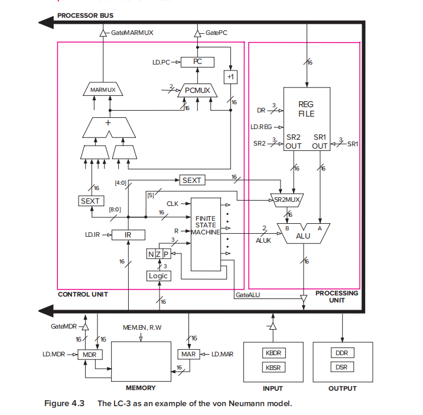​

这张图显示了LC-3的完整数据通路，其中的空白箭头代表的是控制指令control signals  
黑色箭头代表的是数据传递data elements

LC-3**重要部件介绍**

memory 包括了存储单元，MAR和MDR寄存器，MAR是16位的，说明最大可寻址空间是2^16   ​^  
MDR是16位的，说明们每个存储单元存储16位bits

input and output输入输出设备，最简单的键盘输入设备需要两个寄存器，KBDR存储输入的ASCII，KBSR存储键盘敲击的装填；最简单的显示器输出也需要两个寄存器DDR保存要输出的字符的ASCII，DSR存储相关的状态信息

process unit 处理单元，包括了一个ALU和八个寄存器 lc-3的ALU只实现了ADD AND OR

control unit 控制单元 包含了所有与信息处理相关的结构  
其中最重要的一个结构是一个有限状态机，它有几个重要的输入  
CLK 确定了指令周期有多长  
IR 确定了要执行哪些活动  
PC 确定了下一步要执行指令的位置，也即前文提到的程序指针

有限状态机的全部输出指令均为空白指令，也即它输出的都是控制指令，控制着整个计算机的运行 例如ALUK输出确定着ALU的状态是ADD NOT 还是 AND 再例如GateALU，确定着ALU的输出是否输出到处理器总线

### instruction processing

冯诺依曼模型的思想在于数据和程序都以bit流的形式存储在计算机内存中，在控制单元的控制下，依次完成指令的读取和执行

what is instruction

指令instruction is the most basic unit of computer processing.  
指令有两部分组成，一个是opcode 操作码（做什么）；一个是 operand操作数（对谁做）

在LC-3中，其指令长度为16 从左到右编号为bit[15]-bit[0]，其中bit[15]-bit[12]是操作码也就是说一个指令最多有2^4^种操作类型 bit[11]-bit[0]则表示操作数

举例说明，例如

**加法指令ADD**  
操作码从左到右为0001  
需要两个相加数和一个求和结果，其有8个寄存器，ADD指令要求这两个相加数中至少有一个是在寄存器中，结果也必须存放在寄存器中，因为寄存器为8个，所以表示这些寄存器的位数为8位

​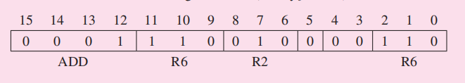

​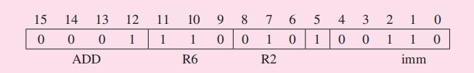​

11位到9位表示的是结果的存储目标 这里指存储在R6这个寄存器上  
8位到6位表示的其中一个源操作数，也即相加数之一，这里指R2

在5位中两个指令展现出不同，  
当5位是0时，表示另一个源操作数也是在寄存器上，寄存器的由第2位到0位确定，在第一条指令上表示R6  
当5位是1时，另一个源操作数会把4位到0位这五位数带符号扩展（sign-extending）为16位数字，在此处的第二条指令中，00110就是表示正整数6

所以两个指令的含义很明确了，将R2和R6的内容相加结果存到R6上  
将R2的内容加上6存储到R6上

**AND instruction**

AND操作和ADD操作非常相似

​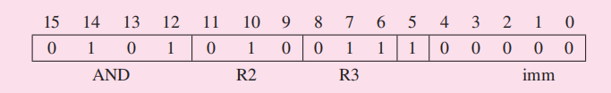​

操作数是R3和一个临时变量immediate value 0 进行逐位的and操作，最终会产生一个16位的0，将其存入R2中，这种操作也是经典的初始化操作，将寄存器R2初始化为16位0

**LD instruction**

LD指令的含义是读取指令，需要两个操作数，其效果为到内存的一个特定的地方，读取其中的内容，将其内容存储到一个寄存器中。  
其中两个操作数表示要从内存中读取到的值和在指令完成之后将包含该值的目标寄存器  

有很多种方式可以去计算内存的位置，每种方式都称为一种寻址模式addressing mode  
用opcode操作数LD去确定内存位置的方式被称为PC+offset 在LC-3中还有其他的寻址模式

​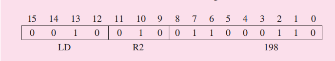​

这是LC-3上的一条LD操作指令

LD的操作码为0010  
11位到9位表示指令执行后要存储被读取的内容的寄存器，这里指R2  
8位到0位用来计算要读取的内存的位置，这里的寻址模式是PC+offset，PC我们知道是  
指令指针，也即下一条要进行的指令的地址，这个完整指令的含义就是对8位到0位看做一个二进制补码，然后对其进行sign-extend 补成16位，在这里十进制表示为198，将198加到指令指针中来找到那个内存的位置，然后将其内容读取存放到R2中

因为是补码，当然可以是负数

**the instruction cycle 指令周期**

所谓指令周期就是一个指令的处理过程，指令的处理是在控制单元的控制下，精准地一步步完成的，其一般分为6个步骤（six phases），大多数计算机如此，有些计算机可能在某些指令下会跳过部分步骤？

这六个步骤为fetch， decode， evaluate address， fetch operand， execute， store result  
我们以LC-3的data  path（数据总线）为例，介绍这些步骤

**FETCH 取指令**

取指令的操作如下  
1.MAR中载入PC指令指针里的内容  
2.访问内存，用MAR里的内容，也即下一条指令里的地址，进行内存访问，将内存里的  
内容读入MDR中  
3.IR寄存器中载入MDR中的内容

此时我们应当已经可以进入下一环节，但是我们希望此时将PC的内容修改为下一条指令的地址，以便一下个指令周期开始的时候可以迅速开始，所以我们还需要fetch操作进行修改，也就是说在MAR载入了PC内容之后，对PC进行修改，这种操作记为PC增量increment the PC

在fetch过程中，操作1和操作3都花费一个clock cycle  
操作2会花费多个clock cycle，这依赖于计算机内存访问的速度

**DECODE 译码**

用于分析和检查指令的类型，并确定对应的微结构操作细节

LC-3采用4-to-16 decoder译码器来进行译码操作，如前文所述，LC-3中操作码的位数为4，也就是说有16种操作，通过译码器，可以使16条操作线中只有一条是可行的  
在这16种output中剩下12位也会被不同地解释

**EVALUATE ADDRESS 地址计算**

如果指令执行时需要地址计算工作，则在这个环节进行。

以LD指令为例，在LD中需要找到内存地址，也就是要把8位到0位的数据sign-extend之后加到PC的现有值上，这个计算在此环节进行。我们也注意到不是所有指令都需要这个环节，比如前文提到的AND和ADD指令，如果只有寄存器和临时的value进行操作，就无需这个环节

**FETCH OPERANDS 取操作数**

这个环节是用来读取需要的操作数的

以LD指令为例，这个环节可以分为两步，用前一环节计算的address去加载MAR，然后读取内存，将操作数（内存里的内容）放在MDR

以ADD指令为例，我们就是要去获取R2和R6里的两个操作数，但现在大多计算机支持在下一步执行的时候同时进行这个操作，以加快计算机运行的速度

**EXECUTE 执行**

执行指令

以ADD为例，就是执行ALU中的addition

**STORE RESULT 存放结果**

将指令执行的结果放到设定好的位置

在ADD操作中就是存到设定好的寄存器中，但是在大多数的计算机，包括LC-3中，这个环节也可以和上一环节一起操作，也就是说，取操作数，执行，存放结果在同一个clock cycle中

在指令周期结束之后，控制单元就马上要开始下一个指令周期的运行，其中PC已经在上一周期被自动修改成指向下一条指令的地址

计算机的指令执行是顺序执行 sequential flow 顺序流会一直进行直到被打破或者程序终止？

### change the sequence of execution

在顺序的执行过程中，包含两种指令类型，  
一种是operate instruction 操作指令 例如ADD  
一种是data movemet instruction 数据搬移指令 例如LC  
有些指令同时是这两种指令类型

但我们还有第三种指令类型，control instruction 控制指令，其会改变程序的执行顺序  
比如我们希望反复执行一组指令或者我们希望改变指令执行的顺序（不是改变指令内部环节的顺序）

它通过在执行环节改变PC的值，覆盖之前取指令环节中PC+1的值，从而达到了控制指令执行顺序的目的

以常见的control instruction BR（conditional branch）条件分支为例  
这个指令可能会改变PC的内容，取决于之前指令（通常是前一条指令）的执行结果

​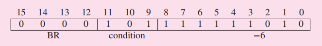​

15位到12位 操作数opcode 0000  
11位到9位 101 是判断的条件 101的含义在于判断最近的result是否是0以外的东西  
8位到0位 是address偏移量，用于在条件判断正确的时候将其改写到PC上（与当前PC相加）

例如前一个操作（假设是在x36C8）是ADD，ADD的结果是0，那么这个BR在excute阶段就不会执行，所以下一个操作将会执行 x36CA，如果ADD的结果不是0，那么BR会执行，那么下一个操作会执行x36C4

ADD（x36C8）BR(x36C9)   BRfail后（x36CA） BRnotfail后（x36C4=x36CA-6）

**control of the instruction cycle**

​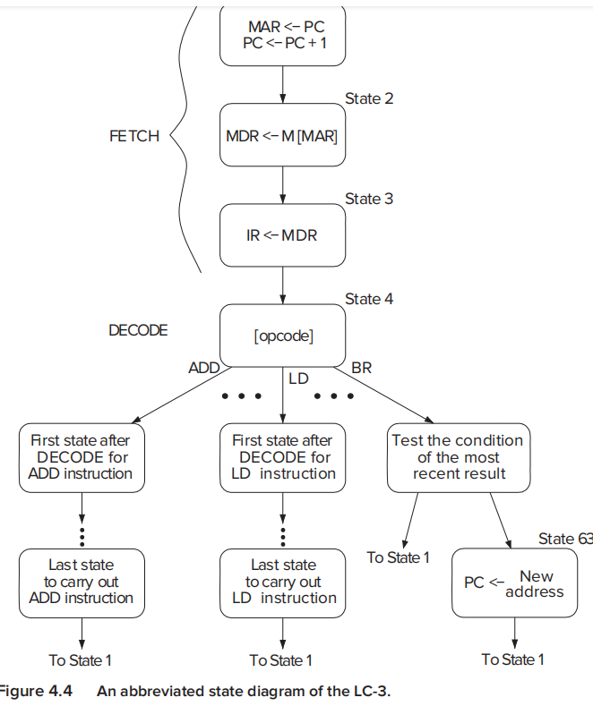​

如图是一个有限状态机在一个指令周期各个节拍的状态

state1 要完成两个操作：  
1.将PC内容加入MAR，有限状态机要控制Gate PC 和 LD.MAR两个信号  
Gate PC将PC和processor bus（处理器总线）相连  
LD.MAR是MAR的可写信号，在时钟周期结束后把数据加载到MAR中  
2. 将PC加一，有限状态机通过PCMUX控制+1功能单元输出，而LD.PC信号控制PC的输入

state后续的状态见书本

**Halting the computer**

似乎计算机的运行时永不停止的，我们日常使用中通过OS关闭一个程序，其实并没有停止计算机的运行，因为对于计算机而言OS和我们刚刚关掉的程序没有区别，都是一系列指令集合，在指令层面上计算机仍然在运行着

当我们真正要停止计算机时，需要对clock进行操作，时钟clock就是机器周期，停止了时钟就是停止了计算机的指令运行

the clock generator is a crystal oscillator时钟信号发生器是一个晶体振荡管  
我们有一个RUN latch RUN锁存器 如果其输出为1，则时钟信号与时钟电路输出一直，若其输出为0，则时钟信号到时钟电路的通路被切断，则时钟电路输出为0

因此要halt the computer，只要清零RUN装填即可，在LC-3上同大多计算机一样，可以通过OS操作系统实现这个功能

### A multiplication algorithm

## chapter 5 the LC-3

LC-3前3000位和最后几位（0xFE00 到 0xFFFF）是不能使用的内存，

PSR寄存器是前几位是看你是用户模式还是系统模式，中间几位表示 运行进程的优先级，最后三位是NZP

JSR适用于实现递归  
RET(return)本质是JMP  
TRAP是切换为系统模式，可以使用前三千位

ACV检查是否在运行内存是否在x3000以前

we will point out more features of ISA of the LC-3  
using these features to write programs in LC-3's own machine language

### ISA: overview概述

ISA定义了软件编程需要的所有必要的和完整的描述，它向程序员提供了所有在使用这台机器的机器语言时需要的信息，同时大多的ISA还指定了希望用高级语言编写程序并且翻译成机器语言的所需要的内容

具体来说，ISA明确了以下内容，**memory organization**, **register set**, and **instruction set**(including the opcodes, data types, and the addressing modes of the instructions in the instuction set)  
主要可以分为内存组织方式，寄存器组，指令集

对LC-3的这些方面进行讲解

**memory organization**  
LC-3的address space is  2^16^ locations and its addressability of 16 bits  
要注意的是这2^16^ 的空间并不是都用于内存（后续会进行说明）  
正常的一个内存单元有16bits，数据处理的基本单位也是16bits，将16bits记为一个word, we called LC-3 is word-addressable

**register**

通常而言从内存里获取数据会相对地满，一般会超过一个clock cycle  
LC-3像大多计算机一样会提供additional temporary storage locations，也就是register  
LC-3中有一组general purpose register(GPR)，需要按独一无二地寻址，在LC-3中就是R0到R7 按三位寻址，每个寄存器存储一个word，也就是16bits  
在LC-3的这八个GPR中一开始有各自的内容（1 3 5 7 -2 -4 -6 -8），就是按照他们的寻址码进行16位的sign-extending

**the** **instruction set**

指令集包含 opcode and its operands 操作码和操作对象  
它同时定义了opcode set, data type, and addressing modes

以ADD指令为例，它有opcode ADD，addressing modes(register mode 有时还会有immediate mode), and one data type(2's complement integer 二进制补码)

**LC-3的opcode**包含15条，一共可以有16条，其中1101这个操作码为预留的，未定义  
本质上这些指令可以分为三类 operate运算 data movement数据搬移 control控制  
data movement包括在内存和寄存器，内存/寄存器和输入输出设备之间转移信息

**LC-3的data type**，用于描述这些ISA是如何理解这些信息的，LC-3只支持二进制补码？

**LC-3的Addressing mode**，是一种找寻operand的方式，无非是从三个地方去找，内存，寄存器，指令本身的immediate  
LC-3会有五种addressing modes  
immediate， register， 三种 memory addressing modes：PC-relative相对寻址，indirect间接寻址，Base+offset基址偏移

**the condition code**

条件码，根据之前指令的执行结果来改变指令执行序列，通过条件码来实现  
LC-3中有3个位寄存器，每个寄存器中仅有1bit，它们分别是N，Z，P

每当那八个GPR通用寄存器发生改变的时候，NZP也随之改变，当写入的是正数时  
NZP被写为001；写入为0时，NZP被写为010；被写入负数的时候，NZP被写为100

根据这三个位寄存器，我们可以进行判断是否进行指令执行序列的改变

### operation instruction 操作指令，第一类指令

LC-3仅支持三种操作指令，ADD，AND，NOT  
我们逐一进行介绍  

**NOT**

not指令是唯一的单操作数unary operation的操作指令

**1001 011 101 111111**

对16位源操作数进行按位取反，取数据和存数据进行的都是寄存器寻址模式

15位到12位 1001为操作码  
11位到9位 011为目标寄存器  
8位到6位 101为源寄存器  
5位到0位 都是1

​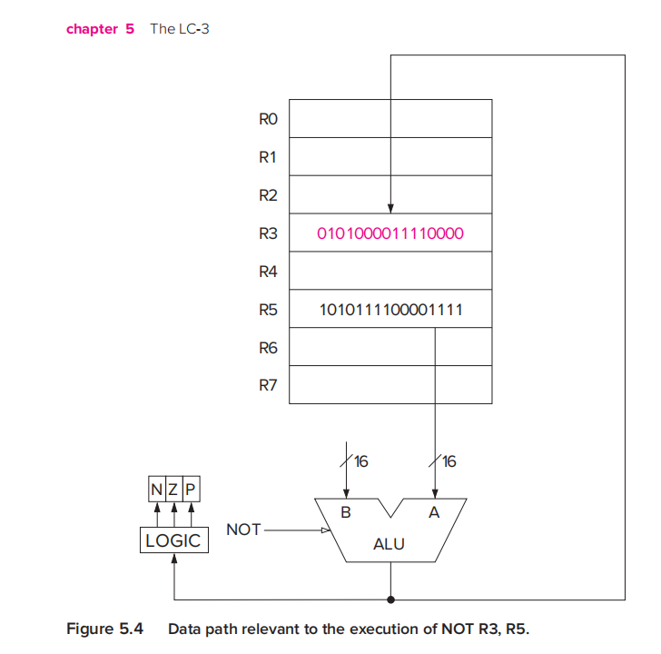​

如图为NOT的data path

**ADD 和 AND**

两者的执行非常相似，因此放在一起说明  
ADD的操作码为0001，AND的操作码为0101

它们有两个操作数，与之前不同的是，它们可以有其中一个操作数采用寄存器寻址或者立即数寻址，另一个操作数和目标必须采用寄存器寻址

立即数寻址时，其立即数存储在IR上，IR是存储指令的

0001 001 100 0 00 101  两个操作数都是寄存器寻址  
0001 001 100 1 00001  一个操作数是寄存器寻址，另一个操作数是立即数寻址  
主要看第五位

​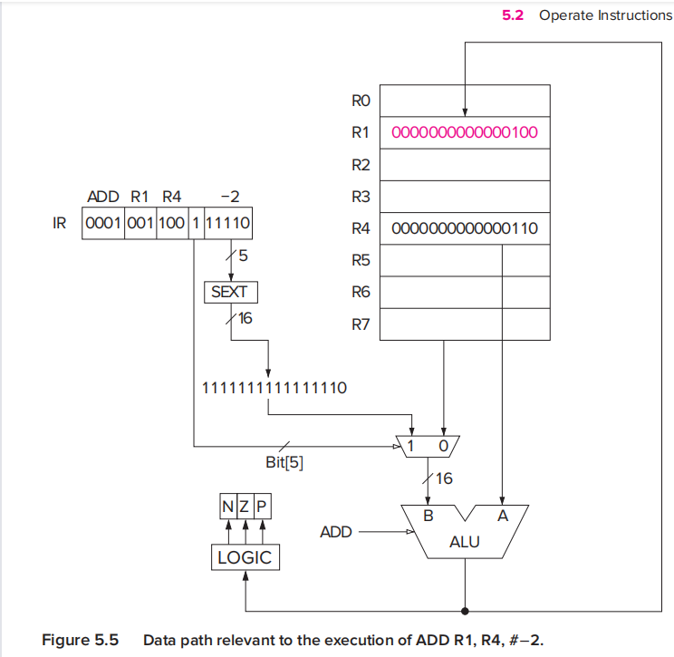​

‍

之前提到操作指令只有三个

但是还有一个指令**LEA，把它视为操作指令还是数据搬移指令都是有争议的**

所以我们在这里讨论它

LEA的操作码是1110 ，它采用的是立即数寻址

**1110 101 111111101**  
其作用是对寄存器做初始化，它无需访问内存，作用是将一个地址读入寄存器中  
15位到12位 1110是操作码  
11位到9位 101是目标寄存器  
8位到0位是一个数据，将其做sign-extending之后，与PC值相加，存入101也就是R5中  

从上述操作中可以看出，这个指令只能把离这个指令很相近的地址值传入寄存器

### data movement instruction

数据搬移指令基本都要访问内存，因此其基本根据三种内存寻址模式

我们将数据从内存转到寄存器的行为称为load，将寄存器转到内存的行为记为store

数据搬移指令需要两个操作数，源和目的，其中一个必须是寄存器，另一个是IO/memory，这里暂时只介绍memory也即内存的问题

基本的指令形式是  
15位到12位是opcode  
11位到9位是寄存器DR或者SR  
8位到0位是地址生成器address generation bits，基于这9位信息和该指令的寻址模式来计算出内存的地址  
也根据这三种寻址模式来介绍这些指令

**PC-relative mode PC相对寻址**

指令LD（0010）和ST（0011）采用的是PC相对寻址，顾名思义，就是将8位到0位的address generation bits与当前的PC值相加，来得出相应的内存地址，要注意此时的PC是已增量的

其中LD做的是读取操作，load的缩写，把内存的数据读到寄存器中  
相对的ST做的是存入的操作，是store的缩写，把寄存器的数据读取到内存

**indirect mode 间接寻址**

指令LDI（1010）和STI（1011）采用的是间接寻址，计算的方式与LD和ST相同都是计算  
PC加上偏移量，但是实际去load和store的东西是PC+offset的那个地址里面的东西

就是把PC相对寻址读取来的东西作为地址进行寻址。最好的效果在于其摆脱了PC寻址里有限的寻址范围

其操作的顺序为，首先产生地址，将PC值和IR中的8位到0位相加，并将结果存储在MAR，读取出来存到MDR上，然后再把MDR上的数据存储到MAR，最后才读取出来存储到MDR上，再转到对应的寄存器上

**Base+offset Mode 基址偏移寻址**

指令LDR（0110）和STR（0111）是采用基址偏移的寻址模式，其指令的组成模式与前两者有所不同

LDR：  
0110 001 010 011101

最后六位是它的地址偏移量，-32到31  
其中11位到9位 001是目标寄存器  
8位到6位 010也是一个寄存器，根据这个寄存器内的数据与偏移量相加形成所需的地址

将其装入MAR，寻址，得出结果加载到MDR，再传入目标寄存器

### control instruction

控制指令可以打破顺序执行，LC-3中有五种操作码来改变这个顺序，分别是条件跳转，无条件跳转，子程序（函数）调用，TRAP，中断返回

这里只介绍无条件跳转，和条件跳转

**条件跳转 BR0000**

指令格式如下  
0000 NZP PC偏移  
11位是N 10位是Z 9位是P   8位到0位是PC的偏移  
NZP中如果哪几位是1，就检查那几个位寄存器，被检查的位寄存器中只要有一个是1，就执行，将PC和PC偏移相加，再覆盖目前的PC

无条件跳转和条件跳转的操作码相同，只不过把11位到9位NZP全写为1，那么必然会跳转

**two methods of loop control**

**JMP 1100**

1100 000 010 000000  
这里只有1100 和 010是有含义的，010代表一个寄存器，就是把010寄存器中的地址存入PC中，从而达到全范围跳转的目的

LAB机器码 写注释；

## chapter 6 programming

in this chapter, we want to do two things: construct a program to solve program and fix this program

### problem solving

structured programming: 目的在于让多人参与同一个复杂问题的解决，需要把复杂问题系统地分解为一个个单元，要求这些小单元可以被独立编程实现和运行，并且独立检验其正确性，we called it sysem decomposition

**the three constructs: sequential, conditional, lterative (顺序，条件，循环)**

要把一个任务分解成多个子任务，这些子任务一般是基于某些结构组合在一起形成一个完整的大任务，这种结构一般有这三种

以LC-3的机器码为例，来说明这三种例子

​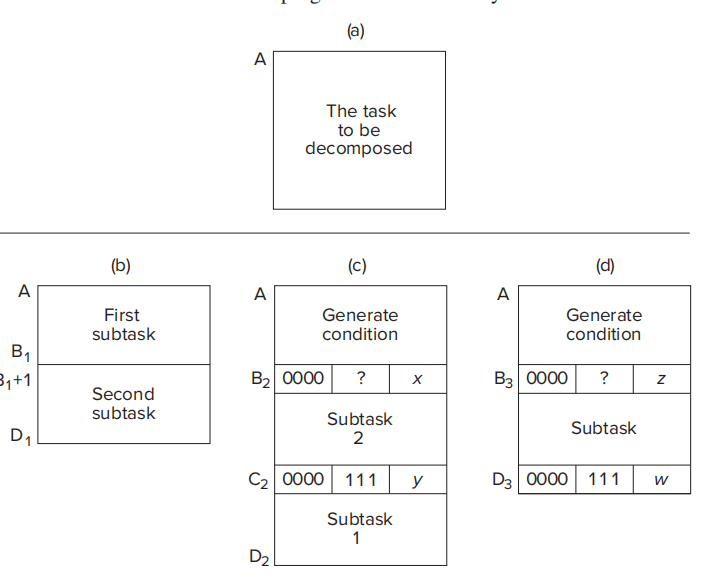​

以上就是三种结构的图像化表示方式

**the character count example**

### debugging

A good way to debug is to trace your program. This consists of keeping track of the sequence of instructions that have been executed and the results produced by each instruction. 一个好的方法就是去追踪你的程序，顺序执行每一步，看每一步的结果

之前我们提到了模块化的编程，模块化的设计也更加利于我们进行调试，对每个模块的输出结果进行检查，有利于我们迅速定位问题所在

**debugging operations**

我们现在已经有了很多成熟的调试工具，在15章中将学习dbx，一个c语言源码级调试器  
我们现在停留在机器语言层面，但是仍然能做一些简单的interactive bebugging operation

LC-3的模拟器能做很多的有利于调试的工作，  
包括对内存单元和寄存器进行赋值，  
执行指令，  
任意时刻终止指令执行，  
在任意执行步骤中查看内存和寄存器的内容

## chapter 7 assembly language

**assembly language programming---moving up a level**

从广义的机器语言来讲可以分为两种，一种是高级的机器语言like C, C++, java and so on. 一种是低级语言，一般来说高级语言不受机器的ISA影响ISA independent，但是低级语言是ISA相关的ISA dependent

高级语言的程序在运行之前，必须被转换成特定的ISA机器语言格式的代码

汇编语言旨在让机器底层语言的编程过程更加友好  
它用mnemonic助记符来替代opcode操作码  
用symbolic name符号名来替代内存地址

### one example of assembly language program

​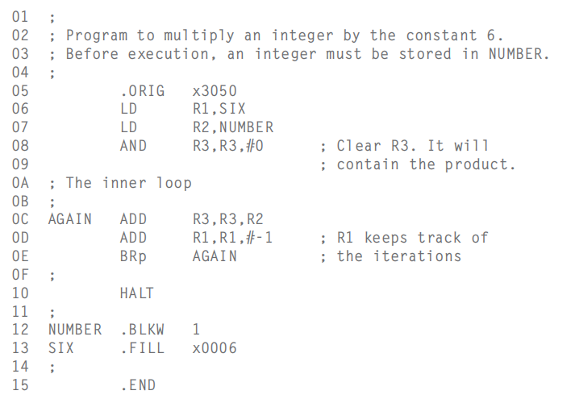​

上图为一个汇编程序，实现的是将存放在NUMBER的整数乘以六  
该汇编程序由三个部分组成，**注释，指令，伪操作**（pseudo-ops）  
汇编语言的翻译程序被称为汇编器assembler，翻译过程称为汇编assembly  
注释和机器码一样用；表示一行为注释

**指令**

与机器指令不同的是，汇编语言的指令格式包含四个部分  
LABEL OPCODE OPERAND ；COMMENTS

我们用R0到R7表示八个通用寄存器

其中**opcode和operand**是必须的  

opcode与LC-3指令中的opcode相对应，用字符串表示，例如ADD表示0001

operand操作数个数取决于各个指令本身，例如  
AGAIN ADD R3,R3,R2;将R2和R3的内容相加存储到R3中  
LD R2,NUMBER ;LD指令需要两个操作数，这里直接用NUMBER来表示内存地址  
AND R3,R3,#0 ; 清空R3

立即数前面需要有一个标识，#表示十进制  
x 表示十六进制  
b 表示二进制

**label标号**，是指向内存单元的一个符号名，它可以在程序中直接引用  
在LC-3汇编语言中，标号可以是包含1到20个字符（大小写字母和数字，但是首字符必须是字母）

使用标号显示访问内存的情况有两种  
一个是该单元的内容是指令，该单元地址是跳转指令的目标  
一个是该单元的内容是load或者store访问的数值

例如AGAIN ADD R2,R2,R3  
.....  
BRp AGAIN; 如果前一条指令结果为0，则跳转到前面的AGAIN

**pseudo-ops伪操作**

用于辅助汇编器把汇编代码转化为机器码的过程

伪操作也称为汇编指令assembler directive  
所有的伪操作前面都有一个 ”. “

LC-3的伪操作有五种 ： .ORIG .FILL .BLKW .STRINGZ .END

.ORIG 表示把该LC-3程序放到什么地方，例如  
.ORIG x3050 就是让这一段程序从x3050开始

.FILL 告诉汇编器占用下一个地址并且填充其初始值，例如  
SIX .FILL x0006 将这个地址填充为6，并且把这块地址命名成SIX

.BLKW 告诉汇编器要开始占用一连串连续的地址空间  
NUMBER .BLKW 1 ; 表示要占用一块1个单位大小的内存，并将其命名为NUMBER  
与FILL不同的是 BLKW适用于数值暂时不确定的情况，比如说用于存储键盘输入值

.STRINGZ 是连续占用并初始化n+1个内存单元  
其使用方式一般针对字符串的处理，每一个单元获得这个字符串中一个字符的ASCII码的0拓展 例如  
       .ORIG x3100  
HELLO .STRINGZ "Hello,world"

从x3100到x310D的空间都会被占用并用每个字符的ASCII的0拓展赋值  
特别注意的是被占用的空间会多一位，最后一位被固定赋值为x0000  
这是方便我们使用哨兵机制

.END 用于告诉汇编器程序结束了，汇编器会无视END后的所有内容

伪操作之所以称为伪操作，是因为在汇编完成之后，它们不出现在实际的机器码指令中

研习例子，看课程

### the assembly process

汇编过程包括两遍扫描，第一遍构建符号表，符号和16位地址之间的一一对应  
第二遍负责把所有汇编指令翻译成对应的机器指令

可执行印象和多目标文件编程

## chapter 8 data structure*

我们会学习三种抽象数据类型stacks, queues, character srings

### subroutines 子程序

如果程序的某一段被反复地使用并且希望其在其他地方也被调用了  
一种典型的情况是，程序员调用的代码是第三方的库libraries，例如math libraries  
里面有各种数学的计算函数

我们把这些需要复用的代码段称为subroutines, procedures, or functions

**the call/return machanism**

子程序的调用主要依靠JSR和JMP指令实现  
用JSR跳转到子程序，用JMP R7也即RET返回原程序

需要计算子程序的开始地址，并将其装入PC，保存调用返回地址值，再将其装入PC

**JSR/JSRR指令 0100**

该指令完成两件事，先将返回地址存入R7，再将子程序的起始地址传入PC（PC是跳转后已经递增的值）会把计算完的地址存入PC，然后把JSR指令原本的下一条指令的PC传入R7

JSR和JSRR指令的操作符相同，只是寻址模式不同，根据11位进行判断，如果是11位为1就是PC相对寻址JSR，如果是11位为0，就是基地址寻址JSRR  

JSR：opcode A address evaluation bits  
0100 1 10000000100  
假设此时JSR在x4200，那么PC为x3E05, R7为x4201

JSRR: 101为寄存器  
0100 0 00 101 000000  
假设此时JSRR的指令所在地址为x420A，R5的内容为x3002，那么PC为x3002，R7为x420B

**saving and restoring registers**

我们希望子程序的开发和我们的使用是无关的，我们不能告诉子程序哪几个寄存器里的数据是你不能使用的，因为在各个情况下各有不同，所以好的方法是进入子程序之前，把之前我们程序里是需要的寄存器数据保存起来？

在程序中，我们会希望.BLKW一些空间，让我们用来保存我们的寄存器数据，然后在子程序返回调用程序的时候，把那些数据返回过来

这个保存工作既可以有子程序来做也可以在调用的地方做  分别记为caller save(调用的地方) and callee save(子程序)  
对于子程序而言，它知道它需要使用那些寄存器，就先把它们的值给存起来；  
对于调用它的源程序而言，它知道哪些寄存器会被使用，将它们保存起来

**library routines**

they are legitimately advertised as productivity enhancers since they allow the user to use them without knowing their inner details.  
例如sqrt求平方根函数

​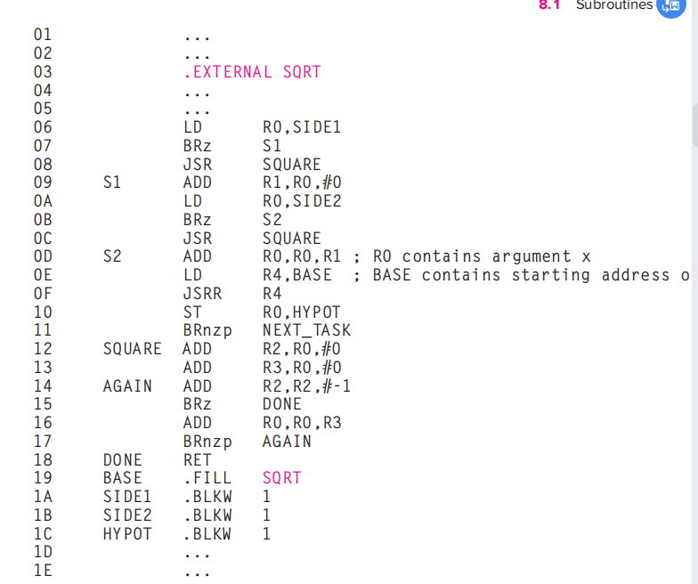​

如图是一个库函数sqrt的使用示例，这个库函数针对寄存器R0的数据进行操作

### the stack

栈是一种抽象数据类型，栈的定义时最后存入的东西一定是第一个被移除的 LIFO  
抽象数据类型是指存储机制的操作方式

对于栈的操作有特定的术语pop，是指删除元素；push，是指插入元素

**the implementation in memory 在内存中的实现**

栈在内存中最常见的实现方式是一个连续的内存空间和一个栈指针（stack pointer），栈指针来指向栈的顶部，出栈和入栈其他元素无需移动

​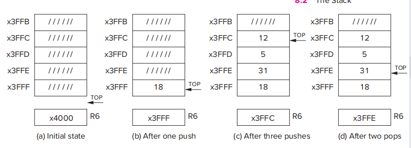​

这是栈在内存中操作的一个具象化图片，R6寄存器表示栈指针，但是要注意的是，5,12两个元素虽然已经出栈了，但是它们还是在内存x3FFD和x3FFC上，但是由于这一段内存只能由栈的方式去访问，所以视作它们已经出栈了，是通过机制移除而不是物理意义上的移除

**push**

```undefined
PUSH 	ADD   R6,R6,#-1 
	STR   R0,R6,#0
```

每一次压入操作，栈指针先递减，然后再把数据存入其地址

**pop**

```undefined
POP     LDR   R0,R6,#0
	ADD   R6,R6,#1
```

栈顶的元素被弹出，并且被读入R0，R6栈指针加一，但是那两个元素在物理意义上仍然放在那块内存里，但是只要我们对这一段内存遵守stack protocol栈协议，就不会出现问题

**underflow**

如果这一段内存中只有两个元素，但是我做了三次pop操作，就会发生下溢出，因此我们要对pop操作进行修改，以R5寄存器作为判断标准，pop是否成功了通过R5来标志

```undefined
POP     AND R5,R5,#0
	LD R1,EMPTY
	ADD R2,R6,R1
	BRz Failure
	LDR R0,R6,#0
	ADD R6,R6,#1
	RET
Failure ADD R5,R5,#1
	RET2
EMPTY .FILL xC000 ; x4000取反
```

**overflow**

同样的，在栈空间全部被占用的情况下去往栈里压入元素也会出现问题

```undefined
PUSH    AND R5,R5,#0
	LD R1,MAX
	ADD R2,R6,R1
	BRz Failure
	ADD R6,R6,#-1
	STR R0,R6,#0
	RET
Failure ADD R5,R5,#1
	RET
MAX     .FILL xC005 ; MAX <-- -x3FFB
```

总结一下就是在这种方案下，栈空间的操作会占用R1，R2和R5，三个寄存器，因此我们可以在子程序内部对其进行保存  
最终实现的代码见第八章17页

这个代码相当重要，直接展示了整个数据结构的中心

### character strings

一个一维数组，里面存放的数据按照ASCII计算，例如x0042，由于ascii只有八位，所以十六进制前两位一定是0

例如存放一个“hello”需要六个空间，最后一个必须是x0000，表示字符串的结尾

### 数组和链表

数组access快，插入慢  
链表access慢，插入快 linked list

### queue

FIFO，先进先出

对于队列，我们用R3作为前指针，R4作为后指针  
我们将x8000到x8005这六块内存作为队列

队列的基本操作是前出后进，pop操作，R3加一，pop出的内容放到R0上  
push操作，R4加一，R0里的内容载入到R4地址上

```undefined
;这是基本的操作，不考虑越界的状态
ADD R3,R3,#1
LDR R0,R3,#0
;
ADD R4,R4,#1
STR R0,R4,#1
;
front  1
       2
rear   3
       4
;对于这样一个队列来说，2 3是队列里的元素 
```

这里我们可以注意到，能用作队列的内容是x8000到x8005  
但是由于pop和push操作都在让指针增加，很快队列就会到x8005而无法作用，于是这里我们采用了  
环绕的方法，指针到x8005又要加一的时候，从x8000开始

```undefined
LD R2, LAST
ADD R2,R3,R2
BRnp SKIP_1
LD R3,FIRST
BR SKIP_2
SKIP_1 ADD R3,R3,#1
SKIP_2 LDR R0,R3,#0 ; R0 gets the front of the queue
RET
LAST .FILL x7FFB ; LAST contains the negative of 8005
FIRST .FILL x8000
```

一个队列如有6个空间，那么其最多容纳5个元素

如果front=rear 视作空队列，若front-1=rear，视作满队列

队列和栈一样，空了不能pop，满了不能push  
因此用R5作为返回值，，看pop和push是否成功

queue操作的完整代码见书本第八章37

‍

## chapter 9 I/O

the TRAP instruction enables us to tell the OS what we need done by means of a trap vector.  

对于TRAP指令，更准确的说法是system call，在这一章里需要知道input and output在LC-3中是如何工作的，在用户程序调用TRAP是发生了什么

PSR  15位priv  10位到8位priority（自己的程序是0）   3位到0位 nzp

### privilege, priority, and the memory address space

这是针对OS而言的

**pirviliege**

含义是指特权，拥有权限去访问和使用某些指令和内存空间  
例如我们不会希望随便一个程序能使用让计算机停机的指令，我们也不会希望随便一个程序能够访问计算机专门为OS准备的内存空间

我们通常用supervisor privilege来表示特权的，如果一个程序以supervisor mode运行，那么它应当可以访问所有的内存和所有的指令，如果一个程序以user mode运行，那么它访问的指令和内存都是有限制的

**priority**

我们对计算机上的程序的执行会有一个优先级的排名，比如我们会把随便一个程序的执行优先级排为0，键盘输入排为4，插入电源的事件排为6，当优先级更高的程序运行时，就会中断优先级较低的程序

privilege and priority are two orthogonal notions  
特权和优先级是两个正交概念，也就是说它们两个是无关的，一些事件可能优先级很高，但是不表示它们有很高的权限，反之亦然

**PSR**

psr是the processor status register 处理器状态寄存器，和PC一样，是每个指令都有的重要寄存器，其内容表示很多东西

其本身也是16位的  
第15位表示是权限，0表示有主管权限，1表示无主管权限。  
第10位到8位，表示优先级，最高为7，最低为0  
第2位到0位，表示NZP

**organization of memory**

LC-3广义的存储空间是x0000到xFFFF  
其中x0000到x2FFF是特权空间，存放操作系统的各种数据结构和代码，需要主管权限去访问  
x3000到xFDFF是非特权空间，不需要权限就可以访问  
xFE00到xFFFF，准确来讲不是内存空间，其本身是对一些特殊的寄存器，包括IO寄存器和PSR等的映射？有时也把这段空间称为IO页

SSP和USP分别是系统空间和用户空间的堆栈指针，一个程序在任意时间只能在某个确定的模式下运行，因此两个堆栈只有一个是活动的，寄存器R6一般用来做活动堆栈的栈指针，系统还给我们提供了两个寄存器，Saved_SSP and Saved_USP，用来存储没有被使用的那个栈指针的状态，当状态改变的时候，例如系统模式转到用户模式时，将栈指针存到Saved_SSP上，然后把Saved_USP读取到当前的栈指针上

​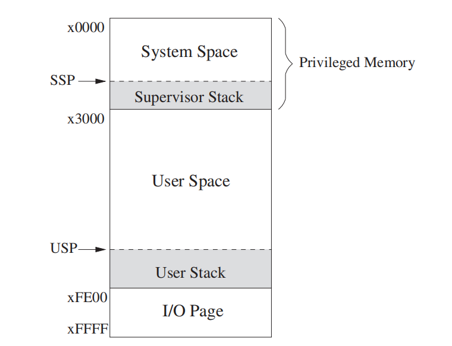​

### input/output

IO设备使用寄存器来处理数据，不同的IO设备可能会需要不同数量的寄存器来处理，但是最基础的IO设备需要至少两个寄存器，一个保存数据，一个保存状态

All IO activity is controlled by instuctions in the computer's ISA. 

**memory-mapped IO vs special IO instructions**

指令需要访问IO寄存器，需要明确地找到目标寄存器，这有两种实现方式  
一个是专门的IO指令，另一种方法，也是多数使用的方法，是采用内存操作的方式来实现

memory-mapped IO，给每个寄存器一个内存地址  
当我们使用load指令访问的内存地址真好对应输入寄存器，那么这就是一条输入指令  
当我们使用store指令访问的内存地址正好对应输出寄存器，那么这就是一条输出指令

在LC-3中xFE00到xFFFF就是为设备寄存器预留的内存空间

**asynchronous vs synchronous 异步和同步**

正常来说，IO的速度一定是比处理器处理的速度慢很多的，而且用户IO的速度是实时变化的，因此IO和处理器在绝大多数情况下都是异步的

在异步通信的情况下，需要一定的协议protocol或者说握手handshaking来控制接受和发送，例如在键盘输入中，我们采用一个单bit的状态寄存器，来判断是否有新的字符输入，依靠这个就可以实现异步处理，用户每输入一个字符，这个寄存器就被置位，处理器去读取这个寄存器里的内容，并把它清0，如果这个寄存器被清0，处理器就不会再load这个寄存器里的内容

**interrupt-driven vs polling**

中断驱动和轮询，是用户和处理器之间的两种交互方式，  
中断驱动是以用户作为主导，当用户的数据输入好时，主动通知处理器去处理  
轮询是处理器不断发出信息访问状态寄存器，直到有新的输入

#### input from the keyboard

**basic input registers KBDR and KBSR**

输入功能需要两个寄存器，一个键盘数据寄存器KBDR，存放输入字符的ASCII，二是键盘状态寄存器KBSR，存储键盘的状态，附录里写了这两个寄存器的地址，

它们也是16位寄存器，但是只会用到其中几位  
KBDR只会用到7位到0位来存储ASCII    	地址为xFE02  
KBSR只会用15位来存储状态信息		地址为xFE00

**basic input service routine**

当键盘输入一个字符时，其ASCII被存入KBDR，键盘电路将KBSR置为1，处理器读取KBDR后，KBSR自动置为0，此时键盘才能再次输入字符

在轮询的情况下，系统会不断地测试KBSR，直到其变成1，那么此时会把KDSR的内容读到一个本地寄存器中，并将KBSR置为0，并且自动清除KBDR（防止一个字符被反复读入）

```undefined
01 START LDI   R1, A ; Test for
02 	 BRzp  START ; character input
03 	 LDI   R0, B
04 	 BRnzp NEXT_TASK ; Go to the next task
05 A     .FILL xFE00 ; Address of KBSR
06 B     .FILL xFE02 ; Address of KBDR
;这是一个程序，用于等待用户的输入，一旦输入了之后将字符读取到R0上
;
```

**implementation of memory-mapped input**

在有内存映射的情况下，load和store指令都有了新的含义  
将这个地址映射给设备寄存器，就可以在不创造新的指令的情况下，用原有的load指令，实现将设备寄存器的内容拷贝到我们的目标寄存器这一工作

#### output to the monitor

与输入功能相同，输出工作也有两个基本的寄存器

DDR，存储ASCII 用八位，xFE06  
DSR，存储状态，用一位，xFE04

**the basic output service routine**

基本的输出过程是这样的：LC-3将ASCII输入到DDR，显示器电路自动清除DSR，当字符成功显示在屏幕上时，将DSR自动设置为1，其中当DSR15位为1时，表示可以进行下一次输出，当DSR15位为0时，表示忙，不能接受下一次工作

采用轮询模式的话，系统要不断地测试DSR，直到它为1，可以接受下一次工作

```undefined
01 START LDI R1, A ; Test to see if
02 	 BRzp START ; output register is ready
03 	 STI R0, B
04	 BRnzp NEXT_TASK
05 A     .FILL xFE04 ; Address of DSR
06 B     .FILL xFE06 ; Address of DDR
```

**implementation of memory-mapped output**

内存映射的实现，这里与输入过程非常相似，只不过把load指令改为了store指令，把目标寄存器里的内容存储到了设备寄存器中。

**one example keyboard echo 将打出来的字显示出来的程序**

```undefined
01 START LDI R1, KBSR ; Test for character input
02 	BRzp START
03 	LDI R0, KBDR
04 ECHO LDI R1, DSR ; Test output register ready
05 	BRzp ECHO
06	STI R0, DDR
07 	BRnzp NEXT_TASK
08 KBSR .FILL xFE00 ; Address of KBSR
09 KBDR .FILL xFE02 ; Address of KBDR
0A DSR  .FILL xFE04 ; Address of DSR
0B DDR  .FILL xFE06 ; Address of DDR
```

**我们会写一个更加完整的输入输出程序，见文件IOtest**

**memory-mapped IO revisited 回顾内存映射IO**

我们在前面已经了解过内存映射IO的情形，但那是针对轮询情况下有效的内存映射IO  
要想支持中断驱动的IO，必须让两个状态寄存器是可读可写的，这样才能在中断信号来的时候改变状态寄存器

实际上的数据通路见书本第九章P15

‍

### operating system service routines(LC-3 trap routines)

trap指令，是让我们调用操作系统的程序，来进行一系列的操作，最典型的就是在IO过程中，这样做有两个好处，首先，IO过程会使用到需要特权访问的设备寄存器等，而操作系统有特权访问的能力；其次，操作系统的程序使得我们不需要了解很多的细节，而可以在更好更安全地使用那些只有访问特权区域才能实现的功能

在trap指令调用完操作系统的程序之后，程序又会回到trap指令的下一条，这整个过程称为service call or system call 服务调用或者系统调用

**trap mechanism trap的机制**

trap机制包含一下内容  
1.service routine 服务程序，也即操作系统提供的所有服务，LC-3提供256个服务，在附录表A2可以找到  
2.起始地址表，这256个服务程序的起始地址，被放在x0000到x00FF，例如output服务的起始地址存放在x0021，x0021的内容是x0420，也就是说output服务起始地址是x0420  
3.trap指令，trap指令会让操作系统以用户程序的身份执行特定的服务内容，最后再跳转回来  
4.linkage 链接，操作系统提供的，从服务程序返回用户查程序的机制

**trap instruction**

trap指令  
1111 0000 00100011

15位到12位为操作码1111  
11位到8位为0000，必须全为0  
7位到0位 是trap vector ，对这八位做0拓展zero-extend，也就是对应x0000到x00FF  
根据x0000到x00FF中的内容，会取出来所对应的程序的起始地址

TRAP指令的工作机制，将trap vector做零拓展，然后将其装入MAR，把对应地址的内容读出来之后装到MDR  
之后将当前PC内容存入**寄存器R7**，然后把MDR里的内容装到PC上

**RTI instruction**

RTI指令，用于控制返回调用子程序的程序

1000 000000000  
操作码1000，没有操作数  

会将系统堆栈上最前面两个弹出到PC和PSR上，如果返回的过程中有堆栈区域的切换，那么就需要R6寄存器去保存另一个堆栈指针的状态？

**TRAP指令的完整过程**

系统程序的结尾一般情况下是JMP R7，由于JMP R7指令非常常见  
在LC-3汇编中，专门用RET这个标识符来表示JMP R7这个指令，也更加地形象

​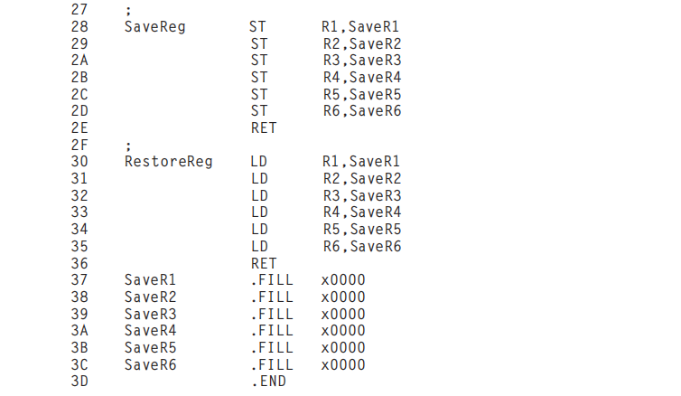​

常用的子例程，在不需要用到原有的寄存器的数据的时候很好用

**对于TRAP调用的系统输入输出字符与字符串，以及停机的具体实现可以看书本附录A**

IO的读入放在R0上

### interrupts and interrupt driven IO

中断驱动IO使得系统不用浪费大量时间去探测Ready标志，并且有很高的适用性，如果采用轮询方式的话，那么一旦需要输入并且所有程序停止等待其输入，这要求我们明确知道什么时候应当进行输入，而中断驱动可以在程序运行的任意时候打断并且进行输入

比如说需要处理输入的字符串，使用中断驱动，可以使得输入一部分，处理一部分，而不是等到全部输入完之后才能处理

‍

状态寄存器中的第14位称为中断允许标志，记为IE，若IE为1，那么其有可能发出中断信息，若IE为0，那么中断信息不会产生

我们之前了解过指令周期，在INT信息产生时，在指令周期最后store result的时候，还会进行一个INT的判断，看优先级够不够中断指令，如果优先级够中断指令，那么返回fetch之前，系统会做两个操作，一个是，保存足够多的状态信息以回到中断前的情况，一个是将服务于该设备请求的程序入口地址装上PC寄存器？

AND ADD指令即便是自己加0也是做了东西，改变了nzp

DMA direct memory access，让输入输出设备直接具有访问内存的能力

## chapter 10 calculator

本章是对前面所学知识的一个汇总，将会实现一个栈式计算机stack machine  
也就是说不依赖寄存器中的操作数，仅仅依赖栈实现计算，例如ADD 从栈顶推出两个元素，进行加法，然后将其压回栈中

### data type conversion

数据类型转换，必要性：从输入到计算，我们要把ASCII转换为二进制补码；结果的输出，我们需要把补码转换为ASCII  
数据类型转换目的在于给操作提供正确的操作数

在高级语言中，浮点数加整数的操作是很常见的，这也需要提前把整数转换成浮点数，才能获得正确的答案  
下面讲解一些重要的转换做法

**from ASCII to binary**

对于ASCII而言，它的数据是分离式存储的，例如“295”是存储在三个内存空间里的，因此转换成二进制数据的重点在于位数的考量与进位

**from binary to ASCII**

这个算法而言，也是位数的转换最为关键，以上两个做法实际实现都可以见书本  

额外目标，实现一个ASCII转二进制，用O1的内存；实现一个二进制转ASCII，根据位数自动调整产生ASCII的个数

### arithmetic using a stack

栈计算器是与显示计算器相对的，栈计算器中的ADD依赖于出栈和入栈，用栈进行临时的存储  
显示计算器依赖于指明的寄存器 ADD R5,R4,R6

这里讲述了如何讲一个算术运算式，翻译成显示计算器的指令和栈计算器的指令

在后面详细讲述了加法，乘法，取反操作在栈计算器上的操作

‍

## chapter 11 recursive

可以自定义trap xx

例如trapx02  
只需在x0002处放好要调用程序的头指针，例如x2000  
一般会是有系统权限的程序

实际存在的递归并不像c语言中那么直观，在汇编中的递归底层实现一般需要用到栈  
例如下面是一个例子，是斐波那契数列的递归实现

```undefined
;FIB subroutine
; + FIB(0) = 0
; + FIB(1) = 1
; + FIB(n) = FIB(n-1) + FIB(n-1)
;
; Input is in R0
; Return answer in R1
;
FIB     ADD R6, R6, #-1
	STR R7, R6, #0 ; Push R7, the return linkage
	ADD R6, R6, #-1
	STR R0, R6, #0 ; Push R0, the value of n
	ADD R6, R6, #-1
	STR R2, R6, #0 ; Push R2, which is needed in the subroutine
; Check for base case
	AND R2, R0, #-2
	BRnp SKIP ; Z=0 if R0=0,1
	ADD R1, R0, #0 ; R0 is the answer
	BRnzp DONE
; Not a base case, do the recursion
SKIP    ADD R0, R0, #-1
	JSR FIB ; R1 = FIB(n-1)
	ADD R2, R1, #0 ; Move result before calling FIB again
	ADD R0, R0, #-1
	JSR FIB ; R1 = FIB(n-2)
	ADD R1, R2, R1 ; R1 = FIB(n-1) + FIB(n-2)
; Restore registers and return
DONE    LDR R2, R6, #0
	ADD R6, R6, #1
	LDR R0, R6, #0
	ADD R6, R6, #1
	LDR R7, R6, #0
	ADD R6, R6, #1
	RET
```

在很多情况下，递归算法都是相当缓慢的
