# 介质访问子层

我们之前在数据链路层讨论过的协议都是 点对点链接 point-to-point connections 的，但是在LAN（局域网用的都是广播信道）等场景下，我们需要**广播信道 boardcast channels**，也称为 **多路访问信道 multiaccess channel 或 随机访问信道 random access channel**

对于广播信道而言，最关键的问题是保证多方争用信道时确认谁可以使用信道，让他们都成功发送信息。

用来确定多路访问信道的下一个使用者的协议，属于Link Layer的一个子层，也就是介质访问控制子层 MAC，Medium Access Control Sublayer

> OSI 七层模型将Data Link Layer分成了 LLC（Logical Link Control）和 MAC两个子层

​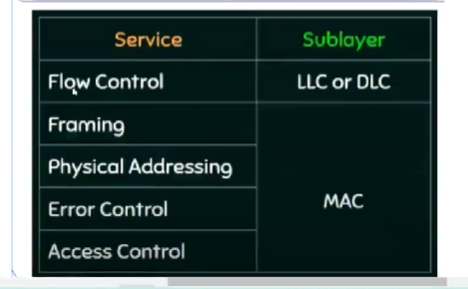​

* Flow Control就例如上一章的滑动窗口等等

## 1. 广播信道传输协议

最基础的想法是我们可以做时分复用和频分复用（Static FDM / TDM）

但是有问题在于，如果我们只有一个用户想发消息，那么其余的时间片全数浪费了，并且如果我要增加一个用户，会很麻烦，其无法动态的增长可容纳的用户数量

### 1.1 ALOHA Additive Links On-line Hawaii Area

**Pure ALOHA**

基本思想在于，每个用户有数据要发就发，但当两个用户发送信号重叠时（我们称为 **冲突 collision**），冲突的帧就会损坏，ALOHA要求发送方可以知道所发送的型号是否发生了冲突。

这种采用了可能引起冲突的共享信道的方法称为 **竞争系统 contention system**

​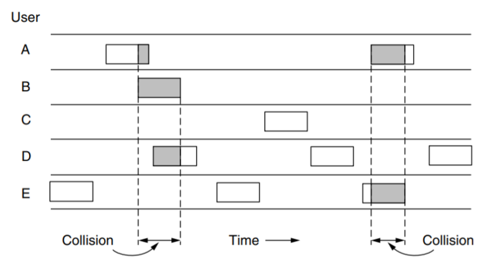​

ALOHA 最初的应用场景中，是一堆用户需要和中央计算机通信，这些用户采用ALOHA，然后中央计算机会将收到的帧广播发回，发送方侦听发回的帧就可以知道是否发生冲突。

> 在其他系统中，发送方可以直接侦听发送的帧是否发生冲突；或者等待接收方发回ACK和NACK

当发送方侦测到冲突，收到NAK或者一段时间未收到回复时；其会在等待一段随机时间后再次发送该帧，如果等待时间不随机，那么该发生的冲突仍然会发生

最好情况下 Pure ALOHA的信道利用率期望约为 $1/2e$ 约为 18%，是比较低的

**Slotted ALOHA**

上述Pure ALOHA利用率低的一个主要原因在于，即便一个消息只有最后或开头的一小部分和其他消息冲突了，其也会导致消息错误，那么针对这个问题，我们提出要把时间分为离散的slot

​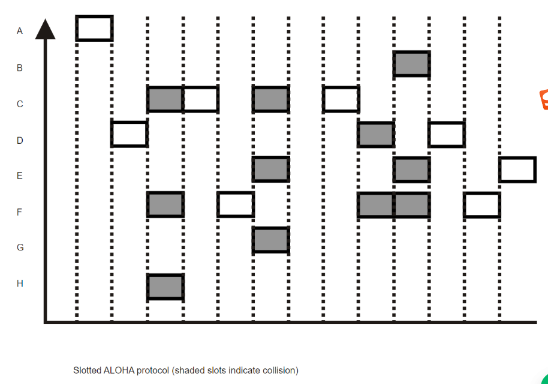​

用户只能在每个slot的开始时刻才能发送帧，每次传输帧的用时必须小于等于一个slot的长度

这种做法最佳利用率能达到 1/e 差不多是36%

### 1.2 载波侦听多路访问 CSMA

CSMA Carrier Sense Multiple Access，其基本思想在于，我要发送信息之前先侦听一下，看看有没有其他用户在发，若无，再发送自己的信息

**1-persistent CSMA**

要发送，先侦听，若忙，则不断侦听到信道空闲再发送。若冲突，则等待随机时间重复上述策略

> 之所以还会冲突，是因为存在Propagation Delay

缺点在于，若两个信道都在侦听等待信道空闲，然后在空闲的一瞬间开始发送信息（因为有delay的存在，其不会瞬时发现信道忙），必然会冲突，导致利用率下降

即便如此，信道利用率仍然高于ALOHA

**nonpersistent CSMA**

为了避免上述CSMA的缺陷，我们采用一种机制，当侦听到忙之后，放弃侦听，等待随机时间，再侦听

**p-persistent CSMA**

这种方法用于 slotted channels

* 若侦听到忙，则下一个slot再听
* 若侦听到空闲，则有p的概率发送数据，有1-p的概率等到下一个slot再听
* 若冲突，还是等待随机slot

​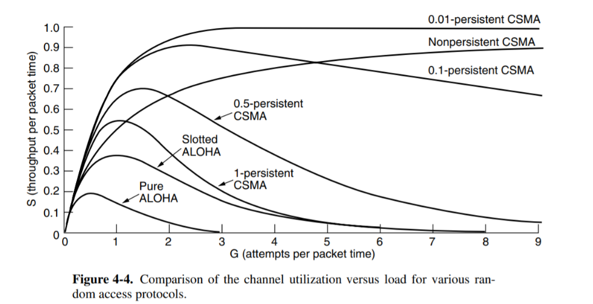​

**CSMA/CD CSMA with Collision Detection**

之前的CSMA都是依靠等待确认帧，这是有一定浪费的，但是在一些链路中，我们可以在发送过程中就检测到。

但是这种检测机制存在一个限制，假设 t 是最远的两个站之间的传播用时，那么我们接受到冲突的最长时间就是 2t，这也就要求我们在2t时间内只能发送一个帧，否则我们就不知道冲突发生在哪个帧上了

于是我们有如下公式

$$
\frac{Frame\ len}{BW}\geq2t
$$

该种形式适用于总线型网络和半双工网络形式

二进制指数退避算法

* 确定一个基本退避时间 T 一般就是上述的 2t
* 推迟重传的时间是 $[0,1,...,(2^k-1)]$ 随机取一个数乘上T，其中k为 $\min(重传次数，10)$
* 当重传超过16次的时候，确定出错，不再发送

### 1.3 无冲突协议 collision-free procotols

**基础位图协议 The basic bit-map protocol**

​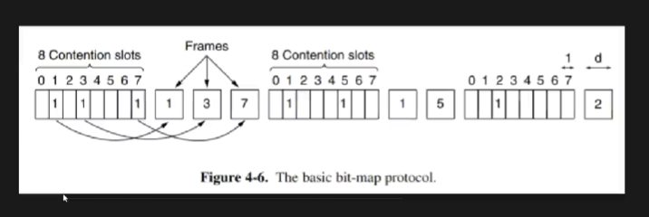​

维护八个slots，每一轮，都去询问8个用户是否要发消息，比如第一轮记录完之后，有1 3 7要发消息，那么他们三个依次发消息

这种在发送数据之前先广播发送意愿的协议 称为**预留协议 reservation protocol**

**令牌环协议 Token Ring Protocol**

​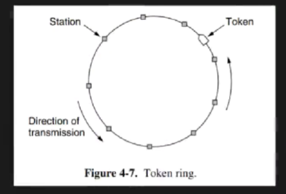​

将所有的用户编成一个环，只有持有token的用户才能发消息

* 有token，但是没消息发，直接传给下一个人
* 有token，有消息发，发完收到确认，传给下一个人

  * 发的时候也绕一个圈，需要确认，回到发的人的时候结束，再生成一个token继续传
* 无token，等待

**二进制倒计数协议 Binary Countdown Protocol**

比方说我们有16个用户，我们给每个用户一个编号，并且转换成二进制 也就是 0000到1111，我们有4 bit的编号

每次我们要发消息的时候，先进行一个4bit的询问，每个对应bit位为1的发声，然后找到编号最大的那个，让它发消息，如果你发现你为0的位，有其他用户发声了，说明你的编号更低，就不再发送

​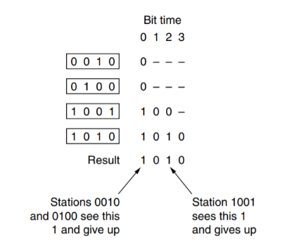​

* CSMA/CA 是冲突避免而不是无冲突

### 1.4 有限竞争协议 limited-contentiion protocols

**自适应树遍历协议 The Adaptive Tree Walk Protocol***

​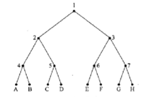​

从root开始遍历，若是1开始就没有冲突，就让那个用户发，若是有冲突，分成两部分检查，然后无冲突的发？

## 2. 以太网

一个 10 Mbps 的以太网标准在 1978 年被制定出来，称为DIX standard，1983年又被修订为 IEEE 802.3 标准

​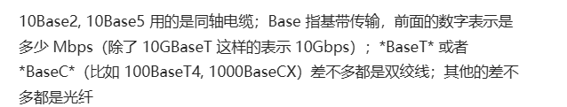​

以太网是现在最流行的有线局域网技术，在逻辑上采用总线型拓扑结构，使用CSMA/CD进行对总线的访问控制，信息总是以广播的形式发送

### 2.0 一些其他的局域网技术

> 见王道

### 2.1 物理层

​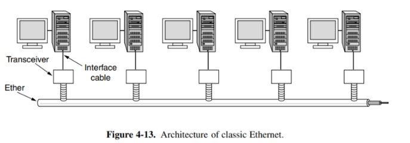​

设备通过 Transceiver 连在 Ether上，以太网的每个版本都有电缆长度的限制，超过这个限制的网络可以用 中继器 repeater 将多条线缆链接起来

但是仍然存在限制，transceiver之间最大距离为 2.5 km 和 最大经过 4 个 repeater

在电缆上，信息发送采用 Manchester 编码

**集线器 Hub**

​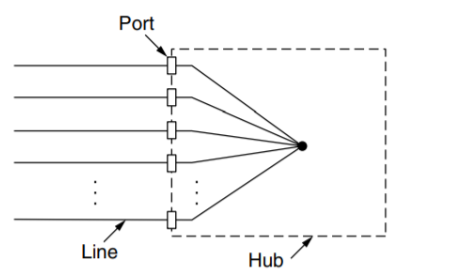​

传统的接线模式不太方便设备的增减，出现断裂情况也很难定位

Hub有很多接口，每个接口简单连接起来，任何一个接口传来的帧会被传播到其他Port，Port的设置方便了设备增减和定位问题

Hub是一个物理层设备，没有数据理解，处理，缓存能力，只做传播

### 2.2 传输协议

以太网是无连接的，也不提供确认，使用 **1-persistent CSMA/CD 算法（以太网的传输时间上限）** 进行传输，通过侦听有没有冲突来判断发送的结果。

如果站侦听到了冲突，会发送一个短的冲突加强信号（short jam signal）确保另一个发送站也听到了冲突

> 没有侦听到冲突不代表没有错误，但是我们视为没有错误，有错误交给高层解决

​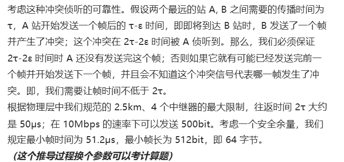​

以太网以 二进制指数后退 binary exponential backoff 算法确定每次冲突的等待时间。我们将时间按照 51.2 us 分块；在第 $i=1\sim15$ 次冲突发生后，等待$0\sim\min(2^i-1,\ 1023)$个时间槽之后再次尝试发送，发生16次冲突之后放弃发送，并返回上层一个失败报告

​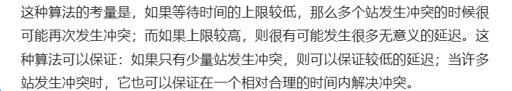​

### 2.3 帧结构

​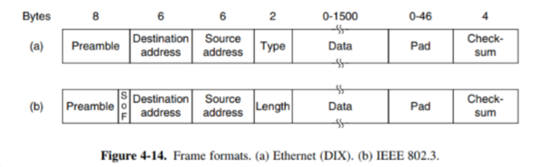​

在不计算前导码的情况下，MAC给数据包增加了18B的长度

> DIX和IEEE802.3有所不同

* Preamble 这个部分是不会作为帧的一部分算入 CheckSum 和 length 里面

  * 其会发送8个字节，前7个字节都是10101010，用来同步速率，第8个字节是10101011（SOF Start of Frame）提示帧的开始
* Dest addr 第一个bit是0，表示是**单播 unicasting**，第一个bit是1表示**组播 multicasting**，全1表示**广播 boardcasting**，实际上而言其实都广播，只不过每个接收方会检查一下，自己是不是单播/组播的对象或者干脆就是广播，再选择接收
* MAC 里的 addr是全球唯一的，由IEEE统一分配，前3个字节称为**OUI Organizationally Unique Identifier**，分配给网络设备制造商；网络设备制造商再分配给网络设备，并写入 **网络接口卡 NIC network interface card，也就是网卡，也叫做 adapter 网络适配器**

  * 其工作在数据链路层，MAC地址一般以连字符分割的12个十六进制数表示，高24位为厂商代码，低24位为厂商自行分配的适配器序列号
* 后面两个字节，在DIX中表示类型，这个类型是指网络层协议的类型，而IEEE802.3中存储了Data的长度

  * 但是其实DIX中也存储了长度，802.3中也存储了类型，这部分都由LLC存储在数据包中
* 后面就是Data字段，DIX中设置了data字段的上线为1500字节
* Padding 保证帧长度不低于64字节（不算上Preamble）
* 最后一个字段是校验和 用32位CRC

以太网的帧定界

以太网使用Manchester编码，其只要保证发送完一个帧之后存在一段时间的间隙，这个间隙的波形就属于Manchester的违规编码，因此就能实现帧定界

### 2.4 网桥

假设我们有一系列的LAN，然后我们LAN之间需要通信，要如何去实现这一点

**直接连接**

最简单的方法就拿一根电缆直接连接这些LAN，但是这种做法有问题

* 这种做法会导致每个LAN里所有的信息都发送给其他LAN，有浪费不说，大部分信息我们其实只希望内部交流，有安全性问题
* 802.3限制了最长线路长度为2.5km
* 不同的LAN有不同的运行速度和网络类型，直接相连是无法工作的

因此其实我们需要保持LAN相互隔离的状态，给它们提供途径给其他LAN发消息，因此人们开发出**网桥 bridge**

> 在LAN内部消息传输中，不应该感知到bridge的存在

**基本原理**

​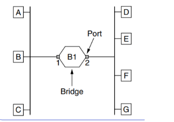​

网桥工作在 **混杂模式 promiscuous mode** 下，其捕获所有发给它的数据（混杂模式的定义），如果发送方和接收方在同一个网桥接口（$A\rightarrow C$）就丢弃这个包；若不在一个接口（$A\rightarrow F$）就进行一个转发

网桥之所以能做这种转发，显然其内部记录了MAC地址到端口号的映射，也就是有一个哈希表。但是这个哈希表并非是一开始就完成设置的，而是通过学习得来的

当A给B发包，网桥就把A加入1号这个端口的映射，然后因为这时候不知道B在哪，就把B转发给除了A以外所有端口。

* 这种学习法称为 **后向学习法 backward learning**
* 这种全转发的方法称为 **flooding algorithm**

​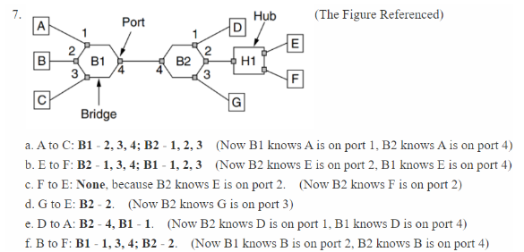​

### 2.5 高速以太网

* 以太网的最小长度是 64 B，而速率有所不同

​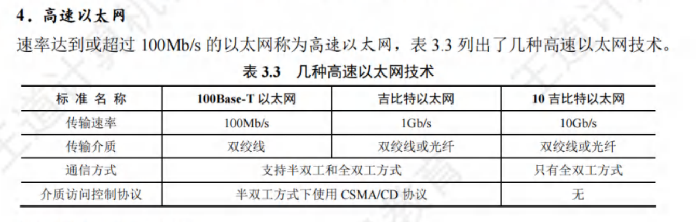​

## 3. WLAN

WLAN 无线的局域网存在一些特殊性

* 作为无线通信系统其不能检测出正在发生的冲突，因为其收到的信号比发出的型号要弱的多。
* 其传输的范围有限，一个站发出的信号可能不能到达其他所有站

因为上述特殊性，会引发一些问题

* **隐藏终端问题（hidden terminal problem）** C向B发消息，此时A向B发消息，但是C无法检测到A向B发消息这个事实，因为C在A无线传播距离之外，此时造成冲突，双方发送失败，也就是说侦听无信息确定不冲突是没有意义的

​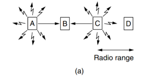​

* **暴露终端问题（exposed terminal problem）** B正在给A发消息，此时C想要给D发消息，但是监听到了B的消息，认为此时应该等待，实际上此时C给D的消息并不受B给A的消息影响，也就是说侦听有信息确定冲突也是没有意义的

​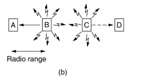​

引发上述问题的根本原因在于，发送端只能感知到发送端是否有其他无线信号，但影响接受结果的事接收端附近的无线信号。

在有线通信中，不存在传播范围这个限制，上述概念是等同的，影响了发送端的肯定也影响了接收端；但在无线通信中只要接收方互不干扰，多个传输可以同时发生，我们也应当利用这种并发性

### 3.1 冲突避免多路访问 MACA

MACA Multiple Access with Collision Avoidance

具体的做法是：A要给B发送数据之前，先发送一个RTS（Request to Send），里面包含目标B和想要发送的数据帧长度；B在受到这个RTS之后，回复一个CTS（Clear to Send）其中也包含从RTS中获取的长度，A在接收到CTS后开始传输

这个做法的目标是

* A的发送范围里的站收到RTS会沉默，避免与A收到的CTS冲突，直到A开始发送消息
* B的发送范围里的站收到CTS会沉默，避免与B收到的信息冲突，静默时间通过CTS中存储的信息长度判断

CTS和RTS中存储长度的原因在于，让静默的站知道该静默多少时间

MACA同时能解决暴露终端和隐藏终端问题

### 3.2 IEEE 802.11

这是一个完整的协议架构

#### 3.2.1 物理层

​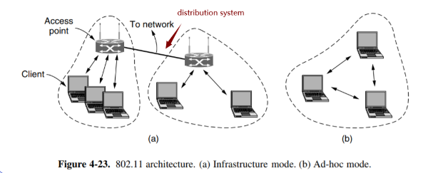​

IEEE802.11的物理层有两种形式，一种是Infrastructure mode，一种是Ad-hoc mode

也就是说一种是依赖Access point去连接，另一种是一些终端直接点对点连接

**协议栈**

​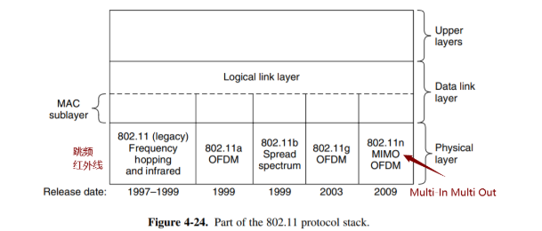​

通过协议栈我们看出，在技术发展过程中，IEEE802.11的物理层使用了不同的技术

**使用的频带**

​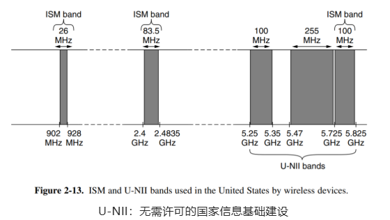​

IEEE802.11使用的是ISM band，其实非常嘈杂，无需许可大家都能用

**速率自适应 rate adaptive**

通过丢包率调整发送速率，当丢包率低的时候，调高速率；丢包率高的时候，调低速率

#### 3.2.2 MAC Sublayer

**CSMA/CA**

无线电总是半双工的，做不到错误检测，802.11采用CSMA/CA（CSMA with Collision Avoidance）来避免冲突

其发送的流程是：

* 等一段没有人发送消息的时间，完成确认
* 等待完之后随机再等待一个时间段（在这个时间段中也要侦听，若是有信息来冲突，则退出这个流程）
* 发送信息

上面的第二步是与以太网不同的地方，原因在于WLAN的冲突更加昂贵

​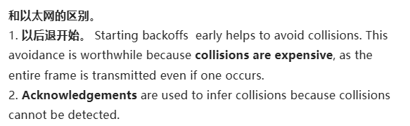​

上述这种操作方法被称为**DCF Distributed Coordination Function**因为我们不依赖一个中央控制系统去协调，而是大家各自侦听，各自确认。

还有一种PCF Point Coordination Function，就是依赖物理层中的Access Point，去做检测和确认，但是这种做法一般较差，只能保证一个Access Point下的设备不冲突，不保证不同Access Point下的设备不冲突

**Virtual channel sensing**

CSMA/CA 是没有解决暴露终端问题和隐藏终端问题的，因此我们引入一个新的机制

使用RTS和CTS机制来实现，NAV（Network Allocation Vector）就是RTS和CTS中包含的那个所谓的长度。相当于是预告了我接下来会发多少时间的数据，其他站需要等待多久

​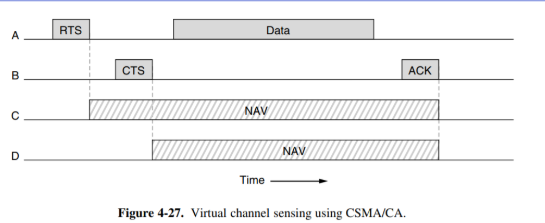​

* C要等待到ACK发完，而D其实只需要等待到Data发完就可以了

但在实际上而言，上述的RTS和CTS机制是在实践中意义不大的

* 其对短帧和接入点（AP）没有帮助
* 不能像MACA一样同时解决两个问题，其实只解决了隐藏终端问题

通常情况下，隐藏终端问题出现得不多

**一些其他机制**

* Reliability：无线网络环境嘈杂，需要增加传输成功的概率

  * lower the tranmission rate 降低传输速率，我们可以调制得更好
  * send shorter frame 如果每个bit的出错率一致，那么越短则无错的概率越大，有两种做法

    * reducing the maximum size of message
    * 802.11 allows the frames to be split into smaller pieces, called fragments, each with its own checksum. fragment的长度是可以动态变化的
* Savinng Power：移动无线设备需要考虑电池的寿命，因为无线通信要耗电的

  * Beacon Frames 这个帧是AP定期广播的帧（100ms一次）告知客户端AP的存在，并且携带系统参数。客户端可以给AP发送帧中设置一个电源管理位，告知AP其进入省电模式，客户端可以进入休眠状态，而AP会buffer发往该客户端的流量。当Beacon Frames到来时，客户端会被唤醒，并检查AP中是否buffer了我的数据（Beacon Frame 中有一个流量映射图 traffic map）如果有，则开始轮询接受缓存的流量
  * APSD Automatic Power Save Delivery（自动省点传递）。也是AP会缓冲帧，而在客户端给AP发送帧之后，AP立即将这些帧发给客户端（在客户端有主动需求的时候获取buffer）。客户端可以再发送完流量之后进入休眠状态
* Quality of Service

  *  TODO

**Frame Structure**

​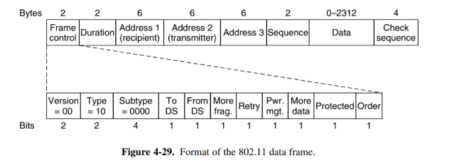​

上图是 802.11 中的data frame，除了数据帧以外还有控制帧和管理帧

​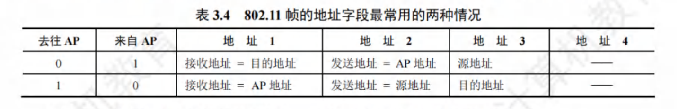​

## 4. 一些其他的知识点 * 

### 4.1 VLAN

虚拟局域网VLAN，可以把一个较大的局域网分割成一些较小的与位置无关的逻辑上的VLAN

有三种划分LAN的形式

* 基于接口，在此种情形下，机器离开了原来的接口，就可能进入一个新的子网
* 基于MAC地址，移动之后不改变归属
* 基于IP地址，使得VLAN可以跨路由器扩展，把多个局域网的主机连接起来

​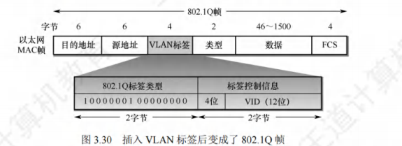​

​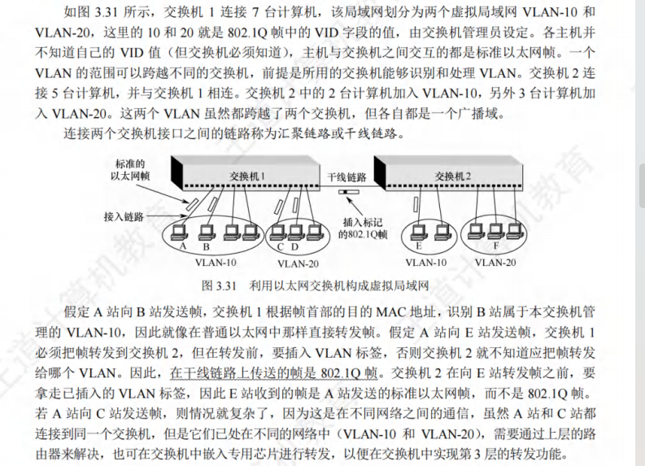​

* 这个流程有点复杂

### 4.2 广播域，冲突域

## 常见题型

* 几种CSMA
* 无冲突协议
* 冲突避免协议
* 局域网

  * 以太网（有线局域网）
  * 802.11 （无线局域网）

​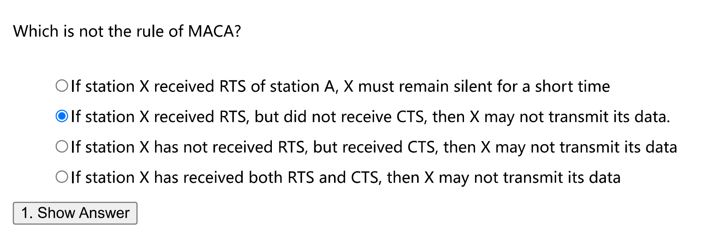​

​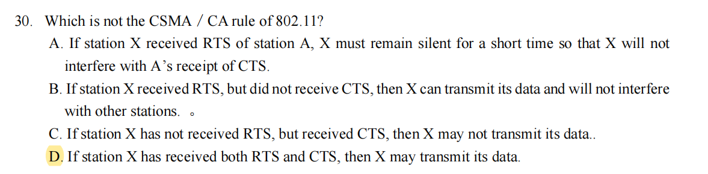​

* 关于MACA 收到RTS 但是没收到CTS就可以发，但是如果收到RTS，还是要等一段时间检查其会不会收到CTS

​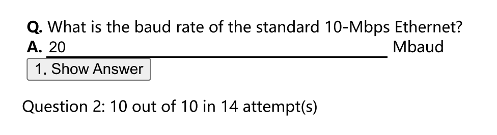​

​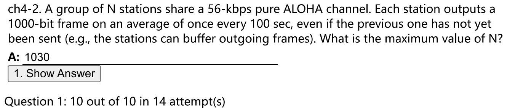​

* 这题直接考察纯ALOHA的效率 10 * N = 56000  / 2e

​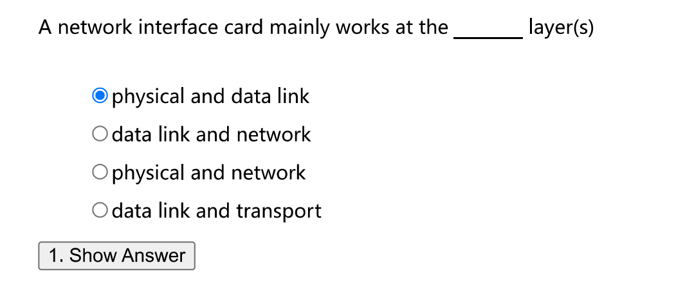​

* 概念题

​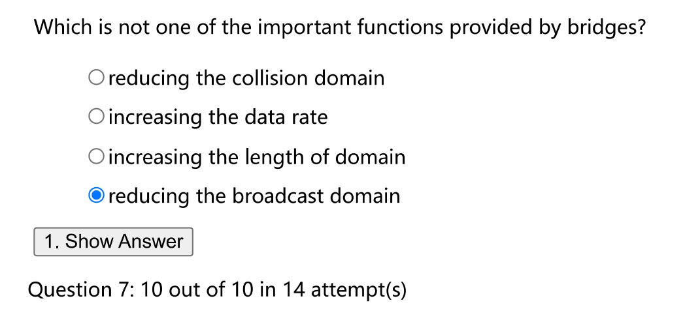​

* 概念题

​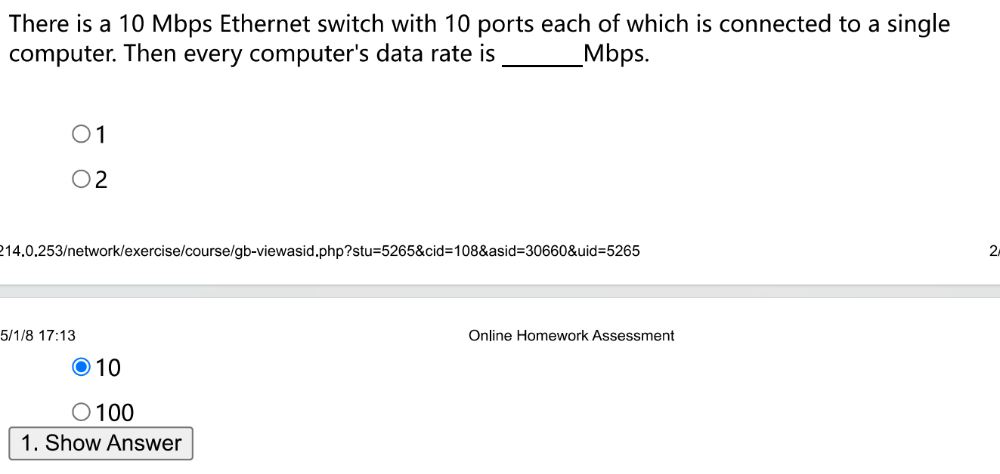​

* 关于以太网设备

​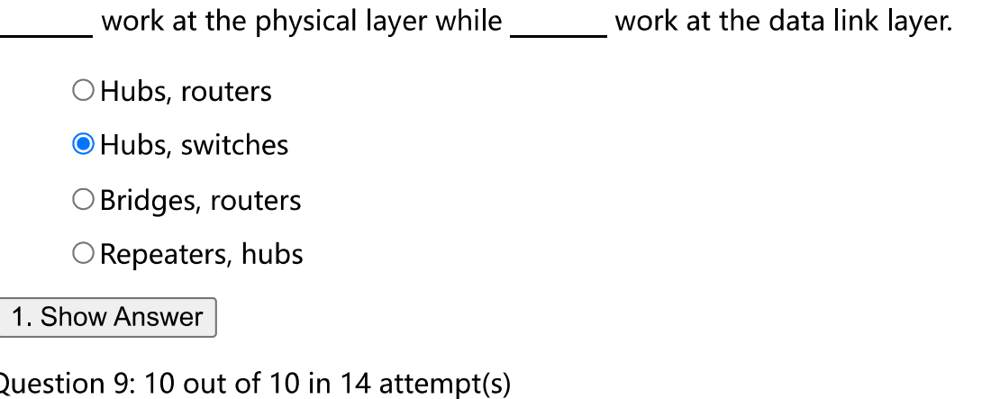​

​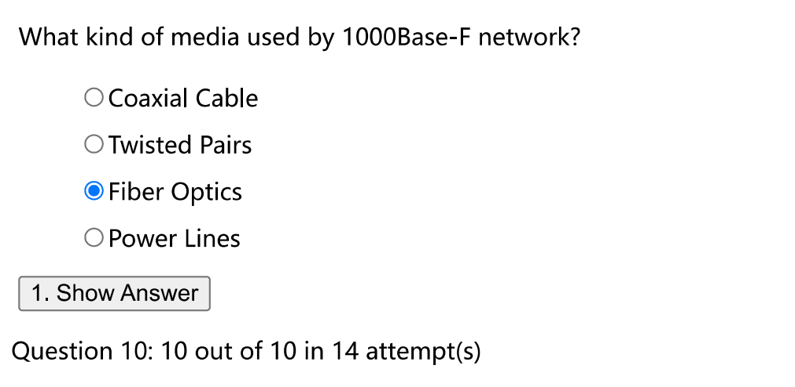​

​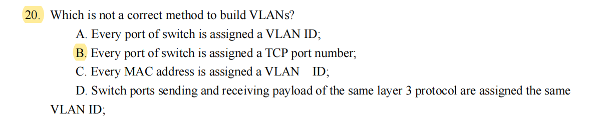​

​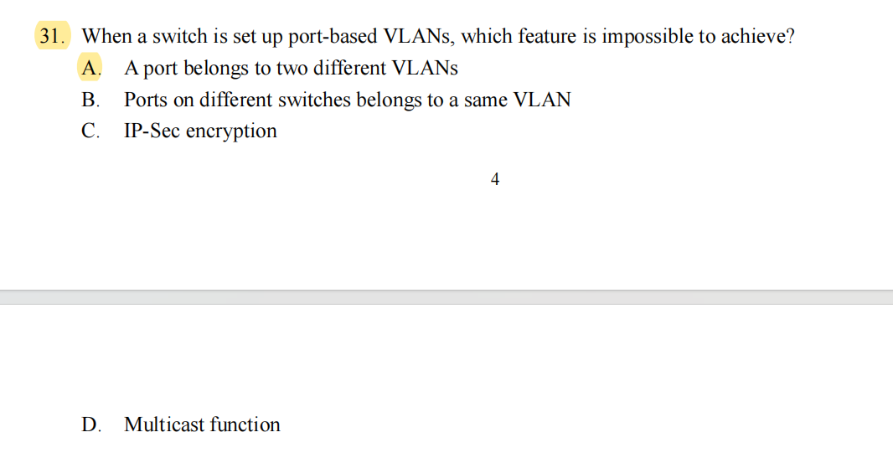​

* VLAN要去看看

​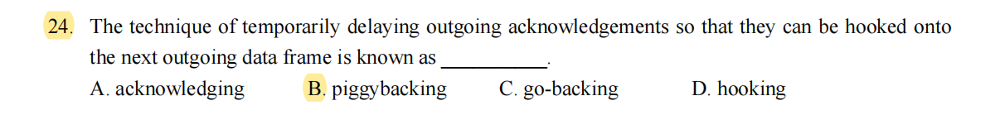​

* 捎带确认

​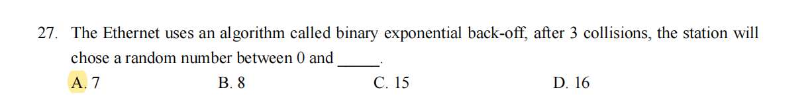​

​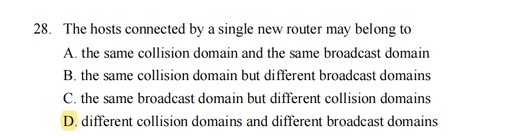​

​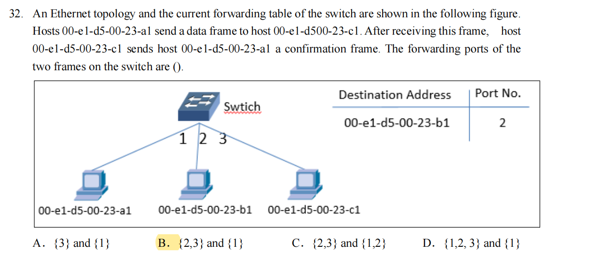​

* 当1发送的时候，Switch记录下1的端口，但此时不知道3是谁，因此要群发；而3发给1的时候，已经知道了1是谁，所以只需要单独发给1即可

​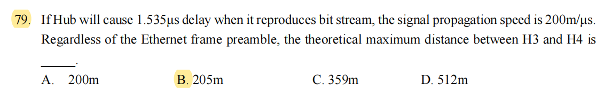​

* 这个delay要计算两次

​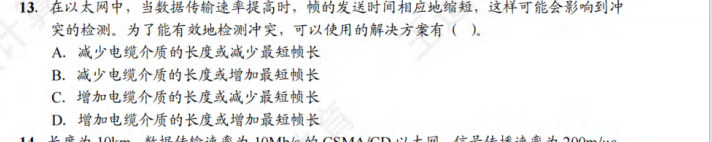​

* B

​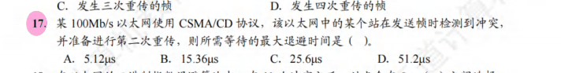​

* B 5.12 * (2^2 - 1)

​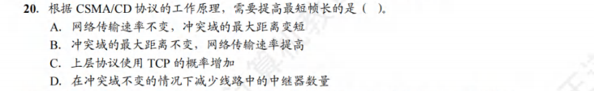​

* B

​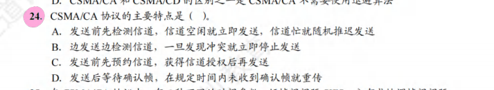​

* D 预约信道并非强制要求 CSMA/CA 可选项之一

DIFS > PIFS > SIFS

​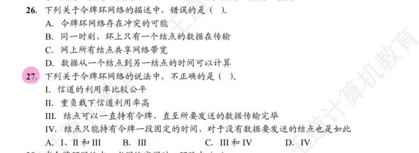​

* A C token ring 的行为 要再看看

​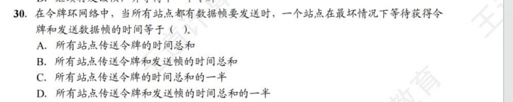​

* B

​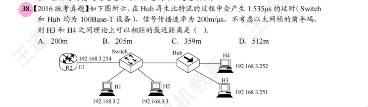​

* B 经典题目

​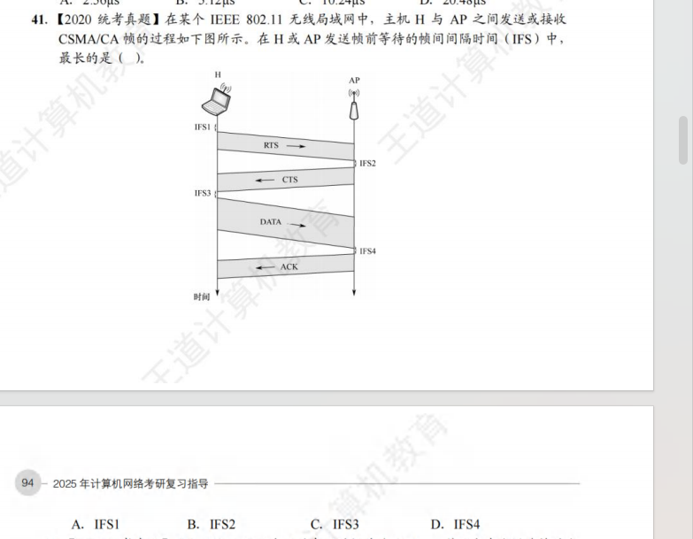​

* A 一开始退避的是DIFS，后面的都是SIFS * CSMA/CA的具体流程

* CSMA/CD 是半双工的
* 10Gbit以太网 只能工作在全双工
* 高速以太网和一般以太网的MAC格式完全相同
* 链路聚合 不是 VLAN的优点
* 802.11中 有四个地址字段 根据 To AP From AP
* 广域网和局域网的区别在于使用协议不同
* 广域网使用的传输形式是 存储转发

​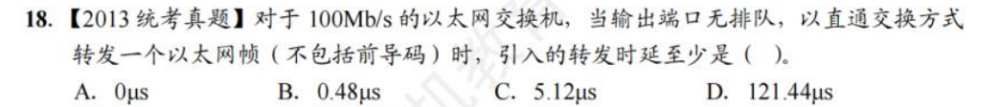​

* B 只需要检查6B 地址
