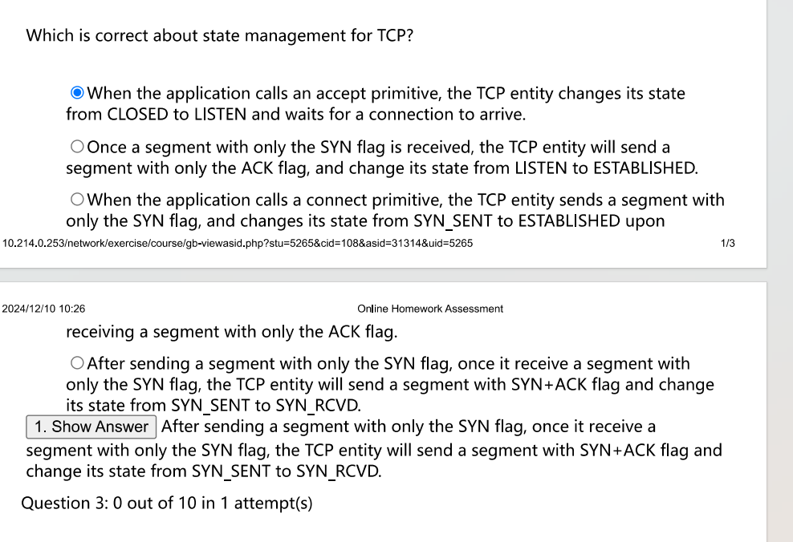

# 传输层

## 1. 传输层提供的服务

* 链路层提供链路上节点之间的逻辑通信
* 网络层提供主机上的逻辑通信
* 传输层提供不同主机上的进程之间的逻辑通信

传输层是面向通信的最高层，用户功能的最底层，传输层只存在于主机上，通信子网中的路由器没有传输层

* 传输层是端到端的，已经不属于通信子网

**提供服务**

包括差错控制，传输服务，流量控制

* UDP 差错检测之后直接丢弃 无连接的服务

  * 用于TFTP，DNS，SNMP和RTP
* TCP 差错检测之后重传 面向连接的服务

  * 不提供广播和多播功能
  * 用于FTP，HTTP，TELNET等等

​​

### 1.1 端口

应用进程通过端口进行标识，端口号长度为16 bit，有65536个不同端口

​​

熟知端口号需要记忆

**Socket**

Socket就是IP地址+端口号，唯一标识一台主机上的一个进程

## 2. UDP

UDP仅在IP的服务上增加了两个基本功能，复用与分用+差错检测

UDP的特点包括开销小，可多播

​​

UDP常用于一次性传输较少数据的网络应用，以及多媒体应用（IP电话，视频会议，流媒体）

**UDP的具体行为**

​​

### 2.1 UDP的首部格式

UDP的首部包含8B，里面有4个字段，每个字段都是2B

* 源端口，不需要对方回信时可以选择全为0
* 目的端口
* 长度，首部+数据的长度，最小值为8B
* 检验和，这个字段也可以全为0，认为我们不需要检验和

​​

* 若接收方UDP发现目的端口不存在于对方主机，则ICMP发送端口不可达差错报文

### 2.2 UDP检验

计算检验和的时候，在UDP数据报前面加上12B的伪首部，这个东西只在计算检验和的时候存在

​​

差错检测的方法如下

​​

简单来说就是

* 检验和先设置为0
* 加上伪首部，把数据补成16bit的整数倍
* 反码计算和，然后取反码，作为检验和
* 发送

例子如下

​​

### 习题

​​

* B 应该全为1

​​

* C UDP为8B，IP为60B，以太网为18B

## 3. TCP

TCP的传输单元称为报文段（segment），其建立在不可靠的IP层上面，但是解决了传输的可靠，有序，无丢失和不重复问题，有以下特点

​​

TCP发送报文的长度由当前的窗口值和网络拥塞程度来决定

TCP的传输面向字节流

### 3.1 TCP segment

TCP首部的长度在20B到60B，后面由N个可选项，每个可选项的长度为4B，如果不到4B就填充到4B

​​

​​

​​

### 3.2 TCP连接管理

TCP的连接采用客户端服务端模式，发起连接的是Client，响应连接的是Server

**TCP连接建立**

​​

三次握手，前两次都不能携带数据，并且要消耗掉各自一个序号，第三次可以携带数据了，如果第三次不携带数据也不会消耗该序号

**TCP连接释放**

​​

在TCP连接释放过程中，从客户端发送FIN报文算起

* 客户端最少等待 1RTT+2MSL
* 服务端最少等待 1.5RTT

​​

### 3.3 TCP可靠传输

TCP采用了检验，序号，确认和重传机制实现可靠传输，TCP的检验机制和UDP一样？

**序号**

TCP将发送的数据视作字节流，每个字节都标上号，每个TCP segment中的序号，会标记上该segment中第一个字节的序号

​​

**确认**

TCP首部的确认号，是期望收到对方的下一个报文的数据的第一个字节的序号，如上图，我们如果收到了012，那么我希望收到的下一个报文就是3，因此确认号是3

TCP采用类似于后退N帧的累积确认，如果我们收到了012和678，我们的确认号依旧为3

**重传**

要保证可靠的传输，还是得依赖重传机制，触发重传机制有以下两种可能

* 超时

  * TCP每次发送一个segment，都设计一个超时计时器，若重传时间到了还未收到确认，就重传这个报文
  * 超时计时器的时间不是固定的，其会记录每次发送和收到确认的往返时间RTT，并且计算一个加权时间RTTS，让每次的RTT都影响我们RTTS，我们的RTO应该稍微大于RTTS
* 冗余ACK

  * 在还未超时的时候，如果产生了冗余ACK，会导致重传
  * 冗余ACK的设置是3次重复ACK的发送，这个3次是固定的
  * 冗余ACK的触发，是当接收方获取了比自己期望更大序号的数据时，比如12345，我期望2，但是我收到了345，此时我会发送多个对2的ACK，直接触发重传机制
  * 这种技术也称为快速重传

### 3.4 TCP流量控制

TCP同样使用滑动窗口来实现流量控制，要求发送方维持一个接收窗口rwnd，就是让发送方知晓接收方的接受能力，接收方会在发送的报文中设置“窗口”字段，来使得发送方知晓这一点，发送方的发送窗口不得多余接收窗口

​​

* 发送窗口只限制可以发送的内容，不限制重传

​​

### 3.5 TCP拥塞控制

拥塞控制是针对整个网络的承受能力而言的，而流量控制是端对端的接受能力而言的

发送方在确定发送报文的速率的时候，既要考虑接受方的接受能力，也要考虑网络的拥塞程度，因此发送方还要维护一个拥塞窗口cwnd

发送窗口的上限是$\min\{rwnd,cwnd\}$

**慢开始和拥塞避免**

慢开始的核心在于，首先发送少量数据，检测拥塞情况，若没有发生拥塞，再慢慢增加发送窗口

* cwnd 从 1 开始，每次正确收到一个确认则翻倍

我们需要设置一个慢开始门限 ssthresh ，当cwnd增大到这个门限的时候，改用拥塞避免

拥塞避免的核心就是，每次经过一个RTT就使得cwnd增加1

不论是慢开始还是拥塞避免，只要我们检测到拥塞（未收到确认）就把ssthresh设置为当前cwnd的一半，再次从1开始进行慢开始

​​

**快重传和快恢复**

快重传机制就是我们之前提到的冗余ACK，因为报文丢失不一定是因为网络拥塞，也可能只是单纯的出错之类的，因此在这种情况下，我们应该采用快恢复算法

当我们触发冗余ACK的机制时，我们将ssthresh设置为cwnd的一半，cwnd也设置为cwnd的一半，然后执行拥塞避免，使其线性增大

​​

### 习题

​​

* D

## 习题

​​

​​

* ？不懂

​​

* 在到窗口之前就需要加一

​​

* 125*8*2^8 / 30

​​

* 最大吞吐量是 65535 / （20*10^-3）这个是什么意思？

​​

* 我感觉这题就是A啊

​​

​​

* 似乎是用来快恢复，11，看到Reno就使用快恢复

​​

* Jacobson算法 当前乘以a，新来的乘以（1-a）

​​

* 奇奇怪怪的题目表述

​​

* 关于TCP的ack的描述

​​

* six transmission 和 six RTT 似乎是不同的表述

‍
