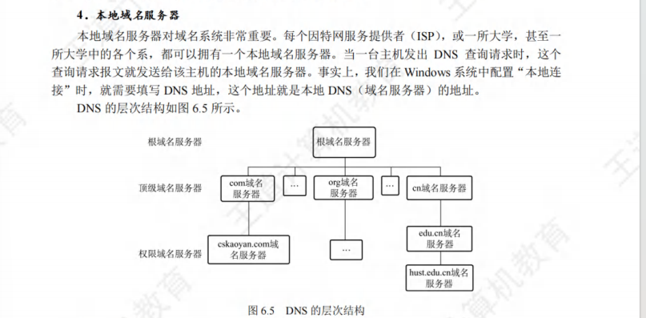

# 应用层

## 1. 网络应用模型

* C/S模型
* P2P模型

## 2. 域名系统DNS

域名系统的意义在于将人们记忆的域名，转换成IP地址

* DNS采取C/S模型，使用UDP，采取53号端口

### 2.1 层次域名空间

​​

域名有以下特点

* 不区分大小写
* 除了'-'不能有其他标点符号
* 每个标号不超过63字符，组成的完整域名不超过255字符

​​

顶级域名由ICANN管理，后续的域名由拥有该域名的组织自行管理

### 2.2 域名服务器

域名服务器负责执行域名到IP地址的解析

* 根域名服务器，是最高层次，本地域名服务器自己无法解析的时候，首先求助于根域名服务器，主要是告诉本地域名服务器去哪个顶级域名服务器找
* 顶级域名服务器，负责管理在该顶级域名注册的所有二级域名
* 权限域名服务器，每台主机必须在权限域名服务器处等级，许多主机要在两台登记，权限域名服务器往往也充当本地域名服务器

  * 可以将其管辖的域名转换成IP地址
* 本地域名服务器，管理本地的映射关系

​​

### 2.3 域名解析过程

域名解析有两种方式

* 递归查询，是指主机向本地域名服务器的查询，然后本地域名服务器不知道的情况下，由作为客户向根域名服务器查询
* 迭代查询，本地域名服务器向其他服务器的查询，可能是递归，也可能是迭代

两者的区别在于，递归是把后续的工作都交给的新的服务器，而迭代是新的服务器告诉老的服务器，我应该是去哪里找

### 习题

​​

* 不知道在胡言乱语一些什么东西

​​

* C

​​

* D 要建立TCP连接HTML请求是TCP

## 3. FTP

FTP是文件传输协议

* 采用C/S的模式，TCP，用21端口

21端口是控制端口，等待用户进程发送链接请求，而从属进程用来处理用户进程发送的请求

FTP有两个并行的TCP连接，一个是控制连接，一个是数据连接

当控制进程接收到FTP用户的文件传输请求之后，就创建数据传输进程和数据连接，数据连接有两种传输模式，主动模式PORT和被动模式PASV

* PORT：客户端完成控制连接之后，随机开发一个端口，告诉服务器端口号，服务器知道之后，通过20端口和客户端开发的端口，发送数据
* PASV：客户端完成控制连接之后，让服务端随机开放一个端口，并告诉客户端，然后传数据

这个两种模式的选择权在客户端

​​

### 习题

​​

* 从应用层到物理层 答案是B

## 4. 电子邮件

​​

* SMTP是push的方式
* POP3是pull的方式

### 4.1 电子邮件格式

邮件有首部+主体，首部一般有三个部分，其中From和To是必填的，Subject是可选的

​​

首部和主体之间用一个空行进行分割

​​

**MIME**

SMTP只能传送7位ASCII的文本，而我们要传输中文或者其他二进制对象的时候，要先用MIME进行一步转换

​​

​​

### 4.2 SMTP

* 采用 C/S 模式，使用TCP，端口号为25

​​

### 4.3 POP3

* 采用C/S模式，使用TCP，端口号位110

​​

### 习题

​​

* A 浏览器和邮件服务器之间一般只用HTTP

​​

* B不加密使用明文

## 5. 万维网*

万维网WWW，定义了一个分布式，联机式的信息存储空间，一样有用的事物称为资源，并用URL标识，这些资源通过HTTP协议给使用者

万维网有三个标准组成

​​

URL的基本形式是

* 协议：//主机：端口/路径

### 5.1 HTTP

http是 transaction-oriented 的协议，HTTP是基于TCP，然后使用80端口

​​

​​

HTTP本身是无连接的，没有HTTP连接这个说法

HTTP是无状态的，用户的每一次访问不会影响下一次访问，但是在实际应用中，会用cookie来保存状态

HTTP可以采用非持续的HTTP/1.0和持续的HTTP/1.1

* 非持续连接 每个网页对象都要单独建立一个TCP连接
* 持续连接，可以在一开始建立的TCP上传输HTTP请求和响应报文

  * 又有流水线和非流水线两种

**HTTP报文**

​​

​​

## 习题

​​

* 先查看本地的DNS服务器

​​

​​

* DNS 的 RR

​​

​​

* POP3的端口是110

​​

* 前端领域大师

​​

​​

* 服务器的复用技术 tunneling 隧道技术（Ipv4转换成Ipv6） content delivery networks 分布式技术

​​

‍
