# 数据链路层

* 检错和纠错

发送方的网络层将数据包交给数据链路层，**数据链路层**通过物理层的服务将数据传输给**接收方的数据链路层**，接收方的数据链路层再把收到的数据给网络层。

## 0. 问题与目标

**需要处理的问题**

* 物理层传输的是比特流，链路层会将数据包做**界限区分**
* 传输过程中可能发生的错误
* 发送方和接收方处理数据速率的不同

显然不论解决哪一个问题，我们都需要增加一些数据，因此数据链路层将网络层提供的数据包，增加Header和Tailer，变成一个**帧 frame**

​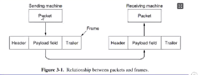​

接收方拿到之后再把Packet从Payload field取出来

**主要的任务（链路层提供点到点和广播服务）**

> 要和端到端区分开来

* 封装成帧

  * 接受方要从连续的bit流中能把一个个帧区分开来 帧定界 / 帧同步
* 透明传输

  * 链路层或许会采用一些方法来实现其需要的功能，例如为了实现帧定界，其可能会要求一帧里面不出现连续的5个1，但是这个操作应该由链路层自己实现，对于链路层的使用者来说不应该存在这种限制（任何机制不得影响到使用者）
* 流量控制

  * OSI的链路层存在这个功能，在TCP/IP中，这个功能移交给传输层，其主要在于控制发送方的发送效率，使其不至于淹没接收方的接受能力
* 差错检测

  * 包括两个部分，一个错误检测功能（针对错误，使用CRC）；另一个丢失，处理方法是确认重传

**提供给网络层的服务**

数据链路层可以根据需要设计不同的协议，不同的协议可能囊括了不同的服务，我们可以按需选择相应的协议。

常见的服务包括

* 无确认的无连接服务 Unacknowledge Connectless Service

  * 确认是指防止丢帧的功能
  * 该服务不对丢帧进行检查，也不会恢复，适用于错误率很低的情况，比如光纤传输；或者即时通信，直播等对实时性要求很高的情形，并且偶尔丢失关系不大
* 有确认的无连接服务 Acknowledge Connectless Service

  * 每一帧都需要单独确认，如果发送方发送一个帧之后再制定时间内未确认，则需要重新发送，适用于不可靠信道，例如无线系统 802.11 WiFi
* 有确认的面向连接服务 Acknowledge Connect-Oriented Service（要求的可靠性最高）

  * 在传输数据之前先建立一个连接，保证每个帧都有序，不重复地被接收方接收，传输结束后连接和维护连接的资源被释放
  * 为了保证正确性，双方需要维护一些变量和计数器，记录哪些帧已经收到了，哪些还没被收到。
  * 适用于长距离不可靠链路，例如卫星信道和长途电话

## 1. 包装成帧

成帧（Framing）的核心任务是设计一种方案，使得接收方很容易找到每个帧的开始（因为帧会被拆成比特流发送），从而能将比特流还原成一个个帧；同时不能占用太多带宽

**字节计数法 byte count**

​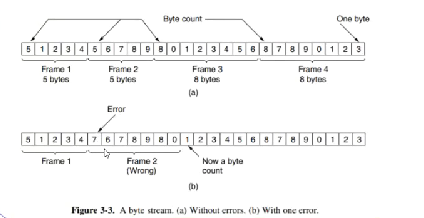​

每一帧的第一个字节表示这一帧有多少个字节（包括这个字节）

其缺陷在于，如果第一个字节这个计数值发生错误，即便接收方通过错误校验发现了错误，也无法知道下一帧开始的位置。也就导致了失去同步（get out of sync）

**标志字节法 Flag bytes**

​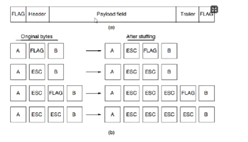​

就像我们在编写代码的时候，表示一个字符串就把它用双引号标记起来，这里我们把要发送的byte用Flag标记起来

如果我们要在Frame里面写入Flag，则在前面加一个Esc作为转义；如果要写入Esc，就在Esc前面写一个Esc作为转义。这种技术被称为字节填充 byte stuffing

如果内容里面大量出现Esc和Flag的话，会导致overload较高

**标志比特法 Flag bits**

​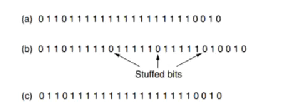​

这个做法需要我们以bit而不是byte发送信息，我们对发送的bit流进行处理，如果其中有连续的5个1，就在后面插入一个0。这个技术称为**比特填充 bit stuffing**

然后我们每个帧的开头和结尾用序列 01111110 (0x7E) 标志

相对来说 overload 会比较低

很容易以硬件实现HDLC协议中使用这个做法

**物理层编码违禁法 Physical layer coding violations**

当我们在物理层使用 4B/5B 或者 Manchester 编码方法时，有一部分信号组合是不会出现的，我们可以以这些不会出现的信号组合作为帧的开始和节数

这种做法的好处是我不需要填充数据，overload小，IEEE 802 采用了这个方法

## 2. 检错和纠错

* 如果我们需要排除丢失，那么我们需要确认
* 如果我们需要排除错误，可以尝试对错误进行恢复；也可以检查错误，然后重传

### 2.1 一些定义

**码字 codeword**

我们检查错误显然需要额外信息，假设我们有 m 个数据为存储信息，有 r 个冗余位（redundant / check bit）来校验，那么这个 n = m + r 的数据块称为 n 为 码字

**码率 code rate**

表示码字中信息位所占的比例，也就是 m / n

一般越高质量的信道code rate越高，噪声越多的信道code rate越低

**Hamming distance**

两个等长的码字之间不相同的位数称为这两个码字的海明距离

* 如果我们需要可靠的检测 e 个错误，我们需要海明距离为 e + 1 的编码方案。因为发生e以下的错误不可能把一个合法码字转换成另一个合法码字
* 如果我们需要可靠的纠正 e 个错误，我们需要海明距离为 2e + 1 的编码方案，因为发生了e以下的错误，你仍然是离正确码字最近的那一个

上述两个其实不会同时成立，我们的e是唯一确定的，因为如果e不确定，会发生错误的纠正

**编码方式的定义**

只需要知道实际做法属于哪一类即可

* block rate 函数计算
* systematic rate
* line rate

### 2.2 纠错码

纠错码常用于

* 无线链路，无线链路容易出错
* 单工信道，接受法如果检测到了错误也无法发出一个重传请求

**海明码 Hamming code**

> 比较重要，需要会算

首先我们有一个定理一样的存在，可以取得一个r的下界

假设我们需要纠正所有的 1 bit 错误，那么我们有m个信息位和r个冗余位，那么有 $2^m$ 个合法信息，每个信息都有 n 个非法码字，再加上它自身，有 $(n+1)*2^m$ 种情况，于是我们有

$$
(n+1)*2^m \leq2^n
$$

推导得出

$$
(m+r+1)\leq2^r
$$

Hamming code 是一种我们可以获得这个下界的方法，计算方法如下

​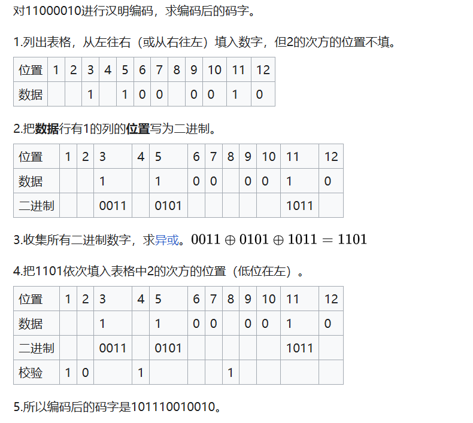​

上述Hamming code被称为 偶校验hamming code，而奇校验hamming code只需要把第三步得到的1101按位取反就行，得到0010

**卷积码 convolutional codes ***

> 似乎和物联网那边是一样的，下面的内容来自物联网

​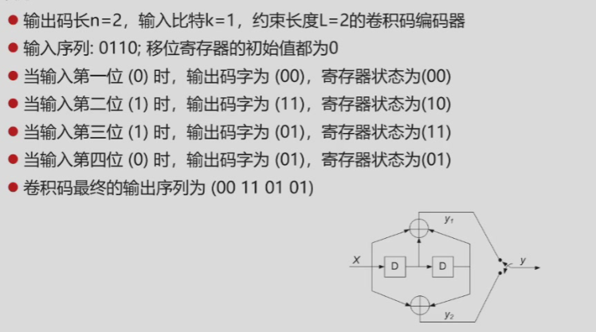​

一开始两个寄存器都是0 输入一个bit 输出两个bit

输入 0 寄存器 0 0 上下是两个异或操作 显然输出是 00 ，随后 <输入 寄存器1 寄存器2> 往右移动一格 显然寄存器还是00

输入 1 寄存器 0 0 输出 1 1 寄存器 1 0

输入 1 寄存器 1 0 输出 0 1 寄存器 1 1

输入 0 寄存器 1 1 输出 0 1 寄存器 0 1

这就是编码的过程

Trellis diagram

​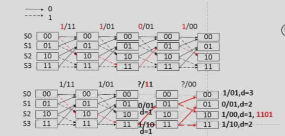​

首先列出寄存器所有的状态，然后画八条线 作为输入的不同情形 实线是输入0 虚线是输入1 寄存器数量等于记忆长度

一开始必定是00

> 下面是计网的部分

​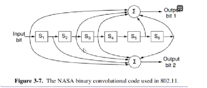​

内部存在状态机，解码还是找到最相近的东西

**其他编码机制**

里所罗门码 Reed-Solomon codes

低密度奇偶校验码 LDPC Low-Density Parity Check

上述两种加上前面两种里面，只有卷积码是线性码（因为其中有状态机），其他三种都是线性块码

> 什么是状态机，可以理解为一个函数，里面有static变量，也就是说相同的输入在不同的情况下可能有不同的输出

### 2.3 检错码

检错码常用于

* 光纤和高品质铜线，错误率较低，因此错误检测+重传机制很有效

下面介绍的三种检错码，都是线性的系统块码

**奇偶校验位 parity bit**

有 n-1 位信息，1 位冗余，加上这一位之后 1 的个数为奇数，称为奇校验码；偶数则为偶校验码

在奇偶校验的基础上，我们可以引入**交错校验 interleaving**，该机制可以一定程度上防止突发的若干bit的错误，将数据块作为 k 行 n 列的数据，每列计算一个parity bit然后发送

​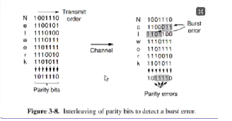​

**校验和 checksum**

奇偶校验也可以视作校验和的一个例子。其实就是对信息位数据做一些求和运算

我们这里再介绍一个例子 Internet Checksum，先将数据成16-bit的若干段，最后一段补0补到16-bit，将这些数据段相加，最高位 wrap around，最后将结果取反作为校验。

* checksum的结果不需要取反，加到frame里面需要取反

在检查的时候再次计算数据之和，然后与校验位相加，结果理应全是1

​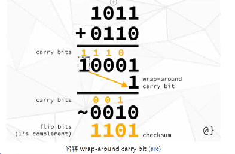​

**循环冗余码 CRC Cylic Redundancy Code * 需要例题巩固**

又称为多项式码 Polynomial code

首先两边要约定一个多项式，叫做生成多项式 Generator polynomial，这个多项式要满足最高位和最低位系数都为1

然后看看其最高位是多少，我们将要传递的码后面补多少个0，然后我们做二进制除法（不需要借位，0-1=1），我们将除法获得的余数加上原数据，传送过去，如果做了除法还有余数，就说明错了

余数位数和最高位一致

## 3. 流量控制和一些基本协议

### 3.1 单工协议

**乌托邦式单工协议 Utopian Simplex Protocol**

发送方从网络层获取数据包并构造一个帧，物理层发送帧；接收方唯一可能获取的时间就是FRAME_ARRIVAL

但是这种方案的问题在于，如果发送方发送帧的速度大于接收方处理速度，接收方就会被淹没 flood

**无错信道上的单工停-等协议 A Simplex Stop-and-Wait Protocol for a Error-Free Channel**

发送方发送帧，接收方接收到之后，返回一个ACK，接收方接收到ACK之后才发送下一帧，可以避免 flood 的问题

* 数据传输是单工，但是接收方依旧要发回消息，因此需要采用**半双工信道**

但是这种方案的问题在于，没有考虑出错的情况，如果有一个ACK丢失了，会导致双方陷入无限的等待中

**有错信道上的单工停-等协议 A Simplex Stop-and-Wait Protocol for a Noisy Channel**

在上一种协议的情况下，考虑三种可能的错误

* 接受到的帧有错误

  * 我们引入一个新的时间CKSUM_ERR表示校验和有误，接收方会检查之后发送正确和错误的确认
  * 发送方收到错误的确认会导致CKSUM_ERR的发生，需要重新发送上一帧，因此发送方需要有一个存储上一帧的缓存
* 发送方发送帧丢失

  * 我们引入一个TIME_OUT事件，在发送方发送帧之后维护一个计数器，如果在规定时间内未接收到ACK，则进行重发
* 接收方发送ACK丢失

  * 上述的做法只适用于发送帧丢失，如果是ACK丢失的话，重发会导致接收方接收到重复信息
  * 那么我们需要在每一帧都引入一个奇偶校验位（这一位成为字段seq），那么接收方就可以判断，这是重复的下一帧，还是说没收到ACK重发了

上述这种在肯定确认之前重传的协议叫做 **自动重复请求 ARQ（Automatic Repeat ReQuest） 或者叫 带重传的肯定确认 PAR （Positive Acknowledgement with Retransmission）**

### 3.2 捎带确认 piggybacking *

上述的单工协议中，如果需要确认的话都需要半双工信道，那么反向的信道如果只用来发确认显得很低效，那么我们采用这种设计。

当每次我需要发ACK的时候，我会等待一段时间，如果这段时间里，我有网络层的请求让我给发送方发消息，那么我捎带地发一个ACK进去；如果没有网络层的请求，那么我直接发送一个单独的ACK包过去

**看代码**

### 3.3 滑动窗口协议

在上述一发送一ACK的协议中，往往在等待传输到达和ACK到达的过程中带宽很低，发送一个帧的时间显然比帧到达的时间要短很多

因此我们引入滑动窗口协议，任意上课发送方要维护一组允许发送的帧的序号（seq字段，但是不止一个bit），成为发送窗口 sending Window；接受方要维护一组允许接受的序号，称为 接受窗口 receiving Window

这两个窗口大小不一定相同，但是是固定的

下面两种协议成为**连续ARQ协议**

**后退N帧协议GBN（Go-Back-N）**

该协议的核心在于，接受方采用累积确认传回的ACK为n，说明0-n的帧都已经确认了，从n+1开始的帧没确认，需要全部重传

我们假设用 n bit 来给帧编号（也就是说帧的序号最大是 $2^n$）

* 发送窗口满足 $1<W_T\leq 2^n -1$
* 接受窗口 为 1

当信道误码率较高的时候，其不一定优于 stop - wait 协议

**选择重传协议 SR (selective repeat)**

该协议的核心在于，接收方不采用累积确认，对于正确接受的逐一确认，丢失的不发送ACK，等待超时重传；出错的发送NAK，要求直接重传

我们假设用 n bit 来给帧标号

* 满足 $W_R+W_T\leq 2^n$
* 满足 $W_R\leq W_T$

### 3.4 信道利用率分析

* $T_D$ 是发送时延，也就是分组的长度 / 数据传输速率
* $T_A$ 是确认发送时延，也就是确认分组的长度 / 数据传输速率 往往可以忽略
* RTT 往返时延

**stop-wait 协议**

$$
U
=\frac{T_D}{T_D+RTT+T_A}
$$

**连续ARP**

$$
U=\frac{nT_D}{T_D+RTT+T_A}
$$

## 4. 点对点传输协议实例*

* LAN局域网
* WAN广域网

PPP协议是用于广域网中的点对点控制协议

## 5. 数据链路层设备

数据链路层的设备包括网桥和交换机

如果我们使用集线器扩展以太网，会使得冲突域无限扩大，网桥区分网段，每个网段都是一个以太网，可以组织冲突域的无限扩大

​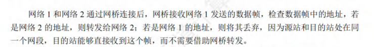​

**以太网交换机**

以太网交换机又称二层交换机，其实就是一个多接口的网桥，将网络分为更小的冲突域

对于用户而言，假设以太网的10Mb/s 每个用户的总贷款就变成了 10 / N 而交换机连接的时候没有这种问题，每个用户的带宽还是10Mb/s

​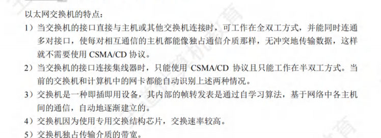​

交换机存在自学习的能力 通过交换表完成

**共享式以太网和交换式以太网**

* 共享式以太网使用集线器
* 交换式以太网使用交换机

当主机发普通帧的时候，Hub将帧转发到所有接口，各个主机根据自身的MAC地址和帧的MAC地址去接受和丢弃；而Switch，交换机收到帧之后会把帧直接单独发给目的主机（当自学习完成的时候）

当主机发广播帧的时候，效果其实是一样的，都往所有接口转发

多对主机同时通信，Hub会冲突，Switch不会冲突

## 常见题型

* 帧定界的各种方法
* 纠错检错的各种方法
* 流量控制与滑动窗口

  * 滑动窗口的大题

​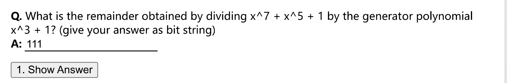​

* CRC检错 10100001 / 1001 并且要补上3个0，因为最高位为3，答案是余数

​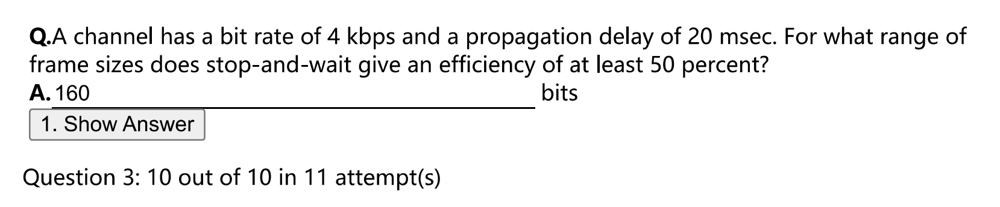​

* 滑动窗口的效率计算，注意 Propagation delay 的两倍才等于RTT

​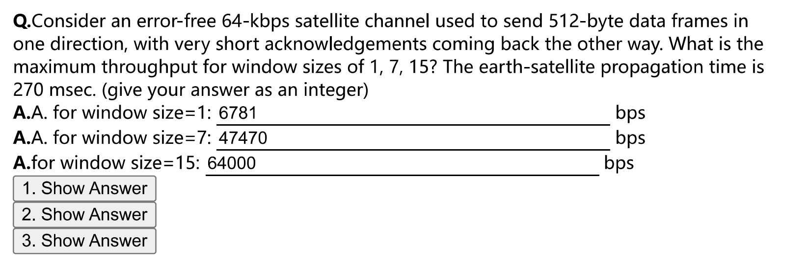​

* 效率计算的变体，变成了计算吞吐量，吞吐量就是发送的数据量 / 总得消耗时间，最终不会超过64Kbps，其实就是64Kbps*信道利用率，利用率不超过100%

​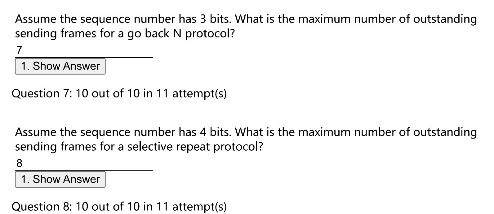​

* 两个窗口的概念

​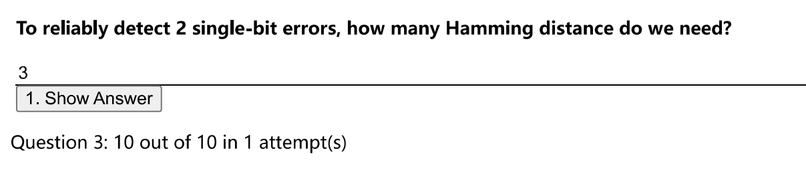​

​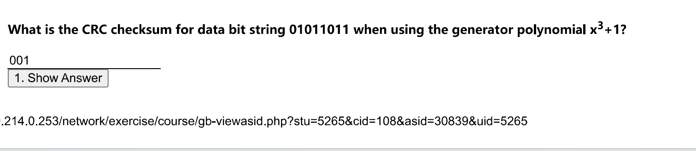​

* CRC检错码到底是怎么算的（要保留到三位）
* QJS Quiz 3 的大题 在王道中也有

​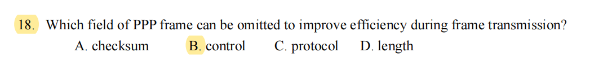​

* PPP的题目要去看看

* 在OSI中 链路层有 flow control 但是TCP的链路层没有

​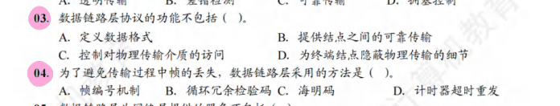​

* D 这是物理层干的 D

hamming code

* 检错 d + 1
* 纠错 2d + 1

​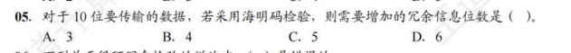​

* B

​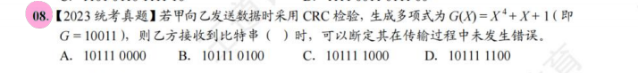​

* D 余数是4位 只要计算前五位，然后看看余数是否匹配即可

​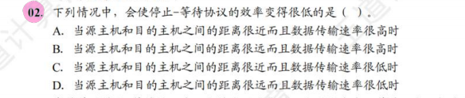​

* B

​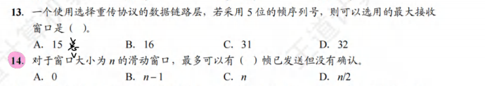​

* B B

​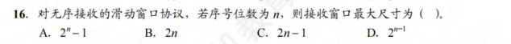​

* D 无序接受 就是 选择重传

​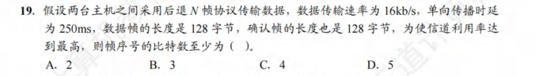​

* C

​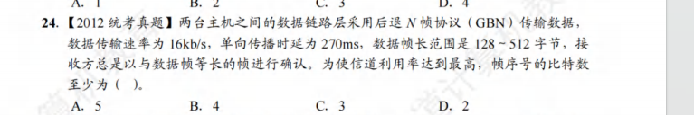​

* B 要基于128字节计算

​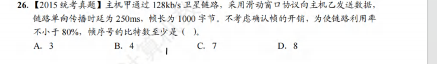​

* B

大题 P73

‍
