# 概述

* 注意byte和bit的转换

  * bps为bit

## 习题收录

​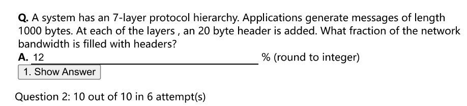​

* 120 / 1000 * 100%

​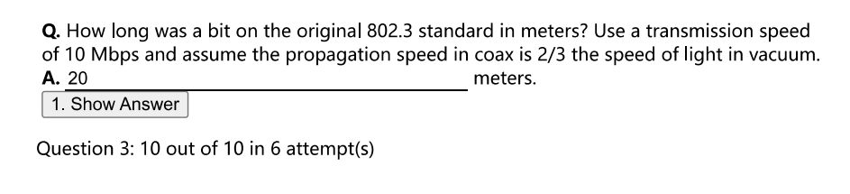​

* 传播一个bit的时间为 $1 / (10*10^6)=10^{-7}$ 传播速度为 $2/3*3*10^8=2*10^8$，两者相乘即为答案

​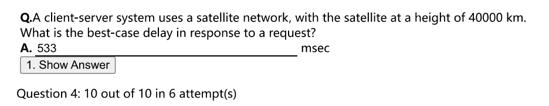​

* 客户端到卫星，卫星到服务端，服务端到卫星，卫星到客户端

​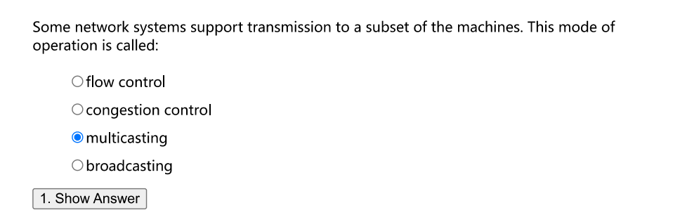​

* 多播的概念

​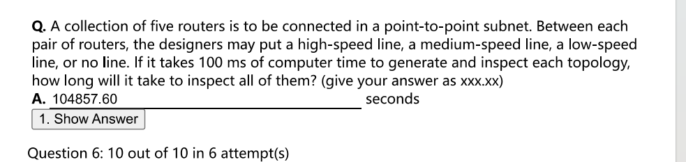​

* 5个路由器 10个链接，每个链接有4种可能，所以4^10*0.1s

​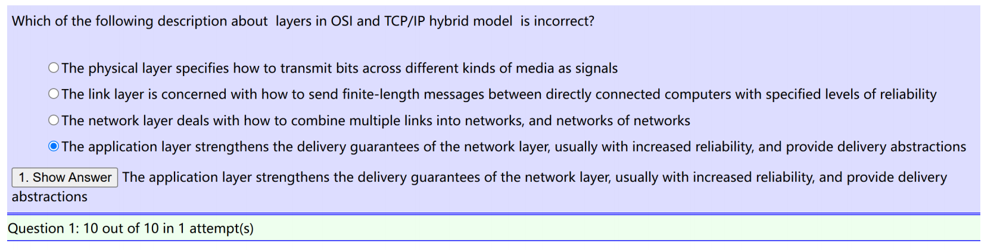​

​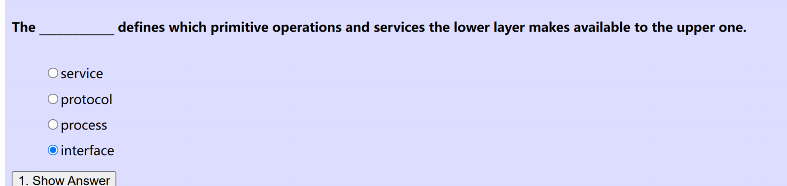​

​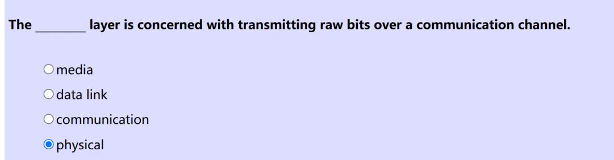​

​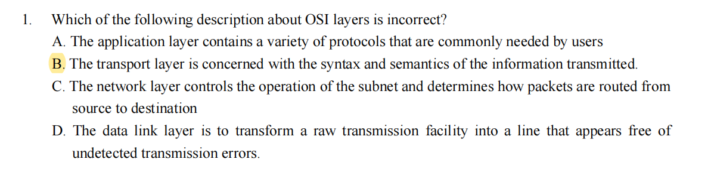​

​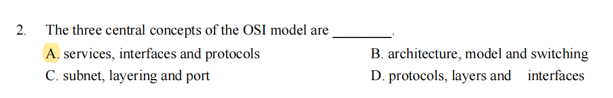​

​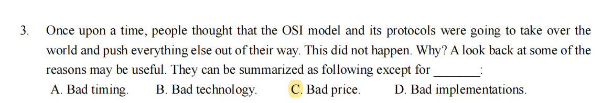​

​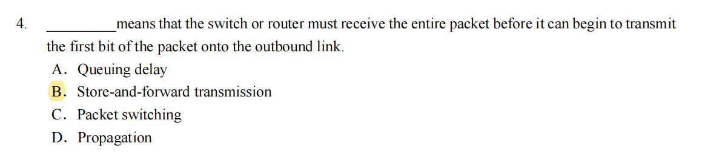​

* 计算机网络在逻辑上可以分为 通信子网和资源子网
* 电路交换 报文交换 分组交换

  * circuit switch
  * message switch 存储转发
  * packet switch 存储转发 但是要分组

​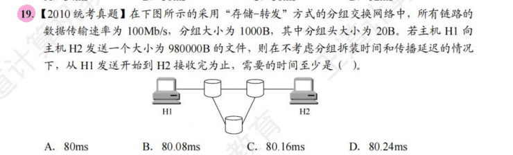​

* 980000B 1000 * 1000 B 10^6 B
* 8*10^6 / (100*10^6) = 80ms
* 第一个分组还要吃上 两个路由器转发的时延 0.08 * 2 = 0.16 ms 本题中没有传输时延
* 答案是C

​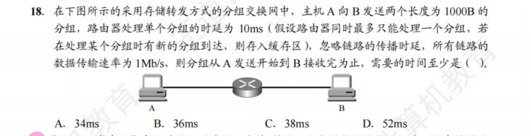​

* 绘图 B

​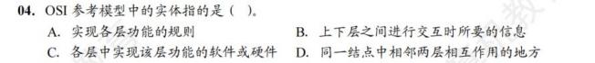​

* C

​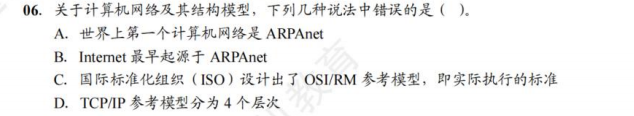​

* C 实际执行是TCPIP

​​

* B

​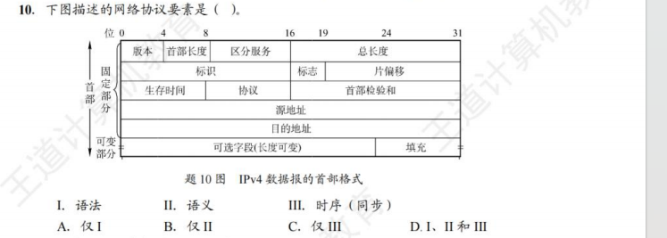​

* A

* 语法 是指 信息的格式
* 语义 是指 发出何种控制信息
* 时序 执行各项操作的条件和时序关系

​​

* D

​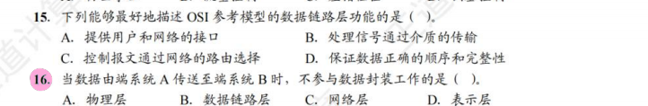​

* D A

​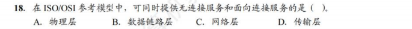​

* C
* 互联网采用的核心技术是TCP/IP

​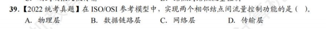​

* 相邻节点 是B

​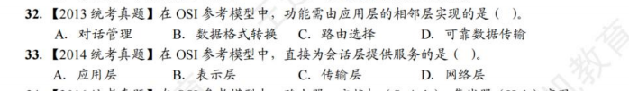​

* BC 传输 会话 表示 应用

‍
