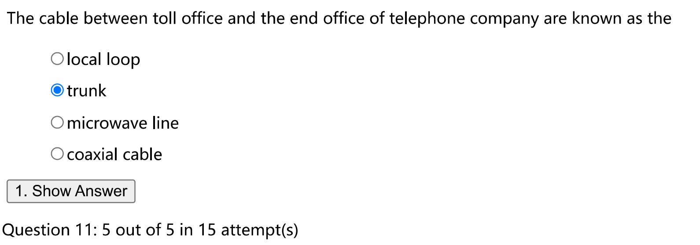

# 物理层

* 4B/5B 那一块全部要记忆一遍
* baund rate 和 bit rate的区别

物理层是实际数据信号传输的层，我们需要传输的信息总是偏向自然语言的，但是物理层内部的数据信号已经被处理成了易于传播的形式

物理层实际管理了数据传输的介质，比如光纤，无线信号等等，同时它需要对链路层形成抽象，对链路层是不知道数据以什么介质传输的。物理层确定了传输媒体有关的特质，进行约定

* 机械特性 电路接口形状，尺寸，引脚等等
* 电气特性 电压范围，传输速率和距离限制
* 功能特性 电压意义，每条线的功能
* 过程特性 工作顺序和时序

数据是传输的信息，信号是数据传输过程中的形式

## 1. **一些概念的定义**

一般在计网中 b 为 bit 而 B 为 byte

* link 物理上的链路
* channel 逻辑上的链路
* data rate / bit rate 单位时间内传输的信息中的 bit 数量，特指有效bit，单位为 kb/s 每秒多少kb
* symbol rate / baud rate 单位时间内传输的 symbol 数量，也就是可能发生的信号变化次数

### 1.1 带宽

**谐波拟合方波**，我们要传输的数据往往是二进制的，而二进制在波形上就表现为方波，同时我们可以用谐波去拟合一个方波，原理上就是做傅里叶展开。

基于上述知识，我们再来看一些概念

* 模拟带宽 / 截止频率 $f_c$ (analog bandwidth) 这是物理介质的属性，当传输频率大于该物理介质 $f_c$ 的信号时，会发生严重的衰减，因此需要控制信号的频率
* $0 \sim f_c$ 称为该介质的带宽

假设我们data rate是r，需要传输b bit的信号，那么周期就是 b / r 而 频率就是 r / b。然后我们知道我们的介质有截止频率，当我们用N的谐波去拟合的时候，需要满足

$$
N*\frac{r}{b}\leq f_c
$$

$$
N\leq \frac{b*f_c}r{}
$$

因为信号量和截止频率都是固定的，因此我们可以知道N和r成反比，谐波的数量表示了信号的质量而date rate表示了信号的传输率。我们一般需要固定N以保证一定的传输质量，因此我们往往会发现 $f_c$ 越高，data rate 就越高，在历史上我们也将 data rate 的最大值称为带宽

实际上，介质的带宽表述的是一个区间，并不一定是从0开始，对一个介质而言 $0\sim B\ Hz$的信号被称为基带信号 baseband signal 而 $S\sim S+B \ Hz$的型号称为 passband signal

### 1.2 码元

**码元/符号 symbol**

用一个数字脉冲表示的一个 k 进制的数字

在宏观层面上，一个数字脉冲就是表示 0 和 1，但是在实际传输和采样的时候，我们一个数字脉冲可能会被多位数字表示，例如我们可能表示为（低，中低，中高，高），就需要4进制，也就有0 1 2 3四种可能

**symbol rate / baud rate**

单位时间内传输 symbol 数量，也即单位时间内可能发生的信号变化次数

依旧以上述 4 进制码元为例，4进制码元需要2bit的数据来描述，若 64 kb/s  的 data rate，symbol rate 就是 32 kbaud

**Nyquist's theorem**

也称为采样定理，在理想低通的信道（无噪声，带宽有限）中，极限码元的传输速率是两倍带宽，超过两倍带宽的采样也无法获取更多信息。

也就是说最大的 symbol rate 是 2W，最大的data rate 就是 $2W*\log_2(V)$ 其中V就是码元的V进制，一个log就将进制转换成bit数量

**Shannon's theorem**

在受到高斯白噪声干扰的低通信通道中，用W表示信道的带宽，S表示信号平均功率，N表示高斯噪声功率，则最大的 data rate 为 $W\log_2(1+S/N)$  

**SNR**

信噪比 就是上述公式中的 S / N 单位为dB，例如 30 dB 表示的 $10^3$，如果给的是SNR的话，要注意单位 dB 需要做进一步转换

上述两个定理都是限制极限数据率，有噪声有两个限制，取最小，无噪声只有第一个限制

有如下例题

​​

## 2. 信息交互方式

* 单工链路 simplex link 只有1条信道，固定单向通信
* 半双工链路 half-deplex link 有2条信道，可以双向通信但是不能同时
* 全双工链路 full-duplex link 有2条信道，可以同时收发

需要注意的是，2 channels 并不意味着需要两个物理链路，一个链路可以通过一些复用方式实现双向传输

## 3. 传输介质 / 传输媒体

> 似乎不太会考

Transmission media：数据传输系统中发送和接受设备之间的物理通路

有两种分类

**导向传输介质 Guided transmission media**

* 磁介质
* 双绞线 twisted pair

  * 绞合的目的是减少相邻导线的电磁干扰
  * 在其外加一层金属丝编织的屏蔽层，可以进一步提高抗电磁干扰能力，称为屏蔽双绞线 STP Shielded Twisted Pair
  * 反之称为非屏蔽双绞线 UTP Unshielded Twisted Pair
* 同轴电缆 coaxial cable
* 光纤 fiber optics

**非导向传输介质 Wireless transmission**

其实就是无线传输

* 无线电波 Radio

  * 有较强的穿透能力，不需要对准某个方向，例如无线手机通信 WLAN（wireless local area network）
  * 有很强的方向性，直线传播，例如微波，红外线，激光

## 4. 数字调制

数字调制 digital modulation 是指数据和代表它们的信号之间的转换过程

### 4.1 基带传输 baseband transmission

其本质是对比特流的编码，其实和调制不算关系密切。

其直接将数据转换成数字信号，本身发送 0 1 方波是不可行的，其展开后频率为无限大，基带传输的选择是将无法发送的那部分直接使其失真。

其用于有线介质（光纤不是基带传输）

**编码形式**

* Non-Return to Zero （NRZ）直接将Bit Stream转换成高低电频

​​

* Manchester（以太网使用的） 将要发送的Bit Stream和时钟频率（一个周期内先低后高）做异或。解决了一个问题就是接受和发送方采样频率不一致的问题，比如我们连发了 10 个高电频，如何看出这是几个高电频
* 传输1的时候下降 传输0的时候上升
* 但是其缺点在于降低了编码效率，降低了一半的有效发送

​​

* NRZ invert （NRZI）（USB2.0 使用），相当于解决一半问题，其编码原则是，1的时候转变高低电频，0的时候不变，那么1的发送可以解决，而连续的0的发送依旧无法解决
* 但是解决了overhead过高的问题
* 实际上的NRZI完成了一个 4B / 5B 的映射，使得通过这个表编码，最多连续出现 3 个 0 ，增加了 25 % 的开销

​​

*  srambling 扰频：为了解决多个0和多个1的问题，在发送数据之前生成一个伪随机序列与其做异或再发送，接收方会生成相同的伪随机序列并用其解密
* 缺点是还是不能完全保证不会出现长 0 和 长 1，尤其是序列较短之类的情况，也可能被恶意用户攻击

**编码平衡性**

上述的编码形式都在解决开销和同步的问题，但还有一个平衡性的问题要解决

* Bipolar encoding （AMI）：0还是0，第一个1用+1，第二个1用-1，如此循环

​​

我们将短时间内正电压和负电压一样多的信号成为 **平衡信号 balanced signal**, 没有直流分量，在传输过程中有很多优势

**8B/10B**

这个编码方式是最平衡的，开销为 25 %，并且保证不会有 5 个连续0和5个连续1

### 4.2 通代传输 passband transmission

通过调制载波信号的幅值，相位和频率来运载数据，占据载波信号频率中心的一段频带。

用于**无线和光纤信道**

​​

上图中的 b c d 分别表示不同的**调制方式**

* 幅移键控 ASK Amplitude Shift Keying 用不同的振幅来表示 0 和 1 如b
* 频移键控 FSK Frequency Shift Keying 用不同频率来表示不同码元 如c
* 相移键控 PSK Phase Shift Keying 将载波波形偏移一定的相位，如d

  * 二进制相移键控 Binary PSK 将波形偏移 0 和 180 度
  * 正交相移键控 Quadrature PSK 将波形偏移 45，135，225和315度

但是上述调制方法是可以组合的

## 5. 多路复用

由于开销成本的问题，我们往往需要对一条物理链路实现复用

### 5.1 时分复用 Time Division Multiplexing

每个用户周期地轮流工作，在一个比较短的时间片里获得整个带宽，类似与频分复用

其有可能会增加保护时间 guard time 就是时间片与时间片之间的间隔

​​

TDM的调度方式较为机械，我们可以动态调整为 统计时分复用 STDM Statistical TDM，核心意义就在于给比较常使用的用户多分配几个时间片，但是需要额外数据做同步（接收方得知道是谁发的），技术上比较复杂

### 5.2 频分复用 Frequency Division Multiplexing

我们之前提到信道有带宽，带宽的基频是可以移动的，那么就是说我们可以把一个链路按照频率分成几个频带，要求这几个频带之间互不干扰即可

要求是每个频带之间要留出足够宽的距离，保证其不会重叠，这部分保护间隔成为 **保护频带 guard band**

​​

**正交频分复用 OFDM Orthogonal FDM**

每个子载波是正交的，每个子载波在其他子载波的中心的能量为0，只需要我们做到在中心点采样，我们就不需要 guard band，并且频带复用率很高

​​

### 5.3 码分复用

码分复用 CDMA，可以同时做到共享信号的频率和时间，将每个比特时间分为m个槽，称为码片chip

首先将每个站点指定一个m位的码片序列，所有不同站点之间的码片序列的规格化内积为0

当这个站点要发送1的时候，发送这个码片序列，要发送0的时候，发送这个码片序列的反码

## 6. 公用电话交换网络

[2: Physical Layer - ZhengliangDuanfang-计算机网络](https://zhengliangduanfang.github.io/T-ComputerNetworks/2-x/#23-pstn) 可以看看这边

* T1 是 1.544
* E1 是 2.048

## 7. 物理层设备

* 中继器 RP Repeater

  * 整形 放大 并 转发信号
  * 没有存储转发的功能，两边的网段必须使用同一协议
  * 互相串联的中继器最多只能有五个
* 放大器
* 转发器
* 集线器 Hub

  * 多端口的中继器
  * 半双工
  * 对于输入的信号整形放大，然后转发到除了输入端口以外的所有端口

## 常见题型

* symbol rate 和 data rate 的转换
* 已知信噪比，信号的进制，计算 data rate
* 通过编码方式和波形图进行相互转换记忆
* CDMA 的生成和抽取

​​

​​

* 考察频分复用

​​

* 经典CDMA抽取

​​

* trunk 常见电话网络要去看看，这题lkj那边也出到了
* T1，E1是什么东西啊

​​

* 这个东西 要展开看看 packet switch circuit switch message switch 和 下面这些的关系

​​

* 王道原题英文版

​​

* 以下哪些部分是光传输系统的一部分，B就是半导体激光设备

​​

* T1和E1，还有这个15题，电话网络的问题要去看看，这个王道里没有

​​

* 电话网络基于 circuit switching

​​

​​

* BD 关于baud rate 和 data rate 之间的转换关系

  * 以太网中 baud rate > data rate baud 占 0.5 个 bit
  * 9题中 data rate > baud rate baud 占4个bit的时候

​​

* 采样频率可以转换成带宽 8Hz * 2 * log16 = 64 ??? 采样频率转换成带宽要除以2

​​

* 看不懂的题目 C

​​

* A PCM 这块要理一理 A 8000  * 2 / 2 * log128 采样转换成带宽要除以2

​​

* B
* 16种采样可能

​​

* B提到了以太网，是半双工 C

​​

* B 要不还是背题吧

​​

* CC

​​

* A C

​​

* B

​​

* C

​​

* B

‍
