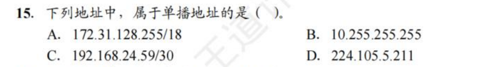

# 网络层

网络层是端到端的最底层，完成的是发送方到接收方的事情。对于一个网络通信任务而言，其中可能会经过很多节点，这些节点之间我们考虑链路层以下的事情，而网络层描述了这整个通信任务的开始和结尾

* 网络层可能会跨越不同网络

我们使用一些中间设备，可以将两个计算机网络连接起来，我们之前学习的

* 物理层的 中继器Repeater，集线器Hub
* 链路层的 网桥Bridge，交换机Switch

这些都属于中间设备，但是我们认为这些设备只是扩大的网络，这些设别连接起来的节点仍然属于同一个网络

而不同网络之间真正的中间设备，也是网络层所管理的设备，是**路由器Router**，为到来的跨网络数据包根据其目的地找到一条路径，并且对应地将其转发

在更高层还有网关 Gateway 这个中间设备

> 由于历史原因，路由器有时也被称为网关

路由转发的大概流程是，主机将数据包发送给最近的路由器，路由器store数据包，直到其完成到达并且链路完成校验，数据包会被转发给路径上的下一个路由器，直到其达到目标主机

除了将异构网络互联，通过路由转发之外，网络层还关注 拥塞控制（congestion control）和 服务质量（quality of service）等话题

## 1. 提供给传输层的服务

**无连接还是面向连接**

在设计网络层的时候，其实产生过要投入无连接还是面向连接的争议

* 面向连接更可靠（OSI主张这个
* 无连接更快（网络上的任何做法终究是不可靠的）

最后是采用了无连接，但是在发展过程中也引入了面向连接的特性，大家更加注重服务质量了，与此相关的两个面向连接技术是MPLS和VLAN

**屏蔽路由技术**

不论采用哪种服务，都应该屏蔽路由技术的具体实现方式，传输层可用的网络地址应该有一套可以跨越LAN和WAN的统一编址方案

**无连接服务的实现：数据报网络 datagram network**

我们在物理层讨论了三种不同的交换方式，而在这里我们采用包交换 packet switching 的方式

将每个数据包独立注入网络中，并且为每个数据包独立路由（对每个数据包都分别进行一次寻路）。在该方式中，我们将数据包称为 数据报 datagram，并且将该种网络称为 数据报网络 datagram network

在这种方式中，每个数据报的首部要保存起目的地址，路由器根据该地址进行寻路

​​

每个table保存了，我从自己到第一列的目标，需要先到哪里（第二列）

优点

* 网络造价降低，运行方式灵活
* 应对故障的能力强
* 不会独占某些电路
* 分组保持的源地址和目标地址

缺点

* 不保证，有序，可靠

**面向连接的服务实现 虚电路网络 virtual-circuit network**

也是包交换，不是给每个数据包选择一条路径，而是建立一个连接，选择一条固定的路径，需要这个连接的都走这个路径

为什么叫虚电路，是因为这个连接并不存在，只是逻辑上存在

每个连接有一个连接标识符 connection identifier（下面的1，2这些东西），这种方式中，每个数据报不需要保存目的地址，而是保存 connection identifier，建立完虚电路之后，电路里的节点都保留着该VCID，而我们传输的分组也有VCID，根据这些内容就可以完成路由转发了

​​

虚电路的优点

* 可靠，有序
* 对于长时间的频繁数据交换存在优势
* 分组内部没有目的地址，包含VCID，也就是虚电路号

缺点

* 虚电路需要建立->传输->拆除，有开销
* 一旦其中一个节点或一条链路出现了问题，整个虚电路都无法使用

> 要注意的是，网络传输中是否有确认，和网络层的选择没有任何关系

* MPLS 似乎不考

**两种网络的比较**

​​

其实就是各有优劣

**SDN Software Defined Network 似乎不考？**

**拥塞控制**

* 注意和链路层的流量控制做一个区分
* 开环控制，一种静态的控制方法，在设计网络的时候就规定好，而中途不修改
* 闭环控制，一种动态的控制方法，实时监控网络状态，基于反馈环路的设计

## 2. 路由算法

路由器的功能就是 **路由 routing 和 转发 forwarding** 。

* 路由就是根据特定的路由算法来构造出路由表，同时不断进行更新维护
* 转发就是根据到来的数据包内容查询路由表，并从合适的端口转发出去

路由算法一般可以分为两种

* 静态路由 static routing / 非适应性算法 nonadaptive algorithm  简单且开销较小，在拓扑变化不大，路由选择清楚的场合很有用；但是不会动态调整也就无法应对故障和优化路由
* 动态路由 dynamic routing / 适应性算法 dapative algorithm 能够改善网络性能，有助于流量控制，受故障影响小，但是算法较为复杂，会增加网络负担，如果变化太快容易引起震荡，变化过慢会影响路由一致性

​​

最优化路由的结果一定是一颗树，其实就是每个路由建立起自己的slink tree就行了

**shortest path**

这一部分主要有两个内容，一个是我们如何去衡量一个path length

​​

另一个就是找最短路，就是Dijkstra算法

​​

**Flooding**

就是当我们收到一个包，我们把包向除了其来的那个端口以外的所有端口，都发一遍

How to damp the flooding process

* 我对数据包维持一个数，每经过一跳将这个数减一，直到其为0的时候将该包丢弃
* 我对路由器维护一个来过的数据包的信息，当有个数据包又一次来到的时候，我们将其丢弃

Flooding的坏处是开销大，好处在于它几乎肯定能找到对应的路径（只要有可用的路径）

**Distance Vector Routing / Bellman-Ford Routing**

每一个节点维护一个表，维护的是我到某个节点的最短路是多少

​​

当我们需要转发的时候

比如J要到F，我们让J所有相邻的节点，把它们的表发过来，我们观察一下这些相邻的表哪个离F最近（当然还要计算上J到该相邻节点的距离），进行转发

我们将这种和邻居交换信息得到结果的算法称为收敛 convergence

* 更新最佳路径的缺陷

首先，我们假设有ABC三个点，$A\rightarrow B\rightarrow C$，首先A从B那边交换得到信息，我能从B到C；然后这时候B到C的链路断了，此时B再进行查询，它会发现A那边记录着一条到C的链路（它不知道这条链路是否通过了自己），它又以为自己可以从A到C，此时就发生了错误

**Link State Routing**

‍

## 3. IPV4

IPV4是当前使用的IP协议的一种

### 3.1 IPV4 分组

​​

这个分组的格式有一些需要记忆的部分

* IHL 首部长度，占4位，以4B为单位，例如其为15的时候最大，那么首部此时为60B，最常见的情况是5
* Total length总长度，占16位，指的是首部和数据部分之和，$2^{16}-1$
* identification：标识一个IP数据报，由于IP数据报本身往往大于链路层帧的大小，因此IP数据报会被拆分成片，我们要确认一些片是否属于同一个IP数据报，就依赖这个字段
* DF=0时，允许分片
* MF=1，表示后面还有分片，MF=0，表示后面没有了
* Fragment offset 13位，表示该片在原数据报中的相对位置，以8B为单位，因此分片的时候必须是8B的整数倍

**分组分片**

上述很多部分的设计都是为了IP报的分片机制，MTU表示了对应链路的一个最大传送单元

​​

‍

### 3.2 IPV4和NAT

互联网早期采用如下分类的IP地址机制

​​

除了上述分类机制以外，我们还存在一些特殊的保留机制

* 主机号全为0的，表示本网络本身
* 主机号全为1的，表示该网络的广播地址
* 127.x.x.x 的地址，称为 loopback test 表示该主机自身
* 32位全是0，表示该网络上的该主机
* 32位全是1，表示对整个TCP/IP 网络的广播，而实际上被限制为对该网络的广播

**NAT机制**

NAT是将专用的网络地址转换成公用的网络地址，首先在上述的分类中划分出了一系列的私有IP地址，然后通过一个路由器将本网络的私有地址转换成公有地址进行交流

那么我一个网络的私有地址，可以转换成一个公有IP进行通信

​​

这部分私有地址可以在各个私有网络中重复使用

NAT在转发的过程中，会修改源地址

路由器不转发任何目的地址是私有地址的包

### 3.3 划分子网和路由聚合

划分子网就是将主机号进行再划分，变成了三级IP地址，网络号：子网号：主机号

而子网掩码就是表现了这个网络的多少位被划分成了子网号，将IP地址和子网掩码按位与，就获得了这个IP地址的网络号

**CIDR**

CIDR是指无分类路由选择，顾名思义，就是消除了原有的划分A类B类地址，再划分子网的方式，直接将IP地址变为网络前缀+主机号

CIDR采用斜线记法，例如128.15.32.5/20 表示其前20位是网络前缀，其所在的CIDR块表现如下

​​

当然我们要求，一般主机号全为0和全为1的地址不使用

当我们有一个CIDR块的时候，如果有需要，还可以向下划分子网，从主机号中取几位即可

**路由聚合**

当我们使用CIDR的时候，在路由表中应当选择最长前缀匹配

**动态划分子网**

动态划分子网的关键在于每个分配的长度不一致，并且前缀也不一致

但是只要出现两个长度一致的，就会导致无法再划分下去

### 3.4 ARP

* 网络层协议

IP包真正传输到目标局域网的时候，需要转换采用MAC进行寻址

因此需要有一个协议把IP转换成ARP，每台机器有一个ARP高速缓存，当我们需要从A主机向B主机发包的时候，

* 先查看A的ARP缓存
* 若没有，则用MAC为全为F的帧进行广播ARP，此时整个局域网里的机器都会受到包，B若在该局域网中，就会向主机A发出ARP响应分组（单播发送）
* 若目标机器不在本局域网中，此时主机A找到路由器的ARP，后面的操作让路由器完成（后面的源地址和目的地址都有路由器代理）

查询ARP是广播，响应是单播

### 3.5 DHCP

​​

* 应用层协议 基于UDP

动态主机配置协议，为主机动态地配置IP地址，采用客户/服务器模型

* 需要IP地址的主机进行广播
* DHCP服务器受到的这个广播包之后会给其发一个应答报文

  * 首先在数据库中找这个主机的配置信息
  * 找不到就从IP池里面找一个IP地址给它
* 客户端返回一个确认
* 服务端返回一个确认

这上面的联系都是广播形式做的，因为此时客户机还没有IP地址

DHCP允许网络上有多个服务机，客户机只会选择最早到达的服务机响应

​​

### 3.6 ICMP*

* 网络层协议

是为了达到有效转发IP数据包和提高交付成功的目的

ICMP有两种报文，差错报告报文和询问报文

* 差错报告有以下几种形式

​​

* Destination unreachable：路由器找不到目标IP地址，或者数据包的DF位被置1但是它比前面网络能处理的最大大小要大
* Time exceeded（超时）：数据包因TTL（生存时间）计数器达到零而被丢弃

  * ​`traceroute`​ 会利用这个特性，将TTL从1开始每次递增1，这样路径中每个路由器都会依次向主机发送 Time exceeded。
* Parameter problem：在数据包头部字段中检测到了非法值
* Source quench（源抑制）：主机收到此消息时，预期会减慢发送速度。

  * 由于会使拥塞更严重，目前不会使用它。
  * 现在拥塞控制主要在传输层进行，使用数据包丢失作为拥塞信号。
* Redirect（重定向）：路由器使用此消息告诉发送主机，数据包被错误路由，应该更新到更好的路由。

* 存在一些情况，不应该发送差错报文

​​

* 询问报文有4种，回送请求和回答报文，时间戳请求和回答报文，地址掩码请求和回答报文，路由器询问和通告报文

ICMP的应用

​​

### 3.7 习题收录

​​

* B 最长前缀匹配

​​

* A，B为私有地址（A类地址的广播），C私有地址（CIDR的广播），D是D类多播地址

​​

* B，A为C类地址，主机号全为0，C是回环地址，D语法错误，256>255

​​

* A 只有NAT会改变源地址和目的地址

​​

* A 有5位的可操作空间，最多划分3位给子网，主机号最少要留出两位，否则就只有全0和全1

​​

* A

​​

* B 本网络一次 + N个路由器N次

​​

​​

* D 使用路由聚合

​​

* A 在DHCP中，0.0.0.0就用作源IP地址

​​

* D 全由路由器进行代理

​​

* BB 动态分配路由
* PING是用的是ICMP询问报文
* Tracert 使用 ICMP 超时报文 差错报文
* ICMP数据包放置在IP数据包的 payload 中，IP数据报的 protocol 字段为1，指示它是ICMP数据包。

## 4. IPV6

IPv4地址到现在已经基本被耗尽，我们需要转向更新的IPV6

IP的地址从 32 位 到了 128 位

IPv6的设计有以下特点

* 首部长度固定，可选部分放在有效载荷重
* 支持即插即用，不需要DHCP
* 支持资源的预分配，包括实时音视频的要求
* IPv6只有主机才能分片，是端到端，不允许中间路由器的分片
* 增加了安全性

IPv6和IPv4不兼容，但是

### 4.1 分组

​​

​​

​​

### 4.2 IPv6地址

### 4.3 从IPv4向IPv6过渡

* 双协议栈，在同一台机器上配置两个协议栈
* 隧道技术 tunneling，将整个IPv6数据报包装成IPv4数据报的数据部分，当其离开IPv4网络的时候，转交给IPv6网络

## 5. 路由协议

整个互联网采用的分层次的路由协议，现将其划分成一个个小的自治系统：AS，在自治系统里可以选择各种协议，成为内部网关协议IGP，而AS和AS之间则是采用外部网关协议，称为EGP

* IGP

  * RIP和OSPF
* EGP

  * BGP-4

### 5.1 RIP

* 应用层协议 使用的是UDP

RIP中的路由器维护这样一个表项

* 目的网络，距离，下一跳路由地址

RIP使用跳数来描述到达目标网络的距离，也就是要经过的路由器的数量，路由器刚开始工作的时候，其只知道相邻路由器的距离为1，其会跟相邻的路由器周期性地进行交换，并更新路由信息，最终达到收敛

* 更新步骤如下

​​

​​

### 5.2 OSPF

* 网络层协议，基于IP，协议字段为89

OSPF向本AS的所有路由器都发送信息，用洪泛法，发送的信息是自己和相邻路由器的链路状态。只有当相邻路由器的链路状态发生变化了，才会发送信息

​​

### 5.3 BGP

* 应用层协议 基于TCP

每个AS需要选择一个路由器作为该AS的BGP发言人，BGP边界路由器

* BGP发言人要和其他的BGP发言人交换路由信息，首先要建立TCP连接，然后再上面建立BGP对话
* BGP发言人会交换网络可达性信息，这个可达性信息是达到某个网络要经过的一系列自治系统

### 习题

​​

* C 对于多分组的转发时延问题，第一个分组吃满时延，之后的分组只要吃一个时延即可

## 6. IP 多播

IP多播，顾名思义，就是一对多的通信，源主机只需要发送一份消息，仅在出现分叉的时候进行复制转发

能够运行多播的路由器称为多播路由器

**多播地址**

多播地址其实前面也涉及过，就是D类地址 224.0.0.0 到 239.255.255.255，该地址标志一个多播组，一个主机可以加入或离开这个多播组

IP的首部中会使用协议字段为2，表示使用IGMP协议

* 对于多播不产生ICMP差错报文
* 多播只针对UDP，TCP是一对一的连接

**局域网中硬件多播**

使用MAC多播地址进行多播即可

​​

我们在处理的时候，将IP地址的后23位转换成MAC的后23位

因为这个对应关系不是一一对应的，会有多个IP多播地址映射到同一个MAC多播地址，因此还会在IP层做一层过滤

**IGMP**

需要让路由器能够掌握多播组的成员信息，IGMP是让连到本局域网的多播路由器，知道本局域网中是否有主机参加或退出了某个多播组

​​

构建多播转发树，可以避免环路

## 7. 移动IP*

## 8. 网络层设备*

## 习题

​​

* 计算IP分片

​​

* 这题的答案真的唯一吗

​​

* 概念题

​​

* 注意主机号全为1不能用

​​

* 记忆题

* QJS Quiz5的大题

​​

* 内部网关协议 外部网关协议 静态路由算法 链路状态路由算法

​​

​​

* 路由算法和路由协议的基本行为

​​

* 传奇翻译题

​​

* 记忆概念

​​

* 路由聚合 王道原题

​​

* SDN 南向 是指下发路由表的接口 北向 是指编程接口

​​

* A

​​

* B 只知道如何路由到其他区域

​​

* B​

‍

​

* DA

​​

* D

​​

​​
