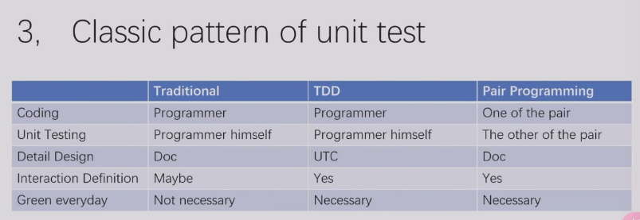
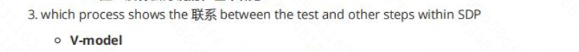
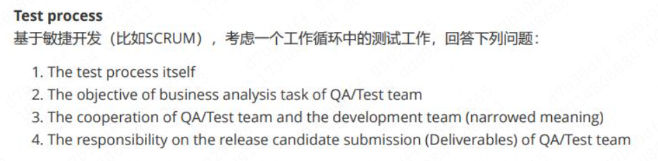

# 软件质量保证和测试

!!! note "软测PPT索引"
	大三上学的最不明所以的课程，虽然老师最后给分还不错，但是上课的风格以及模糊不清的作业要求着实让我不敢恭维。分数构成是一个作业加上期末考试，期末考试是开卷，因此我将PPT的索引放在这地方，相应的[PPT](https://github.com/hzeroyuke/ZJU_course_resource/tree/master/%E8%BD%AF%E6%B5%8B)在这里，根据本人的经验，首先期末每年的范围不同，这个索引可以完全覆盖我们那次的期末考试，但是未必一直好用，而且期末的考试时间非常紧张，很有可能抄不完，即使我们找的很快，大家记得把握时间，但是实际上期末可能批的非常宽。我们小组和一些其他的小组，组内拿到的分数非常相近，似乎小组作业才是拉开差距的关键。

* 4 质量的定义 Quality
* 5-7 McCall's Quality Model
* 8 什么地方引入了缺陷 50%requirement 30%Design 20%Implement/code
* 9 不同阶段修正缺陷的开销 cost
* 10-12 QA 和 QC 的区别 （QA 和 Test）
* 13-38 测试的分类 后面几页都是 反正只要有不认识的测试名称都来这边看看

  * 289 也有分类
* 14 - 17 白盒测试 黑盒测试 灰盒测试
* 19 - 21 UAT（User Acceptance Testing） 和 System Testing
* 23 V Model
* 24-27 Test 和 McCall's Quality Model 的关系
* 28-30 回归测试和冒烟测试 Regression 和 Smoke
* 31-35 a测试 和 b测试
* 37-38 Static test 和 Dynamic test
* 41 瀑布模型
* 44 V model
* 45-46 统一过程
* 47-54 敏捷 敏捷开发的最佳实践（Scrum， XP，CI，TDD）
* 55 Scrum

  * 306 Scrum 中 QA的工作
* 56 XP 和 TDD
* 57 流程
* 后面是产出物的逻辑
* 58-61 Traceability
* 62-65 Coverage
* 后面是测试计划的内容
* 67-70 test plan 的定义 设定范围（Scope）设定路径（Schedule）组织资源（Resource）
* 71-82 Scope 设定范围 iteration
* 83-88 Schedule 设定路径 需求分析 需求阶段QA的核心工作
* 89-97 Resource 组织资源 全功能提交团队 和 正常向提交团队 SDP周期的里程碑
* 后面是质量水平和软件度量
* 99-102 EC 和 AC 准出标准和准入标准 Exit Criteria 和 Admission criteria
* 103-110 软件度量体系 和 软件度量指标 Software quality factor（LOC FP ROI NPS）
* 111-113 圈复杂度 Cyclomatic Complexity
* 116-119 瑞利分布 Rayleigh distribution 缺陷发现 the daily number of newly discovered defects
* 后面是测试用例设计
* 123 Test life cycle
* 125 Test Case Design Workflow
* 127 Test Case Concept   test case 的定义
* 130 Test Case Design Objective
* 137 Test Case Design Method 设计test Case的方法
* 142 ECP(等价类划分) 和 BVA(边界值测试)
* 143-158 等价类划分
* 159-175 边界值测试
* 167 比较了等价类划分和边界值测试
* 176-193 Combinatorial Analysis(Pairwise)
* 后面是测试提交
* 197-201 测试提交的内容Scrum的提交 PSPI
* 202-203 测试提交所处的位置 和 Key Characteristics of a Potentially Shippable Product Increment
* 205 测试报告
* 207 报告的要素
* 213-218 描述重要的软件质量问题
* 221-227 Burn Down Chart
* 后面是Unit Test的内容
* 235-242 Unit test的重要性（尽早开展测试，透明度，自动化）
* 239 为什么要尽早开始测试Bring the test as early as possible
* 240 Make the white box test possible
* 241 Lower the threshold of test as possible
* 242 Make the integration as specific as possible
* 244 unit test 的定义
* 246 Who perform the unit test and when we do it 247
* 249-252 不同场景中的unit test（General Development, TDD, XP）谁来执行unit test（考场上遇到抄这部分）
* Detail design 是 unit test case
* ​​
* 248 里的图是TDD的
* 253-256 How to perform the unit test / best practice 提到了 mock
* 247-258 Unit Test 和 White box test 的区别 （会考的）
* 三种覆盖是白盒测试的方法
* 后面是三种覆盖
* 后面是往届PPT的内容
* 282-283 Testing 和 Debugging 的区别
* 284 三种覆盖的Venn图
* 298 V model 优缺点，和一些其他的内容 Document
* 311 Bug LifeCycle
* 313 test 和 debug
* 看测试执行，如何报告问题等等，可以看最后的测试执行部分
* 346 优先级和严重性
* 332 准入准出标准

**不在PPT上的部分**

* V model连接了Test和其他部分

​​

**不确定的内容**

​​

* What factors determine the priority of a bug.   QA确定的
* configuration management 和 version control区别
* 报告bug时，描述bug fix多紧急，多么难的两个item
* V model, waterfall 的 unit test 对应哪个 stage，这个 stage 的 inputs 和 outputs

‍
