# 中国书法史

!!! note "中国书法史"
	是美育课程，老师很有水平，讲课也算有趣，事情不多，学期中间就一篇类似观后感的论文，800字以内好评。期末考试闭卷，但是助教最后一节课会画重点，基本与期末考试正交，并且有PPT和录播，只要花一点时间复习，最后得分不会差，如果课都能认真听应该可以获得很高的分数。

## 书法史期末复习

考试内容

* 题型分布见PPT
* 上课讲的东西+课本部分章节
* *是相对不是很重要的东西

​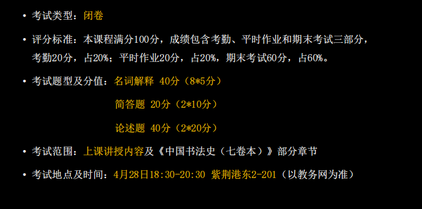​

**很可能会出那种是否所有出土文物都算作书法作品的题目**

* 书法的界限

**书画同源**

* 书法的用笔来作画
* 唐以后文人绘画的兴起
* 对于石头木等自然物质的抽象理解

**什么是经典，经典的形成**

* 需要经过时间的考验
* 魏晋南北朝到隋唐
* ‍

最优价值

​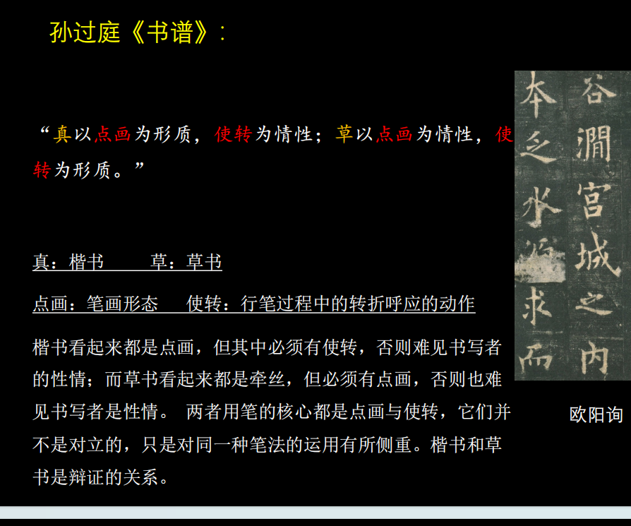​

PPT上的作品可能会拿出来靠论述题*

实际内容

### 书法艺术的性质和媒介

* **书法的定义**

  * 以毛笔为书写工具
  * 以汉字为造型的具象艺术
  * 也有一定的抽象性，在节奏和情感表达上，与音乐等艺术有共通性
* **用笔**的定义（书法最基本）：执笔和运笔的方法。

  * 唐代以前，往往五指有各自分工，唐代的“拨镫法”、“永字八法”都指向一种精巧而缜密的运用指、掌的方法
  * 后代，运腕，运臂甚至全身力道，也称为人们用笔的方法
* **结构**的定义 单个字的间架结字。也称“结体”、“结字”、“结构”、“间架”

  * 结字不仅是一种静态的平衡，也是用笔运动的结果
  * 笔画之间，结构单元之间的搭配关系和组织形式
  * 照应，顾盼，揖让，包裹都是对点画关系的描述
  * 点画构成结构，结构随着用笔的变化也充满变动
* **章法**的定义 

  * 完整的书法的篇章布局，包括各种起承转合，是人们欣赏书法作品的第一印象，也是用笔顺序展开的自然结果。
  * 用笔->结构->章法
* **临摹** 对古代书法范本的取法和借鉴

  * 书法的学习只有师古人，师造化是只有绘画才有，师古人就是所谓的临摹
  * 临摹又有实临（精准）和意临（根据文本内容和个人偏好来创造性临摹）
* **创作** 是基于临摹，通过临摹古人的方式，运用特定的书法风格或文本内容来进行书写创作。

  * 中国书法的创作几乎都需要依托于前人所“预设”的模式
* **书画同源*** -> 赵孟頫 -> 用书法的用笔来做绘画，中国绘画的写意性和书法很有关联
* **书法是一种什么样的艺术（书法的社会地位）**

  * 在中国，书法的社会地位高于绘画
  * 中国书法在中国社会生活中有广泛的运用，书法与实用脱不开干系，包括：公文，账簿，碑碣，书信等等
  * 到了明清时期，书法形制的进一步发展和丰富：手卷，对联，扇，匾，条幅，条屏
* **中国文字发展出书法艺术的条件**

  * 汉字形象是书法造型的基础
  * 锥形的，有弹性的毛笔有表现力
  * 逐渐形成了书写性的点画
  * 文字在中国人日常生活中的重要性
  * 书写的方便性
* **书法的媒介和工具** ——文房四宝 

  * 毛笔：分为有心无心笔（无心笔即不刻意收束笔心，只在原来的基础上将笔头变大）；羊毫软，狼毫是黄鼠狼 硬 ，兼毫，都有
  * 墨： 一般都是徽墨
  * 纸：宣纸，有生宣，熟宣  
    ​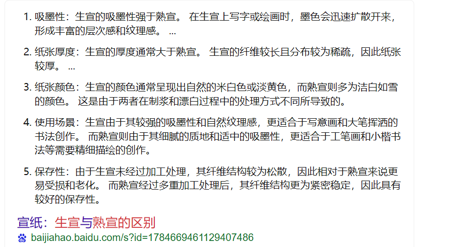​
  * 砚 ： 歙砚、端砚等

### 从字体到书体：王羲之以前的书法（甲骨文，金文，小篆，隶书）

* **字体**（篆书，隶书等等）和**书体**（颜体，欧体等等与个人风格有关）

  * **字体**是指篆书，隶书等，有基本的体式规定，有普遍的规范性和自己的审美特征
  * **书体**文字演变结束后，书写者为了追求个人风格而形成的具有强烈辨识度的体态特征，和风格相关，例如欧体，颜体等
* **甲骨文**  在商代的占卜活动中，由贞人锲刻于龟甲、兽骨上的文字，是中国最古老的文字。 

  * 多数情况下是先书后刻，材料和锲刻技术，影响到了甲骨文简直，瘦劲的风格
  * 记录占卜结果
* **金文**（钟鼎文） 商周时期在青铜祭礼器上的铭文，属于大篆系统

  * 是铸造出来的，章法比较错落，字形上大小不一，线条粗细不一，因为铸造工艺而显得圆转厚重
  * 歌颂祖先，王侯功绩
* **篆引***  画出一个线条，画出匀净、圆转而庄严的线条，即用毛笔画出点画和结构。使得文字从象形转向符号化，摆脱了图画的影响，成为了方便记忆和书写的文字

  * 画必须写，字却不可画。
* **小篆**和秦代书同文 春秋战国中六国的文字统一称为古文，统一六国后，秦朝推行书同文，转向小篆

  *  小篆的特点规整，婉转，通畅，匀劲的特点，用笔变得规整  篆书大家（清邓）
* 秦汉时期发生了**隶变** 从秦代开始在日常书写中出现了隶书，篆书向隶书转变的过程称为隶变

  * 就是简化了篆书的形态，化繁为简，化圆为方，纵势力也转变为横势（变扁平了），并产生新的部首偏旁和笔画（如撇捺）
  * 使用更加简便，文字进入了今文字时代，汉字与现代的汉字相似
  * 大篆小篆都是古文字，隶变是标志着古汉字演变为现代汉字的起点
* **隶定*** 

  * ​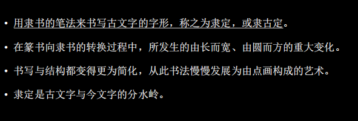​
* **汉代碑刻（石刻）书法**

  * 碑刻可能是在碑上，也有可能是在山上找一块石头
  * 东汉碑碣成风的原因：厚葬，注重人品，“举孝廉”的推举人才的机制（竖碑立传）
  * 曹操禁碑：汉末民不聊生
* **魏晋南北朝的碑刻**

  * 北碑是指北朝的文字刻石的统称
  * 魏碑，是北魏的文字刻石，北魏是北朝中碑刻之最，上承汉隶，下启唐楷
  * 北碑，魏碑，碑学，无名氏书刻遗迹等概念都是清代形成的
* **铭石体** 碑刻，青铜器，在文字形态上有滞后性（在新的书体和书法风尚流行的时候，铭石体常常仍使用更古老的书写和刊刻形式），因为需要别人刻上去 比较**庄重稳健**
* ​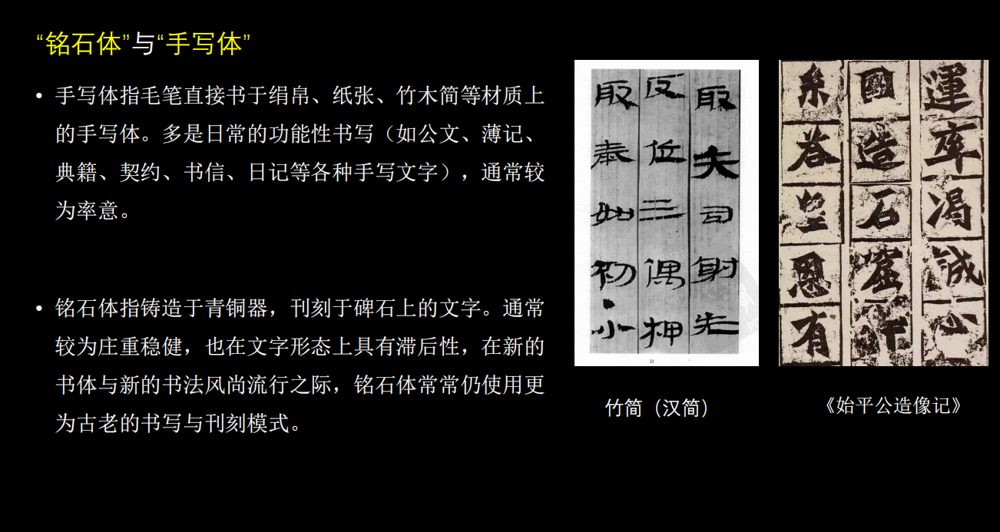​
* **手写体** 日常的书写于纸张，绢帛，竹木等上的书法作品，一般是日常的功能性书写，比如公文，日记等，通常比较**率意**
* ​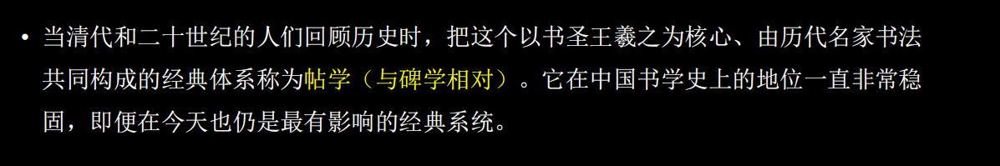​

### 从东晋王羲之到唐代诸家  行书，草书，楷书（经典的形成）

* **章草** 

  * 曹魏，西晋时期的草书，有一定程式化的草书，草写的隶书
  * 特点是字中有连笔，但是字与字之间不牵连，仍有隶书特点波磔。
  * 在王羲之之前 草书比较早的类型，有隶书特点尤其是捺笔，比较扁平
* **今草（小草）**

  * 汉末开始，对章草的革新，由东汉张芝（草圣）所创，到王羲之成熟
  *  隶书特点消失，字与字之间有牵连，波磔消失
* **二王的贡献和地位** 从他们开始，进入今体（新体）

  * 王羲之被称为书圣，《兰亭序》被称为天下第一行书
  * 二王在楷书，行书，草书上都有重要贡献，风格精致流畅
* **王羲之新体的特点** 重要

  * 用笔方面“一拓之下”，是赵孟頫对王羲之的总结；改变了汉魏旧法，用笔简练明快，更强调侧锋滑行的运用和节奏感，丰富了点画形态，更具韵律感，爱妍而薄质”侧锋多则妍美，出现了字组，就是连笔较多的一组字
  * 结构方面，在偏旁部件上形成了大小、高低、偏正的关系。
  * 章法方面，纵向笔势的扩张，字与字之间有勾连，突破了以往草书、行书以单字为造型单位的限制，出现了字群（字组）关系，不仅单字的点画之间关系更为连绵，字与字之间、行与行之间也更有呼应。
* **古今新旧的概念***

  * ​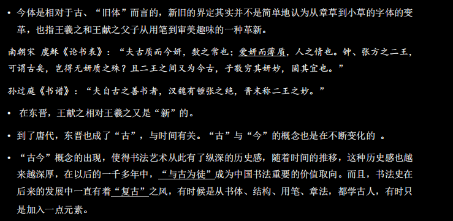​
* **狂草** 

  * 唐代张旭，怀素等人发展的一种草书样式
  * 连绵而恣肆，最具抽象性和表现性的书体
  * 内心的喜怒哀乐可以借此书法，对于外物的观照也可以借此体现
* **颠张醉素**

  * 是指张旭和怀素，两人都擅长狂草，并且性情恣放闻名
  * 张旭在二王传统的草书基础上开创新格，开创狂草之先河，被誉为草圣
  * 怀素，人称醉僧，和张旭共同创造了中国草书书法的又一高峰

* **唐代的楷书系统** 初唐四家+盛唐颜柳
* **颜筋（内在）柳骨（外在）**

  * 这个说法是指颜真卿和柳公权的楷书风格
  * 颜真卿的楷书浑厚博大，圆浑遒劲，精神内蕴，气象宏大，雄浑分割
  * 柳公权是强调外露的骨力，清劲遒美的风格，瘦劲，将书法作品比作人
* **筋骨**是早期书法理论中的重要范畴，二者分别指向内在与外在的力量感。
* **响拓**

  * 是指六朝到初唐的复制书法的方法，借助日光，人们构摹字形的外轮廓并且细心地填墨
* 唐代书论  关于书法的理论著作，比如孙过庭的书谱，不仅是书法作品，也是书法理论作品

  * 点画和使转
* 以王羲之为核心，称为帖学
* **经典的形成，什么是经典，经典是什么时候形成的**

### 复制、信札、题跋：宋元时期的书法

* **宋四家** 擅长行书 是谁

  * 苏东坡 崇尚意造 写字自然 扁平 “我书意造本无法，点画信手烦推求。”，崇尚个人领悟，不求完美和精工

    * ​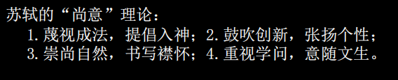​
  * 黄庭坚  将“拙”作为追求，并且纳入雅俗观念 耸肩字，有点斜 也擅长草书 瘦长  “凡病皆可医，惟俗不可医。”“雅俗”观念进入到了书法的品评

    语言中。
  * 米芾  个性强烈，典故颇多，书论方面作品很多  运笔爽利，有一定的速度，毛笔掌握

    * ​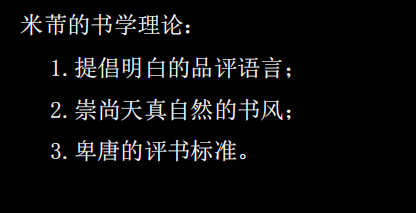​
  * 蔡襄  与唐代传统贴近，与颜真卿书法联系紧密，脚气贴->身体状态
  * 宋四家重新建构书法的传统，也突破了传统的禁锢
* **宋人尚意**

  * 以宋四家为代表的宋代书法家发展出的一种，以表现**个体情感与意趣**的书写倾向，与唐代人谨守严格的法度，强调师承家法，相映成趣。
  * 苏轼是书法尚意的领袖，书法展现出一种任性适情的自由
  * 重建了书法的传统，突破了唐人的藩篱，走上一条新路，书法展现出一种任性适情的自由
* 元代 赵孟頫 楷书四大家之一  欧颜柳赵

  * 每日勤奋于练笔
  * 崇尚晋唐书法，以复古为己任，在元代引领了复古书风
* **文人的艺术，文人对书法的话语权**

  * 中国书法中文人的话语权，书卷气是指书法家文化素养高低在书法作品上的体现
  * 宋代以前，书法的传承一直在世家内部传承，唐代因为战乱而导致门阀崩溃，书法凋敝
  * 宋代以来，欧阳修，苏轼，黄庭坚等人开始对书法重新定义，认定其为文人的技术
  * 一个书家如果没有丰厚的学养，那么即便书法功力再深厚，也无法跻身遗留书家，以及人品对于书品的联系
  * 这种学养被称为书卷气
* **书卷气**

  * ​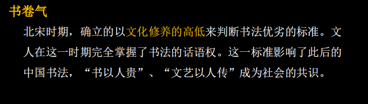​
* **题跋**：

  * 在这一时期变得繁盛，拓本与学术活动有关，题跋也成为画面的一部分黄庭坚跋《xxx》苏黄两人互相吐槽字体
  * 在书法，绘画，拓本上题写的文字，书画题跋大多涉及鉴定、递藏与欣赏，拓本则常常还与释文及学术考证有关。
  * 在历史发展之中，这些题跋也称为了原作的一部分，是中国艺术特有的样式
* 硬挺的笔锋，写出丝状的字
* 20:04时刻的内容
* **刻帖** 

  * 是一种复制的方式，将晋唐书法的原作钩摹上木（或石），经过刊刻、椎拓，获得的拓片就是刻帖
  * 宋以后，刻帖是学习书法的主要范本
  * 使得书法名作化身千万
  * 有一些弊端，编排的人会把后人伪造的东西加入，伪造的帖子进入，失真走样，不够精致
* **帖学**

  * 是指学习二王父子为中心的晋唐名家的书法为取法对象的学书途径一直绵延，到了清代碑学出现之后，相对的就称为帖学
  * 专指学二王，主要是行草书
  * 帖学擅长简扎的书写，整体上风格便捷流畅
* **信札**

  * ​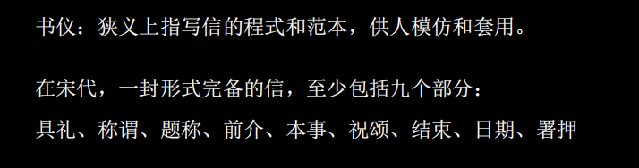​
*  ？**平阙**高高低低

### 职业化和视觉化：明代的书法

* **职业化**，会受统治者影响

  * **有两类**，职业书手和职业化倾向的文人
  * 前者努力工整，后者努力多样化
  * **出现背景**：江南地区经济发达，文化消费活跃，但是科举无法吸纳更多人才，大量文人滞留，依靠书法作品维生
  * **职业化的影响**

    * 书家技能和风格多样化，需要学会很多种字体和不同字体的不同风格的能力
    * 书家和画家集体出现在一些定制型作品中，如送别，祝贺等，促进了地方流派的产生
    * 伪造的盛行
    * 职业化需要较为稳定的个人风格，苏州书家都以学习文徵明时尚，获取经济利益的时候，创造性受损

* **吴门书派** 

  * 生活在苏州，江南地区经济发达，教育领先导致科举过剩
  * 是中国书法史上第一个地域流派
  * 风格上精雅和流荡互相激荡
  * ​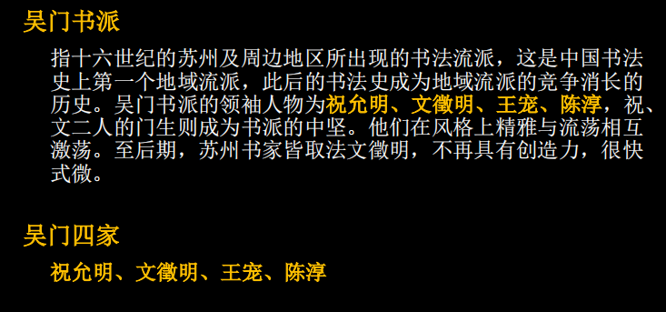​

* 明代晚期又有了**视觉化**

  * 奇的重视，多元社会，西方文化的传入，开始追求视觉上的奇
  * 建筑样式改变，房屋变高，要远观
  * 字帖变得很大
  * 用在高堂立轴上，字的尺度变得非常大，写字本身也变得很有表演性
  * 杂书卷册的流行，为了吸引观众，一本手卷册子里，用不同的书体，大小，风格，行款来完成
  * 大量是用奇字，来构建陌生感和新鲜感
* 小大之变 立轴书法，变大

  * 立轴书法变成最为重要的书写形式
  * 而经典范本基本都是寸以内的行草书，因此在临习的时候需要将范本上的字拓而大之
  * 最为深刻的变化，传统帖学发而中节的精巧趣味逐渐为整体感、气势与复杂的画面层次所取代
* **先熟后生**

  * 熟是指精熟，传统书学的基本要求
  * 生是指熟后生，熟是前提，在此基础上追求与范本不同的趣味，不及，不到位的趣味，是率意对作意的一种超越，有种清新之秀美
  * 清代碑学以后，人们摈弃了“熟”，而将“生”、“生拙”、“稚拙”作为新的美学追求，是在董其昌的基础上又向前推进了一大步。

* **访碑** 

  * 目的是正经补史
  * 寻找记录椎拓古代的金石文字
  * 抄录 访到的碑一般都是第一手资料，不容易出错，利于学术研究
  * 期间大量的金石碑发现传播，称为了书家的取法资料
* **拓本** 

  * 将纸张放在青铜器，碑石，帖石表面，通过椎击、墨拓的方式所获得的复制品，被成为拓本。
  * 有装裱和不装裱，有的字原版太大，会拓完之后剪下来
  * 是古代书法的载体，也是收藏和欣赏的对象
* **碑学**  碑学和帖学的概念在晚清康有为，有些观念山的紊乱

  * 广义上是指取法唐以前的金石作品，狭义上就是北朝碑刻
  * ​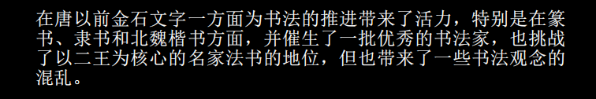​
  * 碑学中的关键是金石器  精致流畅（王羲之，米芾那类）
  * 访碑+学术，帖学的衰落
  * 碑学 的书法状态的改变
* **金石气**

  * 在清代碑学的发展过程中，人们正在青铜器和石刻拓本中感受到一种物质性的趣味
  * 残破，锈蚀，开始影响人们对于金石文字书写的理解
  * 开始放弃精致流畅和八面出锋，追求中锋和藏头护尾，厚重浑朴
* 碑学发展的理论推进悖论

  * 碑学的发展是帖学衰落的结果，帖学和古代书家真实的写法的贴合度收到之一
  * ​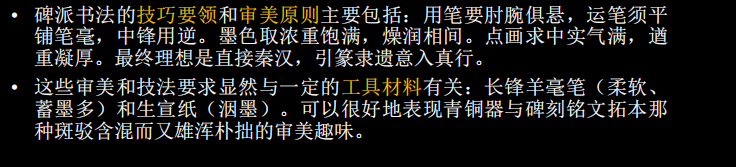​
  * 阮元：南北书派论等等
  * 悖论在于  古代究竟哪些不是书法

* 二十世纪  二王之外有书，什么书不是书，什么东西是书法

  * 大多为无名氏书法，延续了清代
  * ​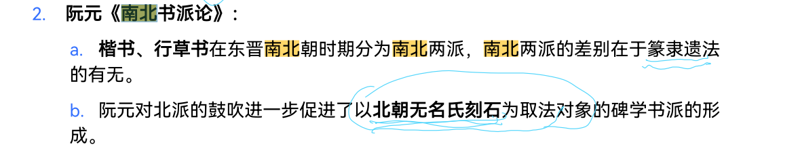​

### 清代的碑学的萌芽与崛起

**尚古之风**

对于晚明多有批评，顾炎武批评人多篡改古书，不从经典，因此人心邪

汤斌写了禁止私刻非传统小说的文章

反应在书法上就是访碑运动的兴起，开始寻访那些山林之间的古代碑刻

郭宗昌收藏拓本和印章

**访碑**

顾炎武后到北方访碑，对可读者都抄录，其弟子认为不仅有字词典雅还有字画精妙

顾炎武在访碑之后，也发掘了古碑书法的古朴残破拙美，古拙成了清代重要的审美趣味

碑学和帖学的发展，碑学对应非名家，帖学对应名家

但是顾炎武也认为，一味地借用古代用词，其实是很浅薄的

**疑经之始**

开始对于唐代三国批判，汉代的兴起

北朝留下了很多墓志铭

隶书较为整洁，少笔锋

《南北书派论》

唐太宗崇尚南派的王羲之

* 南派 疏放妍妙 王 赵孟頫
* 北派 中原古法 欧 颜

* 楷书
* 行书 王羲之
* 草书

宋代学者认为唐初书家都是王羲之派，但实际上也有北派

不能用兰亭序来概括东晋的所有的书法体系，但实际上阮元找到是当时的平民书法

* 隶书的特色
* 楷书的特色

阮元认为欧，颜都是从北派而来，北法为古，南派为皮，甚至美誉超过了王羲之

以前运笔有五种 对应五个手指

邓石如 篆书+分书+真书 落笔峻 行墨涩 五指齐力

何绍基 落笔特色

帖学和碑学

康有为：魏碑无不佳者，

* 碑学 起源很晚

  * 狭义是指 晚清以后取法北魏的书法
  * 广义是指  明末以后取法唐代以前

向出土文字学习书法（多为无名氏书法）均在碑学范畴之内

清代碑学对后代书法最大贡献之一是“二王之外有书的思想”

对于出土文字，我们需要思考出土文字本身的性质，因为它们本身是于那些保留下来的名家宫廷作品肯定是有区别的

民间书法的理论，存在被反驳的思考，什么是民间，区分日常书写和正式场合的书写
