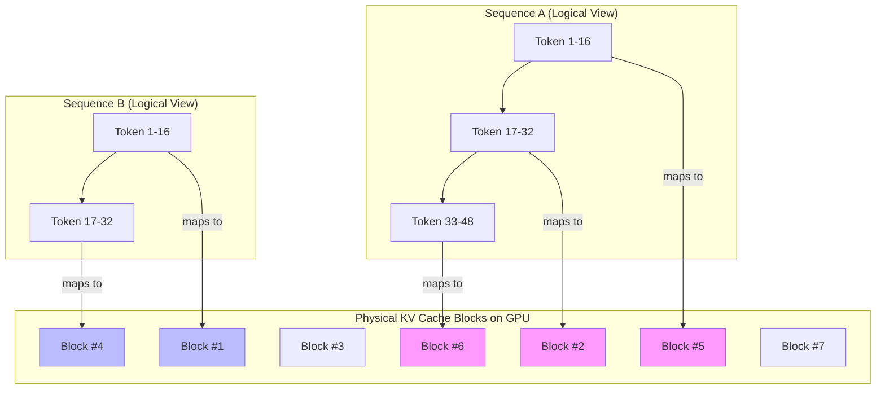
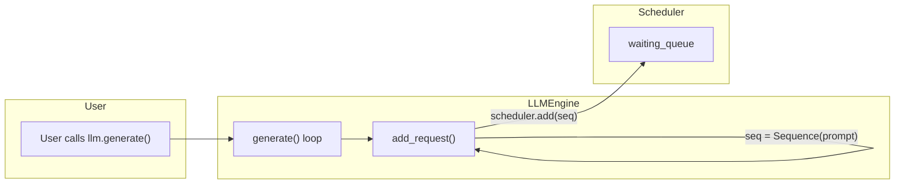

- [blog for nano vllm](https://github.com/yym68686/PurePage)
- [blog for vllm](https://www.aleksagordic.com/blog/vllm)

LLM的高效推理面临一些问题

- KV-cache随着序列长度线性增长
- 一个Batch中不同请求的序列长度不同，导致碎片化的问题

## 1. PagedAttention

pagedAttention就是在上述背景下提出来的方案，其背后的理念就是操作系统领域的分页机制，来实现高效的GPU内存使用

- 物理内存 -> GPU 显存
- 物理页帧 -> KV Cache 块 (Block)
- 页表 -> 块表 (Block Table)
- 进程 -> 单个请求 (Sequence)

KV-Cache块被分成了固定大小的block，请求使用的KV-Cache逻辑上是连续的，但是在物理存储上是离散的

为这个请求（在 nano-vllm 中称为一个 Sequence）创建一个空的块表 (block_table)。在 prefill 阶段，根据其提示（prompt）的长度，按需分配相应数量的 Block，并将这些 Block 的 ID 填入其 block_table。在 decode 阶段，每当序列长度增长，需要一个新的 Block 时，再从全局的空闲块池中取一个，并更新其 block_table。

除了分页的内存管理机制以外，nano-vllm还引入了很多os中的技巧，比如抢占式的进程调度工具，在vllm中就表现为抢占式的prefill，这部分由Scheduler完成，这也是vllm实现持续批处理的关键

## 2. ModelRunner

这是nano-vllm最核心的部分之一，涉及到核心的计算部分，PagedAttention主要应对的是KV-Cache的部分，而ModelRunner就是处理参数，激活值等部分

内部实现了多种机制，包括TP，Cuda Graph

## 3. 一个请求的流程

## 4. FlashInfer

FlashInfer和FlashAttention一样，都是Transformer模型优化的注意力Kernel，其中FlashInfer是vllm默认选择的内核，在对比中发现，在启动CUDAGraph的生产环境中，FlashInfer比FlashAttention更快

CUDAGraph是用于录制整个计算图，然后在GPU上一次性计算完成的特性，在没有CUDAGraph的时候，每个Kernel都要各自调用，系统在GPU和CPU之间来回切换，在有了CUDAGraph之后，就可以一次性将所有的Kernel发送到GPU进行执行。而FlashInfer对于CUDAGraph有更友好的设计和优化

## 5. Continuous Batching

相对于早期系统的static batching，静态批处理系统，动态的批处理可以在token维度维护一个batch，这样子可以让decoder阶段有一个较高的利用率

