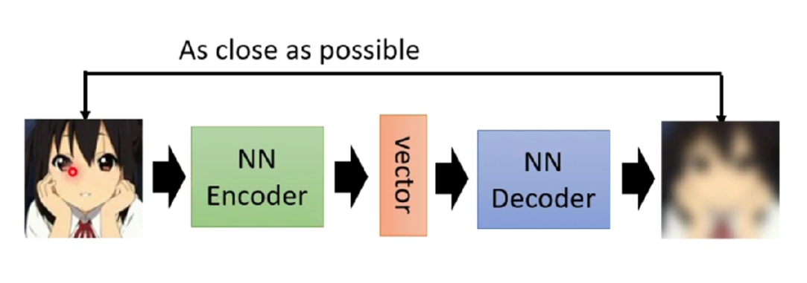
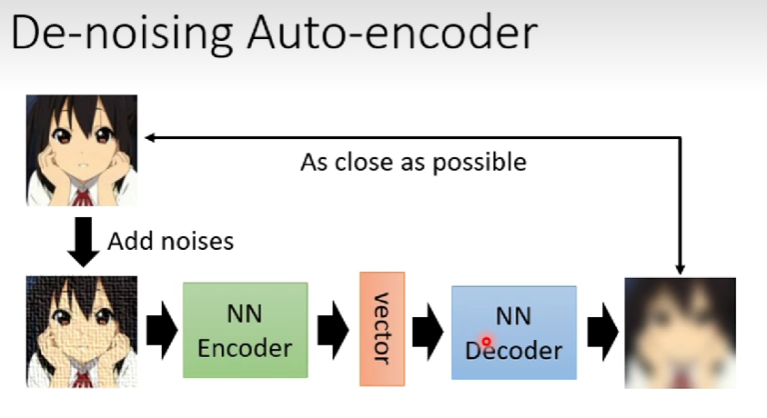
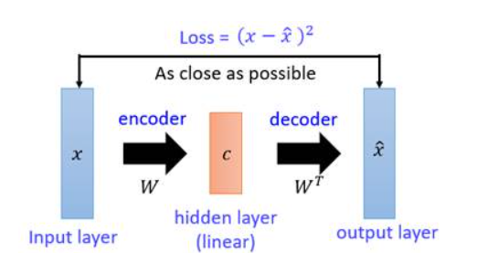
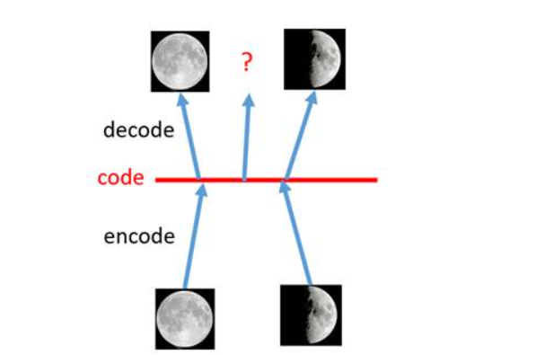
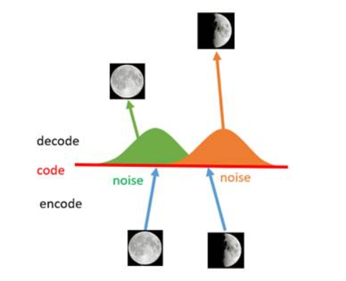
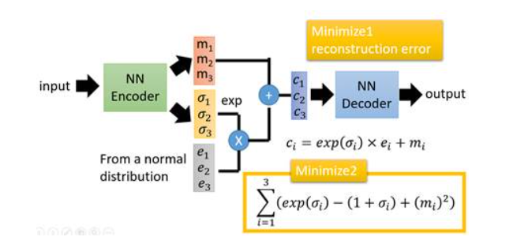

# Auto-Encoder

Auto-Encoder，简称AE，是通过两个NN网络，来训练一个Encoder，将一个比较大的输入向量，通过Encoder转换成一个维度比较小的中间Vector，然后用一个Decoder还原成尽可能与输入相似的输出。

​​

无序标注好的数据，理论上来说算是无监督学习的范畴

AE往往并不是我们的最终结果，一般会作为复杂模型的一部分，用于提高训练的质量

从理论的角度来讲，Encoder必定是有损失的，毕竟向量的大小就在于其表示力，但是现实生活中的图像也好，语音也好，都是有一定规律的，当我们随机生成一个图像/语音的时候，它们往往不是有规律的，既然有规律的数据，就可以有特征进行提取，也有了压缩的空间。

Auto-encoder也有一些变种，比如去噪的版本

​​

也可以利用在Feature Disentangle 特征解构中

## VAE

变分自编码器，在自编码器的基础上进一步做变分处理，目标在于发展AE的生成能力

除了AE以外，还有一种矩阵降维的方式，就是PCA，使用SVD来降维矩阵，这是一个纯数学方法。

​​

传统的AE，能够将特定的图很好地降维还原，但是如果我们需要把decode部分拿出去作为一个生成器，效果却是非常糟糕，非特定图片训练过的地方，生成的大概率是乱码，我们希望比如圆月和半月中间的点能够生成四分之三的月

​​

我们希望给数据增加一些特殊的噪声，使得图片不止是使一个点生效，而是影响一个区域

​​

那么上述的这种将图像编码由离散变为连续的方法，就是变分自编码的核心思想。以下这张图是VAE的模型架构

​​
