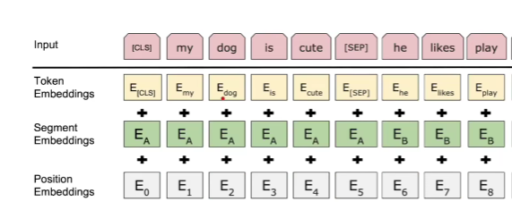

# BERT

《BERT: Pre-training of Deep Bidirectional Transformer for Language Understanding》

借由原始论文的标题可以看出，BERT借助了Transformer结构，并且是双向的结构

主要提到另外两个语言模型

* ELMo 是双向的，但是使用了RNN
* GPT 用的Transformer，但是是单向

那么由此提出一个双向的Transformer结构的一个模型

在应用于下层任务的时候，不需要修改自身的架构

对于之前的语言模型，都有一个特征是单向的，其只能通过前文去预测后文。而BERT进行了一些创新，设置一中mask技术，将语句中的一些词蒙住，让模型进行完形填空，在这个过程中就是所谓的双向的技术，也即从前文学习转到上下文学习。除了这个mask任务以外，BERT还预训练一个东西就是“next sentence predict”，大概就是在一篇文章里面找到两个句子，让模型来预测这两个句子是不是相邻的

BERT的模型优势在于其可以在大量的**无标记数据**上进行训练，就上面这两个任务，其需要的数据不需要人工的标记，可以自动化训练过程

**pre-training and fine-tuning**

BERT在预训练的过程中是在无标记数据中的。然后在预训练中获得的参数，会在下游任务，也就是那些有标记任务中参与训练，这个过程就是微调，获得一个新的可以利用的模型

Encoding的过程

​​

**应用于下游任务中**

BERT中使用的是只有编码器的Transformer

‍
