# CS236 Deep Generative Models

本课程的目标侧重于生成模型。

* 课程视频 [Stanford CS236: Deep Generative Models I 2023 I Lecture 3 - Autoregressive Models (youtube.com)](https://www.youtube.com/watch?v=tRArbBf-AbI&list=PLoROMvodv4rPOWA-omMM6STXaWW4FvJT8&index=3)
* 课程网站 [Stanford University CS236: Deep Generative Models](https://deepgenerativemodels.github.io/syllabus.html)
* 课程笔记 [Contents (deepgenerativemodels.github.io)](https://deepgenerativemodels.github.io/notes/index.html)

## 0. review for probability theory

设定一些基础概念

* $\Omega$ sample space 样本空间 random experiment 所有可能的结果
* $\mathcal{F}$ event space 事件空间 这个集合里的元素，都是sample space 的子集合
* 函数 $P: \mathcal{F} \rightarrow \mathbb{R}$ 满足

  * $P(A)\geq 0$
  * $P(\Omega) = 1$
  * 如果 $A_1...A_n$ 都是独立事件，那么 $P(\cup_i A_i) = \sum_iP(A_i)$

看一个例子有助理解

​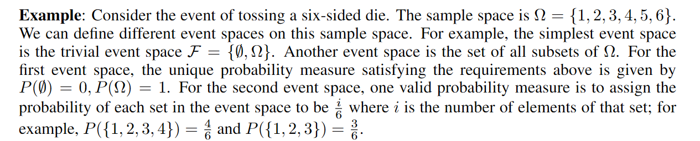​

一些常见的特性如下

​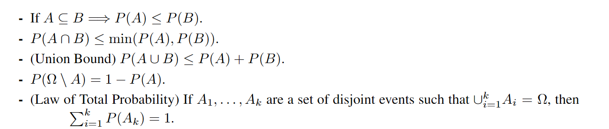​

**conditional probability**

条件概率是指，事件A在事件B发生，这个条件下的概率

$$
P(A|B)=\frac{P(A\cap B)}{P(B)}\ \ \ \ \ \ \ \ \ P(B)\neq0
$$

如果$P(A|B)=P(A)$ 则称两个事件是独立的

**random variables**

有时我们不直接关心样本空间的样本本身，而是关注其中的某种数值。例如假设随机试验是抛10个硬币，我们关心这次随机试验中硬币正面朝上的个数。这个“正面朝上的个数”就是一个random variable

$$
X:\Omega\rightarrow R
$$

我们通常用$x$表示random variable可能的值，random variable基于样本空间，其实是一种映射关系

在上述的例子中，假设随机变量的值为k，那么有$P(X=k):=P(\{\omega:X(\omega)=k\})$

根据随机变量的取值是否连续，可以区分成discrete random variable和continuous random variable

**CDF**

Cumulative distribution function 累积分布函数，该函数 $F_X: \mathbb{R} \rightarrow [0,1]$ 小于等于某个随机变量的概率

$$
F_X(x)=P(X\leq x)
$$

**PMF**

Probability mass function 概率质量函数，前提是离散随机变量，该函数 $p_X: \Omega \rightarrow \mathbb{R}$，直接表示离散随机变量该值的概率

$$
p_X(x)=P(X=x)
$$

**PDF**

Probability density function 概率密度函数，前提是连续随机变量，是指CDF在此处的导数，但同时连续随机变量并非一定有PDF

$$
f_X(x)=\frac{dF_X(x)}{dx}
$$

**Exception**

期望，对于离散随机变量，我们有PMF和一个任意的函数$g:\mathbb{R}\rightarrow \mathbb{R}$，我们估计$g(X)$的期望

$$
E[g(X)]=\sum_{x\in Val(X)}g(x)p_X(x)
$$

对于连续随机变量

$$
E[g(X)]= \int_{-\infty}^{+\infty}g(x)f_X(x)dx
$$

特殊情况$g(x)=x$，我们认为这个期望是 mean of random variable

​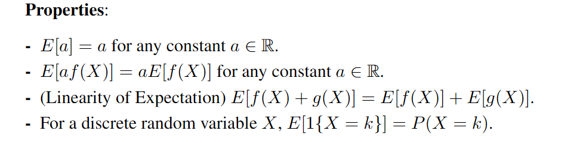​

**Variance**

方差反应随机变量再其均值周围的集中程度

$$
Var[x]=E[(X-E[X])^2]=E[x^2]-E[x]^2
$$

​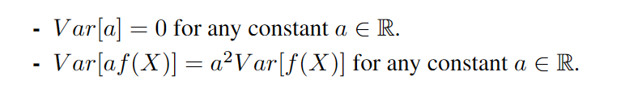​

**some common random variables**

有一些常见的random variables，例如对于离散随机变量的伯努利分布，对于连续随机变量的正态分布等等

​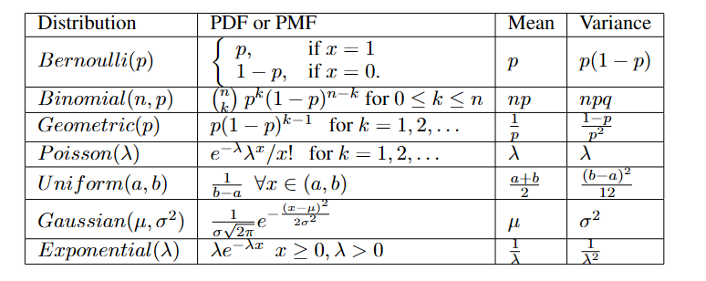​

**多个随机变量**

**joint and marginal distributions**

对于CDF

假设我们有两个随机变量，我们将其joint CDF，定义为

$$
F_{XY}(x,y)=P(X\leq x,\  Y\leq y)
$$

我们也可以从上述joint CDF中提取出marginal CDF

$$
F_X(x)=\lim_{y\rightarrow \infty}F_{XY}(x,y)dy
$$

类似于CDF，剩下两种描述function也有类似的联合和边际计算，对于PMF

$$
p_{XY}(x,y)=P(X=x, Y=y)
$$

$$
p_X(x)=\sum_yp_{XY}(x,y)
$$

对于PDF

$$
f_{XY}(x,y)=\frac{\partial^2F_{XY}(x, y)}{\partial x\partial y}
$$

$$
f_X(x)=\int_{-\infty}^{+\infty}f_{XY}(x,y)dy
$$

## 1. Introduction

> What I understand, I can create

当我们拥有一个图像生成模型的时候，我们也可以借此来完成视觉理解任务；生成模型总是能够很好地做到相反的工作

我们试想一种生成模型，我们有一个完整的样本空间，而需要生成的目标是存在一个底层的分布规律的，我们的生成模型就是去拟合这么一个分布规律

在训练模型的参数的过程中，我们的目标是缩小模型的概率分布与目标结果的概率分布之间的距离。

​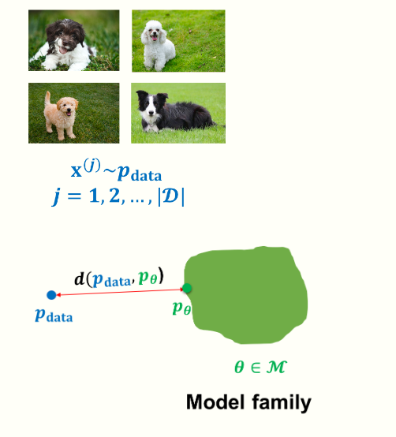​

$$
\min_{\theta \in M} d(p_{data}, p_{\theta})
$$

但是简单的抽象问题，实际上在上手之后又诸多困难。包括优化和数据目标选取之类的问题。对于一个生成模型，有以下推理基准

* Density estimation  狗的图片的概率分布与模型的足够相近
* Sampling  能够生成新的样本
* Unsupervised representation learning  可以学习到有意义的特征表达，用于特殊任务的学习

本课程的模型不涉及图形学结构，而只涉及概率分布。虽然在训练模型中我们同时依赖于数据和先验知识，但是在本节课中还是更关注于数据驱动

​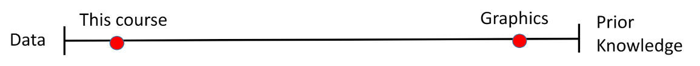​

生成模型就是去生成一个概率分布 $p(x)$

* Data: samples
* Prior knowledge 参数形式，loss function，optimization

控制信号就是可能是，图像描述，需要修补的图像等等

​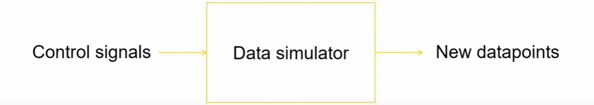​

## 2. Background

在这个基本过程中，我们需要

* 定义一个model family
* 需要一些 data
* 定义 loss function

**如何估计概率分布**

维度灾难是机器学习领域的问题，表述高维数据的概率分布是困难的。

我们先介绍一些简单的概率分布，例如伯努利分布，Categorical distribution

对于一个单独的像素，就是RGB都0 - 255，我们就有256 * 256 * 256 - 1个样本空间

**样本空间与参数的关系**

Chain rule 分解联合分布，这是自回归模型中最常使用的东西

​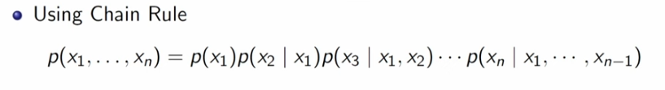​

无损失的分解如上，但是这个分解并不能解决指数爆炸的问题，我们所需的描述参数依旧是指数级别的

需要摆脱指数级别的参数，我们需要做出相应的假设，例如假设顺序的依赖，例如$x_n$依赖于$x_{n-1}$，而于其他的$x$独立，这就是马尔科夫过程的实践，比完全独立的更好，但是又可以实践

​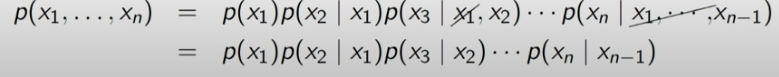​

但是这个假设在多数情况下还是过于强，相当于只根据前一个词语预测下一个词语，称为链式假设，我扩展这个想法，得到Bayes Network

​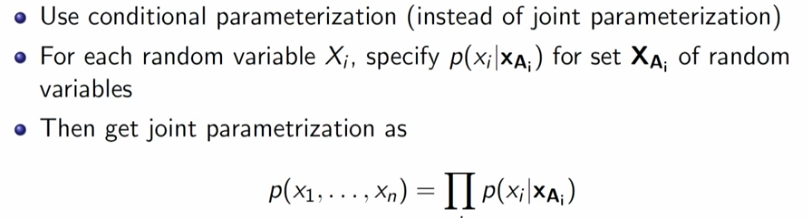​

来一个例子解释Bayes Network，将关联关系转换成一种有向无环图，我们之前的链式假设就是其中一种特殊情况，其是一种基于条件独立来简化复杂分布的做法

​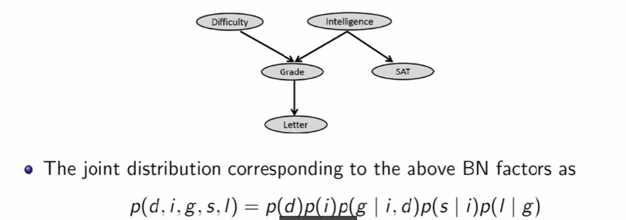​

$a\perp b$，表示a,b相互独立

判别模型总是在x与y之间的关系进行建模，而生成模型需要对整个数据x进行建模

​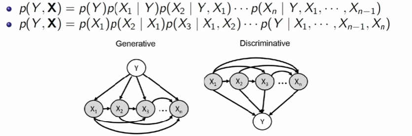​

Logistic regression

对于一个判别模型，我们给予他Linear dependence，可以步入我们熟悉的线性模型

如果要摆脱Linear dependenece, 我们可以转向Neural Models

## 3. Autoregressive Model

在自回归模型中，其会假设条件概率分布满足某种分布，例如伯努利分布

$$
p_{\theta_i}(x_i|X_{<i})=Bern(f_i(x_1,x_2,...,x_{i-1}))
$$

伯努利分布仅需要一个参数来描述其分布

​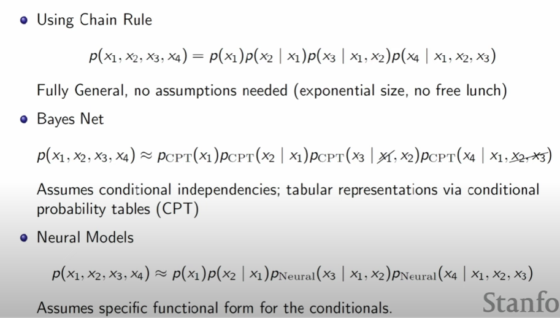​

在描述概率分布的时候，我们介绍了以上的方法，从最开始链式法则列表，用指数级别的参数去描述；在通过先验条件，去设计贝叶斯网络，降低列表法的参数，最后转向神经网络，依靠神经网络的函数去模拟映射关系

当我们需要转向生成模型的时候，自回归模型就是希望我们依靠已经生成的part来生成新的part，中间可以插入神经网络

举一个例子，我们需要生成手写数字的图像，我们依靠MNIST数据集合，我们需要建模一个28x28的随机变量集合

当我们使用自回归模型做生成的时候，总需要定义一个顺序，在文本生成中顺序是很自然的事情，而图像我们要自行定义，例如从左上角的像素到右下角的像素

**基于线性假设的Autoregressive Generate Model**

​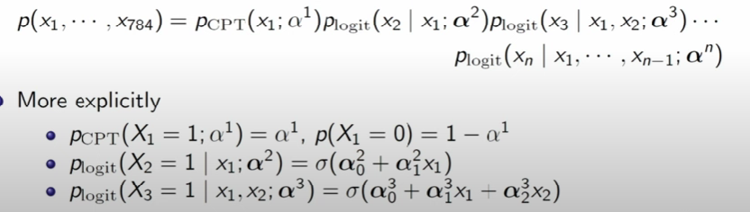​

上述基于线性假设，推导概率公式的状态，就是FVSBN fully visible sigmoid belief network

​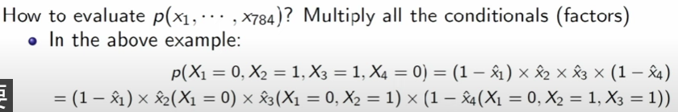​

随后我们对于顺序中的第一个像素进行随机生成，然后之后将进行链式推导采样

基于这种线性假设的模型，参数数量是$O(n^2)$，基于该种假设能够得到的效果基本如下，显然并非是足够优秀的结果

​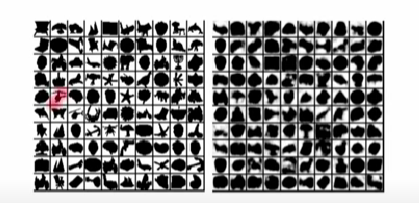​

**基于神经网络的 Autoregressive Generate Model**

我们使用单层的神经网络来替代线性关系

$$
h_i=\sigma(A_ix_{<i}+c_i)
$$

神经网络模型的参数级别基本是线性的，所有的part的参数都是最终的矩阵中的一部分，神经网络模型的假设就是，例如在图像任务中，每个像素点总是和其他的像素点有某种相关

**对于连续的数据建模**

上述的神经网络模型，预测的是0或1，也就是该像素是白还是黑，那么如何对于连续的数据进行建模呢。

在上文我们将神经网络的输出作为伯努利分布的参数，然后如果需要对连续数据建模，则需要采取其他的方法，例如将神经网络的输出作为多个高斯分布的参数，然后将多个高斯分布来拟合需要的函数。

​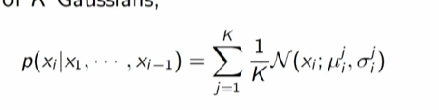​

**上述模型与AE**

上述模型在表面上和Auto encoder有点相似，Auto encoder就是将原数据映射到某种潜在表示，然后再通过一些神经网络，将其转换回原数据，我们会采取一些机制防止AE学习恒等变换

某种程度上确实和自回归模型有点相似，都是需要通过预测重建自身

**RNN**

​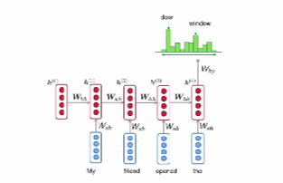​

根据循环去处理多个向量从而获得单个向量的表述，这个向量会表述下一个token应该在哪边赋予更高的概率。

但是问题在于其只能够这么一个向量总结所有的上文信息，也就只有这么一个向量会影响下一步的预测，并且RNN的更新并不能做到并行，训练起来效率较低

RNN其实也可以对于图像进行建模 Pixel RNN

**CNN**

pixel CNN，CNN在图像分类上做的很好，但是在生成任务中，为了匹配自回归模型的理论设计，需要让其无法看到后续的内容

​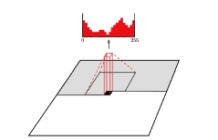​

**Attention based models**

​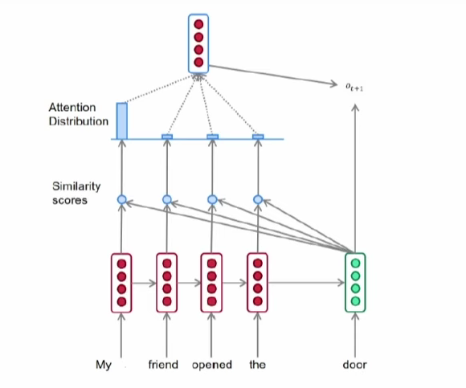​

注意力机制，基本上说我们可以动用整个序列，存储整个上文进行并行的相似度计算，转换成注意力分数之后，我们可以归一化到我们需要关注哪些元素，并且基于这个因素我们获取下一个token，然后再基于这个token我们再去预测下一个，形成自回归（如果要确保自回归的话还需要掩码机制）

## 4. VAE

自回归模型的困境在于，我们总是需要选择一个生成顺序，在某些生成任务中是简单的，有些任务中就让人疑惑。并且即便有Transformer这种很强大的并行工具，我们仍然生成速度比较慢，因为我们总是需要一个变量一个变量地生成，这是由链式法则本身的限制导致的。并且有些情况下我们难以做到无监督地学习，而我们在潜变量模型中可以比较好做到这一点。

在一些复杂的图像中，例如人像，其中总是有很多特征可以抽取，例如发色，年龄等等，但是我们没有如此高质量的数据集——同时包含图像和对应的大量特征描述，因此进行学习是有点困难的，我们在本章的做法是将这些特征提取为潜在变量 z

其实提取潜在变量就是Auto-Encoder所做的事情，通过提取的特征，往往使得我们做分类任务之类的更加简单。

潜在变量模型(Latent variable models)，能够推断underlying data中的隐藏结构，形成了VAE这种强大深度生成模型

在概率学的角度来讲，该模型用于处理观测变量和潜在变量之间的关系。在现实问题中，我们往往无法穷尽所有的相关变量，那么我们用潜在变量表述我们无法观测到的内容，并且假设我们的潜在变量和观测变量之间有某种变换关系。

$$
p_{\theta}(x,z)=p(x|z)p(z)
$$

其中 z is latent variables and x is observed variables

在现实问题中，我们有x的数据集合，那么我们希望获取最合适的x，z的联合分布

* 在我们获取z之后，学习$p(x|z)$会比直接学习$p(x)$容易得多
* 当我们的模型学习好之后，也可以从x反推z

我们还是会用神经网络建模特征的表达

​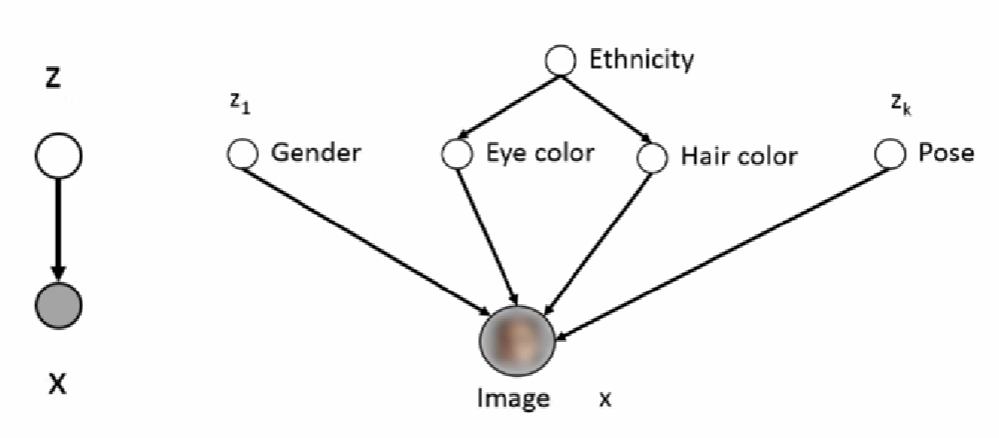​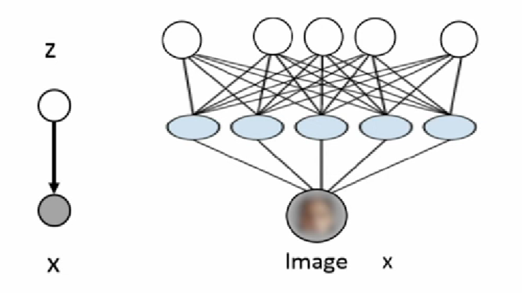​

‍

假设我们的模型是简单的混合高斯模型，我们可以发现数据的拟合近似于某种聚类关系，每个高斯分布都由均值和协方差描述，中间的小圈是均值而协方差大概是小圈的外延

​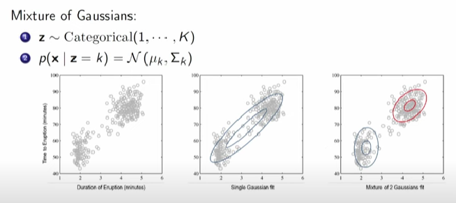​

混合模型的组合是一种很好的提高的表现力的方式

​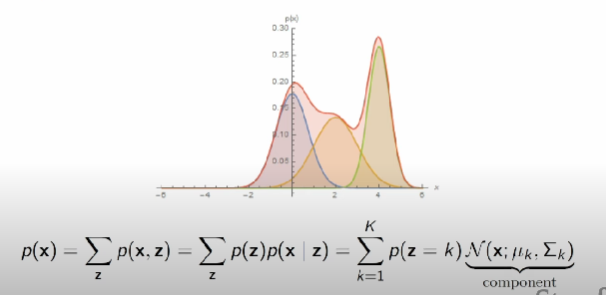​

上述高斯模型中的均值和标准差都是由神经网络表述的，VAE就是一个无限的混合高斯模型，我们可以通过神经网络表述这样一个混合高斯模型

VAE的概率表述非常简单

$$
z\sim\mathcal{N}(0,1)
$$

$$
p(x|z)=\mathcal{N}(\mu_{\theta}(z),\sum_{\theta}(z))
$$

但是上述问题在于，如果我们需要获取x的生成概率，我们就需要对z所有可能的取值进行采样（因为我们并不知道z的具体值），但是z甚至可能并非一个离散变量，那么我们就需要采用积分的形式，但是这种形式的积分是非常昂贵

如果我们还是采用最大似然学习

$$
\log \prod_{x\in D}p(x,\theta)=\sum_{x\in D}\log p(x;\theta)=\sum_{x\in D}\log \sum_{z}p(x,z;\theta)
$$

上述的计算在z的取值过多的时候会难以计算，于是我们需要考虑近似算法，我们可以尝试

* 将总和的计算转换为期望的计算，蒙特卡洛方法，但是在高斯分布的随机采样中，获得的$p_{\theta}$  往往很低，无法有效地表示期望
* importance sampling，上一个方法在实践上的问题在与随机采样并非一个好的选择，这次我们换一种采样方法再使用蒙特卡洛，我们基于某个分布$q(z)$进行采样

接下来这段变分推理是VAE的核心，当q分布满足，$q=p(z|x;\theta)$ 时，我们不再涉及到lower bound的部分

​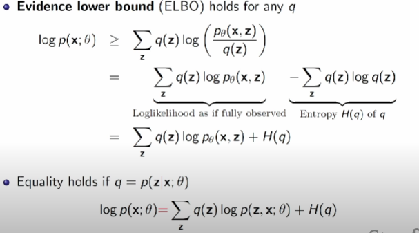​

介绍一下变分推理

​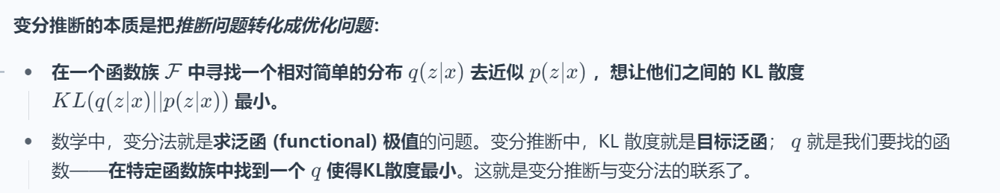​

我们假设有一个 variational family Q 其分布近似于 我们难以计算的 $p(z|x)$  

​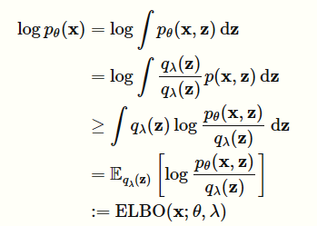​

上述推导中比较难懂的一步就是从积分转换成期望，回顾一下期望的表达式

$$
E[g(X)]= \int_{-\infty}^{+\infty}g(x)f_X(x)dx
$$

我们就假设$q_{\lambda}(z)$是$g(X)$，里面那个log公式就是表述$f_X(x)$

而我们可以证明，上述目标$\log p_{\theta}(x)$ 和最后的$ELBO$ 之间的距离，等于$q(z)$和真实的$p(z|x)$ 的分布之间的KL散度

我们可以通过优化这个KL散度来使得两者分布接近，KL散度的定义如下

​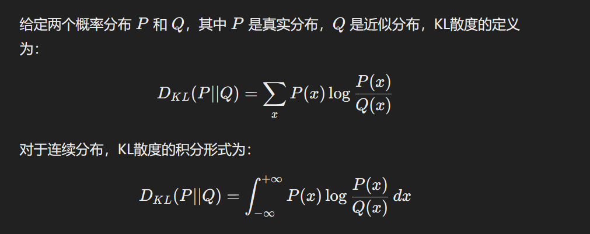​

最后我们将最终需要优化的目标转化为如下公式

​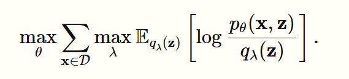​

我们可以通过black box variational inference

VAE与AE在代码结构上最大的变化在于，AE的encoder生成的是矩阵，而VAE的encoder生成的是混合高斯分布的参数

$$
p(x|z)=\mathcal{N}(u_\theta(z),\sum_{\theta}(z))
$$

decoder 是 $\theta$ 的优化而encoder是 $\phi$ 的优化（这个参数是用来降低p和q之间的KL散度），优化的结果如下图，encoder的优化基本是我们需要找到一个足够接近的下限曲线，而decoder的优化在于我们需要找到这条下限曲线中最大似然的上限

​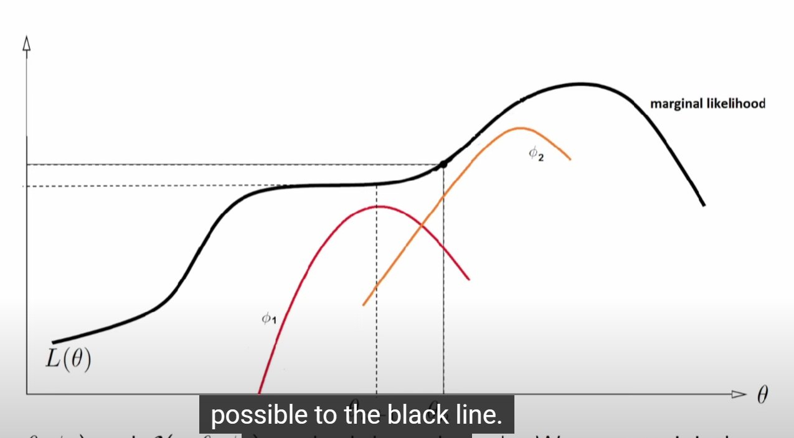​

## 5. normalizing flows
