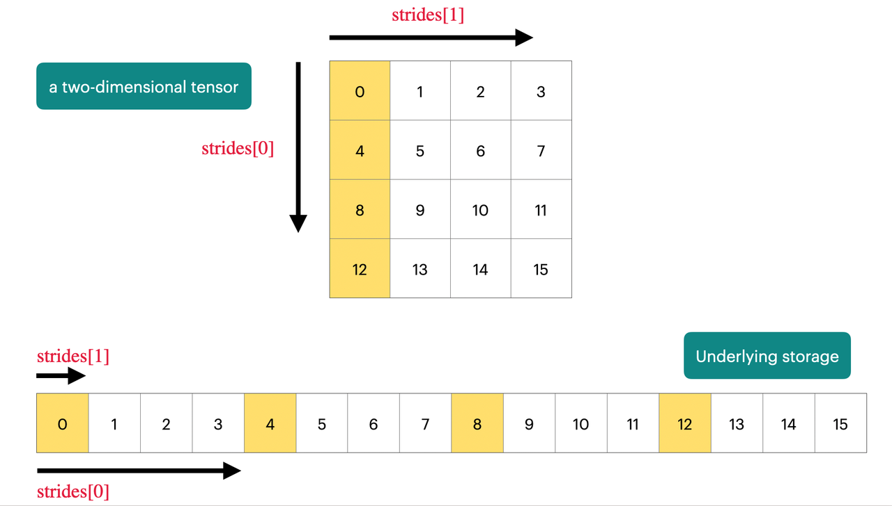

## 1. Overview and tokenizer

### 1.1. Overview

概述部分大概分为了五个部分

**Basics**

是指LLM中最主体的结构

- Tokenizer：BPE
- Transformer
    - Activation function
    - Positional encoding
    - Normaliztion
    - Place of Normalization
    - MLP
    - Attention
- Training
    - Optimizer
    - Learning rate
    - Batch size
    - Regularization
    - Hyperparameters

**Systems**

- Kernel: manage kernels in GPU
    - Cuda / Triton and so on to write a kernel
- Parallelism: manage lots of GPUs
    - DP PP TP
- Inference: not just for chat, but useful for RL(rollout), evaluation
    - Prefill and decode
    - Kv cache

**Scaling law**

- Match data and parameters
- 给定有限的flops预算，如何一步步优化配比

**Data**

- Evaluation design
- Data curation
- Data processing

**Alignment（post-train）**

- SFT
- RL

### 1.2. Tokenizer

tokenizer的核心是把自然语言的一句话转换成整数数组，数组里的每个数都有一个范围，这个范围即是词表的大小

- 为什么需要数组：因为计算机只能处理数字
- 为什么是整数：因为文字是离散的，没有什么单词 or 汉字之间存在连续关系

多种tokenizer方案的对比

最后的选择结果是BPE，BPE的方案是先按照字节分，分外之后用语料去训练，将重复出现的字节对合并起来

## 2. Pytorch basic

### 2.1. tensors

Pytorch的核心是tensor，tensor基本都是float32精度的，但是由于大模型的计算量实在过大，由此衍生出了一些降低精度的方案

- float16
- bfloat16
- fp8

```python
 z = torch.zeros(32, 32, device="cuda:0")
```

实际的tensor的存储如下



基本上只要是获取某块连续的数据，就不会发生拷贝，如果获取的那块数据是不连续的，那么有些操作就会发生拷贝

通常在Pytorch中我们都会按照batch进行操作，因为一定程度上比起循环这样做的并行效率会更高

```python
    x = torch.ones(4, 8, 16, 32)
    w = torch.ones(32, 2)
    y = x @ w
    assert y.size() == torch.Size([4, 8, 16, 2])
```

**Eniops**

Eniops是Pytorch中非常有用的一个技巧（一个库），链接可以参考下面链接

[Einops tutorial, part 1: basics - Einops](https://einops.rocks/1-einops-basics/)

因为Pytorch中经常要对tensor的维度做很多变换，比如vit中经常要给图像做分块，emiops可以轻松地实现这个过程，并且可以大大增加可读性

```python
from einops import rearrange
import torch
images = torch.randn(10, 3, 224, 224)
# p1=16, p2=16
patches = rearrange(images, 'b c (h p1) (w p2) -> b (h w) (p1 p2 c)', p1=16, p2=16)
# patches.shape -> torch.Size([10, 196, 768])
# 10: batch_size
# 196: 14*14, number of patches
# 768: 16*16*3, dimension of each flattened patch

```

### 2.2. Flops

### 2.3 Computational Graph and AutoGrad

这部分不是336中的，是我在自学ML SYS中学到的内容，下面的代码来自于CMU的LLM System课程的作业

计算图（是一种有向无环图）的节点是数据，边是操作（加减乘除，tanh等等），一般来说，计算图的终点是Loss，然后我会根据Loss来计算拓扑，也就是找到所有影响这个Loss的数据并排序

```
Input (A)
     /     \
  Op1 (B)  Op2 (C)
     \     /
     Loss (L)
```

比如上述图，我们基于链式法则，需要在计算Loss对A的梯度之前，先计算Loss对于B和C的梯度，因此我们需要进行拓扑排序

python形式伪代码

```python
def topological_sort(variable: Variable) -> Iterable[Variable]:
    """
    Computes the topological order of the computation graph.

    Args:
        variable: The right-most variable

    Returns:
        Non-constant Variables in topological order starting from the right.
    """
    from typing import Set
    order: List[Variable] = []
    visited: Set[int] = set()

    def dfs(var: Variable):
        if var.unique_id in visited or var.is_constant():
            return
        visited.add(var.unique_id)
        for parent in var.parents:
            dfs(parent)
        order.append(var)

    dfs(variable)
    return reversed(order)
```

随后我们在反向传播，反向传播中有两个操作，计算梯度和传播梯度，比如计算A的时候需要B和C的梯度

```PYTHON
def backpropagate(variable: Variable, deriv: Any) -> None:
    """
    Runs backpropagation on the computation graph.
    """
    topo_order = list(topological_sort(variable))
    derivatives = {variable.unique_id: deriv}

    for var in topo_order:
        if var.unique_id not in derivatives:
            continue
            
        d_var = derivatives[var.unique_id]

        if var.is_leaf():
            var.accumulate_derivative(d_var)
        elif not var.is_constant():
            for parent, d_parent in var.chain_rule(d_var): # chain_rule 函数中真正计算梯度，也即求偏导
                if parent.unique_id not in derivatives:
                    derivatives[parent.unique_id] = d_parent
                else:
                    derivatives[parent.unique_id] += d_parent
```

我们来看看chain rule内部的实现

```python
    def chain_rule(self, d_output: Any) -> Iterable[Tuple[Variable, Any]]:
        h = self.history
        assert h is not None
        assert h.last_fn is not None
        assert h.ctx is not None

        x = h.last_fn._backward(h.ctx, d_output) # 真正的梯度计算
        assert len(x) == len(h.inputs), f"Bug in function {h.last_fn}"
        return [
            (inp, inp.expand(self._ensure_tensor(d_in)))
            for inp, d_in in zip(h.inputs, x)
        ]
```

`last_fn` 这个变量是指一个操作，例如加减乘除，这边会调用 `_backward` 方法来计算梯度

```python
class Add(Function):
    @staticmethod
    def forward(ctx: Context, t1: Tensor, t2: Tensor) -> Tensor:
        return t1.f.add_zip(t1, t2)

    @staticmethod
    def backward(ctx: Context, grad_output: Tensor) -> Tuple[Tensor, Tensor]:
        return grad_output, grad_output


class Mul(Function):
    @staticmethod
    def forward(ctx: Context, a: Tensor, b: Tensor) -> Tensor:
        ctx.save_for_backward(a, b)
        return a.f.mul_zip(a, b)

    @staticmethod
    def backward(ctx: Context, grad_output: Tensor) -> Tuple[Tensor, Tensor]:
        a, b = ctx.saved_values
        return (
            grad_output.f.mul_zip(b, grad_output),
            grad_output.f.mul_zip(a, grad_output),
        )
```

如果我们要在计算图中做算子融合，比如Attention操作，我们就要同时实现Attention操作的forward和backward操作，那么其进入计算图中，就可以进行AutoGrad
## 3. Architecture

### 3.1 Architecture development

在Architecture中首先提到了关于Transformer架构的部分迭代，包括

- Pre-Norm：相比于PostNorm会让Res Flow更加有效
- RMS-Norm：相比于LayerNorm会更加快速
- Activation function
- Rope：相比于其他位置编码支持更大的上下文训练

介绍一下这些架构的具体实现

### 3.2 HyperParameters

对于超参数的选择

- FFN size：对于RELU MLP层，一般hidden layer会是输入的4倍，这个hidden layer和input layer的参数比一般是由激活函数决定的
    - 这种往往是一定程度上取决于经验法则，但是Google的T5等Model的hidden layer/input layer远远大于4，但是他们仍然有效


- head size：对于Model的heads，它的Num heads * Head dim 和 Model dim （就是每个token的长度）的比值往往是1
- aspect ratio：对于Model的参数和模型的层数的比值，也即每层的hidden states，一般在128左右
- vocabulary size：事实上来说为了应对更多的模态和语言，vocabulary size一直在增长，现在主流模型的量级在10w这个级别
- dropout and other regularization：在LLM上现在的趋势是用weight decay（对于模型参数过大提供一个惩罚项）替代dropout，根据实验表明，weight decay这个正则化方案其实和最初的初衷（防止过拟合）没有什么关系，而是与Learning rates调整技术一起，有效提高训练时的Loss下降

**Training Stability**

影响训练稳定性的主要因素往往在Softmax模块上，这个模块很容易出现梯度爆炸的问题因此也有很多解决它的方案，我们在Self-Attention和最后的Output的模块中都有Softmax模块

## 4. Moe

Moe已经是现在最先进模型的共同选择


现阶段Moe取得优势的只有在大型项目中，几乎一定是你需要做到张量并行的时候才需要，如果只是单卡训练，Moe往往不会有更好的效果

并且Moe有一个严重的问题是其Expert的路由选择是不可微分的，其并不是一个简单的矩阵乘法，对于Moe我们需要搞清楚

- Route function
- Expert size
- How to optimize the route function

**Route Function**

现阶段的大型系统都选择了Token top-k这个路由方案，top-k是指，其有一个网络针对每个token进行计算，计算出这个token最适合分配到k个experts，然后就会把token传给这k个experts进行计算，随后这k个experts的输出会被门控，然后进行一些加权计算合在一起，这是比较主流的做法


而事实上，虽然这些方案不主流，但是Hash分配，不考虑语义信息，也可以让Moe发挥作用，并且考虑到Route是一个离散决策，也可以考虑用RL进行优化，但是这个方案Cost很大，也不主流

> 为什么说RL擅长离散决策，实际上RL将离散决策优化成了一个可微分方案，比如Policy base的把离散决策改为输出概率分布，又或者Value-base将离散决策改为了Value的变化
> 

这个Token top-k的方案和Attention计算很像，将输入的token和experts的表征向量计算相似度，获得top-k

## 5. GPU

### 5.1 GPU Basic

在视频开头提供了很多有用资源

  

在21世纪初开始，计算机芯片包括CPUorGPU的单线程性能开始达到饱和，人们开始从absolute speed scaling转向parallel scaling


CPU和GPU的结构对比，CPU中最重要的是Control Unit来应对大量的分支逻辑，而GPU中最重要的是计算单元，来处理海量的计算逻辑。CPU是为了尽快完成某个任务，而GPU不关心某个的任务的速度，而是关注一个批次任务的完成时间

**Computer in GPU**

GPU内部结构最重要的是SM（Streaming Multi-processor）而SM中有包含多个SP（Streaming processor），它们的区别在于，SM存在控制单元，类似CPU，可以进行一些逻辑上的并行，其可以单独掌控一个批次任务；而SP不存在控制单元，它们只能处理一样的逻辑，做数据并行

- SM是控制的最小单元
- SP是计算的最小单元


**Memory in GPU**

SM能离Memory越近，其计算速度会越快


- L1 Cache 和 Shared Memory 就在SM上
- L2 Cache 在SM边上
- Global Memory相当于是在外部，Dram，常说的H100的80GB内存，就是指Global Memory

**Execution Model of GPU**

从粗粒度到细粒度，GPU的执行模型有三个部分，Blocks, Warps, Threads

- Blocks: 一个Block会被分配给一个SM进行处理
- Warp：一批被打包好的Threads，最终丢给SP执行
- Threads: Threads是一批指令，最终丢给SP中的计算单元执行


**Memory Model of GPU**

我们有很多不同的Memory可供写入，但是跨Block的Data需要写入Global Memory

如果我们的编写的程序中，Thread只需要访问shared memory，那么其会变得非常快，如果其不得不访问大量的分散数据，就会变得很慢


### 5.2 Making ML workloads fast on GPU

**Control divergence**

Thread内部必须执行一样的指令，因此条件语句会迫使其无法并行


**Low precision computation**

在GPU中使用低精度，会大大地加速整个过程，不论是在执行运算，还是在内存通信角度都是如此

**Operator fusion**


当我们把内容从Memory读到计算单元地时候，最好一次性把所有操作干完，再写回去，而不是一遍一遍地读取更新

**recomputation**

激活值从计算，在Large scale playbook中也提过，计算量换内存

**Memory coalescing**

这个概念的核心其实是局部性原理，GPU在访问全局内存的时候，不会一次性只获取一个字节，而是会获取一批次数据，这和我们在CPU的memory设计中做的很想


相对应的，当我们在一个warp中进行访存时候，其中的访存结果都在一个Burst section中，往往一次访问内存就可以全部解决。值得注意的是一个warp的内存访问是统一处理的


**tiling**


我们最好地遍历矩阵地方案是按列遍历，每个thread处理一行，但是在矩阵乘法中，不可避免地我们对某个矩阵要按行遍历，导致M0,0被两个线程处理，导致了两倍地读取行为

更好地方案是，根据我们地共享内存地大小，把矩阵分块，读取，局部地计算完，在返回


但是实际上地情况我们的不仅要考虑shared memory地大小，还要考虑我们地矩阵无法被很好的均分，比如257x257的矩阵，就比较难划分地均匀

GPU中地处理器一般最适合处理128倍数地数据

### 5.3 Flash Attention

计算层面地二次开销，而非内存层面的二次开销

FlashAttention 1 只是对KQV矩阵做了简单的tiling，分块到SRAM中，进行统一的计算，减少内存读写


Flash attention Softmax

标准的Softmax的算法无法应用tiling，因为其需要全局操作，Flash Attention中应用online softmax，进行了一些改动，使其可以做到先局部计算，再得到最终结果


## 6. Kernels & Triton

为什么我们需要定义Block，是因为block内部有高效的SRAM，我们希望能够定义一个内存高效的计算模型

理想情况下，我们希望我们的Block的数量能够被SM的数量整除，这样子计算的效率会更高

### 6.1 Benchmarking and Profiling

衡量一个GPU执行代码的时间，要注意两点，一个是去除编译和代码转移的时间，因此先执行一次做一个warmup，另一个保持CPU和GPU同步，这个是torch里面有实现的

Pytorch提供的profiler库，是一个很好的性能分析工具，可以把你的函数的具体行为和开销给展现出来

示例代码如下

```python
import torch
from torch.profiler import ProfilerActivity
from typing import Callable


def profile(description: str, run: Callable, num_warmups: int = 1, with_stack: bool = False):
    # Warmup
    for _ in range(num_warmups):
        run()
    if torch.cuda.is_available():
        torch.cuda.synchronize()  # Wait for CUDA threads to finish (important!)
    # Run the code with the profiler
    with torch.profiler.profile(
            activities=[ProfilerActivity.CPU, ProfilerActivity.CUDA],
            # Output stack trace for visualization
            with_stack=with_stack,
            # Needed to export stack trace for visualization
            experimental_config=torch._C._profiler._ExperimentalConfig(verbose=True)) as prof:
        run()
        if torch.cuda.is_available():
            torch.cuda.synchronize()  # Wait for CUDA threads to finish (important!)
    # Print out table
    table = prof.key_averages().table(sort_by="cuda_time_total",
                                      max_name_column_width=80,
                                      row_limit=10)
    #text(f"## {description}")
    #text(table, verbatim=True)
    # Write stack trace visualization
    if with_stack:
        text_path = f"var/stacks_{description}.txt"
        svg_path = f"var/stacks_{description}.svg"
        prof.export_stacks(text_path, "self_cuda_time_total")
    return table


cdist_function = lambda x, y: torch.cdist(x, y)

cdist_profile = profile(
    description="cdist",
    run=lambda: cdist_function(
        torch.randn(1000, 128, device="cuda"),
        torch.randn(1000, 128, device="cuda")),
    num_warmups=2,
    with_stack=True
)

print(cdist_profile)
```


上述内容测试了一个torch.cdist函数，该函数用于计算两个向量之间的欧式距离

profile的输出如下

| Name                                                                             | Self CPU % | Self CPU | CPU total % | CPU total | CPU time avg | Self CUDA | Self CUDA % | CUDA total | CUDA time avg | # of Calls |
| -------------------------------------------------------------------------------- | ---------- | -------- | ----------- | --------- | ------------ | --------- | ----------- | ---------- | ------------- | ---------- |
| aten::cdist                                                                      | 1.07%      | 32.720us | 17.57%      | 537.666us | 537.666us    | 0.000us   | 0.00%       | 41.313us   | 41.313us      | 1          |
| aten::_euclidean_dist                                                            | 1.66%      | 50.863us | 15.26%      | 467.031us | 467.031us    | 0.000us   | 0.00%       | 41.313us   | 41.313us      | 1          |
| aten::matmul                                                                     | 0.17%      | 5.202us  | 3.34%       | 102.330us | 102.330us    | 0.000us   | 0.00%       | 19.680us   | 19.680us      | 1          |
| aten::mm                                                                         | 2.43%      | 74.400us | 3.17%       | 97.128us  | 97.128us     | 19.680us  | 41.64%      | 19.680us   | 19.680us      | 1          |
| ampere_sgemm_32x128_tn                                                           | 0.00%      | 0.000us  | 0.00%       | 0.000us   | 0.000us      | 19.680us  | 41.64%      | 19.680us   | 19.680us      | 1          |
| aten::randn                                                                      | 1.05%      | 32.037us | 82.03%      | 2.510ms   | 1.255ms      | 0.000us   | 0.00%       | 5.952us    | 2.976us       | 2          |
| aten::normal_                                                                    | 1.45%      | 44.262us | 3.32%       | 101.587us | 50.793us     | 5.952us   | 12.59%      | 5.952us    | 2.976us       | 2          |
| void at::native::(anonymous namespace)::distribution_elementwise_grid_stride_... | 0.00%      | 0.000us  | 0.00%       | 0.000us   | 0.000us      | 5.952us   | 12.59%      | 5.952us    | 2.976us       | 2          |
| aten::cat                                                                        | 1.12%      | 34.355us | 1.63%       | 49.846us  | 24.923us     | 5.089us   | 10.77%      | 5.089us    | 2.544us       | 2          |
| void at::native::(anonymous namespace)::CatArrayBatchedCopy_aligned16_contig<... | 0.00%      | 0.000us  | 0.00%       | 0.000us   | 0.000us      | 5.089us   | 10.77%      | 5.089us    | 2.544us       | 2          |

**Summary**  
- Self CPU time total: 3.060ms  
- Self CUDA time total: 47.265us

上述内容更适合做一些静态的内容分析，而对于动态的，复杂的项目，单纯的profile其实并不能直接解决掉监控的问题

我们可以通过nvtx打印查看点，然后再更强大的profiler里进行查看

### 6.2 Kernel

以一个手写的torch的GELU为例子

```python
def manual_gelu(x: torch.Tensor):
	return 0.5*x*(1+torch.tanh(0.79788456*(x+0.44715*x*x*x)))
```

上述是通过一个数学的trick来实现一个近似的gelu的，而官方的gelu

```python
def pytorch_gelu(x: torch.Tensor):
	return torch.nn.functional.gelu(x, approximate="tanh")
```

对比发现双方虽然数值结果相同，但是耗时差距巨大

通过profile我们可以发现，两个操作，manual的版本启动了多个cuda kernel，包括加法，乘法，tanh，但是gelu版本只启动了一个kernel，gelu kernel完成了所有操作

因此我们尝试手写cuda内核

```cpp
#include <math.h>
#include <torch/extension.h>
#include <c10/cuda/CUDAException.h>

// Helper function to compute ceil(a / b)
inline unsigned int cdiv(unsigned int a, unsigned int b) {
    return (a + b - 1) / b;
}

// The CUDA kernel that applies the GeLU activation function
__global__ void gelu_kernel(float* in, float* out, int num_elements) {
    // Calculate the global index for the current thread
    int i = blockIdx.x * blockDim.x + threadIdx.x;
    
    // Check bounds to prevent accessing memory outside the tensor
    if (i < num_elements) {
        // GeLU approximation: 0.5 * x * (1 + tanh(sqrt(2/pi) * (x + 0.044715 * x^3)))
        // 0.79788456 is sqrt(2/pi)
        out[i] = 0.5 * in[i] * (1.0 + tanh(0.79788456f * (in[i] + 0.044715f * in[i] * in[i] * in[i])));
    }
}

// The C++ wrapper function to launch the CUDA kernel
torch::Tensor gelu(torch::Tensor x) {
    TORCH_CHECK(x.device().is_cuda(), "Input must be a CUDA tensor.");
    TORCH_CHECK(x.is_contiguous(), "Input must be contiguous.");
    
    // Allocate the output tensor on the same device
    torch::Tensor y = torch::empty_like(x);
    
    // Determine launch configuration
    int num_elements = x.numel();
    int block_size = 1024;  // Standard threads per block
    int num_blocks = cdiv(num_elements, block_size);
    
    // Launch the kernel
    gelu_kernel<<<num_blocks, block_size>>>(
        x.data_ptr<float>(), 
        y.data_ptr<float>(), 
        num_elements
    );
    
    // Check for potential CUDA errors after kernel launch
    C10_CUDA_KERNEL_LAUNCH_CHECK();
    
    return y;
}
```

对于一系列的简单cuda kernel，其往往会招致多次的内存读写，将其融合成一个大的复杂算子，效率就会高很多，这也就是所谓的算子融合的概念

cuda kernel的代码一般包含两部分的内容，一部分是实际的cuda kernel计算的代码，另一部分是对这个kernel的包装C++ wrapper，配置block size然后定义block内数据的数量

### 6.3 Triton Kernel

Triton是OpenAI开发的一种方式，编写cuda非常的复杂并且难以调试，能否用一个更加high level的基于python的形式编写内核，这既是Triton为我们带来的

其使得我们不用关心线程这个层次，而是更关心SM这个层次，线程块的层面

面对Triton代码，我们考虑的不是单个线程，而是线程块，以至于Triton代码中都是vector的操作，因为我总是再操作一块数据

### 6.4 torch compile

除了手动编写cuda内核以及用Triton来编写内核以外，有一种很简便的方案来做算子融合，那就是torch.compile

之前的一系列手写内核的方案，无非就是把一系列的内核操作组合起来形成一个新的内容，那么我们自然会想有没有更自动化的方案去做这些东西

```python
compiled_gelu = torch.compile(manual_gelu)
```

torch.compile会做很多操作，不只是算子融合，也有一些其他的优化tricks，比如优化矩阵乘法


### 6.5 More about GPU coding

这个[链接](https://github.com/SingularGuyLeBorn/Awesome-CS336-NoteForEveryone/blob/main/NoteByHuman/Lecture5/Lecture5-GPU%E5%AD%A6%E4%B9%A0%E8%B5%84%E6%BA%90.md) 包含了很多的资源，可以帮我们入门GPU coding，以及一些更加深入的学习

我也将笔记记录于此

Cuda的特点包括

- CPP语法
- SIMT（Single Instruction Multiple Threads）一个指令会被多个线程同时执行
- 需要和CPU协作，CPU整理结果，处理逻辑
- 自动调度：根据设定的执行参数，自动分配线程调度


我们在CPU编写的循环逻辑，在GPU上都应该转换成SIMT的逻辑

在CUDA中，我们需要定义，Grid->Block->Threads，相对于之前的SM->Warp->Thread，每一个Thread的ID我们可以这样子获得


这也是我们在每个Kernel函数最开始，计算自己的Thread的Id的方案，因为每个Kernel都是分配给一个SM/Grid执行的，我们对这个SM的定义的Block数量和Block里的size，随后就能分配Block的可执行的线程了

ThreadId定义了当前Thread和其他的区别，也就是这样子实现了编写一个程序在多个Thread执行，SIMT

```python
int i = blockIdx.x * blockDim.x + threadIdx.x;
```

Grid和SM理论上是指同一个东西，但是区别在于Grid是逻辑上的存在，其理论上可以容量无数的线程；SM是物理上的存在，Grid相当于SM的虚拟化，但是当这个线程数量超过了当前的SM的上限时，其会做一个虚拟化的工作，会分配其他的SM来帮我处理当前的Kernel的任务，因此一个Kernel也可以占满GPU的SM

Block只能存在于一个SM中，Grid中包含多个Block，实际操作中会把该Block分发到某个具体的SM上执行，SM会解包这个Block，将内部的线程取成warp执行，因为warp往往是32个线程一个，因此Block size最好是32的倍数

以下是一个简单的cuda程序，来计算向量加法

```cpp
#include <cmath>
#include <iostream>
#include <vector>


#define CUDA_CHECK(call) \
{ \
    cudaError_t err = call; \
    if (err != cudaSuccess) { \
        std::cerr << "CUDA Error at " << __FILE__ << ":" << __LINE__ \
        << " - " << cudaGetErrorString(err) << std::endl; \
    } \
}

// Step 3: Define add kernel
template<typename T>
__global__ void add_kernel(T *c, const T *a, const T *b, const size_t n, const size_t step) {
    int idx = blockIdx.x * blockDim.x + threadIdx.x + step;
    if (idx < n) {
        c[idx] = a[idx] + b[idx];
    }
}

template<typename T>
void vector_add(T *c, const T *a, const T *b, size_t n, const dim3& grid_dim, const dim3& block_dim) {
    size_t step = grid_dim.x * block_dim.x;
    for (size_t i = 0; i < n; i += step) {
        add_kernel<<<grid_dim, block_dim>>>(c, a, b, n, i);
    }
}

int main() {
    // Step 1: Prepare & initialize data
    constexpr size_t N = 1 << 20; // ~1M elements
    constexpr size_t size_bytes = sizeof(float) * N;

    // Initialize data
    const std::vector<float> h_a(N, 1);
    const std::vector<float> h_b(N, 2);
    std::vector<float> h_c(N, 0);

    // Step 2: Allocate device memory & transfer to global memory
    float *d_a, *d_b, *d_c;
    CUDA_CHECK(cudaMalloc(&d_a, size_bytes));
    CUDA_CHECK(cudaMalloc(&d_b, size_bytes));
    CUDA_CHECK(cudaMalloc(&d_c, size_bytes));

    CUDA_CHECK(cudaMemcpy(d_a, h_a.data(), size_bytes, cudaMemcpyHostToDevice));
    CUDA_CHECK(cudaMemcpy(d_b, h_b.data(), size_bytes, cudaMemcpyHostToDevice));
    CUDA_CHECK(cudaMemcpy(d_c, h_c.data(), size_bytes, cudaMemcpyHostToDevice));

    // Step 4: Call the cpu addition function
    // Set up kernel configuration
    dim3 block_dim(1);
    dim3 grid_dim(1);

    // Call cuda add kernel
    vector_add(d_c, d_a, d_b, N, block_dim, grid_dim);

    // Step 5: Transfer data from global mem to host mem
    CUDA_CHECK(cudaMemcpy(h_c.data(), d_c, size_bytes, cudaMemcpyDeviceToHost));

    // Step 6: Check for errors (all values should be 3.0f)
    float sumError = 0.0f;
    for (int i = 0; i < N; i++) {
        sumError += fabs(h_c[i] - 3.0f);
    }
    std::cout << "Sum error: " << sumError << std::endl;

    if (d_a) {
        CUDA_CHECK(cudaFree(d_a));
    }
    if (d_b) {
        CUDA_CHECK(cudaFree(d_b));
    }
    if (d_c) {
        CUDA_CHECK(cudaFree(d_c));
    }
}
```


考虑Coalesced Memory Access，多个线程访问多个连续的内存，GPU硬件可以将其优化为少几次内存事务

```cpp
dim3 blockSize(16, 16); // 16x16 = 256 线程/块
dim3 gridSize((N + blockSize.x - 1) / blockSize.x, (N + blockSize.y - 1) / blockSize.y);

__global__ void matrixMulGPU(const float* A, const float* B, float* C, int N) {
    int row = blockIdx.y * blockDim.y + threadIdx.y;
    int col = blockIdx.x * blockDim.x + threadIdx.x;
    if (row < N && col < N) {
        float sum = 0.0f;
        for (int k = 0; k < N; ++k) {
            sum += A[row * N + k] * B[k * N + col];
        }
        C[row * N + col] = sum;
    }
}
```


 