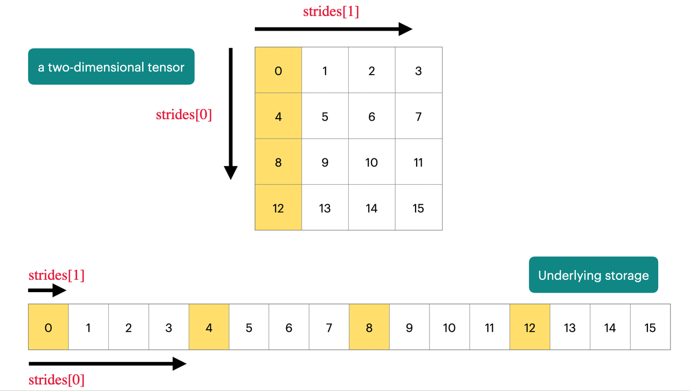

# CS336 LLM

## 1. Overview and tokenizer

### 1.1. Overview

概述部分大概分为了五个部分

**Basics**

是指LLM中最主体的结构

- Tokenizer：BPE
- Transformer
    - Activation function
    - Positional encoding
    - Normaliztion
    - Place of Normalization
    - MLP
    - Attention
- Training
    - Optimizer
    - Learning rate
    - Batch size
    - Regularization
    - Hyperparameters

**Systems**

- Kernel: manage kernels in GPU
    - Cuda / Triton and so on to write a kernel
- Parallelism: manage lots of GPUs
    - DP PP TP
- Inference: not just for chat, but useful for RL(rollout), evaluation
    - Prefill and decode
    - Kv cache

**Scaling law**

- Match data and parameters
- 给定有限的flops预算，如何一步步优化配比

**Data**

- Evaluation design
- Data curation
- Data processing

**Alignment（post-train）**

- SFT
- RL

### 1.2. Tokenizer

tokenizer的核心是把自然语言的一句话转换成整数数组，数组里的每个数都有一个范围，这个范围即是词表的大小

- 为什么需要数组：因为计算机只能处理数字
- 为什么是整数：因为文字是离散的，没有什么单词 or 汉字之间存在连续关系

多种tokenizer方案的对比

最后的选择结果是BPE，BPE的方案是先按照字节分，分外之后用语料去训练，将重复出现的字节对合并起来

## 2. Pytorch basic

### 2.1. tensors

Pytorch的核心是tensor，tensor基本都是float32精度的，但是由于大模型的计算量实在过大，由此衍生出了一些降低精度的方案

- float16
- bfloat16
- fp8

```python
 z = torch.zeros(32, 32, device="cuda:0")
```

实际的tensor的存储如下



基本上只要是获取某块连续的数据，就不会发生拷贝，如果获取的那块数据是不连续的，那么有些操作就会发生拷贝

通常在Pytorch中我们都会按照batch进行操作，因为一定程度上比起循环这样做的并行效率会更高

```python
    x = torch.ones(4, 8, 16, 32)
    w = torch.ones(32, 2)
    y = x @ w
    assert y.size() == torch.Size([4, 8, 16, 2])
```

**Eniops**

Eniops是Pytorch中非常有用的一个技巧（一个库），链接可以参考下面链接

[Einops tutorial, part 1: basics - Einops](https://einops.rocks/1-einops-basics/)

因为Pytorch中经常要对tensor的维度做很多变换，比如vit中经常要给图像做分块，emiops可以轻松地实现这个过程，并且可以大大增加可读性

```python
from einops import rearrange
import torch
images = torch.randn(10, 3, 224, 224)
# p1=16, p2=16
patches = rearrange(images, 'b c (h p1) (w p2) -> b (h w) (p1 p2 c)', p1=16, p2=16)
# patches.shape -> torch.Size([10, 196, 768])
# 10: batch_size
# 196: 14*14, number of patches
# 768: 16*16*3, dimension of each flattened patch

```

### 2.2. Flops

## 3. Architecture

### 3.1 Architecture development

在Architecture中首先提到了关于Transformer架构的部分迭代，包括

- Pre-Norm：相比于PostNorm会让Res Flow更加有效
- RMS-Norm：相比于LayerNorm会更加快速
- Activation function
- Rope：相比于其他位置编码支持更大的上下文训练

介绍一下这些架构的具体实现

### 3.2 HyperParameters

对于超参数的选择

- FFN size：对于RELU MLP层，一般hidden layer会是输入的4倍，这个hidden layer和input layer的参数比一般是由激活函数决定的
    - 这种往往是一定程度上取决于经验法则，但是Google的T5等Model的hidden layer/input layer远远大于4，但是他们仍然有效


- head size：对于Model的heads，它的Num heads * Head dim 和 Model dim （就是每个token的长度）的比值往往是1
- aspect ratio：对于Model的参数和模型的层数的比值，也即每层的hidden states，一般在128左右
- vocabulary size：事实上来说为了应对更多的模态和语言，vocabulary size一直在增长，现在主流模型的量级在10w这个级别
- dropout and other regularization：在LLM上现在的趋势是用weight decay（对于模型参数过大提供一个惩罚项）替代dropout，根据实验表明，weight decay这个正则化方案其实和最初的初衷（防止过拟合）没有什么关系，而是与Learning rates调整技术一起，有效提高训练时的Loss下降

**Training Stability**

影响训练稳定性的主要因素往往在Softmax模块上，这个模块很容易出现梯度爆炸的问题因此也有很多解决它的方案，我们在Self-Attention和最后的Output的模块中都有Softmax模块

## 4. Moe

Moe已经是现在最先进模型的共同选择


现阶段Moe取得优势的只有在大型项目中，几乎一定是你需要做到张量并行的时候才需要，如果只是单卡训练，Moe往往不会有更好的效果

并且Moe有一个严重的问题是其Expert的路由选择是不可微分的，其并不是一个简单的矩阵乘法，对于Moe我们需要搞清楚

- Route function
- Expert size
- How to optimize the route function

**Route Function**

现阶段的大型系统都选择了Token top-k这个路由方案，top-k是指，其有一个网络针对每个token进行计算，计算出这个token最适合分配到k个experts，然后就会把token传给这k个experts进行计算，随后这k个experts的输出会被门控，然后进行一些加权计算合在一起，这是比较主流的做法


而事实上，虽然这些方案不主流，但是Hash分配，不考虑语义信息，也可以让Moe发挥作用，并且考虑到Route是一个离散决策，也可以考虑用RL进行优化，但是这个方案Cost很大，也不主流

> 为什么说RL擅长离散决策，实际上RL将离散决策优化成了一个可微分方案，比如Policy base的把离散决策改为输出概率分布，又或者Value-base将离散决策改为了Value的变化
> 

这个Token top-k的方案和Attention计算很像，将输入的token和experts的表征向量计算相似度，获得top-k

## 5. GPU

在视频开头提供了很多有用资源