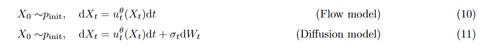

本文来自于MIT的这份Notes

[An Introduction to Flow Matching and Diffusion Models](https://arxiv.org/abs/2506.02070)

## 1. Introduction

现阶段AI的热潮在于构建优秀的生成模型，在其中最为成功的模型之二便是Diffusion和Flow model；Diffusion and Flow model基于ODE/SDE来模拟噪声到数据的变化过程，虽然从代码上，这些模拟过程都相当简单，但是SDE的技术性质会使其看上去难以理解，尤其是各种优化方案

值得一提的是，Diffusion的模型的最初提出的理论基础并不是SDE，而是后续人们在优化Diffusion和探索Flow model和Diffuion model联系的过程中，发现这两个模型的数学本质，ODE/SDE是其最本质的数学理解，我们在本文中也会介绍一些其他的

### 1.1 Some Concepts

我们在本节列出所有的概念，和下面公式中的表述一一对应

- $R^d$: 指的是d维的实数向量
- $X$: 一条轨迹Function，给你时间，可以获得对应的点的坐标$X_t$或者我们也用 $x$ 来表示
- $u$: 是指速度，速度是时间和位置的函数， $u_t(x)$
- $z$: 是指真实数据上的一个点
- $p(·|z)$ 和 $p(x|z)$ 本质上是一个东西，一个指的是分布，一个指的是对于x的概率

## 2. Flow and Diffusion Models

Flow model 和 Diffusion model 分别在模拟ODE和SDE过程

### 2.1 Flow Models

我们从ODE过程开始，ODE的解是一个轨迹，其从时间 t 映射到空间$R^d$ ，任何一个样本都是这个空间中的一个点，不论是图像，视频或者是蛋白质结构

ODE的解是一个轨迹，下面这个式子中的X是一个function如下，t从[0, 1]的范围中取，知道t你能够推出其在这个空间中的位置，这就是所谓的解是一个轨迹

$$
X:[0,1]\rightarrow R^d,\ \ \ t\rightarrow X_t
$$

对于每个时间和位置，ODE会定义一个vector field来告诉你在这个地方的速度向量u，u是一个function，如下

$$
u:R^d \times [0,1]\rightarrow R^d ,\ \ \ (x,t)\rightarrow u_t(x)
$$

在实践中，向量场u往往非常复杂，因此无法直接计算积分解决，一般是通过欧拉法，分步，假设单步之内的速度是不变的，进行计算解决

$$
X_{t+h}=X_t +hu_t(X_t)\ \ \ \ (t=0,h,2h,...,1-h)
$$

基于欧拉法，我们可以用神经网络进行建模，即用神经网络来拟合每个step的变化，也即 $u_t$ 由此，我们来提供Flow Model的完整定义，如下

$$
X_0\sim p_{init}\ \ \ \ \triangleright \textrm{init function}
$$

$$
\frac{d}{dt}X_t=u_t^{\theta}(X_t) \ \ \ \ \triangleright \textrm{speed function}
$$

$$
X_1\sim p_{data} \ \ \ \ \triangleright \textrm{final state function}
$$

值得注意的是神经网络拟合的是Vector field（也即每个点X在t的速度）而不是Flow，为了计算Flow，我们需要基于Vector field+欧拉法模拟ODE

### 2.2  Diffusion Models

Diffusion model基于SDE，SDE是ODE的一种通常情况，在ODE的基础上引入了随机扰动，随机扰动是一种基于高斯运动的随机变化，我们用布朗运动来描述它

> 布朗运动(Brownian Motion)：从直观上讲，布朗运动是一段连续地随机游走，数学表示记为 $W = (W_t)_{0\leq t \leq 1}$ ，布朗运动有以下特性：
1. 布朗运动的增量为高斯分布，也即其运动分布的方差会随着时间线性增加
2. 布朗运动任意时间节点的增量是一个独立随机变量
由上面两个特性可知，布朗运动满足 $W_{t+h}=W_t+\sqrt{h}\varepsilon_t\ \ \ \ \varepsilon\sim N(0,I_d)$
> 

对于一个ODE而言，只要初始值相同，其模拟的结果也会相同，而对于一个SDE而言则不是这样，SDE是一个随机过程，对于SDE来说，运动的轨迹每次都是不一样的，并且每一状态都是一个随机变量而非是一个点

从ODE到SDE的过程就是增加了一个布朗运动的随机扰动

$$
X_{t+h}=X_t+hu_t(X_t)+\sqrt{h}\sigma_t\varepsilon_t\ \ \ \ \varepsilon\sim N(0,I_d)
$$

由此衍生出基于欧拉法的Euler-Maruyama method，在每一step里面增加一个随机扰动，这个扰动中有一个超参数控制扰动的size，当其为0的时候，SDE转化成ODE

始终记住，我们的目标是讲简单的分布转换成复杂的真实分布，同样地，我们会参数化（神经网络拟合）$u_t$ , 唯一地区别是我们在这边加上了一个基于高斯分布的随机扰动

## 3. Constructing the Training Target

对于Flow model和Diffusion model



实际要训练的参数是一致的


始终牢记这个参数化的速度是指初始分布转移到目标分布的速度，也即我们要拟合的是这个速度

### 3.1 Conditional and Marginal Proability Path

我们的训练目标，就是这个分布转换的过程，实际上是一个概率路径，也即一个概率分布随着时间演变的过程，也即从最初的原始分布到最终的真实数据分布的过程

我们首先定义条件概率路径（conditional probability path），也即一个点的概率路径，比如一张图片到一个高斯噪声的路径


其次我们定义边际概率路径，也即对于整个真实的数据集的转换，将整个真实的数据集变为高斯噪声，实际上对于特定时间t的概率分布，就是对于该t时间的条件概率去求积分得到边际概率


对于这两种概率路径的对比，我们可以参照这个图


需要注意的是，虽然上面一直提到高斯噪声，只是为了和大家熟悉的Diffusion联系起来罢了，初始分布不一定需要是高斯

对于概率分布的变化，也可以参照这个图，背景中的红色块是指初始的高斯分布，五角的蓝色块是最终的真实分布


对于Diffusion的版本，我们提供一个例子Gaussian Conditional Probability Path

### 3.2 Conditional and Marginal Vector Fields

概率路径是我们已有的，也即加噪过程，加噪过程的逆向，就是我们已有的概率路径，也是训练的数据集合；而向量场是我们最终的目标，我们需要训练神经网络来拟合向量场，使其采样的时候生成的轨迹分布，符合我们已有的概率路径

我们在上文中定义概率路径的时候采用了插值法，这是经过人为设计的结果

我们来看看如何通过已有的概率路径  $p_t$ 来构造vector fields，对于条件概率路径和条件向量场的关系我们有


上述公式表示对特定的数据点的运动关系，非常清晰，但是对于实际的 $u_t^{target}(x)$ 却很难求解，我们可以用一些技巧来进行构造

- 其中Example11让我们从高斯的ODE中获取条件概率路径的数学结果，其中的 $\dot{a}_t$ 是指a对t的导数


我们来引入连续性方程，连续性方程描述了在一个流场中，概率密度的变化率和其通量散度的关系，在这里是指概率路径和向量场的关系，什么样的向量场才能产生对应的概率路径


为了理解连续性方程，我们要引入 $div$ 的概念，div是一个表示divergence的概念，散度


对于连续性方程，左侧的式子等同于概率路径 $p_t(x)$在时间上的导数/变化率，右侧的概率散度表示概率质量的净流出

随后我们可以用连续性方程求解边际向量场


### 3.3 Conditional and Marginal Score Functions

先前我们已经能够定义了向量场，跟随这个向量场，我们就能把初始分布转移到真实分布。

但是对于SDE来说，由于引入了随机扩散这个过程，导致其如果按照这个向量场的话，最终地分布会比真实分布更发散，这个Score Function就是为了解决这个问题，用于抵消随机扩散地影响

Score是表示分布的移动的导数，而Flow中的u是具体的点运动的导数

## 4. Training the Generative Model


### 4.2 CFG

CFG 是指分类无关知道Classifier-Free Guidance，是为了让Text2Image这类得模型，在生成的指令遵循性和生成的多样性+质量上达到一个平衡


其方式是讲最终预测的噪声转换成上述形式

```python
# 同时前向传播两次
noise_pred = self.transformer(
  hidden_states=torch.cat([latents, latents], dim=0),  # 复制一份latents
  timestep=torch.cat([timestep, timestep], dim=0) / 1000,
  guidance=guidance,
  encoder_hidden_states_mask=torch.cat([prompt_embeds_mask, negative_prompt_embeds_mask], dim=0),
  encoder_hidden_states=torch.cat([prompt_embeds, negative_prompt_embeds], dim=0),  # 第一份用正向提示，第二份用负向提示
  img_shapes=img_shapes*2,
  txt_seq_lens=txt_seq_lens+negative_txt_seq_lens,
)[0]
```

我们在前向的时候，会复制一份latents，然后用不同的prompt_embed来做预测，完成之后把预测的结果拆开，然后用CFG公式拼起来

```python
noise_pred, neg_noise_pred = noise_pred.chunk(2, dim=0)
comb_pred = neg_noise_pred + true_cfg_scale * (noise_pred - neg_noise_pred)
```

宏观上流程可以如下

```python
  # 输入：
  正向提示: "a beautiful cat sitting on grass"
  负向提示: ""

  # 步骤 1：前向传播
  noise_pred = Transformer([正向prompt编码])      # → 预测噪声 A
  neg_noise_pred = Transformer([负向prompt编码])  # → 预测噪声 B

  # 步骤 2：计算引导方向
  direction = noise_pred - neg_noise_pred  # "朝着猫的方向" vs "朝着模糊图的反方向"

  # 步骤 3：放大引导（假设 scale=4.0）
  comb_pred = neg_noise_pred + 4.0 * direction  # 强化"猫"的特征

  # 步骤 4：范数归一化（True CFG）
  comb_pred = comb_pred * (||noise_pred|| / ||comb_pred||)  # 控制幅度

  # 步骤 5：去噪
  latents = SDE_step(latents, comb_pred, timestep)  # 向更"猫"的方向去噪
```

### 4.3 A Guide to the Diffusion Model Literature

由于神经网络领域往往有实验先行理论落后地情况，导致同一个领域往往有好多套的理论解读，这也是一个逐渐成熟的过程，本章节为出现的一系列方案进行辨析

**Discrete time & continuous time**

早期的论文里用来Markov chains来解读Diffusions，这是一种离散时间的表达，在这种解读中，Loss Function是通过优化ELBO这一下限来近似。后续的工作证明这种方案本质是对SDE的近似，在连续的时间下，ELBO变为实际的结果而非下界（转换为一个等式）

**Forward process & probability paths**