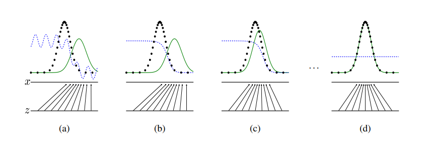

# GAN

**使用教程**

* 李沐AI
* 李宏毅机器学习

## 理论概述

**什么是Generator**

**GAN详解**

GAN，生成式对抗网络，就是说，我们模型有两个部分，生成者（generative model）和检查者（discriminative model）

其中的生成模型是一个MLP，也就是多层感知器；而审查模型也是一个MLP

生成一个高斯噪音，然后传入MLP中，这就是我们的G（生成模型），我们的G内部有一个MLP，这是我们需要训练的东西；而我们的D（审查模型），会通过自己的一个MLP去判别这个G的生成

所谓的D就是一个二分类器，目标结果是，这个D训练好了之后，依旧无法分类目标结果和生成结果，就可以说生成结果和目标结果是重合的分布

在GAN的时期，深度学习对于判别做的是比较好的，而对于生成却不是那么擅长，因此我们对于D的训练是比较直观的

在GAN的训练中，D，G中的MLP是被同时训练的，G用于最小化 $\log(1-D(G(z)))$ 其中z是底噪，D生成的是一个区分，我们设定是0时，他能够区分出生成和我们目标之间的区别

* D的目标 $D(G(z)) = 0$
* G的目标 $\log(1-D(G(z)))$ 最小化

对于同一个目标，D让其尽可能大，G让其尽可能小，这就是对抗的含义

​​

其训练过程表现为上图，虚线是实际的生成目标的分布，绿线是生成目标，蓝色虚线是D对于其的分数判定

* 首先生成目标以高斯分布随机地产生
* 然后蓝线进行拟合，在生成目标较高处打分为0，在真实目标处打分为1
* 然后绿线进行拟合，根据D的反馈向真实目标处移动
* 完成拟合，生成目标与实际目标相同

其中有个问题就是，我们在一开始的反向传播中，很容易把D训练地很好，而G此时还处于一个比较糟糕的状态，但是如果把D训练的完善，容易导致$\log(1-D(G(z)))$变为0，不利于后续的反向传播

## 模型细节

[ML_HW6.ipynb - Colab (google.com)](https://colab.research.google.com/drive/10lHBPFoNhTiiPe-yZ7SwAV1wwrkGc4En?usp=sharing#scrollTo=f8ajFDWBTRzn)

* Generator，使用了`nn.ConvTranspose2d`​这个结构
* Discriminator，使用了`nn.Conv2d`​这个结构

两者互为逆过程，卷积与反卷积

来看具体的训练过程

```python
def train(self):
        """
        Use this function to train generator and discriminator
        """
        self.prepare_environment()
      
        for e, epoch in enumerate(range(self.config["n_epoch"])):
            progress_bar = tqdm(self.dataloader)
            progress_bar.set_description(f"Epoch {e+1}")
            for i, data in enumerate(progress_bar):
                imgs = data.cuda()
                bs = imgs.size(0)

                # *********************
                # *    Train D        *
                # *********************
                z = Variable(torch.randn(bs, self.config["z_dim"])).cuda()
                r_imgs = Variable(imgs).cuda()
                f_imgs = self.G(z)
                r_label = torch.ones((bs)).cuda()
                f_label = torch.zeros((bs)).cuda()


                # Discriminator forwarding
                r_logit = self.D(r_imgs)
                f_logit = self.D(f_imgs)

                """
                NOTE FOR SETTING DISCRIMINATOR LOSS:
              
                GAN: 
                    loss_D = (r_loss + f_loss)/2
                WGAN: 
                    loss_D = -torch.mean(r_logit) + torch.mean(f_logit)
                WGAN-GP: 
                    gradient_penalty = self.gp(r_imgs, f_imgs)
                    loss_D = -torch.mean(r_logit) + torch.mean(f_logit) + gradient_penalty
                """
                # Loss for discriminator
                r_loss = self.loss(r_logit, r_label)
                f_loss = self.loss(f_logit, f_label)
                loss_D = (r_loss + f_loss) / 2

                # Discriminator backwarding
                self.D.zero_grad()
                loss_D.backward()
                self.opt_D.step()

                """
                NOTE FOR SETTING WEIGHT CLIP:
              
                WGAN: below code
                """
                # for p in self.D.parameters():
                #     p.data.clamp_(-self.config["clip_value"], self.config["clip_value"])


                # *********************
                # *    Train G        *
                # *********************
                if self.steps % self.config["n_critic"] == 0:
                    # Generate some fake images.
                    z = Variable(torch.randn(bs, self.config["z_dim"])).cuda()
                    f_imgs = self.G(z)

                    # Generator forwarding
                    f_logit = self.D(f_imgs)


                    """
                    NOTE FOR SETTING LOSS FOR GENERATOR:
                  
                    GAN: loss_G = self.loss(f_logit, r_label)
                    WGAN: loss_G = -torch.mean(self.D(f_imgs))
                    WGAN-GP: loss_G = -torch.mean(self.D(f_imgs))
                    """
                    # Loss for the generator.
                    loss_G = self.loss(f_logit, r_label)

                    # Generator backwarding
                    self.G.zero_grad()
                    loss_G.backward()
                    self.opt_G.step()
                  
                if self.steps % 10 == 0:
                    progress_bar.set_postfix(loss_G=loss_G.item(), loss_D=loss_D.item())
                self.steps += 1

            self.G.eval()
            f_imgs_sample = (self.G(self.z_samples).data + 1) / 2.0
            filename = os.path.join(self.log_dir, f'Epoch_{epoch+1:03d}.jpg')
            torchvision.utils.save_image(f_imgs_sample, filename, nrow=10)
            logging.info(f'Save some samples to {filename}.')

            # Show some images during training.
            grid_img = torchvision.utils.make_grid(f_imgs_sample.cpu(), nrow=10)
            plt.figure(figsize=(10,10))
            plt.imshow(grid_img.permute(1, 2, 0))
            plt.show()

            self.G.train()

            if (e+1) % 5 == 0 or e == 0:
                # Save the checkpoints.
                torch.save(self.G.state_dict(), os.path.join(self.ckpt_dir, f'G_{e}.pth'))
                torch.save(self.D.state_dict(), os.path.join(self.ckpt_dir, f'D_{e}.pth'))

        logging.info('Finish training')
```

具体分为两部分，训练G和D，其中更新几次D之后再更新一次G

## DCGAN

我们在最早的GAN中使用的是基础MLP，后来引入了效果更好的结构优化，使得GAN的训练更加稳定
