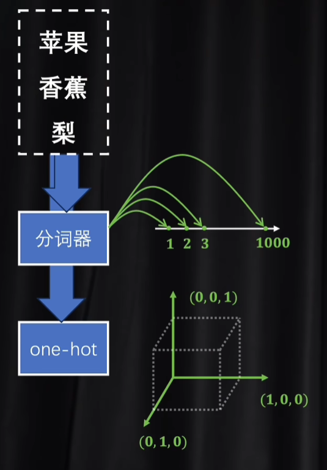
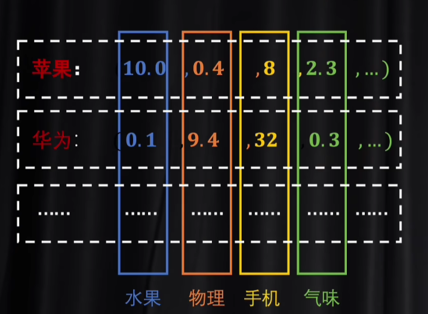
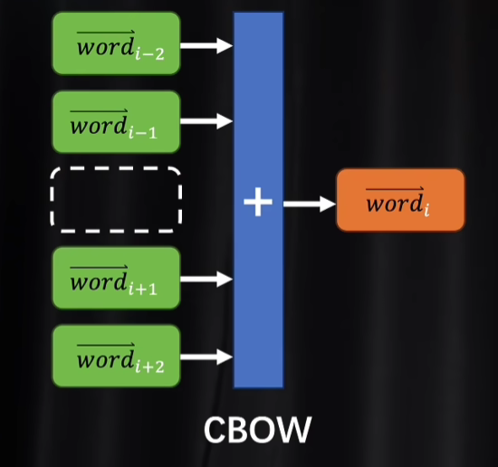
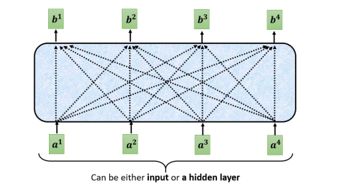
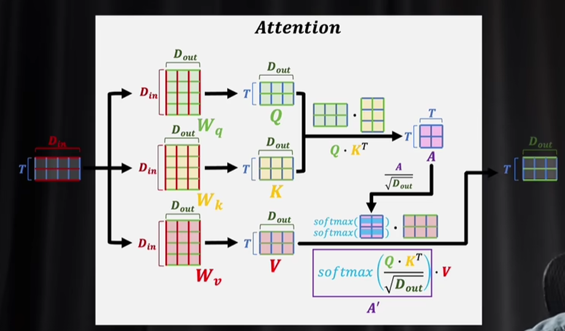
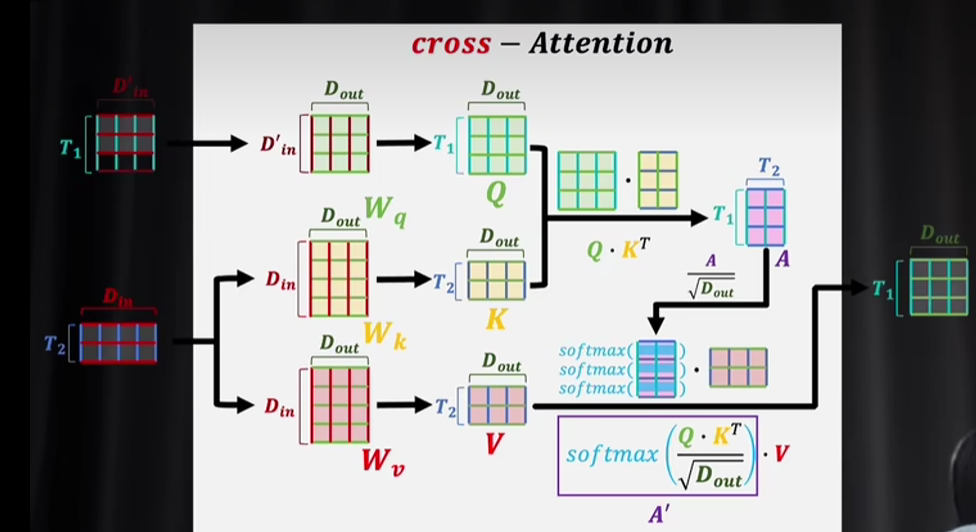
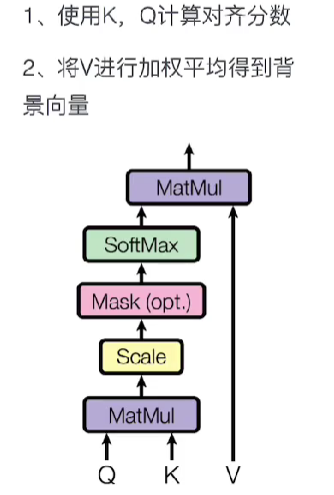
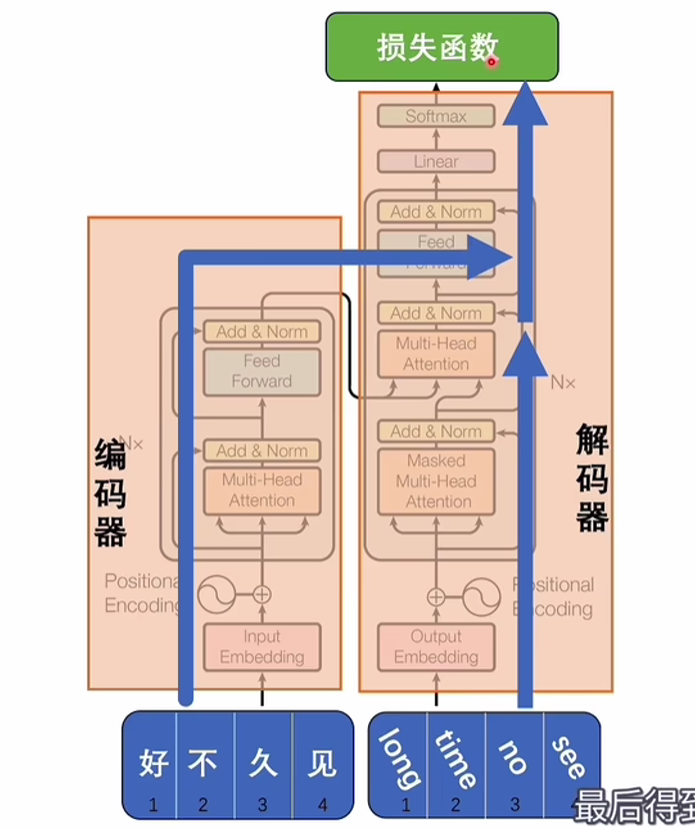
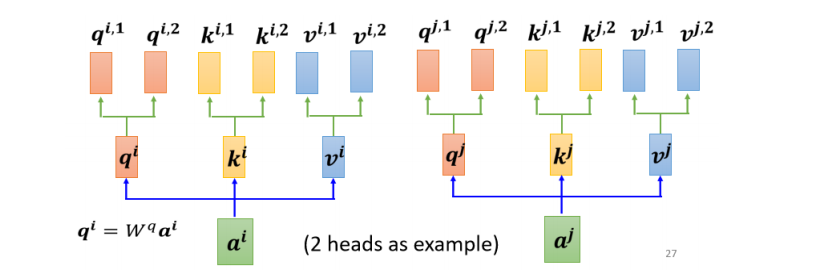
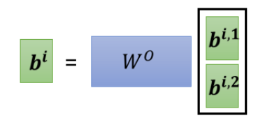

# Self-attention And Transformer

在我们之前学习深度学习的时候总是把各种元素抽象成向量，但是有些元素是可以比较容易抽象成向量的，比如图片信息；但是对于一些其他元素并非如此直观，比如说词汇，语音等等

比如说对于词汇，我们有Word Embedding，一种给词汇向量化但是又不丧失其语义的方式，单纯的用Ascii向量化会丧失不少语义

RNN的出现主要是为了处理词序逻辑，与图像矩阵不同的是，词序逻辑是有顺序关系的；而Attention的机制主要是用于解决RNN在长文本等情形遇到的瓶颈问题

## 1. Basic

### 1.1 编**码和解码 encoder and decoder**

这个概念最早出现于RNN，本质是要将语言这种东西数字化，同时不是去语义本身的联系，基础的编码有两种做法，这两种做法有各自的缺陷

* tokenizer
* one hot

​​

所谓的编码就是我们要创建一个潜空间，然后将一堆的token映射到这个空间中，成为一个个向量，具体的例子可能是这样的

​​

编码的过程就是要训练这样一个潜空间，可以有效地抽象语言的语义，当然编码系统并不止步于NLP，图像信息同样可以做image embedding

### 1.2 如何训练潜空间

这一部分的训练并非我们之前的模型那种训练那样直观，训练模型，我们首先想到的就是得有一系列正确的输入输出作为训练数据，那么在这里什么才是所谓正确的输入和输出呢，我们采取WordVec模型，实际做法有点像完形填空，上下文是输入，中间的词作为输出

​​

显然这种做法的好处在于其不需要人为处理地打标签，只需要程序自动挖空就行，也即是可以无监督学习

### 1.3 自注意力机制

当我们的输入是一个序列的时候，我们总是希望可以完整地考虑整个序列，而使用基础的MLP的时候，我们需要一个窗口去固定模型的参数

Self attention的基础在于输入N个向量，输出N个向量，Self-Attention并非一个完整的模型，而往往是复杂模型的其中一层，表示如下

​​

> Tips：虽然上图和神经网络的图像很像，但是其实是很大区别，这里面的输入都是矩阵，每个矩阵可能表示独立的“语句”；而神经网络中的输入是某个矩阵的展开

我们能够发现其每一个输出都综合考虑了所有的输入，那么具体是如何计算的呢，实际上是把$a_1$和$a_2,a_3,a_4$，分别计算相关程度，然后得出$b_1$，计算关联度期间涉及两个需要训练的矩阵和一个激活参数，多数是Softmax，如何计算关联度就是数学问题，已经有封装好的方法了

**计算关联度的细节问题**

我们输入一个词向量矩阵，需要乘以三个权重矩阵，获得Value，Key和Query，得到Q，K和V之后的操作如下

​​

基础的流程如下

* 输入矩阵，这个矩阵包含了多个词的信息，将其乘以三个权重矩阵变成Q，K和V
* 将Q乘以K的转置（也可以K乘以Q的转置，是对称的，反正都要训练得到权重），得到A称之为注意力得分
* 然后要对于A进行缩放，除以$\sqrt{D_{out}}$
* 最后将其结果做Softmax再与V计算

从语义逻辑上表示，V是我们训练出来的词典+输入的词汇，获取到的词语的原始含义，这种含义是客观的，但是A的作用就是综合了词语的上下文，用上下文的语义对于客观语义再进行修正，获得更加准确的语义。像缩放等细节操作，是出于概率学上的考量

在自注意力机制中，因为本身就是自己和自己进行计算，为了防止模型提前看到待预测的信息，则需要使用mask机制对于矩阵进行处理。

在自注意力机制之外，还诞生了一系列的衍生产物，比如交叉注意力机制，具体流程相似，但是Q的来源是另一组词汇矩阵

​​

对于每一个元素，其有Value，Key和Query三个张量来描述这个元素，并且用以计算关联度，一般的计算流程如下

​​

在《On the Relationship,between Self-attention and Convolutional Layers》中论证了CNN和Self-Attention的关系，证明了CNN只是特殊参数的Self-Attention，而RNN是要处理和Self-Attention一样的事情，也就是处理多个输入之间的关联性，而现阶段RNN的表现是不如Self-Attention的

Self-Attention机制目前最大的应用就是促成了Transformer的诞生，在CV和NLP领域都有重大的突破

### 1.4 **Transformer的结构**

​​

解码和编码在前向传播的时候是可以并行的

里面除了注意力层以外还有一些其他结构，比如FeedForward层，其内部的结构是一个小型的神经网络，因为多头注意力层本身是一个线性变化的结果，为了使得模型表达力更强，需要一个拥有非线性变化的层，也即这里的FeedForward

```python
class FeedForwardBlock(nn.Module):
    def __init__(self, input_dim, num_heads, dim_feedforward=2048, dropout=0.1 ):
        super().__init__()
        # TODO: Initialize the following. 
        # MLP has the following layers : linear, relu, dropout, linear ; hidden dim of linear is given by dim_feedforward
        self.mlp = nn.Sequential(
            nn.Linear(input_dim, dim_feedforward),
            nn.ReLU(),
            nn.Dropout(dropout),
            nn.Linear(dim_feedforward, input_dim)
        )
        self.dropout = nn.Dropout(dropout)
        self.norm = nn.LayerNorm(input_dim)
   

    def forward(self, seq):
        # TODO: - MLP on the sequence. Add dropout to mlp layer output.
        # Then add a residual connection to the original input, and finally apply normalization. #############################
        out = self.norm(seq + self.dropout(self.mlp(seq)))
        return out
```

### 1.5 多头注意力机制

​​

在获取q, k, v之后，再进一步处理，获取q1，q2，k1，k2，这就是二头注意力机制

最后获得多个矩阵之后，再乘以一个矩阵，变成与单头相同的输出形状

​​

## 2. Coding Practice

* TODO

## 3. Transformer 的分支

* 侧重decoder 也即侧重生成内容，形成了GPT这种大型模型
* 测试encoder 也即侧重理解内容，形成了BERT这个方向

‍
