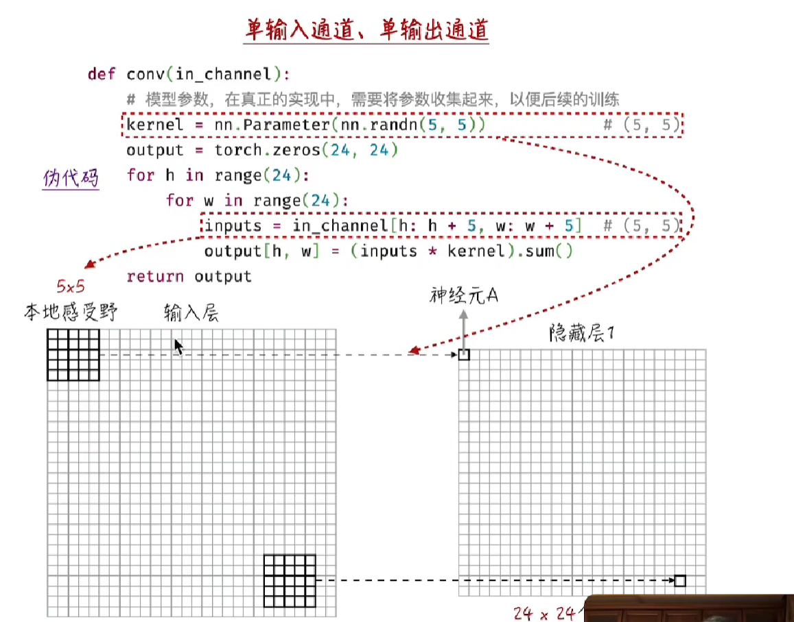
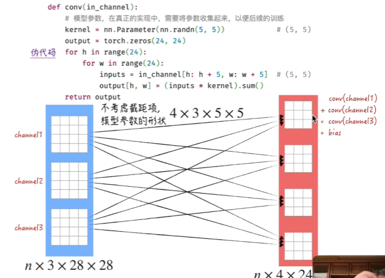
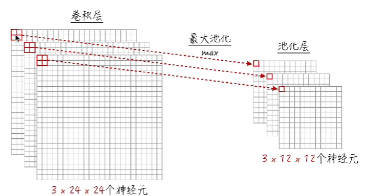
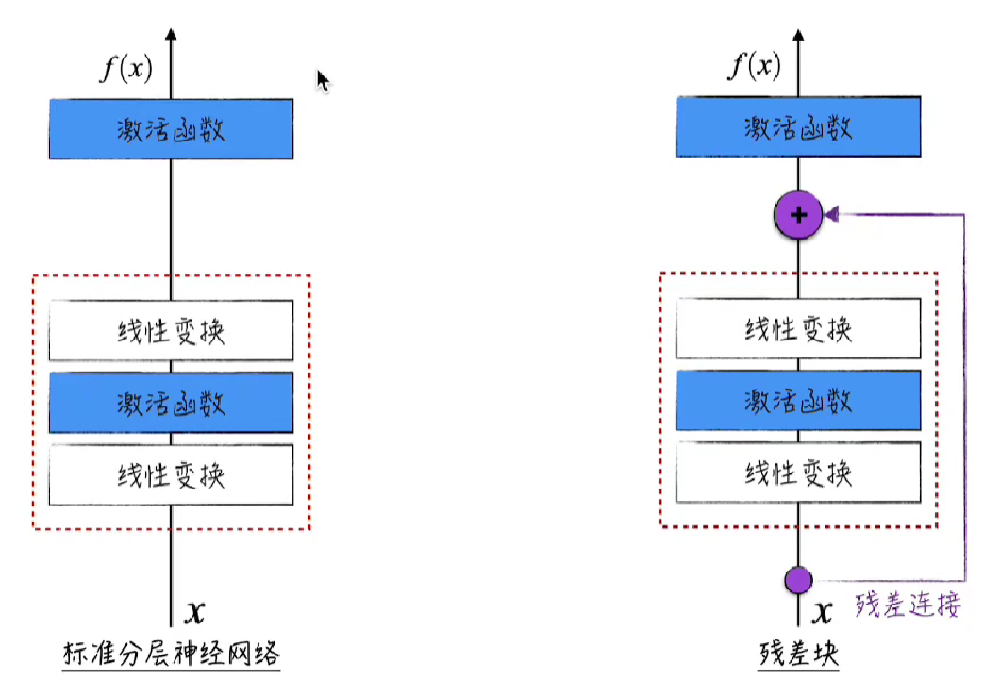
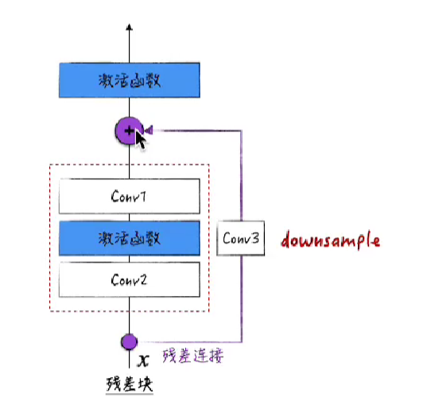

# CNN

之前我们学习的神经网络中，每个神经元都仅表示一个数字，我们现在希望每个神经元能够表示一个矩阵，基础的多层网络，一定程度上抹消了像素数据之间的位置联系关系

同时，保留了位置联系以外，CNN还能有效降低所要训练的参数量，在工程上可以使得神经网络变得更深

与一般神经网络内部主要以累加为主不同，CNN内部区分为卷积层和池化层

## 1. 基础组成

**卷积层**

​​

通过一个卷积核，这里写作一个本地感受野，将输入层处理一遍，将输入层取出和卷积核大小相同的一块，相乘再加和，生成结果

这种做法也存在一种特征提取的效果，根据特殊的卷积核，能够提取图像信息的不同特征

这部分我们实现的单通道，一个矩阵到一个矩阵，但是在神经网络内部层，应当是更加类似下图的结构

​​

卷积层的操作还有两个参数，就是指步幅和填充

* 步幅就是指卷积核的移动跨度，之前我们的计算中，卷积核的移动步幅都是一格
* 填充就是我们可以在输入的外部填充0

**池化层**

其主要是用于模拟视觉的模糊处理，只对输入矩阵的后两个维度生效，比如下图中就是做了取四个值内部最大值这么一个操作

​​

最后的结构应当是卷积层 -> 激活函数 -> 池化层这样一个结构

这样的结构重复多次，最后加上一个多层感知器，和一个Softmax

## 2. 优化神经网络之残差连接

残差连接的操作在于，在经历一系列的变换之后，给输出再加上原始数据，原因在于，我们的CNN的一大目标是可以让神经网络变深，但由于神经网络变深导致的梯度消失问题仍然没有彻底的解决，因此我们引入了残差连接

​​

上述说法是工程角度的，在理论角度来说，残差连接的存在使得模型更容易接近基准目标，也就是这个残差块退化成恒等变换的情况。在随机情形 -> 基准目标 -> 最优目标中加速了前半部分

但是上述的做法里面假设了卷积变换之后的结果和原始的输入x是拥有相同shape，但实际上并非如此，所以我们一般要给x这边另外加上一层卷积层，或者采用池化的技术也是可以的，以确保两边输出的结果的shape相同

​​
