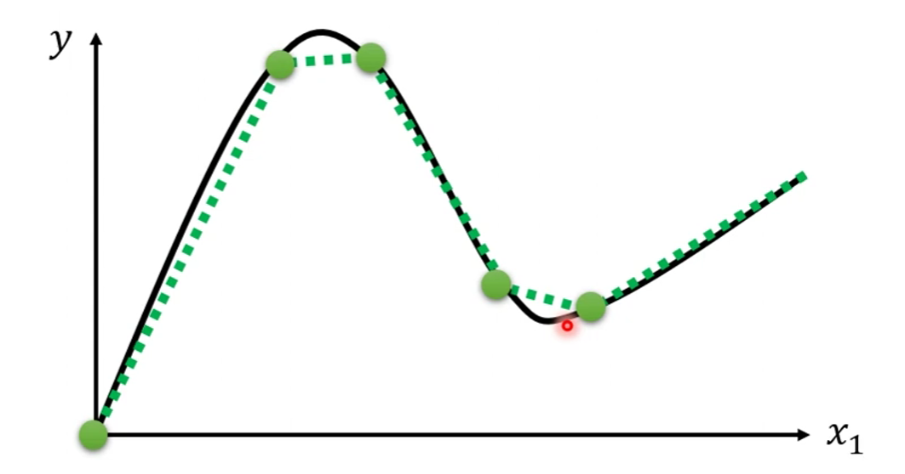
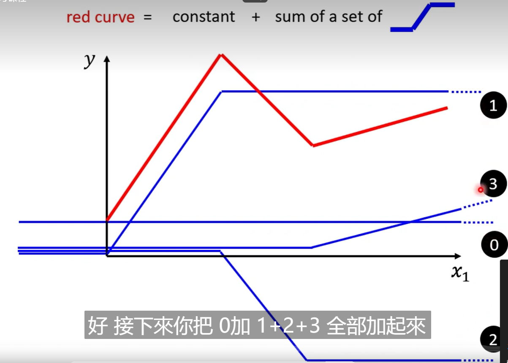
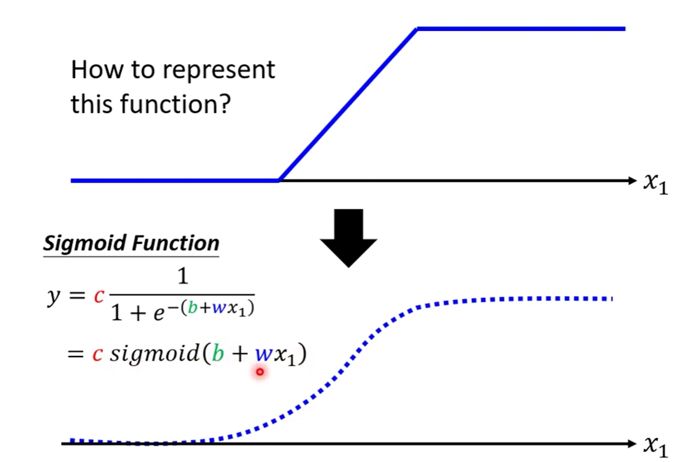
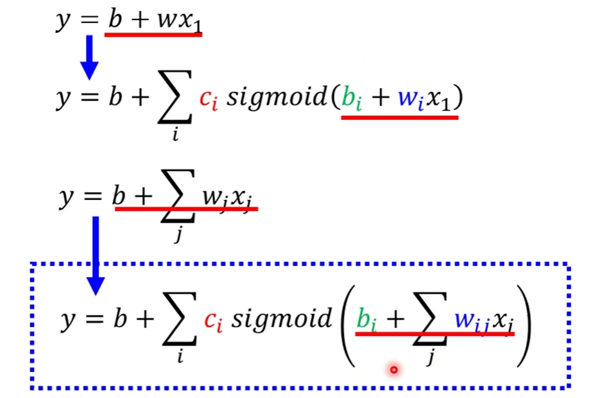
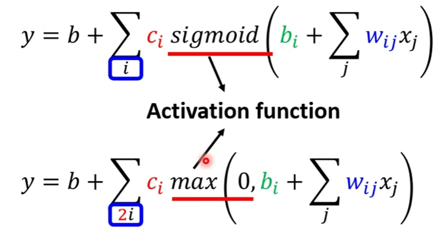
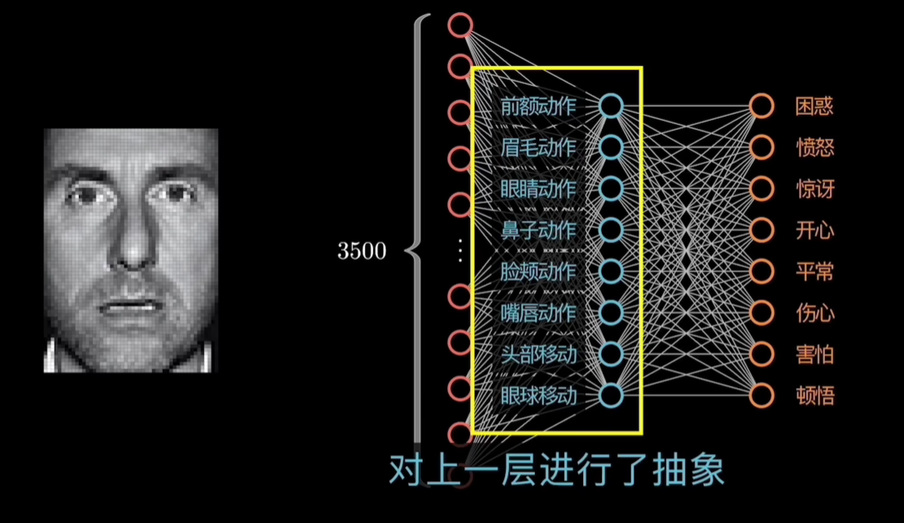

# 基础的多层神经网络

以线性模型和非线性函数为基础，能够产生出拟合所有曲线的单层模型，这种单层模型的连接可以组成基础的神经网络，我们有时候也把这种结构叫做多层感知器

## 1. 如何以单层模型拟合所有曲线

> 本部分来自 李宏毅机器学习课程

从线性直线，转向任意的曲线，用折线逼近曲线，如下图，绿色的曲线可能是我们现实生活中真正的情形，然后我们我们可以用折线去逼近这样一种真是的情形，就是二图中的红色曲线，然后我们发现红色曲线可以用一堆的蓝色折线去合成，这种蓝折线的特点就在于是常数-直线-常数，那么我们在数学上可以用Sigmoid Function，也就是三图中的曲线来逼近这样的蓝折线

​​​​

这种蓝色的折线，我们将其称为Hard Sigmoid，需要的Hard Sigmoid的数量与红色折线的段数相关

​​

这个复杂的式子，经过线性代数的视角，其实就是以下三个步骤

* $r = b+Wx$  W 是所有 Wij 形成的矩阵
* $a = \sigma(r)$        是指sigmoid函数
* $y = b+c^Ta$  最终成型

$$
y=b+c^T\ \sigma(b+Wx)
$$

sigmoid的数量越多，形成的函数结果越复杂，逼近效果越好，sigmoid的数量和feature的数量无关

​​

上述的式子，其实就是神经网络中的一层，但是实际上一层的神经网络已经能够逼近任意的复杂函数，这里留下了一个疑问，并且同时，更深的神经网络层数还会导致过拟合等问题

如上图是一层神经网络，里面有i个神经元，sigmoid函数的数量就是神经元的数量

## 2. 手写常规神经网络模型

这种最终以非线性函数形式返回的函数，被称为逻辑回归，神经网络的最后常常使用softmax函数作为最后的结果的处理

## 3. 神经网络的优化

```python
self.block = nn.Sequential(
       nn.Linear(input_dim, output_dim),
       nn.ReLU(),
)
```

Pytorch为我们封装好的神经网络如上，对于每一层我们只需要设置输入输出的维度和使用的模型，以及相应的激活函数就可以搭建出一个比较简单的神经网络

## 4. 应用之分类拟合

神经网络的优化原理，例如对于图像分类而言，一堆的点散落在二维（姑且假设是二维）平面上，我们难以做到用一条直线去切割完成分类，但是我们可以进行升维，将其转换成多维空间，然后我们可以用一个超平面做更好的切割分类

同时，我们之前提到了，理论上一层的神经网络足以拟合所有情形，但是为什么我们需要多层的神经网络，原因在于，我们可以通过降维度的方式对其进行抽象，比如我们将像素转换成了这几个动作，就是降维，因此如果用于判断一个人的心理状态，并非所有信息都是有意义的，比如毛发的稀疏，可能就和心理状态无意义，多层的神经网络会不断地抽象出与我们的目标更相关的信息

​​

我们输入一个向量，最后输出一个

* 数值 Regression
* 类别 Classification
