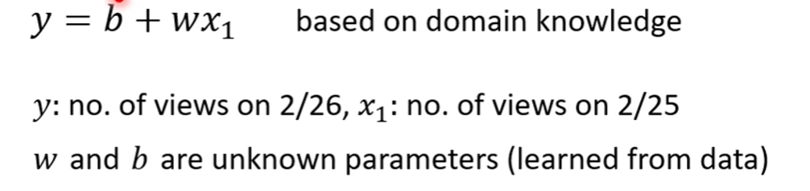
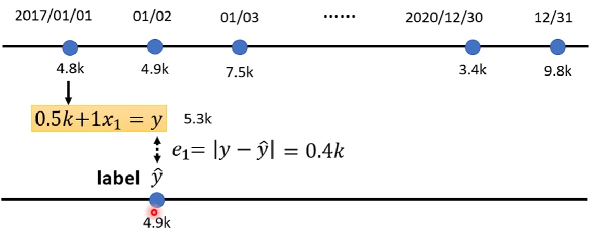
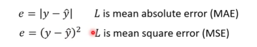
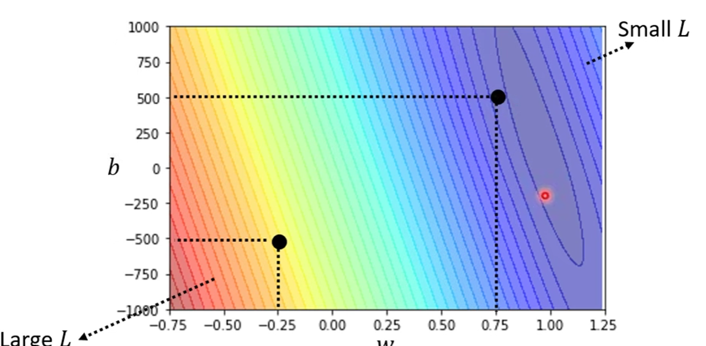
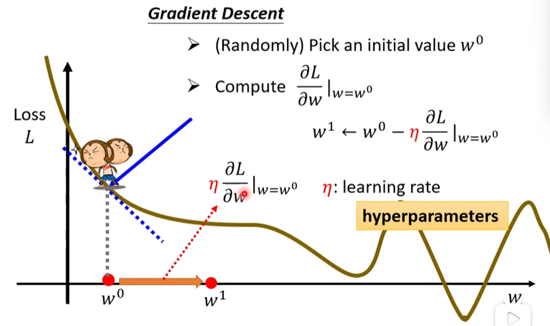
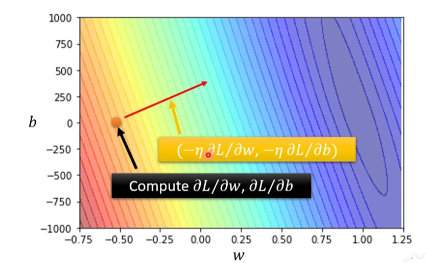

# 线性回归

线性回归的本质就是给定一堆数据，我们拟合出一个线性的函数出来，基础的线性回归的代码，第三方库已经帮我们封装好了

```python
from sklearn import linear_model
m = linear_model.LinearRegression()
m.fit(x.view(-1, 1), y)  #封装好的线性拟合，x和y变量就是对应的数据
m.coef_, m.intercept_    #拟合出来的线性表达式的参数
```

## 1. **一个例子**

> 这个例子来自于李宏毅老师的机器学习课程

**找到(猜测)一个式子**

对于一个问题我们想要用机器学习的方法来解决，首先我们需要有一个带有未知参数的式子。例如我们要预测频道第二天的点阅数量，我们可以考虑这么做

​​

至于为什么这个函数式子张这个样子，只能说是目前根据已有的经验猜测的，这个$y = f(x)$ 的式子，就称为一个Model

* Feature，是指像$x_1$一样我们输入的参数
* w 是 weight, b 是 bias 属于是约定俗成的名称了

**Loss Function for Train data**

$$
Loss = L(w, b)
$$

Loss function永远是针对一个训练集而言的，比如我们先假设，这里的$y=f(x) = x+0.5k$(这里的k是千的意思)

​​

label是指当天准确的数据，我们每次都计算预测数据和准确数据之间的差距（注意这个差距不一定是简单的相减），我们把这三年时间获得的$e_n$加起来求和

$$
loss = \frac1N*\sum_{i=1}^{N}e_i
$$

我们前文中提到这个差距不一定是简单的相减

​​

我们可以简单地穷举w和b的值从而获得一张图，里面越是红色系的表示loss越大

​​

**Optimization**

这里只介绍最基础也最常用的优化策略，也就是梯度下降Gradient Desecent，本质上就是对矩阵求导，找切向量，比如在一维的情况下就是找切线

​​

具体要往梯度下降的地方移动多少长度，这就取决于一个超参数，也就是上面的被称为learning rate的东西

同时我们也可以比较简单地推广到多维的情况，就是对各个维度都求一个偏导，形成一个向量的方向，也就是你需要梯度下降的地方

​​

## 2. 梯度下降

在做线性回归的过程中，我们最重要的步骤就是找到Loss Function以及进行优化，在这里就是梯度下降，而在一开始的代码中，这两步都被封装在一个`fit`​函数里面

```python
import torch.optim as optim

learning_rate = 0.1
model = Linear()
optimizer = optim.SGD(model.parameters(), lr = learning_rate)

for t in range(200):
    y_pred = model(x)
    loss = (y - y_pred).pow(2).mean() #定义损失
    optimizer.zero_grad() #清空上一步的梯度
    loss.backward()       #计算梯度
    optimizer.step()      #更新参数
    print(model.string()) #打印出每一步，然后看看参数变化
```

相对来说梯度下降的简单实现还是比较清晰的，但是问题在于，梯度下降在训练的过程中会遇到不少问题，比如

* 无法保证最低点，会遇到效果不好的极值点
* 计算量比较大，因为需要处理每一个点

使用随机梯度下降法可以比较好地解决这两个问题，把数据拆分成一堆的batch，然后进行相应的计算以及梯度下降

```python
# 随机梯度下降算法

learning_rate = 0.1
batch_size = 20
model = Linear()
optimizer = optim.SGD(model.parameters(), lr = learning_rate)

for t in range(200):
    ix = (t * batch_size) % len(x)
    xx = x[ix: ix + batch_size]
    yy = y[ix: ix + batch_size]
    yy_pred = model(xx)
    loss = (yy - yy_pred).pow(2).mean() #定义损失
    optimizer.zero_grad() #清空上一步的梯度
    loss.backward()       #计算梯度
    optimizer.step()      #更新参数
    print(model.string()) #打印出每一步，然后看看参数变化
```
