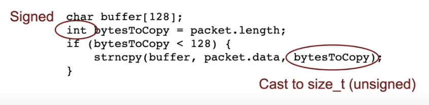
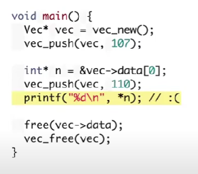
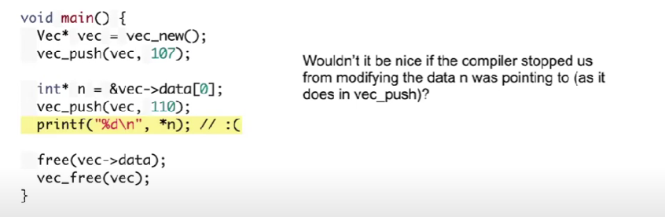
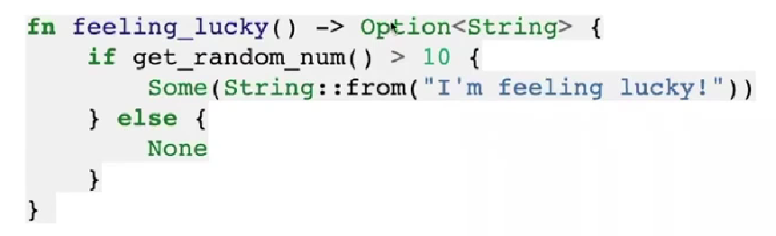

# CS110L

## 1. Introduction

这一节主要讲述了我们为什么想要学习Rust作为我们的系统编程语言。

**1.1 For C/C++**

首先是对于C/C++，相比于老生常谈的内存管理问题，这一节中老师主讲了buffer overflow问题，一如我们在CS161中学习的那样。C/C++中没有对于原生数组的边界检查，在一些库函数，比如gets上也并未作出足够的安全检测。还存在一些隐藏的类型转换的坑点，例如下图。

​​

另一方面，对于C的问题，业界也做了许多的努力，比如Valgrind这类内存检测工具，但其缺陷在于，这类工具仅当错误发生的时候能够有效检测，而很多时候我们并无法预料到会有哪些错误的输入。

**1.2 For GC language**

对于GC语言来说，系统编程的难点在于GC的效率以及对于内存的不可控制性，譬如我们隔一段时间就要打断运行来检测memory 状态；再比如说我想要观测内存状态来提高cache命中率，这对于GC来说都是难以做到的。。

并且即便是使用了GC，也并不能保证我们在内存管理上绝不出错

## 2. Memory Safety

memory problem有多种表现形式，由指针带来的不确定性形成的问题可谓千奇百怪，除了经典的Memory leak以外还有许多，例如

**Example1** **iterator invaildation**

​​

由于vector的resize导致的指针失效问题

### 2.1 language and the compiler

编译阶段，我们会对这个程序的代码进行足够多的分析，这些信息或许可以用在对于程序安全性的检查上。

如果我们存在一种算法，能够在编译阶段就找到这个程序所有可能的错误，那简直太完美了，可惜的是，这样的做法难度起码在停机问题之上，但是我们可以通过一些限制，来使得程序更不太可能出错。

我们还是回到上述的iterator invaildation的例子

​​

有一个不错的想法是，如果我保存了一个对于vec的引用/指针，我们就不能对于其再做修改

### 2.2 Rust's ownership

Rust的所有权机制，是来解决上述的问题的一种方式，不论是传递参数给函数，还是简单的“赋值”，都会导致所有权的转移

Rust的可变引用和不可变引用不仅会做引用数量和可变的检查，还会做生命周期的检查，例如这段代码中，编译器可以察觉出你在把一个生命周期不够长的引用放到外面

```rust
fn dedup(v: &mut Vec<i32>) {
    //unimplemented!()
    let mut temp_set :HashSet<i32>= HashSet::new();
    let mut target_vec: Vec<i32> = Vec::new();
    for i in 0..v.len(){
        if !temp_set.contains(&v[i]){
            temp_set.insert(v[i]);
            target_vec.push(v[i]);
        }
    }
    let t = &mut target_vec;
    v = t; 报错
    //mem::swap(v, &mut target_vec);
}

```

可变引用和不可变引用

正如我在Rust入门中写的，只能存在多个可变引用或者单个不可变引用，我们通过一个例子来看

```rust
fn main() {
    let mut s = String::from("hello");
    let s1 = &mut s;
    println!("{}, {}",s, s1);
}
```

这段代码看上去完全没问题，但实际上会报错

```rust
 --> src/main.rs:4:23
  |
3 |     let s1 = &mut s;
  |              ------ mutable borrow occurs here
4 |     println!("{}, {}",s, s1);
  |                       ^  -- mutable borrow later used here
  |                       |
  |                       immutable borrow occurs here
```

编译器说，对于println这个宏来说，s是不可变引用，s1是可变引用，即便是在参数上面，我们也无法做到同时传入可变和不可变引用。我们要注意，**任何一次传参相当于产生了一个引用，** 那么我们会考虑转变一下，把两者分开来输出

```rust
fn main() {
    let mut s = String::from("hello");
    let s1 = &mut s;
    println!("{}", s);
    println!("{}", s1);
}
```

这依旧会报错，因为编译器会发现我们这里有一个可变和一个不可变引用。但是如果把s1和s替换一下位置就没问题了，因此编译器认识到s1已经在其生命周期的的最后了

在函数的返回值过程中，返回值的所有权会转移到调用者处

**自动解引用**

在C++中，引用的存在往往是因为指针需要手动解引用，从而会让代码显得很难看的语法糖，而Rust会使用自动解引用，使得指针表现的原始的对象一样

```rust
p1.distance(&p2);
(&p1).distance(&p2);
```

### 2.3 Option

Option是Rust的一个机制用于替代空指针的使用。

​​

```rust
if !feeling_lucky().is_none(){
	println!("is lucky");
}
```

当我们需要获取Option中的值的时候，就需要获取调用`unwrap_or`​，如果是None就返回参数那个

```rust
let message = feeling_lucky().unwrap_or(String::from("not lucky"));
```

我们通常鼓励使用`match`​来匹配Option

```rust
match feeling_lucky() {
    Some(message) => {
        println!("Got message: {}", message);
    },
    None => {
        println!("No message returned :-/");
    },
}
```

### 2.4 Error handling

传统的C在错误捕获方面基本完全程序员之间的约定俗称，实际上是一种相当糟糕的做法。而Rust也没有使用Cpp和Java等主流语言的异常捕获机制。

如果发生了不可恢复的错误，Rust会使用`panic!`​宏，来使得程序崩溃

```rust
if sad_times() {
  panic!("Sad times!");
}
```

如果发生的错误可以恢复，我们需要返回一个 `Result<T, E>`​, 其表示我们返回 `Ok(value of type T)`​ or `Err(value of type E)`​.

同时我们可以使用`unwrap()`​和`expect()`​来检查Result

```rust
// Panic if the baby cries:
let ok_message = poke_toddler().unwrap();
// Same thing, but print a more descriptive panic message:
let ok_message = poke_toddler().expect("Toddler cried :(");
```

Rust使用`?`​关键词，来做类似于抛出异常的做法，我们在match一个可能会抛出异常的东西的时候，会使用`?`​，举个例子，当我们需要打开文件的时候，但是`?`​关键词的使用是有局限的，它只能在返回值为Result/Option的函数中使用

```rust
let file = File::open(filename)?;
```

相当于

```rust
let file = match File::open(filename) {
    Ok(file) => file,
    Err(err) => return Err(err),
};
```

## 3. OOP in Rust

Rust中同样存在结构体，可以为我们提供面向对象的功能，但是Rust的结构体增加了更多的限制。

### 3.1 动态内存分配

我们在之前的内容中一直在讲指针，却始终没有正面讲述动态内存分配的概念，对于Rust而言，它只有“智能指针”，指针被封装为一个类，其自动调用drop函数在生命周期结束之时

```rust
let x:Box<u32> = Box::new(10);
```

Option和Box类似，也是一种指针，在Rust中，指针可以通过take转移所有权，

### 3.2 OOP 以链表为例

有可能为None的值都需要用Option来包裹，Box表示其是一个Unique指针，可以通过动态内存分配

```rust
struct node{
    value: u32,
    next: Option<Box<node>>
}
struct linkedlist{
    head: Option<Box<node>>,
    size: usize
}
```

上面的struct是一个更类似接口的存在，需要impl之后才能正常使用

```rust
impl node {
    pub fn new(value:u32, next:Option<Box<node>>) -> node {
        node{value:value, next:next}
    }
}
```

这里的new关键词，是表示这是一个构造函数，当我们真正要实例化这么一个node的时候

```rust
let new_node:Option<Box<node>> = Some(Box::new(node::new(value, self.head.take())));
```

我们需要调用take()，显示地获取所有权，Rust不允许有两个变量拥有相同的所有权，因此需要take()来转移所有权；或者我们可以考虑实现copy方法，使得其完成资源拷贝

### 3.3 拷贝构造 or 移动构造

```rust
  let user2 = User {
        email: String::from("another@example.com"),
        ..user1
    };

```

我们可以用user1的内容来构造user2，同时更灵活的是，我们可以选择一些值不使用user1的，而是给它额外的参数，例如这里的`email`​字段

但是由于Rust的特殊性，如果user1中存在一些未实现Copy方法的字段，在本次构造之后user1会失去对这些字段的所有权。因此Rust这种原生构造更接近于C++中的移动构造函数

## 4. Traits and generics

### 4.1 traits

traits，一般理解为特征，是一种公有功能，例如Add，Display等，我们可以为我们自己的类去实现这些traits，并且可以根据traits去检查这些类是否满足条件

当然我们也可以自己定义traits，基础的语法如下，所谓的traits只定义函数声明长什么样子

```rust
pub trait Summary {
    fn summarize(&self) -> String;
}
pub struct Post {
    pub title: String, // 标题
    pub author: String, // 作者
    pub content: String, // 内容
}

impl Summary for Post {
    fn summarize(&self) -> String {
        format!("文章{}, 作者是{}", self.title, self.author)
    }
}

pub struct Weibo {
    pub username: String,
    pub content: String
}

impl Summary for Weibo {
    fn summarize(&self) -> String {
        format!("{}发表了微博{}", self.username, self.content)
    }
}

```

**traits实现的限制**

> 关于特征实现与定义的位置，有一条非常重要的原则：**如果你想要为类型** `A`​ **实现特征** `T`​ **，那么** `A`​ **或者** `T`​ **至少有一个是在当前作用域中定义的！**  例如我们可以为上面的 `Post`​ 类型实现标准库中的 `Display`​ 特征，这是因为 `Post`​ 类型定义在当前的作用域中。同时，我们也可以在当前包中为 `String`​ 类型实现 `Summary`​ 特征，因为 `Summary`​ 定义在当前作用域中。
>
> 但是你无法在当前作用域中，为 `String`​ 类型实现 `Display`​ 特征，因为它们俩都定义在标准库中，其定义所在的位置都不在当前作用域，跟你半毛钱关系都没有，看看就行了。

**默认实现**

我们允许traits里的方法有默认的实现，这种默认的实现只允许调用同一个traits的其他方法

```rust
pub trait Summary {
    fn summarize_author(&self) -> String;

    fn summarize(&self) -> String {
        format!("(Read more from {}...)", self.summarize_author())
    }
}
```

**以traits作为函数参数**

此处是Rust基于traits来实现多态的操作，在很多场合中表现很好

```rust
pub fn notify(item: &impl Summary) {
    println!("Breaking news! {}", item.summarize());
}
```

只需要item实现了Summary这个traits，便可以作为这个函数的参数被调用，上述做法还可以被表示为

```rust
pub fn notify<T: Summary>(item: &T) {
    println!("Breaking news! {}", item.summarize());
}
```

所谓的`T: Summary`​ 被称为特征约束，我们可以使用泛型实现相当复杂的特征约束

```rust
fn some_function<T, U>(t: &T, u: &U) -> i32
    where T: Display + Clone,
          U: Clone + Debug
{}

```

**derive 特征**

对于一些常用的特征，我们可以直接采用形如`#[derive(Debug)]`​的方式使得这个类包含了这个特征的默认实现

```rust
#[derive(Debug, PartialEq, Clone, Copy)]
struct Point{
	x: f64,
	y: f64
}
```

* Clone 覆盖显式地生成拷贝体
* Copy 覆盖 `=`​ 的效果
* PartialEq 等同于重载 ==
* Eq 表示两个东西指向同一个对象？ 比如两个不可变引用？

**来看一个例子**

```rust
impl Drop for LinkedList {
    fn drop(&mut self) {
        let mut current = self.head.take();
        while let Some(mut node) = current {
            current = node.next.take();
        }
    }
}
```

上述这个例子覆盖了我们的LinkedList里面的Drop方法，之所以需要覆盖这个并不是说Rust没有能力根据RAII去回收链表的资源，而是如果不覆盖的话，系统默认会根据递归的方式回收资源，但是如果能用简单的循环的话，递归总是不好的。

### 4.2 Generics

当我们在Rust中使用泛型的时候，基础的表达方式和其他语言并无什么不同

```rust
fn add<T>(a:T, b:T) -> T 
```

当我们要编写实际的代码时，却会遇到报错

```rust
fn add<T>(a:T, b:T) -> T{
	a + b
}
```

Rust对于泛型的语言存在比较严格的限制，当我们泛型的类型需要相加时，需要做出声明

```rust
fn add<T: std::ops::Add<Output = T>>(a:T, b:T) -> T {
    a + b
}
```

**在结构体中使用泛型**

```rust
struct Point<T> {
    x: T,
    y: T,
}

impl<T> Point<T> {
    fn x(&self) -> &T {
        &self.x
    }
}
```

**const 泛型**

也即对值进行泛型

### 4.3 深入了解Traits

​`dyn`​关键词，Rust中的特征对象的关键，有时候对于一个对象，我们仅仅关心其特征，而不关心其具体实现，此时就需要调用`dyn`​关键词

```rust
trait Draw {
    fn draw(&self) -> String;
}

impl Draw for u8 {
    fn draw(&self) -> String {
        format!("u8: {}", *self)
    }
}

impl Draw for f64 {
    fn draw(&self) -> String {
        format!("f64: {}", *self)
    }
}

// 若 T 实现了 Draw 特征， 则调用该函数时传入的 Box<T> 可以被隐式转换成函数参数签名中的 Box<dyn Draw>
fn draw1(x: Box<dyn Draw>) {
    // 由于实现了 Deref 特征，Box 智能指针会自动解引用为它所包裹的值，然后调用该值对应的类型上定义的 `draw` 方法
    x.draw();
}

fn draw2(x: &dyn Draw) {
    x.draw();
}

fn main() {
    let x = 1.1f64;
    // do_something(&x);
    let y = 8u8;

    // x 和 y 的类型 T 都实现了 `Draw` 特征，因为 Box<T> 可以在函数调用时隐式地被转换为特征对象 Box<dyn Draw> 
    // 基于 x 的值创建一个 Box<f64> 类型的智能指针，指针指向的数据被放置在了堆上
    draw1(Box::new(x));
    // 基于 y 的值创建一个 Box<u8> 类型的智能指针
    draw1(Box::new(y));
    draw2(&x);
    draw2(&y);
}
```

​`dyn`​只能用于Box或者&的地方

## Rust 语言特性

### Array and Vec

首先我们介绍array，其表示Rust中的定长数组，使用比较简单

```rust
let arr = [3; 8]; 表示生成一个8个元素，均为3的数组
```

但是当数组的元素是复杂对象的时候，问题会有所复杂，因为数组的生成需要的是拷贝特性，比如上述代码相当于把3拷贝了8次，但是复杂对象可能默认是移动语义

```rust
let array: [String; 8] = std::array::from_fn(|_i| String::from("rust is good!"));

println!("{:#?}", array);
```

数组还可以做切片

```rust
let a: [i32; 5] = [1, 2, 3, 4, 5];

let slice: &[i32] = &a[1..3];

assert_eq!(slice, &[2, 3]);
```

上面的数组切片 `slice`​ 的类型是`&[i32]`​，与之对比，数组的类型是`[i32;5]`​，要注意切片是对原数组的引用

## Project and Exercise

### week1

part1主要是一些简单的变量使用的说明，在Rust入门里面写过了就懒得再写了

**关于字符串**

关于字符串，Rust中有两种字符串类型`&str`​和`String`​，其中`&str`​是一种指向内存中的字符串的不可变指针，而`String`​类型则是表示一个heap-allocated的字符串

```rust
let s: &str = "Hello world";    // the ": &str" annotation is optional
let mut s: String = String::from("Hello "); // "String" type annotation is optional
s.push_str("world!");
```

**数组**

Rust使用Vec表示变长数组，和[]表示定长数组

```rust
let mut v: Vec<i32> = Vec::new();
let mut arr: [i32; 4] = [0, 2, 4, 8];
```

数组的遍历，`iter()`​ 迭代的是不可变引用

```rust
for i in v.iter() { // v is the vector from above
    println!("{}", i);
}
```

对于Vec，Rust已经为我们完成了运算符重载，可以直接用过==比较是否完全相同

**函数**

```rust
fn sum(a: i32, b: i32) -> i32 {
    a + b
}
```

**expression**

Rust深受函数式语言的影响，其中一切均为expression，我们可以编写这样的代码

```rust
let x = if someBool { 2 } else { 4 }
```

亦或者是这样的递归

```rust
fn fib(n: i32) -> i32 {
    if n <= 1 { n } else { fib(n-1) + fib(n-2) }
}
```

‍
