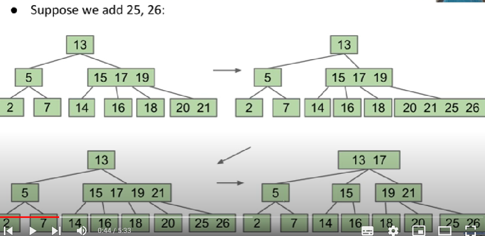
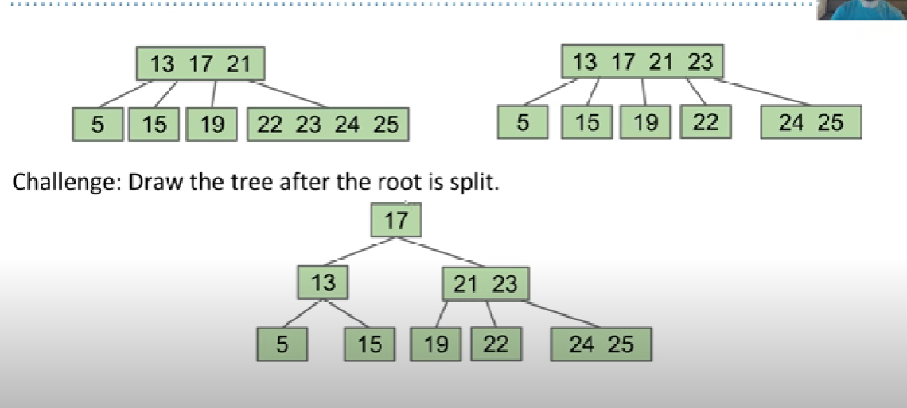
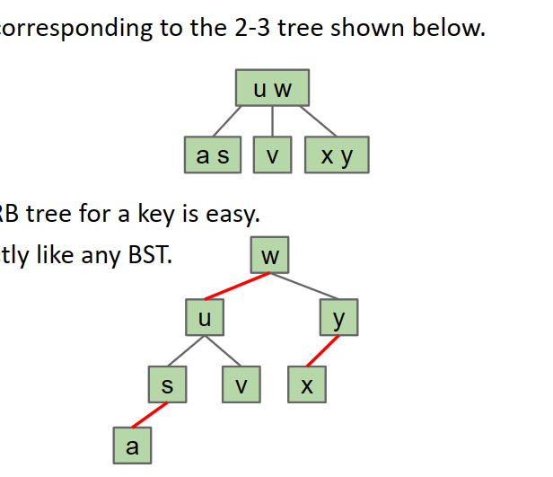

# data structure

## ADT

ADT, abstaction date structure, is defined by its operations, not by its implementations

Java separates the interface from implementation, which could better carry the concept of ADT.

In java.util library, many important interfaces like List Set Map all extend **Collection ** interface.

## iteration

**introduction:**

We can make the loop for the elements in the Java's built-in HashSet, like below

```java
Set<String> cities=new HashSet<>();
cities.add("BeiJing"); 		cities.add("HangZhou");
for(String city: cities){
	System.out.println(city);
}
```

However, the data structure we usual define may not support this way of loop.

So what happens in the 

```java
for(String city: cities)
```

In fact, it will be translated to this form of loop.

```java
//seer.hahNext() is to check whether there is unseen elements left, if it returns true means it still have element left
//seer.next() finish two actions: return the next element and advances the seer by one item
for(Iterator<String> seer=cities.iterator();seer.hasNext()==true;){
	String city=seer.next();
	...
}
```

the key of this loop is the object called iterator. 

**here we talk about how to implement the iterator**

A good way to learn iterator is to understand the Java's built-in iterator interface.

```java
public interface Iterator<T>{
	Iterator<T> iterator();
	boolean hashNext();
	T next();
}
// we notice that we don't define public and private in the interface
```

Note that if we call the next() method while there is no element remains, it will usually throw exception message.

In most cases, the classes want to be iterable will implement their own Iteration.

```java
private class ArraySetIterator implements Iterator<T>{
	private int wizPos;
	public Iterator<T> iterator(){return new ArraySetIterator;}
	public boolean hasNext(){
		return wizPos<size;
	}
	public T next(){
		T returnItem = items[wizPos];
        wizPos += 1;
        return returnItem;
	}
}
```

And the iterator should implement the Iterator while its container ArraySet should implement the Iterable.

## List

### linklist in java

At first, we design a simple IntList class, which we can refer to LinkList floder "the first Intlist version" in git.  
It's function is enough as a linklist but it's application is awful.

We can find the final version of SLList in the LinkList floder and refer to the git version, which marked with "this version for SLList is almost perfect"

Because the LinkList is already familar. So our note will begin with the doubly linked list

**doubly linked list**

```java
public class IntNode {
    public IntNode prev;
    public int item;
    public IntNode next;
}
```

Above is our IntNode class in this data structure

As we have two pointer here, so we can have two sentinel node to avoid some problems.  
Or we can use one sentinel node and create a circle

**to break type limitation**

refer to java learning--generics

### Array

Array consists of a fixed length N and a sequence of N memory boxes, which is continuous(?).

Unlike the class we design, array don't have methods.

**How to create array**

```java
int[] x = new int[3]; //这种处理方式会给x的三个元素一个default value 一般是0
int[] y = new int[]{1, 2, 3, 4, 5};
int[] z = {9, 10, 11, 12, 13}; //这种处理方法只能在声明时使用
//只有这三种方式
```

**Multidimension array**

```java
//初始化的时候可以不确定子数组的大小
int[][] pascalTriangle=new int[4][];
pascalTriangle[0]=new int[]{1};
pascalTriangle[1]=new int[]{1,2};

//也可以选择初始化子数组的大小
int[][] matrix=new int[4][4];

//初始化的时候就确定数组内容
int[][] anomatrix=new int[][]{{1,2,3,4},{1,2,3,4},{1,2,3,4},{1,2,3,4}};
```

Array is different from class, it uses "[]" to access memory while class uses "."

Here is a special example

```java
int indexOfInterest = askUserForInteger();
int[] x = {100, 101, 102, 103};
int k = x[indexOfInterest];
System.out.println(k);
//当我们运行该程序的时候它会询问你需要的下标，然后显示出结果
```

### AList

Array in java doesn't meet the requirement as an abstract data structure. The most obvious part is that it has fixed length, while the List we need shouldn't have length limits.

So we need to design a class based on Array and expands its method.

#### stack and queue

Stack and List are all ADTs, which is defined by their methods not their implementation. But here are some ADT  
like stack and queue are lists with their specific behavior.

### deque

Deque is an ADT and we implement the two kind of deque in the project 2. They are ArrayDeque and LinkedListDeque.  
We also create an MaxArrayDeque to extends the methods of these two implementation.

## disjoint set

Disjoint set is a dats structure with these two operations

```java
void connect(x,y)		//连接x和y
boolean isConnected(x,y)//检查x和y是否连接，连接可以传递
```

The purpose is simple but the importance is how to implement it. In the 61B, the slides give many different ways to complete this task, and we find some features of this data structure. (I will complete some of them in the **javatest/disjointset/** )

1. we don't add elements just create connections
2. we don't make disconnecting action so we don't know how do two elements connecct.

The tree structure to store each set is a good way to advance the connecting and checking. Because the whole number of elements  
won't change, we can use the array to imitate the tree. If two elements have the same root, they are connected.

In this implementation, the important part is to loose the weight of tree. If we complete it well, the time complexity will be O(logN) 

There still is an idea to make it quicker, when we check "isConnected", we will traverse all elements from one element to its root, we can connect these elements along the way with the root directlt while traversing

```java
//implement the isConnected
```

## tree

### the definition of tree

Tree maybe the most important data structure we have learnt.

For the detailed the definition of the tree, I have talked about it in the ZJU-fds note and I will not repeat here.

### basic binary tree

Binary tree is one of the most important special trees, and it has the feature that each node has 0, 1 or 2 children.

And the binary search tree is one of the applications of the binary tree, with the property that for each node, each key in left sub-tree is less than this node and each key in the right sub tree is larger than it.

```java
private class BST<Key> {
    private Key key;
    private BST left;
    private BST right;

    public BST(Key key, BST left, BST Right) {
        this.key = key;
        this.left = left;
        this.right = right;
    }

    public BST(Key key) {
        this.key = key;
    }
}
```

For the binary search tree, we also need the find method and the insert method.

```java
static BST find(BST T, Key sk) {
   if (T == null)
      return null;
   if (sk.equals(T.key))
      return T;
   else if (sk ≺ T.key)
      return find(T.left, sk);
   else
      return find(T.right, sk);
}
static BST insert(BST T, Key ik) {
  if (T == null)
    return new BST(ik);
  if (ik ≺ T.key)
    T.left = insert(T.left, ik);
  else if (ik ≻ T.key)
    T.right = insert(T.right, ik);
  return T;
}
```

**Note:**  we find that we always insert a leave node in the insert method.

Besides, we also have **delete method** should be implement but it is a little of complex.

* For node with one child and no child is easy to delete.
* For the node with two children, we need to find the the least node in right sub-tree or the biggest node in the left sub-tree, and replace it with the node you want to delete.

Binary search tree can be the implementation of the ADT set and map with high efficiency. But this efficiecny is highly related to the structure of the tree.

We have the height and the average depth to deterimine the worst run-time and the average run-time. And the order you insert the node determine the height of the tree.

For the balanced search tree, the time complexity of search is always O(N).

### B-tree

It can contain three elements in each node and its means it will have at most four children at the same time. (this kind of b-tree has L=3, means each node has the maximum number of element with 3)

​​

 Each time we add an element we add it to leaves inside and the size of leaf is overflow we add the element to the parent node until the root is overflowed the height of the tree adds.

​

It is a good way to keep the balance of the tree. No matter how we insert the element, B-tree can keep the O(logN) efficiency.

### the rotating tree

B-tree is great but it is hard to implement, so we don't mention the code in the last chapter.

However, here are still many ways for us to keep balance tree, like tree rotation.

So we need to know what happened when tree make rotation.

```java
private Node rotateRight(Node h) {
    // assert (h != null) && isRed(h.left);
    Node x = h.left;
    h.left = x.right;
    x.right = h;
    return x;
}

// make a right-leaning link lean to the left
private Node rotateLeft(Node h) {
    // assert (h != null) && isRed(h.right);
    Node x = h.right;
    h.right = x.left;
    x.left = h;
    return x;
}
```

Here we give an example of the rotation

​​

‍

### red-black tree

We want to create a BST and it can be structurally identical to 2-3 tree(not 2-3-4 tree), so it is easy to implement and stays balance.

We know that 2-3 tree is not the binary tree and we can design some rules to make 1-1 correspondence between one kind of binary tree and 2-3 tree, which kind of binary tree we called red-black tree.

We choose arbitrarily to make the left element a child of the right one. This results in a **left-leaning** tree. The link we glue we make it red.

​

And the left-leaning red-black tree has the features below

* 1-1 correspondence with 2-3 trees.
* No node has 2 red links.
* There are no red right-links.
* Every path from root to leaf has same number of black links (because 2-3 trees have same number of links to every leaf).
* Height is no more than 2x height of corresponding 2-3 tree.

So as the BST with the balance structure, we don't worry about its find method, we can do it like the normal BST. What we really care is the insert method.

We should avoid creating the 2-3 tree but we need to keep balance, we should insert element using the BST's method and using the rotation to keep it balance. This is a little complex problem.

1. **insert color** In 2-3 tree, we always add items in red link
2. **insert to the right** Of course we will add a right red-link here, but we don't have right red-link in LLRB so we will make rotation. make the left-rotation to the parent node.
3. **double insert to left **  we will create a temporary node with two red links.
4. **splitting the node ** the situation in 3 is temporary and we need to split the node. And here we don't need to make any rotation we just make the two red links black and their parent link red.

The implementation of the red-black tree can refer to the CS61B sp-21 lab7( **note ** that the delete operation may break the balance.

## hash

We have make a lot of effort to achieve a quick search. And the best one the red-black tree. But it has limits, for example the elements in it should be comparable and the search speed is O(logN).

Then we have hash. We can assume that we have a big array, and we have a function can turn every object into an "int". So we can find the object in O(1), by `array[object.toInt];`​ 

We called this "int" as "hashcode". When we create a rule to make the hash, the collision is inevitable. So our position in the array should contain more than one element. For example, we can create a linked list in each position.

Because our array has limited size, if the size is fixed and the number of elements grows, the time complexity of searching will become the O(N), that's bad.

**resize the array**

If the number of elements(M) grows too large, we can resize the array size(N), to keep the M/N is constant number, so the search efficiency will keep O(1).

Besides the resize task, we also need to have a good hash function to make the hash map working quickly.

**implementation in Java**

All of object in Java implements the function `hashCode()`​ which is inheriting from the Object class.

Note:

* the hasCode return a integer, which has limited range in Java
* the hasCode can be negative. But we don't have negative array subscript in Java. So we should use a Math function.  
  ​`Math.floorMod(-1,4)`​ which will be 3 (we assume that 4 is the size of array)

```cpp
array[Math.floorMod(object.hashCode(), array.size())] = true;
```

If you want to use the hashMap and hashSet in Java correctly, you should note that

* don't change the element the object in hashMap or set. When it changes, so does its hashCode
* you should overrides the equals() method and hashCode() method together

**a good hash function**

Now we have almost solve the problem of hash, But there still is one leave. How to write a good hash function.

A good hash function should be random.

## priority queue (heaps)

Refer to ZJU-fds

## graph

In trees we can only find one path between two nodes. And we can break this rules in graph.

A graph contains

* a set of nodes
* a set of edges( can be 0 )

‍
