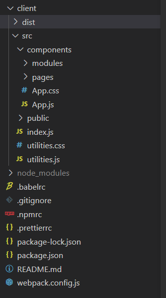

# react

### 设计思想

**component**

react的设计通常把整个website看做一个app，其本身是一系列组件的集合，其设计的核心是把一个大的组件·分成一系列小的组件，如此划分下去，组件的内部需要一定的逻辑上的耦合。

对于每一个website，我们都可以画出它的组件树，组件树为我们提供一个清晰的消息传递的方向。

**props** 是指父亲组件传递向子组件的消息，对于任意的子组件，props是read-only。(无需更新的信息)

**state** 状态是指一个组件内部私有的信息，被这个组件独立维护，例如下图。state用来处理对于这个组件的输入信息，而设计上而言，父组件不能获取state的信息。react component都需要有一个initial function来初始化state。（需要更新的信息）

​​

**make states stay and make props pass**

### 代码实践

tips： 对于react来说，需要使得生成的html code接受到css的效果，要用className代替class

对于一个react component来说，需要

* 一个constructor来接受props并且做initialize
* 一个render()来返回HTML-like code

react中展示空用null

react会在更新state的时候自动刷新render(包括所有子组件)，但是update state需要特定的做法，需要调用setState函数，而不是直接依赖“=”去修改我们的state，给个例子

```javascript
likeComment = () =>{
	this.setState({
		isLiked : true,
	});
}
...
render(){
	return(
		<div ... onClick = {this.likeComment}>  不需要在这里加上括号
			{this.props.content}
			{this.state.isLiked ? <LikeButton/>:null}
		</div>
	);
}
```

如何在父组件中导入子组件

* 首先需要import

```javascript
import CatHappiness from "../modules/CatHappiness.js"
。。。。
<CatHappiness catHappiness={catHappiness}/>

基础的格式为
<Component propName={propValue}/>
```

* component指代我们需要的组件名称，propName是指我们需要传入的信息的名称，propValue是指需要传入的信息的值、

**函数组件和类组件**

一些简单的情况下我们可能可以采用函数组件来进行编写（个人认为类组件更加符合设计一点

两者功能是相同的，在传递props的行为上有些许不同

**在函数形式中标准做法例子**

```cpp
const [catHappiness, setCatHappiness] = useState(0);  初始化的时候同时定义变量和对应的set更新函数

  const incrementCatHappiness = () => {
    setCatHappiness(catHappiness + 1);
  };

<div className="Profile-avatarContainer" onClick={incrementCatHappiness}>
        <div className="Profile-avatar" />
</div>
```

**一些tips**

对于顶层的App.js来说，其不需要构造函数

在react中，命名规范应当是类似于NavBar-contianer

如果一个组件只有render函数，可以简写为

```javascript
const Profile = () => {
  return (
    <div>
      <div className="Profile-avatarContainer">
       ...
    </div>
  );
};
export default Profile;
```

react的html元素是组件化的，但是js本身支持把简单的html赋值给js变量，因此一些简单的情况下无需创建新的组件

**组件挂载和组件更新**

‍

### 开发指令

对于react而言，我们不能简单地找一个html文件在浏览器中打开，我们需要在文件目录下执行`npx webpack`​指令，其会在/client/dist下面生产一个index.html文件，我们可以在浏览器中打开它。

但是问题在于我们的修改不会实时反应在这个index.html上，会使得我们的工作流变的复杂

对此我们可以使用`npm run hotloader`​ 指令，在主机的一个端口上打开一个实时更新的页面

### 文件组织和import

​​

基础的代码组织如上图，我们主要编写代码都在src/文件夹中

* public文件夹内置全局会用到的一系列资源，比如图片等
* utilities.css 中主要包括全局会用到的一些典型的css效果，通常是简单的和常用的，并且一般会包括所有的css变量  
  utilities.js   中一般包括一系列js函数来做API request
* component/文件夹中包括网页的主体内容，一般就是js文件搭配对应的css文件
* modules/文件夹中包括网页的具体的组成部分，也就是react设计中网页被拆解成的各种的component  
  pages/文件夹包括网页的各个页面，一个网页不止一个页面，一般每个页面会给一个文件，来组织modules文件夹中的components
* 在App.js中组织所有的pages
