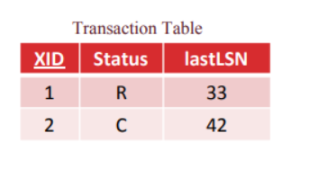
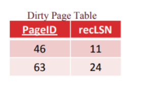

# Concurrency and recovery

毫无疑问，在多用户状态下，数据库是存在多线程问题的。我们可以考虑使用事务(Transaction)来处理这个问题。

## Transaction

所谓的一个事务，其本身是指一系列的操作，这些操作整体需要被视为一个原子操作。事务通过保证ACID属性来避免并发问题

* Atomicity 事务以两种方式停止，commit或abort，所有操作要么发生要么不发生
* consistency DB在事务前后都保持一致
* Isolation 事务之间的操作是隔离的，虽然在内部不一定是隔离的，否则效率太低，但是会确保表现出来的结果是隔离的
* Durabilty 如果事务被提交，其效果一定要在失败后保存下来的

## **concurrency control**

最主要的，我们需要保持隔离性，最简单的做法就是单线程执行所有事物，确保一个事务结束后再执行下一个，我们将这种做法称为serial schedule。但是效率很低。因此我们需要构建并行的操作序列，也就是引出了我们需要判断两个操作是否为confict

如果两个操作是conflict，其必定同时满足以下几个条件

* 两个操作来自不同transaction
* 两个操作针对同一个resource
* 至少一个操作是写入

如果一个操作序列其结果满足等效于serial schedule，我们将其称为**serializable**

我们可以通过构造依赖图的方法判断一个schedule是否是serializable，

### Two phase Locking

对于一个数据而言，基础的操作就是读和写，要保持并发安全，一个数据只能由一个事务在写，或者多个事务在读（让我想起了Rust里的可变引用和不可变引用hhh）。因此写需要独占锁，读需要共享锁。

一个事物序列会设置一系列的锁定点，其需要在事务获取data之前获取掉所有所需的锁。

根据2PL的规定，当事务释放掉它的第一个锁之后，其不能再获得新的锁

在2PL协议下，每个transaction都会经过两个阶段：在第一个阶段里，transaction根据需要不断地获取锁，叫做 ***growing phase (expanding phase)*** ；在第二个阶段里，transaction开始释放其持有的锁，根据2PL的规则，这个transaction不能再获得新的锁，所以它所持有的锁逐渐减少，叫做 ***shrinking phase (contracting phase)*** 。

这个机制，保证了冲突事务操作构成的schedule是serializable的

2PL的问题在于其容易受到级联中止的影响，比如事务2读了事务1写完之后的数据，但是此时事务1需要被abort了，这时候事务2就出现了脏读，导致事务2也需要终止。

## recovery

recovery就是让数据库系统拥有抵御故障的能力，这涉及到事务的两个性质

1. **Durability**: 事务一旦完成，我们永远不会丢失事务的结果
2. **Atomicity**: 事务永远不会处于中间态，要么完成，要么完成不做

要维护两个性质，我们面对一些问题

* buffer pool manager的问题，由于我们之前所有的操作都通过buffer pool进行，实际上事务完成写入之后，很多page还留存在内存中，等待下一次被替换策略驱逐之后才真正进入磁盘，但是内存在故障中是不可靠的
* 同时，在我们写入内存之后，buffer pool随时有可能因为替换策略将修改的page存入磁盘，这使得事务存在了中间态

当然我们可以采取一些降低效率的做法，比如在完成事务后强制把所需的page全部写入磁盘，或者确保在事务过程中任何page不会被写入磁盘中，但是这种做法是低效的，并且某种程度上抹杀了buffer pool的意义。

### log manager

我们采取日志log的做法实现recovery，我们将log分为几类

* START
* UPDATE
* COMMIT
* ABORT

log记录同样需要一个page来处理，但是其本身也会遇到上述的一系列问题，因此我们需要做一系列规定

* log record一定要先于相应数据页写入磁盘之前写入磁盘
* 当事务提交的时候，所有日志记录都需要写入磁盘

这样就保证了两种情况下，我们都有能力恢复

1. 事务提交了，但是有修改的page还存在内存里，这时候崩溃
2. 事务中间态，指有修改已经存到磁盘里面，这时候崩溃

**implementation**

要实现上述两个做法，我们需要对于所有的日志存储一个LSN的字段，这个LSN唯一标记一个日志，这个字段顺序增长，可以表示日志的顺序关系，同时我们还会存储每个事务最后一个操作的LSN值。

```cpp
struct LogRec {
    LogRec() = default;

    LogRecType type_{LogRecType::kInvalid};
    lsn_t lsn_{INVALID_LSN};
    lsn_t prev_lsn_{INVALID_LSN};

    [[maybe_unused]] KeyType old_key;
    [[maybe_unused]] ValType old_value;
    [[maybe_unused]] KeyType new_key;
    [[maybe_unused]] ValType new_value;
    txn_id_t txn_id;

    /* used for testing only */
    static std::unordered_map<txn_id_t, lsn_t> prev_lsn_map_;
    static lsn_t next_lsn_;
};
```

通过上述实现，通过每个事务的最后一个LSN，我们可以逆序追踪这个事务所有的日志。

并且我们还应该存储FlushedLSN，记录刷新到磁盘的最后一条日志记录的LSN

同时我们还向每个page加上一个字段，称为pageLSN，存储了上次修改页面的操作的LSN。以下代码来自minisql的page.h

```cpp
  inline lsn_t GetLSN() { return *reinterpret_cast<lsn_t *>(GetData() + OFFSET_LSN); }

  /** Sets the page LSN. */
  inline void SetLSN(lsn_t lsn) { memcpy(GetData() + OFFSET_LSN, &lsn, sizeof(lsn_t)); }
```

此时我们维护一个不等式，每当一个page需要被刷到磁盘里的时候，我们需要check一下该page的LSN和FlushedLSN，如果 $pageLSN\leq FlushedLSN$ 那么就可以这个page就可以被刷入磁盘。

### 事务终止

有时候用户会主动终止事务，或者是系统检测到死锁的时候，这时候我们就有了新的日志也即ABORT。

ABORT表示事物终止流程的开始，其后面会写入一系列CLR（compensation log record）也即撤销前面操作的日志，其本身与前面的UPDATE日志基本是对应的。这里也需要加上日志是因为，我们无法保证在recovery的过程中会不会再发生崩溃。

### log recovery

通过上述的结构，我们可以构建出两个表，一个表对应一个事务，一个表表示所有脏页

​​

下图中的recLSN是第一个使page变脏的LSN序号

​​

通过上述的表我们能很好地完成recovery工作。当数据库崩溃的时候，我们只能使用已经存在于磁盘里的数据。在恢复过程中我们做以下工作

1. 重建上述两张表
2. Redo 重复那些未写入的磁盘的修改操作以确保持久性
3. Undo 撤销那些处于中间态的事务以确保原子性

我们实际上需要把这两个表也作为日志的一部分写入磁盘

‍

‍
