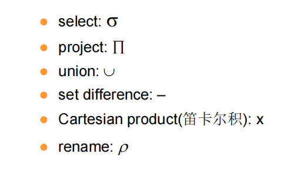
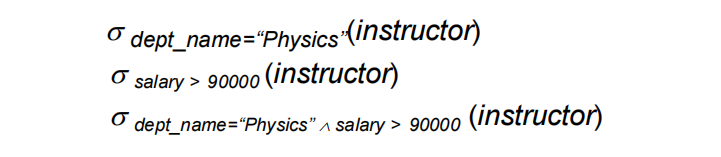
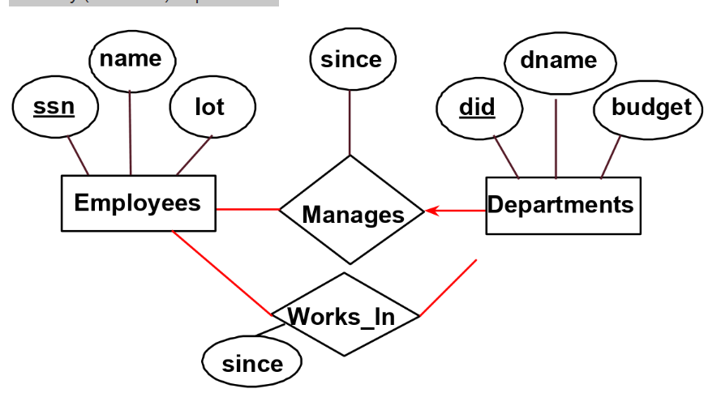
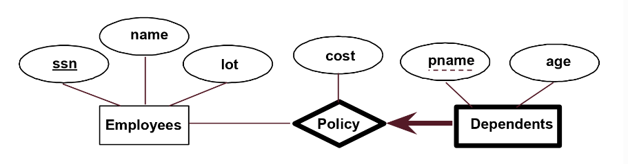
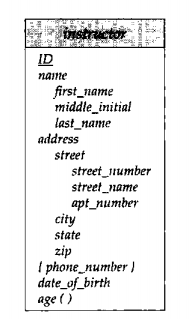
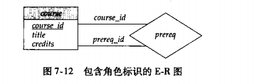
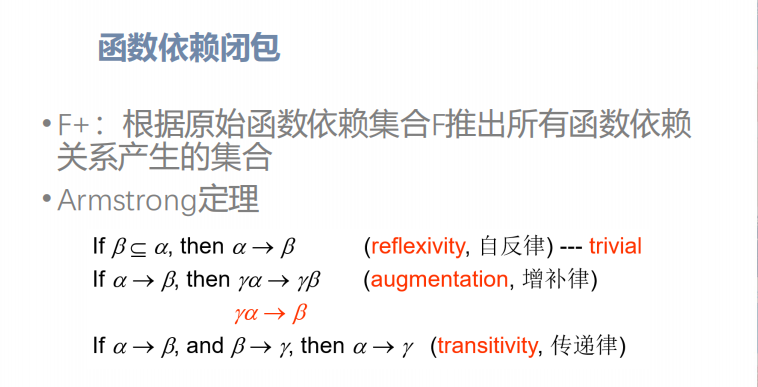
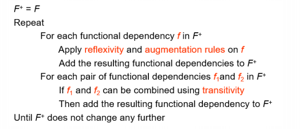

# DB design

本节主要讨论如何设计一个关系型数据库表，来有效地表示现实的对象

## 表设计中的问题

* 空值不等于空值

superkey 是超键 是来确定唯一一个元组的，其本身可以是一个集合，比如我们有ID可以确定任何一个元组，那么ID和name的集合，ID和性别的集合，都是超键

candidate key  K 是最小的超键，内部不含有多余元素，也即不是集合，但是能够唯一确定一个元组

foreign key 是构建表和表之间关系的属性

primary key 是我们在设计数据库选择的候选键，primary key的集合是超键？

**null value**

* todo

null 是 is null 不是 =null  null和任意数据做计算都是null

null 参与比较的结果是 **unknown，** 而unknown有自己的一套运算规则，见PPT

## relational algebra

6个基本的算子

​​

本质上输入tables，输出新的tables

**select operation**

​​

这块详见sjl的ppt，relational model

**project operation**

删除制定的属性中，重复的部分

**union operation**

在属性相同的情况下，把两个table合并

**set difference operation**

在属性相同的情况下，减去一个table

**Cartesian product 笛卡尔积**

每行和每行配对

**natural join**

## view

* view 视图是仅是一个查询
* material view 是把数据拎出来重新做一个表，维护的代价是需要再多方进行维护数据完整性，针对那种多用查询，少做删改的table

视图的更新，视图的行为表现的和表一样，但是在更新过程中存在问题，时刻意识到view并非一个实际存在的表，因此更新视图的时候要小心

## index

对于index来说有一些topics

* 一维和多维的索引
* 单点查询和范围查询

## SQL 里的编程语法

可以写function， procedure

if-else 和 while repeat

## 完整性约束

## Entity-Relationship Models

> tips：这里面的部分图来自于CS186，考试的时候ER图需参照ZJU的PPT

entity: 描述一个现实的对象的一系列属性

relationship: 两个或多个实体之间的联系，可以是一对一，一对多，多对多

​​

在绘制ER模型图中的连线存在一些规范：

* 关系和实体之间的连线如果为**无箭头实线**，那么表示多对多的关系，如上图中，Employee可以在多个department中工作；Department中也可以有多个Employee
* 如果实体存在一个指向关系的**有箭头实线**，那么其表示一对多的关系，也就是ER图表示键约束的方式之一，如下图中，这个manager的关系，表示，一个Employee可能是多个Departments的manager，但是一个Department仅有最多一个manager，PS这里的箭头方向与书里面正好相反，书里是指向实体
* ER图区分线的**粗细**，粗线表示至少一个，也就是这个实体在这个关系中至少参加一个，图就不放了，如果给Employee和works_in 的线加粗，表示Employee至少在一个Department工作。如果给带箭头的线加粗，即表示有且仅有一个的意思
* 在ZJU的course上，关系和属性的连线得是虚线

​​

**weak entity**

弱实体（weak entity）是ER图的一种特殊的实体，其通过另一个实体的主键来唯一标识，与另一个entity之间构成一个relation，并且必须唯一且全体地参与到这个关系中来。如下图，我们加粗这个弱实体Dependents与其对应的entity之间的关系Policy

​​

虚实体中存在partial key，用虚线下划线标记，虚实体依赖相关实体的主键和partial key唯一确定，在上述例子中，也就是靠Employee的ssn和pname

**复杂的属性**

在ER图中我们可以表示一些复杂的信息，包括复合属性和多值属性等，如下图

概化，相交概化和不相交概化

**角色**

在ER图中，我们会在菱形和矩形之间的连线上进行标注来表示角色

​​

**对于三元的联系集合**

我们只允许最多一个箭头，也就是一个一对多的关系，要么都是多对多的关系

### 将ER图转为关系模式

对于实体集合，我们需要将其必需的数据都放到一起

对于联系体，我们根据多对多，一对多等方式进行区分，将对应实体的主键和联系自身的属性组合到一起

### optimization database

当我们建立好database的时候，需要一些方法去分析，我们的database是否合理，最关键在于是否存储了冗余的信息

* 存储信息不能有不必要的冗余
* 检索和更新信息的效率要高

数据库系统需要遵循一系列的范式

#### 范式

**First normal form**

关系模型的R的所有属性都是满足原子性的atomic（属性不能再向下拆分）

但是第一范式存在一些问题

* 数据冗余
* 更新数据复杂（属性被过分细分的结果）
* 插入删除数据异常

**functional dependency and normalization**

我们做如下定义，如果在对于一个关系模式R中属性X相同则属性Y必相同，称X column determines Y column，记为

$$
X\to Y
$$

以此我们可以较为严格地证明super key, primary key和candidate key的概念

我们定义$F$是某个关系中的functional dependencies，则$F+$是指该$F$的扩展，基于原始函数依赖推导出的所有函数依赖关系产生的集合，可以通过$F$扩展出的集合例如

$$
F = \{ A\rightarrow B,B\rightarrow C\}
$$

我们可以推出$A\rightarrow C$在$F+$中

对于函数依赖有一些定理，见PPT*

* 自反律 大集合定义自身子集合
* 增补律
* 传递律 a到b，b到c推出a到c

基础的就上面三个，下面这三个可以从上面推出？

* 合并律
* 分解律
* 伪传递律

**函数依赖闭包计算法**

对于人类来说画图更加直观，但是考试中需要应用下图程序来做*

​​

​​

**为什么要计算闭包**

* 测试属性是否为主键
* 测试函数独立

由此我们可以定义超键和候选键

* 对于一个关系模式R，我们找到一个K使得$K\rightarrow R$我们认为K是超键
* 对于一个关系模式R，我们找到一个K使得$K\rightarrow R$并且不存在一种$a\subset K,a\rightarrow R$，我们认为K是候选键

特别的，我们有一个平凡的结论：子集一定是对自己函数依赖

BCNF和3NF都是基于函数依赖

**正则覆盖 Canonical Cover**

我们需要找出和原函数依赖等价的最小集合，会使得数据库更新检查变得简单

* 没有冗余的函数依赖
* 每一个左侧都是唯一的？* 看PPT上例子
* 对于无关属性的先定义，我们存在$a\rightarrow b$

  * 若a中A是多余的，计算$(a-A)+$能否仍然推出b，如果能就是多余的
  * 若b中的A是多余的，计算？看PPT

**BCNF Decomposition**

可以消除基于函数依赖可以发现的冗余，对于表进行分解，可以防止更新困难

对于一个有函数依赖集合$F$的关系模式$R$符合BCNF的条件是，对于$F+$中所有形如$a\rightarrow b$的函数依赖，都至少满足以下一项

* $b\subseteq a$ 例如 $ID,name \rightarrow ID$
* a是R的一个super key，也即$a\rightarrow R$，只要验证a是否存在一个闭包，包括R中所有元素

通过进行有效的分解，我们可以把一般的关系模式R转换成符合BCNF的关系模式R，其实基础的想法就是把不符合BCNF的东西拿出来单独做一个集合，单独抽出来之后从主表中删除掉右边那个东西(从关系图的末端开始分解)，找到r是R的一个子集，不符合BCNF并且有多于2的元素

* 找到一个违反BCNF的FD $a \rightarrow b$
* 计算 $a+$
* 定义 $R_{1} = a+, R_{2} = a\ \cup (r - a+)$
* 将$r$从$R$中移除，并且将$R_{1}$和$R_{2}$插入到R中
* 重新检查$R$的所有的 $F$

做题是不要忘记了，不在$F$中的元素，其必定是super key的一部分

**3NF (不大考)**

对于BCNF放宽了一些条件，其准入条件多了一条，对于$a\rightarrow b$  

* $b\subseteq a$
* a是R的一个super key，也即$a\rightarrow R$
* 每一个$b-a$中的属性A都包含在一个R的候选主键中

3NF要用到空值，有冗余，但是能做到依赖保持

BCNF没有冗余，但是做不到依赖保持

#### Lossless Decomposition

**让分解后的结果做自然连接，可以简单地恢复到原来的结果，结果要相等**；有损分解就是不能用分解后的几个关系重建原本的关系

无损分解的判定方式：

* 关键在于分解后的函数依赖关系能否保持
* 找到分解后结果的交集，查看该交集是否为某个主键 -> 无损
* 再把分解出来$F_{1},F_{2}$等求合集；查看其能否推出原来的未分解的$F+$ -> 保持函数依赖

​​

依赖保持首先得是无损分解

‍
