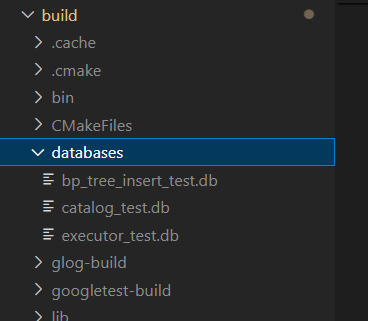

# MiniSQL 概述

!!! note "MiniSQL"
    1. 这是一份关于了解MiniSQL运行机制的文档，关于自己在完成MiniSQL作业的过程中发现自己时常只是面向测试编程，不看测试就无法理解这个模块具体的行为，这实际上也严重降低我的开发效率，因此觉得需要在此实验完成之际，对于其整体架构做一遍梳理。
    2. 本篇文章不涉及任何MiniSQL实际需要完成的代码，仅仅帮助加深理解。
    3. 在阅读的过程请配合源代码阅读，本篇文章会从main.cpp开始拆解整个minisql

### 文件目录

```
.
├── buffer
├── catalog
├── common
├── concurrency
├── executor
├── include
│   ├── buffer
│   ├── catalog
│   ├── common
│   ├── concurrency
│   ├── executor
│   │   ├── executors
│   │   └── plans
│   ├── index
│   ├── page
│   ├── parser
│   ├── planner
│   │   ├── expressions
│   │   └── statement
│   ├── record
│   ├── recovery
│   ├── storage
│   └── utils
├── index
├── page
├── parser
├── planner
├── record
└── storage
```

上述是整个minisql的`src`​文件夹的结构，我们所有要编写的代码都在其中，与`src`​平行的有两个相关的文件夹，分别是`build`​和`test`​他们分别存储了编译的结果和测试程序，其中内部基本不需要我们修改。

文件目录说明，选择一部分做出说明

* include文件夹，里面存储了所有的头文件，可见其中内部的文件夹和外部文件夹基本是一一对应关系。
* ​`common/`​和`include/common/`​两个文件夹，内部存储了整个Minisql实验中会用的一些全局变量，enum和宏定义，也有一些简单类的实现，例如

  * RowId类的实现
  * 读写锁的实现 (很遗憾我暂时还不太懂这一块的实现和应用)

### 自顶向下的解析

由于是完成了实验之后进行的总体解释，因此会采取自顶向下的方法，首先来看main.cpp里的内容。

首先是完成了对输入的获取，然后初始化了**执行器和一个与语法树有关的对象**，然后就是不断地读入和执行，这个逻辑很简单。

由于实验不需要我们深入了解语法树的部分，关键我们来看执行器的初始化。

```cpp
ExecuteEngine engine;
```

#### 执行器(ExecuteEngine)里面有什么

​`src/include/executor/execute_engine.h`​ 执行器当然有一堆的方法，但是我们主要来看执行器内部的变量

```cpp
 private:
 std::unordered_map<std::string, DBStorageEngine *> dbs_; /** all opened databases */
 std::string current_db_;                                 /** current database */
```

很显然，其存储了一堆database的名字和其具体的DBStorageEngine，并且用std::unordered_map完成了二者的映射关系，使得我们在使用过程中可以在不同的数据库文件间切换。

接着我们来看内部的函数，我仅仅是截取了一部分，这部分我也还没完成，但是其直观的感受是，我们通过语法树完成了对于SQL命令的解析之后，调用具体的DBStorageEngine执行相关操作

```cpp
  dberr_t ExecuteShowTables(pSyntaxNode ast, ExecuteContext *context);

  dberr_t ExecuteCreateTable(pSyntaxNode ast, ExecuteContext *context);

  dberr_t ExecuteDropTable(pSyntaxNode ast, ExecuteContext *context);

  dberr_t ExecuteShowIndexes(pSyntaxNode ast, ExecuteContext *context);

  dberr_t ExecuteCreateIndex(pSyntaxNode ast, ExecuteContext *context);

  dberr_t ExecuteDropIndex(pSyntaxNode ast, ExecuteContext *context);
```

于是我们下一步转向DBStorageEngine的实现

#### DBStorageEngine

​`src/include/common/instance.h`​

其类定义的代码较短，就直接放出来了

```cpp
class DBStorageEngine {
 public:
  explicit DBStorageEngine(std::string db_name, bool init = true, uint32_t buffer_pool_size = DEFAULT_BUFFER_POOL_SIZE);

  ~DBStorageEngine();

  std::unique_ptr<ExecuteContext> MakeExecuteContext(Txn *txn);

 public:
  DiskManager *disk_mgr_;
  BufferPoolManager *bpm_;
  CatalogManager *catalog_mgr_;
  std::string db_file_name_;
  bool init_;
};
```

先看成员，其内存有三个复杂的组件，DiskManager, BufferPoolManager和CatalogManager。这三者实际上组成了我们的数据库管理系统，我们后面慢慢解释，剩下两个变量是好理解的，一个是db的名字，另一个是该db的初始化的状态

该类的构造函数也已经给出，大家可以自行参看，其构造函数实际完成了以下步骤

* 调用三个复杂组件的构造函数，初始化这三个成员（DiskManager, BufferPoolManager和CatalogManager）
* 如果是`init`​的话，还需要完成以下工作

  * ​`remove(db_file_name_)`​  该函数其实比较简单，是C++中的一个用于删除文件的函数，我们知道，数据库文件本身还是一个操作系统里的文件，只是我们可以用DBMS进行高效的管理和使用，因此在新建一个db过程中，自然需要删除之前遗留下来的数据库文件。

    可以使用如下程序尝试一下

    ```cpp
    #include<cstdio>
    int main(){
    	std::remove("./a/test.txt");
    }
    ```

    ​​
    
  * 检验几个存储元数据的页是否为Free，这部分与后面几个部分关系较大，这里先按过不提

还有一个小问题，我们minisql给我们创建的数据库文件都放在哪里呢，答案是在`build/databases`​中，如图所示，其中存储了几个测试中生成还没删除的数据库文件。要清楚认识到DBMS(数据库管理系统)和DB(数据库)的区别，DBMS是程序，用来管理DB；DB是文件，用来实际存储数据。minisql是DBMS

​​

那么接下来就是介绍三个组件的part了

#### diskmanager

实际上，磁盘管理器面对的是一个非常直观清晰的场景，我们有一个磁盘文件，需要想一个方法来组织内部这些空间，minisql采取的方法（也是最常规的方法）是将其切成一个个page来使用，一个page就是一个固定长度的空间。具体怎么个切法，实验指导里面已经说的很清楚了。

我们在diskmanager中所需要做的，就是维护每个page的使用状态，必要的时候将其写入磁盘和读出。

!!! note "C++要点"

    但是这里有一个比较关键的C++编程问题，可能会困扰我们

    > 在C/C++中，没有类型，只有bit流 bushi

    我们可以把指针认为是一个**视角**，来看下面这个程序

    ```cpp
    class node{
    private:
      int x;
      int y;
    public:
      node(int x, int y):x(x),y(y){}
        int getX(){return x;}
    };
    int main(){
      node n1(1, 2);
      int *n = (int*)(&n1);
      std::cout<< *n <<std::endl;
      *n = 2;
      std::cout<< n1.getX() <<std::endl;
    }
    ```

    我相信学过oop的同学到第11行为止都可以明白，但是第11行我们干了什么，我们把一个node类的指针看成了int指针

    一个node类是由两个int顺序排列组成的，我们将其看做一个int指针，也就是将其截取了前半部分。

    让我们以01的方式再看看，`n1`​就是

    ```language
    00000...01 00000...10
    ```

    将其强制类型转换成了int指针，那么就是截取了前32位bit，那么很显然 *n 结果就是 1。

    其实这个时候还有一个有趣的点在于，我们可以通过修改*n，去修改n1中`private`​变量，因此C++的封装性是可以直接被指针击穿的，但这个点与minisql的实验关系不大，一般来说这种做法也是相当糟糕的。

    还有一个点在于，在node这个简单的由两个int组成的类中，两个int在机器中是紧密的顺序排列的，但是在一个复杂的类中，不一定是每个变量都紧密的顺序排布，要考虑机器的内存对齐规则，感兴趣可以去搜索一下。

    那么讲了这么多，这与我们minisql有什么关系呢，我们会在minisql程序中看到很多叫做xxpage的类，它们其实都是page的一种视角

    ```cpp
    template <size_t PageSize>
    class BitmapPage {
      ...
    private:
      static constexpr size_t MAX_CHARS = PageSize - 2 * sizeof(uint32_t);

    private:
      /** The space occupied by all members of the class should be equal to the PageSize */
      [[maybe_unused]] uint32_t page_allocated_;
      [[maybe_unused]] uint32_t next_free_page_;
      [[maybe_unused]] unsigned char bytes[MAX_CHARS];
    };
    ```

    上述是我们在第一次实验中会用到`bitmap page`​ ，我们前文中提到了page就是一块定长的空间，我们做 `reinterpret_cast<BitmapPage *>(page)`​ 也就是告诉我们，这一块内存的空间，前32bit是一个`uint32_t`​，再后32bit也是一个`uint32_t`​，随后MAX_CHARS个bit，作为一个`char数组`​，也即我们的bitmap使用。其本质我们用这个类的**视角**来看待这个page。

    我们最终都要讲数据按照page存入磁盘，那么在使用的时候如何将bit流变的有意义，就需要上述的做法。

掌握了这一点之后，我们就掌握了如何使用在磁盘中数据，配合实验指导，diskmanager就很简单了，主要就是allocate和deallocate

* allocate 就是分配一个空闲的page，不需要关心其物理页号是多少（后面没有模块关心页的物理位置），只需空闲即可
* deallocate 就是删除一个page，在bitmap上做标记即可

#### buffer pool manager

实际上基本任何上层结构都不直接使用diskmanager，而是通过buffer pool manager来操作物理结构，目标是提高效率。

buffer pool manager 面对的情形依旧是清晰的，因为实际上这两个组件都不涉及任何数据的存储，只是在管理一些page在内存和磁盘上进进出出，所以其实没什么好讲的

#### catalog manager

这个manager才开始涉及所有对用户有意义的数据，也就是数据库中两个两个主要的对象，table和index，概要的关系大概如下

schema + row + record -> table -> catalog

index -> catalog

我们还是来看代码，这是`catalog manager`​中的成员变量

```cpp
 private:
  [[maybe_unused]] BufferPoolManager *buffer_pool_manager_;
  [[maybe_unused]] LockManager *lock_manager_;
  [[maybe_unused]] LogManager *log_manager_;
  CatalogMeta *catalog_meta_;
  std::atomic<table_id_t> next_table_id_;
  std::atomic<index_id_t> next_index_id_;
  // map for tables
  std::unordered_map<std::string, table_id_t> table_names_;
  std::unordered_map<table_id_t, TableInfo *> tables_;
  // map for indexes: table_name->index_name->indexes
  std::unordered_map<std::string, std::unordered_map<std::string, index_id_t>> index_names_;
  std::unordered_map<index_id_t, IndexInfo *> indexes_;
```

虽然我们对于`IndexInfo`​和`TableInfo`​表示什么还不明白，但是很容易能够可以看出这里存储的东西是在干什么，其实就是帮助我们能够快速通过table和index的名字(std::string)来找到对应的table和index。

但是其中还有一个变量的意义不明确，那就是`CatalogMeta *catalog_meta_;`​ ，让我们来看这个类里头有什么

```cpp
  static constexpr uint32_t CATALOG_METADATA_MAGIC_NUM = 89849;
  std::map<table_id_t, page_id_t> table_meta_pages_;
  std::map<index_id_t, page_id_t> index_meta_pages_;
```

这是我们第一次遇到带有meta名称的class，一般这种class的目标就是用来序列化，因为minisql里面所有的数据最终都要存到磁盘中，而指针存到磁盘中会直接失效，指针存储的是内存的地址，因此其采用将table的id和page的id存到磁盘中。

##### **table and index**

**table**

我们前文提到，page可以很简单的通过一个cast转换成一个可理解的C++的类，那么我们最想做的其实是把page转换成我们数据库里常用的table。但问题是一个table是不定长的，一个table可不一定能够存储到一个page中，那么就需要更复杂的数据结构，我们用了四个数据结构来设计table的存储

* tableinfo
* tablemetadata
* tablepage
* tableheap

在上一节我们看到catalog的meta是存储了一个page_id到磁盘，但是问题是一个table很可能对应不止一个page。这部分我们就可以找到答案，我们给每个table配置了一个tablemeta的page，这个page存储了这个table和对应的root id，而所有该table相关的page都形成了**双向链表**的关系。因此我们通过在catalog的meta数据中存储一个page的id，就能找到这个table对应的所有的page

**index**

index部分也可以参照table的形式理解。BP tree确实是实验中耗时最多的部分，但是其本身的结构是足够清晰的，基本上只需要填函数即可。其难度主要有两个部分造成

* 整体涉及的模块过多，很多函数不联系各个模块看不知道是什么意思，也就不明白怎么写，例如如果不知道`IndexRootsPage`​是如何组织各个index的，对于BP树的构造函数就很容易写错或者无从下手。
* 测试太少，由于去本身主体部分就只有一个测试，我们只能在编写完所有代码后进行测试，此时大部分人已经积累了难以估量的bug了，因此及其建议在编写过程中针对各个小模块编写测试。

其实BP树的部分也值得一写，但是其涉及的模块太多，暂时没有时间，我还是希望先转向带思考题的事务和并发部分。

#### 做个小总结

其实在minisql中设计了这么多模块，归根到底可以分成这几种

* meta类，例如tablemetadata那样，存储了某个table的一些元数据
* page类，例如tablepage那样，为我们实际提供了使用磁盘bit数据的结构
* 实操类，例如tableheap那样，为我们实际操作数据库的内容提供接口

‍

‍

‍

‍
