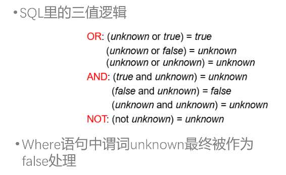
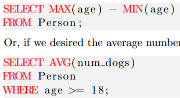
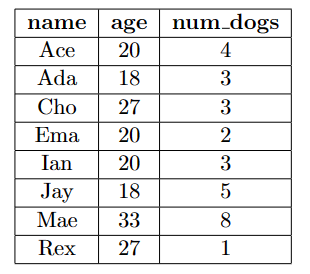
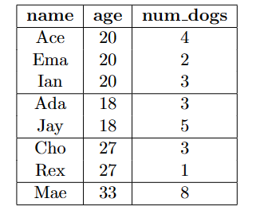

# SQL

## SQL的类别

<div>
<div style = "border-color: #448aff;"> SQL 没有大小写区分</div>
</div>

* DDL  表的定义和定义的修改，数据完整性的设置 create, alter, drop
* DML 表内数据的增删查改 select, insert
* DCL  数据控制，数据权限的修改 Grant, revoke

**数据类型的创建**

## DDL

**创建视图***

视图的操作，与原表的完整性约束问题

建立schema，table，view and index

drop的同时可以选择 restrict模式和cascade模式，也就是限制删除和强制级联删除

## DML

### basic query

这部分主要处理是筛选的需求

**the fundamental SQL query**

```sql
SELECT <columns>
FROM <table>;
```

选择哪个表（table）,选择这个表里的哪些attributes,(columns)  并且全部输出，from里面有多个表，意味这个表之间需要做笛卡尔积

select内部可以做操作，比如给所有输出x10

如果使用SELECT DISTINCT，会在输出中删除重复的部分。

tips：在不加说明的情况下，输出表的内容是unorder的

对于select可以修饰 distinct 去重复

**where**

```sql
SELECT name , num_dogs  第三个执行
FROM Person				第一个执行
WHERE age >= 18;		第二个执行
```

上述是一个简单例子，很多时候我们只关注table里面的几行内容，因此有WHERE关键词，后面加上的一个条件判断符。

tips：SQL语句的执行顺序，是按照顺序执行，但是SELECT语句是最后执行的

对上述代码就是，先找到Person这个表，再找到age这个属性大于18的行，再输出这些行的name和num_dog列

```sql
where (A,B) = (1,2)  更加简单的写法
```

> Tips: 在筛选字符串的时候，存在一些方式，使用%，_ 等特殊字符，可以做模糊查询

**boolean operators**

SQL有基础的AND  NOT   OR三个布尔逻辑符号，来链接WHERE内部的逻辑关系

```sql
...
WHERE  age>=11
	AND num_dog>2;
```

> Tips: SQL里面的NULL在做逻辑操作时需要特殊考虑，如下图

​​

* var is null
* var is not null

**aggregate functions**

这些函数用来处理整个column，做一些统计工作，一般会返回一个value（其实本质上是一行一列的表？），其在处理的时候会跳过NULL值，但是在COUNT（*）时不会跳过

基础的aggregate function有以下几个

```javascript
SUM(age) is 72.0, and SUM(num dogs) is 10.0.
AVG(age) is 18.0, and AVG(num dogs) is 3.3333333333333333.
MAX(age) is 27, and MAX(num dogs) is 4.
MIN(age) is 7, and MIN(num dogs) is 3.
COUNT(age) is 4, COUNT(num dogs) is 3, and COUNT(*) is 4
```

上述函数一般在SELECT选择column的时候调用，默认情形下是all，必要时可以加distinct

```sql
select count(distinct ID)
```

​​

要注意的是，聚合函数不可直接用于where语句中，只可以用于select和having

**GROUP BY 和 HAVING**

```javascript
GROUP BY <columns>
HAVE 条件语句
```

GROUP BY的意思是把列表按照一个列分组（把这个组的相同value分为同一个组），其最终的结果可以促使aggregate function的输出不再是一个一行一列的table。GROUP BY age其效果如下图

GROUP BY和aggregate function经常放在一起使用

​----->​

其中的HAVE语句就是对分出来的各个GROUP做筛选，例如COUNT(*) > 1 最后一个GROUP就会被筛掉

* WHERE 作用与GROUP BY之前
* HAVING 作用于之后

```sql
SELECT age , AVG( num dogs )	5
FROM Person						1
WHERE age >= 18					2
GROUP BY age					3
HAVING COUNT( ∗ ) > 1 ;			4
```

**ORDER BY**

对于其进行排序的做法，在末尾进行ASC或者DESC，默认是ASC

**AS**

是对于数据表做重命名的操作，当我们需要把一个表自己和自己做笛卡尔积的时候，需要做重命名，注意以下的执行顺序，该重命名在后续操作中均生效，包括嵌套子查询中

​​

### join

* on 和 where什么时候相同

我们时常需要把多个表格联动起来一起分析，例如

```SQL
SELECT *
FROM courses, enrollment   单纯的‘,’就是做笛卡尔积
WHERE num = c_num;
```

如果不加WHERE语句的话，数据库系统会直接把两个表的row做笛卡尔积，这往往不是我们需要的，因此需要一些限制条件

```sql
select *
from courses natural join enrollment
```

这个做法和前面的代码看似相同，但是前面那个会把相同名称的属性分两个展现出来，而natural join会合并这两个属性列

join也有多种形式，上述的形式是最直接的

* cross join 默认的形式，就是上述情况，只生成匹配条件的table
* inner join 必须是A中有，B中也有
* outer join 以一个表为主体，如果另一个table没有匹配的话，就生成NULL
* natural join  对于两个表中存在的相同名称的属性做join，相当于一个语法糖，但并不常用，只有natural join和使用using的情况会把表的重复属性给重合掉
* 普通的join相当于笛卡尔积，`table1 join table2`​ 相当于 `table1, table2`​

多重的natural join是按照左到右顺序执行

**using关键词**

使用using(属性名)可以指出两个要做join的表，哪个属性需要相同

**on**

而更常用的是可以用on关键词，见下文的例子

**outer join**

确保左表的每一行都被输出，没有匹配的用NULL补齐

```SQL
SELECT *
FROM courses LEFT OUTER JOIN enrollment
ON num = c_num;
```

我们还可以选择

* RIGHT OUTER JOIN 确保右表的每一行都被输出
* FULL OUTER JOIN 两个表的每一行都要被输出

tips：我们最好在使用属性的时候，用table.attribute来限定范围，例如 courses.num = enrollment.c_num

同时我们还有一个语法糖是我们可以在引入表的时候 加上**AS** 来在本次语句将其重命名，以便使用起来更方便

```SQL
SELECT *
FROM courses AS c LEFT OUTER JOIN enrollment AS e
ON c.num = e.c_num;
```

### 集合操作

* union
* except  删除集合中的反例，代表关系代数中的“-”  
  在取反操作中很常见

### subqueries

嵌套的查询使得SQL的功能更加的完整

我们可以在条件语句和FROM语句加入subqueries

```SQL
SELECT num
FROM enrollment;
WHERE students >= (
    SELECT AVG(students)
    FROM enrollment;
);
```

同时为了防止多层的嵌套使得可读性严重下降，我们可以用WITH语句给子查询一个名称，with语句可以同时定义多个

```SQL
WITH courseEnrollment(num1, name, students) AS (
    SELECT c.num AS num1, c.name, e.num AS num2, e.students
    FROM courses AS c INNER JOIN enrollment AS e
    ON c.num = e.num;
)
SELECT num1, name, students
FROM courseEnrollment
WHERE students > 700;

```

* FROM  只要产生的是关系即可
* WHERE  可以替换成 B operation subquery  operation 常用 in 和 not in
* SELECT  需要是一个single value

```sql
select distinct course_id
from section
where semester = ’Fall’ and year = 2009 and
course_id in (	select course_id
				from section
				where semester = ’Spring’ and year= 2010
			  );
```

in的前后也可以是属性的集合，只要一一对应即可 例如`(course_id,name) in (select course_id, name ...)`​

**some**

some 是指某个的意思

```sql
select *
from section
where id > some (select id ...)
```

这里只要我们的id大于后面这个子查询产生的id列中的任意一个值即可，operation并不仅限于> 可以是 <, =, !=, >=, <=

= some() 也就是存在一个相等即可

**all**

与some相对应，做法完全相同，要求id大于所有子查询中的id

**exists 和 not exists**

```sql
select course_id
from section AS S   注意，这里的S可以在子查询里使用，与子查询里的section区分
where semester='Falls' and year = 2017 and exists(子查询)
```

注意子查询使用的S已经经过前面的筛选，子查询不为空即可

**unique**

uniue用法和exists等用法相同，针对后面的table，若其有重复元组，则返回false；反之则为true

**except 与 关系代数中的 '-' 正交**

**as可以对于列也同时重命名**

```sql
(子查询) as table(a1,a2)
```

**scalar 标量子查询，指的是指返回一个value的情形**

```sql
select dept_name, (select count(*) from instructor
					where department.dept_name = instructor.dept_name ) 
					as num_instructors
from department;
```

这里的select里面就不是一个属性，单纯是一个值，并且这个子查询返回的value只能是一个，这种情况下，可以不需要some，all做比较

**in and not in**

该特定的记录是否在子查询中存在过

可以用some, all, any 替代，形似语法糖

### update

**case语句***

case语句可以构成分段的操作，适用于update语句，例如

```SQL
update works
set salary = case
	when salary <= 100000 then salary * 1.1
	else salary * 1.03
	end
where company_name = "First Bank Cororation" and ID = some (select ID from manages)
```

## **错误的SQL**

最后SQL的结果是由SELECT语句确定，我们需要确定的是，这里面所有的columns拥有相同数量的rows，例如对于上述这个例子

```javascript
SELECT age , num dogs			5
FROM Person						1
WHERE age >= 18					2
GROUP BY age					3
HAVING COUNT( ∗ ) > 1 ;
```

如果不加上AVG，那么就会报错，因为age其实已经被划分了，所有相同数值的age被划分成了一个，但nums_dogs并未被划分，因此会导致数量不对齐

## DBMS 使用 以sqlite为例

> 环境：Ubuntu2204 sqlite3

打开的方式 `sqlite3 file.db`​   退出终端  ctrl-d

一个db文件在DBMS视角下一般由多个table构成，可以用`.table`​的指令查看所有的table

* ​`.schema tablename`​​ 来查看每个table的attributes
* 可以直接在终端编写sql 查询，要记得在结尾加上‘；’作为一个sql查询指令的结尾
* ​`.read sqlfilename`​​ 多数时候我们把sql文件写在外面，可以通过.read指令直接调用外部sql文件里的sql指令

创建一个数据库

​`touch test.db`​

* 表的创建  

  ```SQL
  sqlite> CREATE TABLE COMPANY(
     ID INT PRIMARY KEY     NOT NULL,
     NAME           TEXT    NOT NULL,
     AGE            INT     NOT NULL,
     ADDRESS        CHAR(50),
     SALARY         REAL
  );
  ```
* 表的插入  

  ```SQL
  INSERT INTO COMPANY (ID,NAME,AGE,ADDRESS,SALARY)
  VALUES (1, 'Paul', 32, 'California', 20000.00 );
  ```

**数据库中的主键**

```python
/**
                 * 对于不存在数据可以直接在values里面插入default
                 * */
```

**数据库中的增删查改**

详见project

* deletion   `delete from xxx where xxx`​
* insert  `insert into xxx (....) values (....)`​  value可以用null也可以用default  插入也可以和select结合起来 见PPT
* update `update instructor set salary = salary * 1.05`​   这里面的数据可以用嵌套子查询替换，实现更加复杂的update

‍

‍

‍
