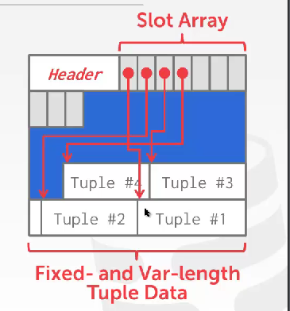
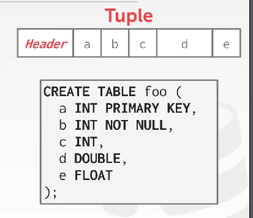

# disk storage

我们在本课程中学习的主要是面向磁盘的数据库，storage这部分的内容主要讨论了数据在磁盘中的存储形式

* 读写内存是随机访存的，字节寻址的；
* 读写磁盘是顺序访存的，块寻址的

关系型数据库的基本组成单元是record（也就是一行），行组成table，record 的 type 又可以分为FLR，VLR两种

### file storage

page是数据在disk中最基础的单元，也是memory和disk之间进行读写的最小单元

pages的概念，数据库的page与操作系统的page无关，一般会在512b-16kb之间，一般都会在4kb以上的整数倍，因为os是按照4kb划分的，仅有一些特殊的单片机的大小会小于4kb

* page是一个fixed-size block of data
* most systems don't mix page type，一个page里面存储一种数据类型

数据系统管理一个大的文件，并且将其划分成为一个个pages，这个文件被称为heap file，内部的page是unordered collection

文件内部的组织形式主要有两种

* 头部一个directory，存储所有数据的指针
* 头部两个指针，指向一个data list和一个free list

### page storage

page内部的组织是什么样的，其主要可以区分成header和data两部分

header部分可能会记录以下内容

* page size
* checksum  类似于校验码
* DBMS version 对应的数据库管理系统的版本
* transaction visibility 对于用户的透明度
* compression information  压缩的信息，是否被压缩

**page的一种组织方式slotted page，主要针对可变长度的record组成的table**

​​

数据库内部索引数据的方式一般是 page_id + offset/slot

但是这些组织是不暴露给用户的

### tuple layout

内部依旧是header和data

header内部包含两部分信息

* 数据透明度
* null data的信息记录

​​

### storage model

数据库系统处理的请求大致可以分为两类

* 普通用户的增删查改，对于数据的update的性能要求较高
* 总体的数据分析与处理，对于数据查询的性能要求较高

对此采用不同的storage model是有必要的
