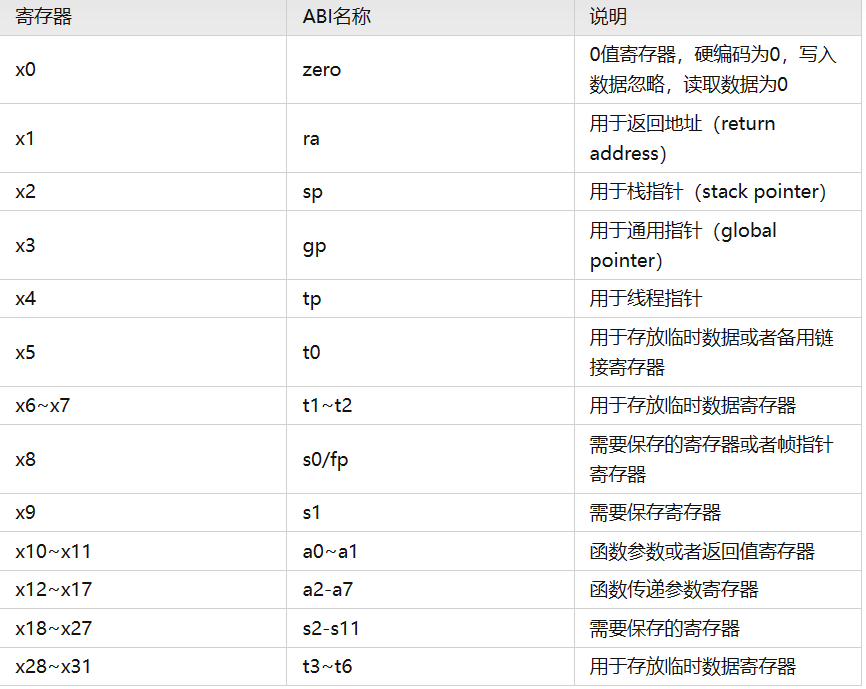
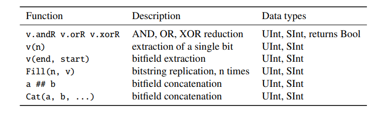

# CS61C great idea in computer architecture

## environment setup

## overview of great ideas

Refer to the first PPT

1.  Abstraction (Layers of Representation/Interpretation)
2.  Moore’s Law
3.  Principle of Locality/Memory Hierarchy
4.  Parallelism
5.  Dependability via Redundancy

## number representation

### float number

We have already learnt the conception of float number in the ZJU-course and we will add some things

Biased notation

**special number**

If the exponent is 255 and the significand is 0 express endless

## C intro

### compile

C compiler map the C program directly to the machine code(01-string)  
Here are two steps, compiling the .c file to .o file and link the .o files into executables.

We can have the reaonable compilation time and using the makefiles to allow only modified files to be recompiled. C has the excellent run-time performance.

**Note: ** why we use "slow" python to do the scientific computation?

That's because python has a lot of libraries to accelerate the excutation and some libraries can access the GPU-specific resources.

**some disadvantages**

For C, its compile files and executable(可执行文件) are architecture-specfic and os-specific. Executable must be rebuilt on each new system.

**c pre-processor (cpp**

C source file first pass through macro processor. It will replace the comments and deal with the cpp commands( begin with #) 

### variable

**the way of name we may use**

sum_of_squares

**basic variables**

The size of the basic variable in different machine is different, So we will recommend use the intN_t  uintN_t

```cpp
int8_t n;  //n will be express in 8 bits
```

### macro

macros will be deal with in cpp. It can replace the variable and create a small function. But all it does is **string replacement.**

### new features in C

variable-length non-global array.

### command arguments

​`int main(int argc,char *argv[])`​ 

argc express the number of strings on the command line, and the argv contains it. The excutable counts is one.

### enums

```cpp
enum color {RED, GREEN, BLUE};
```

enums is a group of related integer constants


## use gdb to debug

Before we begin debug, we should use this command to make the executable file

```cpp
gcc -g -o hello hello.c
```

**some basic command for gdb**

```cpp
q   //quit the debug
break 8 //在第八行设置断点
delete 8 //删除断点
run   //运行
c    //continue   直接继续整个程序
s    //step       单步进入
n    //next line  跳到下一行
p + expression   //print
```

**basic print format**

```cpp
x: 十六进制格式

d：有符号的十进制整数格式

u：无符号的十进制整数格式

o：八进制整数格式

t：二进制整数格式

c：字符格式

f：浮点数格式

使用 p/x variable_name 命令 来实现上述格式输出的结果
```

## using vim

**复制粘贴**

```cpp
//command mode
v 选中
y 复制
p 黏贴
```

**打开新的文件**

```cpp
//command mode
:e ./filename
```

**显示行号**

```cpp
set number
```

## using the valgrind

## write the makefile

## RISC-V intro

We will use the 32-bit RISC-V in the class.

#### the basic calculate instruction

```cpp
add rd, rs1, rs2
sub rd, rs1, rs2
addi rd, rs1, imme
```

### memory address

A address and B address has distance of 4 bytes

1 word = 4 bytes = 32 bits. And data is rarely smaller than 8 bits.

It follows the little-endian convention.

|103|102|101|100|
| -----| -----| -----| -----|
|0|0|0|1|
|||||

the result is "0001"

Get the memory

```cpp
lw x10, 12(x15) // x15 have the address of an int array. So x10 get the A[3]
sw x10, 40(x15) // put the x10 into the A[10]
```

Besides the normal "lw" and "sw" instructions, RISC-V has byte data transfer instruction. "lb" and "sb"  
The number is express bytes

```cpp
lb x10, 3(x15)
sb x10, 10(x15)
//this two instrcution is as same as the above two. But they are easier to read 
```

**PC relative addressing**

It's immediate will jump 4 bytes at once.

### decision making

**conditional branch**

```cpp
beq x1,x2,label
//if(x1->value==x2->value) jump to label;
```

"beq" jump when equal. "bne" jump when unequal

```cpp
blt  //a<b then jump
bge  //a>b then jump
bltu //a<b then jump unsigned number
bgeu //a>b then jump unsigned number
```

**unconditional branch**

```cpp
j label
jr register
```

### logical operation

```cpp
and x1,x2,x3
xor 
or
sll
srl
```

Their is no logical "not" in RISC-V, we can use "xor x1,x1,11111111.. instead

We can also use the immediate number during the logical instruction like "andi x1,x1,3"

```cpp
sra 
srai x1,x1,3
```

"sra" instruction is the right flow with signifance, which we called arithemtic shift. （带符号右移)

‍

### pseudo code

These assemble code is not the real instruction in the RISC-V design. But they are very useful and  help a lot when understanding the program. So we have them in the RISC-V assemble language.

```cpp
mv rd, rs  //把rs的值放到rd
li rd, 13 //把13写到rd
nop      //addi x0,x0,0
```

‍

### function call

The registers a0 to a7 are to pass the parameters. And the a0 and a1 are used as return value.

And s0 to s11 are registers that should be saved during the function call.

ra (x1) is the return address in the function.

```cpp
jal sum  ; set the ra to next PC and go to the sum label
```

Stack structure is used to save some data during the function call, and the normal sp pointer is in 0xFFFFFFF0,

The stack will includes

* return address
* arguments
* other thing we want to save. Like that, if we want to use the save register in the function we need to save them before.

‍

### register

​​

‍

### program intro

For a RISC-V program, how did the program organize, where is the stack pointer and heap pointer.

1. R-format for register-register arithmetic operations
2. I-format for register-immediate arithmetic operations and loads
3. S-format for stores
4. B-format for branches (minor variant of S-format)
5. U-format for 20-bit upper immediate instructions
6. J-format for jumps (minor variant of U-format)

## chisel intro

chisel is a extend of scala. It is a hardware description language.

### type and constant

#### **UInt, SInt and Bits**

UInt(unsigned int) and SInt(signed int) extends Bits. They three are used to express connections, combinational logic and the register.

**initializa**

```cpp
UInt(8.W)
Bits(8.W)
SInt(10.W)
```

**other expression of constants**

```cpp
-3.S   //Signed integer in value of -3
0.U    //Unsigned integer in value of 0
3.U(4.W) //4-bit unsigned integer in value of 3
```

**expression in different bases**

```cpp
hff.U   	 //16进制
o377.U  	 //8进制
b1111_1111.U //2进制
'A'.U   //character
```

#### Bool

```cpp
Bool()
//constants
true.B
false.B
```

### combinational circuits

#### operator

We also use the basic & | ~ + - / * % in the chisel to express the combinational logic like C, Java and so on.

The width of the result follows the different rules.

* +,- will find the max width in the operators
* *will be a.W+b.W
* /and % will be the numerator's width

**function**

​​

‍

#### multiplexer

```cpp
val result = Mux(sel, a, b);  
```

sel is control signal, which decide the result get "a" or "b". Where a is selected when the sel is true.B, otherwise b is selected.

sel is the bool type. a and b can be any base type in the chisel, but they should have the same type.

#### register

```cpp
val reg=RegInit(0.U(8.W))
reg:=d 		//input
val p=reg   //output
```

#### counting

counting is useful in the digital system, like the time cycle.

```cpp
val cntReg=RegInit(0.U(8.W))
cntRef:=Mux(cntReg == 9, 0.U, cntReg + 1.U)
```

#### Bundle and Vec

Bundle contains different types of signal.

```cpp
class channel extends Bundle{
	val data = UInt(8.W)
	val valid = Bool()
}
val ch = Wire(new channel())
ch.data := 123.U
ch.valid := false.B
```

Vec is a set of signal with same type

```scala
val v = Wire(Vec(3, UInt (4.W)))
```

We can use the Vec to express an array of register

```scala
val regVec = Reg(Vec(3, UInt (8.W)))
val dout = regVec(rdIdx)
regVec(wrIdx) := din

val resetRegFile =
RegInit(VecInit(Seq.fill (32) (0.U(32.W))))
val rdRegFile = resetRegFile (sel)
```

‍

### hardware

Reg, Wire and IO

UInt Bits they don't express hardware, and we need to turn them into Reg, Wire and IO to generate the hardware.

* Wire is used to express the combinational logic
* Reg is used to express the register
* IO represents the connection of a module

**difference of &quot;=&quot; and &quot;:=&quot;**

* = is uesd to create a chisel hardware
* := is used to assigned and reassigned to the existed hardware

```scala
val number = WireDefault (10.U(4.W))
val reg = RegInit (0.S(8.W))
```

‍

### program build

chisel use the build.sbt to build the whole prorgam.

The soucre code part includes the hardware description part and the chisel test part. We should describle it in the build.sbt part.

#### chisel test

To use the chisel test, you should includes these package in the file.

```cpp
import chisel3._
import chiseltest ._
import org. scalatest . flatspec. AnyFlatSpec
```

examples of the test

```cpp
class DeviceUnderTest extends Module {
	val io = IO(new Bundle {
	val a = Input(UInt (2.W))
	val b = Input(UInt (2.W))
	val out = Output(UInt (2.W))
	val equ = Output(Bool ())
})
	io.out := io.a & io.b
	io.equ := io.a === io.b
}

class SimpleTest extends AnyFlatSpec with
	ChiselScalatestTester {
"DUT" should "pass" in {
	test(new DeviceUnderTest ) { dut =>
		dut.io.a.poke (0.U)
		dut.io.b.poke (1.U)
		dut.clock.step ()
		println("Result is: " + dut.io.out.peekInt ())
		dut.io.a.poke (3.U)
		dut.io.b.poke (2.U)
		dut.clock.step ()
		println("Result is: " + dut.io.out.peekInt ())
		}
	}
}

```

The peek() function return the type of the chisel type.

For some complicate digital system, it will be recommended to have the waveforms to test.
