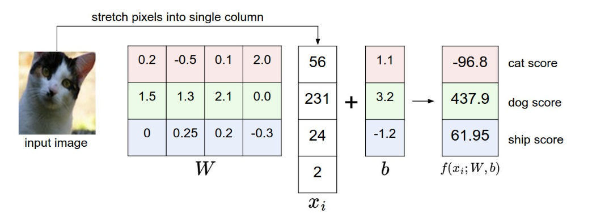
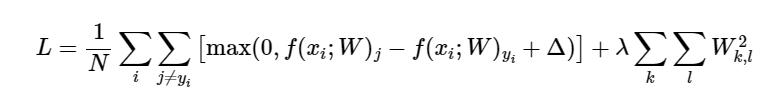
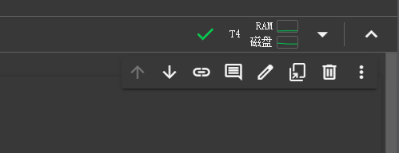

# UMich EECS 498-007: Deep Learning for Computer Vision

## Lec01 history of computer vision

所谓计算机视觉，就是指能让计算机理解图像信息的技术，在早期人们尝试过各种各样的方法，到现阶段deep learning 深度学习，成为了解决该问题的主流。

## Lec02 Image classification

image classification是计算机视觉中最基础的目标之一，就是给出一系列图片和标签，把图片和标签对应起来，比如猫对猫，狗对狗。但是一个事物其拍摄角度，光影效果，物体的不同状态都会导致其产生的像素数据天差地别。

如果使用传统算法，我们会发现很难覆盖一个物体的所有情况，并且很难找到一个算法适用于所有的物体，因此我们会倾向于采用data-driven的做法，采用数据驱动。

在本次讲座中，描述了一种非常trivial的image classification的做法，也即Nearest Neighbor Classifier，将训练集的所有图形数据存下来，当新的数据传入的时候，对所有的存储的数据进行比较，得出最相近的那个图形数据以及其对应的标签，完成该次图像分类工作。

对于该做法有以下问题

* 存储空间消耗巨大
* 训练简单，使用困难，与我们的目标相悖
* 关于所谓的“相近”的做法的选择问题

为了优化Nearest Neighbor Classifier，我们还提出了k-Nearest Neighbor (kNN) classifier，也就是找到k个最相近图片，根据这些图片对应的标签

## Lec03 Linear classification

这部分里面我们需要构建两个式子**score function**和**loss function**

* score function，将图像映射到一个单列矩阵，单列矩阵存储这该图像对于所有的标签的得分
* loss function，描述预测出来的标签和实际标签的一致性

### score function

我们构建一个这样的式子

$$
f(x_i,W,b) = x_iW+b
$$

其中$x_i$是我们将图像信息以某种方式展开为单列的矩阵的结果，W和b是我们需要训练获得的有效参数，W和b也是一个矩阵，具体可以参照下图

​​

最终获得的结果是一个单列矩阵，其描述了该图像对于所有标签的得分，当然上图是一个较为随意的参数设置。

### loss function

其描述了预测结果和实际结果的差距，我们有多种方式来描述这种差别

**multiclass support vector machine loss**

这类损失函数被称为SVM，我们设一个图像为$x_i$，其正确标签为$y_i$，$s_j$表示该算法下，第i个图像对于第j个标签的得分，我们的SVM可以写为

$$
L_i=\sum_{j\neq y_i}\max(0,s_j-s_{y_i}+\Delta)
$$

我们仔细理解一下该式子 $s_j-s_{y_i}$ 表示的正确标签的得分和某个错误标签得分的差值，我们自然希望这个差值越大越好，然后我们使用$\Delta$和与0进行max，确保一点，比如$\Delta = 10$, 那么某个错误标签和正确标签之间得分相差10， 我们就把损失设定为0，若不到10，则表现出损失。

这样做可以保证一点，如果一个模型对于一个错误标签得分非常低，和正确标签相差甚远，但是其他标签和正确标签得分都差不多，这样的模型loss function也不会很低。

> 仅仅能够分辨出某个错误标签并不会太有用（

**regularization**

上述做法中还存在存在一些问题就是，$\Delta$是常数，理论上只要把M扩大N倍，就很容易就能获得超过$\Delta$的值

我们可以扩展loss fucntion，通过增加上regularization penalty $R(W)$，其正则化的方式也有很多，如下是L2 norm

$$
R(W) = \sum_k\sum_lW_{k,l}^2
$$

SVM function转换成

​​

**practical considerations**

‍

## Lec04 regularization and optimization

前一章中讲述了score function和loss function两个图像分类任务中的重要组件，而这一章我们要介绍optimization，也即我们如何找到参数$W$

当然我们了解了这三个组件是如何运作的时候，我们将不再局限于线性映射，而进入更复杂的score function，但是相互作用的关系是相对不变的。

### optimization

**pure random**

一个最直接的想法就是随机生成一堆的W，找到一个loss function最小的，但是这几乎是完全不可行的，获取完全随机的最佳函数的结果所需的时间消耗是难以想象的。

**random local search**

一个更优的办法是，以一个随机的W为基准，向各个方向去尝试，让其加上随机的$\delta W$, 如果其更优了，就更新当前的W

```python
W = np.random.randn(10, 3073) * 0.001 # generate random starting W
bestloss = float("inf")
for i in range(1000):
  step_size = 0.0001
  Wtry = W + np.random.randn(10, 3073) * step_size
  loss = L(Xtr_cols, Ytr, Wtry)
  if loss < bestloss:
    W = Wtry
    bestloss = loss
  print 'iter %d loss is %f' % (i, bestloss)
```

**following the gradient**

依赖随机的优化总是不让人那么开心，事实上我们可以采用数学的方法来判断优化的方向。优化向量应当在数学上保证为最陡下降的方向，其与损失函数的梯度有关。

> 梯度即一个向量对每个维求偏导形成的向量

计算梯度有两种方式

* 数值计算，设计一个跨度，例如$h=10^{-5}$ 直接计算 $[f(x+h)-f(x-h)]/2h$
* 微积分计算 快速精确，但是容易出错

通过设计步长，我们就能实现持续有效的循环优化。

## Assignment1 学习使用PyTorch和Colab

本课程的实验指导以ipynb的形式发送，我们需要在Google Colab上打开以获得完整的功能。

​​

配置实验指导需要以下几步

* 运行set-up代码
* 将实验代码发送到Google Drive
* 并且将实验指导连上Google Drive并且指定路径

Colab同时为我们集成了，实验指导，虚拟环境和编辑代码的功能

​​

### pytorch 101

pytorch是一个免费开源的机器学习框架，其为我们提供了一系列工具

* 可使用GPU加速的tensor对象
* 自动计算导数的autograd engine
* 清晰的模块化的部署模型的API

进一步学习可以选择 [oficial tutorials](https://colab.research.google.com/corgiredirector?site=https%3A%2F%2Fpytorch.org%2Ftutorials%2F) 或者 [reading the documentation](https://colab.research.google.com/corgiredirector?site=https%3A%2F%2Fpytorch.org%2Fdocs%2Fstable%2F).

有关tensor一些概念

* rank of tensor 就是矩阵的dimension
* shape of tensor 是一个元组，给出每个dimension的size大小

如果我们直接使用下标访问tensor的元素，会获得一个pytorch标量，可以使用.item()方法转换成Python标量

**构造**

我们可以直接将python中的列表转换成tensor

```rust
x = torch.tensor([1,2,3], [2,3,4])
```

但是上述做法有些低效，pytorch提供了一系列的方法帮助我们构造tensor，包括全为0的，单位的，全为1的，随机的

比较常用的有`torch.full()`​

```python
x = torch.full(size 列表, value)
```

**数据类型**

我们可以在构造tensor的时候显示说明其数据类型

```py
y2 = torch.tensor([1, 2], dtype=torch.int64)
```

当然还有一些更灵活的办法

```python
x0 = torch.eye(3, dtype=torch.float64)  # Shape (3, 3), dtype torch.float64
x1 = torch.zeros_like(x0)               # Shape (3, 3), dtype torch.float64
x2 = x0.new_zeros(4, 5)                 # Shape (4, 5), dtype torch.float64
x3 = torch.ones(6, 7).to(x0)    		# to表示该列表所需的类型
```

**tensor的索引和切片**

Pytorch中tensor的切片遵循以下规则

```python
x = ten[横坐标切片, 纵坐标切片]
# for example
row_r2 = a[1:2, :]  # Rank 2 view of the second row of a
```

切片返回的是引用，如果我们需要拷贝语义，则可以使用clone

```python
c = a[0, 1:].clone()
```

同时切片也可以做赋值，对于张量进行修改，其中Pytorch给我们提供很多的灵活做法，比如用单个元素表示用该元素填充切片的所有部分

```python
a = torch.zeros(2, 4, dtype=torch.int64)
a[:, :2] = 1
a[:, 2:] = torch.tensor([[2, 3], [4, 5]])
print(a)
```

**CPU or GPU**

默认创建的tensor是CPU运行的，我们可以通过to方法或者cuda方法将其转换成GPU tensor

tips：如果我们需要比较CPU和GPU的时间的话，需要采用`torch.cuda.synchronize`​来同步两者的时间
