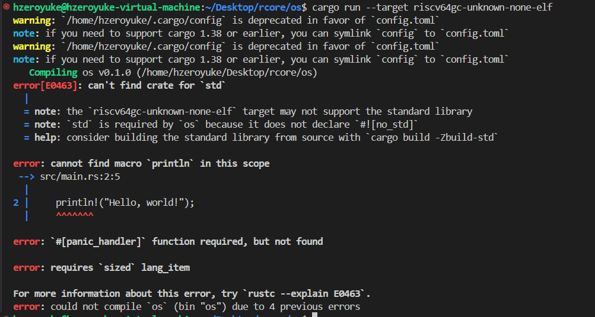
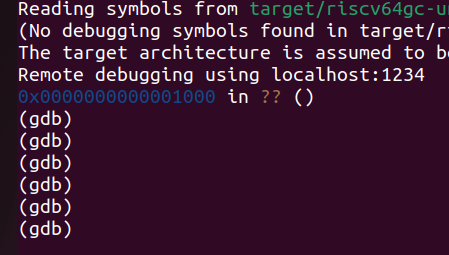
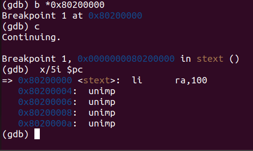
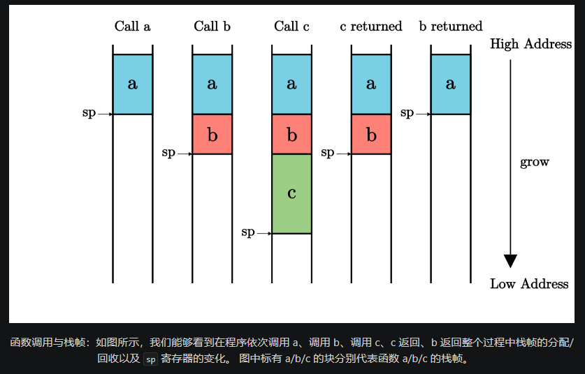
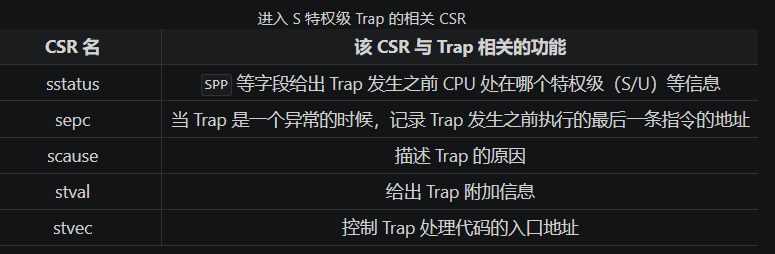

# rCore 清华操作系统实验

## 1. 应用程序和基本执行环境

### 1.1 移除标准库依赖，转向裸机编程

对于一个应用程序，我们可以通过`strace`​质量查看内部系统调用，我们会发现在现代的linux系统上，即便在代码上毛也不干的程序也会经历多次系统调用

我们可以尝试切换rust程序运行的平台，让其运行在类似于裸机器的平台上 `cargo run --target riscv64gc-unknown-none-elf`​，上述指令将我们转向一个不存在任何操作系统支持的平台。

​​

**rust的std和core**

* std是rust跨平台开发使用的标准库，内部包含了许多像`println!`​和`Option`​一样常用的宏和类
* core内部的功能是std的浓缩版，但是好处在于其可以直接在裸机平台上运行

**计算机的启动过程**

我们在裸机上编程的时候，首先自然要关注整个计算机的启动过程，基本可以认为是我们的电脑会先跳转到一些固定的位置，然后执行一些固定的代码，最终把硬件的控制权交给操作系统

而rCore在本章为我们实操了编写了内核的第一条指令，通过手写汇编的方式，并且使其加载到qemu上

**一个小疑问，为什么不能直接在这里使用Rust代码**

我们可以发现，直接在裸机上编程的时候，系统甚至不能有效地找到Rust代码的main函数在哪里，在我们能够使用标准库的时候，在main函数之前标准库会为我们做好初始化工作。

在我们禁止使用std的时候，我们需要先编写一些汇编代码，做一些初始化工作。

**基于GDB的检验**

​​

我们发现系统初始在01000处，经过一系列初始化工作后，我们跳转到我们之前设定的0x80200000处，发现我们设定的第一条指令确实已经被加载

​​

前期有一些初始化操作是RUSTSBI为我们做的，基本的行为就是前文提到的，把内核加载进来

### 1.2 从汇编转回Rust

我们在之前发现系统找不到main函数的情况，在RISCV中的函数调用主要依赖两组指令

* jal / jalr
* ret

除了这两个指令之外，我们还需要对函数调用时影响的寄存器用物理内存进行保存，这一点riscv也是区分了调用者保存和被调用者保存的。

更进一步，我们需要知道这些寄存器存在物理内存的何处，对于函数调用产生的这些寄存器保存，会存在栈上，用sp寄存器存储栈地址

​​

而在裸机编程中，编译系统不知道我们为程序分配了多少的栈空间，也不知道栈空间从哪里开始，因此需要我们通过汇编代码手动设定

### 1.3 使用RustSBI

RustSBI 是一个介于操作系统和硬件之间的存在，对于riscv系统而言，我们编写的 OS 内核位于 Supervisor 特权级，而 RustSBI 位于 Machine 特权级，也是最高的特权级。

通过sbi为我们提供的功能，我们能够实现输出

### 1.4 源码分析

这一部分的源代码相当简单，仅仅是对于SBI为我们提供的接口做了一些封装，使得我们可以简单地进行输出

## 2. 批处理系统

在批处理系统之前，我们相当于每一份代码都是操作系统内核的一部分，但是当我们有了批处理系统，也就是我们可以用程序自动地把其他的代码加载到操作系统上执行，也就有了所谓用户和内核的区别。

本章实现的操作系统的目标在于能够把有的程序一个一个加载到操作系统里，直到所有的系统都执行完

### 2.1 特权机制

这一部分为我们解答了一个问题，系统调用和普通的函数调用有什么区别，主要是出于安全性质的考虑，我们需要软硬件协调地进行系统调用。在上一章的操作系统中，操作系统仅作为一个库存在，系统把应用程序和操作系统库编译链接在一起，导致了应用程序拥有和操作系统相同的权限。

因此本章的重要目标在于，让应用程序不能执行某些可能破坏计算机系统的指令

这就涉及到本节提到的特权机制，这一部分需要软硬件协同地实现，在硬件方面，riscv的CPU区分了不同等级的执行环境，以及相应的能够执行的指令，如果在低等级的情况下调用高等级区分的指令，就会导致报错。并且在执行环境跳转的时候，需要使用两类特殊的指令

* ​`ecall`​ 具有用户态到内核态的执行环境切换能力的函数调用指令
* ​`eret`​ 具有内核态到用户态的执行环境切换能力的函数返回指令，这里特指 `sret`​

在软件方面，操作系统要在ecall和eret前后进行一定的检查和恢复工作

系统调用的本质就是内核与应用程序之间的接口，称为应用程序二进制接口ABI，这种接口是二进制，只能通过汇编码实现

在riscv中有两类特权指令

* 指令本身属于高特权级的指令，如 `sret`​ 指令（表示从 S 模式返回到 U 模式）。
* 指令访问了 [S模式特权级下才能访问的寄存器](https://rcore-os.cn/rCore-Tutorial-Book-v3/chapter2/4trap-handling.html#term-s-mod-csr) 或内存，如表示S模式系统状态的 **控制状态寄存器** `sstatus`​ 等。

### 2.2 用户程序

要实现能被该操作系统加载的用户程序，需要注意的有三部分

* 准备系统调用接口
* 基本的应用程序
* 内存布局设计

我们可以看到每一个基本应用程序中都包含了

```rust
#[macro_use]
extern crate user_lib;
```

引入了lib.rs里的内容及其子模块，而lib.rs中有一个重要的部分

```rust
#[no_mangle]
#[link_section = ".text.entry"]
pub extern "C" fn _start() -> ! {
    clear_bss();
    exit(main());
    panic!("unreachable after sys_exit!");
}
```

这段代码会被放在到text.entry处，并且会在清空bss段之后执行用户程序的main函数

而我们在linker.ld中记录了text.entry所在的位置，也就是所有的应用程序开始的位置

**实现系统调用**

```rust
fn syscall(id: usize, args: [usize; 3]) -> isize {
    let mut ret: isize;
    unsafe {
        asm!(
            "ecall",
            inlateout("x10") args[0] => ret, // 该寄存器输入args[0] 输出ret
            in("x11") args[1],				 // 下面三个寄存器都输入相应参数
            in("x12") args[2],
            in("x17") id
        );
    }
    ret
}
```

本章的系统调用被封装为这个函数，系统调用本身超出了Rust语言的表达范围，需要采用汇编代码，`asm!`​是Rust语言的汇编宏，可以将汇编代码嵌入Rust语言的上下文

后续的各种系统调用函数，都是对于`syscall`​进行了封装

```rust
pub fn sys_write(fd: usize, buffer: &[u8]) -> isize {
    syscall(SYSCALL_WRITE, [fd, buffer.as_ptr() as usize, buffer.len()])
}
```

这里要注意`&[u8]`​这个切片，这是一个胖指针，将字符串转换成bytes之后就是这个类型，我们可以获取其地址和长度作为参数

### 2.3 批处理操作系统

这一部分我们来实现操作系统，首先我们看os目录下的main.rs

```rust
global_asm!(include_str!("entry.asm"));
global_asm!(include_str!("link_app.S"));
```

发现比起上一章，多了一个汇编代码文件

```mipsasm
    .section .data
    .global app_0_start
    .global app_0_end
app_0_start:
    .incbin "../user/target/riscv64gc-unknown-none-elf/release/00hello_world.bin"
app_0_end:

    .section .data
    .global app_1_start
    .global app_1_end
app_1_start:
    .incbin "../user/target/riscv64gc-unknown-none-elf/release/01store_fault.bin"
...
```

上面仅仅是截取了一部分，我们发现，在这个文件中，我们看似手动把一系列应用程序的二进制代码加载到了内存的指定区域，实际上是在编译过程中自动生成的，我们可以在user部分增加一个`05say_goodbye.rs`​，然后在`make run`​的时候就发现它已经被加入到`link_app.S`​中了，也可以正常运行

**找到并且加载应用程序的二进制代码**

此处我们定义了一个`AppManager`​

```rust
struct AppManager {
    num_app: usize,
    current_app: usize,
    app_start: [usize; MAX_APP_NUM + 1],
}
```

我们自然希望有那么一个全局的`AppManager`​ 对象来处理工作，但是不幸的是，Rust对于全局可变变量非常严格，如果非要使用的话需要加上大量的unsafe语句块，导致这里增加了大量的代码来确保安全性

首先，既然不能有全局可变变量，那么自然会考虑使用`RefCell`​这类内部可变的变量，但是问题又来了，Rust对于全局变量的考量，会自动认为这个变量需要考虑线程安全，因此又会出现问题，于是我们最后选择了一个比较不那么优雅的做法

**实现特权级的切换**

基本我们是需要实现这四个功能

* 当启动应用程序的时候，需要初始化应用程序的用户态上下文，并能切换到用户态执行应用程序；
* 当应用程序发起系统调用（即发出 Trap）之后，需要到批处理操作系统中进行处理；
* 当应用程序执行出错的时候，需要到批处理操作系统中杀死该应用并加载运行下一个应用；
* 当应用程序执行结束的时候，需要到批处理操作系统中加载运行下一个应用（实际上也是通过系统调用 `sys_exit`​ 来实现的）。

本身的特权级的切换是比较复杂的，我们这次只看用户态和内核态的切换。接下来看看代码是如何一一实现上述的功能

riscv为Trap准备了一系列的寄存器来辅助Trap的实现

​​

同时在特权级切换的时候，和函数调用一样，需要找一个地方保存前一个特权级状态的寄存器和栈空间，为了安全性的考量，我们区分了用户栈和内核栈，使得相应上下文的保存不至于被覆盖，换栈的时候需要把sp寄存器的值设置为对应的栈顶

在Trap的时候，系统会将`sstatus`​转换成s，并且跳转到Trap调用设定的`stvec`​处，下面是TrapContext的实现，包含了32个通用寄存器和两个CSR

在本章的操作系统中，使用了三个阶段完成Trap

* 保存上下文
* 调用`trap_handler`​完成trap工作
* 读取并恢复上下文

```rust
#[repr(C)]
pub struct TrapContext {
    /// general regs[0..31]
    pub x: [usize; 32],
    /// CSR sstatus    
    pub sstatus: Sstatus,
    /// CSR sepc
    pub sepc: usize,
}
```

在操作系统初始化的时候，调用了`trap::init()`​来初始化了trap功能

```rust
//trap::init()
pub fn init() {
    extern "C" {
        fn __alltraps();
    }
    unsafe {
        stvec::write(__alltraps as usize, TrapMode::Direct);
    }
}
```

这个功能是我们将`__alltraps`​这个汇编函数的地址写到了stevec上，这个汇编函数实现了第一步保存上下文的工作，这个汇编函数的最后一步就是调用`trap_handler`​函数

```mips
    # set input argument of trap_handler(cx: &mut TrapContext)
    mv a0, sp
    call trap_handler
```

现在我们来看`trap_handler`​，抛开错误情形不谈，一般的情况下，这个函数的主题部分应该在第9行调用`syscall`​，在调用`syscall`​之前，我们通过riscv库，获取了两个寄存器的值，并且根据scause的状态来分发trap的分支

```rust
#[no_mangle]
/// handle an interrupt, exception, or system call from user space
pub fn trap_handler(cx: &mut TrapContext) -> &mut TrapContext {
    let scause = scause::read(); // get trap cause
    let stval = stval::read(); // get extra value
    match scause.cause() {
        Trap::Exception(Exception::UserEnvCall) => {
            cx.sepc += 4;
            cx.x[10] = syscall(cx.x[17], [cx.x[10], cx.x[11], cx.x[12]]) as usize;
        }
        Trap::Exception(Exception::StoreFault) | Trap::Exception(Exception::StorePageFault) => {
            println!("[kernel] PageFault in application, kernel killed it.");
            run_next_app();
        }
        Trap::Exception(Exception::IllegalInstruction) => {
            println!("[kernel] IllegalInstruction in application, kernel killed it.");
            run_next_app();
        }
        _ => {
            panic!(
                "Unsupported trap {:?}, stval = {:#x}!",
                scause.cause(),
                stval
            );
        }
    }
    cx
}
```

然后我们来看`syscall`​，其实就是上一章我们实现的那两个功能

```rust
pub fn syscall(syscall_id: usize, args: [usize; 3]) -> isize {
    match syscall_id {
        SYSCALL_WRITE => sys_write(args[0], args[1] as *const u8, args[2]),
        SYSCALL_EXIT => sys_exit(args[0] as i32),
        _ => panic!("Unsupported syscall_id: {}", syscall_id),
    }
}
```

‍

## 3. 多道程序和分时多任务

所谓的多道程序就是同时在内存中加载多个程序，但是程序的执行顺序依旧是顺序的，但是随着性能的发展，人们发现IO对于运行性能的影响越来越大，很多时候需要系统进行一些设计，降低IO对于程序运行的影响。从程序中抽象出任务和任务切片等概念，需要对每个程序保存其各自的用户栈，在上一章的操作系统中，整个用户态对应一个用户栈

* ch3-coop 分支上的系统主要是区分了各个程序自己的用户栈，同时支持程序主动放弃CPU占用
* ch3 分支上的系统主要是增加了时钟中断功能

‍
