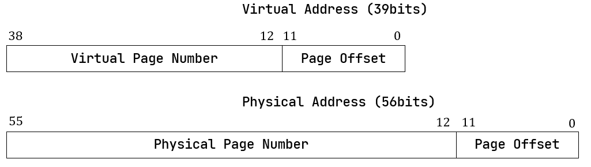

# rCore 清华操作系统实验 Part1

## 1. 应用程序和基本执行环境

### 1.1 移除标准库依赖，转向裸机编程

对于一个应用程序，我们可以通过`strace`​质量查看内部系统调用，我们会发现在现代的linux系统上，即便在代码上毛也不干的程序也会经历多次系统调用

我们可以尝试切换rust程序运行的平台，让其运行在类似于裸机器的平台上 `cargo run --target riscv64gc-unknown-none-elf`​，上述指令将我们转向一个不存在任何操作系统支持的平台。

​​

**rust的std和core**

* std是rust跨平台开发使用的标准库，内部包含了许多像`println!`​和`Option`​一样常用的宏和类
* core内部的功能是std的浓缩版，但是好处在于其可以直接在裸机平台上运行

**计算机的启动过程**

我们在裸机上编程的时候，首先自然要关注整个计算机的启动过程，基本可以认为是我们的电脑会先跳转到一些固定的位置，然后执行一些固定的代码，最终把硬件的控制权交给操作系统

而rCore在本章为我们实操了编写了内核的第一条指令，通过手写汇编的方式，并且使其加载到qemu上

**一个小疑问，为什么不能直接在这里使用Rust代码**

我们可以发现，直接在裸机上编程的时候，系统甚至不能有效地找到Rust代码的main函数在哪里，在我们能够使用标准库的时候，在main函数之前标准库会为我们做好初始化工作。

在我们禁止使用std的时候，我们需要先编写一些汇编代码，做一些初始化工作。

**基于GDB的检验**

​​

我们发现系统初始在01000处，经过一系列初始化工作后，我们跳转到我们之前设定的0x80200000处，发现我们设定的第一条指令确实已经被加载

​​

前期有一些初始化操作是RUSTSBI为我们做的，基本的行为就是前文提到的，把内核加载进来

### 1.2 从汇编转回Rust

我们在之前发现系统找不到main函数的情况，在RISCV中的函数调用主要依赖两组指令

* jal / jalr
* ret

除了这两个指令之外，我们还需要对函数调用时影响的寄存器用物理内存进行保存，这一点riscv也是区分了调用者保存和被调用者保存的。

更进一步，我们需要知道这些寄存器存在物理内存的何处，对于函数调用产生的这些寄存器保存，会存在栈上，用sp寄存器存储栈地址

​​

而在裸机编程中，编译系统不知道我们为程序分配了多少的栈空间，也不知道栈空间从哪里开始，因此需要我们通过汇编代码手动设定

### 1.3 使用RustSBI

RustSBI 是一个介于操作系统和硬件之间的存在，对于riscv系统而言，我们编写的 OS 内核位于 Supervisor 特权级，而 RustSBI 位于 Machine 特权级，也是最高的特权级。

通过sbi为我们提供的功能，我们能够实现输出

### 1.4 源码分析

这一部分的源代码相当简单，仅仅是对于SBI为我们提供的接口做了一些封装，使得我们可以简单地进行输出

## 2. 批处理系统

在批处理系统之前，我们相当于每一份代码都是操作系统内核的一部分，但是当我们有了批处理系统，也就是我们可以用程序自动地把其他的代码加载到操作系统上执行，也就有了所谓用户和内核的区别。

本章实现的操作系统的目标在于能够把有的程序一个一个加载到操作系统里，直到所有的系统都执行完

### 2.1 特权机制

这一部分为我们解答了一个问题，系统调用和普通的函数调用有什么区别，主要是出于安全性质的考虑，我们需要软硬件协调地进行系统调用。在上一章的操作系统中，操作系统仅作为一个库存在，系统把应用程序和操作系统库编译链接在一起，导致了应用程序拥有和操作系统相同的权限。

因此本章的重要目标在于，让应用程序不能执行某些可能破坏计算机系统的指令

这就涉及到本节提到的特权机制，这一部分需要软硬件协同地实现，在硬件方面，riscv的CPU区分了不同等级的执行环境，以及相应的能够执行的指令，如果在低等级的情况下调用高等级区分的指令，就会导致报错。并且在执行环境跳转的时候，需要使用两类特殊的指令

* ​`ecall`​ 具有用户态到内核态的执行环境切换能力的函数调用指令
* ​`eret`​ 具有内核态到用户态的执行环境切换能力的函数返回指令，这里特指 `sret`​

在软件方面，操作系统要在ecall和eret前后进行一定的检查和恢复工作

系统调用的本质就是内核与应用程序之间的接口，称为应用程序二进制接口ABI，这种接口是二进制，只能通过汇编码实现

在riscv中有两类特权指令

* 指令本身属于高特权级的指令，如 `sret`​ 指令（表示从 S 模式返回到 U 模式）。
* 指令访问了 [S模式特权级下才能访问的寄存器](https://rcore-os.cn/rCore-Tutorial-Book-v3/chapter2/4trap-handling.html#term-s-mod-csr) 或内存，如表示S模式系统状态的 **控制状态寄存器** `sstatus`​ 等。

### 2.2 用户程序

要实现能被该操作系统加载的用户程序，需要注意的有三部分

* 准备系统调用接口
* 基本的应用程序
* 内存布局设计

我们可以看到每一个基本应用程序中都包含了

```rust
#[macro_use]
extern crate user_lib;
```

引入了lib.rs里的内容及其子模块，而lib.rs中有一个重要的部分

```rust
#[no_mangle]
#[link_section = ".text.entry"]
pub extern "C" fn _start() -> ! {
    clear_bss();
    exit(main());
    panic!("unreachable after sys_exit!");
}
```

这段代码会被放在到text.entry处，并且会在清空bss段之后执行用户程序的main函数

而我们在linker.ld中记录了text.entry所在的位置，也就是所有的应用程序开始的位置

**实现系统调用**

```rust
fn syscall(id: usize, args: [usize; 3]) -> isize {
    let mut ret: isize;
    unsafe {
        asm!(
            "ecall",
            inlateout("x10") args[0] => ret, // 该寄存器输入args[0] 输出ret
            in("x11") args[1],				 // 下面三个寄存器都输入相应参数
            in("x12") args[2],
            in("x17") id
        );
    }
    ret
}
```

本章的系统调用被封装为这个函数，系统调用本身超出了Rust语言的表达范围，需要采用汇编代码，`asm!`​是Rust语言的汇编宏，可以将汇编代码嵌入Rust语言的上下文

后续的各种系统调用函数，都是对于`syscall`​进行了封装

```rust
pub fn sys_write(fd: usize, buffer: &[u8]) -> isize {
    syscall(SYSCALL_WRITE, [fd, buffer.as_ptr() as usize, buffer.len()])
}
```

这里要注意`&[u8]`​这个切片，这是一个胖指针，将字符串转换成bytes之后就是这个类型，我们可以获取其地址和长度作为参数

### 2.3 批处理操作系统

这一部分我们来实现操作系统，首先我们看os目录下的main.rs

```rust
global_asm!(include_str!("entry.asm"));
global_asm!(include_str!("link_app.S"));
```

发现比起上一章，多了一个汇编代码文件

```mipsasm
    .section .data
    .global app_0_start
    .global app_0_end
app_0_start:
    .incbin "../user/target/riscv64gc-unknown-none-elf/release/00hello_world.bin"
app_0_end:

    .section .data
    .global app_1_start
    .global app_1_end
app_1_start:
    .incbin "../user/target/riscv64gc-unknown-none-elf/release/01store_fault.bin"
...
```

上面仅仅是截取了一部分，我们发现，在这个文件中，我们看似手动把一系列应用程序的二进制代码加载到了内存的指定区域，实际上是在编译过程中自动生成的，我们可以在user部分增加一个`05say_goodbye.rs`​，然后在`make run`​的时候就发现它已经被加入到`link_app.S`​中了，也可以正常运行

**找到并且加载应用程序的二进制代码**

此处我们定义了一个`AppManager`​

```rust
struct AppManager {
    num_app: usize,
    current_app: usize,
    app_start: [usize; MAX_APP_NUM + 1],
}
```

我们自然希望有那么一个全局的`AppManager`​ 对象来处理工作，但是不幸的是，Rust对于全局可变变量非常严格，如果非要使用的话需要加上大量的unsafe语句块，导致这里增加了大量的代码来确保安全性

首先，既然不能有全局可变变量，那么自然会考虑使用`RefCell`​这类内部可变的变量，但是问题又来了，Rust对于全局变量的考量，会自动认为这个变量需要考虑线程安全，因此又会出现问题，于是我们最后选择了一个比较不那么优雅的做法

**实现特权级的切换**

基本我们是需要实现这四个功能

* 当启动应用程序的时候，需要初始化应用程序的用户态上下文，并能切换到用户态执行应用程序；
* 当应用程序发起系统调用（即发出 Trap）之后，需要到批处理操作系统中进行处理；
* 当应用程序执行出错的时候，需要到批处理操作系统中杀死该应用并加载运行下一个应用；
* 当应用程序执行结束的时候，需要到批处理操作系统中加载运行下一个应用（实际上也是通过系统调用 `sys_exit`​ 来实现的）。

本身的特权级的切换是比较复杂的，我们这次只看用户态和内核态的切换。接下来看看代码是如何一一实现上述的功能

riscv为Trap准备了一系列的寄存器来辅助Trap的实现

​​

同时在特权级切换的时候，和函数调用一样，需要找一个地方保存前一个特权级状态的寄存器和栈空间，为了安全性的考量，我们区分了用户栈和内核栈，使得相应上下文的保存不至于被覆盖，换栈的时候需要把sp寄存器的值设置为对应的栈顶

在Trap的时候，系统会将`sstatus`​转换成s，并且跳转到Trap调用设定的`stvec`​处，下面是TrapContext的实现，包含了32个通用寄存器和两个CSR

在本章的操作系统中，使用了三个阶段完成Trap

* 保存上下文
* 调用`trap_handler`​完成trap工作
* 读取并恢复上下文

```rust
#[repr(C)]
pub struct TrapContext {
    /// general regs[0..31]
    pub x: [usize; 32],
    /// CSR sstatus    
    pub sstatus: Sstatus,
    /// CSR sepc
    pub sepc: usize,
}
```

在操作系统初始化的时候，调用了`trap::init()`​来初始化了trap功能

```rust
//trap::init()
pub fn init() {
    extern "C" {
        fn __alltraps();
    }
    unsafe {
        stvec::write(__alltraps as usize, TrapMode::Direct);
    }
}
```

这个功能是我们将`__alltraps`​这个汇编函数的地址写到了stevec上，这个汇编函数实现了第一步保存上下文的工作，这个汇编函数的最后一步就是调用`trap_handler`​函数

```mips
    # set input argument of trap_handler(cx: &mut TrapContext)
    mv a0, sp
    call trap_handler
```

现在我们来看`trap_handler`​，抛开错误情形不谈，一般的情况下，这个函数的主题部分应该在第9行调用`syscall`​，在调用`syscall`​之前，我们通过riscv库，获取了两个寄存器的值，并且根据scause的状态来分发trap的分支

```rust
#[no_mangle]
/// handle an interrupt, exception, or system call from user space
pub fn trap_handler(cx: &mut TrapContext) -> &mut TrapContext {
    let scause = scause::read(); // get trap cause
    let stval = stval::read(); // get extra value
    match scause.cause() {
        Trap::Exception(Exception::UserEnvCall) => {
            cx.sepc += 4;
            cx.x[10] = syscall(cx.x[17], [cx.x[10], cx.x[11], cx.x[12]]) as usize;
        }
        Trap::Exception(Exception::StoreFault) | Trap::Exception(Exception::StorePageFault) => {
            println!("[kernel] PageFault in application, kernel killed it.");
            run_next_app();
        }
        Trap::Exception(Exception::IllegalInstruction) => {
            println!("[kernel] IllegalInstruction in application, kernel killed it.");
            run_next_app();
        }
        _ => {
            panic!(
                "Unsupported trap {:?}, stval = {:#x}!",
                scause.cause(),
                stval
            );
        }
    }
    cx
}
```

然后我们来看`syscall`​，其实就是上一章我们实现的那两个功能

```rust
pub fn syscall(syscall_id: usize, args: [usize; 3]) -> isize {
    match syscall_id {
        SYSCALL_WRITE => sys_write(args[0], args[1] as *const u8, args[2]),
        SYSCALL_EXIT => sys_exit(args[0] as i32),
        _ => panic!("Unsupported syscall_id: {}", syscall_id),
    }
}
```

‍

## 3. 多道程序和分时多任务

所谓的多道程序就是同时在内存中加载多个程序，但是程序的执行顺序依旧是顺序的，但是随着性能的发展，人们发现IO对于运行性能的影响越来越大，很多时候需要系统进行一些设计，降低IO对于程序运行的影响。从程序中抽象出任务和任务切片等概念，需要对每个程序保存其各自的用户栈，在上一章的操作系统中，整个用户态对应一个用户栈

后续人们发现让用户程序主动去进行放弃任务提高协作效率不太现实，于是就引入了时钟中断机制，让操作系统程序来管理用户程序的中断。

* ch3-coop 分支上的系统主要是区分了各个程序自己的用户栈，同时支持程序主动放弃CPU占用的同时，还能保存自身的状态
* ch3 分支上的系统主要是增加了时钟中断功能，实现分时多任务

### 3.1 多道程序

**多道程序的加载**

在`user/build.py`​脚本中，我们用`cargo build`​指令构建了`bin/`​下每个文件，与上一章操作系统不同的是，本章的应用程序会在一开始都加载到内存里面，这一部分实现在`os/src/loader.rs`​ 中

这段代码的核心含义就是同时把所有的应用程序加载到内存里，下面这段代码是我们对于其内存位置的安排，在根据Config里面安排的常数，看到我们对于每个应用程序的内存镜像的空间上限是`0x20000`​

```rust
 // os/src/loader.rs

 fn get_base_i(app_id: usize) -> usize {
     APP_BASE_ADDRESS + app_id * APP_SIZE_LIMIT
 }

// os/src/config.rs

pub const USER_STACK_SIZE: usize = 4096 * 2;
pub const KERNEL_STACK_SIZE: usize = 4096 * 2;
pub const MAX_APP_NUM: usize = 4;
pub const APP_BASE_ADDRESS: usize = 0x80400000;
pub const APP_SIZE_LIMIT: usize = 0x20000;
```

**多道程序的任务切换**

在任务切换中我们再一次涉及到了控制流的变更，就如同我们之前的系统调用一样，我们将一个应用程序认为是一个任务，这个任务可以被切成一个个任务切片

任务切换的关键在于一个`__switch`​函数，其通过手写汇编的方式位于，`os/src/task/switch.S`​，该函数的特殊性在于其实现了换栈，其具体流程为

* 存储A的CPU寄存器快照在A的上下文中
* 读取B的上下文，恢复其上下文于对应的寄存器

因此其需要两个参数，存储A，B任务的上下文地址，具体需要保存的内容如下

```rust
// os/src/task/context.rs

pub struct TaskContext {
    ra: usize,
    sp: usize,
    s: [usize; 12],
}
```

在我们实现了`__switch`​ 函数之后，我们可以在任务运行结束和任务主动暂停的过程中调用它，以形成基础的多道程序操作系统

在本章中，任务主动暂停只发生在IO处理中，后续还可以看到IO以外的任务切换需

```rust
#[derive(Copy, Clone)]
pub struct TaskControlBlock {
    pub task_status: TaskStatus, //任务的状态
    pub task_cx: TaskContext,    //任务的上下文
}
```

借此，可以拓展上一章中的任务管理器

```rust
pub struct TaskManager {
    num_app: usize,
    inner: UPSafeCell<TaskManagerInner>,
}

struct TaskManagerInner {
    tasks: [TaskControlBlock; MAX_APP_NUM],
    current_task: usize,
}
```

然后的重点在于，主动切换操作的实现，我们将其封装为系统调用，在os中的具体实现为

```rust
/// current task gives up resources for other tasks
pub fn sys_yield() -> isize {
    suspend_current_and_run_next();
    0
}
```

我们进一步向下查找具体实现

```rust
/// suspend current task, then run next task
pub fn suspend_current_and_run_next() {
    mark_current_suspended();
    run_next_task();
}
```

* 修改当前应用的运行状态
* 找到下一个可以应用的东西
* 运行下一个应用程序

```rust
fn run_next_task() {
    TASK_MANAGER.run_next_task();
}

impl TaskManager {
    fn run_next_task(&self) {
        if let Some(next) = self.find_next_task() {
            let mut inner = self.inner.exclusive_access();
            let current = inner.current_task;
            inner.tasks[next].task_status = TaskStatus::Running;
            inner.current_task = next;
            let current_task_cx_ptr = &mut inner.tasks[current].task_cx as *mut TaskContext;
            let next_task_cx_ptr = &inner.tasks[next].task_cx as *const TaskContext;
            drop(inner);
            // before this, we should drop local variables that must be dropped manually
            unsafe {
                __switch(
                    current_task_cx_ptr,
                    next_task_cx_ptr,
                );
            }
            // go back to user mode
        } else {
            panic!("All applications completed!");
        }
    }
}
```

在这里我们扩展了上一届的TaskManager，变成如下结构

```rust
pub struct TaskManager {
    /// total number of tasks
    num_app: usize,
    /// use inner value to get mutable access
    inner: UPSafeCell<TaskManagerInner>,
}

/// Inner of Task Manager
pub struct TaskManagerInner {
    /// task list
    tasks: [TaskControlBlock; MAX_APP_NUM],
    /// id of current `Running` task
    current_task: usize,
}

#[derive(Copy, Clone)]
pub struct TaskControlBlock {
    pub task_status: TaskStatus,
    pub task_cx: TaskContext,
}

#[derive(Copy, Clone, PartialEq)]
pub enum TaskStatus {
    UnInit,
    Ready,
    Running,
    Exited,
}

```

将task抽象为一个`TaskControlBlock`​数组，在该Block中维护了每个任务的当前状态以及其上下文，我们可以看看如何创建这样一个全局的控制器

```rust
lazy_static! {
    /// Global variable: TASK_MANAGER
    pub static ref TASK_MANAGER: TaskManager = {
        let num_app = get_num_app();			//构建的时候写死在内存里
        let mut tasks = [TaskControlBlock {
            task_cx: TaskContext::zero_init(),  //上下文寄存器姑且设置为0
            task_status: TaskStatus::UnInit,    //状态设置为未初始化
        }; MAX_APP_NUM];
        for (i, task) in tasks.iter_mut().enumerate() {
            task.task_cx = TaskContext::goto_restore(init_app_cx(i)); //加载对应的寄存器内容
            task.task_status = TaskStatus::Ready;					  //状态设置为Ready
        }
		//创建这个TaskManager
        TaskManager {
            num_app,
            inner: unsafe {
                UPSafeCell::new(TaskManagerInner {
                    tasks,
                    current_task: 0,
                })
            },
        }
    };
}
```

### 3.2 分时多任务

上一小节实现的多道程序操作系统虽然可以有效降低IO设备对于CPU空耗的影响，但是问题在于根据IO设备切换到的下一条程序的运行时间未知，很有可能会导致每一次IO的响应区别很大，这对于高交互性的程序来说是不可接受的，于是就有了本章的分时多任务的系统

相比与不主动`yield`​就不会停止运行的多道程序系统，分时多任务系统中的程序随时会被操作系统切出CPU，每个程序最多只能运行固定长度的时间，随后就会被切出CPU

本章使用基础的时间片轮转算法来处理任务片的处理问题

那么要让操作系统定时切换任务，首先得让操作系统有感知时间的能力，这部分能力在Riscv中，主要通过两个寄存器实现，一个寄存器`mtime`​，保存着按照内置时钟频率自增的时间，另一个寄存器`mtimecmp`​，我们可以设置这个寄存器的值，当`mtime`​和              `mtimecmp`​两边的值相同就会触发一次时钟中断，这也是我们操作系统中需要控制的部分。在`timer.rs`​中封装好了基础的接口

```rust
use crate::config::CLOCK_FREQ;
use crate::sbi::set_timer;
use riscv::register::time;

const TICKS_PER_SEC: usize = 100;
const MSEC_PER_SEC: usize = 1000;

pub fn get_time() -> usize {
    time::read()
}

/// get current time in milliseconds
pub fn get_time_ms() -> usize {
    time::read() / (CLOCK_FREQ / MSEC_PER_SEC)
}

/// set the next timer interrupt
pub fn set_next_trigger() {
    set_timer(get_time() + CLOCK_FREQ / TICKS_PER_SEC);
}

```

时钟中断是我们`trap`​机制的一部分，因此其调用实现在于之前的系统调用的部分的函数中

```rust
#[no_mangle]
/// handle an interrupt, exception, or system call from user space
pub fn trap_handler(cx: &mut TrapContext) -> &mut TrapContext {
    let scause = scause::read(); // get trap cause
    let stval = stval::read(); // get extra value
    match scause.cause() {
        Trap::Exception(Exception::UserEnvCall) => {
            cx.sepc += 4;
            cx.x[10] = syscall(cx.x[17], [cx.x[10], cx.x[11], cx.x[12]]) as usize;
        }
        ...
        Trap::Interrupt(Interrupt::SupervisorTimer) => { //涉及时钟中断的情形
            set_next_trigger();
            suspend_current_and_run_next();
        }
		...
    }
    cx
}
```

设置好这部分之后，随后在每一次时钟中断触发之时，我们就会设置好下一次时钟中断的时间，并且运行下一个程序

## 4. 地址空间

我们之前是将所有应用程序读入到固定的一块物理内存中，并且设定另一块物理空间给应用程序使用，一块物理空间给内核使用。这样子一定程度上来说存在比较严重的安全问题，并不能有效做到各个应用程序之间的隔离，memory的使用效率也不高

对于一个应用程序而言，分时的任务让它觉得自己可以独占CPU，而地址空间可以让其觉得自己独占一片内存空间

在本章中，我们会正式区分地址Address和内存位置Memory Location，实现

* 地址转换
* 按需分配页
* 页面替换算法

### 4.1 在内核中实现动态内存分配

动态内存分配的原理就在于要处理那些在运行时才知晓所占存储空间的变量，我们时常会提到动态内存分配会遇到内存碎片，其一般是指

* 内碎片，分配出去不使用的空间
* 外碎片，未分配出去，但是太小了无法使用的

**Rust 中的指针**

* 裸指针 `*mut T`​ 和 `*const T`​ 与C/C++中的指针一样，但是在Rust中不能随意解引用
* 引用 `&mut T`​和`&const T`​ 会做所有权检查
* 智能指针 包含更多信息的指针，包括`Box`​，`Rc`​ `Arc`​等等  Rc可以有多所有权；RefCell可以修改内部的变量

因为allocator的实现过于复杂，这里实际上是导入了一个外部的allocator，并且将其初始化为一个全局的变量

```rust
#[global_allocator]
static HEAP_ALLOCATOR: LockedHeap = LockedHeap::empty();

static mut HEAP_SPACE: [u8; KERNEL_HEAP_SIZE] = [0; KERNEL_HEAP_SIZE];

pub fn init_heap() {
    unsafe {
        HEAP_ALLOCATOR
            .lock()
            .init(HEAP_SPACE.as_ptr() as usize, KERNEL_HEAP_SIZE);
    }
}
```

‍

### 4.2 地址空间

我们往往把地址空间视为一个巨大的数组，但是其内部有更多的迭代

在应用程序的视角中，地址空间是一片巨大的空间，内部有一块连续的空间是我们自己可以访问，虽然地址空间由操作系统掌握，但是虚实地址的转换由硬件机制处理，也就是MMU和TLB，之所以把这个功能下放到硬件机制是为了提高效率

MMU机制，对于不同的应用程序而言，映射机制是不同的，比如不同应用程序相同的虚拟地址会映射到不同的物理地址上，很显然，这种针对每个应用程序给予不同映射设计需要操作系统来维护，由此产生了一系列机制

* 分段内存管理：是比较原始的管理模式，给每个应用程序分配固定大小的空间，一个个排在内存上，实现简单但是浪费巨大
* 分页内存管理：是现代的管理模式，应用的地址空间和物理地址空间都被分成相同大小的frame，我们会给虚拟页帧和物理页帧一个编号，称之为VPN和PPN，并且为每个应用程序构建一个Page Table 页表，来维护VPN和PPN的映射关系以及访问属性，比如可读可写可执行  
  ​​

‍

### 4.3 SV39基础上的多级页表

分页的内存管理是一个经典的需要软硬件协作的机制，而Riscv 64为我们提供了SV39的硬件分页机制

在之前我们使用的指令都是直接操作的物理地址，显然我们需要一个开关去启用MMU机制，也就是转换虚实地址的机制，我们通过设置`stap`​寄存器去启用MMU，随后所有 S/U 权限的指令都会视为一个39位虚拟地址的访问

​​

我们的分页机制将每个页设计为4Kib大小，也就是我们需要12位的page offset，因此我们实际需要使用虚拟地址的高27位作为VPN转换成44位的PPN

​​

与地址相关的功能实现在`address.rs`​中，我们封装了四个元组结构体，简单地将`usize`​封装起来

```rust
/// Definitions
#[derive(Copy, Clone, Ord, PartialOrd, Eq, PartialEq)]
pub struct PhysAddr(pub usize);

/// virtual address
#[derive(Copy, Clone, Ord, PartialOrd, Eq, PartialEq)]
pub struct VirtAddr(pub usize);

/// physical page number
#[derive(Copy, Clone, Ord, PartialOrd, Eq, PartialEq)]
pub struct PhysPageNum(pub usize);

/// virtual page number
#[derive(Copy, Clone, Ord, PartialOrd, Eq, PartialEq)]
pub struct VirtPageNum(pub usize);
```

* 在rust中，元组中的`pub`​使得该元素可以直接访问，形如`x.0`​来访问第一个元素

同时，我们为了保持类型安全，使用rust中的 `From trait`​ 在四种类型和`usize`​之间做了转换工作，同时我们还能从物理地址提取物理页号，虚拟地址提取虚拟页号，这一切都通过位运算完成，这部分转换工作花费了大量的代码，但是可以有效保证运算时的准确性。

在SV39机制中，虚拟页号能够查询到的不是物理地址，而是一个页表项PTE，形式如下，不仅包含了PPN，还包含了该页的更多信息，例如地址是否合法，是否可读可写等等

​​

为了更好地处理[7:0]这几个bit，我们使用rust库中提供的一个宏，我们后续只需要把PTE和PTEflags中的成员进行按位与（&），即可判断该位是否为1

```rust
// os/src/mm/page_table.rs

use bitflags::*;

bitflags! {
    pub struct PTEFlags: u8 {
        const V = 1 << 0;
        const R = 1 << 1;
        const W = 1 << 2;
        const X = 1 << 3;
        const U = 1 << 4;
        const G = 1 << 5;
        const A = 1 << 6;
        const D = 1 << 7;
    }
}
```

有了上述几个类之后，我们就可以实现PTE类了，该类实现在`page_table.rs`​中，并且实现一系列的辅助功能

```rust
#[derive(Copy, Clone)]  //只是对于usize的简单封装，不需要做移动语义
#[repr(C)]				//这个东西是告诉编译器，我们这里定义的结构体的内存分布需要和C语言的一致，这在我们需要和C语言协作开发的时候很重要
pub struct PageTableEntry {
    pub bits: usize,
}

impl PageTableEntry {
    pub fn new(ppn: PhysPageNum, flags: PTEFlags) -> Self {
        PageTableEntry {
            bits: ppn.0 << 10 | flags.bits as usize,
        }
    }
	...
	pub fn is_valid(&self) -> bool {
        (self.flags() & PTEFlags::V) != PTEFlags::empty()
    }
}
```

**多级页表的实现**

为了提高空间的利用率，我们是希望能够按需分配页表的存储，有多少合法VPN就有多少个页表项存着。这就类似于数据结构中的字典树，本身是一颗空树，当有单词插入的时候才生成节点。而多级页表的实现正好类似

27位的虚拟页号，我们将其视为3位字符串，每一位的字符集合是0~511，也就是$2^9$，这样 $3\times9=27$，一共三层，每层最多512分叉

这样设计还有一个特点就是叶子节点，有512分叉，每个分叉的PTE是64位也即8个字节，所以一个叶子阶段占4Kb，正好是我们之前划分一个frame的大小，对于Flags，我们做如下设置

* 当 `V`​ 为 0 的时候，代表当前指针是一个空指针，无法走向下一级节点，即该页表项对应的虚拟地址范围是无效的；
* 只有当 `V`​ 为1 且 `R/W/X`​ 均为 0 时，表示是一个合法的页目录表项，其包含的指针会指向下一级的页表；
* 注意: 当 `V`​ 为1 且 `R/W/X`​ 不全为 0 时，表示是一个合法的页表项，其包含了虚地址对应的物理页号。

​​

对于一个页表，我们在使用之前需要把根页（一级页表）的物理页号放到`satp`​寄存器上

我们在操作系统中进行硬编码，确定好哪一部分内存是给操作系统代码的，哪一部分内存是可以被页表进行管理分配的物理页帧。

我们设计一个`trait`​作为物理页帧分配器的接口

```rust
trait FrameAllocator {
    fn new() -> Self;
    fn alloc(&mut self) -> Option<PhysPageNum>;
    fn dealloc(&mut self, ppn: PhysPageNum);
}
```

物理页帧的分配，实际就是管理物理页号的分配和回收，我们来实现一个栈式的分配器

```rust
pub struct StackFrameAllocator {
    current: usize,  //空闲内存的起始物理页号
    end: usize,      //空闲内存的结束物理页号
    recycled: Vec<usize>,
}

impl StackFrameAllocator {
    pub fn init(&mut self, l: PhysPageNum, r: PhysPageNum) {
        self.current = l.0;
        self.end = r.0;
    }
}
```

这里的`recycled`​就是表示分配然后又回收的页号，因此我们在`alloc`​时先去`recycled`​中找，随后我们实现好alloc和dealloc方法，并且初始化好全局的`StackFrameAllocator`​，之后创建alloc和dealloc的公开接口

```rust
pub fn frame_alloc() -> Option<FrameTracker> {
    FRAME_ALLOCATOR
        .exclusive_access()
        .alloc()
        .map(|ppn| FrameTracker::new(ppn))
}

fn frame_dealloc(ppn: PhysPageNum) {
    FRAME_ALLOCATOR
        .exclusive_access()
        .dealloc(ppn);
}

impl Drop for FrameTracker {
    fn drop(&mut self) {
        frame_dealloc(self.ppn);
    }
}
```

这里的`FrameTracker`​是对物理页号的简单封装，但是这里使用到了RAII的思想，只要使用`FrameTracker`​就自动实现分配，而当我们手动改写`Drop`​这个特性之后，`FrameTracker`​的生命周期的结束依旧直接是的物理页号被dealloc，通过

* 公开接口
* Drop特性

我们就完成了RAII的封装，将生命周期和资源绑定起来，好处就是我们无需手动管理物理页帧的回收了

有了物理页的分配器之后，我们来正式开始实现多级页表

```rust
// os/src/mm/page_table.rs

pub struct PageTable {
    root_ppn: PhysPageNum,
    frames: Vec<FrameTracker>,
}

impl PageTable {
    pub fn new() -> Self {
        let frame = frame_alloc().unwrap();
        PageTable {
            root_ppn: frame.ppn,
            frames: vec![frame],
        }
    }
}
```

对于每个应用程序而言，它们有自己的页表，因此`PageTable`​对象需要存储root的PPN，用以区分各个页表，而对多级页表而言，最重要的无疑是其需要插入和删除VPN/PPN对，实现了该功能之后，系统启用分页机制，操作系统和应用程序都只能执行在虚拟地址上了

**总结一下页表设计的几个模块**

* 虚实地址，虚实页号，一共四个封装好的元组，实现于`address.rs`​
* 物理页号分配器，仅管理页号的分发，实现于 `frame_allocator.rs`​
* 页表的实现，主要是管理插入和删除，实现于`page_table.rs`​

### 4.4 内核和应用的地址空间

本章的代码侧重于`memory_set.rs`​，本章的目标在于完成地址空间的抽象。

首先对于一个应用程序而言，其所看到的虚拟地址空间是连续，因此我们有一段连续的虚拟地址空间。首先我们实现了一个结构表示一段连续的虚拟页号

```rust
impl<T> SimpleRange<T>
where
    T: StepByOne + Copy + PartialEq + PartialOrd + Debug,
{
    pub fn new(start: T, end: T) -> Self {
        assert!(start <= end, "start {:?} > end {:?}!", start, end);
        Self { l: start, r: end }
    }
    pub fn get_start(&self) -> T {
        self.l
    }
    pub fn get_end(&self) -> T {
        self.r
    }
}

pub type VPNRange = SimpleRange<VirtPageNum>;
```

借此我们形成一个地址区域的数据类型

```rust
pub struct MapArea {
    vpn_range: VPNRange,
    data_frames: BTreeMap<VirtPageNum, FrameTracker>,
    map_type: MapType,
    map_perm: MapPermission,
}
```

除了映射和页号范围之外，还有MapType和MapPermission两个辅助数据用于描述这个MapArea

这里的MapPermission比较好理解，就是一些对于这块地址空间的可读可写性质的描述，而MapType一共有两种

* Identical 是所谓的恒等映射，我们在内核中还是需要对物理地址进行直接地操作，因此我们需要构建一种特殊的映射，其VPN就等于PPN，通过这类页表，我们就可以直接访问物理地址
* Framed 就是正常的多级页表

例如我们来看看MapArea其中一个方法

```rust
    pub fn map_one(&mut self, page_table: &mut PageTable, vpn: VirtPageNum) {
        let ppn: PhysPageNum;
        match self.map_type {
            MapType::Identical => {
                ppn = PhysPageNum(vpn.0);
            }
            MapType::Framed => {
                let frame = frame_alloc().unwrap();
                ppn = frame.ppn;
                self.data_frames.insert(vpn, frame);
            }
        }
        let pte_flags = PTEFlags::from_bits(self.map_perm.bits).unwrap();
        page_table.map(vpn, ppn, pte_flags);
    }
```

我们找到PPN之后，在data_frames中插入vpn-ppn映射，同时在page_table中也完成相应的插入

在此之上我们构建出整个地址空间的数据结构

```rust
pub struct MemorySet {
    page_table: PageTable,
    areas: Vec<MapArea>,
}
```

之后我们构建内核的应用的地址空间

### 4.5 基于地址空间的分时多任务

让我们回到main.rs中，在操作系统启动不久，我们就调用了初始化地址空间这个函数

```rust
// main.rs
mm::init();

// os/src/mm/mod.rs

pub use memory_set::KERNEL_SPACE;

pub fn init() {
    heap_allocator::init_heap();
    frame_allocator::init_frame_allocator();
    KERNEL_SPACE.exclusive_access().activate();
}
```

这个KERNE_SPACE，是一个全局的内核地址空间对象，在上述代码的第11行，依照lazy_static!宏的定义，该全局对象第一次被使用到的时候被初始化。

在初始化之后我们调用activate函数，切换成SV39，然后将根页放到satp，启动MMU。后面的这行汇编是用于清空地址缓存，也就是快表

```rust
impl MemorySet {
    pub fn activate(&self) {
        let satp = self.page_table.token(); 
        unsafe {
            satp::write(satp);
            asm!("sfence.vma" :::: "volatile");
        }
    }
}
```

在我们当前的设计中，应用的地址空间和内核的地址空间是分开来维护的，因此我们要在Trap的同时切换地址空间

### 实验

由系统调用传入系统栈的地址，是应用程序的虚拟地址，我们需要将其转换成物理地址之后再系统栈中进行访问

```rust
/// write buf of length `len`  to a file with `fd`
pub fn sys_write(fd: usize, buf: *const u8, len: usize) -> isize {
    match fd {
        FD_STDOUT => {
            let buffers = translated_byte_buffer(current_user_token(), buf, len);
            for buffer in buffers {
                print!("{}", core::str::from_utf8(buffer).unwrap());
            }
            len as isize
        }
        _ => {
            panic!("Unsupported fd in sys_write!");
        }
    }
}
```

例如这一段代码中，buf这个指针是从应用程序中传入的，因此要先经历地址的translate，才能在内核地址空间中正常使用，translate的三个参数

* 第一个，选择当前的用户地址空间，也即选择了特定的能够正确翻译的页表
* 第二个就是需要翻译的指针
* len，是指这个地址所表示的变量的长度