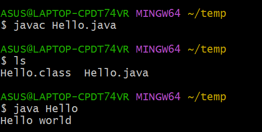
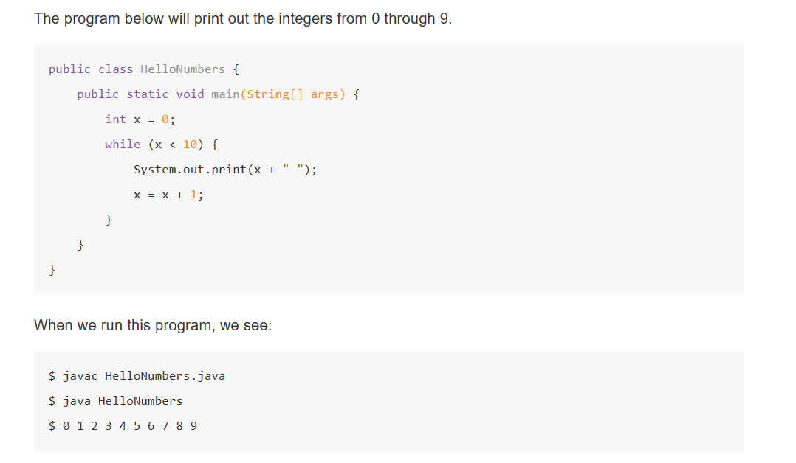

# learning Java

### run the first java program in shell

here shows how to run a java project in command line

​​

using instruction "explorer ." can open the file folder we are now.

```java title='the first program'
public class Hello{
	public static void main(String[] args){
		System.out.println("Hello world");
	}
}
```

1. in java, all codes live inside of class
2. the code that is run is inside the method "main" and the main method is also in some class
3. The name of class should be same with file name, for example, in hello.java you should write the hello class.

above is some basic rules of Java

### some features like C

Java的基本语法与C/C++有一定的相似性，包括基础数据类型，判断语句，循环语句等等

### variables and loops

use a small test and I don't repeat it again just give a screenshot here

​​

here are some rules we can find above

1. each variables should be **given a type, ​**which is like C
2. the definition of loop is like C, 循环语句和C类似
3. print(x+" ") is to prevent numbers from running into each other.

```java
/*目前我们见到两种输出语句*/
System.out.println(x);
System.out.print(x);
/*它们区别在于前者末尾换行，后者不换行*/
```

java also provide way to enhance loop, which is called iterations, we will talk about the detail of it after.

```java
public class EnhancedForBreakDemo {
    public static void main(String[] args) {
        String[] a = {"cat", "dog", "laser horse", "ketchup", "horse", "horbse"};

        for (String s : a) {
            for (int j = 0; j < 3; j += 1) {
                System.out.println(s);
                if (s.contains("horse")) {
                    break;
                }              
            }
        }
    }
}
```

### static types check

In java, all variables and expression have the static type  
Its static type can never be changed, or we will have mistake during compiling.

As Java's language feature, static type is different from the type we usaully consider, and we will talk about the static type and dynamic type after.

And static type will make sure programmer know exactly what sort of object we are dealing with, which is a good feature indeed.

```java
String h=5+"hello";
//此时h为“5hello”
String h=5+"10";
//此时h为"510"
```

And even the action that give 5.3 to a int variable is not allowed.

### function

```java
public class classname{
//下述就是一个java函数
	public static int max(int a,int b){
		if(a>b){
			return a;
		}
		return b;
	}
	public static void main(String[] args){
		System.out.println(max(10,5));
	}
}
```

public static int max(int a,int b);

it is a signature of the function, which contains parameters, return types, name, and any modifiers(修饰语，包括public 和 static)

### arrays

**the definition of arrays**

```java
//在java中定义数组有几种方式
int[] numbers=new int[3];
int[] numbers=new int[]{2,3,5};
```

When you define an array, you will never use these two ways together.  
For example, `int[] numbers=new int [3]{2,3,5};`​ will cause an error.

**the methods of arrays**

```java
int[] numbers=new int[3];
System.out.println(numbers.length);//获得数组的长度
```

### object

Object is the instance of the class.

```java
public class Dog{
	public int weightInPounds;
	public void makeNoise(){ //静态的函数内部不能调用非静态的数据
		if(weightInPounds<10){
			System.out.println("yipyip");
		}else if(weightInPounds<30){
			System.out.println("barkbark");
		}else{
			System.out.println("woof");
		}
}

public class DogLaucher{
	public static void main(String[] args){
		Dog d;
		d=new Dog();
		d.weightInPounds=25;
		d.makeNoise();
	}
}
```

above is the basic class and the way to use it.  
the variables without static is called instance variables or non-staic variables, so do method.(这些变量和方法不能脱离实例，不能只靠类使用，必须还依赖于对象  
 As a object oriented language, java has more features about object.

#### constructor

```java
public class Dog{
	public Dog(int w){
		weightInPounds=w;
	}
}

Dog d=new Dog(25);
```

#### array of objects

```java
//main
Dog[] dogs=new Dog[2];
dogs[0]=new Dog(20);
dogs[1]=new Dog(15);
//this new is being used in two different way
```

#### static method and non-static method

The difference between these two methods is whether there is static or not in delcaration.

In other way, static method is class method  
and non-static method is instance method

instance method can be taken only by specific instance of class.

sometimes, it is necssary for a class have static and non-static methods at the same time. For example

```java
public class Dog{
	//...
	public static Dog biggerDog(Dog d1,Dog d2){
		if(d1.weightInPounds>d2.weightInPounds){
			return d1;
		}else {
			return d2;
		}
	}
}

//main
	Dog d1=new Dog(25);
	Dog d2=new Dog(30);
	Dog.biggerDog(d1,d2);
```

A static function can be used by `ClassName.MethodName()`​. And it can't access the non-static member of the class.

#### static variables

```java
public class Dog{
	public int weigthInPounds;
	public static String binomen="Candy";
	//...
}
```

In fact, we can access to this "binomen" by Dog.binomen or d.binomen. However, we highly recommend to use Dog.binomen only.

### command line arguments

```java
public class classname{
	public static void main(String[] args){
		System.out.println(args[0]);
	}
}
// 运行
java classname hello world

//args 为一个字符数组，args[0]就是hello
//args 就是 {"hello","world"} 
```

### reference type variables

In my opinion, the reference type is one of the most excellent designs in Java, it also makes Java truly different from C/CPP. So I want to talk about it in more detail.

**what is variable**

Each variable will have its memory address, type and its memory size.

Unlike programming language like C, we would **never know the memory address** of a variables in java.  
It may cause a waste of effciencies, but it actually helps us avoid a lot of programming errors.

We can just write a declaration of a variable and don't write anything to it.  
However, we cann't use these variables until we use "=" to fill its memory block.

**primitive type and reference type**

In java, there is eight**​ primitive types. ​**they are "**int, double, byte, short, long, float, boolean, char**"

Some other type like array and the class we desgin ourselves are not primitive type, they are called **reference type.**

In fact, Java provide the reference version for these primitive type, like "Integer" to "int". So what's the difference between these two type?  
To an integer one, if it is "int" type, it may be "0000 0001" which expresses its true value "1" in binary way.  
If it is "Integer" type, it will be an address, which points at an integer whose value is "1".

For the objects we design ourselves, they all have some additional overhead.(额外开销

```java
public class Warlus{
	public int weight;
	public double tuskSize;
	public Warlus(int w,double tusk){
		weight=w;
		tuskSize=tusk;
	}
}
```

In fact, an object of Walrus will take memory block more than 32bits+64bits. However, for abstraction of java,  
we should ignore this overhead.

**an example of** **references variable**

In fact, we declare a reference variable of **any refernce type**, java would give it 64-bit block, no matter how large your class is.  
This 64-bit block don't contian the data of the variables, but contain the address of it, which means it is a pointer.

```java
Walrus someWalrus;
someWalrus = new Walrus(1000,53.8);
```

The operator "new" will create a Walrus object by constructor Walrus(1000,53.8) and **return its address.**

Specially, we can use value "null" to reference variables, corresponding to all zeros

Now, we would see this situation

```java
Walrus a=new Walrus(1000,53.8);
Walrus b;
b=a;
```

b just copy the 64-bit block of a, so b and a all point at the **same object**.

**parameter passing**

When we pass parameters to function, we are just copying the bit, which means pass the value.

```java
public static double func(double a,double b);
public static void main(String[] args){
	double x=10.0;
	double y=10.1;
	func(x,y);
}
```

In the example above, we have block for x and y at first, then in func, we will also create block a and b, and **copy the value** of x and y to them. 

But if the type of parameter is reference type, it will copy the what this reference type contains, which is the **pointer ​**in fact.  
So if we change the reference variable in the function, it will actually change the variable in the outside.

We all know that in cpp we usually need to write the copy constructor and overloaded the operator "=" because the copy of large object is a large waste of time.  
But in Java, copy an object will never cost a lot time because we just copy its 64-bit address.

### encapsulation

We can use public and private to control the accessibility of data.

For example

```java
public class SLList{
	private IntNode first;
	...
}
```

In this cause, we can't use s.first to access the data memeber first.  

Private variables and method can only be accessed by the code in the same .java file.

### nested class

In java, we can delcare a class inside another class, for example

```java
public class SLList{
	public class IntNode{...}
	private IntNode first;
	...
}
```

We use nested class when the inside class only serve the enclosing class.  
If we don't want the class IntNode to access the variables and method in SLList. We can declare "static" to it. Like below

```java
public class SLList{
	public static class IntNode{...}
	...
}
```

### overload of function

The rules of overloading function is like cpp.

The functions should have different parameters.

Overload is good, but it also have many shortcomes, it may create many similar code blocks.

### generics

We can use a name after your class name declaration and this name can replace the type

```java
public class DLList<myTypeName> {
    private IntNode sentinel;
    private int size;

    public class IntNode {
        public IntNode prev;
        public myTypeName item;
        public IntNode next;
        ...
    }
    ...
}
```

**Warning**: If this IntNode is declared as "static", it can't use generics type name "myTypeName"

How to use the generics

```java
DLList<String> d1=new DLList<>("hello");  //in the second "<>" we don't need to write the typename
```

**Important!**

The generics grammar is only work with **reference type** so that we can't use primitive type like "int" or "double" in it.  
So, we have some reference type to replace them like Integer and so on.

```java
DLList<Integer> d2=new DLList<>(2);
DLList<int> d3=new DLList<>(2);//error
```

### package

**this part is not completed yet**

**what is package**

Package is a collection of java classes and work for the common goal.

For example, org.junit is a package for test code. "Assert" is a class in it which contains function like assertEqual

**how to make a package**

We should use keyword "package" in the top of the file to show that this file is belonging to the package

```java
package deque; //这表示该文件里的内容是deque这个package的一部分
```

### throw exception

Here is an example of throwing exception in Java

```java
public void add(T value){
	if(value==null){
		throw new IllegalArgumentException("can't add null");
	}
    ....
}
```

The exception is used to provide the error message and control to stop the flow of program instead of making the crash.
