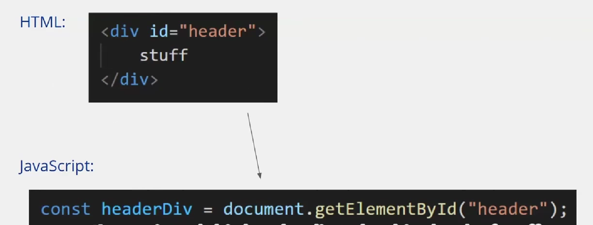
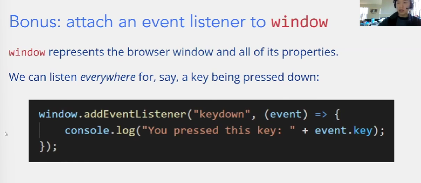

# web basic

## html

html是描述网站的内容的，是一种超文本标记语言。

tips

* html的语义化，不要使用div作为全部的模块，尽可能使用对应的语义块

## CSS

css是层叠样式表，a list of description

css的基础形式

```css
selector{
	//a list of the description like
    property: value;
}
```

### selector

css为html元素提供样式修改，如何选择要影响的html就是selector做的事情

* class selector

```css
。classA{
	color: red;
}
<div class = "classA" > hello </div>
```

* id selector

```css
#Aid{
	color: red;
}
<div id="Aid" > hello </div>
```

上述两种selector的区别在于，一个html元素可以有多个class，但是却只能有一个id

```css
<div id="aaa">
<div class="a b c">
```

在上述这个例子中，第二个div同时属于a,b,c三个class

同时整个html中的id必须是唯一的，唯一的id作用与唯一的html元素，但是同一个class可以作用于多个元素

### html元素

对于css而言，那些特殊的，语义化的元素例如h1都是有默认的description的；另外的那些简单的元素比如div就只有简单的描述，比如div唯一的描述就是display: block

但是通过css，我们可以用selector选中并且覆盖他们的默认description

**链接html和css**

```css
在head里面
<link href="style.css"/>
```

### css variables

我们可以定义一些变量，并且在全局里去使用它，其定义方式如下

```css
:root{
    --primary: #396dff;
    --grey: #f7f7f7;
    --white: #fff;
}
```

其调用方式

```css
.navTitle{
    color: var(--primary);
}
```

### box model

​​

html元素的整体样式是一个box model

### css布局

这里主要教学了flex布局，flex布局的主要形式是一列元素，这个一列是抽象的说法，实际上可以设定方向

[A Complete Guide to Flexbox | CSS-Tricks - CSS-Tricks](https://css-tricks.com/snippets/css/a-guide-to-flexbox/)  这是参考的链接

```css
.container{
   display: flex;
}
```

上述代码为基础的使用方式，一般在需要flex布局的地方外面套一个div作为container，定义flex布局

接下来我会记录flex布局中一些最基础的属性，其可以分为两部分，一个是作为contianer的属性，一个是container内部的item的属性

**contianer**

```css
.container {
	flex-direction: row | row-reverse | column | column-reverse;  这一列的方向
	flex-wrap: nowrap | wrap | wrap-reverse;                     是否会换行

	flex-flow: column wrap;  这个属性是上述两个属性的总和简写模式
}
```

**items**

```css
.items{
	order: 5;  用来调整item在这一列中的顺序，如果顺序相同的话就按在html里的原顺序来
	flex-grow: 4; /* default 0 */  用来说明其在这一列中所占的比例
	flex-shrink: 3; /* default 1 */ ？
	flex-basis:  | auto; /* default auto */   是用来说明item的基础大小，可以是数值也可以是比例，其和flex-grow联动即可解决布局中的大多问题
}

```

例如如果需要四个元素排列成四宫格，首先flex-wrap选择wrap，flex-basis选50%,flex-grow选1

**utility class**

通常指一些常用的css标志，作为一个class存在，应用于很多html元素

```css
.u-textCenter{
    text-align: center;
}
```

类似于上述这种例子，内容简单但是会用于很多的html元素

**order**

css存在一些特性，他们可以接受不定项个数据，根据输入的数量不同适用于不同的规则

```css
margin: 0;   四条边都是0
margin: 10 20 30 40;  上右下左
margin: 10 20 30;     上（左右）下
margin: 10 20;       （上下）（左右）
```

**8pt grid system**

让整个网站中所有的size，都以8的倍数为size，会使得整个网站更有设计感

### css资源

**bootstrap**

一个资源库，里面有一些ui组件

**font choose**

网上有一些网站为我们提供了丰富的字体选择，例如[Browse Fonts - Google Fonts](https://fonts.google.com/?query=open+sans)

以如下方式使用

```css
@import url('https://fonts.googleapis.com/css2?family=Open+Sans:wght@300;400&display=swap');

body{
    font-family: 'Open Sans', sans-serif;
}
```

上述两组信息，网站都会提供给我们

## javascript basic

> 在Chrome中打开控制台-> ctrl + shift + i

javascript的核心思想是让整个网页变得interactive

js同时也可以manipulate整个网页的内容

js和我们平时接触的一些编程语言java，python是比较相似的，但是我们使用===, !==作为条件判断等于和不等于

### basic part of js

**变量定义**

```javascript
let myJudge = true;
```

当我们初次使用一个变量的时候，应当使用let关键词把它定义出来。

* js中存在const变量，其需要如下定义。const变量和其他编程语言中类似，在定义初始化之后，不再能被赋值

```javascript
const myans = 10;
```

* underfined and null 这两种在js是不同的存在

```javascript
let firstName; 此时这个变量是underfined
firstName = "aaa";
firstName = null; null用来清空这个变量
```

* we now shouldn't use keyword 'var'. We should use the 'let' instead. ?

**输出**

我们可以使用console.log()作为输出，于是我们可以在浏览器的console内部查看输出

但是console输出并不是唯一的选择，我们往往也会采用一些更加容易显示的方式作为输出。例如alert

```javascript
alert("hello");
```

这段js代码会跳出一个弹窗，内容是hello

**条件语句和循环语句**

like C/C++

**advanced data type**

* array  其定义的方式和使用的方式都是较为熟悉的

```javascript
let pets = ["pig","dog","cat"];
console.log(pets[2]);
pets[0] = "big pig";
pets.push("bird");
let lengthOfArray = pets.length;
```

js的array是更加强大且灵活的type，有自己的操作集合likeC++的vector，经典的可以使用pop，push

> 在js中我们并不强制array必须是相同元素的，但是往往在编程中当你需要把不同类型的元素强行合在一个数组中时，会有更好的解决方法

* map and filter method

```javascript
myArray.map(onefunction); 内部要传入一个function,以数组的元素为参数，并且返回值成为新的数组的元素
myArray.filter(onefunction): 以数组的元素为参数，返回值应当是布尔值，判断这个数据是否要被筛选掉
一个例子
let newArray = myArray.map(x => x+2);  对每个元素加2并返回新的数组
let newArray = myArray.filter(x => x >=0);
```

### function

function的使用在js中稍微有些不同。

其基础的定义形式是 parameters => {bodys};  记得函数定义的末尾要加' ; '，设计体现了函数定义其实和变量定义的类似性

```javascript
const celsiusToFahrenheit = tempC =>{
	const tempF = tempC * 1.8 + 32;
	return tempF;
}
console.log(celsiusToFahrenheit(10));
```

在js中，functions can be passes around like any other variable.

在C/C++中我们往往通过函数指针实现这个结果，但是在js中我们实现地更加简单易懂

```javascript
const addTwo = x=>{return x+2;};
const changeArray = (array, callback)=>{
	for(let i=0;i<array.length;i++){
		array[i] = callback(array[i]);
	}
};
let myArr = [1,2,3];
changeArray(myArr, addTwo);
```

* anonymous functions 匿名函数，或者说是临时的一个函数。对于一些简单的函数等等，我们可以用如下的方式进行使用

```javascript
changeArray(myArr, x=>{
	return x*2;
});
```

还有更加简易的写法

```javascript
changeArray(myArr,x=>x*2);
```

### object and class

**object**

```javascript
const objectName = {
	items : value,
	items : value
}:
```

可以有一些简易的方法去获得object内部的元素

```javascript
const myCar = {
	make : "ford",
	model : "mustang",
	year  : 2005
};
const {make, model} = myCar;
```

虽然js和java没有关系，但是其在object和数组的表示上遵从和java类似reference type的模式，也即它们本身都是指针。因此有如下代码

```javascript
let arr1 = [1,2];
let arr2 = [1,2];
arr1 === arr2; 该结果为false，因为比较的是双方的地址
```

因此在赋值方面也遵循和java类似的原则，也即对于reference type任何的赋值都是只是地址的传递，它们指向同一块内存

```javascript
let myCar = {
	make : "ford",
	model : "mustang",
	year  : 2005
};
let anoCar = myCar;
anoCar.year = 2000; 实际上同时改变了anoCar和myCar内部的year
```

当我们需要做真正的拷贝的时候，可以用 ... 来做，...操作符会做一个类似于展开的工作

```javascript
let copyArr = [...arr];
let copyObj = {...obj};
```

**class**

接下来出现的class概念，会更接近于我们之前接触的面向对象编程的概念

```javascript
class Rectangle{
	constructor(width, height){
		this.width = width;
		this.height - height;
	}

	getArea = () => {
		return this.width * this.height;
	};
}
const rect = new Rectangle(1,32);
```

### DOM and js

我们往往把js文件加入到html代码的末端

```html
<script src="index.js"></script>
```

#### js如何与html交互

如何用js访问html的元素，在js中以id寻找html元素是最基础的

​​

对于获取到的html元素，我们可以做修改

```javascript
headerDiv.innerHTML = "hello world";
headerDiv.style.color = "red";
```

也可以增加元素，例如增加新的一列列表

也可以增加交互性

```javascript
const button = document.getElementById("button");
button.addEventListener("click", ()=>{
	alert("hello");
});
```

​​

### js workshop

在多文件的条件下，js文件之间可以直接调用对方的函数，只要在最后把所有用到的js文件都加入到html文件上

weblab 为js基础设计了一个贪吃蛇的游戏作为练习，下面是一些核心的code

```javascript
const draw = () => {
  gameBoard.innerHTML = ''; //清空内部的html
                            //使得可以重新绘制
  drawSnake(gameBoard);
};
const drawSnake = (gameBoard) => {
  for (let i = 0; i < snakeBody.length; i++) {
    const segment = snakeBody[i];
    const snakeElement = document.createElement('div');
    snakeElement.style.gridRowStart = segment.y;
    snakeElement.style.gridColumnStart = segment.x;
    snakeElement.classList.add('snake');  //让这个块加入到class中以适应CSS
    gameBoard.appendChild(snakeElement);
  }
};
```
