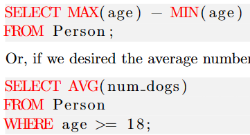
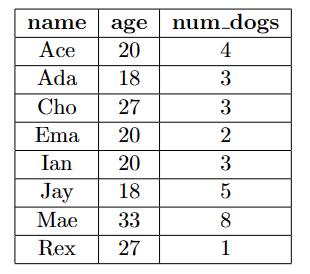
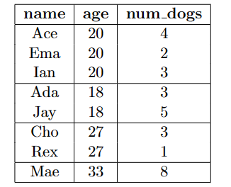

# SQL

### query

这部分主要处理是筛选的需求

**the fundamental SQL query**

```sql
SELECT <columns>
FROM <table>;
```

选择哪个表（table）,选择这个表里的哪些attributes,(columns)  并且全部输出

如果使用SELECT DISTINCT，会在输出中删除重复的部分。

tips：在不加说明的情况下，输出表的内容是unorder的

**where**

```sql
SELECT name , num_dogs  第三个执行
FROM Person				第一个执行
WHERE age >= 18;		第二个执行
```

上述是一个简单例子，很多时候我们只关注table里面的几行内容，因此有WHERE关键词，后面加上的一个条件判断符。

tips：SQL语句的执行顺序，是按照顺序执行，但是SELECT语句是最后执行的

对上述代码就是，先找到Person这个表，再找到age这个属性大于18的行，再输出这些行的name和num_dog列

**boolean operators**

SQL有基础的AND  NOT   OR三个布尔逻辑符号，来链接WHERE内部的逻辑关系

```sql
...
WHERE  age>=11
	AND num_dog>2;
```

**aggregate functions**

这些函数用来处理整个column，做一些统计工作，一般会返回一个value（其实本质上是一行一列的表？），其在处理的时候会跳过NULL值，但是在FUNCTION（*）时不会跳过

基础的aggregate function有以下几个

```javascript
SUM(age) is 72.0, and SUM(num dogs) is 10.0.
AVG(age) is 18.0, and AVG(num dogs) is 3.3333333333333333.
MAX(age) is 27, and MAX(num dogs) is 4.
MIN(age) is 7, and MIN(num dogs) is 3.
COUNT(age) is 4, COUNT(num dogs) is 3, and COUNT(*) is 4
```

上述函数一般在SELECT选择column的时候调用

​​

**GROUP BY 和 HAVE**

```javascript
GROUP BY <columns>
HAVE 条件语句
```

GROUP BY的意识是把列表按照一个列分组，其最终的结果可以促使aggregate function的输出不再是一个一行一列的table。GROUP BY age其效果如下图

​----->​

其中的HAVE语句就是对分出来的各个GROUP做筛选，例如COUNT(*) > 1 最后一个GROUP就会被筛掉

```sql
SELECT age , AVG( num dogs )	5
FROM Person						1
WHERE age >= 18					2
GROUP BY age					3
HAVING COUNT( ∗ ) > 1 ;			4
```

**ORDER BY**

对于其进行排序的做法

### join

‍

### **错误的SQL**

最后SQL的结果是由SELECT语句确定，我们需要确定的是，这里面所有的columns拥有相同数量的rows，例如对于上述这个例子

```javascript
SELECT age , num dogs			5
FROM Person						1
WHERE age >= 18					2
GROUP BY age					3
HAVING COUNT( ∗ ) > 1 ;
```

如果不加上AVG，那么就会报错，因为age其实已经被划分了，所有相同数值的age被划分成了一个，但nums_dogs并未被划分，因此会导致数量不对齐

‍

### DBMS 使用 以sqlite为例

> 环境：Ubuntu2204 sqlite3

打开的方式 `sqlite3 file.db`​   退出终端  ctrl-d

一个db文件在DBMS视角下一般由多个table构成，可以用`.table`​的指令查看所有的table

* ​`.schema tablename`​ 来查看每个table的attributes
* 可以直接在终端编写sql 查询，要记得在结尾加上‘；’作为一个sql查询指令的结尾
* ​`.read sqlfilename`​ 多数时候我们把sql文件写在外面，可以通过.read指令直接调用外部sql文件里的sql指令

‍
